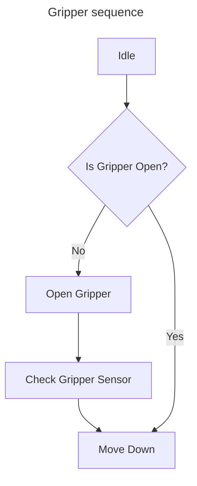
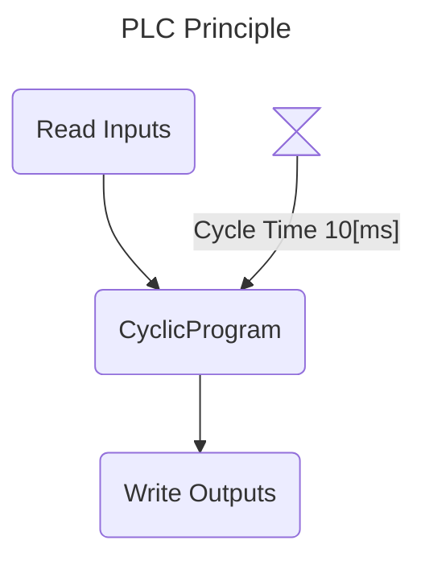
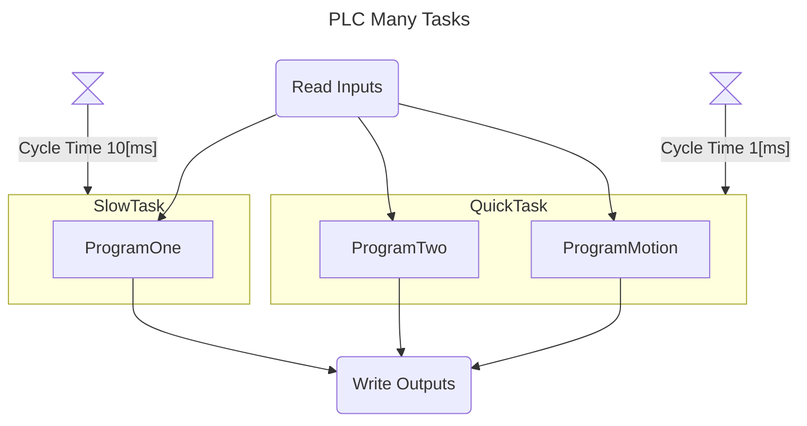
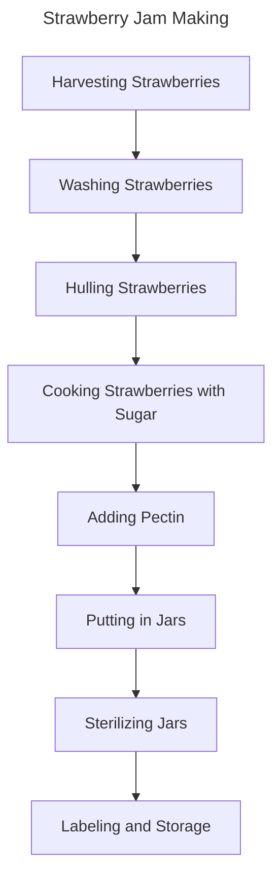
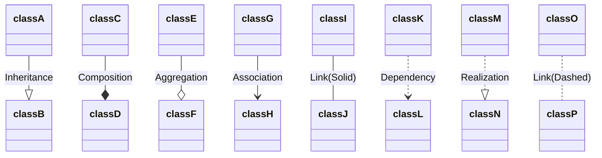
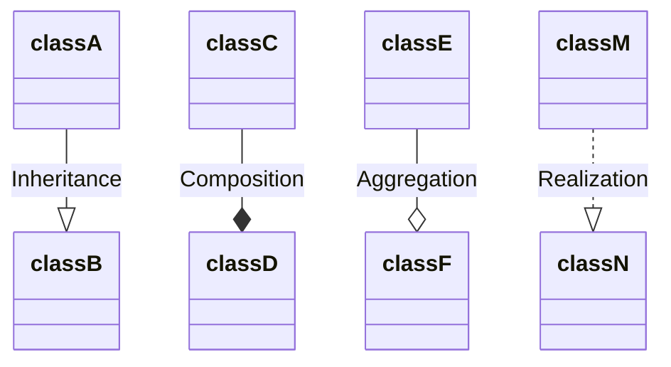
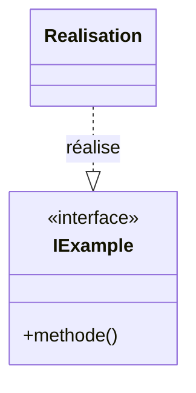
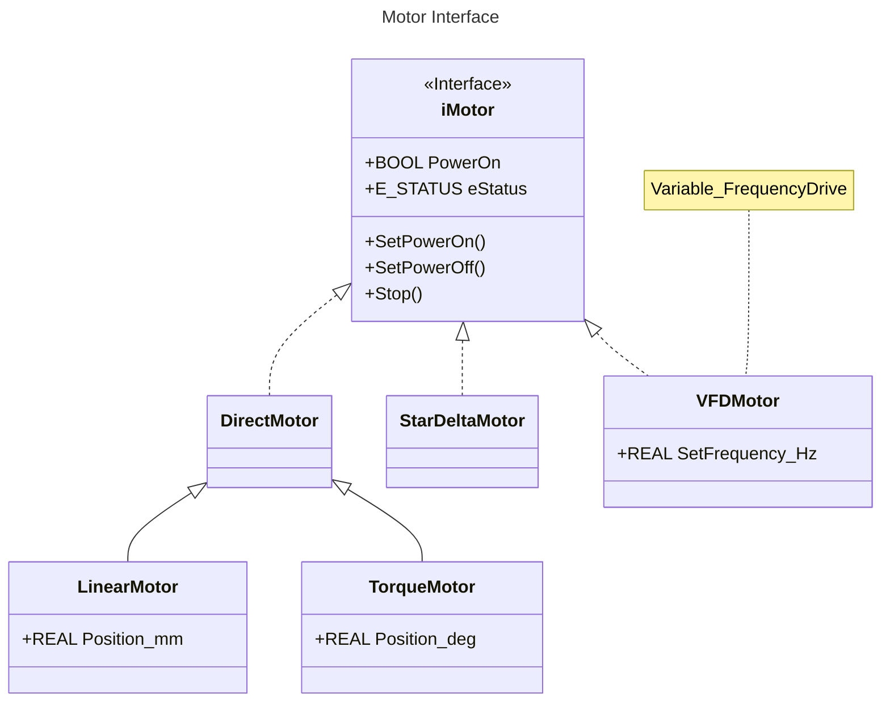
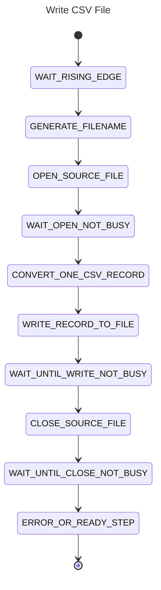
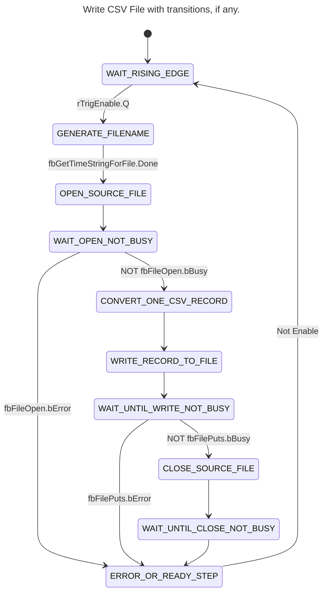

<h1 align="left">
   
  
   
  HEI-Vs Engineering School <h2>AAut Advanced Automation </h2>
   
</h1>

[Cédric Lenoir](mailto:cedric.lenoir@hevs.ch)

# Annex 01 /  System Engineering

## Overview
This module presents the basic tools for modeling an automation system inspired by [SysML](https://sysml.org/).

It also presents a series of open-source tools that allow you to apply the theory using current tools freely available within the framework of the courses offered by HEVS.

## Key Takeaways
This course presents a working method that allows you to:

- model part of the code by adapting certain standard tools to the specificities of PLCs.

- generate part of the code using generative AI, in this case Copilot in [Visual Studio Code](https://code.visualstudio.com/).

- document the code, particularly using tools such as [Mermaid.js](https://mermaid.js.org/).

- we will also present Node-RED, whose [Dashboard 2.0](https://dashboard.flowfuse.com/) palette allows you to integrate documentation in [Markdown](https://www.markdownguide.org) format directly into the user interface.

The tools presented here do not replace the classic development environments provided by PLC manufacturers, but they complement them.

## What You Need to Know
You must be able to use and code three types of diagrams that will be used in the automation courses.

- Class or Object diagrams, Block Definition Diagrams (SysML terminology).

- Flowchart diagrams, or Activity Diagrams (SysML terminology).

- State diagrams, or StateMachine diagrams (SysML terminology).

The chosen diagrams do not strictly adhere to the SysML definition, but similarly, no diagrams exist that allow for a strict representation of the IEC-61131-3 standard, particularly the specific behavior of functional blocks.

We will use the Mermaid framework to represent these diagrams in Markdown documents.

These representations offer the advantage of being usable, archived, and viewed using Git-based platforms, namely GitHub and GitLab.

- GitHub is used as the external distribution system for HEVS automation courses.

- GitLab is used as the internal project archiving system at HEVS. Students do not have open access to the HEVS GitLab repository, hence the use of GitHub.

Within the automation course, these tools will primarily be used via Visual Studio Code (https://code.visualstudio.com/).

All the tools were selected because:

- they are open source and can be used free of charge for students,

- they are available on Windows, macOS, and Linux platforms.

## Industrial Automation in Evolution
Industrial automation is in a transitional phase. By 2025, several development environments from major vendors will offer upgrades to environments that move away from traditional, primarily graphical IDEs towards text-oriented environments to facilitate the use of code management systems like Git.

At the time of writing, the new Simatic AX environment is still in a version reserved for a few test clients. (Simatic AX) (https://github.com/simatic-ax).

I am keeping my bet on the IEC 61131-3 code because the standard was revised in 2025 and remains a current standard that will very likely still be present around 2035.

## Keywords
- A **[State Diagram](https://mermaid.js.org/syntax/stateDiagram.html)** (or state diagram) is used to represent the different states of a system and the transitions between these states. It is particularly useful for modeling the dynamic behavior of a system, such as finite state machines, where the system can be in one state at a given time and transition to another state in response to specific events or conditions.

- An **Activity Diagram**, also known as a **[Flow Chart](https://mermaid.js.org/syntax/flowchart.html)**, is used to represent the flow of control or data between different activities within a system. It is often used to model business processes or algorithms, showing how activities are linked and how decisions and loops influence the overall flow.

- A **[Class Diagram](https://mermaid.js.org/syntax/classDiagram.html)** or class diagram is used to represent the static structure of a system by showing the classes, their attributes, their methods, and the relationships between them. It is essential for object-oriented modeling, allowing visualization of the main components of a system and their interactions.

> In automation, the **State Diagram** is primarily used for modeling a program. It is particularly well-suited to the cyclic programs of automated systems.

> The **Activity Diagram** is used to model automated functions by abstracting away the coding. This is called Function Specification, and it allows for the validation of functionalities before they are coded.

> In object-oriented programming, we talk about **classes** and **objects**. This distinction is not really relevant in PLC programming, since there is no dynamic allocation.

# Extensions used for Visual Studio Code
The extensions used in this course on VScode are:

- [GitHub Copilot](https://marketplace.visualstudio.com/items?itemName=GitHub.copilot): GitHub Copilot is an AI-powered code completion tool that helps you write code faster and with fewer errors by suggesting whole lines or blocks of code as you type.

- [GitHub Copilot Chat](https://marketplace.visualstudio.com/items?itemName=GitHub.copilot-chat): GitHub Copilot Chat provides an interactive chat interface within VS Code, allowing you to ask questions and get coding assistance from GitHub Copilot in a conversational manner.

- [Markdown All in One](https://marketplace.visualstudio.com/items?itemName=yzhang.markdown-all-in-one): This extension provides a comprehensive set of tools for working with Markdown in VS Code, including shortcuts, table of contents generation, and more.

- [Markdown Preview Enhanced](https://marketplace.visualstudio.com/items?itemName=shd101wyy.markdown-preview-enhanced): This extension enhances the built-in Markdown preview in VS Code with additional features like rendering diagrams, exporting to various formats, and more.

- [Markdown Preview Mermaid Support](https://marketplace.visualstudio.com/items?itemName=bierner.markdown-mermaid): This extension adds support for rendering Mermaid diagrams in the Markdown preview, allowing you to visualize flowcharts, sequence diagrams, and more directly within VS Code.

- [Structured Text Language Support](https://marketplace.visualstudio.com/items?itemName=Serhioromano.vscode-st): This extension provides syntax highlighting, IntelliSense, and other language support features for Structured Text, a programming language used in industrial automation.

# [Mermaid Flowchart](https://mermaid.js.org/syntax/flowchart.html)
This type of diagram should primarily be viewed as a communication diagram. It allows you to validate the functionality of a process before proceeding to coding.

## Example with a gripper, *gripper*.

In this case, the diagram mainly serves to formalize a standard language, such as:

> When the system is in the resting state, *Idle*, it checks if the gripper, *Gripper*, is open. If the gripper is not open, the system opens the gripper, then checks the gripper's sensor. Once this check is performed, the system moves to the next position. If the gripper is already open, the system moves directly without opening the gripper.

  <figure>

   </figure>

## Example with a PLC

### PLC with a single task.

  <figure>

   </figure>

### PLC with multiple tasks

Here, we represent the reading of inputs, then ProgramOne with a cycle time of 10 ms, ProgramTwo and ProgramMotion with a cycle time of 1 ms, and finally the writing of outputs.

> Note that the diagram below will be difficult to generate without the help of AI.

  <figure>

   </figure>

## Strawberry Jam.

This is a case of formalizing a process.

<figure>

   </figure>

## Summary of an Activity Diagram
There is a fundamental difference between a state diagram, as seen in the basic automation course and summarized below, and an activity diagram.

### The Activity Diagram or Flowchart
Used to model reality.

### The State Diagram...
Used to model the program.

> In the case of the jam recipe, we can use the activity diagram to create a state diagram.

# [Class Diagram](https://mermaid.js.org/syntax/classDiagram.html)
This type of diagram allows us to represent the program's architecture.

The following links are important to know

  <figure>

</figure>

### As a reminder
- **Inheritance**, or legacy, **class A** takes the elements of **class B** and completes them.

- **Composition**, this is typically the case of a Function Block that is composed of one or more other Function Blocks; here, a **gripper D** would be composed of at least one **pneumatic actuator C**.

- **Aggregation**, this is the case of passing by reference; class E exists in memory outside of class F, but is used by it. In IEC 61131-3, this is called `VAR_IN_OUT`.

The three preceding elements have already been covered in Basic Automation; what we are adding this year is the concept of **Realization**.

### Link between interface and realization

An **interface** defines a contract or a set of methods that concrete classes must implement. The **implementation**, or implementation, is the concrete class that provides the actual code for each method of the interface.

In UML, this link is represented by a solid arrow with an empty triangle pointing towards the interface:

  <figure>

</figure>

This means that `Realisation` implements the `IExample` interface.

- **iMotor** is an interface that defines two properties: `PowerOn`, of type BOOL, and `eStatus`, of type E_STATUS.

- Three classes implement this interface: **DirectMotor**, **StarDeltaMotor**, and **VFDMotor**.

- **VFDMotor** has an additional property: `SetFrequency_Hz`, of type REAL. A note indicates that VFDMotor corresponds to a "Variable_FrequencyDrive".

- **DirectMotor** is a base class for two derived classes:

- **LinearMotor**, which adds the property `Position_mm` (position in millimeters), of type REAL, inherits from **DirectMotor**.

- **TorqueMotor**, which adds the property `Position_deg` (position in degrees), of type REAL, inherits from **DirectMotor**.

This diagram illustrates an inheritance hierarchy where different types of motors share a common interface, some having specific properties depending on their type.

- In particular, the interface defines three methods, **SetPowerOn()**, **SetPowerOff()**, and **Stop()**, which must be implemented regardless of the motor type. This offers an advantage at the user interface level, as it will be impossible to define an interface without considering the type of motor that will be turned on or off from the interface.

- Similarly, it guarantees that whatever type of motor is implemented in the program, it must be able to receive these three commands.

# [State Diagram](https://mermaid.js.org/syntax/stateDiagram.html)
The state diagram contains only two types of objects. We disregard the starting black dot and the circle with a dot at the end.

- The starting black dot represents the program's start during the first cycle. In some PLCs, a final cycle can be defined when the PLC is shut down. The start and end points are not states, however, they can define the initial state; below is the first state.

- A **state** corresponds to a single value of an ``Enum`` within a ``CASE..OF``.

- A **transition** corresponds to a condition for moving from one state to another.

This type of diagram allows us to represent the internal behavior of the program, primarily the use of IEC-61131-3 ``CASE..OF` code.

  <figure>

</figure>

## Transitions can be added
The example below is not complete; it is an excerpt.

  <figure>

</figure>

# Your Job
Install Visual Studio Code and the extensions [mentioned above](#extensions-used-for-visual-studio-code) and familiarize yourself with Markdown and Mermaid.

## Option 1
You can install Git on your PC. This will allow you to easily load and edit the course materials, and then save them to GitHub if necessary. GitHub is a fundamental programming tool. The existence of GitHub means that data loss in a program can no longer be considered an accident, but rather a serious programmer error.

Visual Studio Code natively allows you to load and save data to GitHub, provided that Git is installed beforehand.

## Option 2
For the automation lab, we will use Node-RED. [Installation takes a few minutes](https://nodered.org/docs/getting-started/local).
