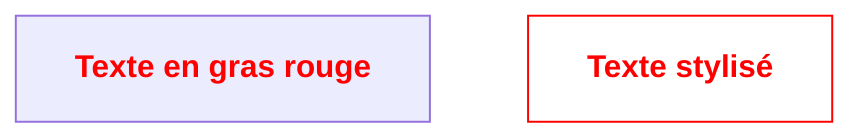
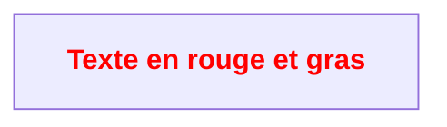

Pour un cours d'automation public d'une haute école publique, il est recommandé d'utiliser une licence open source permissive. Voici quelques options courantes :

Dans Mermaid, il n'est pas possible d'afficher du texte en gras et en rouge directement avec la syntaxe Markdown. Cependant, vous pouvez utiliser les classes CSS de Mermaid pour styliser certains éléments de diagramme. Par exemple, pour un nœud avec du texte en gras et en rouge dans un diagramme de type flowchart :



Notez que le support des balises HTML ou des classes CSS dépend du moteur de rendu Mermaid utilisé (certains éditeurs peuvent restreindre ces fonctionnalités).
Dans un diagramme Mermaid, il n'est généralement pas possible d'insérer directement du HTML comme `<span style="color: red; font-weight: bold;">Texte</span>`. Cependant, si votre moteur de rendu Mermaid le permet, vous pouvez essayer d'utiliser des balises HTML dans les labels, comme ceci :



Attention : le rendu dépend du support HTML de votre éditeur Mermaid. La méthode la plus fiable reste l'utilisation des classes CSS Mermaid, comme montré ci-dessus.
Voici comment écrire du texte en **rouge et gras** en HTML :

```html
<span style="color: red; font-weight: bold;">Texte en rouge et gras</span>
```

En Markdown standard, il n'est pas possible de styliser directement le texte en rouge et en gras. Cependant, vous pouvez utiliser du HTML dans votre fichier Markdown pour obtenir cet effet :

```html
<span style="color: red; font-weight: bold;">Texte en rouge et gras</span>
```

Cela fonctionne dans la plupart des visualiseurs Markdown qui supportent le HTML inline.
Voici une explication textuelle du diagramme de classes présenté :

- **iMotor** est une interface qui définit deux propriétés : `PowerOn` (de type BOOL) et `eStatus` (de type E_STATUS).
- Trois classes implémentent cette interface : **DirectMotor**, **StarDeltaMotor** et **VFDMotor**.
    - **VFDMotor** possède une propriété supplémentaire : `SetFrequency_Hz` (de type REAL). Une note indique que VFDMotor correspond à un "Variable_FrequencyDrive".
- **DirectMotor** est une classe de base pour deux classes dérivées :
    - **LinearMotor**, qui ajoute la propriété `Position_mm` (position en millimètres, de type REAL).
    - **TorqueMotor**, qui ajoute la propriété `Position_deg` (position en degrés, de type REAL).

Ce diagramme illustre une hiérarchie d’héritage où différents types de moteurs partagent une interface commune, certains ayant des propriétés spécifiques selon leur type.

Dans un diagramme d'états (state diagram) UML :

- Le **rond noir** au départ représente l’**état initial** (ou "initial node"). Il indique le point de départ du système ou du processus modélisé.
- Le **rond avec un point au milieu** à la fin représente l’**état final** (ou "final node"). Il marque la fin du processus ou du cycle de vie de l’objet.

Ces symboles permettent de visualiser clairement où commence et où se termine le comportement décrit par le diagramme.

La norme DIRECTIVE 2006/42/CE (directive Machines) sera remplacée par le **Règlement (UE) 2023/1230** relatif aux machines. Ce nouveau règlement a été adopté en juin 2023 et entrera en application à partir du 20 janvier 2027. Contrairement à une directive, un règlement européen s’applique directement dans tous les États membres sans transposition nationale.

