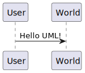
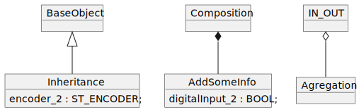

<h1 align="left">
  <br>
  
  <br>
  HEI-Vs Engineering School - Industrial Automation Base
  <br>
</h1>

Course AutB

Author: [Cédric Lenoir](mailto:cedric.lenoir@hevs.ch)

Some links on this page
-   [Create your first diagram](#create-your-first-diagram)
-   [State Diagram](#state-diagram)
-   [Activity Diagram](#activity-diagram)
-   [Object Diagram](#object-diagram)
-   [Time Diagram](#time-diagram)

# How to create UML with Visual Studio Code and PlantUML
We suppose Visual Studio Code is installed

## Install the PlantUML Extension in Visual Studio Code
<figure>
    
    <figcaption>Add PlanUML to VS Code</figcaption>
</figure>


## Check that java is installed in your PC
With ```Command Prompt```.

```
>java -version
```
Should return
```
java version "1.8.0_261"
Java(TM) SE Runtime Environment (build 1.8.0_261-b12)
Java HotSpot(TM) 64-Bit Server VM (build 25.261-b12, mixed mode)
```
## Install Graphviz
[Graphviz](https://graphviz.org/)

<figure>
    
    <figcaption>Graphviz Install Options</figcaption>
</figure>

> We recommend restarting your machine after you install Java and GraphViz, otherwise your PlantUML Preview will be empty or show an error!.

## Create your first diagram

Create a text file in the folder of your choice and rename it with ```testDiagram.puml``` **Do not forget extension**.

> Avoid special characters in file name to not have something like ```%20``` for ```-```.

Open the file with Visual Studio Code.

Type the code for the test diagram in the UML file
```
@startuml TestDiagram
User->World : Hello UML!
@enduml
```

> Avoid special characters in diagram.

Type ```Alt + D``` to preview your diagram.

You should view something like that: 
<figure>
    
    <figcaption>Hello UML!</figcaption>
</figure

 ## Generate your UML diagram in SVG form.
 Press ```F1```
 <figure>
    
    <figcaption>GenerateSVGfileFromPUML</figcaption>
</figure

Select SVG for exeport. The file will be saved in the folder ```testDiagram``` with name 

Publish your image with ```md``` syntax
```md
[My test diagram in SVG form](./puml/testDiagram/TestDiagram.svg)
```



Or publish your image with ```html``` syntax if you want to center it with caption-
```html
<p align="center">
  
  <figcaption>Publish your image with html to center it !</figcaption>
</p>
```
<p align="center">
  
  <figcaption>Publish your image with html to center it !</figcaption>
</p>

> Image centered with Visual Studio Code preview, but not in GitLab.

# More examples.
[Complete syntax for PlantUML is available online](https://plantuml.com/)

> It is suggested to build one file to generate each diagram.

## Base diagrams for automation
- State Diagrams
- Activity Diagrams
- Object Diagrams *Class diagrams details can be omitted for the needs of IEC 61131-3 in base automation*


## State Diagram
```
@startuml
[*] --> Clearing
Clearing --> Resetting
Clearing : Clearing_SC := TRUE

Resetting --> [*]
Resetting : Resetting_SC := TRUE

Clearing -> Stopping
Stopping --> [*]
@enduml
```
> State diagram should contain exactly the number of states as in the code for a ```CASE..OF``` with ```ENUM```. **It is a representation of the code**. 
<figure>
    
    <figcaption>Example of a State Diagram</figcaption>
</figure>

## Activity Diagram

```
@startuml
start
:Init Axis;
:Move Axis **Up**;
repeat
    :Axis Sychronized;
repeat while (Still synchronized?) is (yes)
->no;
: Emergency Stop;
stop
@enduml
```

> An activity diagram should be seen more as a support for **Design Specification** than a direct representation of the code.

> An activity diagram should be drawn up in general terms for partners **not involved in coding**. 

<figure>
    
    <figcaption>Example of an Activity Diagram</figcaption>
</figure>

## Object Diagram
For strict formalism of Object Oriented Programming, **OOP**, class diagram should be used. But on another side, UML is not well adapted for IEC61131-3 classic code. That why we use Object Diagram for representation of ```STRUCT``` and ```Function Blocks```. See AutB course for more details.

 ### Relations

 ```@startuml
object BaseObject
object Composition
object Agregation
object Inheritance
Inheritance : encoder_2 : ST_ENCDODER;
object AddSomeInfo
AddSomeInfo : digitalInput_2 : BOOL;
object IN_OUT

BaseObject <|-- Inheritance
Composition *-- AddSomeInfo
IN_OUT o-- Agregation
@enduml
```
> For IEC61131-3 programming, you should know what are **Inheritance**, **Composition** and **Agregation**.

<figure>
    
    <figcaption>Relations in Object Diagrams</figcaption>
</figure>

## Time Diagram
This is not a UML TOOL, but maybe the most easy way to build a time diagram.

You can use PlantUML to build this kind of diagram, with the code example below.

<figure>
    
    <figcaption>Exemple of a IEC 61131-3 R_TRIG</figcaption>
</figure>

```@startuml
clock   "CycleTime_10ms" as C0 with period 10
binary  "Input"  as B
binary  "Output"  as C

@0
B is Idle
C is Idle

@30
B is high
C is high

@40
B is high
C is Idle

@100
B is Idle
C is Idle
@enduml
```
# A use case for state diagram
Plant UML allows you to generate relatively complex cases quickly and in Open Source, but makes it difficult to choose the free arrangement of states.

## PackML State Diagram

<figure>
    
    <figcaption>The PackML State Diagram</figcaption>
</figure>

```@startuml
State PackML{
    State Aborted #LightGreen
    State Aborting #LightYellow

    state Not_Abort {
        state Clearing #LightGreen
        state Stopping #LightGreen
        state Stopped #LightYellow

            state Not_Stop {
            state Resetting #LightGreen
            state Idle #LightYellow
            State Starting #LightGreen
            State Execute #SkyBlue
            State Completing #LightGreen
            State Complete #LightYellow

            State Suspending #LightGreen
            State Suspended #LightYellow
            State Unsuspending #LightGreen

            State Holding #LightGreen
            State Held #LightYellow
            State Unholding #LightGreen
        }
    }
}

Aborting --> Aborted : SC
Aborted --> Clearing : Clear
Not_Abort --> Aborting : Abort

Not_Stop --> Stopping : Stop

Clearing --> Stopped : SC

Stopping --> Stopped : SC

Stopped --> Resetting : Reset
Resetting --> Idle : SC
Idle --> Starting : Start
Starting --> Execute : SC
Execute --> Completing : SC
Completing --> Complete : SC
Complete --> Resetting : Reset

Execute --> Suspending : Suspend
Suspending --> Suspended : SC
Suspended --> Unsuspending : Un-Suspend
Unsuspending --> Execute : SC

Execute --> Holding : Hold
Holding --> Held : SC
Held --> Unholding : Un-Hold
Unholding --> Execute : SC

@enduml
```
