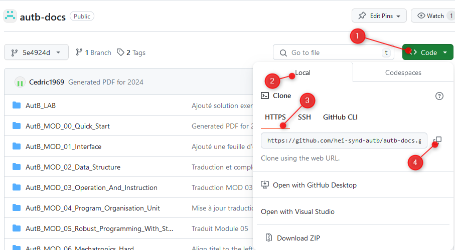
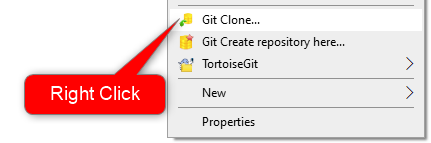
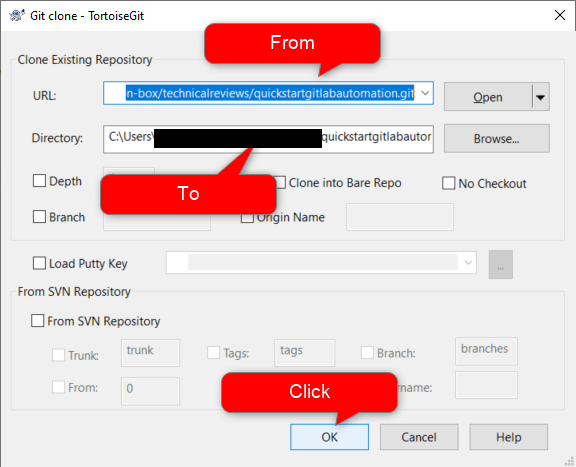
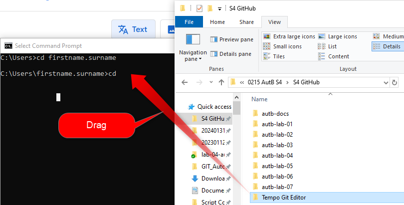

<h1 align="left">
  <br>
  
  <br>
  HEI-Vs Engineering School - Some Git Tools
  <br>
</h1>

Links on this page

- [GIT](#software-you-need-to-install-absolutly)
- [Tortoise](#software-nice-to-have)
- [VS Code](#nice-to-have-for-edition-of-documentation)
- [Git in command line](#getting-started-with-command-line)

## Software you need to install absolutely
[GIT](https://git-scm.com/downloads)

### Software nice to have
[TortoiseGit](https://tortoisegit.org/) or any other GUI for GIT.
If you do not want to use a GUI, you can use the [command line](#getting-started-with-command-line)

Once Tortoise Git is installed, you can clone the GitHub course with just a few clicks

<figure>
    
    <figcaption>GitHub</figcaption>
</figure>

[Cours AutB](https://github.com/hei-synd-autb/autb-docs/tree/5e4924dd991583212f7ccc61de74f5dc7b00dfc1)

<figure>
    
    <figcaption>Step 1: Select Clone Of AutB</figcaption>
</figure>

If Tortoise Git (and Git) are installed, select the place where you want a local clone of the Course AutB, for exemple: ``C:\********\Documents\AutB``

<figure>
    
    <figcaption>Step 2: Clone with Tortoise Git</figcaption>
</figure>

<figure>
    
    <figcaption>Step 3: Check Source and Destination.png</figcaption>
</figure>

> You have a copy of the whoole course on your computer.

### Nice to have for edition of documentation
[VS Code](https://code.visualstudio.com/)
You can use VS Code for GIT too.

> [Visual Studio Code has integrated source control management (SCM) and includes Git support out-of-the-box](https://code.visualstudio.com/docs/sourcecontrol/overview).


# Create your first Markdown file
In the folder where is ```.git``` **Not in .git !!!**:

1. create a file MyFirstDocumentation.md
2. open this file with Visual Studio Code.
3. Type something like that, with space between **#** and text.

```
# Titre 1
asdfahf

## Titre 2
sadfsadf

### Titre 3
asdfhhhsd

1. Puce 1
2. Puce 2

Mon premier document est prêt...
```

4.  Type ```Ctrl + à``` to split editor in Visual Studio Code
5.  Type ```Ctrl + Shift + V``` for preview in Visual Studio Code
6.  Save your file.

In the cmd prompt, in the folder where is your new file, type:

```
C:\Users\firstname.surname\Documents\GIT_QuickStart\quickstartgitlabautomation>git add MyFirstDocumentation.md
```

```
>git commit -m "Version de base"
```

Your file is still on your PC only, to send it to GitLab, you need a 

```
>git push
```

> Now your document is on GitLab and you know how to use the basic commands.

# How to check the URL of current git repository with TortoiseGit?
Vous pourriez vouloir savoir avec quoi est relié votre répertoire local.

1. Selectionner votre répertoire local
2. Ouvrez le répertoire ```.git```.
3. Ouvrez le fichier ```config```
4. Le chemin se trouve ici:
```
[remote "origin"]
	url = https://gitlab.hevs.ch/infrastructure/labos/automation-box/technicalreviews/quickstartgitlabautomation.git
```
<figure>
    
    <figcaption>How to check the URL of current git repository with TortoiseGit ?</figcaption>
</figure>

# Create UML diagrams with VS Code
[An exemple of how to build and integrate UML diagrams in SVG format in MD files](./CreateUMLwithExamples.md)

# Getting started with command line
*I do not use command line, that's just an example*
Open the Command Prompt, ```windows key + cmd```.

Once Git is installed
Type ```git --version``` to check that Git is installed.

```
C:\Users\firstname.surname>git --version
```

enter

```
C:\Users\firstname.surname>git --version
git version 2.42.0.windows.1
```

Type cd

```
C:\Users\firstname.surname>cd
```

Select the folder where you want your repository (or create it) and drag the path in cmd line

<figure>
    
    <figcaption>Drag Path</figcaption>
</figure>

Result
```
C:\Users\firstname.surname>cd "******Tempo Git Editor"
```
Type enter

Copy URL from GitHub
<figure>
    
    <figcaption>Step 1: Select Clone Of AutB</figcaption>
</figure>

Type ```git clone ```*with one space* in command line

```
C:\Users\******Tempo Git Editor>git clone
```

Paste the URL in the cmd line

```
C:\Users\******Tempo Git Editor> git clone https://github.com/hei-synd-autb/autb-docs.git
```

> Your first repository is ready to use.