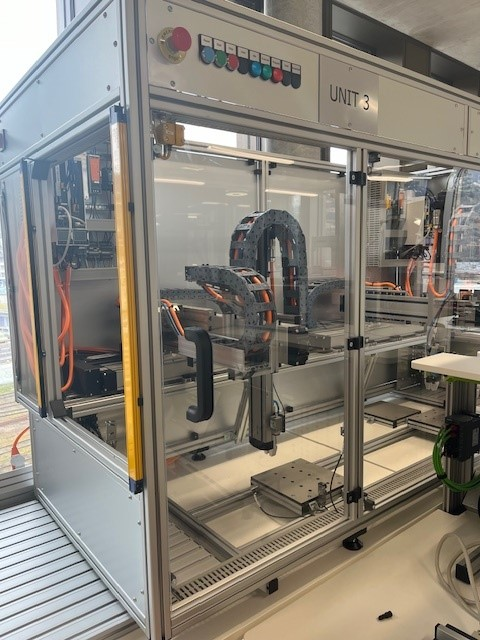
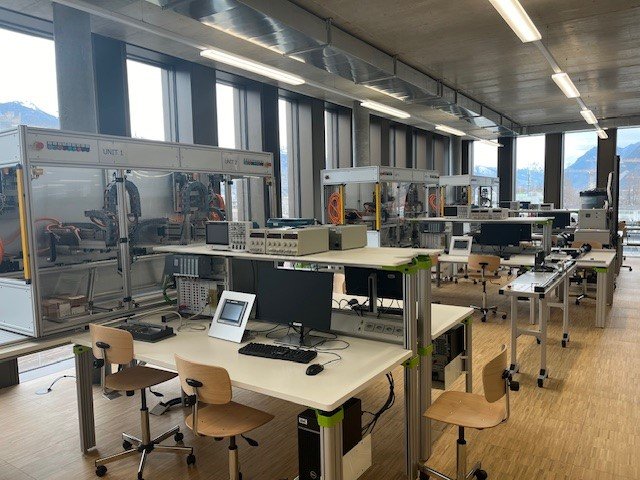

<h1 align="left">
   
  
   
  Industrial Automation Base - the Automation Boxes
   
</h1>

# Tools for the lab
> This section is a help for students, not part of the course.

- [List Of Software For Box Programming](ListOfSoftwareForBoxProgramming.md)

- [Some Git Tools](SomeGitTools.md)

- [Create UML using PlantUML with some examples](CreateUMLwithExamples.md)

# The lab

This is a short description of the laboratory of automation in Hes-so Valais/Wallis, Route de l'Industrie 23, 1950 CH-Sion.

The base of the lab is a unit with a cartesion robot, 3 axes, ctrlX Core in drive, that is a Real-time Linux integrated directly in one drive.

<figure>
    
    <figcaption>One Unit</figcaption>
</figure>

We have ten Units in the lab, allowing us to simulated a production line with real industrial network, Profinet.

<figure>
    
    <figcaption>Many Units</figcaption>
</figure>

# Industry 4.0 ready
The lab is connected with OPC UA servers, clients and Pub-Sub.
Each cell have a:
-   OPC UA Server and PubSub in the ctrlX Drive.
-   OPC UA Server and client in Siemens S7-1500.
-   OPC UA Server in a Baumer IO-Link Master.

Machine to machine is not a possibility, this is a fact. Depending of the configuration, we use:
- Siemens S7 controls the robot using OPC-UA methods.
- ctrlX Core of the robot controls the S7 as an IO-Manager.
