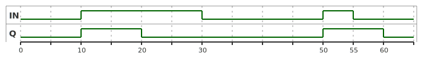

<h1 align="center">
  <br>
  
  <br>
  HEI-Vs Engineering School - Industrial Automation Base
  <br>
</h1>

Cours AutB

Author: [Cédric Lenoir](mailto:cedric.lenoir@hevs.ch)


# Module 00 Quick Start

*Keywords:* **Variables / Instructions / Cycle Time / Types / Triggers / Timers**

<figure>
    
    <figcaption>Logo International Electrotechnical Commission</figcaption>
</figure>

## Programmable controllers - Part 1: General information

## Abstract (www.iec.ch)
IEC 61131-1:2003 applies to programmable controllers (**PLC**) and their associated peri-pherals such as programming and debugging tools (PADTs), human-machine interfaces (HMIs), etc., which have as their intended use the control and command of machines and industrial processes. It gives the definitions of terms used in this standard. It identifies the principal functional characteristics of programmable controller systems. This second edition cancels and replaces the first edition published in 1992 and constitutes a technical revision. *This bilingual version (2012-05) corresponds to the monolingual English version, published in 2003-05*.

# Objectif

Ce module est simplement destiné à présenter les notions de base qui permettrons de travailler dès les premiers travaux pratiques.
- [Système Cyclique](#principe-de-base)
- [Variables](#les-variables)
- [Les types de base](#les-types-de-base)
- [Triggers](#function-block-r_trig-et-f_trig)
- [Timers](#function-block-ton-tof-et-tp)

> A la fin **des** modules, vous devriez être capable de gérer ce genre d'axes.

<figure>
    
    <figcaption>Application Example 5 Axis Handling Solution, Source: Bosch Rexroth</figcaption>
</figure>

# Les langages de IEC 61131-3
Ce paragraphe sur les langages est donné à titre d'information. Nous n'utiliserons que le langage **Structured Text** qui sera largement détaillé dans la suite de ce cours.

## La norme défini plusieurs types de langage
### Le Ladder diagram LD
Pour la représentation de contacts physiques. Typiquement pour représenter, par exemple, l’état de nombreux disjoncteurs et contacteurs électriques pour l'alimentation électrique d'un bâtiment. **Ce langage est inutilisable, ou presque, pour exécuter des algorithmes et du traitement du signal**. Nous ne l'utiliserons pas.

<figure>
    
    <figcaption>Ladder Programming Source: <a href="https://www.siemens.com/global/en/products/automation/systems/industrial/plc.html">Siemens</a></figcaption>
</figure>

> Le ladder est encore très répandu dans certaines industries.

### Le Sequential function chart SFC
**Dérivé du modèle mathématique des réseaux de Petri**. Peut être utile pour la représentation d’un processus qui se déroule selon une liste de séquences bien définies et peu compliquée. Devient vite ingérable si le nombre de séquences augmente. Son utilisation est anecdotique. Nous ne l'utiliserons pas.

<figure>
    
    <figcaption>Ladder Programming Source: <a href="https://www.beckhoff.com/fr-ch/">Beckhoff</a></figcaption>
</figure>

### Le Function block diagram FBD
Comme son nom l’indique, il est dédié à la représentation de **Function Blocks, FB**. Il est utile pour représenter une chaîne de régulateurs. Il est aussi utilisé pour la programmation de relais de sécurité pour lequels on utilise principalement une série de block paramétrable. Convient pour représenter des algorithmes au niveau macroscopique, mais pas pour écrire l'algorithme lui-même. **Nous l'utiliserons parfois pour modéliser un programme, mais pas pour l'écriture de programmes.** 

<figure>
    
    <figcaption>Function Block Programming Safety, Source: <a href="https://www.sick.com/ch/en/safety/c/g296181">Sick</a></figcaption>
</figure>

### Le Structured Text
Le texte structuré est inspiré du langage Pascal développé dans les années septante par le professeur Niklaus Wirth à l’EPFZ dans les années 70. C’est un langage fortement typé et relativement robuste.
Depuis 2013, *third edition*, le texte structuré existe avec une extension orientée objet. Il n’existe pas actuellement d’information faisant penser à une réelle transformation du langage dans les années à venir, au même titre que le langage C pour les systèmes embarqués, il est fort probable qu’il reste longtemps le langage de base pour la programmation des automates.

# Principe de base
Ce qui différencie principalement un automate programmable, PLC ou Programmable Logic Controller est son fonctionnement purement cyclique.

## Fondamentalement un automate présente deux caractéristiques principales.
> Les programmes sont exécutés en **boucle**...

> selon un temps de **cycle fixe**.

Cela les rend particulièrement bien adaptés au traitement des signaux échantillonnés, dit aussi traitement numérique, au réglage numérique avancé et dans un domaine relativement neuf, à l’exécution de réseau de neurones.

## Système en boucle
Un automate lit des données, traite les données et transmet les données sur un interface de sortie.

```python
for itarator_variable in sequence_name:
	readInputs()
    ...
	someAlgortithm()
    ...
	writeOutputs()
```

Ce genre de boucle, ne garantit toutefois pas que la durée de chaque boucle soit identique.

> La condition nécessaire et suffisante pour échantillonner un signal sans perte d'information est que la fréquence d'échantillonnage **Fs** soit supérieure ou égale au double de la fréquence maximale du signal analogique. Ce principe fonctionne pour autant que la période d'échantionnage soit autant régulière que possible.

-   $ f_s \geq 2f_{max} $

>  En régulation, on préférera même:

-   $ f_s \geq 10f_{max} $

Afin de pouvoir profiter de la puissance de calcul des automates pour faire de la commande numérique, nous exigeons de notre système qu'il travaille avec un temps de cycle fixe.

### Système minimum
Dans de nombreux cas, cette architecture est suffisante.
<figure>
    
    <figcaption>PLC with one task and one program</figcaption>
</figure>

> Le temps de cycle est géré par une horloge interne qui génère des événements à temps de cycle fixe pour lancer l'exécution d'un cycle de programme.

Le temps de cycle minimum dépendra principalement du type de processus à automatiser.
-   ordre de la milliseconde pour le monde des machines.
-   ordre de la seconde pour le monde du process.

Les automates industriels modernes permettent de gérer des tâches avec des temps de cycle différents.

<figure>
    
    <figcaption>Slow Task vs Quick Task</figcaption>
</figure>

# Les variables
Contrairement à d'autres types de langages tels **Python**, le language des automates, normalisé selon IEC 61131-3 est fortement typé. C'est une question de robustesse.

## Chaque variable doit être déclarée avec son **type**.
```iecst
    bMyFirstVar     : BOOL;
    strMyFirsText   : STRING;
```

## Chaque variable doit être délarée **avant** son utilisation.
Dans le cas du compilateur/IDE que nous utiliserons dans le cadre de ce cours, les variables et le code sont séparés dans deux espaces différents, les variables, en haut, et le code, en bas.

<figure>
    
    <figcaption>Variables Avant Le Code</figcaption>
</figure>

En principe, dans un PLC codé en IEC 61131-3 il y a peu, voir pas d'allocation dynmique de la mémoire. Là encore, c'est une question de **robustesse**. C'était aussi, mais c'est moins vrai aujourd'hui, afin de mieux maitriser un espace mémoire limité.

> J'ai eu un cas d'une machine qui se *crashait* environ tous les six mois. Comme la machine était rapide et puissante, cela provoquait souvent des dégats matériels importants et des arrêts de production coûteux. La machine était programmée partiellement en Delphi, un language orienté objet qui comme le IEC 61131-3 Structured Text est inspiré du Pascal.
La cause était une allocation dynmique de mémoire mal gérée de quelques bytes qui petit à petit augmentait la taille de l'espace mémoire allouée au donnée pour finir par déborder sur l'espace mémoire alloué au programme et finissait par le détruire. En sus d'être destructeur, ce problème fut particulièrement complexe et long à identifier.

C’est dans la gestion des **variables d'interface** que le langage ST présente sa supériorité par rapport aux autres dans le monde industriel. Nous allons voir pourquoi.

## Les variables d'entrée
Variable d'entrée du block, le block a toutefois le droit d'écrire sur cette variable.
```iecst
VAR_IN
    // Set the variable bMyButton to the block.
    bMyButton   : BOOL;
END_VAR
```
## Les variables de sortie
Il n'est pas possible d'écrire sur une variable de sortie depuis l'extérieur du block ou elle est déclarée.
```iecst
VAR_OUT
    // Get the variable bMyBeeper from the block.
    bMyBeeper   : BOOL;
END_VAR
```

## Les variables d'entrée sortie
Le terme entrée/sortie n'est pas le but principal de cette variable. Le but principal de ce type de variable est de la passer par référence, ce qui évite de perdre du temps à la copier de l'intérieur vers l'extérieur du block avant son exécution et vice versa à la fin de l'exécution du block
```iecst
VAR_IN_OUT
    (*
        Give to the block the address of a buffer.
        With this construction, the block can access to any of the elements
        of the buffer without having to copy 10000 elements
    *)
    aMyBuffer   : ARRAY[1..10000] OF DINT;
END_VAR
```
> La notion de VAR_IN_OUT est de mes aspects préférés du language IEC 61131-3, nous auront l'occasion d'y revenir plus en détail.

## Les variables simples
Les variables simples sont accessibles uniquement dans le block dans lequel elles ont été déclarées.
```iecst
VAR
    iMyLoop   : INT;
END_VAR
```

## Les variables globales
Les variables sont accessibles partout dans le programme.
```iecst
VAR_GLOBAL
    iMyProgramParameter   : INT;
END_VAR
```

## Les constantes
```iecst
VAR CONSTANT
    uiMyArraySize   : UINT := 1024;
END_VAR
```
> Noter que
1. les constantes portent très mal leur nom, puisqu'on les appel VAR...
2. Les constantes doivent obligatoirement être initilisées avec une valeur.


## *Variables* Pointeurs
> Le traitment des pointeurs ne fait en principe pas partie des objectifs de ce cours.

Ci dessous, pMonAge contient l’adresse d’une variable INT.
Exemple
```iecst
VAR
    (* Pointeur sur un INT *)
    pMonAge : POINTER TO INT;
END_VAR
```

# Les types de base
Il y a encore quelques années, on prenait garde à utiliser des variables *courtes* afin d'économiser de la place en mémoire et/ou de réduire le temps de calcul. C'est de moins en moins le cas aujourd'hui. La plupart des processeurs sur les PLC travaillent sur 32 ou 64 bits.

Par contre, connaitre la taille et le type de donnée reste souvent très important. 

## Exemple 1
Le PLC va communiquer avec des capteurs qui eux, sont équipés de petits microcontrôleurs dont la taille est limitée. Si l'on veut écrire sur un registre de 8 bits à partir d'un REAL de 32 bits, on aura un problème.

## Exemple 2
Malgré son grand âge, le Modbus reste un protocol de communication très répendu qui travaille par défaut sur 8 bits. Si l'on veut transférer un nombre précis sur 64 bits, LREAL, il faudra coder, puis décoder le nombres de bytes nécessaires, mais aussi dans le bon ordre. Une mauvaise interprétation pourrait conduire à un nombre inconnu qui provoque le même type de problème qu'une division par 0, à savoir, un crash du PLC.

## Binaire
|Data type|Range|Size|
|---------|-----|----|
|BOOL	  |TRUE (1),  FALSE (0)|8 bits (Depends on hardware and compiler)
## Integer
|Data type|Range        |Size|
|---------|-------------|----|
|BYTE     |	0 à 255       |8 bits|
|WORD     |0 à 65535      |16 bits|
|DWORD    |0 à 4294967295 |32 bits|
|LWORD    |0 à beaucoup   |64 bits|
|SINT     |-128 à 127     |8 bits|
|USINT    |0 à 255        |8 bits|
|INT      |-32768 à 32767 |16 bits|
|UINT     |0 à 65535      |16 bits|
|DINT     |... à beaucoup |32 bits|
|UDINT    |0 à beaucoup   |32 bits|
|LINT     |à beaucoup     |64 bits|
|ULINT    |0 à beaucoup   |64 bits|
## Floating point
|Data type|Range        |Size|
|---------|-------------|----|
|REAL     |3.402823e+38 à 3.402823e+38|32 bits|
|LREAL    |1.7976931348623158 e+308 à 1.7976931348623158 e+308|64 bits|

## Chaîne de caractères
|Data type|Codage|Base size|
|---------|------|---------|
|STRING   |ASCII |1 byte   |
|WSTRING  |Unicode|2 byte  |

> **Un PLC n'est pas conçu pour traiter des chaine de caractères**. On utilisera les chaînes de caractère uniquement pour des fonctions simples pour afficher un minimum d'informations liées au fonctionnement du système comme des alarmes. Même les alarmes utilsent en général des routines de plus haut niveau codées en C/C++ afin de gérer par exemple des alarmes en plusieurs langues.

## Date et heure
|Data type|Range                                                                |Size|
|-------------------|-----------------------------------------------------------|----|
|TIME	            |0 to 4294967295		                                    |32 bits|
|TIME_OF_DAY	    |0 (23:59:59:000) to 4294967295 (23:59:59:000)	            |32 bits|
|DATE	            |0 (01.01.1970) to 4294967295 (02.07.2106)	                |32 bits|
|DATE_AND_TIME (DT)	|0 (01.01.1970,00:00:00) to 4294967295 (02.07.2106,6:28:15) |32 bits|
|LTIME	            |0 to 213503d23h34m33s709ms551us615ns	                    |64 bits|

> LTIME est nécessaire quand un « timer » doit être utilisé dans le format de la micro, voire de la nano seconde.

> System Beckhoff counts time by steps of 100 [ns]

# Bien choisir son type
## La taille
La taille idéale du type, surtout pour les Integer, dépend du compilateur et du processeur.
Cela peut signifier que pour un PLC donné, l’Integer idéal soit le DINT. Simplement parce que le format de donnée de base du processeur est 32 bits et que l’utilisation d’un autre format impliquera une conversion qui prend du temps.

A l’heure où j’écris ces lignes, le DINT semble être le bon format de base. Dans quelques années, le LINT sera peut-être le standard.

## Fausse bonne idée
Utiliser un SINT pour économiser de la place, ce n’est déjà pas tellement nécessaire, mais finir avec une boucle infinie parce que finalement la variable de la boucle a dépassé 127, c’est idiot. Prenez un DINT.

## Entier non signé
Un exemple typique d’entier non-signé est une énumération. Son intérêt est faible.
Il peut même être intéressant d’avoir un type signé pour une énumération en identifiant une valeur négative. Par exemple -1 pour une grandeur encore non utilisée.

## Entier de type BYTE, WORD, DWORD et LWORD
Ces grandeurs sont utilisées pour des registres. Ce ne sont donc en principe pas des nombres au sens propre du terme et ils ne devraient pas être utilisés pour des calculs en base 10.
Leur taille est choisie en fonction du registre utilisé.

> Les variables de type BYTE, WORD, DWORD et LWORD permettent en particulier de faire des opérations logiques de type AND, OR, etc...

### Représentation binaire
Base 2
```iecst
    byMyByte    : BYTE := 2#1010_0110;
```
Base 16
```iecst
    byMyByte    : BYTE := 16#A6;
```
### Bitshift Operators

|Operator |Call         |Action|
|---------|-------------|------|
|SHL      |SHL(nInWord,nPos) |Décale *nInWord* de *nPos* bits vers la gauche, les bits qui sortent vers la gauche sont perdus. | 
|SHR      |SHR(nInWord,nPos) |Décale *nInWord* de *nPos* bits vers la droite, les bits qui sortent vers la droite sont perdus. | 
|ROL      |ROL(nInWord,nPos) |Décale *nInWord* de *nPos* bits vers la gauche, les bits qui sortent vers la gauche reviennent à droite. | 
|ROR      |ROR(nInWord,nPos) |Décale *nInWord* de *nPos* bits vers la droite, les bits qui sortent vers la droite reviennet par la gauche. | 

### Un exemple d'utilisation de WORD et DWORD
On trouve encore beaucoup dans l'industrie de vieux protocols de communication comme **Modbus**. Ce protocol transmet les informations sur des registres de 16 bits, ``WORD``. Si l'on veut lire un ``REAL`` codé sur Modbus, il faudra lire deux ``WORD``, puis convertir ces deux registres en un REAL.
Voici un exemple de code.
```iecst
//	Most Significant Word First
//	Example :
//	Word_1 --> registre 21037 = 0x440A
//	Word_2 --> registre 21038 = oxC000
//	Result for this example should be 555.00 A.
FUNCTION F_ModbusRegisterTo_FLOAT32 : REAL
VAR_INPUT
	///	Most Significant Word
	Word_1: WORD;
	Word_2: WORD;
END_VAR
VAR
	ForCheck_32: DWORD;
	prResult_32: POINTER TO REAL;
END_VAR

// Code
ForCheck_32 := Word_1;
ForCheck_32 := SHL(ForCheck_32,16);
ForCheck_32 := ForCheck_32 + Word_2;
prResult_32 := ADR(ForCheck_32);

(*
	Note: this is not a type conversion.
	The value in registers is not coded like a word, but like
	a IEEE 754 float !!!
*)
F_ModbusRegisterTo_FLOAT32 := prResult_32^;
```


## Datatype selon PLCopen
On peut être un supporter de PLCopen sans pour autant être d’accord avec tout.
Dans son document PLCopen Coding Guidelines V1.0, § 5.23. Select Appropriate Data Type.

### Ce que dit PLCopen
- *A correctly data typed variable helps describe its function, making its use somewhat self-explanatory* 
- *"Strongly typed" code, where data type conversions must be explicitly made helps avoid coding mistakes and oversights where some conversion behaviour may not be as assumed, and may be missed by commissioning and testing phases* 
- *Compilers can use the data type to check assignments and instructions use, to ensure operations are as the developer expects* 
- *Smaller data types typically use less memory, so allow for more variables or larger programs* 
- *Using unsigned data types where appropriate prevents any negative value being assigned accidently, and having to write code, and test the code, to deal with these eventualities.* 
- *The use of enumerated and subrange types make a program even more readable and can contribute to program reliability by helping to avoid the use of unintended values of variables as well as by explicitly expressing the intended semantics of the values of enumerated variables*

## Ce que je modère
- *Smaller data types typically use less memory, so allow for more variables or larger programs*

Premièrement, ce n’est pas toujours vrai, certains compilateurs ignorent les types plus courts. 

Deuxièmement, la taille de la mémoire est de moins en moins un problème.
- *Using unsigned data types where appropriate prevents any negative value being assigned accidently, and having to write code, and test the code, to deal with these eventualities*. 

> C’est vrai à l’écriture du code. Ce n’est plus vraiment vrai en dynamique.
Un code du type :

```iecst 
PROGRAM PlcProg
VAR
   diMonTruc:       DINT  := 0;
   diMonTrucDeux:   DINT  := 0;
   udiMonTruc:      UDINT := 0;
END_VAR
udiMonTruc := DINT_TO_UDINT(diMonTruc);
```
 
fonctionnera parfaitement même avec une valeur négative dans diMonTruc.

**Cependant**
Pour diMonTruc = -45, on obtiendra udiMonTruc = 4294967251. Ce n’est pas certain que cela ce que l’on souhaite.

La seule différence, c’est qu’avec udiMonTruc déclaré en UDINT, le compilateur affichera un avertissement. Cela peut toutefois être un critère suffisant pour justifier l’utilisation du type non signé.
Siemens Style

> le style Siemens exige des guillemets dans l’édition des variables.
 
```iecst
ORGANIZATION_BLOCK "CallUnitModeStateManager"
VAR
   diMonTruc:       DINT  := 0;
   diMonTrucDeux:   DINT  := 0;
   udiMonTruc:      UDINT := 0;
END_VAR
"udiMonTruc" := DINT_TO_UDINT("diMonTruc");
```
## Instruction ```IF...ELSIF...ELSE```
> L'instruction ```IF...ELSIF...ELSE``` est présentée ici en introduction, elle est revue aiileus plus en détails.

L’instruction ```IF```
```iecst
IF <Condition> THEN
   <Instruction>
```
sert à tester une condition.

L’instruction ```ELSIF```
```iecst
ELSIF <Another Condition> THEN
   <Instruction>
```
optionnelle est exécutée si IF est faux avec une nouvelle condition.

L’instruction ```ELSE``` *optionnelle et sans condition*
```iecst
ELSE
   <Instruction>
```
Est exécutée uniquement si les conditions précédentes sont fausses.

Les instructions IF et ELSIF se terminent obligatoirement par
```iecst
END_IF
```

## Function Block ```R_TRIG``` et ```F_TRIG```
Cest deux bloques fonctionnels sont des classiques de la programmation PLC. Même si ils sont simples à programmer, ils existent en standard dans la plupart des environnements.

> On verra plus tard que les Function Block se placent en principe à la fin du programme. ``R_TRIG`` et ``F_TRIG`` **sont l'exception qui confirment la règle**. Il se placent toujours avant la partie du code qui utilise leur sortie car la sortie n'est active que pendant le cycle d'activation.

### ```R_TRIG```
Détecte un flanc montant et reste active pendant exactement un cycle automate.

<figure>
    
    <figcaption>R_TRIG Trigger sur le flanc montant</figcaption>
</figure>

> C'est l'exemple typique d'un bloque fonctionnel, car, comparé à une fonction ```FC``` qui n'a pas de mémoire interne, ```R_TRIG``` doit mémoriser l'état précédent.

### Paramètres du bloque fonctionnel ```R_TRIG```
|Parameters|Declaration|Data type|Description|
|----------|-----------|---------|-----------|
|CLK       |Input      |BOOL     |Incoming signal, the edge of which is to be queried|
|Q         |Output     |BOOL     |Result of edge evaluation|


<figure>
    
    <figcaption>R_TRIG: Source: <a href="https://infosys.beckhoff.com/english.php?content=../content/1033/tcplclib_tc2_standard/74391563.html&id=2005587076592354672">Beckhoff R_TRIG</a>
    </figcaption>
</figure>

### Implémentation ```R_TRIG```
```iecst
FUNCTION_BLOCK R_TRIG
VAR_INPUT
    CLK    : BOOL; (* Signal to detect *)
END_VAR
VAR_OUTPUT
    Q      : BOOL; (* Edge detected *)
END_VAR
VAR
    memory : BOOL; (* Store last state*)
END_VAR

(*
   Example of implementation
*)
IF CLK        AND 
   NOT memory THEN
    Q := TRUE;
ELSE
    Q := FALSE;
END_IF
memory := CLK;
```
### Déclaration et utilisation de ```R_TRIG```

```iecst
PROGRAM PRG_TRIG
VAR
    bSwitchOne : BOOL;
    rTRIG      : R_TRIG;
    iCounter   : INT;
END_VAR

(*
   Count the number of times the switch is activated.
*)
rTRIG(CLK := bSwitch);
IF rTRIG.Q THEN
   iCounter := iCounter + 1;
END_IF
```
> Comme le programme est cyclique, on doit détecter les flancs d'activation de ```bSwitch```, sinon le compteur serait incrémenté à chaque cycle quand ``bSwitch`` est ``TRUE``.

### ``F_TRIG``
F_TRIG est l'équivalent de R_TRIG, mais sur le flanc descendant. Par exemple au moment où l'on relache la pression sur un bouton. Poignées de sécurité « homme mort ».

## Function Block ```TON```, ```TOF``` et ``TP``

<figure>
    
    <figcaption>TON: Source: <a href="https://infosys.beckhoff.com/english.php?content=../content/1033/tcplclib_tc2_standard/74403595.html&id=">Beckhoff TON</a>
    </figcaption>
</figure>

<figure>
    
    <figcaption>TON</figcaption>
</figure>

La sortie ``Q`` s'active ``PT``, Pulse Duration après l'activation de la variable ``IN``. Quand l'entrée ``IN`` revient à FALSE, la sortie ``Q`` repasse à ``FALSE``.

La variable ET, Ellapsed Time n'est pas représentée sur le graphique car l'outil PUML utilisé ne permet pas de le faire proprement sur toute la plage.

En voici un extrait ci-dessous.

<figure>
    
    <figcaption>TON Time Diagram Elapsed Time</figcaption>
</figure>

### Paramètres du bloque fonctionnel ```TON```
|Parameters|Declaration|Data type|Description|
|----------|-----------|---------|-----------|
|IN       |Input      |BOOL     |starts timer with rising edge, resets timer with falling edge|
|PT       |Input      |BOOL     |time to pass, before Q is set|
|Q        |Output     |BOOL     |is TRUE, PT seconds after IN had a rising edge|
|PT       |Output     |BOOL     |elapsed time|

### Exemple de code
```iecst
PROGRAM PLC_PRG
VAR
    switchOpen      : BOOL;
    tonWaitOneSec   : TON;
    activateDoor    : BOOL;
END_VAR

tonWaitOneSec(IN := switchOpen,
              PT := T#1S,
              Q => activateDoor);
```
Une commande de porte ``activateDoor`` n'est activée que si l'opérateur active ``switchOpen`` pendant au minium une seconde. *Notez le format particulier de la valeur de temps*. On pourrait aussi utiliser ``T#1000ms``.

### ``TOF``
Au contraire du TON, le TOF commence à incrémenter ET, Ellapsed Time quand le signal d'entrée passe de ``TRUE`` à ``FALSE``.

<figure>
    
    <figcaption>TOF Time Diagram Elapsed Time</figcaption>
</figure>

### ``TP``
TP est un gérérateur d'impulsions, quelle que soit la durée du signal en entrée, la durée du signal de sortie sera identique.

<figure>
    
    <figcaption>TP Time Diagram</figcaption>
</figure>

# Exercices
## Exercice 1
Quels sont les valeurs en décimal suivante ?
```iecst
    byMyByte  := 2#1010_0110;
    byMyWORD  := 16#A6;
    nResByte  := SHL(16#45,2);
    nResWord  := SHL(16#0045,2);
    nResDWord := ROR(nInByte,nVar);
    nResLWord := ROR(nInWord,nVar);
```
[Solution exercice 1](#solution-exercice-1)

## Exercice 2
Reprendre l'exemple de code de [conversion Modbus to REAL](#un-exemple-dutilisation-de-word-et-dword), mais écrire la fonction inverse.
C'est à dire le code qui permettra d'écrire, par exemple, 1235.33 dans les registres suivant:
```iecst
    rData           : REAL := 1235.33;      // Test real data.
    modBusRegisters : ARRAY[0..1] OF WORD;  // MSB First
```

[Solution exercice 2](#solution-exercice-2)

## Exercice 3
Une poignée "homme mort" est un module de sécurité qui contient un interrupteur qui n'est actif que si celui-ci est activé à mi-course. Si l'interrupteur est pressé jusqu'au bout, ce qui pourrait signfier une crispation de la main de l'opérateur, on active un arrêt d'urgence.

<figure>
    
        <figcaption>Dead Man Switch, <a href="https://products.schmersal.com">Image Schmersal</a>
    </figcaption>
</figure>

```iecst
VAR_INPUT
    signalOneMiddle     : BOOL;
    signalTwoMiddle     : BOOL;
END_VAR

VAR_OUTPUT
    enableMove          : BOOL;
    sendStop            : BOOL;
    securityError       : BOOL;
END_VAR

```

### URS, User Request Specification
-   Au moment précis où les deux entrées quittent la position TRUE, on active la commande ``sendStop`` pendant un cycle unique du programme.
-   Si les deux signaux d'entrée sont ``TRUE``, la sortie ``enableMove`` est active.
-   Afin d'empêcher une manipluation du système de sécurité, un timer vérifie que les deux signaux ne soient pas différents pendant une durée supérieure à 250[ms], **discrepancy time**, temps de divergence. Si cette limite de temps est dépassée, on n'autorise pas le ``enableMove`` et le signal ``securtiyError`` est activé (et reste activé définitement).

## Solution Exercice 1
Quels sont les valeurs en décimal suivante ?
```iecst
    byMyByte  := 14;
    byMyWORD  := 14;
    nResByte  := 20;
    nResWord  := 276;   
    nResDWord := 81;
    nResLWord := 16401;
```

## Solution Exercice 2
```iecst
VAR
    rData           : REAL := 1235.33;      // Test real data.
    modBusRegisters : ARRAY[0..1] OF WORD;  // MSB First
    dwValue         : DWORD;
    pDword          : POINTER TO DWORD;   
END_VAR

// Code
pDword := ADR(rValue);
dwValue :=pDword^;
// MSB
modBusRegisters[iLoop] := DWORD_TO_WORD(SHR(dwValue,16));
// LSB
modBusRegisters[iLoop+1] := DWORD_TO_WORD(dwValue AND 16#FFFF);
```

## Solution Exercice 3
...