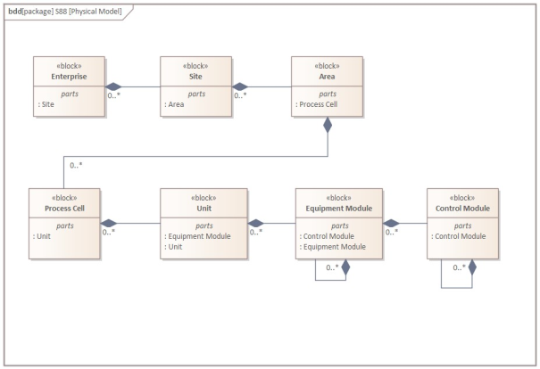
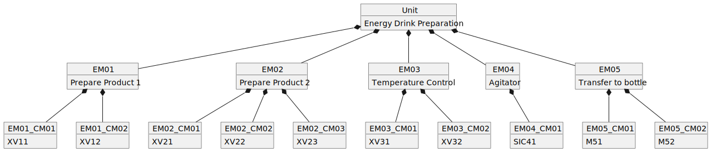
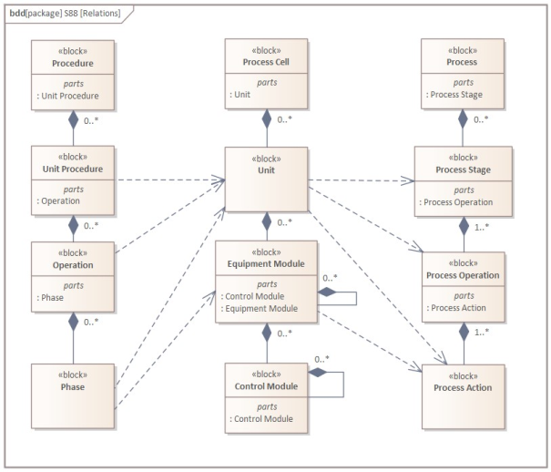

<h1 align="left">
   
  
   
  Industrial Automation Base
   
</h1>

Cours AutB

Author: [Cédric Lenoir](mailto:cedric.lenoir@hevs.ch)

# Module 01 Interfaces,
## *1ère partie, principe*

Author: [Cédric Lenoir](mailto:cedric.lenoir@hevs.ch)

*Keywords:* **61131-2 hardware tags**

<figure>
    
    <figcaption>Logo International Electrotechnical Commission</figcaption>
</figure>

## Industrial-process measurement and control - Programmable controllers - Part 2: Equipment requirements and tests

## Abstract (www.iec.ch)
IEC 61131-2:2017 specifies functional and electromagnetic compatibility requirements and related verification tests for any product where the primary purpose is performing the function of industrial control equipment, including PLC and/or PAC, and/or their associated peripherals which have as their intended use the control and command of machines, automated manufacturing and industrial processes, e.g. **discrete**, **batch** and **continuous control**.
This fourth edition cancels and replaces the third edition published in 2007. This edition constitutes a technical revision.

> Les citations en anglais ne sont pas traduite.

# Classes de processus industriels

## Pourquoi parler des types de processus ?
- Le type de processus a un lien direct avec certaines caractéristiques des automates comme la puissance de calcul.
- Les différents processus travaillent avec des temps de cycle très différents et une infrastructure réseau qui ne l’est pas moins.

Il ne s’agit pas de rentrer en détail dans les différents types de processus industriels. Par contre il s'agit de comprendre quelques principes de modélisation qui justifient entre autre l'importance du travail sur la structure des données qui sera traitée dans le chapitre suivant.

> Ci-dessous, une comparaison de deux types de processus susceptibles d'être utilisés dans l'industrie pharmaceutique.

<figure>
    
    <figcaption>Batch vs Continuous Manufacturing, Source: Org. Process Res. Dev. 2021, 25, 4, 721-739</figcaption>
</figure>

Un des intérêts de la production par Batch est d'être plus facilement modulable afin de fabriquer différents types de produits sur la même installation, à condition que le logiciel de commande le permette. Cela permet aussi souvent une production spécifique adaptée aux besoin du client final et finalement à plus forte valeur ajoutée.

Au niveau logiciel, l'**augmentation de la modularité** d'un programme rime souvent avec **augmentation de la complexité**. D'ou l'importance d'un programme parfaitement structuré.

### ISA-88 Physical Diagram
ISA-88 propose un model qui permet de representer un processus industriel selon un model générique. Si ISA-88 est initialement une norme développée pour le **Batch Processing**, elle peut aussi être utilisée pour modéliser d'autres type de processus, ce qui nous permet de présenter ce cours comme une approche générale valable pour d'autre types de processus susceptibles d'être automatisés.

<figure>
    
    <figcaption>ISA-88 Physical Model Generic vesion UML</figcaption>
</figure>

- Pour résumer, une machine se situe au niveau **Unit**.
- Dans le cadre de ce cours, nous nous limiterons à un élément de cette machine, un **Equipment Module**

## Processus, lots et traitements par lots
Selon ISA 88, un processus est une séquence d'activités chimiques, physiques ou biologiques pour la conversion, le transport ou stockage de matière ou d'énergie. Les procédés de fabrication industrielle peuvent généralement être classés sous forme de fabrication continue de pièces discrètes ou par lots. La classification d'un processus dépend de si la sortie du processus apparaît dans un flux continu, « Continuous », en quantités finies de pièces « Discrete parts manufacturing », ou en quantités finies de matière « Batches ».
Bien que certains aspects de cette norme puissent s'appliquer à la fabrication de pièces discrètes ou aux processus continus, la norme ISA88 ne traite pas spécifiquement de ces types de processus.
La réalité est que de nombreux ingénieurs, dont l’auteur de ce cours se sont intéressés à l’application de la norme aux processus discret et continus. On peut notamment se référer à l’ouvrage « WBF, Applying ISA-88 in discrete and continuous manufacturing ».

## Continuous processes
Dans un processus continu, les matériaux sont passés en flux continu à travers l'équipement de traitement. Une fois établi dans un état de fonctionnement stable, la nature du processus ne dépend pas de la durée de fonctionnement. Les démarrages, transitions et arrêts ne contribuent généralement pas à la réalisation du traitement souhaité. Au niveau de l’ISA, les processus continus sont traités dans « ISA106, Procedure Automation for Continuous Process Operations »

## Discrete parts manufacturing processes
Dans un processus de fabrication de pièces discrètes, les produits sont classés en lots de production basés sur les matières premières communes, les exigences de production et les historiques de production. Dans un processus de fabrication de pièces discrètes, une quantité spécifiée de produit se déplace comme une unité (groupe de pièces) entre les postes de travail, et chaque pièce conserve son identité unique.

## Batch processes
Les traitements par lots abordés dans cette norme conduisent à la production de quantités finies de matières (lots) en soumettant des quantités de matières premières à un ordre défini d'actions de traitement à l'aide d'un ou plusieurs équipements. Le produit fabriqué par un processus par lots est appelé un lot. Les processus par lots sont des processus discontinus. Les processus par lots ne sont ni
discret ni continus ; cependant, ils présentent les deux caractéristiques.

### Un exemple de Batch Process

<figure>
    
    <figcaption>Drink Processing version Pipe & Process Diagram</figcaption>
</figure>

<figure>
    
    <figcaption>Drink Processing version ISA-88</figcaption>
</figure>

<figure>
    
    <figcaption>Drink Processing version ISA-88</figcaption>
</figure>

Le travail sur les intefaces consiste à relier le processus représenté par exemple par le schéma **P&ID**, **Pipe & Process Diagram** que l'on retrouve fréquement dans l'industrie chimique avec le software représenté par le schéma UML.

## Autres aspects de ISA-88
### Procedural Control Model
ISA-88 gère aussi un modèle procédural, Procedural Control Model, que l'on pourrait simplement traduire par la gestion des recettes.
Les élément traités dans le cadre de ce cours se limitent au bas de l'échelle procédurale. Ils seronts ensuite pilotés par une **phase**.

Une **phase** peut émettre une ou plusieurs commandes ou provoquer une ou plusieurs actions, telles que :
-   Activation et désactivation des types de régulation de base et orientés état et spécification de leurs points de consigne et valeurs de sortie initiales
-   Réglage, effacement et modification de l'alarme et d'autres limites
-   Définition et modification des constantes de contrôleur, des modes de contrôleur et des types d'algorithmes
-   Lecture des variables de processus, telles que la densité du gaz, la température du gaz et le débit volumétrique à partir d'un débitmètre, et calcul du débit massique à travers le débitmètre
-   Effectuer des contrôles d'autorisation des opérateurs.

Si l'on considérait que la main est un **Control Module**, le bras serait un **Equipement Module** qui permet d'effectuer une **phase**.

Dans la mesure ou nous allons nous concentrer sur le **Control Module**, nous ne développerons pas le modèle prodédural car il n'a pas d'interactions directe avec lui.

### Process Model
Le Process Model décrit la réalité physique, ou chimique, du processus.
Une opération pourrait être par exemple:
-   Monter la plaque d’appuis sur la plaque de base
-   Insérer le ressort de verrouillage
-   Insérer le bouton en caoutchouc
-   Contrôler la qualité du montage avec une caméra intelligente

###
<figure>
    
    <figcaption>Relation entre les différents éléments ISA-88</figcaption>
</figure

[2ème partie, les modules d'entrée sortie](./README_part_2.md), 