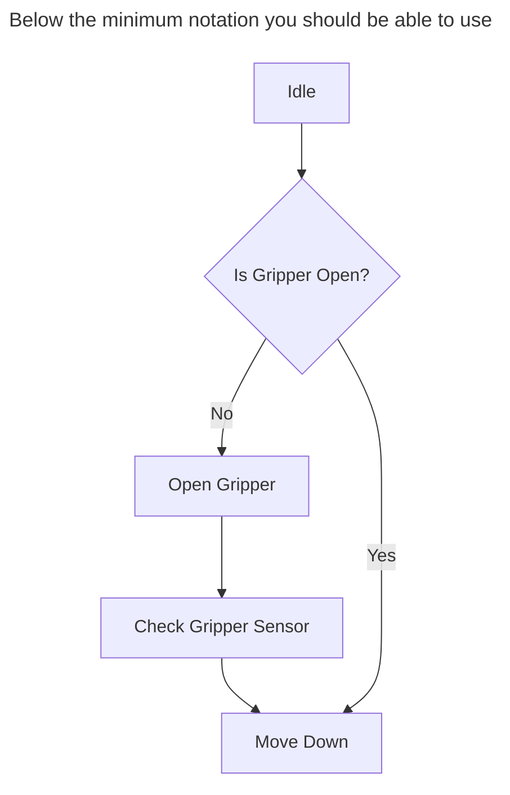
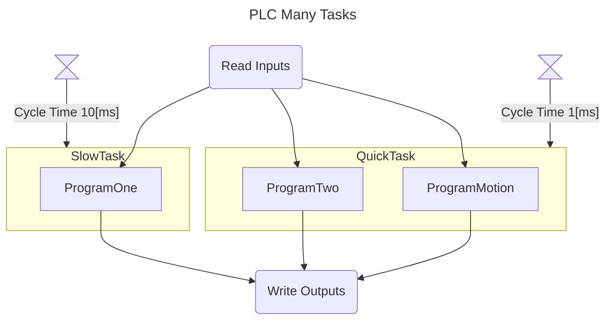
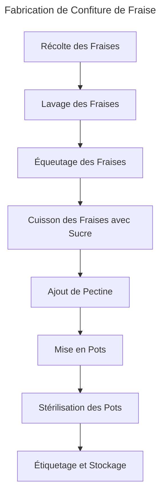
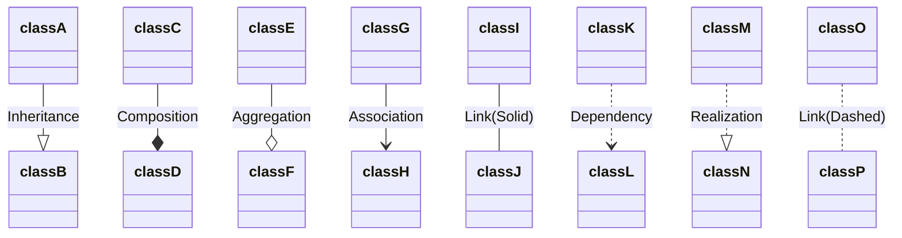
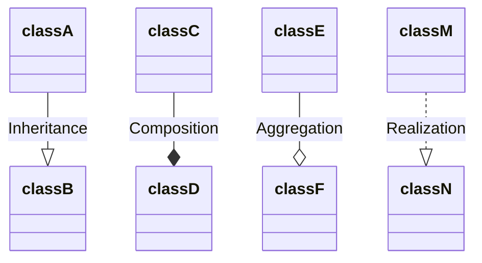
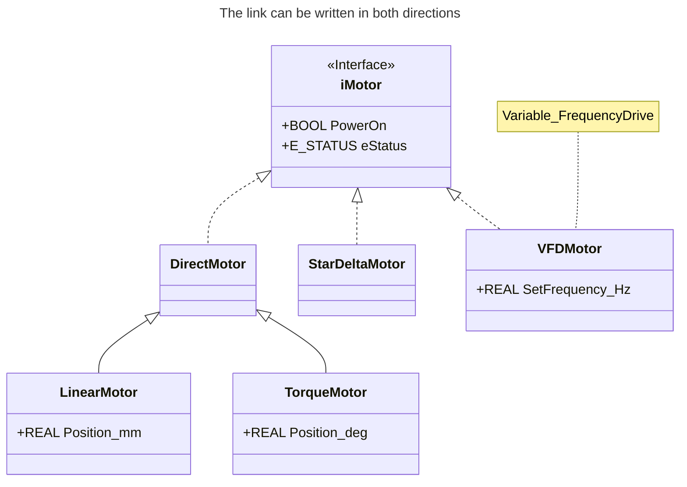
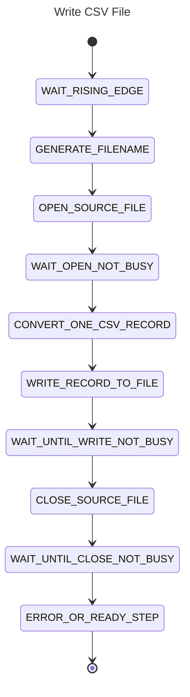
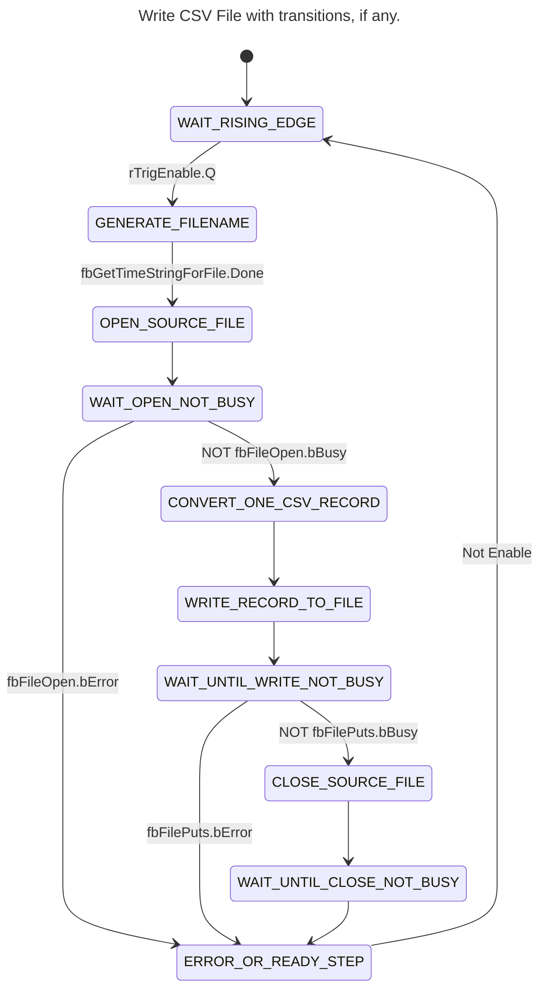

<h1 align="left">
   
  
   
  HEI-Vs Engineering School <h2>AutB Base Automation</h2>
   
</h1>

[Cédric Lenoir](mailto:cedric.lenoir@hevs.ch)

# Module 01 /  System Engineering

## Aperçu
Ce module présente les outils de base de modélisation d'un sytème d'automation à l'aide de SysML.
Il présente aussi une série d'outils Open Source qui permette de mettre en application la théorie en utilisant des outils actuels et disponibles librement dans le cadre des cours dispensés par la HEVS.

## Ce qu'il faut retenir
Ce cours présente une méthode de travail qui permet de:
- modéliser une partie du code en adaptant certains outils standards aux spécificités du PLC.
- générer une partie du code à l'aide d'une AI générative, en l'occurence ici Copilot.
- documenter le code, en particulier à l'aide des outils Mermaid.js
- on présentera aussi Node-RED dont la palette [Dashboard 2.0](https://dashboard.flowfuse.com/) permet d'intégrer de la documentation sous forme Markdown directement dans l'interace utilisateur.

> Les outils présentés ici ne se substituent pas aux environnements de développement classiques fournis par les fabricants de PLC, mais ils les complémentent.

## Ce qu'il faut savoir
Il faut être capable d'utiliser et coder trois types de diagrammes qui seront utilisé dans les cours d'automation.
- Class ou Object diagrames, Block Definition Diagram selon l'appelation SysML.
- Flowchart diagrams, ou Activity Diagram selon l'appelation SysML.
- State diagrams, ou A StateMachine diagram selon l'appelation SysML.

Les diagrammes choisis ne respectent pas la définitions stricte de SysML, mais de même, il n'existe pas de diagrammes permettant une représentation stricte de la norme IEC-61131-3, en particulier le fonctionnement propres au bloques fonctionnels.

Nous utiliserons la base [Mermaid](https://mermaid.js.org) pour représenter ces diagrammes dans des documents [Markdown](https://www.markdownguide.org/).
Ces représentations offrent l'avantage de pouvoir être utilisée, archivées et visualisées à l'aide des platformes basées sur [GIT](https://git-scm.com/), à savoir [GitHub](https://github.com/) et [GitLab](https://about.gitlab.com/).
- GitHub est utilisé comme système de diffusion externes des cours d'automation de la HEVS.
- GitLab est utilisé comme système d'archivage interne des projets dans la HEVS. Les étudiants n'ont pas d'accès libre à GitLab HEVS, d'ou l'utilisation de GitHub.

Dans le cadre des cours d'automation, ces outils seront principalement utilisés via l'outil [Visual Studio Code](https://code.visualstudio.com/).

L'ensemble des outils sont sélectionnés d'une part car:
- ils sont Open Source et peuvent être utilisés sans coûts pour les étudiants,
- ils sont disponibles sur les platformes Windows, OSx et Linux,

## Mots clés
-   Un **[State Diagram](https://mermaid.js.org/syntax/stateDiagram.html)** (ou diagramme d'état) est utilisé pour représenter les différents états d'un système ainsi que les transitions entre ces états. Il est particulièrement utile pour modéliser le comportement dynamique d'un système, comme les machines à états finis, où le système peut être dans un état à un moment donné et passer à un autre état en réponse à des événements ou des conditions spécifiques.

-   Un **Activity Diagram**, diagramme d'activité ou encore **[Flow Chart](https://mermaid.js.org/syntax/flowchart.html)** est utilisé pour représenter le flux de contrôle ou de données entre différentes activités dans un système. Il est souvent utilisé pour modéliser les processus métier ou les algorithmes, montrant comment les activités sont enchaînées et comment les décisions et les boucles influencent le flux global.

-   Un **[Class Diagram](https://mermaid.js.org/syntax/classDiagram.html)** ou diagramme de classes est utilisé pour représenter la structure statique d'un système en montrant les classes, leurs attributs, leurs méthodes et les relations entre elles. Il est essentiel pour la modélisation orientée objet, permettant de visualiser les composants principaux d'un système et leurs interactions.

> En automation, on utilisera principalement le **State Diagram** pour la modélisation d'un programme. Il est particulièrment approprié aux programmes cycliques des automates.

> On utilisera le **diagramme d'activité** ou **Activity Diagram**, pour modéliser les fonctions automatisée en faisant abstraction du codage. On parle de Function Specification, il permettra de valider les fonctionnalités avant de les coder.

> En programmation orienté objet, on parle de **classes** et d'**objets**. Cette distinction ne fait pas vraiment sens en programmation PLC, dans la mesure où il n'y a pas d'allocation dynamique.

# Introduction
La méthode du cours tiens compte de l'évolution des outils de travail. Cela influe en partie sur la manière de travailler.

Cela implique générer du code avec Copilot. Attention, il faut comprendre le code.

# Les extensions utilisées pour Visual Studio Code
Les extensions utilisées dans ce cours sur VScode sont les suivantes:

- [GitHub Copilot](https://marketplace.visualstudio.com/items?itemName=GitHub.copilot): GitHub Copilot is an AI-powered code completion tool that helps you write code faster and with fewer errors by suggesting whole lines or blocks of code as you type.

- [GitHub Copilot Chat](https://marketplace.visualstudio.com/items?itemName=GitHub.copilot-chat): GitHub Copilot Chat provides an interactive chat interface within VS Code, allowing you to ask questions and get coding assistance from GitHub Copilot in a conversational manner.

- [Markdown All in One](https://marketplace.visualstudio.com/items?itemName=yzhang.markdown-all-in-one): This extension provides a comprehensive set of tools for working with Markdown in VS Code, including shortcuts, table of contents generation, and more.

- [Markdown Preview Enhanced](https://marketplace.visualstudio.com/items?itemName=shd101wyy.markdown-preview-enhanced): This extension enhances the built-in Markdown preview in VS Code with additional features like rendering diagrams, exporting to various formats, and more.

- [Markdown Preview Mermaid Support](https://marketplace.visualstudio.com/items?itemName=bierner.markdown-mermaid): This extension adds support for rendering Mermaid diagrams in the Markdown preview, allowing you to visualize flowcharts, sequence diagrams, and more directly within VS Code.

- [Structured Text Language Support](https://marketplace.visualstudio.com/items?itemName=stkb.restructuredtext): This extension provides syntax highlighting, IntelliSense, and other language support features for Structured Text, a programming language used in industrial automation.

# [Mermaid Flowchart](https://mermaid.js.org/syntax/flowchart.html)
Ce type de diagramme doit être principalement vu comme un diagramme de communication. Il permet de valider le fonctionnement d'un processus avant de passer au codage.

# [Class Diagram](https://mermaid.js.org/syntax/classDiagram.html)
Ce type de diagramme permet de représenter l'architecture du programme.

## Les liens suivants sont à connaitre

# [State Diagram](https://mermaid.js.org/syntax/stateDiagram.html)
Ce type de diagramme permet de représenter le comportement interne du programme, principalement l'utilisation du code de type IEC-61131-3 ``CASE..OF``.

## On peut ajouter les transitions
L'exemple ci-dessous n'est pas complet, c'est un extrait.

# Markdown

## Résumé de Markdown selon Copilot

Markdown est un langage de balisage léger qui permet de formater du texte en utilisant une syntaxe simple et lisible. Il est couramment utilisé pour rédiger des documents, des notes, des fichiers README, et des blogs. Voici quelques éléments de base de Markdown :

- **Titres** : Utilisez `#` pour les titres. Par exemple, `# Titre 1`, `## Titre 2`, etc.
- **Texte en gras** : Entourez le texte avec `**` ou `__`. Par exemple, `**texte en gras**`.
- **Texte en italique** : Entourez le texte avec `*` ou `_`. Par exemple, `*texte en italique*`.
- **Listes** : Utilisez `-` ou `*` pour les listes à puces, et des chiffres suivis d'un point pour les listes numérotées.
- **Liens** : Utilisez `[texte du lien](URL)`. Par exemple, `[Google](https://www.google.com)`.
- **Images** : Utilisez ``. Par exemple, ``.
- **Blocs de code** : Utilisez des accents graves triples (\`\`\`) pour les blocs de code.

Markdown est largement supporté par de nombreuses plateformes et outils, ce qui en fait un choix populaire pour la documentation et la rédaction de contenu en ligne.

## On ajoutera les éléments suivants:
-   Markdown est l'éditeur utilisé pour tous les cours d'automation en S4 et S6.
-   Il supporte les fichiers Mermaid.JS mentionnés ci-dessus.
-   Il est supporté par l'interface utilisateur UI - Node-RED que nous utiliserons dans le cours d'automation, ce qui permet de fournir de la documentation directement dans l'interface utilisateur.
-   C'est le format de fichier utilisé pour la documentation dans GitHub et GitLab.
-   Accessoirement, c'est le format de fichier utilisé par ChatGPT, ce qui vous permet de coler directement le contenu dans un fichier Mardown.

## Ci-dessous, la réponse de ChatGPT à la question de savoir ce qu'est Node-RED.

> Le contenu est copié/collé dans le fichier Markdown sans mise en forme.

Node-RED est un outil de développement open-source basé sur **Node.js**, conçu pour faciliter la création d'applications en connectant des **blocs fonctionnels** (appelés *nœuds*) via une interface graphique. Il est particulièrement utilisé pour l’**automatisation**, l’**IoT (Internet des objets)**, l’**intégration d’API** et la **domotique**.

### 🚀 **Principales utilisations de Node-RED :**  
✅ **Automatisation de flux de données** : Permet d'automatiser des tâches entre différents services et appareils.  
✅ **IoT et domotique** : Intègre facilement des capteurs, des actionneurs et des plateformes cloud (MQTT, Home Assistant, etc.).  
✅ **Intégration d'API et services web** : Connecte facilement des API REST, bases de données et services cloud.  
✅ **Surveillance et alertes** : Peut être utilisé pour surveiller des systèmes en temps réel et générer des notifications.  

### 🛠 **Comment ça fonctionne ?**  
1. Interface graphique **drag-and-drop** pour créer des **flux**.  
2. Connexion de **nœuds** représentant des entrées, traitements et sorties (ex: MQTT, HTTP, WebSocket, etc.).  
3. Déploiement en un clic, exécution sur serveur, Raspberry Pi, ou cloud.  

C'est un excellent outil pour ceux qui veulent automatiser des tâches sans coder en profondeur. Tu veux un exemple d’utilisation concrète ? 😊

# Votre Job
Installer Visual Studio Code ainsi que les extensions [mentionnées ci-dessus](#les-extensions-utilisées-pour-visual-studio-code) et vous familiariser avec l'utilisation de Markdown et Mermaid.

## Option 1
Vous pouvez installer GIT sur votre PC. Cela vous permettra de charger facilement les cours et de les éditer, puis si nécessaire de les sauvegarder sur GitHub. GitHub est un outil de base de la programmation. L'existance de GitHub fait que la perte de donnée d'un programme ne peut plus être considérée comme un accident, mais comme une grossière erreur du programmeur.

Visual Studio Code permet nativement de charger et sauvegarder des données sur GitHub pour autant que GIT soit installé au préalable.

## Option 2
Dans le cadre du laboratoire d'automation, nous allons utiliser le logiciel Node-RED. [L'installation prend quelques minutes](https://nodered.org/docs/getting-started/local).