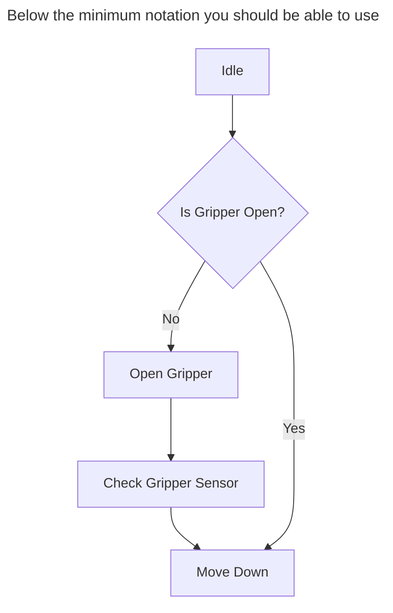
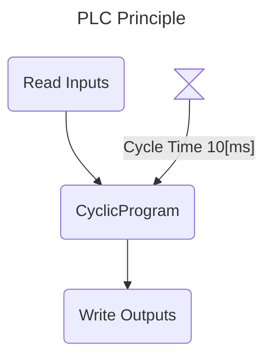
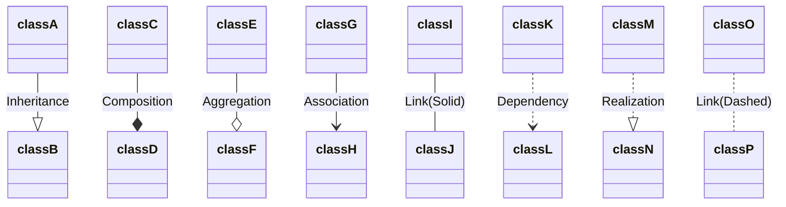
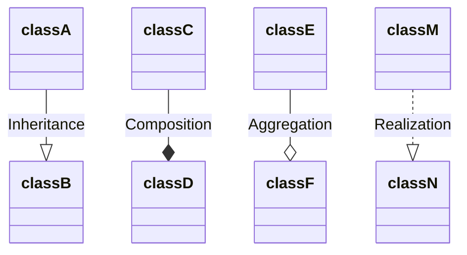
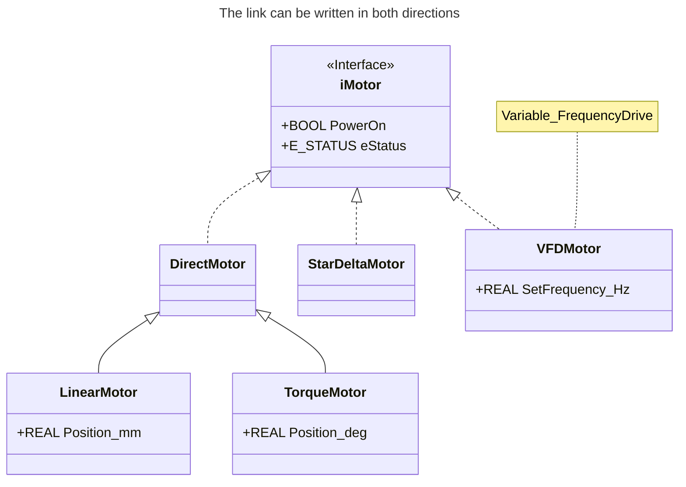
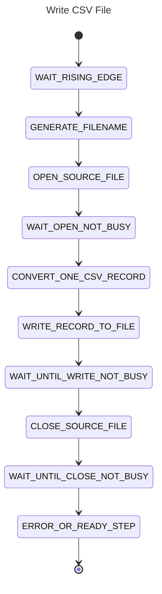
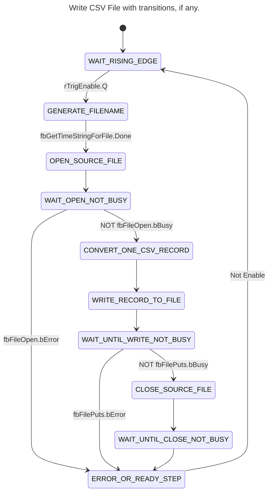

<h1 align="left">
   
  
   
  HEI-Vs Engineering School <h2>AutB Base Automation</h2>
   
</h1>

[Cédric Lenoir](mailto:cedric.lenoir@hevs.ch)

# Module 01 /  System Engineering

## Aperçu
Ce module présente les outils de base de modélisation d'un sytème d'automation à l'aide de SysML.
Il présente aussi une série d'outils Open Source qui permette de mettre en application la théorie en utilisant des outils actuels et disponibles librement dans le cadre des cours dispensés par la HEVS.

## Ce qu'il faut retenir
Ce cours présente une méthode de travail qui permet de:
- modéliser une partie du code en adaptant certains outils standards aux spécificités du PLC.
- générer une partie du code à l'aide d'une AI générative, en l'occurence ici Copilot.
- documenter le code, en particulier à l'aide des outils Mermaid.js
- on présentera aussi Node-RED dont la palette [Dashboard 2.0](https://dashboard.flowfuse.com/) permet d'intégrer de la documentation sous forme Markdown directement dans l'interace utilisateur.

> Les outils présentés ici ne se substituent pas aux environnements de développement classiques fournis par les fabricants de PLC, mais ils les complémentent.

## Ce qu'il faut savoir
Il faut être capable d'utiliser et coder trois types de diagrammes qui seront utilisé dans les cours d'automation.
- Class ou Object diagrames, Block Definition Diagram selon l'appelation SysML.
- Flowchart diagrams, ou Activity Diagram selon l'appelation SysML.
- State diagrams, ou A StateMachine diagram selon l'appelation SysML.

Les diagrammes choisis ne respectent pas la définitions stricte de SysML, mais de même, il n'existe pas de diagrammes permettant une représentation stricte de la norme IEC-61131-3, en particulier le fonctionnement propres au bloques fonctionnels.

Nous utiliserons la base [Mermaid](https://mermaid.js.org) pour représenter ces diagrammes dans des documents [Markdown](https://www.markdownguide.org/).
Ces représentations offrent l'avantage de pouvoir être utilisée, archivées et visualisées à l'aide des platformes basées sur [GIT](https://git-scm.com/), à savoir [GitHub](https://github.com/) et [GitLab](https://about.gitlab.com/).
- GitHub est utilisé comme système de diffusion externes des cours d'automation de la HEVS.
- GitLab est utilisé comme système d'archivage interne des projets dans la HEVS. Les étudiants n'ont pas d'accès libre à GitLab HEVS, d'ou l'utilisation de GitHub.

Dans le cadre des cours d'automation, ces outils seront principalement utilisés via l'outil [Visual Studio Code](https://code.visualstudio.com/).

L'ensemble des outils sont sélectionnés d'une part car:
- ils sont Open Source et peuvent être utilisés sans coûts pour les étudiants,
- ils sont disponibles sur les platformes Windows, OSx et Linux,

## Mots clés

# Introduction
La méthode du cours tiens compte de l'évolution des outils de travail. Cela influe en partie sur la manière de travailler.

Cela implique générer du code avec Copilot. Attention, il faut comprendre le code.

# Les extensions utilisées pour Visual Studio Code
Les extensions utilisées dans ce cours sur VScode sont les suivantes:

- [GitHub Copilot](https://marketplace.visualstudio.com/items?itemName=GitHub.copilot): GitHub Copilot is an AI-powered code completion tool that helps you write code faster and with fewer errors by suggesting whole lines or blocks of code as you type.

- [GitHub Copilot Chat](https://marketplace.visualstudio.com/items?itemName=GitHub.copilot-chat): GitHub Copilot Chat provides an interactive chat interface within VS Code, allowing you to ask questions and get coding assistance from GitHub Copilot in a conversational manner.

- [Markdown All in One](https://marketplace.visualstudio.com/items?itemName=yzhang.markdown-all-in-one): This extension provides a comprehensive set of tools for working with Markdown in VS Code, including shortcuts, table of contents generation, and more.

- [Markdown Preview Enhanced](https://marketplace.visualstudio.com/items?itemName=shd101wyy.markdown-preview-enhanced): This extension enhances the built-in Markdown preview in VS Code with additional features like rendering diagrams, exporting to various formats, and more.

- [Markdown Preview Mermaid Support](https://marketplace.visualstudio.com/items?itemName=bierner.markdown-mermaid): This extension adds support for rendering Mermaid diagrams in the Markdown preview, allowing you to visualize flowcharts, sequence diagrams, and more directly within VS Code.

- [Structured Text Language Support](https://marketplace.visualstudio.com/items?itemName=stkb.restructuredtext): This extension provides syntax highlighting, IntelliSense, and other language support features for Structured Text, a programming language used in industrial automation.

# [Mermaid Flowchart](https://mermaid.js.org/syntax/flowchart.html)
Ce type de diagramme doit être principalement vu comme un diagramme de communication. Il permet de valider le fonctionnement d'un processus avant de passer au codage.

# [Class Diagram](https://mermaid.js.org/syntax/classDiagram.html)
Ce type de diagramme permet de représenter l'architecture du programme.

## Les liens suivants sont à connaitre

# [State Diagram](https://mermaid.js.org/syntax/stateDiagram.html)
Ce type de diagramme permet de représenter le comportement interne du programme, principalement l'utilisation du code de type IEC-61131-3 ``CASE..OF``.

## On peut ajouter les transitions
L'exemple ci-dessous n'est pas complet, c'est un extrait.

