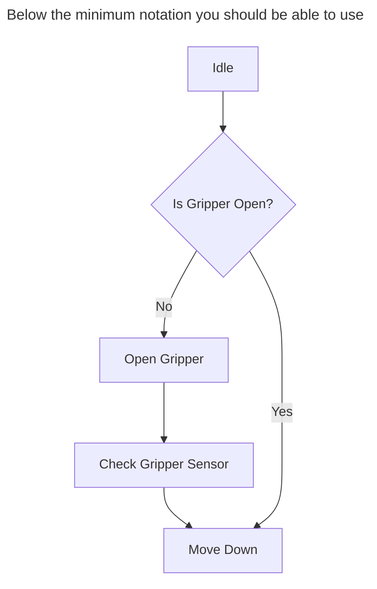
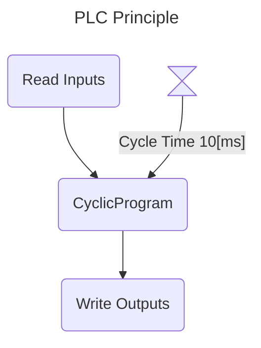
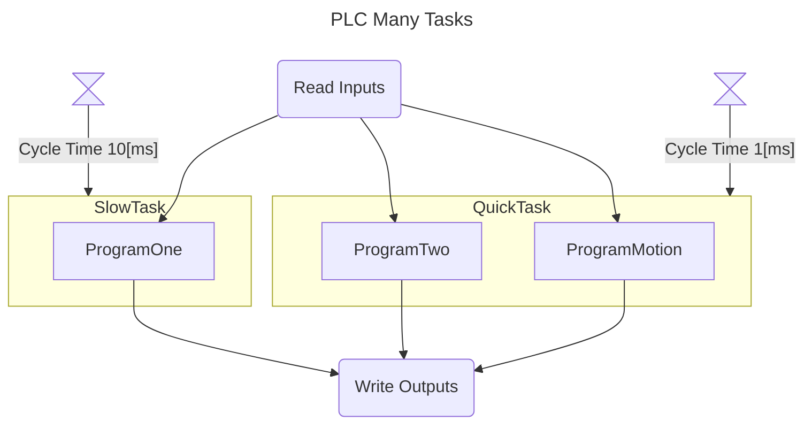
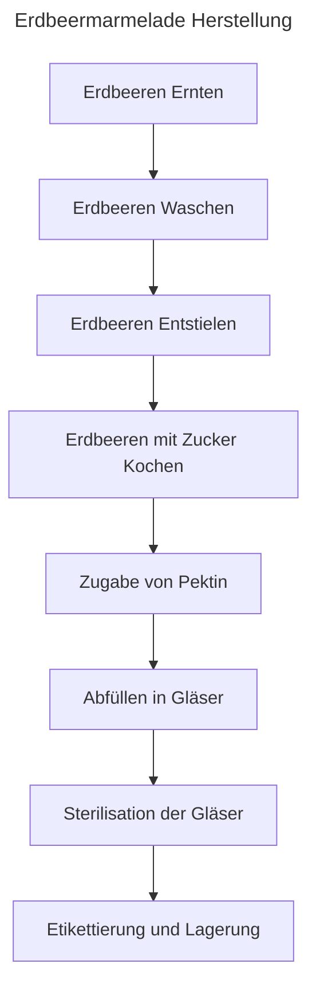
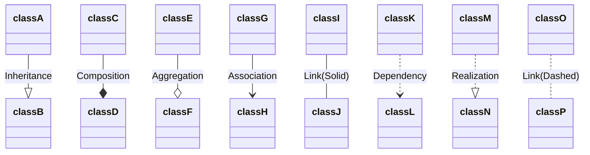
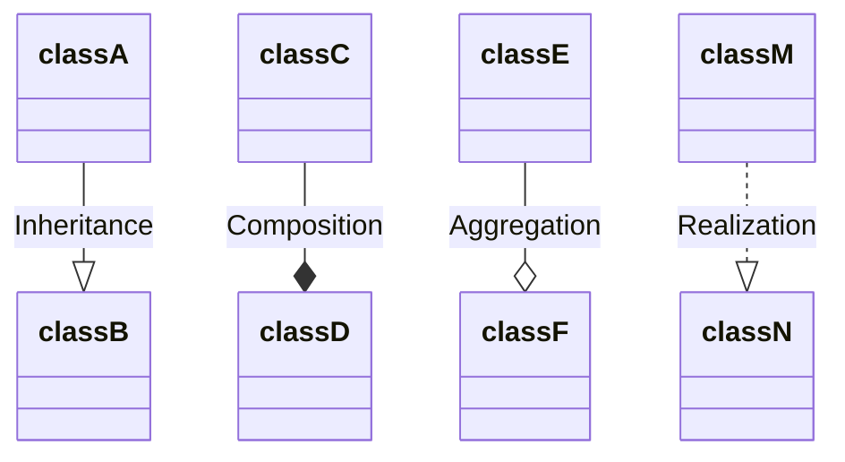
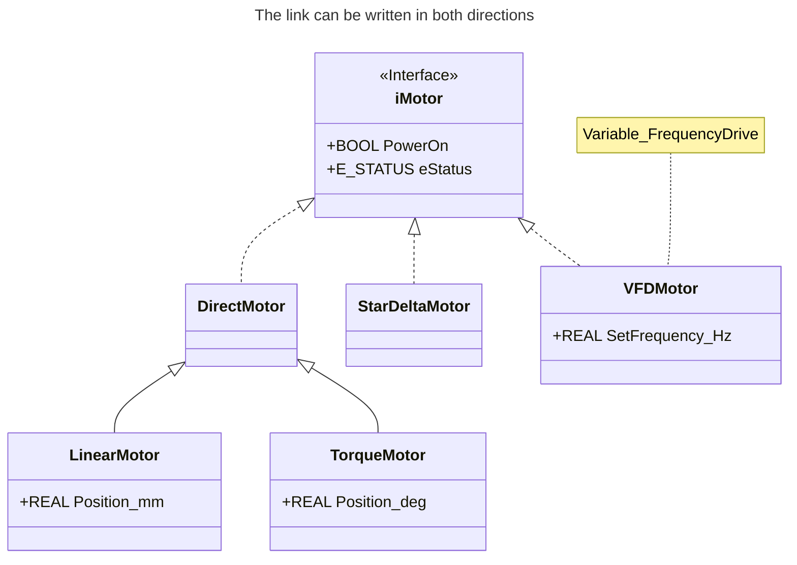
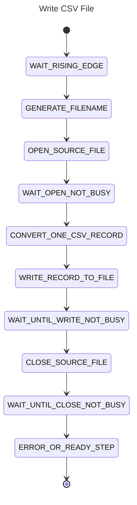
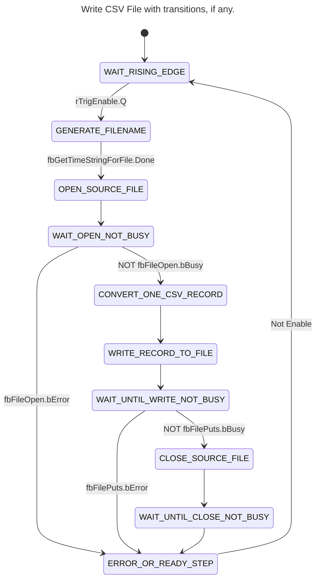

<h1 align="left">
   
  
   
  HEI-Vs Engineering School <h2>AutB Base Automation</h2>
   
</h1>

[Cédric Lenoir](mailto:cedric.lenoir@hevs.ch)

# Modul 01 / System Engineering

## Überblick
Dieses Modul stellt die grundlegenden Modellierungswerkzeuge für ein Automatisierungssystem mit SysML vor.
Es stellt auch eine Reihe von Open-Source-Tools vor, die es ermöglichen, die Theorie mit aktuellen und frei verfügbaren Werkzeugen im Rahmen der von der HEVS angebotenen Kurse anzuwenden.

## Wichtige Punkte
Dieser Kurs stellt eine Arbeitsmethode vor, die es ermöglicht:
- einen Teil des Codes zu modellieren, indem bestimmte Standardwerkzeuge an die spezifischen Anforderungen der SPS angepasst werden.
- einen Teil des Codes mit Hilfe einer generativen KI zu erzeugen, hier Copilot.
- den Code zu dokumentieren, insbesondere mit Hilfe der Werkzeuge Mermaid.js.
- auch Node-RED vorzustellen, dessen Palette [Dashboard 2.0](https://dashboard.flowfuse.com/) es ermöglicht, Dokumentation in Markdown-Form direkt in die Benutzeroberfläche zu integrieren.

> Die hier vorgestellten Werkzeuge ersetzen nicht die klassischen Entwicklungsumgebungen der SPS-Hersteller, sondern ergänzen sie.

## Was man wissen muss
Man muss in der Lage sein, drei Arten von Diagrammen zu verwenden und zu programmieren, die in den Automatisierungskursen verwendet werden.
- Klassen- oder Objektdiagramme, Blockdefinitionsdiagramme nach SysML-Nomenklatur.
- Flussdiagramme oder Aktivitätsdiagramme nach SysML-Nomenklatur.
- Zustandsdiagramme oder Zustandsmaschinen-Diagramme nach SysML-Nomenklatur.

Die gewählten Diagramme entsprechen nicht der strikten Definition von SysML, aber es gibt auch keine Diagramme, die eine strikte Darstellung der IEC-61131-3-Norm ermöglichen, insbesondere nicht die spezifischen Funktionen der Funktionsblöcke.

Wir werden die Basis [Mermaid](https://mermaid.js.org) verwenden, um diese Diagramme in [Markdown](https://www.markdownguide.org/) Dokumenten darzustellen.
Diese Darstellungen bieten den Vorteil, dass sie mit GIT-basierten Plattformen wie [GitHub](https://github.com/) und [GitLab](https://about.gitlab.com/) verwendet, archiviert und visualisiert werden können.
- GitHub wird als externes Verbreitungssystem für die Automatisierungskurse der HEVS verwendet.
- GitLab wird als internes Archivierungssystem für Projekte an der HEVS verwendet. Die Studierenden haben keinen freien Zugang zu GitLab HEVS, daher die Nutzung von GitHub.

Im Rahmen der Automatisierungskurse werden diese Werkzeuge hauptsächlich über das Tool [Visual Studio Code](https://code.visualstudio.com/) verwendet.

Alle Werkzeuge sind ausgewählt, weil:
- sie Open Source sind und von den Studierenden kostenlos genutzt werden können,
- sie auf den Plattformen Windows, OSx und Linux verfügbar sind.

## Schlüsselwörter
- Ein **[Zustandsdiagramm](https://mermaid.js.org/syntax/stateDiagram.html)** wird verwendet, um die verschiedenen Zustände eines Systems sowie die Übergänge zwischen diesen Zuständen darzustellen. Es ist besonders nützlich, um das dynamische Verhalten eines Systems zu modellieren, wie z.B. endliche Zustandsmaschinen, bei denen sich das System zu einem bestimmten Zeitpunkt in einem Zustand befindet und in einen anderen Zustand übergeht, als Reaktion auf bestimmte Ereignisse oder Bedingungen.

- Ein **Aktivitätsdiagramm**, auch **[Flussdiagramm](https://mermaid.js.org/syntax/flowchart.html)** genannt, wird verwendet, um den Kontroll- oder Datenfluss zwischen verschiedenen Aktivitäten in einem System darzustellen. Es wird oft verwendet, um Geschäftsprozesse oder Algorithmen zu modellieren und zu zeigen, wie die Aktivitäten miteinander verknüpft sind und wie Entscheidungen und Schleifen den gesamten Fluss beeinflussen.

- Ein **[Klassendiagramm](https://mermaid.js.org/syntax/classDiagram.html)** wird verwendet, um die statische Struktur eines Systems darzustellen, indem Klassen, ihre Attribute, ihre Methoden und die Beziehungen zwischen ihnen gezeigt werden. Es ist wesentlich für die objektorientierte Modellierung und ermöglicht es, die Hauptkomponenten eines Systems und ihre Interaktionen zu visualisieren.

> In der Automatisierung wird hauptsächlich das **Zustandsdiagramm** zur Modellierung eines Programms verwendet. Es ist besonders geeignet für die zyklischen Programme der SPS.

> Das **Aktivitätsdiagramm** wird verwendet, um automatisierte Funktionen zu modellieren, ohne den Code zu berücksichtigen. Es wird als Funktionsspezifikation bezeichnet und ermöglicht es, die Funktionen vor der Codierung zu validieren.

> In der objektorientierten Programmierung spricht man von **Klassen** und **Objekten**. Diese Unterscheidung macht in der SPS-Programmierung wenig Sinn, da es keine dynamische Speicherzuweisung gibt.

# Einführung
Die Methode des Kurses berücksichtigt die Entwicklung der Arbeitswerkzeuge. Dies beeinflusst teilweise die Arbeitsweise.

Dies beinhaltet die Generierung von Code mit Copilot. Achtung, man muss den Code verstehen.

# Die verwendeten Erweiterungen für Visual Studio Code
Die in diesem Kurs auf VScode verwendeten Erweiterungen sind die folgenden:

- [GitHub Copilot](https://marketplace.visualstudio.com/items?itemName=GitHub.copilot): GitHub Copilot ist ein KI-gestütztes Code-Vervollständigungstool, das Ihnen hilft, Code schneller und mit weniger Fehlern zu schreiben, indem es ganze Zeilen oder Codeblöcke vorschlägt, während Sie tippen.

- [GitHub Copilot Chat](https://marketplace.visualstudio.com/items?itemName=GitHub.copilot-chat): GitHub Copilot Chat bietet eine interaktive Chat-Oberfläche innerhalb von VS Code, die es Ihnen ermöglicht, Fragen zu stellen und Codierhilfe von GitHub Copilot in einer konversationellen Weise zu erhalten.

- [Markdown All in One](https://marketplace.visualstudio.com/items?itemName=yzhang.markdown-all-in-one): Diese Erweiterung bietet ein umfassendes Set von Werkzeugen für die Arbeit mit Markdown in VS Code, einschließlich Abkürzungen, Inhaltsverzeichnis-Generierung und mehr.

- [Markdown Preview Enhanced](https://marketplace.visualstudio.com/items?itemName=shd101wyy.markdown-preview-enhanced): Diese Erweiterung verbessert die eingebaute Markdown-Vorschau in VS Code mit zusätzlichen Funktionen wie dem Rendern von Diagrammen, dem Exportieren in verschiedene Formate und mehr.

- [Markdown Preview Mermaid Support](https://marketplace.visualstudio.com/items?itemName=bierner.markdown-mermaid): Diese Erweiterung fügt Unterstützung für das Rendern von Mermaid-Diagrammen in der Markdown-Vorschau hinzu, sodass Sie Flussdiagramme, Sequenzdiagramme und mehr direkt in VS Code visualisieren können.

- [Structured Text Language Support](https://marketplace.visualstudio.com/items?itemName=stkb.restructuredtext): Diese Erweiterung bietet Syntaxhervorhebung, IntelliSense und andere Sprachunterstützungsfunktionen für Structured Text, eine Programmiersprache, die in der industriellen Automatisierung verwendet wird.

# [Mermaid Flussdiagramm](https://mermaid.js.org/syntax/flowchart.html)
Dieser Diagrammtyp sollte hauptsächlich als Kommunikationsdiagramm betrachtet werden. Es ermöglicht die Validierung der Funktionsweise eines Prozesses, bevor mit der Codierung begonnen wird.

# [Klassendiagramm](https://mermaid.js.org/syntax/classDiagram.html)
Dieser Diagrammtyp ermöglicht die Darstellung der Programmarchitektur.

## Die folgenden Links sind zu kennen

# [Zustandsdiagramm](https://mermaid.js.org/syntax/stateDiagram.html)
Dieser Diagrammtyp ermöglicht die Darstellung des internen Verhaltens des Programms, hauptsächlich die Verwendung des IEC-61131-3-Codes ``CASE..OF``.

## Man kann Übergänge hinzufügen
Das folgende Beispiel ist nicht vollständig, es ist ein Auszug.

# Markdown

## Zusammenfassung von Markdown laut Copilot

Markdown ist eine leichte Auszeichnungssprache, die es ermöglicht, Text mit einer einfachen und lesbaren Syntax zu formatieren. Es wird häufig verwendet, um Dokumente, Notizen, README-Dateien und Blogs zu schreiben. Hier sind einige grundlegende Elemente von Markdown:

- **Überschriften**: Verwenden Sie `#` für Überschriften. Zum Beispiel, `# Überschrift 1`, `## Überschrift 2`, usw.
- **Fetter Text**: Umgeben Sie den Text mit `**` oder `__`. Zum Beispiel, `**fetter Text**`.
- **Kursiver Text**: Umgeben Sie den Text mit `*` oder `_`. Zum Beispiel, `*kursiver Text*`.
- **Listen**: Verwenden Sie `-` oder `*` für Aufzählungslisten und Zahlen gefolgt von einem Punkt für nummerierte Listen.
- **Links**: Verwenden Sie `[Linktext](URL)`. Zum Beispiel, `[Google](https://www.google.com)`.
- **Bilder**: Verwenden Sie ``. Zum Beispiel, ``.
- **Codeblöcke**: Verwenden Sie dreifache Backticks (\`\`\`) für Codeblöcke.

Markdown wird von vielen Plattformen und Tools weitgehend unterstützt, was es zu einer beliebten Wahl für Dokumentation und das Schreiben von Inhalten online macht.

## Wir werden die folgenden Elemente hinzufügen:
- Markdown ist der Editor, der für alle Automatisierungskurse in S4 und S6 verwendet wird.
- Es unterstützt die oben genannten Mermaid.JS-Dateien.
- Es wird von der Benutzeroberfläche UI - Node-RED unterstützt, die wir im Automatisierungskurs verwenden werden, was es ermöglicht, Dokumentation direkt in die Benutzeroberfläche einzufügen.
- Es ist das Dateiformat, das für die Dokumentation in GitHub und GitLab verwendet wird.
- Nebenbei bemerkt, ist es das Dateiformat, das von ChatGPT verwendet wird, was es Ihnen ermöglicht, den Inhalt direkt in eine Markdown-Datei zu kopieren.

## Nachfolgend die Antwort von ChatGPT auf die Frage, was Node-RED ist.

> Der Inhalt wird ohne Formatierung in die Markdown-Datei kopiert/eingefügt.

Node-RED ist ein Open-Source-Entwicklungstool, das auf **Node.js** basiert und entwickelt wurde, um die Erstellung von Anwendungen zu erleichtern, indem **Funktionsblöcke** (sogenannte *Nodes*) über eine grafische Benutzeroberfläche verbunden werden. Es wird besonders für **Automatisierung**, **IoT (Internet der Dinge)**, **API-Integration** und **Hausautomation** verwendet.

### 🚀 **Hauptanwendungen von Node-RED:**
✅ **Automatisierung von Datenflüssen**: Ermöglicht die Automatisierung von Aufgaben zwischen verschiedenen Diensten und Geräten.  
✅ **IoT und Hausautomation**: Integriert leicht Sensoren, Aktoren und Cloud-Plattformen (MQTT, Home Assistant, etc.).  
✅ **API- und Webdienst-Integration**: Verbindet leicht REST-APIs, Datenbanken und Cloud-Dienste.  
✅ **Überwachung und Benachrichtigungen**: Kann verwendet werden, um Systeme in Echtzeit zu überwachen und Benachrichtigungen zu generieren.  

### 🛠 **Wie funktioniert es?**
1. Grafische Benutzeroberfläche **Drag-and-Drop** zur Erstellung von **Flows**.  
2. Verbindung von **Nodes**, die Eingaben, Verarbeitungen und Ausgaben darstellen (z.B. MQTT, HTTP, WebSocket, etc.).  
3. Ein-Klick-Bereitstellung, Ausführung auf Server, Raspberry Pi oder Cloud.  

Es ist ein hervorragendes Werkzeug für diejenigen, die Aufgaben automatisieren möchten, ohne tiefgehend zu programmieren. Möchten Sie ein konkretes Anwendungsbeispiel? 😊

# Ihr Job
Installieren Sie Visual Studio Code sowie die [oben genannten](#die-verwendeten-erweiterungen-für-visual-studio-code) Erweiterungen und machen Sie sich mit der Verwendung von Markdown und Mermaid vertraut.

## Option 1
Sie können GIT auf Ihrem PC installieren. Dies ermöglicht es Ihnen, die Kurse einfach zu laden und zu bearbeiten und bei Bedarf auf GitHub zu speichern. GitHub ist ein grundlegendes Werkzeug der Programmierung. Das Vorhandensein von GitHub bedeutet, dass der Datenverlust eines Programms nicht mehr als Unfall betrachtet werden kann, sondern als grober Fehler des Programmierers.

Visual Studio Code ermöglicht es nativ, Daten auf GitHub zu laden und zu speichern, sofern GIT vorher installiert ist.

## Option 2
Im Rahmen des Automatisierungslabors werden wir die Software Node-RED verwenden. [Die Installation dauert nur wenige Minuten](https://nodered.org/docs/getting-started/local).

