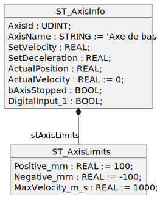
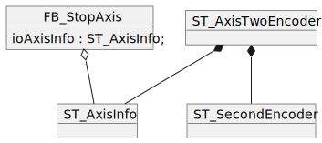

<h1 align="left">
  <br>
  
  <br>
  Industrial Automation Base
  <br>
</h1>

Cours AutB

Author: [Cédric Lenoir](mailto:cedric.lenoir@hevs.ch)

# MOD 02 Structures de données.

*Keywords:* **DUT Type Conversion  ARRAY STRUCT**

# Type conversion
Le Structured Text (du moins son compilateur) est exigeant et contraignant en terme de conversion de types. **A raison !**

Exemple
```iecst
   iSignal_2  : INT := 0;
   iSignal_3  : INT := 0;
   uiSignal   : UINT := 65535;
```
```iecst
   iSignal_2 := uiSignal;
   iSignal_3 := UINT_TO_INT(uiSignal);
```
<figure>
    
    <figcaption>Implicit conversion from unsigned Type 'UINT' to signed Type 'INT' : possible change of sign</figcaption>
</figure>

> Dans les deux cas, le résultat sera ```-1```. Dans le premier cas, le compilateur met en garde contre le risque. Dans le deuxième cas, le résultat sera le même, mais on peut supposer que le programmeur en implémentant explicitement la fonction de conversion aura pris conscience du risque d'un résultat qui pourrait être non désiré.

L'environnement de développement propose des fonctions de conversion pour presque toutes les figures de conversion de données. C'est une bonne pratique de les utiliser systématiquement afin d'éviter une mulitplications des **Warning**.

> Il n'est pas rare, et même très courant de constater que certains programmes génèrent beaucoup de **Warning**. Dans la plupart des cas, aucun ne sera critique. Le risque est toutefois de laisser passer **celui qui provoquera un crash**.

# ARRAY, les tableaux de données
On peut utiliser des données de 1, 2 voir 3 dimensions.
> Les trois dimensions sont valables pour le compilateur Codesys. Pour d'autres types de compilateurs, ceci demande à être vérifié.

```iecst
VAR
    i_Array     : ARRAY [1..10] OF DINT;
    ij_Array    : ARRAY [1..10, 1..5] OF DINT;
    ijk_Array   : ARRAY [1..5, 1..10, 1..10] OF DINT;
END_VAR
```

Une manière classique d'utiliser les tableaux est dans une boucle ```for```
```iecst
VAR
    iMyLoop     : DINT := 0;
    i_Array     : ARRAY [1..10] OF DINT;
END_VAR

FOR iMyLoop := 1 TO 10 BY 1 DO
    i_Array[iMyLoop] := iMyLoop;
END_FOR
```
> Le code ci-dessus, si il est parfaitement correct, ne devrait pas être utilisé, il n'est pas robuste ! Une bonne pratique consiste à utiliser des ```VAR GLOBAL CONSTANT``` pour les dimensions des tableaux, celles-ci seront réutilisées dans les boucles.

> Remarquez que, même pour une tâche autant simple qu'une boucle, on évite un variable du type **i**. Il s'agit ici d'une bonne pratique, et non d'une obligation. Raison: un variable i est compliquée à identifier dans le code.

### Définir les constantes dans: ```GVL_ARRAY_SIZE```.
```iecst
VAR_GLOBAL CONSTANT
    I_MAX_SIZE	:	UDINT := 10;
    J_MAX_SIZE	: 	UDINT := 20;
    K_MAX_SIZE	:	UDINT := 5;
END_VAR
```
### Définir les tableaux à l'aide des constantes.
```iecst
VAR
    iMyLoop     : DINT := 0;
    jMyLoop     : DINT := 0;
    kMyLoop     : DINT := 0;

    i_Array     : ARRAY [1..GVL_ARRAY_SIZE.I_MAX_SIZE] OF DINT;
    ij_Array    : ARRAY [1..GVL_ARRAY_SIZE.I_MAX_SIZE, 1..GVL_ARRAY_SIZE.J_MAX_SIZE] OF DINT;
    ijk_Array   : ARRAY [1..GVL_ARRAY_SIZE.I_MAX_SIZE, 1..GVL_ARRAY_SIZE.J_MAX_SIZE, 1..GVL_ARRAY_SIZE.K_MAX_SIZE] OF DINT;
```
> Les constantes sont définies dans un fichier séparé ```GVL_ARRAY_SIZE``` et demandent un accès sous la forme ```GVL_ARRAY_SIZE.MY_CONSTANT```. C'est un peu plus long à écrire, mais cela améliore la robustesse et la structure du programme.

### Utilser les boucles avec les constantes.
```iecst
FOR iMyLoop := 1 TO GVL_ARRAY_SIZE.I_MAX_SIZE BY 1 DO
    i_Array[iMyLoop] := iMyLoop;
END_FOR

FOR iMyLoop := 1 TO GVL_ARRAY_SIZE.I_MAX_SIZE BY 1 DO
    FOR jMyLoop := 1 TO GVL_ARRAY_SIZE.J_MAX_SIZE BY 1 DO
        ij_Array[iMyLoop,jMyLoop] := iMyLoop * jMyLoop;
    END_FOR
END_FOR

FOR iMyLoop := 1 TO GVL_ARRAY_SIZE.I_MAX_SIZE BY 1 DO
    FOR jMyLoop := 1 TO GVL_ARRAY_SIZE.J_MAX_SIZE BY 1 DO
        FOR kMyLoop := 1 TO GVL_ARRAY_SIZE.K_MAX_SIZE BY 1 DO
        ijk_Array[iMyLoop,jMyLoop,kMyLoop] := iMyLoop * jMyLoop * kMyLoop;
        END_FOR
    END_FOR
END_FOR
```
> Attention au **temps de cylce** ! Une boucle **trop longue** peut provoque le **crash** du PLC. Si la marge est relativement élévé pour un processeur puissant, la limite peut être rapidement atteinte sur un PLC d'entrée de gamme.

## Dans la pratique
Je n'utiliser presque jamais de tableaux à plusieurs dimensions, je privilégie les ```STRUCT``` qui sont développés un peu plus loin dans le cours.

### Définir un tableau sous forme de type utilisateur.

```iecst
TYPE stArrayOfDint :
STRUCT
    jArray : ARRAY[1..GVL_ARRAY_SIZE.J_MAX_SIZE] OF DINT;
END_STRUCT
END_TYPE
```
### Définir un tableau de types
```iecst
VAR
    ijStArray   : ARRAY [1..GVL_ARRAY_SIZE.I_MAX_SIZE] OF stArrayOfDint;
END_VAR
```

### Utiliser un tableau de types
```iecst
FOR iMyLoop := 1 TO GVL_ARRAY_SIZE.I_MAX_SIZE BY 1 DO
    FOR jMyLoop := 1 TO GVL_ARRAY_SIZE.J_MAX_SIZE BY 1 DO
        ijStArray[iMyLoop].jArray[jMyLoop] := iMyLoop * jMyLoop;
    END_FOR
END_FOR
```
> Ce type de construction rend le nombre de dimensions du tableau théoriquement **infinie**. Le nombre de boucles encapsulée les unes dans les autres est probablement limitée.

# Data User Type, DUT
Quel que soit l'environnement dans lequel est intégré un compilateur Codesys, on a la posibilité de sélection un **Add DUT**
- Structure
- Enumeration
- Alias
- Union

<figure>
    
    <figcaption>Create a new data unit type</figcaption>
</figure>

# Structure
Une structure permet d'organiser les variables par sujet de manière hiérarchiques.
Contrairement à un **ARRAY** qui est une liste d'objets identiques, un structure peut contenir des variables différentes.

## Forme simple d'une structure pour un axe.
### Définition de la structure
```iecst
TYPE ST_AxisInfo :
STRUCT
   AxisId          : UDINT;
   AxisName        : STRING;
   SetVelocity     : REAL;
   SetDeceleration : REAL;
   ActualPosition  : REAL;
   ActualVelocity  : REAL;
   bAxisStopped    : BOOL;
   DigitalInput_1  : BOOL;
END_STRUCT
END_TYPE
```

### Valeur initiale

> Si la grandeur est pertinente il est conseillé de donner une grandeur intiale. Une information du type **'Axe de base'** sera préférable à **' '**.

```iecst
TYPE ST_AxisInfo :
STRUCT
   AxisId          : UDINT;
   AxisName        : STRING := 'Axe de base';
   SetVelocity     : REAL;
   SetDeceleration : REAL;
   ActualPosition  : REAL;
   ActualVelocity  : REAL := 0;
   bAxisStopped    : BOOL;
   DigitalInput_1  : BOOL;
END_STRUCT
END_TYPE
```
### Instanciation
```iecst
VAR
   getVelocity : REAL;
   stAxisInfo  : ST_AxisInfo;
END_VAR
```

### Codage
```iecst
getVelocity := stAxisInfo.ActualVelocity;
```

> L'aide à la saisie, IntelliSense, combiné à une structure facilite grandement l'écriture de code complexe sans qu'il soit constamment nécessaire de se référer à la liste des variables. L'IDE affiche automatiquement la liste des variables de la structure après l'écriture du point.

<figure>
    
    <figcaption>ST_AxisInfo combiné à IntelliSense</figcaption>
</figure>

### Structure dans une structure
On peut placer des variables simples dans une structure, mais aussi d'autres variables composées telles que ```STRUCT``` ou ```ARRAY```.
```iecst
TYPE ST_AxisLimits :
STRUCT
   Positive_mm     : REAL := 100; 
   Negative_mm     : REAL := -100;
   MaxVelocity_m_s : REAL := 1000; 
END_STRUCT
END_TYPE
```

```iecst
TYPE ST_AxisInfo :
STRUCT
	AxisId          : UDINT;
	AxisName        : STRING := 'Axe de base';
	SetVelocity     : REAL;
	SetDeceleration : REAL;
	ActualPosition  : REAL;
	ActualVelocity  : REAL := 0;
	bAxisStopped    : BOOL;
	DigitalInput_1  : BOOL;
	stAxisLimit     : ST_AxisLimits;
END_STRUCT
END_TYPE
```
Ci dessous, la représentation UML de ```ST_AxisInfo``` **composé** avec ```ST_AxisLimits```.
<figure>
    
    <figcaption>ST_AxisInfo avec ST_AxisLimits en composition</figcaption>
</figure>

### Codage
```iecst
    stAxisInfo.stAxisLimit.Positive_mm := 500;
```

<figure>
    
    <figcaption>ST_AxisInfo.stAxisLimit.PositiveLimit IntelliSense</figcaption>
</figure>

> La définition des structures doit être une des premières étapes de tout programme PLC.
- Cela permet de fixer rapidement la structure du programme. *Phase de spécification*
- Cela accélére la phase de codage *Gain en productivité*
- Cela simplifie la lisibilité du programme *Phase de maintenance*.

## Structure Extends
La notion de Structure Extends appartient à la spécification Object-Oriented Programming **OOP** du IEC 61131-3. *Certaines plateformes importantes comme Siemens ne la supportent pas en 2023*.


<figure>
    
    <figcaption>ST_AxisInfo_Base MoreInputs Extends ST_AxisInfo</figcaption>
</figure>

La notion de Structure Extends permet de créer une structure existante à partir d'une nouvelle. En termes de programmation Orientée Objet, **OOP**, on parle d'héritage.

Le but de cours n'est pas de rentrer dans les subtilités de l'approche orientée objet, mais d'en mentionner certaines caractéristiques quand elle facilite un programmation **Classique**.

### Définition de la structure
Dans l'exemple ci-dessous, le programmeur veut utiliser la structure ```ST_AxisInfo```, mais il veut simplement plus d'entrées à disposition et les ajoute à une nouvelle structure ```ST_AxisInfo_MoreInputs```.

```iecst
TYPE ST_AxisInfo_MoreInputs EXTENDS ST_AxisInfo :
STRUCT
    DigitalInput_2 : BOOL;
    DigitalInput_3 : BOOL;
    DigitalInput_4 : BOOL;
END_STRUCT
END_TYPE
```


### Codage de structures avec Extends
L'utilisation de Extends ne change strictement rien en termes de codage.

```iecst
VAR
   lrActualPosition     : LREAL;
   stAxisInfoMoreInputs : ST_AxisInfo_MoreInputs;
END_VAR

lrActualPosition := stAxisInfoMoreInputs.ActualPosition;
```

### Avantage principal de la notion de *Extends*
Dans les exemples ci-dessus, nous avons 3 structures différentes, ```ST_AxisInfo``` et ```ST_AxisInfo_MoreInputs```. Supponsons qu'il soit nécessaire d'ajouter une information générale pour chaque type.

```iecst
   AxisStopped : BOOL;
```
En programmation classique, *sans extends*, il sera nécessaire d'ajouter la variable à **deux endroit dans le code**.

Avec l'utilisation de ```EXTENDS```, il suffira d'ajouter la variable dans la structure de base, soit à **un seul endroit dans le code**.

> En général, même si c'est possible, on ne passe pas les ```STRUCT``` par ```VAR_IN``` ou ```VAR_OUT```. d'une ```Function``` ou d'un ```Function Block``` Ceci afin d'éviter le temps perdu à faire des copies de variables de la structure vers le block et vice versa.

De préférence on utilise ```VAR_IN_OUT```, qui passe l'adresse de la structure, on travaillera donc sur les valeurs d'origine

## FB avec ```VAR_IN_OUT```

### Déclaration d'un FB avec ```VAR_IN_OUT```
```iecst
FUNCTION_BLOCK FB_StopAxis
VAR_IN_OUT
   ioAxisInfo : ST_AxisInfo;	
END_VAR
```

### Instanciation d'un FB avec ```VAR_IN_OUT```
<figure>
    
    <figcaption>ST_AxisInfo with FB_StopAxis</figcaption>
</figure>

Ce qu'il est **très important de comprendre** dans cette construction, c'est que ```stAxisInfo``` et ```fbStopAxis_X``` sont deux entités qui sont déclarées séparément. Une structure pour un axes complet contient parfois plusieurs dizaines de variables, il serait au niveau codage et à lors de l'exécution du code, absolument contre-productif de copier chaque valeur de ```stAxisInfo``` dans ```fbStopAxis_X```.

```iecst
VAR
   stAxisInfo   : ST_AxisInfo;
   fbStopAxis_X : FB_StopAxis;
END_VAR
```
> La structure ```ST_AxisInfo``` doit être instanciée: ```stAxisInfo``` et ```FB_StopAxis``` travaillera avec les valeurs mémorisées dans ```stAxisInfo```.

### Codage d'un FB avec une structure en ```IN_OUT```
```iecst
 (* With ST_AxisInfo *)
 fbStopAxis_X(ioAxisInfo := stAxisInfo);
```

## Structure ```EXTENDS``` avec ```VAR_IN_OUT```

### Un peu d'abstraction avec ```EXTENDS```
> Ceci dépasse un peu le cadre *basic* de ce cours, mais cela permet d'illustrer l'intérêt de l'extension **OOP**.

Dans l'exemple ci-dessous, nous avons créé une structure d'axe **spéciale** avec **deux codeurs**.

<figure>
    
    <figcaption>VAR_IN_OUT with Extends</figcaption>
</figure>

Cependant, nous avons le droite de passer la nouvelle structure ```ST_AxisTwoEncoder``` en ```VAR_IN_OUT``` même si elle est de type différent, car elle possède exactement par héritage les variables attendues par ```fbAxisInfo```.

```iecst
VAR
   stAxisTwoEncoder : ST_AxisTwoEncoder;    // Build with Inheritance
   fbStopAxis_X     : FB_StopAxis;
END_VAR

fbStopAxis_X(ioAxisInfo := stAxisTwoEncoder;
```

> Avantage, il n'est pas nécessaire de réécrire un FB ```FB_StopAxis``` pour cette nouvelle structure.

### Si Extends n'est pas disponible
Il est possible en version **classique non OOP** d'obtenir le même résultat, mais c'est moins élégant:
<figure>
    
    <figcaption>VAR_IN_OUT with Composition</figcaption>
</figure>

Dans ce cas, on passera une partie de la structure seulement en ```VAR_IN_OUT```
```iecst
VAR
   stAxisTwoEncoder : ST_AxisTwoEncoder;    // Build with Composition
   fbStopAxis_X     : FB_StopAxis;
END_VAR

fbStopAxis_X(ioAxisInfo := stAxisTwoEncoder.stAxisInfo);
```

# Enumeration
L'énumération est mon type préféré, principalement pour la construction de ```CASE <state> OF```.

## Premier exemple
```iecst
TYPE EN_MotionStateMachineNoDefType :
(
    Idle             := 99,
    MoveOne          := 10,
    MoveOneCheckDone := 20,
    MoveTwo          := 30,
    MoveTwoCheckDone := 40,
    ErrorStop        := 50,
    Stopped          := 60   
) := Idle;
END_TYPE
```

### Intérêt principal de l'énumération
Le principal intérêt de é'énumération est la description d'une machine d'état. Dans la figure ci-dessosu, les transitions sont à titre d'exemple uniquement.
<figure>
    
    <figcaption>Description des états à partir d'une énumération</figcaption>
</figure>

### Codage d'un ```CASE_OF```
```iecst
VAR
    stateMotion : EN_MotionStateMachineNoDefType := EN_MotionStateMachineNoDefType.Idle;
END_VAR

CASE stateMotion OF
    EN_MotionStateMachine.Idle:
        stateMotion := EN_MotionStateMachine.MoveOne;
    EN_MotionStateMachineNoDefType.MoveOne:
        stateMotion := EN_MotionStateMachine.MoveOneCheckDone;
    EN_MotionStateMachineNoDefType.MoveOneCheckDone:
        stateMotion := EN_MotionStateMachine.MoveTwo;
    EN_MotionStateMachineNoDefType.MoveTwo:
        stateMotion := EN_MotionStateMachine.MoveTwoCheckDone;
    EN_MotionStateMachineNoDefType.MoveTwoCheckDone:
        stateMotion := EN_MotionStateMachine.ErrorStop;
    EN_MotionStateMachineNoDefType.ErrorStop:
        stateMotion := EN_MotionStateMachine.Stopped;
    EN_MotionStateMachineNoDefType.Stopped:
    ; 
END_CASE
```

> Dans certains environnements, par exemple Siemens, les Enums n'existent pas, dans ce cas on pourra utiliser des constantes. Dans tous les cas, l'écriture d'une machine d'état sans caractères littéraux est une mauvaise pratique

### TextList support
> Text list support enables localization of the enumeration component identifiers and a representation of the symbolic component value in a text output in the visualization.
Personnellement jamais utilisé.

### Extends Enum
**Impossible**. Il n'est pas possible d'étendre un Enum comme il est possible de le faire avec une structure.

## Deuxième exemple
```iecst
TYPE EN_TrafficLight_typ :
(
    Idle   := 99,
    Rouge  := 1,
    Orange := 2,
    Vert   := 3
) WORD := Rouge;
END_TYPE
```

> Noter Idle à 99, c'est que si l'Enum n'est pas initalisé, il ne fonctionnera pas.

> Noter ) ``WORD`` := Rouge; **WORD** permet ici de forcer le type de base à utiliser pour l'Enum, par exemple pour un traitement numérique ou logique.

> Noter qu'il est possible de fixer une valeur d'initilisation pour l'Enum. Ici: **Rouge**.

# Alias
Un alias est un type de données défini par l'utilisateur qui peut être utilisé pour créer un nom alternatif pour un type de données ou un bloc fonctionnel.

Example:
*On délare une chaine de 50 caractères *ascii**

```iecst
TYPE T_Message : STRING[50];
END_TYPE
```

Déclaration

```iecst
sMessageA : T_Message;
```

Utilisation

```iecst
sMessageA := 'This is a message';
```

> Ceci est intéressant si on utilise souvent une certaine construction, ici la chaine de caractères.

# Union
Une UNION est une structure de données qui contient généralement différents types de données. Dans une union, tous les composants ont le même décalage, ce qui signifie qu'ils occupent le même espace mémoire.

> L'intérêt d'une union réside principalement dans la programmation de bas niveau. Dans l'exemple ci-dessous tirée d'un capteur IO-Link [Baumer O300.DL](https://www.baumer.com/fr/en/product-overview/distance-measurement/laser-distance-sensors/standard-laser-distance-sensors/o300-dl-gm1j-72n/p/38517). Le capteur retourne les données dans une trame de 24 bits. Pour accéder à certaines données, on devra le faire soit sous forme de bits, ou de bytes.

<figure>
    
    <figcaption>IO-Link Process Data for Baumer O300.DL</figcaption>
</figure>

- MDC1: 2 bytes de données pour la grandeur du signal (16 bits)
- Q: le bit de qualité qui indique que le signal est utilisable
- BDC1: un seuil programmable qui fait que le capteur peut être utilisé simplement comme détecteur de proximité sans se soucier de la valeur MDC1.
- A: un bit d'alarme qui indique un problème dans le capteur.

## Déclaration d'une structure de bits.
```iecst
TYPE ST_Bits :
STRUCT
    bBit7  : BIT;
    bBit6  : BIT;
    bBit5  : BIT;
    bBit4  : BIT;
    bBit3  : BIT;
    bBit2  : BIT;
    bBit1  : BIT;
    bBit0  : BIT;   
END_STRUCT
END_TYPE
```
### Déclaration d'une union de 3 bytes.
```iecst
TYPE U_3Byte :
UNION
    a3Byte : ARRAY[1..3] OF BYTE;    
    aBits  : ARRAY[1..3] OF ST_Bits;
END_UNION
END_TYPE
```
### Instanciation de l'union
```iecst
VAR
    bAlarme    : BOOL;
    iSignal    : INT := 0;
    u3Byte     : U_3Byte;
END_VAR
```
### Utilisation dans le code
```iecst
bAlarme := u3Byte.aBits[3].bBit3;
iSignal := WORD_TO_INT(u3Byte.a3Byte[1] * 256 + u3Byte.a3Byte[2]);
```
> On pourra vérifier facilement quel devrait être le résulat si le Byte 1 vaut ```0E``` et le Byte 2 ```E6```

> On pourra vérifier ensuite quel devrait être le résulat si le Byte 1 vaut ```FF``` et le Byte 2 ```FF```

## Big Endian vs Little Endian
Une application d'une union pourra aider à la résolution de problèmes liés à l'```Endianness ```.

### Endianness
Spécifie l'ordre dans lequel les séquences de **bytes** sont enregistrée en mémoire.
|Little Endian     |Big Endian      |
|-----------------------------------|---------------|
|Intel             |Motorola        |
|Byte with the smallest value first |Byte with the largest value first|
|decimal 41394     |decimal 41394  |
|0xA1B2            |0xA1B2         |
|```0xB2```, ```0xA1``` |```0xA1```, ```0xB2``` | 

Concrètement pour une représentation ```Little-Endian``` sur un processeur **Intel**.
```
VAR
   myBytes  : ARRAY[1..4] OF BYTE;
END_VAR

// For  myByte[1] - myByte[2] - myByte[3] - myByte[4]
    myByte[1] := 16#B2;
    myByte[2] := 16#A1;
    myByte[3] := 16#0;
    myByte[4] := 16#0;
```

# Exercices

## Exercice 1, Min/Max/RMS of ioBuffer
Nous avons en variable globale un buffer de 50 valeurs venant d'un convertisseur 16 bits, valeurs positives ou négatives.
La taille du buffer est fixée par une constante.
A chaque cycle, le système fait l'aquisition de 50 valeurs, sampling rate 50 [kHz] avec un bus temps réel à 1 [kHz].
A chaque cycle, nous voulons obetenir:
-   ```iMinSampleValue```, la grandeur minimum.
-   ```iMaxSampleValue```, la grandeur maximum.
-   ```iRMSSampleValue```, la grandeur RMS.

[Solution Exercice 1](#solution-exercice-1-minmaxrms-of-iobuffer)

## Exercice 2, State Machine
Ecrire l'```Enum``` et la structure ```CASE_OF```, c'est à dire uniquement les états sans les transitions de la machine d'état ci-dessous.
<figure>
    
    <figcaption>Machine d'états CSV Write</figcaption>
</figure>

### Contraintes:
- le premier état à la valeur 999.
- les autres états ont une valeur fixe.
- l'énumération est de type ```UDINT```
- l'état initial est forcé à ```WAIT_RISING_EDGE```
- la variable d'état du ```CASE_OF``` est ```stateCsv```.

[Solution Exercice 2](#solution-exercice-2-state-machine)

## Exercice 3, Modbus avec ```Endianess```
Une série de registres Modbus sont donnés avec les informations suivantes.
Format ```Big-Endian```.
|Register      |Type      |Unit      |Description      |
|--------------|----------|----------|-----------------|
|0-3           |INT(32)     |Wh        |Total active energy|
|4-7           |INT(32)     |VARh      |Total reactive energy|
|8-11          |INT(32)     |VAh       |Total apparent energy|
Une trame ```Modbus``` arrive dans le registre suivant:

> Warning, this examples comes from a datasheet for Modbus. Do not forget about the integer defintion of IEC 61131-3 for 32 bits integer. That is: **DINT** !
```
    modBusFrame : ARRAY[0..11] OF BYTE := [0, 8, 143, 237, 0, 41, 3, 189, 255, 254, 21, 231];
```
Nous devons lire la trame ci-dessus avec un processeur Intel ```Little-Endian``` pour afficher les valeurs dans des ```DINT```.

[Solution Exercice 3](#solution-exercice-3-modbus-avec-endianess) 

## Exercice 4, VAR_IN_OUT with Extends
Déclarer, instancier et coder l'exemple ci-dessus avec ```ST_AxisTwoEncoder```.

<figure>
    
    <figcaption>VAR_IN_OUT with Extends</figcaption>
</figure>

```ST_SecondEncoder``` est composé de:
```iecst
	ActualPosition  : REAL;
	ActualVelocity  : REAL := 0;
	bAxisStopped    : BOOL;
```
``FB_StopAxis`` est instancié sous le nom de ``fbStopAxisTwoEncoder``.

La structure de données ``ST_AxisTwoEncoder`` est instancié sous nom de ```stAxisTwoEncoder```

L'axe X était instancié sous la forme suivante:
```iecst
 (* With ST_AxisInfo *)
 fbStopAxis_X(ioAxisInfo := stAxisInfo);
```

[Solution Exerice 4](#solution-exerice-4-var_in_out-with-extends)

# Solution des exercices

## Solution Exercice 1, Min/Max/RMS of ioBuffer
Fichier ```GVL_IO_BUFFER``` de déclaration des variables globales.
```iecst
VAR_GLOBAL
    ioBuffer        : ARRAY[1..IO_BUFFER_SIZE] OF INT;
END_VAR

VAR_GLOBAL CONSTANT
    IO_BUFFER_SIZE  : UDINT := 50;
END_VAR
```
### Codage
```iecst
PROGRAM PRG_MinMaxMean
VAR
    iBufferLoop   : UDINT;
    iMinValue     : INT;
    iMaxValue     : INT;
    iRMSValue     : INT;
    iSumRMSValue  : LINT;
END_VAR

// Init values before computation
iMinValue := GVL_IO_BUFFER.MAX_16_BITS;
iMaxValue := GVL_IO_BUFFER.MIN_16_BITS;
iSumRMSValue := 0;

FOR iBufferLoop := 1 TO GVL_IO_BUFFER.IO_BUFFER_SIZE BY 1 DO
    // Get min value
    IF GVL_IO_BUFFER.ioBuffer[iBufferLoop] < iMinValue THEN
        iMinValue := GVL_IO_BUFFER.ioBuffer[iBufferLoop];
	END_IF
    // Get max value
    IF GVL_IO_BUFFER.ioBuffer[iBufferLoop] > iMaxValue THEN
        iMaxValue := GVL_IO_BUFFER.ioBuffer[iBufferLoop];
	END_IF
    // Accumulate values (need a variable bigger as min/max INT)
    iSumRMSValue := iSumRMSValue + (GVL_IO_BUFFER.ioBuffer[iBufferLoop] * GVL_IO_BUFFER.ioBuffer[iBufferLoop]);
END_FOR

// Values with 16 bits suppose no informatino lost
iRMSValue := LREAL_TO_INT(SQRT(LINT_TO_LREAL(iSumRMSValue/GVL_IO_BUFFER.IO_BUFFER_SIZE)));
```
### Test
Avec tous les échantillons à 0, sauf:
- un échantillon à 50
- un échantillon à -50

iMinValue := -50
iMaxValue := 50
iRMSValue := 10

## Solution Exercice 2, State Machine
```iecst
### Enum
TYPE EN_CSV_WriteSteps :
(
	WAIT_RISING_EDGE := 0,
	GENERATE_FILENAME := 21,
	OPEN_SOURCE_FILE := 1,
	WAIT_OPEN_NOT_BUSY := 2,
	CONVERT_ONE_CSV_RECORD := 3,
	WRITE_RECORD_TO_FILE := 4,
	WAIT_UNTIL_WRITE_NOT_BUSY := 5,
	CLOSE_SOURCE_FILE := 10,
	WAIT_UNTIL_CLOSE_NOT_BUSY := 11,
	ERROR_OR_READY_STEP := 100
) UDINT := WAIT_RISING_EDGE;
END_TYPE
```
### Codage
```iecst
VAR
    stateCsv    : EN_CSV_WriteSteps; 
END_VAR

CASE stateCsv OF
	EN_CSV_WriteSteps.WAIT_RISING_EDGE:
    ;
	EN_CSV_WriteSteps.GENERATE_FILENAME:
    ;
	EN_CSV_WriteSteps.OPEN_SOURCE_FILE:
    ;
	EN_CSV_WriteSteps.WAIT_OPEN_NOT_BUSY:
    ;
	EN_CSV_WriteSteps.CONVERT_ONE_CSV_RECORD:
    ;
	EN_CSV_WriteSteps.WRITE_RECORD_TO_FILE:
	;
    EN_CSV_WriteSteps.WAIT_UNTIL_WRITE_NOT_BUSY:
	;
    EN_CSV_WriteSteps.CLOSE_SOURCE_FILE:
	;    
    EN_CSV_WriteSteps.WAIT_UNTIL_CLOSE_NOT_BUSY:
	;
    EN_CSV_WriteSteps.ERROR_OR_READY_STEP:
    ;
END_CASE
```

## Solution Exercice 3, Modbus avec ```Endianess```
### Liste des constantes dans le fichier ```GVL_Modbus```
```iecst
VAR_GLOBAL CONSTANT
    MB_FRAME_SIZE     : INT := 12;
    NUMBER_OF_INT32   : INT := 3;  
    TYPE_SIZE_IN_BYTE : INT := 4;
END_VAR
```
### Définition de l'union ```U_SolveModbus```
```iecst
TYPE U_SolveModbus :
UNION
    myBytes   : ARRAY[1..GVL_Modbus.TYPE_SIZE_IN_BYTE] OF BYTE;
    diMyResult : DINT;
END_UNION
END_TYPE
```
### Définition de la structure générale
```iecst
TYPE ST_SolveModbus :
STRUCT
    arMyRegisters            : ARRAY[1..GVL_Modbus.NUMBER_OF_INT32] OF U_SolveModbus;
    TotalActiveEnergy_Wh     : DINT;
    TotalReactiveEnergy_VARh : DINT;
    TotalApparentEnergy_VAh  : DINT;
END_STRUCT
END_TYPE
```
### Program
```iecst
VAR
    modBusFrame : ARRAY[1..GVL_Modbus.MB_FRAME_SIZE] OF BYTE := [0, 8, 143, 237, 0, 41, 3, 189, 255, 254, 21, 231];
    stResult    : ST_SolveModbus;
    // Number of INT (32 bits - 4 bytes) in the frame
    int32Loop   : INT;
    // Number of Byte in INT
    iRegInt32   : INT;
    
    iCheck      : INT;
    iCheckLoop  : INT;
END_VAT

// Only used to check if the program runs (not needed for algorithms
iCheck := iCheck + 1;
iCheckLoop := 0;

// Dispatch registers from Frame to Struct
FOR int32Loop := 1 TO GVL_Modbus.NUMBER_OF_INT32 BY 1 DO
    FOR iRegInt32 := 1 TO GVL_Modbus.TYPE_SIZE_IN_BYTE BY 1 DO
        // Next line is not usefull, write it to help debug if needed
        iCheckLoop := (int32Loop-1) * GVL_Modbus.TYPE_SIZE_IN_BYTE + iRegInt32;
        stResult.arMyRegisters[int32Loop].myBytes[(GVL_Modbus.TYPE_SIZE_IN_BYTE+1)-iRegInt32] := modBusFrame[(int32Loop-1) * GVL_Modbus.TYPE_SIZE_IN_BYTE + iRegInt32];
    END_FOR
END_FOR

// Total active energy, should be 561133
stResult.TotalActiveEnergy_Wh := stResult.arMyRegisters[1].diMyResult;

// Total reactive energy, should be 2687933
stResult.TotalReactiveEnergy_VARh := stResult.arMyRegisters[2].diMyResult;

// Total apparent energy, sould be -125465
stResult.TotalApparentEnergy_VAh := stResult.arMyRegisters[3].diMyResult;
```

## Solution Exerice 4, VAR_IN_OUT with Extends

Déclaration des structures

```iecst
TYPE ST_SecondEncoder
STRUCT
	ActualPosition  : REAL;
	ActualVelocity  : REAL := 0;
	bAxisStopped    : BOOL;
END_STRUCT
END_TYPE
```

```iecst
TYPE ST_AxisTwoEncoder EXTENDS ST_AxisInfo :
STRUCT
    stSecondEncoder : ST_SecondEncoder;
END_STRUCT
END_TYPE
```
Instanciation des variables
```iecst
VAR
   fbStopAxisTwoEncoder : FB_StopAxis;
   stAxisTwoEncoder     : ST_AxisTwoEncoder;
END_VAR
```

Appel du FB
```iecst
 (* With ST_AxisTwoEncoder *)
 fbStopAxisTwoEncoder(ioAxisInfo := stAxisTwoEncoder);
```