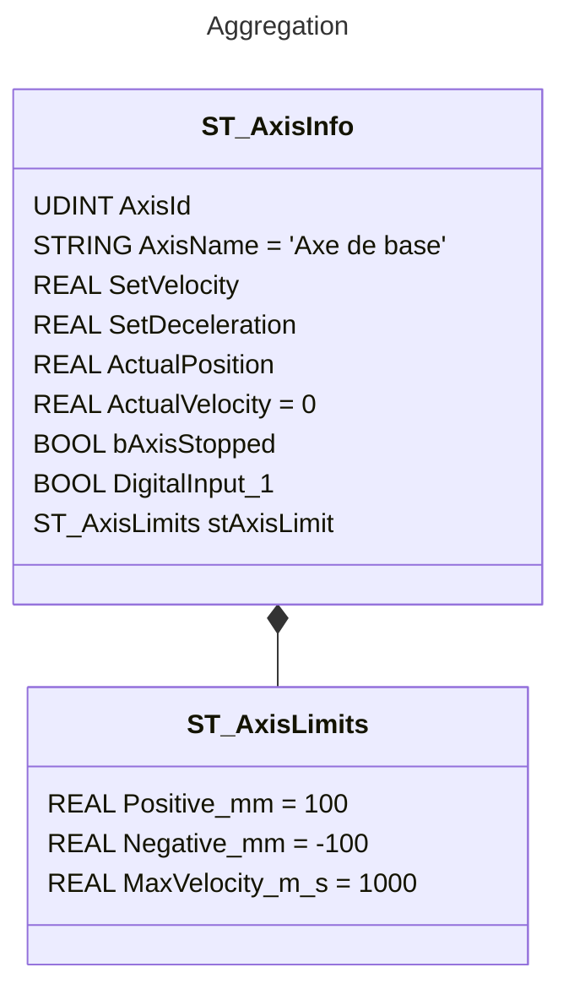
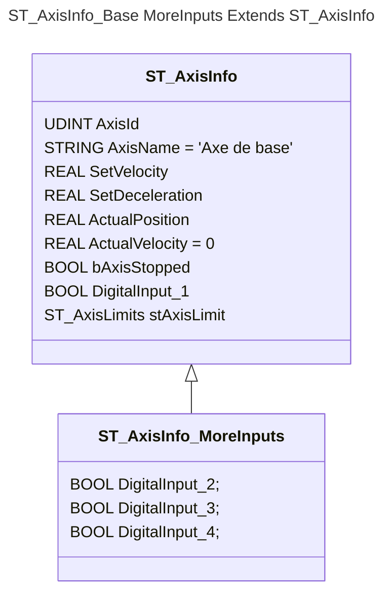
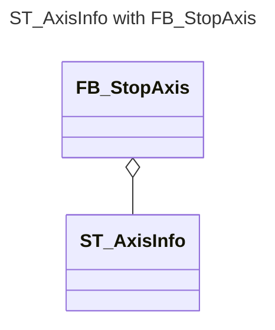
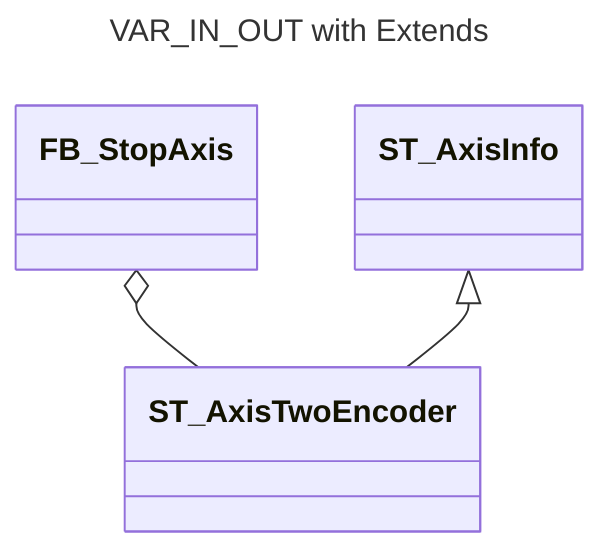
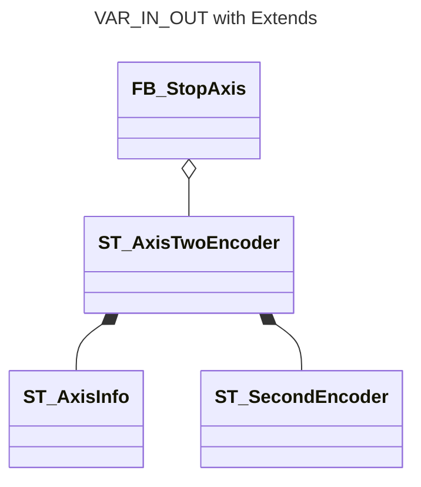
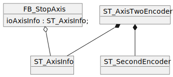
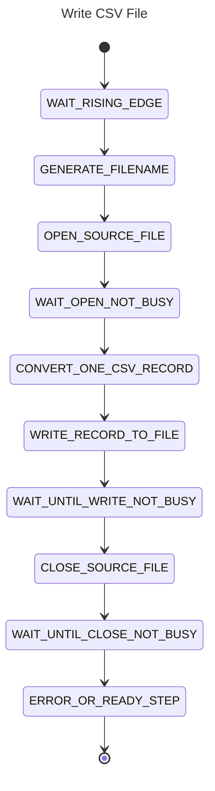

<h1 align="left">
  <br>
  
  <br>
  Industrial Automation Base
  <br>
</h1>

Cours AutB

Author: [Cédric Lenoir](mailto:cedric.lenoir@hevs.ch)

# Modul 02 Datenstrukturen.

*Keywords:* **DUT Type Conversion  ARRAY STRUCT**

# Inhaltsverzeichnis

- [Modul 02 Datenstrukturen.](#modul-02-datenstrukturen)
- [Inhaltsverzeichnis](#inhaltsverzeichnis)
- [Präambel](#präambel)
  - [Tippen](#tippen)
    - [Ein paar Erinnerungen zu Typen.](#ein-paar-erinnerungen-zu-typen)
    - [Einige Beispiele :](#einige-beispiele-)
    - [Um zusammenzufassen:](#um-zusammenzufassen)
  - [Datenbenutzertyp](#datenbenutzertyp)
- [Type conversion](#type-conversion)
- [ARRAY, Datentabellen](#array-datentabellen)
    - [Definieren Sie Konstanten in: ```GVL_ARRAY_SIZE```.](#definieren-sie-konstanten-in-gvl_array_size)
    - [Definieren Sie Arrays mithilfe von Konstanten.](#definieren-sie-arrays-mithilfe-von-konstanten)
    - [Verwenden Sie Schleifen mit Konstanten.](#verwenden-sie-schleifen-mit-konstanten)
  - [In der Praxis](#in-der-praxis)
    - [Definieren Sie ein Array als Benutzertyp.](#definieren-sie-ein-array-als-benutzertyp)
    - [Definieren Sie ein Array von Typen](#definieren-sie-ein-array-von-typen)
    - [Verwenden Sie ein Array von Typen](#verwenden-sie-ein-array-von-typen)
- [Data User Type, DUT](#data-user-type-dut)
- [Struktur](#struktur)
  - [Einfache Form einer Struktur für eine Achse.](#einfache-form-einer-struktur-für-eine-achse)
    - [Strukturdefinition](#strukturdefinition)
    - [Ursprünglicher Wert](#ursprünglicher-wert)
    - [Instanziierung](#instanziierung)
    - [Codierung](#codierung)
    - [Struktur innerhalb einer Struktur](#struktur-innerhalb-einer-struktur)
    - [Codierung](#codierung-1)
  - [Struktur erstreckt sich](#struktur-erstreckt-sich)
    - [Strukturdefinition](#strukturdefinition-1)
    - [Strukturen mit Extends kodieren](#strukturen-mit-extends-kodieren)
    - [Hauptvorteil des Konzepts von *Extends*](#hauptvorteil-des-konzepts-von-extends)
  - [FB avec ```VAR_IN_OUT```](#fb-avec-var_in_out)
    - [Deklaration eines FB mit```VAR_IN_OUT```](#deklaration-eines-fb-mitvar_in_out)
    - [Instanciation d'un FB avec ```VAR_IN_OUT```](#instanciation-dun-fb-avec-var_in_out)
    - [Codierung eines FB mit einer ``IN_OUT``-Struktur](#codierung-eines-fb-mit-einer-in_out-struktur)
  - [Struktur ```EXTENDS``` mit ```VAR_IN_OUT```](#struktur-extends-mit-var_in_out)
    - [UEine kleine Abstraktion mit ```EXTENDS```](#ueine-kleine-abstraktion-mit-extends)
    - [Si Extends n'est pas disponible](#si-extends-nest-pas-disponible)
- [Aufzählung](#aufzählung)
  - [Erstes Beispiel](#erstes-beispiel)
    - [Hauptinteresse der Aufzählung](#hauptinteresse-der-aufzählung)
    - [Codierung von ```CASE_OF```](#codierung-von-case_of)
    - [TextList-Unterstützung](#textlist-unterstützung)
    - [Erweitert Enum](#erweitert-enum)
  - [Zweites Beispiel](#zweites-beispiel)
- [Alias](#alias)
- [Union](#union)
  - [Deklaration einer Bitstruktur.](#deklaration-einer-bitstruktur)
    - [Deklaration einer UNION von 3 Bytes.](#deklaration-einer-union-von-3-bytes)
    - [Instanziieren der UNION](#instanziieren-der-union)
    - [Verwendung im Code](#verwendung-im-code)
    - [Ein Typ für die Konvertierung von zwei Modbus-Wörtern 2 Float](#ein-typ-für-die-konvertierung-von-zwei-modbus-wörtern-2-float)
  - [Big Endian gegen Little Endian](#big-endian-gegen-little-endian)
    - [Endianness](#endianness)
- [Übungen](#übungen)
  - [Übung 1, Min/Max/RMS von ioBuffer](#übung-1-minmaxrms-von-iobuffer)
  - [Übung 2, State Machine](#übung-2-state-machine)
    - [Einschränkungen:](#einschränkungen)
  - [Übung 3, Modbus avec ```Endianess```](#übung-3-modbus-avec-endianess)
  - [Übung 4, VAR\_IN\_OUT with Extends](#übung-4-var_in_out-with-extends)
- [Lösung der Übungen](#lösung-der-übungen)
  - [Lösung Übung 1, Min/Max/RMS of ioBuffer](#lösung-übung-1-minmaxrms-of-iobuffer)
    - [Codage](#codage)
    - [Test](#test)
  - [Lösung Übung  2, State Machine](#lösung-übung--2-state-machine)
    - [Codage](#codage-1)
  - [Lösung Übung 3, Modbus mit ```Endianess```](#lösung-übung-3-modbus-mit-endianess)
    - [Liste der Konstanten in der Datei ``GVL_Modbus``.](#liste-der-konstanten-in-der-datei-gvl_modbus)
    - [Definition von Gewerkschaft ```U_SolveModbus```](#definition-von-gewerkschaft-u_solvemodbus)
    - [Definition der allgemeinen Struktur](#definition-der-allgemeinen-struktur)
    - [Program](#program)
  - [Lösung Übung 4, VAR\_IN\_OUT with Extends](#lösung-übung-4-var_in_out-with-extends)

# Präambel
## Tippen
Die IEC 61131-3-Programmiersprache für strukturierten Text ist eine stark typisierte Sprache. Dies bedeutet, dass der Compiler Typfehler während der Kompilierung erkennen kann.

> Die IEC 61131-3-Sprache ist eine **statisch typisierte** Sprache, was bedeutet, dass der Typ der Variablen vom Benutzer **vor** ihrer Verwendung definiert werden muss.

> Die IEC61131-3-Sprache ist eine **kompilierte Sprache**, das heißt, sie wird vor der Verwendung in ein ausführbares Binärformat konvertiert.

> Diese unterschiedlichen Eigenschaften unterscheiden es stark von einer Sprache wie Python, ähneln aber im Prinzip einer Sprache wie C++.

### Ein paar Erinnerungen zu Typen.
Mit dem Typ können Sie die binäre Codierung einer Variablen definieren. Für ein **PLC** *Programmable Logic System* ou **ICS**, *Industrial Control System*, dessen Zweck die Kommunikation zwischen verschiedenen Gerätetypen ist, ist dies besonders wichtig.

Auf deutsch, PLC ist **SPS** *Speicherprogrammierbare Steuerung*.

### Einige Beispiele :
- Um mit der realen analogen Welt zu kommunizieren, verwenden Systeme A/D-, Analog/Digital- oder D/A-Digital/Analog-Wandler, die oft in Formaten zwischen 10 und 16 Bit vorliegen. Das direkte Schreiben einer im IEEE-754-Format codierten reellen Zahl in einen D/A-Wandler hat keine Bedeutung und führt zu einem Fehler.

- Eine andere Art der Kommunikation ist die von Modbus TCP, diesem rudimentären Protokoll, das jedoch in Ethernet-Netzwerken immer noch weit verbreitet ist, beispielsweise für die Diagnose elektrischer Schütze mithilfe von 16-Bit-Registern. Eine reelle Zahl von 64 Bit gemäß IEEE-754 wird in 4 Teile zu je 16 Bit aufgeteilt.
Wenn man sie Stück für Stück betrachtet, hat keines dieser 16 Bits eine Bedeutung und ihre Fehlinterpretation führt zu einem Fehler oder möglicherweise zu einem Absturz, wenn sie als unbekannte Zahl interpretiert wird.

Ein **ICS** Industrial Control System wird häufig in kritischen Infrastrukturen eingesetzt, ein kanadischer Autor verwendet den Begriff **Boomable**-Industrie, der die Problematik, die beispielsweise in der chemischen Industrie im Wallis zu finden ist, deutlich zum Ausdruck bringt.

### Um zusammenzufassen:
Ein Programm, ein Funktionsblock oder eine Funktion, die in einer strukturierten Sprache vom Typ IEC-61131-3 geschrieben sind, beginnt immer mit einem Header oder **Header**, der alle Variablen enthält, die im Rest des Programms verwendet werden.

Der **statische** Charakter von Variablen in einem in IEC-61131-3 geschriebenen Programm ist nicht nur ein veraltetes Merkmal der Sprache, sondern vor allem auch ein Merkmal, das die **Robustheit des Codes** verbessert.

## Datenbenutzertyp
In einigen Sprachen wie Matlab ist ein Typ nur eine Klasse unter anderen. In der Sprache IEC 61131-3 gibt es Grundtypen, zum Beispiel INT, REAL, BOOL. Aber auch die Möglichkeit, Verbindungstypen zu definieren, die den Bedürfnissen des Benutzers entsprechen.

Auch in der Mathematik verwenden wir Typen auf bestimmte Weise. Wenn wir komplexe Zahlen verwenden möchten, um beispielsweise mit einem RLC-Oszillator zu arbeiten, können wir einen bestimmten Benutzertyp definieren.

```ìecst
(*
    Define data type
*)
TYPE Cplx_typ :
STRUCT
   re        : REAL;
   im        : REAL;
END_STRUCT
END_TYPE
```
```ìecst
(*
    Declare variable of type Cplx_typ in a header
*)
VAR
   myCplx      : Cplx_typ;
   myMagnitude : REAL;
END_VAR
```

```ìecst
(*
    Use this new type
*)
myMagnitude := SQRT(myCplx.re^2 + myCplx.im^2);
```

Allgemeiner gesagt werden wir im weiteren Verlauf dieses Kurses hauptsächlich den DUT Data User Type verwenden, um die Informationen eines Automatisierungssystems zu strukturieren.

# Type conversion
Strukturierter Text (zumindest sein Compiler) ist hinsichtlich der Typkonvertierung anspruchsvoll und restriktiv. **Ist richtig !**

Beispiel
```iecst
   iSignal_2  : INT := 0;
   iSignal_3  : INT := 0;
   uiSignal   : UINT := 65535;
```
```iecst
   iSignal_2 := uiSignal;
   iSignal_3 := UINT_TO_INT(uiSignal);
```
<figure>
    
    <figcaption>Implicit conversion from unsigned Type 'UINT' to signed Type 'INT' : possible change of sign</figcaption>
</figure>

> In beiden Fällen ist das Ergebnis ```-1```. Im ersten Fall warnt der Compiler vor dem Risiko. Im zweiten Fall ist das Ergebnis dasselbe, wir können jedoch davon ausgehen, dass der Programmierer durch die explizite Implementierung der Konvertierungsfunktion auf das Risiko eines unerwünschten Ergebnisses aufmerksam geworden ist.

Die Entwicklungsumgebung stellt Konvertierungsfunktionen für nahezu alle Datenkonvertierungszahlen zur Verfügung. Es empfiehlt sich, sie systematisch zu verwenden, um mehrere **Warnungen** zu vermeiden.

> Es ist nicht ungewöhnlich und sogar sehr häufig, dass bestimmte Programme viele **Warnungen** generieren. In den meisten Fällen wird keine davon kritisch sein. Das Risiko besteht jedoch darin, **denjenigen passieren zu lassen, der einen Absturz verursacht**.

# ARRAY, Datentabellen
Wir können Daten in 1, 2 oder sogar 3 Dimensionen verwenden.

> Alle drei Dimensionen gelten für den Codesys-Compiler. Für andere Compilertypen muss dies überprüft werden.

```iecst
VAR
    i_Array     : ARRAY [1..10] OF DINT;
    ij_Array    : ARRAY [1..10, 1..5] OF DINT;
    ijk_Array   : ARRAY [1..5, 1..10, 1..10] OF DINT;
END_VAR
```

Eine klassische Art, Arrays zu verwenden, ist eine ```FOR```-Schleife.
```iecst
VAR
    iMyLoop     : DINT := 0;
    i_Array     : ARRAY [1..10] OF DINT;
END_VAR

FOR iMyLoop := 1 TO 10 BY 1 DO
    i_Array[iMyLoop] := iMyLoop;
END_FOR
```
> Der obige Code sollte, wenn er vollkommen korrekt ist, nicht verwendet werden, er ist nicht robust! Eine gute Vorgehensweise besteht darin, „VAR GLOBAL CONSTANT“ für die Dimensionen der Arrays zu verwenden. Diese werden in den Schleifen wiederverwendet.

> Beachten Sie, dass wir selbst für eine so einfache Aufgabe wie eine Schleife eine Variable vom Typ ```i``` vermeiden. Dies ist eine gute Praxis, keine Verpflichtung. Grund: Eine Variable ``i`` ist im Code schwer zu identifizieren.

### Definieren Sie Konstanten in: ```GVL_ARRAY_SIZE```.
```iecst
VAR_GLOBAL CONSTANT
    I_MAX_SIZE	:	UDINT := 10;
    J_MAX_SIZE	: 	UDINT := 20;
    K_MAX_SIZE	:	UDINT := 5;
END_VAR
```
### Definieren Sie Arrays mithilfe von Konstanten.
```iecst
VAR
    iMyLoop     : DINT := 0;
    jMyLoop     : DINT := 0;
    kMyLoop     : DINT := 0;

    i_Array     : ARRAY [1..GVL_ARRAY_SIZE.I_MAX_SIZE] OF DINT;
    ij_Array    : ARRAY [1..GVL_ARRAY_SIZE.I_MAX_SIZE, 1..GVL_ARRAY_SIZE.J_MAX_SIZE] OF DINT;
    ijk_Array   : ARRAY [1..GVL_ARRAY_SIZE.I_MAX_SIZE, 1..GVL_ARRAY_SIZE.J_MAX_SIZE, 1..GVL_ARRAY_SIZE.K_MAX_SIZE] OF DINT;
```
> Konstanten werden in einer separaten Datei ``GVL_ARRAY_SIZE`` definiert und fordern den Zugriff in der Form ``GVL_ARRAY_SIZE.MY_CONSTANT`` an. Das Schreiben dauert etwas länger, verbessert aber die Robustheit und Struktur des Programms.

### Verwenden Sie Schleifen mit Konstanten.
```iecst
FOR iMyLoop := 1 TO GVL_ARRAY_SIZE.I_MAX_SIZE BY 1 DO
    i_Array[iMyLoop] := iMyLoop;
END_FOR

FOR iMyLoop := 1 TO GVL_ARRAY_SIZE.I_MAX_SIZE BY 1 DO
    FOR jMyLoop := 1 TO GVL_ARRAY_SIZE.J_MAX_SIZE BY 1 DO
        ij_Array[iMyLoop,jMyLoop] := iMyLoop * jMyLoop;
    END_FOR
END_FOR

FOR iMyLoop := 1 TO GVL_ARRAY_SIZE.I_MAX_SIZE BY 1 DO
    FOR jMyLoop := 1 TO GVL_ARRAY_SIZE.J_MAX_SIZE BY 1 DO
        FOR kMyLoop := 1 TO GVL_ARRAY_SIZE.K_MAX_SIZE BY 1 DO
        ijk_Array[iMyLoop,jMyLoop,kMyLoop] := iMyLoop * jMyLoop * kMyLoop;
        END_FOR
    END_FOR
END_FOR
```
> Achten Sie auf die **Zykluszeit**! Eine **zu lange** Schleife kann zum **Absturz** der SPS führen. Ist der Spielraum für einen leistungsstarken Prozessor relativ hoch, kann man bei einer Einsteiger-SPS schnell an die Grenze stoßen.

## In der Praxis
Ich verwende fast nie mehrdimensionale Tabellen, ich bevorzuge ``STRUCT``, die etwas später im Kurs entwickelt werden.

### Definieren Sie ein Array als Benutzertyp.

```iecst
TYPE stArrayOfDint :
STRUCT
    jArray : ARRAY[1..GVL_ARRAY_SIZE.J_MAX_SIZE] OF DINT;
END_STRUCT
END_TYPE
```
### Definieren Sie ein Array von Typen
```iecst
VAR
    ijStArray   : ARRAY [1..GVL_ARRAY_SIZE.I_MAX_SIZE] OF stArrayOfDint;
END_VAR
```

### Verwenden Sie ein Array von Typen
```iecst
FOR iMyLoop := 1 TO GVL_ARRAY_SIZE.I_MAX_SIZE BY 1 DO
    FOR jMyLoop := 1 TO GVL_ARRAY_SIZE.J_MAX_SIZE BY 1 DO
        ijStArray[iMyLoop].jArray[jMyLoop] := iMyLoop * jMyLoop;
    END_FOR
END_FOR
```
> Diese Art der Konstruktion macht die Anzahl der Dimensionen der Tabelle theoretisch **unendlich**. Die Anzahl der ineinander gekapselten Schleifen ist wahrscheinlich begrenzt.

# Data User Type, DUT
Unabhängig von der Umgebung, in die ein Codesys-Compiler integriert ist, haben Sie die Möglichkeit, ein **DUT hinzufügen** auszuwählen.
- Structure
- Enumeration
- Alias
- Union

<figure>
    
    <figcaption>Create a new data unit type</figcaption>
</figure>

# Struktur
Mit einer Struktur können Sie Variablen nach Themen hierarchisch organisieren.
Im Gegensatz zu einem **ARRAY**, bei dem es sich um eine Liste identischer Objekte handelt, kann eine Struktur verschiedene Variablen enthalten.

## Einfache Form einer Struktur für eine Achse.
### Strukturdefinition
```iecst
TYPE ST_AxisInfo :
STRUCT
   AxisId          : UDINT;
   AxisName        : STRING;
   SetVelocity     : REAL;
   SetDeceleration : REAL;
   ActualPosition  : REAL;
   ActualVelocity  : REAL;
   bAxisStopped    : BOOL;
   DigitalInput_1  : BOOL;
END_STRUCT
END_TYPE
```

### Ursprünglicher Wert

> Wenn die Größe relevant ist, empfiehlt es sich, eine Anfangsgröße anzugeben. Informationen wie **'Basisachse'** sind **' '** vorzuziehen.

```iecst
TYPE ST_AxisInfo :
STRUCT
   AxisId          : UDINT;
   AxisName        : STRING := 'Grundachse';
   SetVelocity     : REAL;
   SetDeceleration : REAL;
   ActualPosition  : REAL;
   ActualVelocity  : REAL := 0;
   bAxisStopped    : BOOL;
   DigitalInput_1  : BOOL;
END_STRUCT
END_TYPE
```
### Instanziierung
```iecst
VAR
   getVelocity : REAL;
   stAxisInfo  : ST_AxisInfo;
END_VAR
```

### Codierung
```iecst
getVelocity := stAxisInfo.ActualVelocity;
```

> Die Eingabehilfe IntelliSense in Kombination mit einer Struktur erleichtert das Schreiben von komplexem Code erheblich, ohne dass ständig auf die Variablenliste zurückgegriffen werden muss. Die IDE zeigt nach dem Schreiben des Punktes automatisch die Liste der Strukturvariablen an.

<figure>
    
    <figcaption>ST_AxisInfo kombiniert mit IntelliSense</figcaption>
</figure>

### Struktur innerhalb einer Struktur
Sie können einfache Variablen in einer Struktur platzieren, aber auch andere zusammengesetzte Variablen wie ``STRUCT`` oder ``ARRAY``.
```iecst
TYPE ST_AxisLimits :
STRUCT
   Positive_mm     : REAL := 100; 
   Negative_mm     : REAL := -100;
   MaxVelocity_m_s : REAL := 1000; 
END_STRUCT
END_TYPE
```

```iecst
TYPE ST_AxisInfo :
STRUCT
	AxisId          : UDINT;
	AxisName        : STRING := 'Grundachse';
	SetVelocity     : REAL;
	SetDeceleration : REAL;
	ActualPosition  : REAL;
	ActualVelocity  : REAL := 0;
	bAxisStopped    : BOOL;
	DigitalInput_1  : BOOL;
	stAxisLimit     : ST_AxisLimits;
END_STRUCT
END_TYPE
```
Unten die UML-Darstellung von ``ST_AxisInfo`` **zusammengesetzt** mit ``ST_AxisLimits``.



### Codierung
```iecst
    stAxisInfo.stAxisLimit.Positive_mm := 500;
```

<figure>
    
    <figcaption>ST_AxisInfo.stAxisLimit.PositiveLimit IntelliSense</figcaption>
</figure>

> Die Definition von Strukturen muss einer der ersten Schritte in jedem SPS-Programm sein.
- Dadurch können Sie schnell den Aufbau des Programms ermitteln. *Spezifikationsphase*
- Dies beschleunigt die Codierungsphase *Produktivitätsgewinn*
- Dies vereinfacht die Lesbarkeit des Programms *Wartungsphase*.

## Struktur erstreckt sich
Der Begriff „Structure Extends“ gehört zur objektorientierten Programmierung **OOP**-Spezifikation der IEC 61131-3. *Einige große Plattformen wie Siemens unterstützen es im Jahr 2023 nicht*.



Das Konzept von Structure Extends ermöglicht es Ihnen, eine bestehende Struktur aus einer neuen zu erstellen. In Bezug auf die objektorientierte Programmierung (OOP) sprechen wir von Vererbung.

Ziel des Kurses ist es nicht, auf die Feinheiten des objektorientierten Ansatzes einzugehen, sondern bestimmte Merkmale zu erwähnen, wenn er die **klassische** Programmierung erleichtert.

### Strukturdefinition
Im folgenden Beispiel möchte der Programmierer die Struktur ``ST_AxisInfo`` verwenden, möchte aber einfach mehr Eingänge zur Verfügung haben und fügt diese einer neuen Struktur ``ST_AxisInfo_MoreInputs`` hinzu.
```iecst
TYPE ST_AxisInfo_MoreInputs EXTENDS ST_AxisInfo :
STRUCT
    DigitalInput_2 : BOOL;
    DigitalInput_3 : BOOL;
    DigitalInput_4 : BOOL;
END_STRUCT
END_TYPE
```

### Strukturen mit Extends kodieren
Die Verwendung von Extends ändert absolut nichts an der Codierung.

```iecst
VAR
   lrActualPosition     : LREAL;
   stAxisInfoMoreInputs : ST_AxisInfo_MoreInputs;
END_VAR

lrActualPosition := stAxisInfoMoreInputs.ActualPosition;
```

### Hauptvorteil des Konzepts von *Extends*
In den obigen Beispielen haben wir drei verschiedene Strukturen, ``ST_AxisInfo`` und ``ST_AxisInfo_MoreInputs``. Angenommen, es ist notwendig, für jeden Typ allgemeine Informationen hinzuzufügen.

```iecst
    AxisStopped: BOOL;
```
Bei der klassischen Programmierung *ohne Extends* ist es notwendig, die Variable an **zwei Stellen im Code** hinzuzufügen.

Bei der Verwendung von ```EXTENDS``` reicht es aus, die Variable in der Grundstruktur oder an **einer einzelnen Stelle im Code** hinzuzufügen.

> Im Allgemeinen übergeben wir ``STRUCT`` nicht über ``VAR_IN`` oder ``VAR_OUT``, auch wenn dies möglich ist. einer ``FUNCION`` oder eines ``FUNCTION_BLOCK`` Dies dient dazu, Zeitverschwendung beim Erstellen von Variablenkopien von der Struktur in den Block und umgekehrt zu vermeiden.

Vorzugsweise verwenden wir ``VAR_IN_OUT``, das die Adresse der Struktur übergibt, daher arbeiten wir mit den Originalwerten

## FB avec ```VAR_IN_OUT```

### Deklaration eines FB mit```VAR_IN_OUT```
```iecst
FUNCTION_BLOCK FB_StopAxis
VAR_IN_OUT
   ioAxisInfo : ST_AxisInfo;	
END_VAR
```

### Instanciation d'un FB avec ```VAR_IN_OUT```



Was in diesem Konstrukt **sehr wichtig zu verstehen** ist, ist, dass ``stAxisInfo`` und ``fbStopAxis_X`` zwei Entitäten sind, die separat deklariert werden. Da eine Struktur für eine komplette Achse manchmal mehrere Dutzend Variablen enthält, wäre es auf der Codierungsebene und bei der Ausführung des Codes absolut kontraproduktiv, jeden Wert von ``stAxisInfo`` in ``fbStopAxis_X`` zu kopieren.

```iecst
VAR
   stAxisInfo   : ST_AxisInfo;
   fbStopAxis_X : FB_StopAxis;
END_VAR
```
> Die Struktur ``ST_AxisInfo`` muss instanziiert werden: ``stAxisInfo`` und ``FB_StopAxis`` funktionieren mit den in ``stAxisInfo`` gespeicherten Werten.

### Codierung eines FB mit einer ``IN_OUT``-Struktur
```iecst
 (* With ST_AxisInfo *)
 fbStopAxis_X(ioAxisInfo := stAxisInfo);
```

## Struktur ```EXTENDS``` mit ```VAR_IN_OUT```

### UEine kleine Abstraktion mit ```EXTENDS```
> Dies geht ein wenig über den *grundlegenden* Umfang dieses Kurses hinaus, hilft aber, das Interesse der **OOP**-Erweiterung zu veranschaulichen.

Im folgenden Beispiel haben wir eine **spezielle** Achsstruktur mit **zwei Encodern** erstellt.




Wir haben jedoch das Recht, die neue Struktur ``ST_AxisTwoEncoder`` an ``VAR_IN_OUT`` zu übergeben, auch wenn sie von einem anderen Typ ist, da sie genau die von ``fbAxisInfo`` erwarteten Variablen enthält Erbe..

```iecst
VAR
   stAxisTwoEncoder : ST_AxisTwoEncoder;    // Build with Inheritance
   fbStopAxis_X     : FB_StopAxis;
END_VAR

fbStopAxis_X(ioAxisInfo := stAxisTwoEncoder;
```

> Vorteil, es ist nicht notwendig, für diese neue Struktur einen FB ``FB_StopAxis`` neu zu schreiben.

### Si Extends n'est pas disponible
Il est possible en version **classique non OOP** d'obtenir le même résultat, mais c'est moins élégant:



<figure>
    
    <figcaption>VAR_IN_OUT with Composition</figcaption>
</figure>

Dans ce cas, on passera une partie de la structure seulement en ```VAR_IN_OUT```
```iecst
VAR
   stAxisTwoEncoder : ST_AxisTwoEncoder;    // Build with Composition
   fbStopAxis_X     : FB_StopAxis;
END_VAR

fbStopAxis_X(ioAxisInfo := stAxisTwoEncoder.stAxisInfo);
```

# Aufzählung
Aufzählung ist mein Lieblingstyp, hauptsächlich zum Erstellen von ``CASE <state> OF``.

## Erstes Beispiel
```iecst
TYPE EN_MotionStateMachineNoDefType :
(
    Idle             := 99,
    MoveOne          := 10,
    MoveOneCheckDone := 20,
    MoveTwo          := 30,
    MoveTwoCheckDone := 40,
    ErrorStop        := 50,
    Stopped          := 60   
) := Idle;
END_TYPE
```

### Hauptinteresse der Aufzählung
Das Hauptinteresse der Aufzählung liegt in der Beschreibung eines Zustandsautomaten. In der folgenden Abbildung dienen die Übergänge nur als Beispiel.


### Codierung von ```CASE_OF```
```iecst
VAR
    stateMotion : EN_MotionStateMachineNoDefType := EN_MotionStateMachineNoDefType.Idle;
END_VAR

CASE stateMotion OF
    EN_MotionStateMachine.Idle:
        stateMotion := EN_MotionStateMachine.MoveOne;
    EN_MotionStateMachineNoDefType.MoveOne:
        stateMotion := EN_MotionStateMachine.MoveOneCheckDone;
    EN_MotionStateMachineNoDefType.MoveOneCheckDone:
        stateMotion := EN_MotionStateMachine.MoveTwo;
    EN_MotionStateMachineNoDefType.MoveTwo:
        stateMotion := EN_MotionStateMachine.MoveTwoCheckDone;
    EN_MotionStateMachineNoDefType.MoveTwoCheckDone:
        stateMotion := EN_MotionStateMachine.ErrorStop;
    EN_MotionStateMachineNoDefType.ErrorStop:
        stateMotion := EN_MotionStateMachine.Stopped;
    EN_MotionStateMachineNoDefType.Stopped:
    ; 
END_CASE
```

> In bestimmten Umgebungen, zum Beispiel Siemens, gibt es keine Enums, in diesem Fall können wir Konstanten verwenden. In jedem Fall ist das Schreiben einer Zustandsmaschine ohne Literalzeichen eine schlechte Praxis

### TextList-Unterstützung
> Die Unterstützung von Textlisten ermöglicht die Lokalisierung der Aufzählungskomponenten-IDs und eine Darstellung des symbolischen Komponentenwerts in einer Textausgabe in der Visualisierung.
Persönlich nie benutzt.

### Erweitert Enum
**Unmöglich**. Es ist nicht möglich, eine Aufzählung zu erweitern, wie dies bei einer Struktur möglich ist.

## Zweites Beispiel
```iecst
TYP EN_TrafficLight_typ:
(
     Idle   := 99,
     Rot    := 1,
     Orange := 2,
     Grün   := 3
) WORT := Rot;
END_TYPE
```

> Beachten Sie, dass der Leerlauf bei 99 liegt. Dies bedeutet, dass die Enum nicht funktioniert, wenn sie nicht initialisiert ist.

> Hinweis) ``WORD`` := Rot; **WORD** ermöglicht es hier, die Verwendung des Basistyps für das Enum zu erzwingen, beispielsweise für numerische oder logische Verarbeitung.

> Beachten Sie, dass es möglich ist, einen Initialisierungswert für die Enum festzulegen. Hier: **Rot**.

# Alias
Ein Alias ​​ist ein benutzerdefinierter Datentyp, der zum Erstellen eines alternativen Namens für einen Datentyp oder Funktionsblock verwendet werden kann.

Beispiel:

*Wir deklarieren eine Zeichenfolge mit 50 Zeichen *ascii**

```iecst
TYPE T_Message : STRING[50];
END_TYPE
```

Stellungnahme

```iecst
sMessageA : T_Message;
```

Verwenden

```iecst
sMessageA := 'This is a message';
```

> Das ist interessant, wenn wir häufig eine bestimmte Konstruktion verwenden, hier die Zeichenfolge.

# Union
Eine UNION ist eine Datenstruktur, die normalerweise verschiedene Datentypen enthält. In einer Union haben alle Komponenten den gleichen Offset, belegen also den gleichen Speicherplatz.

> Das Interesse einer Gewerkschaft liegt hauptsächlich in der Low-Level-Programmierung. Im folgenden Beispiel stammt es von einem IO-Link-Sensor [Baumer O300.DL](https://www.baumer.com/ch/de/produktubersicht/distanzmessung/laser-distanzsensoren-/standard-laser-distanzsensoren/o300-dl-gm1j-72n/p/38517). Der Sensor sendet Daten in einem 24-Bit-Frame zurück. Um auf bestimmte Daten zuzugreifen, müssen wir dies entweder in Form von Bits oder Bytes tun.

<figure>
    
    <figcaption>IO-Link Process Data for Baumer O300.DL</figcaption>
</figure>

- MDC1: 2 Datenbytes für Signalgröße (16 Bit)
- Q: das Qualitätsbit, das anzeigt, dass das Signal verwendbar ist
- BDC1: ein programmierbarer Schwellenwert, der bedeutet, dass der Sensor einfach als Näherungsdetektor verwendet werden kann, ohne sich Gedanken über den MDC1-Wert machen zu müssen.
- A: ein Alarmbit, das auf ein Problem im Sensor hinweist.

## Deklaration einer Bitstruktur.
```iecst
TYPE ST_Bits :
STRUCT
    bBit7  : BIT;
    bBit6  : BIT;
    bBit5  : BIT;
    bBit4  : BIT;
    bBit3  : BIT;
    bBit2  : BIT;
    bBit1  : BIT;
    bBit0  : BIT;   
END_STRUCT
END_TYPE
```
### Deklaration einer UNION von 3 Bytes.
```iecst
TYPE U_3Byte :
UNION
    a3Byte : ARRAY[1..3] OF BYTE;    
    aBits  : ARRAY[1..3] OF ST_Bits;
END_UNION
END_TYPE
```
### Instanziieren der UNION
```iecst
VAR
    bAlarme    : BOOL;
    iSignal    : INT := 0;
    u3Byte     : U_3Byte;
END_VAR
```
### Verwendung im Code
```iecst
bAlarme := u3Byte.aBits[3].bBit3;
iSignal := WORD_TO_INT(u3Byte.a3Byte[1] * 256 + u3Byte.a3Byte[2]);
```
> Wir können leicht überprüfen, wie das Ergebnis aussehen sollte, wenn Byte 1 den Wert ``0E`` und Byte 2 ``E6`` hat

> Wir können dann prüfen, wie das Ergebnis aussehen sollte, wenn Byte 1 den Wert ``FF`` und Byte 2 ``FF`` hat

### Ein Typ für die Konvertierung von zwei Modbus-Wörtern 2 Float
```ìecst
TYPE U_2_RegToFloat :
UNION
	mdbFloat_32	: REAL;
	mdbReg_16	: ARRAY[1..2] OF WORD;
END_UNION
END_TYPE
```

```iecst
VAR
    reMyFloat   : REAL;¨
    wReg_2      : WORD;
    wReg_1      : WORD;

    uRegToFloat : U_2_RegToFloat
END_VAR
// Code
    uRegToFloat.mdbReg_16[1] := wReg_2;
    uRegToFloat.mdbReg_16[2] := wReg_1;

    reMyFloat := uRegToFloat.mdbFloat_32;
```

## Big Endian gegen Little Endian
Eine Union-Anwendung kann dabei helfen, Probleme im Zusammenhang mit Endianness zu lösen.

### Endianness
Gibt die Reihenfolge an, in der Sequenzen von **Bytes** im Speicher gespeichert werden.
|Little Endian     |Big Endian      |
|-----------------------------------|---------------|
|Intel             |Motorola        |
|Byte with the smallest value first |Byte with the largest value first|
|decimal 41394     |decimal 41394  |
|0xA1B2            |0xA1B2         |
|```0xB2```, ```0xA1``` |```0xA1```, ```0xB2``` | 

Konkret für eine **Little-Endian**-Darstellung auf einem **Intel**-Prozessor.
```
VAR
   myBytes  : ARRAY[1..4] OF BYTE;
END_VAR

// For  myByte[1] - myByte[2] - myByte[3] - myByte[4]
    myByte[1] := 16#B2;
    myByte[2] := 16#A1;
    myByte[3] := 16#0;
    myByte[4] := 16#0;
```

# Übungen

## Übung 1, Min/Max/RMS von ioBuffer
Als globale Variable haben wir einen Puffer mit 50 Werten, die von einem 16-Bit-Konverter stammen, positive oder negative Werte.
Die Größe des Puffers wird durch eine Konstante festgelegt.
Bei jedem Zyklus erfasst das System 50 Werte, Abtastrate 50 [kHz] mit einem Echtzeitbus bei 1 [kHz].
Bei jedem Zyklus möchten wir Folgendes erhalten:
- ``iMinSampleValue``, die Mindestgröße.
- ``iMaxSampleValue``, die maximale Größe.
- ``iRMSSampleValue``, die RMS-Menge.

[Lösung Übung 1](#lösung-übung-1-minmaxrms-of-iobuffer)

## Übung 2, State Machine
Schreiben Sie die Struktur ``Enum`` und ``CASE_OF``, d. h. nur die Zustände ohne die Zustandsmaschinenübergänge unten.


### Einschränkungen:
- Der erste Zustand hat den Wert 999.
- Die anderen Zustände haben einen festen Wert.
- Die Aufzählung ist vom Typ ``UDINT``.
- Der Ausgangszustand wird auf ``WAIT_RISING_EDGE`` erzwungen
- Die Statusvariable von ``CASE_OF`` ist ``stateCsv``.

[Lösung Übung 2](#lösung-übung-2-state-machine)

## Übung 3, Modbus avec ```Endianess```
Une série de registres Modbus sont donnés avec les informations suivantes.
Format ```Big-Endian```.
|Register      |Type      |Unit      |Description      |
|--------------|----------|----------|-----------------|
|0-3           |INT(32)     |Wh        |Total active energy|
|4-7           |INT(32)     |VARh      |Total reactive energy|
|8-11          |INT(32)     |VAh       |Total apparent energy|
Une trame ```Modbus``` arrive dans le registre suivant:

> Warning, this examples comes from a datasheet for Modbus. Do not forget about the integer defintion of IEC 61131-3 for 32 bits integer. That is: **DINT** !
```
    modBusFrame : ARRAY[0..11] OF BYTE := [0, 8, 143, 237, 0, 41, 3, 189, 255, 254, 21, 231];
```
Wir müssen den obigen Frame mit einem Intel **Little-Endian**-Prozess lesen, um die Werte in ``DINT`` anzuzeigen.

[Lösung Übung 3](#lösung-übung-3-modbus-mit-endianess) 

## Übung 4, VAR_IN_OUT with Extends
Deklarieren, instanziieren und kodieren Sie das obige Beispiel mit ``ST_AxisTwoEncoder``.


``ST_SecondEncoder`` est composé de:
```iecst
	ActualPosition  : REAL;
	ActualVelocity  : REAL := 0;
	bAxisStopped    : BOOL;
```
``FB_StopAxis`` wird unter dem Namen instanziiert ``fbStopAxisTwoEncoder``.

Die Datenstruktur ``ST_AxisTwoEncoder`` wird unter dem Namen instanziiert ``stAxisTwoEncoder``

Die X-Achse wurde in folgender Form instanziiert:
```iecst
 (* With ST_AxisInfo *)
 fbStopAxis_X(ioAxisInfo := stAxisInfo);
 ```

[Lösung Übung 4](#lösung-übung-4-var_in_out-with-extends)

# Lösung der Übungen

## Lösung Übung 1, Min/Max/RMS of ioBuffer
Datei ``GVL_IO_BUFFER`` zur Deklaration globaler Variablen.
```iecst
VAR_GLOBAL
    ioBuffer        : ARRAY[1..IO_BUFFER_SIZE] OF INT;
END_VAR

VAR_GLOBAL CONSTANT
    IO_BUFFER_SIZE  : UDINT := 50;
END_VAR
```
### Codage
```iecst
PROGRAM PRG_MinMaxMean
VAR
    iBufferLoop   : UDINT;
    iMinValue     : INT;
    iMaxValue     : INT;
    iRMSValue     : INT;
    iSumRMSValue  : LINT;
END_VAR

// Init values before computation
iMinValue := GVL_IO_BUFFER.MAX_16_BITS;
iMaxValue := GVL_IO_BUFFER.MIN_16_BITS;
iSumRMSValue := 0;

FOR iBufferLoop := 1 TO GVL_IO_BUFFER.IO_BUFFER_SIZE BY 1 DO
    // Get min value
    IF GVL_IO_BUFFER.ioBuffer[iBufferLoop] < iMinValue THEN
        iMinValue := GVL_IO_BUFFER.ioBuffer[iBufferLoop];
	END_IF
    // Get max value
    IF GVL_IO_BUFFER.ioBuffer[iBufferLoop] > iMaxValue THEN
        iMaxValue := GVL_IO_BUFFER.ioBuffer[iBufferLoop];
	END_IF
    // Accumulate values (need a variable bigger as min/max INT)
    iSumRMSValue := iSumRMSValue + (GVL_IO_BUFFER.ioBuffer[iBufferLoop] * GVL_IO_BUFFER.ioBuffer[iBufferLoop]);
END_FOR

// Values with 16 bits suppose no informatino lost
iRMSValue := LREAL_TO_INT(SQRT(LINT_TO_LREAL(iSumRMSValue/GVL_IO_BUFFER.IO_BUFFER_SIZE)));
```
### Test
Mit allen Samples auf 0, außer:
- eine Stichprobe von 50
- eine Probe bei -50

iMinValue := -50
iMaxValue := 50
iRMSValue := 10

## Lösung Übung  2, State Machine
```iecst
### Enum
TYPE EN_CSV_WriteSteps :
(
	WAIT_RISING_EDGE := 0,
	GENERATE_FILENAME := 21,
	OPEN_SOURCE_FILE := 1,
	WAIT_OPEN_NOT_BUSY := 2,
	CONVERT_ONE_CSV_RECORD := 3,
	WRITE_RECORD_TO_FILE := 4,
	WAIT_UNTIL_WRITE_NOT_BUSY := 5,
	CLOSE_SOURCE_FILE := 10,
	WAIT_UNTIL_CLOSE_NOT_BUSY := 11,
	ERROR_OR_READY_STEP := 100
) UDINT := WAIT_RISING_EDGE;
END_TYPE
```
### Codage
```iecst
VAR
    stateCsv    : EN_CSV_WriteSteps; 
END_VAR

CASE stateCsv OF
    EN_CSV_WriteSteps.WAIT_RISING_EDGE:
        ;
    EN_CSV_WriteSteps.GENERATE_FILENAME:
        ;
    EN_CSV_WriteSteps.OPEN_SOURCE_FILE:
        ;
    EN_CSV_WriteSteps.WAIT_OPEN_NOT_BUSY:
        ;
    EN_CSV_WriteSteps.CONVERT_ONE_CSV_RECORD:
        ;
    EN_CSV_WriteSteps.WRITE_RECORD_TO_FILE:
	;
    EN_CSV_WriteSteps.WAIT_UNTIL_WRITE_NOT_BUSY:
	;
    EN_CSV_WriteSteps.CLOSE_SOURCE_FILE:
	;    
    EN_CSV_WriteSteps.WAIT_UNTIL_CLOSE_NOT_BUSY:
	;
    EN_CSV_WriteSteps.ERROR_OR_READY_STEP:
        ;
END_CASE
```

## Lösung Übung 3, Modbus mit ```Endianess```
### Liste der Konstanten in der Datei ``GVL_Modbus``.
```iecst
VAR_GLOBAL CONSTANT
    MB_FRAME_SIZE     : INT := 12;
    NUMBER_OF_INT32   : INT := 3;  
    TYPE_SIZE_IN_BYTE : INT := 4;
END_VAR
```
### Definition von Gewerkschaft ```U_SolveModbus```
```iecst
TYPE U_SolveModbus :
UNION
    myBytes   : ARRAY[1..GVL_Modbus.TYPE_SIZE_IN_BYTE] OF BYTE;
    diMyResult : DINT;
END_UNION
END_TYPE
```
### Definition der allgemeinen Struktur
```iecst
TYPE ST_SolveModbus :
STRUCT
    arMyRegisters            : ARRAY[1..GVL_Modbus.NUMBER_OF_INT32] OF U_SolveModbus;
    TotalActiveEnergy_Wh     : DINT;
    TotalReactiveEnergy_VARh : DINT;
    TotalApparentEnergy_VAh  : DINT;
END_STRUCT
END_TYPE
```
### Program
```iecst
VAR
    modBusFrame : ARRAY[1..GVL_Modbus.MB_FRAME_SIZE] OF BYTE := [0, 8, 143, 237, 0, 41, 3, 189, 255, 254, 21, 231];
    stResult    : ST_SolveModbus;
    // Number of INT (32 bits - 4 bytes) in the frame
    int32Loop   : INT;
    // Number of Byte in INT
    iRegInt32   : INT;
    
    iCheck      : INT;
    iCheckLoop  : INT;
END_VAT

// Only used to check if the program runs (not needed for algorithms
iCheck := iCheck + 1;
iCheckLoop := 0;

// Dispatch registers from Frame to Struct
FOR int32Loop := 1 TO GVL_Modbus.NUMBER_OF_INT32 BY 1 DO
    FOR iRegInt32 := 1 TO GVL_Modbus.TYPE_SIZE_IN_BYTE BY 1 DO
        // Next line is not usefull, write it to help debug if needed
        iCheckLoop := (int32Loop-1) * GVL_Modbus.TYPE_SIZE_IN_BYTE + iRegInt32;
        stResult.arMyRegisters[int32Loop].myBytes[(GVL_Modbus.TYPE_SIZE_IN_BYTE+1)-iRegInt32] := modBusFrame[(int32Loop-1) * GVL_Modbus.TYPE_SIZE_IN_BYTE + iRegInt32];
    END_FOR
END_FOR

// Total active energy, should be 561133
stResult.TotalActiveEnergy_Wh := stResult.arMyRegisters[1].diMyResult;

// Total reactive energy, should be 2687933
stResult.TotalReactiveEnergy_VARh := stResult.arMyRegisters[2].diMyResult;

// Total apparent energy, sould be -125465
stResult.TotalApparentEnergy_VAh := stResult.arMyRegisters[3].diMyResult;
```

## Lösung Übung 4, VAR_IN_OUT with Extends

To be completed