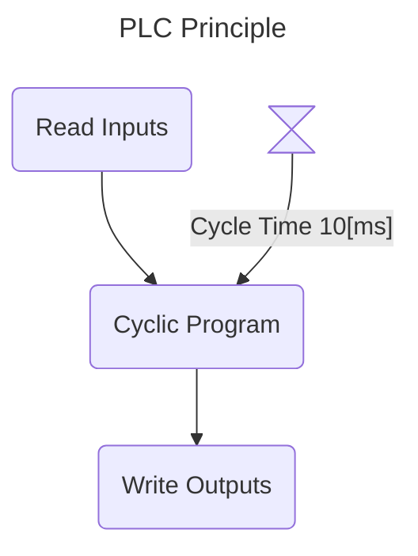
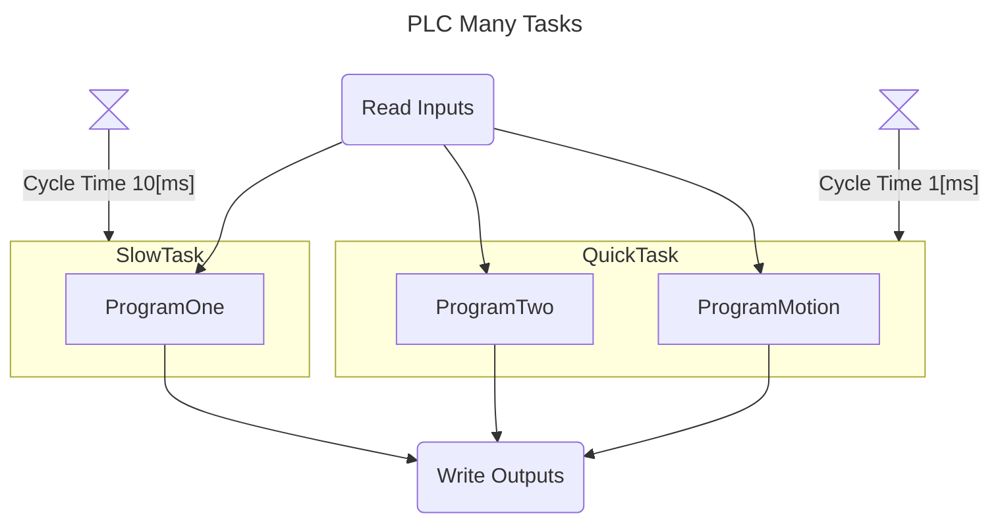
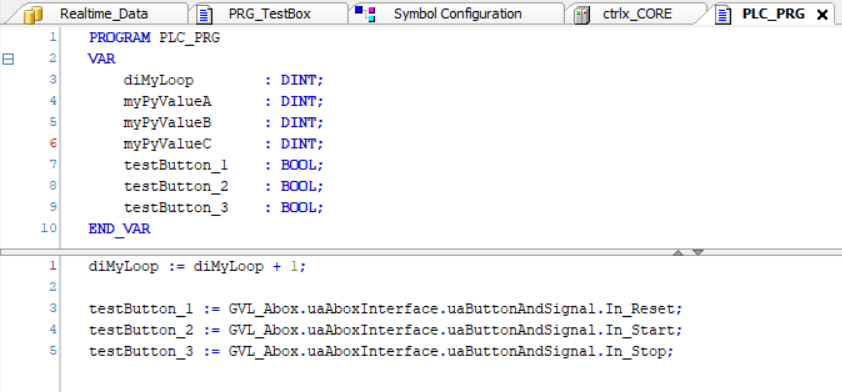

<h1 align="left">
  <br>
  
  <br>
  Industrial Automation Base
  <br>
</h1>

Cours AutB

Author: [Cédric Lenoir](mailto:cedric.lenoir@hevs.ch)


# Module 00 Quick Start

*Keywords:* **Variables / Instructions / Cycle Time / Types / Triggers / Timers**

<figure>
    
    <figcaption>Logo International Electrotechnical Commission</figcaption>
</figure>

## Inhaltsverzeichnis

- [Module 00 Quick Start](#module-00-quick-start)
  - [Inhaltsverzeichnis](#inhaltsverzeichnis)
  - [Programmable controllers - Part 1: Allgemeine Informationen](#programmable-controllers---part-1-allgemeine-informationen)
  - [Abstract (www.iec.ch)](#abstract-wwwiecch)
- [Ziel](#ziel)
- [IEC 61131-3 Sprachen](#iec-61131-3-sprachen)
  - [Der Standard definiert mehrere Arten von Sprachen](#der-standard-definiert-mehrere-arten-von-sprachen)
    - [LD Ladder Diagram](#ld-ladder-diagram)
    - [Der Sequential Function Chart SFC](#der-sequential-function-chart-sfc)
    - [Ders Function Block Diagram FBD](#ders-function-block-diagram-fbd)
    - [Der Structured Text](#der-structured-text)
- [Grundprinzip](#grundprinzip)
  - [Grundsätzlich hat ein Automat zwei Hauptmerkmale.](#grundsätzlich-hat-ein-automat-zwei-hauptmerkmale)
  - [Schleifensystem](#schleifensystem)
    - [Mindestsystem](#mindestsystem)
- [Die Variablen](#die-variablen)
  - [Jede Variable muss mit ihrem **Typ** deklariert werden.](#jede-variable-muss-mit-ihrem-typ-deklariert-werden)
  - [Jede Variable muss **vor** ihrer Verwendung deklariert werden.](#jede-variable-muss-vor-ihrer-verwendung-deklariert-werden)
  - [Eingabevariablen](#eingabevariablen)
  - [Ausgabevariablen](#ausgabevariablen)
  - [Eingabe-Ausgabevariablen](#eingabe-ausgabevariablen)
  - [Einfache Variablen](#einfache-variablen)
  - [Globale Variablen](#globale-variablen)
  - [Konstanten](#konstanten)
  - [*Variablen* Zeiger](#variablen-zeiger)
- [Grundtypen](#grundtypen)
  - [Beispiel 1](#beispiel-1)
  - [Beispiel 2](#beispiel-2)
  - [Binär](#binär)
  - [Integer](#integer)
  - [Floating point](#floating-point)
  - [Zeichenfolge](#zeichenfolge)
  - [Datum und Stunde](#datum-und-stunde)
- [Wählen Sie Ihren Typ mit Bedacht aus](#wählen-sie-ihren-typ-mit-bedacht-aus)
  - [Die Größe](#die-größe)
  - [Falsch gute Idee](#falsch-gute-idee)
  - [Ganzzahl ohne Vorzeichen](#ganzzahl-ohne-vorzeichen)
  - [Ganzzahl vom Typ BYTE, WORD, DWORD und LWORD](#ganzzahl-vom-typ-byte-word-dword-und-lword)
    - [Binäre Darstellung](#binäre-darstellung)
    - [Bitshift Operators](#bitshift-operators)
    - [Ein Beispiel für die Verwendung von WORD und DWORD](#ein-beispiel-für-die-verwendung-von-word-und-dword)
  - [Datentyp gemäß PLCopen](#datentyp-gemäß-plcopen)
    - [Was PLCopen sagt](#was-plcopen-sagt)
  - [Was ich moderiere](#was-ich-moderiere)
  - [Anweisung „IF...ELSIF...ELSE“.](#anweisung-ifelsifelse)
  - [Function Block ```R_TRIG``` et ```F_TRIG```](#function-block-r_trig-et-f_trig)
    - [```R_TRIG```](#r_trig)
    - [Funktionsblockparameter ```R_TRIG```](#funktionsblockparameter-r_trig)
    - [Implémentation ```R_TRIG```](#implémentation-r_trig)
    - [Erklärung und Verwendung von ```R_TRIG```](#erklärung-und-verwendung-von-r_trig)
    - [``F_TRIG``](#f_trig)
  - [Function Block ```TON```, ```TOF``` et ``TP``](#function-block-ton-tof-et-tp)
    - [Funktionsblockparameter ```TON```](#funktionsblockparameter-ton)
    - [Codebeispiel](#codebeispiel)
    - [``TOF``](#tof)
    - [``TP``](#tp)
- [Übungen](#übungen)
  - [Übung 1](#übung-1)
  - [Übung 2](#übung-2)
    - [URS, User Request Specification](#urs-user-request-specification)
  - [Lösungsaufgabe 1](#lösungsaufgabe-1)
  - [Lösungsaufgabe 2](#lösungsaufgabe-2)
## Programmable controllers - Part 1: Allgemeine Informationen

## Abstract (www.iec.ch)
IEC 61131-1:2003 applies to programmable controllers (**PLC**) and their associated peri-pherals such as programming and debugging tools (PADTs), human-machine interfaces (HMIs), etc., which have as their intended use the control and command of machines and industrial processes. It gives the definitions of terms used in this standard. It identifies the principal functional characteristics of programmable controller systems. This second edition cancels and replaces the first edition published in 1992 and constitutes a technical revision. *This bilingual version (2012-05) corresponds to the monolingual English version, published in 2003-05*.

> Zitate auf Englisch werden nicht übersetzt.

# Ziel

In diesem Modul sollen die Grundkenntnisse vermittelt werden, die zur Bewältigung der ersten praktischen Arbeiten notwendig sind.
- [Zyklisches System](#principe-de-base)
- [Variablen](#les-variables)
- [Grundtypen](#les-types-de-base)
- [Triggers](#function-block-r_trig-et-f_trig)
- [Timers](#function-block-ton-tof-et-tp)

> Am Ende **der** Module sollten Sie in der Lage sein, diese Art von Achsen zu verwalten.

<figure>
    
    <figcaption>Application Example, 5 Axis Handling Solution, Source: Bosch Rexroth</figcaption>
</figure>

Oder nähern Sie sich der Achssteuerung für diese Art von Anwendung:

<figure>
    
    <figcaption>Laser Metal Deposition, Source: EMPA (Eidgenössische Materialprüfungs- und Forschungsanstalt)</figcaption>
</figure>

# IEC 61131-3 Sprachen
Dieser Absatz über Sprachen dient zu Informationszwecken. Wir werden nur die Sprache **Structured Text** verwenden, auf die später in diesem Kurs ausführlich eingegangen wird.

## Der Standard definiert mehrere Arten von Sprachen
### LD Ladder Diagram
Zur Darstellung körperlicher Kontakte. Typischerweise zur Darstellung beispielsweise des Status zahlreicher elektrischer Leistungsschalter und Schütze für die Stromversorgung eines Gebäudes. **Diese Sprache ist für die Ausführung von Algorithmen und die Signalverarbeitung nahezu unbrauchbar**. Wir werden es nicht nutzen.

<figure>
    
    <figcaption>Ladder Programming Source: <a href="https://www.siemens.com/global/en/products/automation/systems/industrial/plc.html">Siemens</a></figcaption>
</figure>

> Die Ladder Diagram ist in bestimmten Branchen immer noch weit verbreitet.

### Der Sequential Function Chart SFC
**Abgeleitet vom mathematischen Modell der Petri-Netze**. Kann nützlich sein, um einen Prozess darzustellen, der nach einer Liste wohldefinierter und unkomplizierter Abläufe abläuft. Wird mit zunehmender Anzahl an Sequenzen schnell unüberschaubar. Seine Verwendung ist anekdotisch. Wir werden es nicht nutzen.

<figure>
    
    <figcaption>Ladder Programming Source: <a href="https://www.beckhoff.com/fr-ch/">Beckhoff</a></figcaption>
</figure>

### Ders Function Block Diagram FBD
Wie der Name schon sagt, dient es der Darstellung von **Funktionsblöcken, FB**. Es eignet sich zur Darstellung einer Kette von Regulierungsbehörden. Es wird auch zur Programmierung von Sicherheitsrelais verwendet, wofür wir hauptsächlich eine Reihe konfigurierbarer Blöcke verwenden. Geeignet zur Darstellung von Algorithmen auf makroskopischer Ebene, jedoch nicht zum Schreiben des Algorithmus selbst. **Wir verwenden es manchmal zum Modellieren eines Programms, aber nicht zum Schreiben von Programmen.**

<figure>
    
    <figcaption>Function Block Programming Safety, Source: <a href="https://www.sick.com/ch/en/safety/c/g296181">Sick</a></figcaption>
</figure>

### Der Structured Text
Der strukturierte Text ist von der in den 1970er Jahren von Professor Niklaus Wirth an der ETH Zürich entwickelten Pascal-Sprache inspiriert. Es handelt sich um eine stark typisierte und relativ robuste Sprache.

Seit 2013, der *dritten Auflage*, gibt es strukturierten Text mit einer objektorientierten Erweiterung. Es gibt derzeit keine Informationen, die auf eine echte Transformation der Sprache in den kommenden Jahren hinweisen, ebenso wie die C-Sprache für eingebettete Systeme, es ist sehr wahrscheinlich, dass sie noch lange die Basissprache bleiben wird. Programmierung von Automaten.

> Wir können Niklaus Wirth nicht zitieren, ohne sein empirisches Gesetz zu zitieren: **Software schneller langsamer wird als Hardware schneller**.

# Grundprinzip
Was eine speicherprogrammierbare Steuerung, SPS oder speicherprogrammierbare Steuerung vor allem auszeichnet, ist ihr rein zyklischer Betrieb.

## Grundsätzlich hat ein Automat zwei Hauptmerkmale.
> Die Programme werden in einer **Schleife** ausgeführt...

> nach einer **festen Zykluszeit**.

Dadurch eignen sie sich besonders gut für die Verarbeitung abgetasteter Signale, auch digitale Verarbeitung genannt, für fortgeschrittenes digitales Tuning und, in einem relativ neuen Bereich, für die Ausführung neuronaler Netze.

## Schleifensystem
Eine SPS liest Daten, verarbeitet die Daten und überträgt die Daten über eine Ausgangsschnittstelle.

```python
for itarator_variable in sequence_name:
	readInputs()
    ...
	someAlgortithm()
    ...
	writeOutputs()
```

Diese Art von Schleife garantiert jedoch nicht, dass die Dauer jeder Schleife identisch ist.

> Die notwendige und hinreichende Bedingung für die Abtastung eines Signals ohne Informationsverlust ist, dass die Abtastfrequenz **Fs** größer oder gleich dem Doppelten der maximalen Frequenz des analogen Signals ist. Dieses Prinzip funktioniert, solange die Probenahmeperiode möglichst regelmäßig ist.

-   $\ f_s \geq 2f_{max} $

> In der Regulierung bevorzugen wir sogar:

-   $\ f_s \geq 10f_{max} $

Um die Rechenleistung von Automaten zur numerischen Steuerung nutzen zu können, ist es erforderlich, dass unser System mit einer festen Zykluszeit arbeitet.

> Meines Wissens verwendete die erste konkrete Anwendung der Sampling-Technik eine Frequenz von etwa 16 bis 18 $\ Bild/s $ und stammt aus dem Jahr 1895.

*Es ist das Kino...*

### Mindestsystem
In vielen Fällen ist diese Architektur ausreichend.



> Die Zykluszeit wird von einer internen Uhr verwaltet, die feste Zykluszeitereignisse generiert, um die Ausführung eines Programmzyklus einzuleiten.

Die Mindestzykluszeit hängt hauptsächlich von der Art des zu automatisierenden Prozesses ab.
- Millisekunden-Ordnung für die Welt der Maschinen.
- Sekundenordnung für die Prozesswelt.

Moderne industrielle Automatisierungssysteme ermöglichen die Bewältigung von Aufgaben mit unterschiedlichen Taktzeiten.



# Die Variablen
Im Gegensatz zu anderen Sprachtypen wie **Python** ist die nach IEC 61131-3 standardisierte Automatensprache stark typisiert. Es ist eine Frage der Robustheit.

## Jede Variable muss mit ihrem **Typ** deklariert werden.
```iecst
    bMyFirstVar     : BOOL;
    strMyFirsText   : STRING;
```

## Jede Variable muss **vor** ihrer Verwendung deklariert werden.
Im Fall des Compilers/der IDE, den wir in diesem Kurs verwenden werden, sind die Variablen und der Code in zwei verschiedene Bereiche unterteilt: die Variablen oben und der Code unten.

<figure>
    
    <figcaption>Variablen vor dem Code</figcaption>
</figure>

Grundsätzlich gibt es in einer in IEC 61131-3 codierten SPS keine oder nur eine geringe dynamische Speicherzuweisung. Auch hier ist es eine Frage der **Robustheit**. Dies war auch der Fall, trifft aber heute weniger zu, um den begrenzten Speicherplatz besser kontrollieren zu können.

> Etwa alle sechs Monate hatte ich den Fall, dass eine Maschine *abstürzte*. Da die Maschine schnell und leistungsstark war, führte dies häufig zu erheblichen Materialschäden und kostspieligen Produktionsausfällen. Die Maschine wurde teilweise in Delphi programmiert, einer objektorientierten Sprache, die wie IEC 61131-3 Structured Text von Pascal inspiriert ist.
Die Ursache war eine schlecht verwaltete dynamische Speicherzuweisung von einigen Bytes, die nach und nach die Größe des den Daten zugewiesenen Speicherplatzes vergrößerte, so dass es schließlich zu einem Überlauf in den dem Programm zugewiesenen Speicherplatz kam und dieser schließlich zerstört wurde. Dieses Problem war nicht nur destruktiv, sondern auch besonders komplex und zeitaufwändig zu identifizieren.

Gerade bei der Verwaltung von **Schnittstellenvariablen** zeigt die ST-Sprache ihre Überlegenheit gegenüber anderen in der industriellen Welt. Wir werden sehen warum.

## Eingabevariablen
Eingangsvariable des Bausteins, der Baustein hat jedoch das Recht, auf diese Variable zu schreiben.
```iecst
VAR_IN
    // Set the variable bMyButton to the block.
    bMyButton   : BOOL;
END_VAR
```
## Ausgabevariablen
Es ist nicht möglich, von außerhalb des Blocks, in dem sie deklariert ist, auf eine Ausgangsvariable zu schreiben.
```iecst
VAR_OUT
    // Get the variable bMyBeeper from the block.
    bMyBeeper   : BOOL;
END_VAR
```

## Eingabe-Ausgabevariablen
Der Begriff Input/Output ist nicht der Hauptzweck dieser Variable. Der Hauptzweck dieser Art von Variablen besteht darin, sie als Referenz zu übergeben, wodurch Zeitverschwendung beim Kopieren von der Innenseite nach außerhalb des Blocks vor der Ausführung und umgekehrt am Ende der Ausführung des Blocks vermieden wird.
```iecst
VAR_IN_OUT
    (*
        Give to the block the address of a buffer.
        With this construction, the block can access to any of the elements
        of the buffer without having to copy 10000 elements
    *)
    aMyBuffer   : ARRAY[1..10000] OF DINT;
END_VAR
```
> Der Begriff VAR_IN_OUT ist einer meiner Lieblingsaspekte der IEC 61131-3-Sprache, wir werden Gelegenheit haben, detaillierter darauf zurückzukommen.

## Einfache Variablen
Auf einfache Variablen kann nur in dem Block zugegriffen werden, in dem sie deklariert wurden.
```iecst
VAR
    iMyLoop   : INT;
END_VAR
```

## Globale Variablen
Auf Variablen kann überall im Programm zugegriffen werden.
*Sie sollten sparsam verwendet werden, da sie ein Hindernis für die Modularität des Codes darstellen. Ein Codemodul, das eine globale Variable verwendet, kann nicht ohne Ergänzungen oder Änderungen in einem anderen Programm* wiederverwendet werden.
```iecst
VAR_GLOBAL
    iMyProgramParameter   : INT;
END_VAR
```

## Konstanten
```iecst
VAR CONSTANT
    uiMyArraySize   : UINT := 1024;
END_VAR
```
> Beachten Sie das
1. Konstanten sind sehr schlecht benannt, da sie VAR heißen ...
2. Konstanten müssen mit einem Wert initialisiert werden.


## *Variablen* Zeiger
> Die Verarbeitung von Zeigern gehört grundsätzlich nicht zu den Zielen dieses Kurses.

Unten enthält pMonAge die Adresse einer INT-Variablen.
Beispiel
```iecst
VAR
    (* Pointeur sur un INT *)
    pMonAge : POINTER TO INT;
END_VAR
```

# Grundtypen
Vor einigen Jahren haben wir darauf geachtet, *kurze* Variablen zu verwenden, um Speicherplatz zu sparen und/oder die Berechnungszeit zu verkürzen. Dies ist heute immer weniger der Fall. Die meisten Prozessoren in SPSen arbeiten mit 32 oder 64 Bit.

Andererseits bleibt es wichtig, die Größe und Art der Daten zu kennen.

## Beispiel 1
Die SPS kommuniziert mit Sensoren, die mit kleinen Mikrocontrollern ausgestattet sind, deren Größe begrenzt ist. Wenn wir von einem 32-Bit-REAL in ein 8-Bit-Register schreiben möchten, werden wir ein Problem haben.

## Beispiel 2
Trotz seines hohen Alters ist Modbus nach wie vor ein sehr weit verbreitetes Kommunikationsprotokoll, das standardmäßig mit 16 Bit arbeitet. Wenn wir eine genaue Zahl auf 64 Bit, LREAL, übertragen wollen, müssen wir die erforderliche Anzahl an Bytes kodieren und dann dekodieren, aber auch in der richtigen Reihenfolge. Eine Fehlinterpretation könnte zu einer unbekannten Zahl führen, die das gleiche Problem verursacht wie eine Division durch 0, nämlich einen SPS-Absturz.

## Binär
|Data type|Range|Size|
|---------|-----|----|
|BOOL	  |TRUE (1),  FALSE (0)|8 bits (Depends on hardware and compiler)
## Integer
|Data type|Range        |Size|
|---------|-------------|----|
|BYTE     |	0 à 255       |8 bits|
|WORD     |0 à 65535      |16 bits|
|DWORD    |0 à 4294967295 |32 bits|
|LWORD    |0 à beaucoup   |64 bits|
|SINT     |-128 à 127     |8 bits|
|USINT    |0 à 255        |8 bits|
|INT      |-32768 à 32767 |16 bits|
|UINT     |0 à 65535      |16 bits|
|DINT     |... à beaucoup |32 bits|
|UDINT    |0 à beaucoup   |32 bits|
|LINT     |à beaucoup     |64 bits|
|ULINT    |0 à beaucoup   |64 bits|
## Floating point
|Data type|Range        |Size|
|---------|-------------|----|
|REAL     |3.402823e+38 à 3.402823e+38|32 bits|
|LREAL    |1.7976931348623158 e+308 à 1.7976931348623158 e+308|64 bits|

## Zeichenfolge
|Data type|Codage|Base size|
|---------|------|---------|
|STRING   |ASCII |1 byte   |
|WSTRING  |Unicode|2 byte  |

> **Eine SPS ist nicht für die Verarbeitung von Zeichenfolgen ausgelegt**. Wir verwenden Zeichenfolgen nur für einfache Funktionen, um ein Minimum an Informationen im Zusammenhang mit dem Betrieb des Systems anzuzeigen, z. B. Alarme. Sogar Alarme verwenden im Allgemeinen in C/C++ codierte Routinen höherer Ebene, um beispielsweise Alarme in mehreren Sprachen zu verwalten.

## Datum und Stunde
|Data type|Range                                                                |Size|
|-------------------|-----------------------------------------------------------|----|
|TIME	            |0 to 4294967295		                                    |32 bits|
|TIME_OF_DAY	    |0 (23:59:59:000) to 4294967295 (23:59:59:000)	            |32 bits|
|DATE	            |0 (01.01.1970) to 4294967295 (02.07.2106)	                |32 bits|
|DATE_AND_TIME (DT)	|0 (01.01.1970,00:00:00) to 4294967295 (02.07.2106,6:28:15) |32 bits|
|LTIME	            |0 to 213503d23h34m33s709ms551us615ns	                    |64 bits|

> ``LTIME`` ist erforderlich, wenn ein „Timer“ im Mikro- oder sogar Nanosekundenformat verwendet werden muss.

> System Beckhoff zählt Zeit in 100er-Schritten [ns]

# Wählen Sie Ihren Typ mit Bedacht aus
## Die Größe
Die ideale Schriftgröße, insbesondere für Ganzzahlen, hängt vom Compiler und Prozessor ab.
Dies kann bedeuten, dass für eine bestimmte SPS die ideale Ganzzahl DINT ist. Ganz einfach, weil das grundlegende Datenformat des Prozessors 32-Bit ist und die Verwendung jedes anderen Formats eine zeitaufwändige Konvertierung erfordert.

Während ich dies schreibe, scheint DINT das richtige Basisformat zu sein. In ein paar Jahren könnte LINT der Standard sein.

## Falsch gute Idee
Die Verwendung eines SINT zum Platzsparen ist eigentlich nicht unbedingt notwendig, aber es ist dumm, mit einer Endlosschleife zu enden, weil die Schleifenvariable letztendlich 127 überschritten hat. Nehmen Sie ein DINT.

## Ganzzahl ohne Vorzeichen
Ein typisches Beispiel für eine vorzeichenlose Ganzzahl ist eine Aufzählung. Sein Interesse ist gering.
Es kann sogar interessant sein, einen vorzeichenbehafteten Typ für eine Aufzählung zu haben, indem ein negativer Wert identifiziert wird. Zum Beispiel -1 für eine noch nicht verbrauchte Menge.

## Ganzzahl vom Typ BYTE, WORD, DWORD und LWORD
Diese Größen werden für Register verwendet. Sie sind daher grundsätzlich keine Zahlen im eigentlichen Sinne und sollten nicht für Berechnungen zur Basis 10 verwendet werden.
Ihre Größe wird entsprechend dem verwendeten Register gewählt.

> Variablen vom Typ BYTE, WORD, DWORD und LWORD ermöglichen insbesondere logische Operationen vom Typ AND, OR, etc...

### Binäre Darstellung
Grundlage 2
```iecst
    byMyByte    : BYTE := 2#1010_0110;
```
Base 16
```iecst
    byMyByte    : BYTE := 16#A6;
```
### Bitshift Operators

|Operator |Aufruf |Aktion|
|--------|--------|------|
|SHL |SHL(nInWord,nPos) |Verschiebt *nInWord* um *nPos* Bits nach links, Bits, die nach links austreten, gehen verloren. |
|SHR |SHR(nInWord,nPos) |Verschiebt *nInWord* um *nPos* Bits nach rechts, Bits, die nach rechts austreten, gehen verloren. |
|ROL |ROL(nInWord,nPos) |Verschiebt *nInWord* um *nPos* Bits nach links, Bits, die nach links ausgehen, gehen zurück nach rechts. |
|ROR |ROR(nInWord,nPos) |Verschiebt *nInWord* um *nPos* Bits nach rechts, Bits, die nach rechts ausgehen, kommen nach links zurück. |

### Ein Beispiel für die Verwendung von WORD und DWORD
In der Branche gibt es noch viele alte Kommunikationsprotokolle wie **Modbus**. Dieses Protokoll überträgt Informationen in 16-Bit-Registern, ``WORD``. Wenn Sie ein auf Modbus codiertes ``REAL`` lesen möchten, müssen Sie zwei ``WORD`` lesen und diese beiden Register dann in ein REAL umwandeln.

Hier ist ein Beispielcode.
```iecst
//	Most Significant Word First
//	Example :
//	Word_1 --> registre 21037 = 0x440A
//	Word_2 --> registre 21038 = oxC000
//	Result for this example should be 555.00 A.
FUNCTION F_ModbusRegisterTo_FLOAT32 : REAL
VAR_INPUT
	///	Most Significant Word
	Word_1: WORD;
	Word_2: WORD;
END_VAR
VAR
	ForCheck_32: DWORD;
	prResult_32: POINTER TO REAL;
END_VAR

// Code
ForCheck_32 := Word_1;
ForCheck_32 := SHL(ForCheck_32,16);
ForCheck_32 := ForCheck_32 + Word_2;
prResult_32 := ADR(ForCheck_32);

(*
	Note: this is not a type conversion.
	The value in registers is not coded like a word, but like
	a IEEE 754 float !!!
*)
F_ModbusRegisterTo_FLOAT32 := prResult_32^;
```

## Datentyp gemäß PLCopen
Sie können ein Unterstützer von PLCopen sein, ohne mit allem einverstanden zu sein.
In seinem Dokument PLCopen Coding Guidelines V1.0, § 5.23. Wählen Sie den entsprechenden Datentyp aus.

### Was PLCopen sagt
- *Eine korrekt datentypisierte Variable hilft bei der Beschreibung ihrer Funktion und macht ihre Verwendung einigermaßen selbsterklärend*
- *„Stark typisierter“ Code, bei dem Datentypkonvertierungen explizit durchgeführt werden müssen, trägt zur Vermeidung von Codierungsfehlern und Versehen bei, bei denen ein gewisses Konvertierungsverhalten möglicherweise nicht den Annahmen entspricht und in der Inbetriebnahme- und Testphase möglicherweise übersehen wird*
- *Compiler können den Datentyp verwenden, um Zuweisungen und die Verwendung von Anweisungen zu überprüfen, um sicherzustellen, dass die Vorgänge den Erwartungen des Entwicklers entsprechen*
- *Kleinere Datentypen benötigen normalerweise weniger Speicher, also erlauben Sie mehr Variablen oder größere Programme*
- *Die Verwendung vorzeichenloser Datentypen verhindert, dass versehentlich ein negativer Wert zugewiesen wird und Code geschrieben und getestet werden muss, um mit diesen Eventualitäten umzugehen.*
- *Die Verwendung von Aufzählungs- und Unterbereichstypen macht ein Programm noch besser lesbar und kann zur Programmzuverlässigkeit beitragen, indem sie dazu beiträgt, die Verwendung unbeabsichtigter Variablenwerte zu vermeiden und die beabsichtigte Semantik der Aufzählungswerte explizit zum Ausdruck zu bringen Variablen*

## Was ich moderiere
- *Kleinere Datentypen benötigen normalerweise weniger Speicher, also erlauben Sie mehr Variablen oder größere Programme*

Erstens ist dies nicht immer der Fall, da einige Compiler kürzere Typen ignorieren.

Zweitens wird die Speichergröße immer weniger zum Problem.
- *Die Verwendung vorzeichenloser Datentypen verhindert, dass versehentlich ein negativer Wert zugewiesen wird und Code geschrieben und getestet werden muss, um mit diesen Eventualitäten umzugehen*.

> Dies gilt beim Schreiben von Code. In der Dynamik trifft das nicht mehr wirklich zu.
Ein Code wie:

```iecst 
PROGRAM PlcProg
VAR
   diMonTruc:       DINT  := 0;
   diMonTrucDeux:   DINT  := 0;
   udiMonTruc:      UDINT := 0;
END_VAR
udiMonTruc := DINT_TO_UDINT(diMonTruc);
```
 
funktioniert auch mit einem negativen Wert in diMonTruc einwandfrei.

**Jedoch**
Für diMonTruc = -45 erhalten wir udiMonTruc = 4294967251. Es ist nicht sicher, ob dies das ist, was wir wollen.

Der einzige Unterschied besteht darin, dass der Compiler eine Warnung anzeigt, wenn udiMyThing in UDINT deklariert ist. Dies kann jedoch ein ausreichendes Kriterium sein, um die Verwendung des vorzeichenlosen Typs zu rechtfertigen.
Siemens-Stil

> Der Siemens-Stil erfordert beim Bearbeiten von Variablen Anführungszeichen.
 
```iecst
ORGANIZATION_BLOCK "CallUnitModeStateManager"
VAR
   diMonTruc:       DINT  := 0;
   diMonTrucDeux:   DINT  := 0;
   udiMonTruc:      UDINT := 0;
END_VAR
"udiMonTruc" := DINT_TO_UDINT("diMonTruc");
```

## Anweisung „IF...ELSIF...ELSE“.
> Die Anweisung ``IF...ELSIF...ELSE`` wird hier in der Einleitung vorgestellt und ausführlicher besprochen.

Die Anweisung  ```IF```
```iecst
IF <Condition> THEN
   <Instruction>
```
wird verwendet, um eine Bedingung zu testen.

Die Anweisung ```ELSIF```
```iecst
ELSIF <Another Condition> THEN
   <Instruction>
```
optional wird ausgeführt, wenn ``IF`` mit einer neuen Bedingung falsch ist.

Die Anweisung ```ELSE``` *optional und bedingungslos*
```iecst
ELSE
   <Instruction>
```
Wird nur ausgeführt, wenn die vorangehenden Bedingungen falsch sind.

``IF`` und ``ELSIF`` Anweisungen müssen mit enden
```iecst
END_IF
```

## Function Block ```R_TRIG``` et ```F_TRIG```
Cest deux bloques fonctionnels sont des classiques de la programmation PLC. Même si ils sont simples à programmer, ils existent en standard dans la plupart des environnements.

> On verra plus tard que les Function Block se placent en principe à la fin du programme. ``R_TRIG`` et ``F_TRIG`` **sont l'exception qui confirment la règle**. Il se placent toujours avant la partie du code qui utilise leur sortie car la sortie n'est active que pendant le cycle d'activation.

### ```R_TRIG```
Erkennt eine steigende Flanke und bleibt genau einen SPS-Zyklus lang aktiv.

<figure>
    
    <figcaption>R_TRIG Trigger auf der steigenden Seite</figcaption>
</figure>

> Dies ist das typische Beispiel eines Funktionsblocks, da ``R_TRIG`` im Vergleich zu einer „FC“-Funktion, die keinen internen Speicher hat, den vorherigen Zustand speichern muss.

### Funktionsblockparameter ```R_TRIG```
|Parameters|Declaration|Data type|Description|
|----------|-----------|---------|-----------|
|CLK       |Input      |BOOL     |Incoming signal, the edge of which is to be queried|
|Q         |Output     |BOOL     |Result of edge evaluation|


<figure>
    
    <figcaption>R_TRIG: Source: <a href="https://infosys.beckhoff.com/english.php?content=../content/1033/tcplclib_tc2_standard/74391563.html&id=2005587076592354672">Beckhoff R_TRIG</a>
    </figcaption>
</figure>

### Implémentation ```R_TRIG```
```iecst
FUNCTION_BLOCK R_TRIG
VAR_INPUT
    CLK    : BOOL; (* Signal to detect *)
END_VAR
VAR_OUTPUT
    Q      : BOOL; (* Edge detected *)
END_VAR
VAR
    memory : BOOL; (* Store last state*)
END_VAR

(*
   Example of implementation
*)
IF CLK        AND 
   NOT memory THEN
    Q := TRUE;
ELSE
    Q := FALSE;
END_IF
memory := CLK;
```
### Erklärung und Verwendung von ```R_TRIG```

```iecst
PROGRAM PRG_TRIG
VAR
    bSwitchOne : BOOL;
    rTRIG      : R_TRIG;
    iCounter   : INT;
END_VAR

(*
   Count the number of times the switch is activated.
*)
rTRIG(CLK := bSwitch);
IF rTRIG.Q THEN
   iCounter := iCounter + 1;
END_IF
```
> Da das Programm zyklisch ist, müssen wir die Aktivierungsflanken von ``bSwitch`` erkennen, sonst würde der Zähler bei jedem Zyklus erhöht, wenn ``bSwitch`` ``TRUE`` ist.

### ``F_TRIG``
``F_TRIG`` ist das Äquivalent von ``R_TRIG``, jedoch an der fallenden Flanke. Zum Beispiel, wenn Sie den Druck auf eine Taste loslassen. Totmanneinrichtung.

## Function Block ```TON```, ```TOF``` et ``TP``

<figure>
    
    <figcaption>TON: Source: <a href="https://infosys.beckhoff.com/english.php?content=../content/1033/tcplclib_tc2_standard/74403595.html&id=">Beckhoff TON</a>
    </figcaption>
</figure>

<figure>
    
    <figcaption>TON</figcaption>
</figure>

Der ``Q`` Ausgang aktiviert ``PT``, Impulsdauer nach Aktivierung der ``IN``-Variablen. Wenn der Eingang ``IN`` auf ``FALSE`` zurückkehrt, kehrt der Ausgang ``Q`` auf ``FALSE`` zurück.

Die Variable ``ET``, Elapsed Time wird im Diagramm nicht dargestellt, da das verwendete PUML-Tool eine saubere Durchführung über den gesamten Bereich nicht zulässt.

Nachfolgend finden Sie einen Auszug.

<figure>
    
    <figcaption>TON Time Diagram Elapsed Time</figcaption>
</figure>

### Funktionsblockparameter ```TON```
|Parameters|Declaration|Data type|Description|
|----------|-----------|---------|-----------|
|IN       |Input      |BOOL     |starts timer with rising edge, resets timer with falling edge|
|PT       |Input      |BOOL     |time to pass, before Q is set|
|Q        |Output     |BOOL     |is TRUE, PT seconds after IN had a rising edge|
|PT       |Output     |BOOL     |elapsed time|

### Codebeispiel
```iecst
PROGRAM PLC_PRG
VAR
    switchOpen      : BOOL;
    tonWaitOneSec   : TON;
    activateDoor    : BOOL;
END_VAR

tonWaitOneSec(IN := switchOpen,
              PT := T#1S,
              Q => activateDoor);
```
Ein ``activateDoor``-Türbefehl wird nur dann aktiviert, wenn der Bediener ``switchOpen`` für mindestens eine Sekunde betätigt. *Beachten Sie das besondere Format des Zeitwerts*. Wir könnten auch ``T#1000ms`` verwenden.

### ``TOF``
Im Gegensatz zu TON beginnt TOF die verstrichene Zeit zu erhöhen, wenn das Eingangssignal von ``TRUE`` zu ``FALSE`` wechselt.

<figure>
    
    <figcaption>TOF Time Diagram Elapsed Time</figcaption>
</figure>

### ``TP``
TP ist ein Impulsgenerator. Unabhängig von der Dauer des Eingangssignals bleibt die Dauer des Ausgangssignals gleich.

<figure>
    
    <figcaption>TP Time Diagram</figcaption>
</figure>

# Übungen
## Übung 1
Welche der folgenden Werte werden in das im Suffix angegebene Format konvertiert und dezimal angezeigt?

```iecst
    byMyBYTE  := 2#1010_0110;
    byMyWORD  := 16#A6;
    nResBYTE  := SHL(16#45,2);
    nResWORD  := SHL(16#0045,2);
    nResDWORD := ROR(nResBYTE,2);
    nResLWORD := ROR(nResWORD,2);
```
[Lösungsaufgabe 1](#lösungsaufgabe-1)

## Übung 2
Eine Totmanneinrichtung ist ein Sicherheitsmodul, das einen Schalter enthält, der nur dann aktiv ist, wenn er zur Hälfte betätigt wird. Wird der Schalter bis zum Anschlag gedrückt, was zu einer Verspannung der Hand des Bedieners führen könnte, wird ein Not-Aus aktiviert.

<figure>
    
        <figcaption>Dead Man Switch, <a href="https://products.schmersal.com">Image Schmersal</a>
    </figcaption>
</figure>

```iecst
VAR_INPUT
    signalOneMiddle     : BOOL;
    signalTwoMiddle     : BOOL;
END_VAR

VAR_OUTPUT
    enableMove          : BOOL;
    sendStop            : BOOL;
    securityError       : BOOL;
END_VAR
```

[Lösungsaufgabe 2](#lösungsaufgabe-2)

### URS, User Request Specification
- Genau in dem Moment, in dem beide Eingänge die TRUE-Position verlassen, wird der Befehl „sendStop“ während eines einzelnen Programmzyklus aktiviert.
- Wenn beide Eingangssignale „TRUE“ sind, ist der Ausgang „enableMove“ aktiv.
- Um eine Manipulation des Sicherheitssystems zu verhindern, prüft ein Timer, dass sich die beiden Signale für einen Zeitraum von mehr als 250[ms], **Diskrepanzzeit**, Divergenzzeit, nicht unterscheiden. Bei Überschreitung dieses Zeitlimits wird „enableMove“ nicht autorisiert und das Signal „securtiyError“ wird aktiviert (und bleibt dauerhaft aktiviert).
- *Es ist notwendig, einige Variablen, Timer oder Trigger hinzuzufügen.*

## Lösungsaufgabe 1
Was sind die folgenden Dezimalwerte?
```iecst
    byMyBYTE  := 166;
    byMyWORD  := 166;
    nResBYTE  := 20;      // 0100_0101 -> 0001_0100
    nResWORD  := 276;     // 0100_0101 -> 0000_0001_0001_0100
    nResDWORD := 5;       // 0001_0100 -> 0000_0101
    nResLWORD := 69;      // 0000_0001_0001_0100 -> ...0100_0101
```
## Lösungsaufgabe 2
Beachten Sie die Formatierung und Ausrichtung, die das Lesen erleichtern.
> Formatierung ist Teil der Codequalität!

```iecst
// Header
FUNCTION_BLOCK FB_DeadManSwitch
VAR_INPUT
    signalOneMiddle     : BOOL;
    signalTwoMiddle     : BOOL;
END_VAR

VAR_OUTPUT
    enableMove          : BOOL;
    sendStop            : BOOL;
    securityError       : BOOL;
END_VAR
VAR
    tonDiscrepancyTime  : TON;
    fTrigStop           : F_TRIG;
    testSendStop        : UDINT;
END_VAR

// Code
tonDiscrepancyTime(IN := signalOneMiddle <> signalTwoMiddle,
                   PT := T#250MS);
                   
fTrigStop(CLK := signalOneMiddle AND
                 signalTwoMiddle);                  
                   
IF tonDiscrepancyTime.Q THEN
    securityError := TRUE;
END_IF

IF signalOneMiddle          AND
   signalTwoMiddle          AND
   securityError            THEN
   enableMove := TRUE;
ELSE
   enableMove := FALSE;
END_IF

sendStop := fTrigStop.Q;

(*
    To check sendStop Activated
    Because it is difficult to view the value of sendStop for one cycle,
    it could be a good idea to use a check sequence to validate it.
    This is optional
*)
IF sendStop THEN
    testSendStop := testSendStop + 1;
END_IF
```
Alternativ könnte der enableMove auch wie folgt codiert werden:
```iecst
enableMove := signalOneMiddle AND
              signalTwoMiddle AND
              NOT securityError;
```