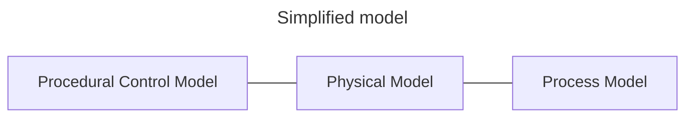

Un test.



````mermaid
---
title: Equipment Module
---
classDiagram
    class EM_RobotAxis {
    }

    class CM_LinearAxis {
        Motor
        Encoder
    }
    class CM_Gripper {
        PneumaticValve
        SensorOpen
        SensorClosed
    }

    EM_RobotAxis *-- CM_LinearAxis
    EM_RobotAxis *-- CM_Gripper
    EM_RobotAxis *-- CM_RotaryAxis


```