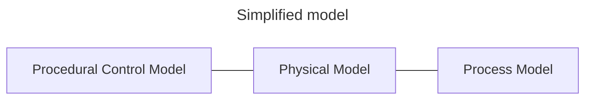
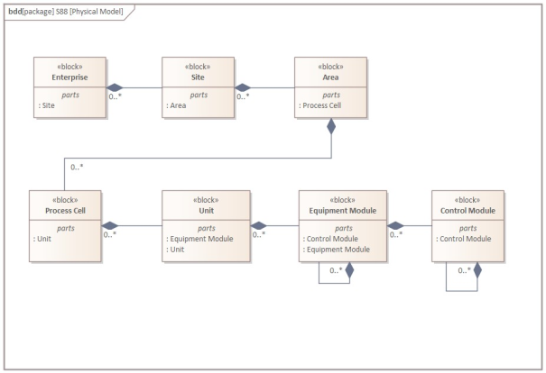
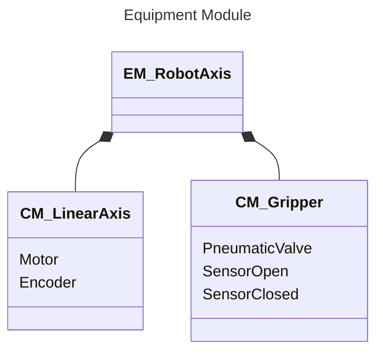
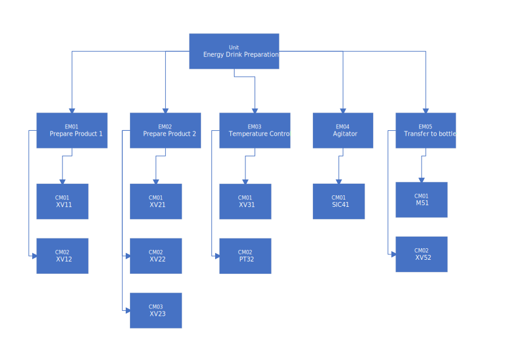
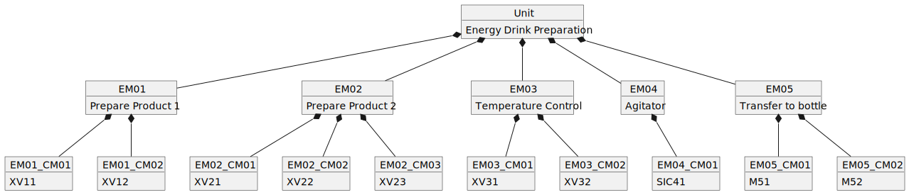
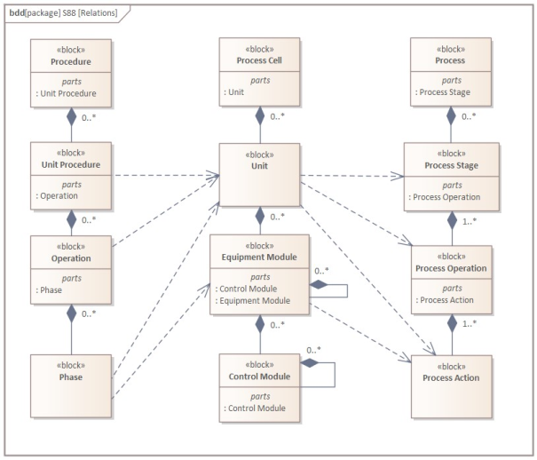
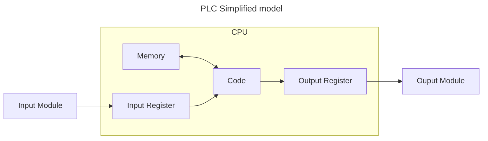
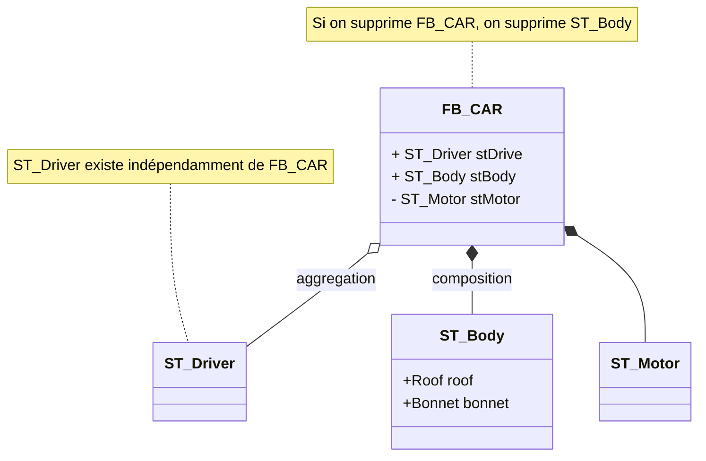
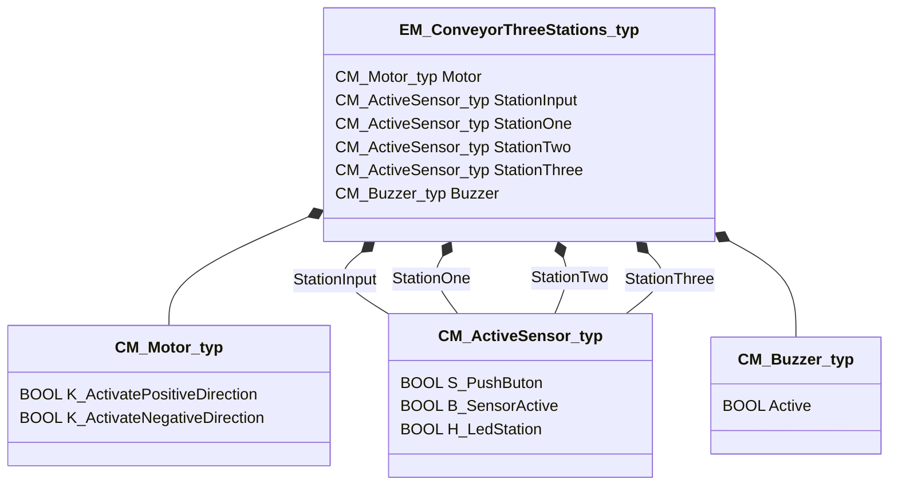

<h1 align="left">
  <br>
  
  <br>
  Industrial Automation Base
  <br>
</h1>

Cours AutB

Author: [Cédric Lenoir](mailto:cedric.lenoir@hevs.ch)

# AutB Module 03, Interfaces,

## Table des matières

- [AutB Module 03, Interfaces,](#autb-module-03-interfaces)
  - [Table des matières](#table-des-matières)
- [*1ère partie, principe*](#1ère-partie-principe)
  - [Industrial-process measurement and control - Programmable controllers - Part 2: Equipment requirements and tests](#industrial-process-measurement-and-control---programmable-controllers---part-2-equipment-requirements-and-tests)
  - [Abstract (www.iec.ch)](#abstract-wwwiecch)
- [Classes de processus industriels](#classes-de-processus-industriels)
  - [Pourquoi parler des types de processus ?](#pourquoi-parler-des-types-de-processus-)
    - [ISA-88](#isa-88)
    - [ISA-88 Physical Model](#isa-88-physical-model)
      - [Le module de contrôle.](#le-module-de-contrôle)
      - [Le module d'équipement.](#le-module-déquipement)
  - [Processus, lots et traitements par lots](#processus-lots-et-traitements-par-lots)
  - [Continuous processes](#continuous-processes)
  - [Discrete parts manufacturing processes](#discrete-parts-manufacturing-processes)
  - [Batch processes](#batch-processes)
    - [Un exemple de Batch Process](#un-exemple-de-batch-process)
  - [Autres aspects de ISA-88,](#autres-aspects-de-isa-88)
    - [Procedural Control Model](#procedural-control-model)
    - [Process Model](#process-model)
    - [Le modèle ISA-88 complet](#le-modèle-isa-88-complet)
- [Les modules d'entrée sortie](#les-modules-dentrée-sortie)
  - [Un centre de communication.](#un-centre-de-communication)
    - [Un automate permet en particulier:](#un-automate-permet-en-particulier)
  - [La notion de programme temps réel.](#la-notion-de-programme-temps-réel)
  - [A propos des signaux numériques](#a-propos-des-signaux-numériques)
    - [Définition](#définition)
    - [Notation](#notation)
    - [Echantillonnage](#echantillonnage)
- [Hypervisor](#hypervisor)
- [Des interfaces standards](#des-interfaces-standards)
  - [Exemple de modules d’entrées](#exemple-de-modules-dentrées)
- [La disponibilité des capteurs et actionneurs.](#la-disponibilité-des-capteurs-et-actionneurs)
  - [Digital Input Source Siemens 2015](#digital-input-source-siemens-2015)
  - [Digital Output](#digital-output)
  - [Analog Input](#analog-input)
  - [Analog Output](#analog-output)
  - [Indice de protection IP](#indice-de-protection-ip)
  - [ATEX](#atex)
  - [Exemple de spécification d’entrée digitale](#exemple-de-spécification-dentrée-digitale)
    - [Un mauvais exemple](#un-mauvais-exemple)
- [Les bus de terrain, ou bus industriels](#les-bus-de-terrain-ou-bus-industriels)
  - [Qu’est ce qu’un bus de terrain ?](#quest-ce-quun-bus-de-terrain-)
  - [Pourquoi ?](#pourquoi-)
  - [Contraintes](#contraintes)
  - [Nouveauté 2023-2024](#nouveauté-2023-2024)
  - [Les normes](#les-normes)
- [La réalité](#la-réalité)
- [Conclusion](#conclusion)
  - [Un mauvais exemple.](#un-mauvais-exemple-1)
- [*3ème partie, I/O mapping*](#3ème-partie-io-mapping)
  - [Example de mapping dans le programme PLC](#example-de-mapping-dans-le-programme-plc)
  - [DS, Design Specification](#ds-design-specification)
    - [Exemple de Design Specification.](#exemple-de-design-specification)
    - [HDS](#hds)
    - [SDS](#sds)
    - [Alarmes](#alarmes)
- [Utilisation des ```tags``` au niveau du programme.](#utilisation-des-tags-au-niveau-du-programme)
  - [Règles](#règles)
  - [Structure de donnée](#structure-de-donnée)
    - [Un tout petit peu de langage UML](#un-tout-petit-peu-de-langage-uml)
    - [Représentation UML du convoyeur](#représentation-uml-du-convoyeur)
    - [**C**ontrol **M**odule moteur](#control-module-moteur)
    - [**C**ontrol **M**odule capteur](#control-module-capteur)
    - [**C**ontrol **M**odule buzzer](#control-module-buzzer)
    - [**E**quipement **M**odule convoyeur](#equipement-module-convoyeur)
    - [Liaison des tags au convoyeur](#liaison-des-tags-au-convoyeur)
      - [Liaison des tags d'entrée](#liaison-des-tags-dentrée)
      - [Liaison des tags de sortie](#liaison-des-tags-de-sortie)

# *1ère partie, principe*

*Keywords:* **61131-2 hardware tags**

<figure>
    
    <figcaption>Logo International Electrotechnical Commission</figcaption>
</figure>

## Industrial-process measurement and control - Programmable controllers - Part 2: Equipment requirements and tests

## Abstract (www.iec.ch)
IEC 61131-2:2017 specifies functional and electromagnetic compatibility requirements and related verification tests for any product where the primary purpose is performing the function of industrial control equipment, including PLC and/or PAC, and/or their associated peripherals which have as their intended use the control and command of machines, automated manufacturing and industrial processes, e.g. **discrete**, **batch** and **continuous control**.
This fourth edition cancels and replaces the third edition published in 2007. This edition constitutes a technical revision.

> Les citations en anglais ne sont pas traduite.

# Classes de processus industriels

## Pourquoi parler des types de processus ?
- Le type de processus a un lien direct avec certaines caractéristiques des automates comme la puissance de calcul.
- Les différents processus travaillent avec des temps de cycle très différents et une infrastructure réseau qui ne l’est pas moins.

Il ne s’agit pas de rentrer en détail dans les différents types de processus industriels. Par contre il s'agit de comprendre quelques principes de modélisation qui justifient entre autre l'importance du travail sur la structure des données qui sera traitée dans le chapitre suivant.

> Ci-dessous, une comparaison de deux types de processus susceptibles d'être utilisés dans l'industrie pharmaceutique.


<figure>
    
    <figcaption>Batch vs Continuous Manufacturing, Source: Org. Process Res. Dev. 2021, 25, 4, 721-739</figcaption>
</figure>

Un des intérêts de la production par Batch est d'être plus facilement modulable afin de fabriquer différents types de produits sur la même installation, à condition que le logiciel de commande le permette. Cela permet aussi souvent une production spécifique adaptée aux besoin du client final et finalement à plus forte valeur ajoutée.

Au niveau logiciel, l'**augmentation de la modularité** d'un programme rime souvent avec **augmentation de la complexité**. D'ou l'importance d'un programme parfaitement structuré.

### ISA-88
ISA-88 est un standard développé pour réaliser des processus industriels par batch. De nombreux concepts peuvent toutefois s'appliquer à l'ensemble des types de processus et c'est la raison pour laquelle nous nous y référons régulièrement dans ce cours. Il va nous permettre de modéliser une installation afin de structurer proprement notre système d'automatisation.



Le modèle simplifié sépare un système industriel en trois partie.

-   **Process Model**, c'est la partie à automatiser. Dans un processus discret, ce sont les pièces à assembler, ou les bouteilles à remplir. Dans un processus par batch, ce sont les différents ingrédients à mélanger ou à chauffer en quantité donnée. Dans un processus continu, ce pourrait être un flux de matière à transformer ou filtrer.
-   **Physical Model**, c'est notre système d'automatisation à proprement parler, qui va utiliser un PLC comme élément central.
-   **Procedural Control Model**, c'est la recette que nous allons utiliser pour piloter le modèle physique.

**Dans ce cours, nous allons nous concentrer sue le modèle physique**.

### ISA-88 Physical Model
ISA-88 propose un model qui permet de representer un processus industriel selon un model générique. Si ISA-88 est initialement une norme développée pour le **Batch Processing**, elle peut aussi être utilisée pour modéliser d'autres type de processus, ce qui nous permet de présenter ce cours comme une approche générale valable pour d'autre types de processus susceptibles d'être automatisés.

<div align="center">
<figure>
    
    <figcaption>ISA-88 Physical Model Generic vesion UML</figcaption>
</figure>
</div>

- Pour résumer, une machine se situe au niveau **Unit**.
- Dans le cadre de ce cours, nous aborderons principalement les notions de : **Equipment Module** et **Control Module**.

#### Le module de contrôle.
Le plus bas niveau de contrôle Exemple:

-   Les capteurs.
-   Les actionneurs.
-   Une combinaison de capteurs et actionneurs. Par exemple une pince avec ses détecteurs qui contrôlent les positions ouvert ou fermé.

> C'est la raison pour laquelle, nous verrons comment encapsuler et programmer différents éléments pour constituer un Control Module.

#### Le module d'équipement.

Les modules d'équipement, ou **Equipment Modules**, **EM**, sont les **objets matériels** qui regroupent des **contrôles modules**, **CM** et qui sont **fonctionnellement interdépendant en toutes circonstances**.

Exemple :
-  Débimètre avec vanne, circuit de vidage.
-  Pompe et vanne pour un circuit de refroidissement.
-  Axe robotisé avec un vis à bille équipée d'un moteur avec sont codeur de position et une pince.

<div align="center">


</div>

## Processus, lots et traitements par lots
Selon ISA 88, un processus est une séquence d'activités chimiques, physiques ou biologiques pour la conversion, le transport ou stockage de matière ou d'énergie. Les procédés de fabrication industrielle peuvent généralement être classés sous forme de fabrication continue de pièces discrètes ou par lots. La classification d'un processus dépend de si la sortie du processus apparaît dans un flux continu, « Continuous », en quantités finies de pièces, **Discrete parts manufacturing**, ou en quantités finies de matière, **Batches**.

Bien que certains aspects de cette norme puissent s'appliquer à la fabrication de pièces discrètes ou aux processus continus, la norme ISA-88 ne traite pas spécifiquement de ces types de processus.
La réalité est que de nombreux ingénieurs, dont l’auteur de ce cours se sont intéressés à l’application de la norme aux processus discret et continus. On peut notamment se référer à l’ouvrage WBF, Applying ISA-88 in discrete and continuous manufacturing.

## Continuous processes
Dans un processus continu, les matériaux sont passés en flux continu à travers l'équipement de traitement. Une fois établi dans un état de fonctionnement stable, la nature du processus ne dépend pas de la durée de fonctionnement. Les démarrages, transitions et arrêts ne contribuent généralement pas à la réalisation du traitement souhaité. Au niveau de l’ISA, les processus continus sont traités dans « ISA106, Procedure Automation for Continuous Process Operations »

## Discrete parts manufacturing processes
Dans un processus de fabrication de pièces discrètes, les produits sont classés en lots de production basés sur les matières premières communes, les exigences de production et les historiques de production. Dans un processus de fabrication de pièces discrètes, une quantité spécifiée de produit se déplace comme une unité (groupe de pièces) entre les postes de travail, et chaque pièce conserve son identité unique.

## Batch processes
Les traitements par lots abordés dans cette norme conduisent à la production de quantités finies de matières (lots) en soumettant des quantités de matières premières à un ordre défini d'actions de traitement à l'aide d'un ou plusieurs équipements. Le produit fabriqué par un processus par lots est appelé un lot. Les processus par lots sont des processus discontinus. Les processus par lots ne sont ni
discret ni continus ; cependant, ils présentent les deux caractéristiques.

### Un exemple de Batch Process

<figure>
    
    <figcaption>Drink Processing version Pipe & Process Diagram, <strong>P&ID</strong></figcaption>
</figure>

> La signification des labels P&ID est donnée à titre indicative dans le document annexe [Piping and Instrumentation Diagram](./PID_Diagram.md).

<figure>
    
    <figcaption>Drink Processing version <strong>ISA-88</strong></figcaption>
</figure>

<figure>
    
    <figcaption>Drink Processing version <strong>UML</strong></figcaption>
</figure>


Le travail sur les intefaces consiste à relier le processus représenté par exemple par le schéma **P&ID**, **Pipe & Process Diagram** que l'on retrouve fréquement dans l'industrie chimique avec le software représenté par le schéma UML.

## Autres aspects de ISA-88,
*à titre d'information*
### Procedural Control Model
ISA-88 gère aussi un modèle procédural, Procedural Control Model, que l'on pourrait simplement traduire par la gestion des recettes.
Les élément traités dans le cadre de ce cours se limitent au bas de l'échelle procédurale. Ils seronts ensuite pilotés par une **phase**.

Une **phase** peut émettre une ou plusieurs commandes ou provoquer une ou plusieurs actions, telles que :
-   Activation et désactivation des types de régulation de base et orientés état et spécification de leurs points de consigne et valeurs de sortie initiales
-   Réglage, effacement et modification de l'alarme et d'autres limites
-   Définition et modification des constantes de contrôleur, des modes de contrôleur et des types d'algorithmes
-   Lecture des variables de processus, telles que la densité du gaz, la température du gaz et le débit volumétrique à partir d'un débitmètre, et calcul du débit massique à travers le débitmètre
-   Effectuer des contrôles d'autorisation des opérateurs.

Si l'on considérait que la main est un **Control Module**, le bras serait un **Equipement Module** qui permet d'effectuer une **phase**.

Dans la mesure ou nous allons nous concentrer sur le **Control Module**, nous ne développerons pas le modèle prodédural car il n'a pas d'interactions directe avec lui.

### Process Model
Le Process Model décrit la réalité physique, ou chimique, du processus.
Une opération pourrait être par exemple:
-   Monter la plaque d’appuis sur la plaque de base
-   Insérer le ressort de verrouillage
-   Insérer le bouton en caoutchouc
-   Contrôler la qualité du montage avec une caméra intelligente

### Le modèle ISA-88 complet

<figure>
    
    <figcaption>Relation entre les différents éléments ISA-88</figcaption>
</figure>


# Les modules d'entrée sortie
Les entrées et les sorties vont nous permettre de piloter et contrôler les éléments physiques à partir de l'automate.

<div align="center">



</div>

## Un centre de communication.
Un automate moderne est avant tout un centre de communication qui permet dans un environnement donné d’utiliser une large gamme de protocoles et de matériel.

<figure>
    
    <figcaption>Internal Block Diagram of a PLC</figcaption>
</figure>

### Un automate permet en particulier:
- De communiquer avec un opérateur via un **HMI** Human Machine Interface,
- De communiquer avec le développeur de l'application via un **IDE**,
- De communiquer avec la machine,
- De communiquer avec des bases de données internes ou externes **Cloud**,
- De gérer le système d'alimentation électrique et les défauts éventuels **UPS**.

> La notion de **IDE** Integrated Development Environment sera développée dans le cadre des travaux pratiques qui font partie intégrante.

> Un **UPS**, Uninterruptible Power Supply doit permettre à un automate de gérer certaines fonctions essentielles en cas de coupure électrique du réseau. De manière générale, un PLC doit pouvoir s'arrêter proprement, mais aussi redémarrer automtiquement après rétablissement de l'alimentation électrique.

## La notion de programme temps réel.

La notion de Système d’exploitation préemptif en temps réel, *preemptive* **real-time operating system** (RTOS) signifie principalement une chose:

> Le système d'expoitation est capable d'interrompre une tâche moins importante afin de pouvoir garantir l'exécution d'une autre tâche plus importante en respectant un temps de cycle et une précision déterminés.

Toute la théorie de traitement numérique du signal est basée sur l’échantillonnage. Si la répétabilité de la qualité de l’échantillonnage n’est pas garantie la qualité de traitement du signal.

> Il faut retenir qu'un PLC est capable d'exécuter la majorité des **algorithmes de traitement du signal** et de **régulation avancée** jusqu'à une bande passante de l'ordre de **1 à 2 [kHz]**.

## A propos des signaux numériques

### Définition
Par définition, un signal discret est une suite de valeurs numériques réeles ou complexes. S'il est formé par des valeurs réelles, il est appelé signal réel, alors que s'il est composé de valeurs complexes, on l'appelle signal complexe. Un signal numérique est un signal discret dont l'amplitude est qunatifiée.

### Notation
-   $\ x(k) $
-   $\ x(k  \Delta t) $

Où la variable idépendante K est un nombre entier.

### Echantillonnage
Théorème d'échantillonage
Un signal analogique $\ x_a(t)$ ayant une largeur de bande limitée à $\ F_s(Hz)$ ne peut être reconstitué exactement à partir de ses échantillons $\ x_a(k \delta t)$ que si ceux-ci ont été prélevés avec une période $\ \delta t$ inférieure ou égale à $\ 1/(2F_s)$.

Littérature: Voir [Murat Kunt, Traitement numérique des signaux](https://www.epflpress.org/produit/803/9782889142439/Traitement%20numerique%20des%20signaux%20) 

Les aspects mathématiques de traitement numériques des signaux seront traitées, selon les filière, dans différentes modules de systèmes industriel.

> L'objet de ce cours est de montrer que de nombreuses algorithmes qui étaient encore réservées il y a quelques années à des processeurs spécialisés de type **DSP**, **Digital Signal Processor**, peuvent être aujourd'hui être implémentés directement dans des PLC.

# Hypervisor
Il n'est pas du tout dans l'objectif de ce cours de rentrer dans les détails du mécanisme qui permet à un système d'exploitation temps réels, **RTOS** de partager le processeur et l'espace mémoire d'un même système avec un système d'exploitation de type Windows ou Linux.

<figure>
    
    <figcaption>PLC et OS de type Windows ou Linux sur le même hardware</figcaption>
</figure>

# Des interfaces standards
 
Les fournisseurs de solutions PLC proposent des modules d’entrées sorties qui sont spécifiques à leur gamme de produits et ne sont généralement pas compatibles avec celles des autres fabricants, à commencer par leurs caractéristiques mécaniques.

## Exemple de modules d’entrées
|Origine Beckhoff   | Origine Siemens|
|:-----------------:|:--------------:|
| ||

Il existe une multitude de solutions techniques qui permettent à des modules de fabricants différents de communiquer entre eux, mais avec des conséquences directes sur le temps de développement et le coût du matériel. Il faudra encore y ajouter un risque supplémentaire pour l’augmentation de la complexité.

La première tâche de l’ingénieur en automation, mais souvent sous la responsabilité du chef de projet qui pourra être un ingénieur en chimie ou en mécanique, sera de sélectionner le fournisseur dont la gamme de produit correspond au mieux à son type d’application.

> Les fournisseurs de solutions PLC sont souvent spécialisés dans certains domaines d'activités. Un bon système pour la gestion d'un bâtiment, Chauffage, Ventilation et Climatisation, CVC, ne sera peut-etre pas du tout adapté pour la gestion d'une machine outil, Computerized Numerical Control, CNC.

# La disponibilité des capteurs et actionneurs.

Ce qui est valable pour les interfaces qui permettent de numériser le signal est aussi vrai pour les capteurs qui fournissent à l’automate l’information du processus ainsi que pour les actionneurs qui agissent sur le processus.
 
Les fournisseur de capteurs et actionneurs sont souvent différents des fournisseurs d’automate. Raison pour laquelle une gamme de signaux sont normalisés via la norme IEC 61131-2 ou IEC 61131-9 (Voir chapitre capteurs intelligents / IO-link, lien à compléter).
La norme IEC 61131-2 définit principalement les niveaux des signaux et la limite d’impédance pour signaux binaire, Digital Input, Digital Output et analogiques, Analog Input, Analog Output. Pour les signaux analogiques s’ajoutent des contraintes en termes de quantification et de résistance aux perturbations qui sont à mettre en parallèle avec le cours d’instrumentation.

Il ne s'agit pas ici de rentrer dans le détail des types de signaux, mais d'attirer l'attention sur les nombreuses variantes existantes au sein même de la norme IEC 61131-2.

## Digital Input [Source Siemens 2015](https://cache.industry.siemens.com/dl/files/921/109477921/att_862667/v3/109477921_Compliance_IEC_61131-2_DI_module_de.pdf)
|Signal range     |Type 1|Type 2|Type 3|
|-----------------|------|------|------|
|24 [Vdc]	      |...   |...   |...   |
|120 [Vac]	      |...   |...   |...   |
|230 [Vac]	      |...   |...   |...   |

A ma connaissance, le signal 5 [Vdc] ne fait pas partie de la spécification en entrée, mais on trouve ce niveau de tension disponible chez certains fabricants, par exemple [Beckhoff EL1124](https://www.beckhoff.com/en-en/products/i-o/ethercat-terminals/el1xxx-digital-input/el1124.html).

## Digital Output
Pas de source générale disponible liée à IEC 61131-2

## Analog Input
|Signal range     |Input impedance limits|
|-----------------|----------------------|
|± 10 [V]	|≥ 10 [kΩ]|
|0-10 [V]	|≥ 10 [kΩ]|
|1-5 [V]	|≥ 5 [kΩ]|
|4-20 [mA]	|≤ 300 [Ω]|

## Analog Output
|Signal range     |Input impedance limits|
|-----------------|----------------------|
|± 10 [V]	|≥ 1000 [Ω]|
|0-10 [V]	|≥ 1000 [Ω]|
|1-5 [V]	|≥ 500 [Ω]|
|4-20 [mA]	|≤ 600 [Ω]|

## Indice de protection IP
**IP**, **Ingress Protection**, existe le plus souvent en IP20 et IP67.
La disponibilié varie beacoup d'un fabricant à l'autre. 

## ATEX
Equipment for potentially explosive atmospheres (ATEX), Équipement pour atmosphères potentiellement explosives, dérive d'une directive européenne.

> [DIRECTIVE 2014/34/UE DU PARLEMENT EUROPÉEN ET DU CONSEIL du 26 février 2014 relative à l’harmonisation des législations des États membres concernant les appareils et les systèmes de protection destinés à être utilisés en atmosphères explosibles](https://eur-lex.europa.eu/legal-content/FR/TXT/?uri=uriserv:OJ.L_.2014.096.01.0309.01.FRA).

Les fabricants qui proposent des poduits répondant à cette directive sont plus rares, mais le sujet est particulièrement important pour les industries chimiques très présentes en Valais. **Il faut  être particulièrement attentif au choix des interfaces si le processus est lié à la chimie ou à des domaines proches.**

## Exemple de spécification d’entrée digitale
EL1008 | EtherCAT Terminal, 8-channel digital input, 24 V DC, 3 ms

|Technical data	|EL1008|
|---------------|------|
|Connection technology	|1-wire
|Specification	|EN 61131-2, type 1/3
|Number of inputs	|8
|Nominal voltage	|24 V DC (-15 %/+20 %)
|“0” signal voltage	|-3…+5 V (EN 61131-2, type 3)
|“1” signal voltage	|11…30 V (EN 61131-2, type 3)
|Input current	|typ. 3 mA (EN 61131-2, type 3)
|Input filter	|typ. 3.0 ms
|Distributed clocks	|-
|Current consumption power contacts	|typ. 2 mA + load
|Current consumption E-bus	|typ. 90 mA
|Electrical isolation	|500 V (E-bus/field potential)
|Configuration	|no address or configuration setting
|Special features	|standard input terminal for bouncing signals (filter 3 ms)
|Weight	|approx. 55 g
|Operating/storage temperature	|-25…+60 °C/-40…+85 °C
|Relative humidity	|95 %, no condensation
|Vibration/shock resistance	|conforms to EN 60068-2-6/EN 60068-2-27
|EMC immunity/emission	|conforms to EN 61000-6-2/EN 61000-6-4
|Protect. rating/installation pos.	|IP20/see documentation
|Pluggable wiring	|for all ESxxxx terminals
|Approvals/markings	|CE, UL, ATEX, IECEx, DNV GL, cFMus
|Ex marking	|ATEX:II 3 G Ex nA IIC T4 Gc IECEx: Ex ec IIC T4 Gc cFMus: Class I, Division 2, Groups A, B, C, D Class I, Zone 2, AEx ec IIC T4 Gc

> Les fabricants ne mentionnent pas toujours la compatibilité IEC 61131-2. Principalement par ce que le capteur n’entre pas dans le cadre de la norme. Il ne peut donc pas être validé pour une spécification donnée.

### Un mauvais exemple
Chercher une carte permettant de faire l’acquisition de signaux à 1MHz.

# Les bus de terrain, ou bus industriels

<div align="center"> 

```mermaid
---
title: PLC with fieldbus
---

flowchart TB

    subgraph CPU
        RI[Input Register]
        RO[Output Register]
        RI-->Code
        Code --> RO
        Memory<-->Code
    end

    subgraph Fieldbus

       subgraph Input
            direction BT       
            I1[Input Module 1] 
            I2[Input Module 2] 
            Ix[Input Module ...] 
        end
        subgraph Output
            direction BT     
            O1[Output Module 1] 
            O2[Output Module 2] 
            Ox[Output Module ...] 
        end
    end

    CM[Communication Module]    
    CM <--> Fieldbus
    CM --> RI
    RO --> CM

 ```

</div>

## Qu’est ce qu’un bus de terrain ?
Un bus de terrain, ou bus industriel est un système de communication qui implique un support physique, le câble, une partie électronique physique et une partie logicielle qui permet la communication entre des capteurs, actuateurs et automates industriels.
## Pourquoi ?
Le principe est de multiplexer les signaux numériques de plusieurs appareils sur un seul câble afin d’éviter de devoir connecter tous les appareils sur le PLC avec des câbles différents.
## Contraintes
Ces bus sont souvent conçus pour répondre au mieux à des contraintes qui peuvent être variables selon le type d’industrie.
Par exemple :
- Profibus-DP, Decentralised Peripheral, périphérie décentralisée, diffusé à partir de la fin des années nonantes. Le bus industriel le plus répandu, mais qui cède sa place à des bus basés sur Ethernet au fur et à mesure de la modernisation des installations.
- Profibus-PA, pour Process Automation, une variante du Profibus DP conçu pour être déployé dans les zones avec risque d’explosion. Il est très présent dans l’industrie chimique.
- Profinet, le successeur du Profibus, basé sur un support Ethernet. Il ne remplace pas le Profibus-PA car il n’est pas conçu pour les zones avec risque d’explosion.
- Le bus Sercos II (fibre optique) puis Sercos III (câble Ethernet) ont été développés pour synchroniser des axes pilotés par des moteur synchrone. Domaine d’application, la machine-outil (CNC).

En dehors des caractéristiques techniques, il existe des aspect géographiques Le marché européen est dominé par Profinet (Siemens), alors que le marché américain est dominé par EtherNet /IP (Allen-Bradley).
Il existe des choix d’entreprise. Si une grosse entreprise, telle Nestlé a normalisé un type de bus, elle cherchera à imposer ce bus à ces fournisseurs afin de simplifier la maintenance de son réseau.

## Nouveauté 2023-2024
Actuellement une nouvelle technologie est en phase d'essais pilote par différents fournisseurs. [Ethernet-APL](https://www.ethernet-apl.org) Advanced Physical Layer. Cette technologie est destinée à remplacer les Profibus-PA dans l'industrie dite du Process, chimie, biotechnologies. Pour les ingénieurs actifs dans ce type d'industrie, il vaudra la peine d'envisager ce type de bus pour tout nouveau projet. Cette technologie est prévue pour pouvoir utiliser les supports physiques des anciennes installations, elle est donc aussi pertinente pour des projets de rénovation.

<div align="center">
<figure>
    
    <figcaption>Ethernet-APL</figcaption>
</figure>
</div>


## Les normes
Dans le cas des bus de terrain, même si des normes existent, série IEC 61784 et IEC 61800, elles ne résolvent rien, car des variantes des normes ont été écrites pour la majorité des principaux type de bus de terrain.
La situation en 2023 selon une publication de HMS une entreprise spécialisée dans le développement de produits pour les bus industriels. Le graphique de HMS est réalisé à l’échelle mondiale et les zones géographiques montreraient des réalités différentes. Noter aussi la croissance des réseaux sans fil, wireless.
 
<figure>
    
    <figcaption>Field Bus Market Share Source: <a href="https://www.hms-networks.com/news-and-insights/news-from-hms/2023/05/05/industrial-network-market-shares-2023">www.hms-networks-com 2023</a></figcaption>
</figure>
 
Idéalement
Sous l’égide de la fondation OPC, opcfoundation.org, un groupe de travail à l’harmonisation des réseaux industriels sous la dénomination OPC UA Field Level Communications (FLC). En 2023 les produits développés selon cette harmonisation en sont au stade de démonstrateurs.
 
<figure>
    
    <figcaption>From cloud to sensor Source: <a href="https://opcfoundation.org">opcfoundation.org</a>
    </figcaption>
</figure>

# La réalité
Dans l’exemple ci-dessous, on peut voir que, à partir du même automate il existe une multitude de bus de terrain qui peuvent, ou ne peuvent pas, être connecté à un automate. Aucun de ces bus de terrain n’est compatible avec les autres. Les bus de terrain sont presque tous propriétaires, c’est-à-dire qu’ils sont développés par des fabricants.
- Profibus *Origine Siemens*
- Profinet *Origine Siemens)*
- CC-Link  *Origine  Mitsubishi*
- Ethernet/IP *Origne Allen-Bradley*
- DeviceNet *Origne Allen-Bradley*
- EtherCAT *Origine Beckhoff*

*Il n'y a aucune source sur l'origine d'IO-Link, mais IO-Link est maintenu par l'organisation [PI International](https://www.profibus.com) comme Profinet et Profibus...*

<figure>
    
    <figcaption>Pyramide IO-Link Source Balluff Source: <a href="https://www.balluff.com">www.balluff.com</a>
    </figcaption>
</figure>

# Conclusion
Il est très important de retenir les informations suivantes :
- Avant de choisir un système d’automate il faudra vérifier que les types de capteurs ou actuateurs disponibles sur le marché disposent des interfaces nécessaires.
- Il est parfois plus important de choisir le bus de terrain qui correspond au besoin du projet, puis de sélectionner ensuite l’automate qui convient.
- Sélectionner le type de bus le plus moderne possible afin de maintenir le plus longtemps possible sa durée opérationnelle.
- Adapter le type de bus de terrain à l’environnement dans lequel il sera installé.
- Tenir compte des aspects techniques, temps de cycle, débit, sécurité fonctionnelle et cybersécurité qui seront développés dans la suite du cours.

## Un mauvais exemple.
Sélectionner un capteur muni d’une interface **i2c**, *Inter Integrated Circuit Bus*, et chercher la carte d’entrées sortie qui permettra de communiquer avec un automate.

Dans ce cas, **i2c** est un bus série conçu avant tout pour de la communication entre les différents composants intégrés sur une carte électronique. Le capteur sélectionné sera sans doute très bon marché, mais pas conçu pour un connexion dans un environnement industriel. Le coût final de l'intégration d'un composant qui vaut quelques francs s'avérera probablement bien plus élevé qu'un capteur encapsulé dans un élément équipé d'une interface compatible IEC 61131-2.

# *3ème partie, I/O mapping*

*Keywords:* **TAG [HDS](#hds) [SDS](#sds)**

Le **mapping**, *pas de traduction française satisfaisante, mais on pourrait dire plan de liaison*, des entrées sorties permet de lier le code au hardware.

Les entées et sorties sont en général représentées par une adresse en entrée, ```I``` ou une sortie ```Q```.

> Au niveau des entrées et des sorites, on ne fait pas la différence entre digital ou analogique, puisque les signaux analogiques passent nécessairement par des convertisseurs. Le plus souvent un ```WORD``` pour 12, 14 ou 16 bits.

Le **mapping** des entrées sorties d'un PLC est souvent directement lié au type de matériel. Le principe peut être plus ou moins compliqué, mais rarement trivial quand il s'agit de se familiariser avec un nouveau type de matériel. Dans la mesure où l'objectif de ce cours concerne, au niveau de l'automate, la programmation en **Structured Text**, *on ne s'attardera pas à une notion qui varie en fonction de chaque IDE de chaque fabricant*.

Il n'y a jamais de **simple** carte. Même pour un signal d'entrée **Digital In**, il faudra vérifier le niveau de tension. le plus souvent ```24 [Vdc]```. Mais on peut aussi trouver des tension ```48 [Vdc / Vac]``` ou ```230 [Vac]```.

> Pour une carte **Standard** ```24 [Vdc]```, le ```niveau 0``` est défini entre ```-3 et 5 [Vdc]```. De fait, un simple circuit digital avec une tension **TTL** *Transistor-Transistor Logic* de 5 [Vdc], voir 3.3 [Vdc] **ne parviendra pas à commuter le niveau logic de la carte !**

## Example de mapping dans le programme PLC
|Name                 |Type|Logical Address|
|---------------------|----|---------------|
|I1_Pb_Station_1      |BOOL|%I0.0|
|I4_Pb_OutputConveyor |BOOL|%I0.3|
|B1_SensorActive      |BOOL|%I0.4|
|B4_OutputConveyorFree|BOOL|%I0.7|
|I1_MotorCurrent      |WORD|%I4.0|
|H2_LedStation_2      |BOOL|%Q0.1|
|H3_LedStation_3      |BOOL|%Q0.2|
|K1_DirectionOutput	  |BOOL|%Q0.4|
|K2_DirectionH1       |BOOL|%Q0.5|
|C1_SetMotorSpeed     |WORD|%Q6.0|
|HMI_SelectCase       |WORD|%MB0 |

> La mention %MB fait référence à un registe interne, dans ce cas de figure, pour créer un interface vers le **HMI** Human Machine Interface, ou un terme que l'on retrouve souvent dans les documentation francophones, IHM pour Interface Homme Machine.

## DS, Design Specification
En termes de gestion de projet, la DS regroupe en général deux types de documents qui sont complémentaires et sont souvent regroupés sous le même label.
**HDS** *Hardware Design Specification* et **SDS** *Software Design Specification*.
La liste des tags fait référence au hardware. De manière générale, elle est l'înterface entre le logiciel et le **schéma électrique** du système.

> La plupart des logiciels professionels d'édition schématique sont capables de générer directement les fichiers nécessaires à la liaison entre le nom du TAG et à l'adresse physique de la carte. Pour simplifier un peu, une seule compagnie domine acutellement à tel point ce marché, que presque toutes les entreprises actives dans le domaine du montage électrique utilisent le même logiciel.

> 

### [Exemple de Design Specification](./documentation/DS_TestBenchSpecification.xlsx).
L'exemple en pièce jointe pourrait suffir à réaliser les schémas électriques, puis à passer à la phase de réalisation.

### HDS
La spécification du hardware regroupe, par exemple sous forme de feuille de tableur, "*exemple Excel pour ne pas citer de marque*", la liste du matériel et comment il est raccordé au logiciel.
On retrouvera parfois une référence à la schématique afin de permettre de retrouver les informations nécessaires au diagnostic.

### SDS
La spécification du software se base en partie sur le même document Excel, elle permettra par exemple au *programmeur* de connaître les informations nécessaires à la gestion des alarmes.
La **SDS** est idéalement complétée de **diagrammes d'objet ou de classe** ```Object/Class Diagram```, de **diagrammes d'activité** ```Activity Diagram``` et de **Diagrammes d'état** ```State Diagram*```.

|Tag Name | Type  | Soft Logic Address | Hard Address | Card Type |Device Type |Schematic Ref|
|---------|-------|--------------------|--------------|-----------|-------------|------------|
|I1_Pb_Station_1|BOOL|%I0.0            | C1_S0  |DI 32x24VDC HF_1          |Schneider XB4BA31|Unit01_C23_2|
|I2_Pb_Station_2|BOOL|%I0.1            | C1_S1  |DI 32x24VDC HF_1          |Schneider XB4BA31|Unit01_C27_1|
|K1_DirectionOutput|BOOL|%Q0.1         | C2_S1  |DQ 32x24VDC/0.5A HF_1      |Schneider XB4BVB3|Unit01_D23_7|
|C1_SetMotorSpeed|WORD|%Q6.1           | C3_S4  |AQ 8xU/I HS_1     |Danfoss  131B4268|Unit01_F23_2|
|I1_MotorCurrent|WORD|%I4.0            | C4_S2  |AI 8xU/I/RTD/TC ST_1     |Danfoss  131B4268|Unit01_C23_2|

### Alarmes
Un projet d'automation n'est pas terminé sans une gestion complète des alarmes et une liste complète des alarmes. Dans de nombreux cas, **projets dans le domaine médical**, la liste de toutes les alarmes doit être disponible avec une référence unique, AlarmID. Le tableau ci-dessus permet, entre autre de générer des alarmes complètes pour l'utiliseur final qui lui permettrons notament:
- De savoir quel appareil provoque une alarme.
- Ou est raccordé l'appareil, ce peut être une machine, mais aussi une usine.
- La référence de chaque appareil lié à cette alarmes, dans la mesure où l'un d'eux devrait être changé.

|AlaramID|Severity|Label|Level|Tag Name|Schematic Ref|Recovery|
|--------|--------|-----|--------|---------|-------------|--------|
|Un03Em01Id0001|Medium|The motor current is high|> 75[A]|I1_MotorCurrent|Unit01_C23_2|Reduce conveyor speed.|

# Utilisation des ```tags``` au niveau du programme.
Dans la préhistoire des automates, on utilisait parfois, les tags directement dans le programme en ```Ladder```.
**En structured Text:**
```iecst
IF I1_Pb_Station_1 THEN
    K1_DirectionOutput := TRUE;
END_IF
```

Voir même pire, directement sous forme d'adresse logicielle:

```iecst
IF %I0.0 THEN
    %Q0.1 := TRUE;
END_IF
```

ou encore pire, en ladder...

Comme nous avons largement passé le moyen âge, nous allons travailler de manière un peu plus structurée.

## Règles
- Les tags sont rédigés de telle manière à être, si possible compréhensibles dans commentaires additionnels.
- Les tags sont si possible rédigés selon une liste de règles qui dépendent du type d'industrie, par exemple [ISA5.1, Instrumentation Symbols and Identification](https://www.isa.org/standards-and-publications/isa-standards/isa-standards-committees/isa5-1). **ISA** pour International Socity of Automation. On notera que les documents de standardisation sont rarement en libra accès et le plus souvent protégés par une mention du type *Copyright © 2009 by ISA*.
- Les tags sont organisés dans une structure de donnée.
- Les tags devraient pouvoir être découplés facilement du coeur du programme afin de permettre une simulation.

---

> Les exemples ci-dessous correspondent à des structures utilisées dans le cadre des travaux pratiques en laboratoire.

## Structure de donnée
Si l'on prend l'exemple de l'équipement d'un machine, un convoyeur, équipés de différents modules.
|Name                 |Type|Logical Address|
|---------------------|----|---------------|
|S1_Pb_Station_1|BOOL|%I0.0|
|S2_Pb_Station_2|BOOL|%I0.1|
|S3_Pb_Station_3|BOOL|%I0.2|
|S4_Pb_OutputConveyor|BOOL|%I0.3|
|B1_SensorActive|BOOL|%I0.4|
|B2_SensorActive|BOOL|%I0.5|
|B3_SensorActive|BOOL|%I0.6|
|B4_OutputConveyorFree|BOOL|%I0.7|
|H1_LedStation_1|BOOL|%Q0.0|
|H2_LedStation_2|BOOL|%Q0.1|
|H3_LedStation_3|BOOL|%Q0.2|
|H4_LedOutputConveyor|BOOL|%Q0.3|
|K1_DirectionOutput|BOOL|%Q0.4|
|K2_DirectionH1|BOOL|%Q0.5|
|Buzzer|BOOL|%Q0.6|

Le convoyeur est équipés de différents type de modules. Voir **EM Equipment Module** et **CM Control Module** selon **ISA-88**.

### Un tout petit peu de langage UML
> Dans la suite de ce cours nous allons parfois utiliser un peu de  notation UML. Voici les deux notations qu'il **faut retenir absolument**.



> Dans le diagramme ci-dessus, nous utilisons l'agrégation et la composition.
> > La **composition** signifie d'une classe est composée de une ou plusieurs autres.
> > L'**agrégation** signfie qu'une classe agrège une ou plusieurs classes qui ne lui appartiennent pas en prope. C'est à dire, ci-dessus, que la classe ST_Driver **doit** exister indépendament de FB_CAR.

### Représentation UML du convoyeur




> **<span style="color:red">Attention ! </span>**: si vous posez une question à une AI, elle vous retournera probablement un autre type de lien. La sémantique UML/SysML pour IEC 61131-3 pourrait être débattue, mais le modèle représenté dans [FB_CAR](#un-tout-petit-peu-de-langage-uml) **représente le formalisme utilisé dans ce cours et devra être respcté**. Nous aborderons plus tard des exemples utilisant l'agrégation.

### **C**ontrol **M**odule moteur
```iecst
TYPE CM_Motor_typ
   STRUCT
      K_ActivatePositiveDirection : BOOL;
      K_ActivateNegativeDirection : BOOL;
   END_STRUCT;
END_TYPE
```

### **C**ontrol **M**odule capteur
```iecst
TYPE CM_ActiveSensor_typ
   STRUCT
      S_PushButon    : BOOL;
      B_SensorActive : BOOL;
      H_LedStation   : BOOL;
   END_STRUCT;
END_TYPE
```

### **C**ontrol **M**odule buzzer
```iecst
TYPE CM_Buzzer_typ
   STRUCT
      Active : BOOL;
   END_STRUCT;
END_TYPE
```

### **E**quipement **M**odule convoyeur
Un convoyeur standard et équipé de:
- 1 commande de moteur
- 4 stations de travail
- 1 élément de signalisation

Les modules sont simples, dans la pratique, ils seront souvent nettement plus complexes, mais le principe de structure reste le même.

```iecst
TYPE EM_ConveyorThreeStations_typ
   STRUCT
      Motor        : CM_Motor_typ;
      StationInput : CM_ActiveSensor_typ;
      StationOne   : CM_ActiveSensor_typ;
      StationTwo   : CM_ActiveSensor_typ;
      StationThree : CM_ActiveSensor_typ;
      Buzzer       : CM_Buzzer_typ;
   END_STRUCT;
END_TYPE
```

### Liaison des tags au convoyeur
Le problème avec les tags, c'est qu'ils ne sont pas structurés, ils existent uniquemet sous forme de liste. Quoi qu'il en soit, l'utilisation des tags dans le programme n'est pas souhaité.

> Principe, on lit les tags d'entrée, on exécute l'algorithme, on écrit les tags de sortie.
```iecst
VAR GLOBAL
    tagsStructure : EM_ConveyorThreeStations_typ;
    simulateTags  : BOOL;
END_VAR

ReadStationData(simulateTags := simulateTags,
                plcTags := tagsStructure);

PRG_Algorithm();

WriteStationData(simulateTags := simulateTags,
                 plcTags := tagsStructure);
```

> Avantage: si on veut découpler le software du hardware, il suffit d'activer la variable ``simulateTags := TRUE``.

#### Liaison des tags d'entrée
> Une ```FUNCTION``` en Structured Text Codesys **DOIT** avoir un type de retour, même si aucune valeur n'est renvoyée et que la fonction est utilisée sans type de retour, *voir utilisation de la fonction ci-dessous*.

```iecst
FUNCTION ReadStationData : BOOL
VAR_INPUT 
    Enable : BOOL;   // Set to TRUE to activate function
END_VAR

VAR_IN_OUT 
    plcTags : EM_ConveyorThreeStations_typ;
END_VAR

IF Enable THEN
    plcTags.StationOne.S_PushButon := S1_Pb_Station_1;
    plcTags.StationOne.B_SensorActive := B1_SensorActive;
        
    plcTags.StationTwo.S_PushButon := S2_Pb_Station_2;
    plcTags.StationTwo.B_SensorActive := B2_SensorActive;
        
    plcTags.StationThree.S_PushButon := S3_Pb_Station_3;
    plcTags.StationThree.B_SensorActive := B3_SensorActive;
        
    plcTags.StationInput.S_PushButon := S1_Pb_Station_1;
    plcTags.StationInput.B_SensorActive := B4_OutputConveyorFree;
END_IF;
END_FUNCTION
```

#### Liaison des tags de sortie

```iecst
FUNCTION ReadStationData : BOOL
VAR_INPUT 
    Enable : BOOL;   // Set to TRUE to activate function
END_VAR

VAR_IN_OUT 
    plcTags : EM_ConveyorThreeStations_typ;
END_VAR

IF Enable THEN
    H4_LedOutputConveyor := plcTags.StationInput.H_LedStation;
    H1_LedStation_1 := plcTags.StationOne.H_LedStation;
    H2_LedStation_2 := plcTags.StationTwo.H_LedStation;
    H3_LedStation_3 := plcTags.StationThree.H_LedStation;
    
    K1_DirectionOutput := plcTags.Motor.K_ActivateNegativeDirection;
    K2_DirectionH1 := plcTags.Motor.K_ActivatePositiveDirection;
END_IF;
END_F
```

> Ainsi, l'ensemble des tags sont regroupés au même endroit.

> Si le code doit être réutilisé, il est simple de modifier les tags, et inversément, si uniquement l'algorithme doit être modifié, la lecture et écriture des tags ne change pas.

Exemple:

```iecst
VAR
    SelectOtherProgram : BOOL;
END_VAR

ReadStationData(simulateTags := simulateTags,
                plcTags := tagsStructure);

IF NOT SelectOtherProgram THEN
    PRG_Algorithm_One();
ELSE
    PRG_Algorithm_Two();
END_IF

WriteStationData(simulateTags := simulateTags,
                 plcTags := tagsStructure);

```

> On peut immaginer que les entrées et sorties ne soient plus fournis par la liste des tags, mais par exemple via un interface ``MODBUS``.

```iecst
VAR GLOBAL
    tagsStructure : EM_ConveyorThreeStations_typ;
    simulateTags  : BOOL;
END_VAR

ReadStationDataFromModbus(simulateTags := simulateTags,
                plcTags := tagsStructure);

PRG_Algorithm();

WriteStationDataToModbus(simulateTags := simulateTags,
                 plcTags := tagsStructure);
```

> Tous ce qui permet de rendre un code modulaire et réutilisable est à privilégier.

> Le code sera plus facile à développer car il sera possible de visuliser simplement l'ensemble des entrées et des sorties sur une structure en arborescence qui correspond à celle de la machine.

[Exercices](./MOD_03_Exercices.md)

<!-- End of README.md -->
