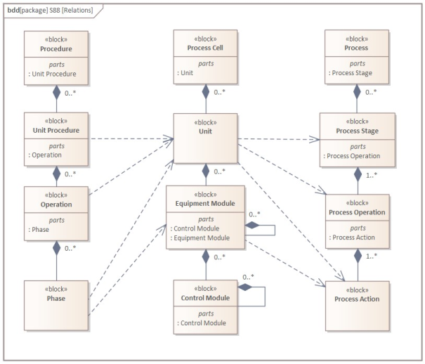

<h1 align="left">
   
  
   
  Industrial Automation Base
   
</h1>

Cours AutB

Author: [Cédric Lenoir](mailto:cedric.lenoir@hevs.ch)

# Module 01 Interfaces,
## *1. Teil, Prinzip*

*Keywords:* **61131-2 hardware tags**

<figure>
    
    <figcaption>Logo International Electrotechnical Commission</figcaption>
</figure>

## Industrial-process measurement and control - Programmable controllers - Part 2: Equipment requirements and tests

## Abstract (www.iec.ch)
IEC 61131-2:2017 specifies functional and electromagnetic compatibility requirements and related verification tests for any product where the primary purpose is performing the function of industrial control equipment, including PLC and/or PAC, and/or their associated peripherals which have as their intended use the control and command of machines, automated manufacturing and industrial processes, e.g. **discrete**, **batch** and **continuous control**.
This fourth edition cancels and replaces the third edition published in 2007. This edition constitutes a technical revision.

> Zitate auf Englisch werden nicht übersetzt.

# Industrielle Prozessklassen

## Warum über Prozesstypen sprechen?
- Die Art des Prozesses steht in direktem Zusammenhang mit bestimmten Eigenschaften der Automaten wie der Rechenleistung.
- Die verschiedenen Prozesse arbeiten mit sehr unterschiedlichen Zykluszeiten und einer nicht minder unterschiedlichen Netzwerkinfrastruktur.

Es geht nicht darum, im Detail auf die verschiedenen Arten industrieller Prozesse einzugehen. Andererseits geht es darum, einige Modellierungsprinzipien zu verstehen, die unter anderem die Bedeutung der Arbeit an der Struktur der Daten rechtfertigen, die im folgenden Kapitel behandelt werden.

> Nachfolgend finden Sie einen Vergleich zweier Arten von Prozessen, die wahrscheinlich in der Pharmaindustrie eingesetzt werden.

<figure>
    
    <figcaption>Batch vs Continuous Manufacturing, Source: Org. Process Res. Dev. 2021, 25, 4, 721-739</figcaption>
</figure>

Einer der Vorteile der Batch-Produktion besteht darin, dass sie einfacher modular aufgebaut werden kann, um verschiedene Arten von Produkten auf derselben Anlage herzustellen, sofern die Steuerungssoftware dies zulässt. Dies ermöglicht oft auch eine spezifische, an die Bedürfnisse des Endkunden angepasste Produktion und letztendlich eine höhere Wertschöpfung.

Auf Softwareebene ist die **Erhöhung der Modularität** eines Programms oft gleichbedeutend mit der **Erhöhung der Komplexität**. Daher ist ein perfekt strukturiertes Programm wichtig.

### Physikalisches ISA-88-Diagramm
ISA-88 bietet ein Modell, das es ermöglicht, einen industriellen Prozess nach einem generischen Modell darzustellen. Obwohl es sich bei ISA-88 ursprünglich um einen Standard handelt, der für die **Stapelverarbeitung** entwickelt wurde, kann er auch zur Modellierung anderer Arten von Prozessen verwendet werden, sodass wir diesen Kurs als allgemeinen Ansatz präsentieren können, der für andere Arten von Prozessen gilt, die automatisiert werden können.

<figure>
    
    <figcaption>ISA-88 Physical Model Generic vesion UML</figcaption>
</figure>

- Zusammenfassend lässt sich sagen, dass sich eine Maschine auf der Ebene **Einheit** befindet.
- Im Rahmen dieses Kurses beschränken wir uns auf ein Element dieser Maschine, ein **Gerätemodul**

## Prozesse, Chargen und Stapelverarbeitung
Gemäß ISA 88 ist ein Prozess eine Abfolge chemischer, physikalischer oder biologischer Aktivitäten zur Umwandlung, zum Transport oder zur Speicherung von Materie oder Energie. Industrielle Fertigungsprozesse können im Allgemeinen als kontinuierliche oder serienmäßige Herstellung einzelner Teile klassifiziert werden. Die Klassifizierung eines Prozesses hängt davon ab, ob die Ausgabe des Prozesses in einem kontinuierlichen Fluss, in endlichen Teilemengen (Fertigung diskreter Teile) oder in endlichen Materialmengen (Chargen) erfolgt.
Obwohl einige Aspekte dieser Norm möglicherweise für die Herstellung einzelner Teile oder kontinuierliche Prozesse gelten, geht ISA88 nicht speziell auf diese Art von Prozessen ein.
Die Realität ist, dass viele Ingenieure, darunter auch der Autor dieses Kurses, an der Anwendung des Standards auf diskrete und kontinuierliche Prozesse interessiert sind. Wir können insbesondere auf die Arbeit „WBF, Applying ISA-88 in Discrete and Continuous Manufacturing“ verweisen.

## Kontinuierliche Prozesse
In einem kontinuierlichen Prozess werden Materialien in einem kontinuierlichen Fluss durch Verarbeitungsanlagen geleitet. Sobald ein stabiler Betriebszustand erreicht ist, ist die Art des Prozesses nicht mehr von der Betriebsdauer abhängig. Starts, Übergänge und Stopps tragen im Allgemeinen nicht zum Erreichen der gewünschten Verarbeitung bei. Auf ISA-Ebene werden kontinuierliche Prozesse in „ISA106, Procedure Automation for Continuous Process Operations“ behandelt.

## Herstellungsprozesse für diskrete Teile
In einem Herstellungsprozess für diskrete Teile werden Produkte auf der Grundlage gemeinsamer Rohstoffe, Produktionsanforderungen und Produktionsverläufe in Produktionschargen eingeteilt. Bei einem Herstellungsprozess für diskrete Teile wird eine bestimmte Produktmenge als Einheit (Gruppe von Teilen) zwischen Arbeitsstationen bewegt, und jedes Teil behält seine einzigartige Identität.

## Batch-Prozesse
Die in dieser Norm behandelte Chargenverarbeitung führt zur Produktion endlicher Materialmengen (Chargen), indem Rohstoffmengen mithilfe eines oder mehrerer Geräte einer definierten Reihenfolge von Verarbeitungsvorgängen unterzogen werden. Das durch einen Batch-Prozess hergestellte Produkt wird als Charge bezeichnet. Batch-Prozesse sind diskontinuierliche Prozesse. Batch-Prozesse sind beides nicht
diskret oder kontinuierlich; Sie weisen jedoch beide Merkmale auf.

### Ein Beispiel für einen Batch-Prozess

<figure>
    
    <figcaption>Drink Processing version Pipe & Process Diagram</figcaption>
</figure>

> Die Bedeutung der P&ID-Beschriftungen ist als Hinweis im beigefügten Dokument [Piping and Instrumentation Diagram](./PID_Diagram.md) angegeben.

<figure>
    
    <figcaption>Drink Processing version ISA-88</figcaption>
</figure>

<figure>
    
    <figcaption>Drink Processing version ISA-88</figcaption>
</figure>

Die Arbeit an den Schnittstellen besteht darin, den Prozess, der beispielsweise durch das **P&ID**-Diagramm, das in der chemischen Industrie häufig vorkommende **Pipe & Process Diagram** dargestellt wird, mit der durch das UML-Diagramm dargestellten Software zu verbinden.

## Andere Aspekte von ISA-88, *zu Ihrer Information*
### Verfahrenskontrollmodell
ISA-88 verwaltet auch ein Verfahrensmodell, das Procedural Control Model, das einfach als Rezeptverwaltung übersetzt werden könnte.
Die in diesem Kurs behandelten Elemente beschränken sich auf das untere Ende der Verfahrensskala. Sie werden dann von einer **Phase** gesteuert.

Eine **Phase** kann einen oder mehrere Befehle erteilen oder eine oder mehrere Aktionen auslösen, wie zum Beispiel:
- Aktivierung und Deaktivierung grundlegender und zustandsorientierter Regelungsarten und Festlegung ihrer Anfangssollwerte und Ausgangswerte
- Einstellen, Löschen und Ändern von Alarm- und anderen Grenzwerten
- Festlegen und Bearbeiten von Controller-Konstanten, Controller-Modi und Algorithmustypen
- Lesen von Prozessvariablen wie Gasdichte, Gastemperatur und Volumenstrom von einem Durchflussmesser und Berechnen des Massendurchflusses durch den Durchflussmesser
- Durchführung von Bedienberechtigungsprüfungen.

Wenn wir davon ausgehen, dass die Hand ein **Kontrollmodul** ist, wäre der Arm ein **Ausrüstungsmodul**, mit dem Sie eine **Phase** ausführen können.

Da wir uns auf das **Kontrollmodul** konzentrieren werden, werden wir das prozedurale Modell nicht entwickeln, da es keine direkten Interaktionen damit hat.

### Prozessmodell
Das Prozessmodell beschreibt die physikalische oder chemische Realität des Prozesses.
Eine Operation könnte zum Beispiel sein:
- Montieren Sie die Trägerplatte auf der Grundplatte
- Sicherungsfeder einsetzen
- Setzen Sie den Gummiknopf ein
- Kontrollieren Sie die Bearbeitungsqualität mit einer Smart-Kamera

###
<figure>
    
    <figcaption>Beziehung zwischen verschiedenen ISA-88-Elementen</figcaption>
</figure

[2. Teil, Eingabe-Ausgabe-Module](./README_DE_part_2.md), 