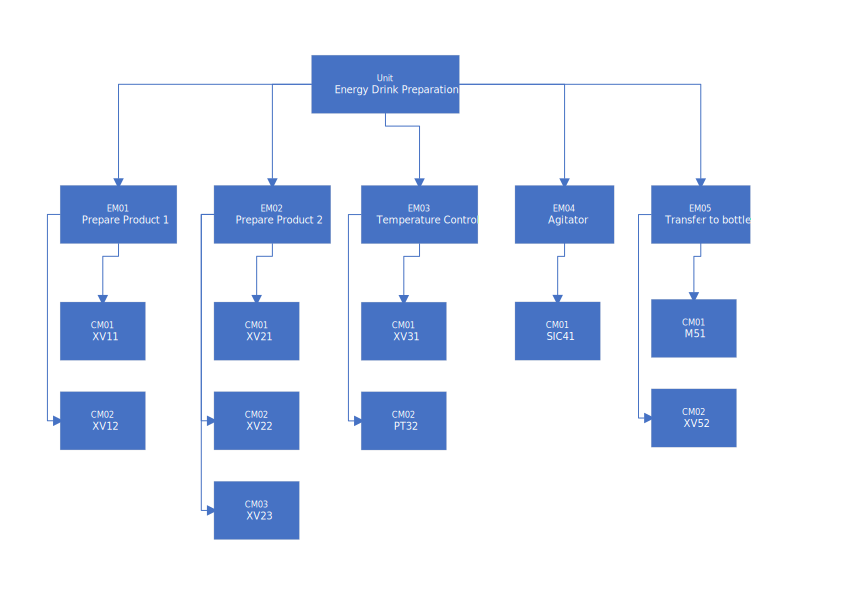
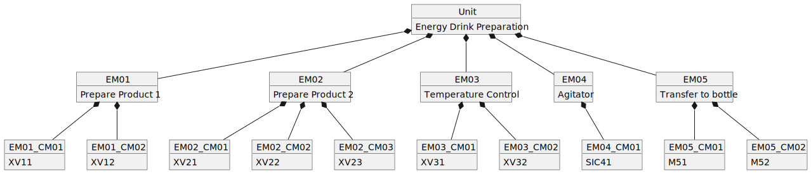

<h1 align="left">
  <br>
  
  <br>
  Industrial Automation Base
  <br>
</h1>

Cours AutB

Author: [Cédric Lenoir](mailto:cedric.lenoir@hevs.ch)

# Module 03 Interfaces,

## Inhaltsverzeichnis

- [Module 03 Interfaces,](#module-03-interfaces)
  - [Inhaltsverzeichnis](#inhaltsverzeichnis)
- [Prinzip\*](#prinzip)
  - [Industrial-process measurement and control - Programmable controllers - Part 2: Equipment requirements and tests](#industrial-process-measurement-and-control---programmable-controllers---part-2-equipment-requirements-and-tests)
  - [Abstract (www.iec.ch)](#abstract-wwwiecch)
- [Industrielle Prozessklassen](#industrielle-prozessklassen)
  - [Warum über Prozesstypen sprechen?](#warum-über-prozesstypen-sprechen)
    - [ISA-88](#isa-88)
    - [ISA-88 Physical Model](#isa-88-physical-model)
      - [Das Steuermodul.](#das-steuermodul)
      - [Das Equipment-Modul.](#das-equipment-modul)
    - [Physikalisches ISA-88-Physical Model](#physikalisches-isa-88-physical-model)
  - [Prozesse, Chargen und Stapelverarbeitung](#prozesse-chargen-und-stapelverarbeitung)
  - [Kontinuierliche Prozesse](#kontinuierliche-prozesse)
  - [Herstellungsprozesse für diskrete Teile](#herstellungsprozesse-für-diskrete-teile)
  - [Batch-Prozesse](#batch-prozesse)
    - [Ein Beispiel für einen Batch-Prozess](#ein-beispiel-für-einen-batch-prozess)
  - [Andere Aspekte von ISA-88,](#andere-aspekte-von-isa-88)
    - [Verfahrenskontrollmodell](#verfahrenskontrollmodell)
    - [Prozessmodell](#prozessmodell)
    - [Das vollständige ISA-88-Modell](#das-vollständige-isa-88-modell)
- [Eingabe-Ausgabe-Module](#eingabe-ausgabe-module)
  - [Ein Kommunikationszentrum.](#ein-kommunikationszentrum)
    - [Ein Automat erlaubt insbesondere:](#ein-automat-erlaubt-insbesondere)
- [Der Begriff des Echtzeitprogramms.](#der-begriff-des-echtzeitprogramms)
  - [Über digitale Signale](#über-digitale-signale)
    - [Definition](#definition)
    - [Notation](#notation)
    - [Probenahme](#probenahme)
- [Standardschnittstellen](#standardschnittstellen)
  - [Beispiel für Eingabemodule](#beispiel-für-eingabemodule)
- [Verfügbarkeit von Sensoren und Aktoren.](#verfügbarkeit-von-sensoren-und-aktoren)
  - [Digital Input Source Siemens 2015](#digital-input-source-siemens-2015)
  - [Digitaler Ausgang](#digitaler-ausgang)
  - [Analog Input](#analog-input)
  - [Analog Output](#analog-output)
  - [IP-Schutzart](#ip-schutzart)
  - [ATEX](#atex)
  - [Beispiel für die Spezifikation eines digitalen Eingangs](#beispiel-für-die-spezifikation-eines-digitalen-eingangs)
    - [Ein schlechtes Beispiel](#ein-schlechtes-beispiel)
- [Feldbusse oder Industriebusse](#feldbusse-oder-industriebusse)
  - [Was ist ein Feldbus?](#was-ist-ein-feldbus)
  - [Wofür ?](#wofür-)
  - [Einschränkungen](#einschränkungen)
  - [Neu für 2023-2024](#neu-für-2023-2024)
  - [Standards](#standards)
  - [Im Idealfall](#im-idealfall)
  - [Wirklichkeit](#wirklichkeit)
- [Abschluss](#abschluss)
  - [Ein schlechtes Beispiel.](#ein-schlechtes-beispiel-1)
- [*3. Teil, I/O mapping*](#3-teil-io-mapping)
  - [Beispiel für die Zuordnung im SPS-Programm](#beispiel-für-die-zuordnung-im-sps-programm)
  - [DS, Designspezifikation](#ds-designspezifikation)
    - [Beispiel für Design-Spezifikation](#beispiel-für-design-spezifikation)
    - [HDS](#hds)
    - [Sicherheitsdatenblatt](#sicherheitsdatenblatt)
    - [Alarme](#alarme)
- [Verwendung von „Tags“ auf Programmebene.](#verwendung-von-tags-auf-programmebene)
  - [Regeln](#regeln)
  - [Datenstruktur](#datenstruktur)
    - [Ein bisschen UML-Sprache](#ein-bisschen-uml-sprache)
    - [UML-Darstellung des Förderers](#uml-darstellung-des-förderers)
    - [**C**ontrol **M**odule moteur](#control-module-moteur)
    - [**C**ontrol **M**odule capteur](#control-module-capteur)
    - [**C**ontrol **M**odule buzzer](#control-module-buzzer)
    - [**E**quipement **M**odule convoyeur](#equipement-module-convoyeur)
    - [UML-Darstellung des Förderers](#uml-darstellung-des-förderers-1)
    - [Tags mit dem Förderband verknüpfen](#tags-mit-dem-förderband-verknüpfen)
      - [Bindung von Eingabe-Tags](#bindung-von-eingabe-tags)
      - [Liaison des tags de sortie](#liaison-des-tags-de-sortie)

# Prinzip*


*Keywords:* **61131-2 hardware tags**

<figure>
    
    <figcaption>Logo International Electrotechnical Commission</figcaption>
</figure>

## Industrial-process measurement and control - Programmable controllers - Part 2: Equipment requirements and tests

## Abstract (www.iec.ch)
IEC 61131-2:2017 specifies functional and electromagnetic compatibility requirements and related verification tests for any product where the primary purpose is performing the function of industrial control equipment, including PLC and/or PAC, and/or their associated peripherals which have as their intended use the control and command of machines, automated manufacturing and industrial processes, e.g. **discrete**, **batch** and **continuous control**.
This fourth edition cancels and replaces the third edition published in 2007. This edition constitutes a technical revision.

> Zitate auf Englisch werden nicht übersetzt.

# Industrielle Prozessklassen

## Warum über Prozesstypen sprechen?
- Die Art des Prozesses steht in direktem Zusammenhang mit bestimmten Eigenschaften der Automaten wie der Rechenleistung.
- Die verschiedenen Prozesse arbeiten mit sehr unterschiedlichen Zykluszeiten und einer nicht minder unterschiedlichen Netzwerkinfrastruktur.

Es geht nicht darum, im Detail auf die verschiedenen Arten industrieller Prozesse einzugehen. Andererseits geht es darum, einige Modellierungsprinzipien zu verstehen, die unter anderem die Bedeutung der Arbeit an der Struktur der Daten rechtfertigen, die im folgenden Kapitel behandelt werden.

> Nachfolgend finden Sie einen Vergleich zweier Arten von Prozessen, die wahrscheinlich in der Pharmaindustrie eingesetzt werden.

<figure>
    
    <figcaption>Batch vs Continuous Manufacturing, Source: Org. Process Res. Dev. 2021, 25, 4, 721-739</figcaption>
</figure>

Einer der Vorteile der Batch-Produktion besteht darin, dass sie einfacher modular aufgebaut werden kann, um verschiedene Arten von Produkten auf derselben Anlage herzustellen, sofern die Steuerungssoftware dies zulässt. Dies ermöglicht oft auch eine spezifische, an die Bedürfnisse des Endkunden angepasste Produktion und letztendlich eine höhere Wertschöpfung.

Auf Softwareebene ist die **Erhöhung der Modularität** eines Programms oft gleichbedeutend mit der **Erhöhung der Komplexität**. Daher ist ein perfekt strukturiertes Programm wichtig.

### ISA-88
ISA-88 ist ein Standard für die Implementierung industrieller Batch-Prozesse. Viele Konzepte lassen sich jedoch auf alle Prozesstypen übertragen, weshalb wir in diesem Kurs regelmäßig darauf zurückgreifen. Er ermöglicht uns die Modellierung einer Anlage, um unser Automatisierungssystem optimal zu strukturieren.


Le modèle simplifié sépare un système industriel en trois partie.

-   **Process Model** ist der zu automatisierende Teil. In einem diskreten Prozess sind dies die zu montierenden Teile oder die zu befüllenden Flaschen. In einem Batch-Prozess sind dies die verschiedenen Zutaten, die in einer bestimmten Menge gemischt oder erhitzt werden. In einem kontinuierlichen Prozess könnte dies ein zu transformierender oder zu filternder Materialstrom sein.

-   **Physical Model** ist unser Automatisierungssystem selbst, dessen zentrales Element eine SPS ist.

-   **Procedural Control Model** ist die Grundlage zur Steuerung des physikalischen Modells.

In diesem Kurs konzentrieren wir uns auf das physikalische Modell.

### ISA-88 Physical Model
ISA-88 bietet ein Modell, mit dem Sie einen industriellen Prozess mithilfe eines generischen Modells darstellen können. Obwohl ISA-88 ursprünglich ein Standard für die **Batch Processing** ist, kann er auch zur Modellierung anderer Prozesstypen verwendet werden. Daher können wir diesen Kurs als allgemeinen Ansatz präsentieren, der für andere automatisierbare Prozesstypen gültig ist.

<div align="center">
<figure>
    
    <figcaption>ISA-88 Physical Model Generic vesion UML</figcaption>
</figure>
</div>

-   Zusammenfassend lässt sich sagen, dass sich eine Maschine auf der Einheitenebene befindet.
-   In diesem Kurs behandeln wir hauptsächlich die Konzepte des  **Equipment Module** und des **Control Module**.

#### Das Steuermodul.
Die unterste Steuerungsebene. Beispiele:

-   Sensoren.
-   Aktoren.
-   Eine Kombination aus Sensoren und Aktoren. Beispielsweise ein Greifer mit seinen Sensoren, die die Öffnungs- oder Schließposition steuern.

> Deshalb werden wir sehen, wie man verschiedene Elemente kapselt und programmiert, um ein **Control Module** zu erstellen.

#### Das Equipment-Modul.

**Equipment-Module**, **EM** sind Hardware-Objekte, die  **contrôles modules**, **CM** zusammenfassen und unter allen Umständen funktional voneinander abhängig sind.

Beispiel:
- Durchflussmesser mit Ventil, Ablaufkreis.
- Pumpe und Ventil für einen Kühlkreislauf.
- Roboterachse mit Kugelumlaufspindel, ausgestattet mit Motor, Positionsgeber und Greifer.

<div align="center">


</div>

### Physikalisches ISA-88-Physical Model
ISA-88 bietet ein Modell, das es ermöglicht, einen industriellen Prozess nach einem generischen Modell darzustellen. Obwohl es sich bei ISA-88 ursprünglich um einen Standard handelt, der für die **Stapelverarbeitung** entwickelt wurde, kann er auch zur Modellierung anderer Arten von Prozessen verwendet werden, sodass wir diesen Kurs als allgemeinen Ansatz präsentieren können, der für andere Arten von Prozessen gilt, die automatisiert werden können.

<figure>
    
    <figcaption>ISA-88 Physical Model Generic vesion UML</figcaption>
</figure>

- Zusammenfassend lässt sich sagen, dass sich eine Maschine auf der Ebene **Einheit** befindet.
- Im Rahmen dieses Kurses beschränken wir uns auf ein Element dieser Maschine, ein **Gerätemodul**

## Prozesse, Chargen und Stapelverarbeitung
Gemäß ISA 88 ist ein Prozess eine Abfolge chemischer, physikalischer oder biologischer Aktivitäten zur Umwandlung, zum Transport oder zur Speicherung von Materie oder Energie. Industrielle Fertigungsprozesse können im Allgemeinen als kontinuierliche oder serienmäßige Herstellung einzelner Teile klassifiziert werden. Die Klassifizierung eines Prozesses hängt davon ab, ob die Ausgabe des Prozesses in einem kontinuierlichen Fluss, in endlichen Teilemengen (Fertigung diskreter Teile) oder in endlichen Materialmengen (Chargen) erfolgt.
Obwohl einige Aspekte dieser Norm möglicherweise für die Herstellung einzelner Teile oder kontinuierliche Prozesse gelten, geht ISA88 nicht speziell auf diese Art von Prozessen ein.
Die Realität ist, dass viele Ingenieure, darunter auch der Autor dieses Kurses, an der Anwendung des Standards auf diskrete und kontinuierliche Prozesse interessiert sind. Wir können insbesondere auf die Arbeit „WBF, Applying ISA-88 in Discrete and Continuous Manufacturing“ verweisen.

## Kontinuierliche Prozesse
In einem kontinuierlichen Prozess werden Materialien in einem kontinuierlichen Fluss durch Verarbeitungsanlagen geleitet. Sobald ein stabiler Betriebszustand erreicht ist, ist die Art des Prozesses nicht mehr von der Betriebsdauer abhängig. Starts, Übergänge und Stopps tragen im Allgemeinen nicht zum Erreichen der gewünschten Verarbeitung bei. Auf ISA-Ebene werden kontinuierliche Prozesse in „ISA106, Procedure Automation for Continuous Process Operations“ behandelt.

## Herstellungsprozesse für diskrete Teile
In einem Herstellungsprozess für diskrete Teile werden Produkte auf der Grundlage gemeinsamer Rohstoffe, Produktionsanforderungen und Produktionsverläufe in Produktionschargen eingeteilt. Bei einem Herstellungsprozess für diskrete Teile wird eine bestimmte Produktmenge als Einheit (Gruppe von Teilen) zwischen Arbeitsstationen bewegt, und jedes Teil behält seine einzigartige Identität.

## Batch-Prozesse
Die in dieser Norm behandelte Chargenverarbeitung führt zur Produktion endlicher Materialmengen (Chargen), indem Rohstoffmengen mithilfe eines oder mehrerer Geräte einer definierten Reihenfolge von Verarbeitungsvorgängen unterzogen werden. Das durch einen Batch-Prozess hergestellte Produkt wird als Charge bezeichnet. Batch-Prozesse sind diskontinuierliche Prozesse. Batch-Prozesse sind beides nicht
diskret oder kontinuierlich; Sie weisen jedoch beide Merkmale auf.

### Ein Beispiel für einen Batch-Prozess

<figure>
    
    <figcaption>Drink Processing version Pipe & Process Diagram <strong>P&ID</strong></figcaption>
</figure>

> Die Bedeutung der P&ID-Beschriftungen ist als Hinweis im beigefügten Dokument [Piping and Instrumentation Diagram](./PID_Diagram.md) angegeben.

<figure>
    
    <figcaption>Drink Processing version <strong>ISA-88</strong></figcaption>
</figure>

<figure>
    
    <figcaption>Drink Processing version <strong>UML</strong></figcaption>
</figure>

Die Arbeit an den Schnittstellen besteht darin, den Prozess, der beispielsweise durch das **P&ID**-Diagramm, das in der chemischen Industrie häufig vorkommende **Pipe & Process Diagram** dargestellt wird, mit der durch das UML-Diagramm dargestellten Software zu verbinden.

## Andere Aspekte von ISA-88,
*zu Ihrer Information*
### Verfahrenskontrollmodell
ISA-88 verwaltet auch ein Verfahrensmodell, das Procedural Control Model, das einfach als Rezeptverwaltung übersetzt werden könnte.
Die in diesem Kurs behandelten Elemente beschränken sich auf das untere Ende der Verfahrensskala. Sie werden dann von einer **Phase** gesteuert.

Eine **Phase** kann einen oder mehrere Befehle erteilen oder eine oder mehrere Aktionen auslösen, wie zum Beispiel:
- Aktivierung und Deaktivierung grundlegender und zustandsorientierter Regelungsarten und Festlegung ihrer Anfangssollwerte und Ausgangswerte
- Einstellen, Löschen und Ändern von Alarm- und anderen Grenzwerten
- Festlegen und Bearbeiten von Controller-Konstanten, Controller-Modi und Algorithmustypen
- Lesen von Prozessvariablen wie Gasdichte, Gastemperatur und Volumenstrom von einem Durchflussmesser und Berechnen des Massendurchflusses durch den Durchflussmesser
- Durchführung von Bedienberechtigungsprüfungen.

Wenn wir davon ausgehen, dass die Hand ein **Kontrollmodul** ist, wäre der Arm ein **Ausrüstungsmodul**, mit dem Sie eine **Phase** ausführen können.

Da wir uns auf das **Kontrollmodul** konzentrieren werden, werden wir das prozedurale Modell nicht entwickeln, da es keine direkten Interaktionen damit hat.

### Prozessmodell
Das Prozessmodell beschreibt die physikalische oder chemische Realität des Prozesses.
Eine Operation könnte zum Beispiel sein:
- Montieren Sie die Trägerplatte auf der Grundplatte
- Sicherungsfeder einsetzen
- Setzen Sie den Gummiknopf ein
- Kontrollieren Sie die Bearbeitungsqualität mit einer Smart-Kamera

### Das vollständige ISA-88-Modell

<figure>
    
    <figcaption>Beziehung zwischen verschiedenen ISA-88-Elementen</figcaption>
</figure>

# Eingabe-Ausgabe-Module
Die Ein- und Ausgänge ermöglichen uns die Steuerung und Überwachung der physischen Elemente von der SPS aus.

<div align="center">


</div>

## Ein Kommunikationszentrum.
Eine moderne SPS ist vor allem ein Kommunikationszentrum, das den Einsatz verschiedenster Protokolle und Hardware in einer gegebenen Umgebung ermöglicht.

<figure>
    
    <figcaption>Internal Block Diagram of a PLC</figcaption>
</figure>

### Ein Automat erlaubt insbesondere:
- Um mit einem Bediener über eine **HMI** Mensch-Maschine-Schnittstelle zu kommunizieren,
- Um mit dem Anwendungsentwickler über eine **IDE** zu kommunizieren,
- Um mit der Maschine zu kommunizieren,
- Zur Kommunikation mit internen oder externen **Cloud**-Datenbanken,
- Zur Verwaltung des Stromnetzes und möglicher **USV-Fehler**.

> Das Konzept der integrierten Entwicklungsumgebung **IDE** wird im Rahmen der praktischen Arbeit entwickelt, die ein integraler Bestandteil ist.

> Eine **USV**, eine unterbrechungsfreie Stromversorgung, muss es einem Controller ermöglichen, bestimmte wesentliche Funktionen im Falle eines Netzwerkstromausfalls zu verwalten. Generell gilt, dass eine SPS in der Lage sein muss, ordnungsgemäß herunterzufahren, aber auch nach Wiederherstellung der Stromversorgung automatisch neu zu starten.

# Der Begriff des Echtzeitprogramms.

Der Begriff des präemptiven Echtzeitbetriebssystems (RTOS) bedeutet vor allem eines:

> Das Betriebssystem ist in der Lage, eine weniger wichtige Aufgabe zu unterbrechen, um die Ausführung einer anderen, wichtigeren Aufgabe unter Einhaltung einer festgelegten Zykluszeit und Präzision zu gewährleisten.

Die gesamte Theorie der digitalen Signalverarbeitung basiert auf der Abtastung. Wenn die Wiederholbarkeit der Abtastqualität nicht gewährleistet ist, ist die Signalverarbeitungsqualität nicht gewährleistet.

> Es sollte beachtet werden, dass eine SPS in der Lage ist, die meisten **Signalverarbeitungs-** und **erweiterten Regelungsalgorithmen** bis zu einer Bandbreite in der Größenordnung von **1 bis 2 [kHz]** auszuführen.

## Über digitale Signale

### Definition
Per Definition ist ein diskretes Signal eine Reihe realer oder komplexer digitaler Werte. Besteht es aus reellen Werten, spricht man von einem reellen Signal, setzt es sich aus komplexen Werten zusammen, spricht man von einem komplexen Signal. Ein digitales Signal ist ein diskretes Signal, dessen Amplitude quantifiziert wird.

### Notation
-   $\ x(k) $
-   $\ x(k  \Delta t) $

Wobei die unabhängige Variable K eine ganze Zahl ist.

### Probenahme
Abtasttheorem
Ein analoges Signal $\ x_a(t)$ mit einer auf $\ F_s(Hz)$ begrenzten Bandbreite kann aus seinen Abtastwerten $\ x_a(k \delta t)$ nur dann exakt rekonstruiert werden, wenn diese mit einer Periode $\ \delta t$ aufgenommen wurden kleiner oder gleich $\ 1/(2F_s)$.

Literatur: Siehe [Murat Kunt, Digitale Signalverarbeitung](https://www.epflpress.org/produit/803/9782889142439/Traitement%20numerique%20des%20signaux%20)

Die mathematischen Aspekte der digitalen Signalverarbeitung werden je nach Branche in unterschiedlichen industriellen Systemmodulen verarbeitet.

> Ziel dieses Kurses ist es zu zeigen, dass viele Algorithmen, die vor einigen Jahren noch spezialisierten Prozessoren wie **DSP**, **Digital Signal Processor**, vorbehalten waren, heute direkt in SPS implementiert werden können.

#Hypervisor
Es ist keineswegs das Ziel dieses Kurses, auf die Einzelheiten des Mechanismus einzugehen, der es einem Echtzeitbetriebssystem, **RTOS**, ermöglicht, den Prozessor und Speicherplatz desselben Systems mit einem Windows- oder Linux-Betriebssystem zu teilen System.

<figure>
    
    <figcaption>PLC et OS de type Windows ou Linux sur le même hardware</figcaption>
</figure>

# Standardschnittstellen
 
Anbieter von SPS-Lösungen bieten Ein-/Ausgabemodule an, die spezifisch für ihre Produktpalette sind und in der Regel nicht mit denen anderer Hersteller kompatibel sind, angefangen bei ihren mechanischen Eigenschaften.

## Beispiel für Eingabemodule
|Herkunft Beckhoff | Herkunft Siemens|
|:-----------------:|:--------------:|
| ||

Es gibt eine Vielzahl technischer Lösungen, die es verschiedenen Modulen ermöglichen, miteinander zu kommunizieren, allerdings mit direkten Auswirkungen auf Entwicklungszeit und Hardwarekosten. Es wird noch notwendig sein, ein zusätzliches Risiko für die Komplexitätssteigerung hinzuzufügen.

Die erste Aufgabe des Automatisierungsingenieurs, die jedoch oft in der Verantwortung des Projektmanagers liegt, der ein Chemie- oder Maschinenbauingenieur sein kann, besteht darin, den Lieferanten auszuwählen, dessen Produktpalette am besten zu seiner Art von Anwendung passt.

> Anbieter von SPS-Lösungen sind häufig auf bestimmte Tätigkeitsbereiche spezialisiert. Ein gutes System zur Verwaltung eines Gebäudes (Heizung, Lüftung und Klimaanlage, HVAC) ist möglicherweise überhaupt nicht für die Verwaltung einer Werkzeugmaschine, einer computergestützten numerischen Steuerung (CNC), geeignet.

# Verfügbarkeit von Sensoren und Aktoren.

Was für die Schnittstellen, die eine Digitalisierung des Signals ermöglichen, gilt, gilt auch für die Sensoren, die den Automaten mit Prozessinformationen versorgen, sowie für die Aktoren, die auf den Prozess einwirken.
 
Sensor- und Aktorlieferanten unterscheiden sich oft von Automatisierungslieferanten. Grund dafür, dass eine Reihe von Signalen über die Norm IEC 61131-2 oder IEC 61131-9 standardisiert werden (siehe Kapitel Intelligente Sensoren / IO-Link, Link muss vervollständigt werden).
Die Norm IEC 61131-2 definiert hauptsächlich die Signalpegel und die Impedanzgrenze für binäre, digitale Eingänge, digitale Ausgänge und analoge Signale, analoge Eingänge und analoge Ausgänge. Für analoge Signale gelten zusätzliche Einschränkungen hinsichtlich Quantifizierung und Störfestigkeit, die parallel zum Instrumentierungskurs berücksichtigt werden müssen.

Dabei geht es nicht darum, detailliert auf die Art der Signale einzugehen, sondern auf die zahlreichen Variationen innerhalb der Norm IEC 61131-2 selbst aufmerksam zu machen.

## Digital Input [Source Siemens 2015](https://cache.industry.siemens.com/dl/files/921/109477921/att_862667/v3/109477921_Compliance_IEC_61131-2_DI_module_de.pdf)
|Signal range     |Type 1|Type 2|Type 3|
|-----------------|------|------|------|
|24 [Vdc]	      |...   |...   |...   |
|120 [Vac]	      |...   |...   |...   |
|230 [Vac]	      |...   |...   |...   |

Meines Wissens ist das Signal 5 [Vdc] nicht Teil der Eingangsspezifikation, aber dieser Spannungspegel ist von einigen Herstellern verfügbar, zum Beispiel [Beckhoff EL1124](https://www.beckhoff.com/en -en/products/ i-o/ethercat-terminals/el1xxx-digital-input/el1124.html).

## Digitaler Ausgang
Es ist keine allgemeine Quelle für IEC 61131-2 verfügbar

## Analog Input
|Signal range     |Input impedance limits|
|-----------------|----------------------|
|± 10 [V]	|≥ 10 [kΩ]|
|0-10 [V]	|≥ 10 [kΩ]|
|1-5 [V]	|≥ 5 [kΩ]|
|4-20 [mA]	|≤ 300 [Ω]|

## Analog Output
|Signal range     |Input impedance limits|
|-----------------|----------------------|
|± 10 [V]	|≥ 1000 [Ω]|
|0-10 [V]	|≥ 1000 [Ω]|
|1-5 [V]	|≥ 500 [Ω]|
|4-20 [mA]	|≤ 600 [Ω]|

## IP-Schutzart
**IP**, **Ingress Protection**, gibt es am häufigsten in IP20 und IP67.
Die Verfügbarkeit variiert stark von Hersteller zu Hersteller.

## ATEX
Geräte für explosionsgefährdete Bereiche (ATEX), Geräte für explosionsgefährdete Bereiche, stammen aus einer europäischen Richtlinie.

> [RICHTLINIE 2014/34/EU DES EUROPÄISCHEN PARLAMENTS UND DES RATES vom 26. Februar 2014 zur Harmonisierung der Rechtsvorschriften der Mitgliedstaaten für Geräte und Schutzsysteme zur bestimmungsgemäßen Verwendung in explosionsgefährdeten Bereichen](https://eur-lex.europa.eu/legal-content/DE/TXT/?uri=CELEX:32014L0034).

Hersteller, die Produkte anbieten, die dieser Richtlinie entsprechen, sind seltener, aber das Thema ist besonders wichtig für die chemische Industrie, die im Wallis stark vertreten ist. **Besonderes Augenmerk muss auf die Wahl der Schnittstellen gelegt werden, wenn der Prozess mit der Chemie oder verwandten Bereichen verknüpft ist.**

## Beispiel für die Spezifikation eines digitalen Eingangs
EL1008 | EtherCAT Terminal, 8-channel digital input, 24 V DC, 3 ms

|Technical data	|EL1008|
|---------------|------|
|Connection technology	|1-wire
|Specification	|EN 61131-2, type 1/3
|Number of inputs	|8
|Nominal voltage	|24 V DC (-15 %/+20 %)
|“0” signal voltage	|-3…+5 V (EN 61131-2, type 3)
|“1” signal voltage	|11…30 V (EN 61131-2, type 3)
|Input current	|typ. 3 mA (EN 61131-2, type 3)
|Input filter	|typ. 3.0 ms
|Distributed clocks	|-
|Current consumption power contacts	|typ. 2 mA + load
|Current consumption E-bus	|typ. 90 mA
|Electrical isolation	|500 V (E-bus/field potential)
|Configuration	|no address or configuration setting
|Special features	|standard input terminal for bouncing signals (filter 3 ms)
|Weight	|approx. 55 g
|Operating/storage temperature	|-25…+60 °C/-40…+85 °C
|Relative humidity	|95 %, no condensation
|Vibration/shock resistance	|conforms to EN 60068-2-6/EN 60068-2-27
|EMC immunity/emission	|conforms to EN 61000-6-2/EN 61000-6-4
|Protect. rating/installation pos.	|IP20/see documentation
|Pluggable wiring	|for all ESxxxx terminals
|Approvals/markings	|CE, UL, ATEX, IECEx, DNV GL, cFMus
|Ex marking	|ATEX:II 3 G Ex nA IIC T4 Gc IECEx: Ex ec IIC T4 Gc cFMus: Class I, Division 2, Groups A, B, C, D Class I, Zone 2, AEx ec IIC T4 Gc

> Hersteller erwähnen nicht immer die IEC 61131-2-Kompatibilität. Vor allem, weil der Sensor nicht in den Geltungsbereich der Norm fällt. Es kann daher nicht für eine bestimmte Spezifikation validiert werden.

### Ein schlechtes Beispiel
Suchen Sie nach einer Karte, mit der Sie Signale mit 1 MHz erfassen können.

# Feldbusse oder Industriebusse

<div align="center"> 

```mermaid
---
title: PLC with fieldbus
---

flowchart TB

    subgraph CPU
        RI[Input Register]
        RO[Output Register]
        RI-->Code
        Code --> RO
        Memory<-->Code
    end

    subgraph Fieldbus

       subgraph Input
            direction BT       
            I1[Input Module 1] 
            I2[Input Module 2] 
            Ix[Input Module ...] 
        end
        subgraph Output
            direction BT     
            O1[Output Module 1] 
            O2[Output Module 2] 
            Ox[Output Module ...] 
        end
    end

    CM[Communication Module]    
    CM <--> Fieldbus
    CM --> RI
    RO --> CM

 ```

</div>

## Was ist ein Feldbus?
Ein Feldbus oder Industriebus ist ein Kommunikationssystem, das einen physischen Träger, das Kabel, einen physischen elektronischen Teil und einen Softwareteil umfasst, der die Kommunikation zwischen Sensoren, Aktoren und Industriesteuerungen ermöglicht.
## Wofür ?
Das Prinzip besteht darin, die digitalen Signale mehrerer Geräte auf einem einzigen Kabel zu multiplexen, um zu vermeiden, dass alle Geräte mit unterschiedlichen Kabeln an die SPS angeschlossen werden müssen.
## Einschränkungen
Diese Busse sind häufig so konzipiert, dass sie den Anforderungen bestmöglich gerecht werden, die je nach Branche unterschiedlich sein können.
Zum Beispiel :
- Profibus-DP, Dezentrale Peripherie, vertrieben ab Ende der 90er Jahre. Der gebräuchlichste Industriebus, der jedoch im Zuge der Modernisierung der Anlagen den Ethernet-basierten Bussen Platz macht.
- Profibus-PA für Prozessautomatisierung, eine Variante von Profibus DP, die für den Einsatz in explosionsgefährdeten Bereichen konzipiert ist. Es ist in der chemischen Industrie sehr präsent.
- Profinet, der Nachfolger von Profibus, basierend auf Ethernet-Unterstützung. Es ersetzt Profibus-PA nicht, da es nicht für explosionsgefährdete Bereiche ausgelegt ist.
- Der Sercos II-Bus (Lichtwellenleiter) und dann Sercos III (Ethernet-Kabel) wurden entwickelt, um von Synchronmotoren angetriebene Achsen zu synchronisieren. Anwendungsgebiet Werkzeugmaschine (CNC).

Neben den technischen Besonderheiten gibt es auch geografische Aspekte: Der europäische Markt wird von Profinet (Siemens) dominiert, während der amerikanische Markt von EtherNet/IP (Allen-Bradley) dominiert wird.
Es gibt geschäftliche Entscheidungen. Wenn ein großes Unternehmen wie Nestlé einen Bustyp standardisiert hat, wird es versuchen, diesen Bus diesen Lieferanten aufzuzwingen, um die Wartung seines Netzwerks zu vereinfachen.

## Neu für 2023-2024
Derzeit befindet sich eine neue Technologie in der Pilottestphase bei verschiedenen Anbietern. [Ethernet-APL](https://www.ethernet-apl.org) Erweiterte physikalische Schicht. Diese Technologie soll Profibus-PA in der sogenannten Prozess-, Chemie- und Biotechnologieindustrie ersetzen. Für Ingenieure, die in dieser Branche tätig sind, lohnt es sich, diesen Bustyp bei jedem neuen Projekt in Betracht zu ziehen. Diese Technologie ist darauf ausgelegt, die physikalischen Medien alter Anlagen nutzen zu können und ist daher auch für Renovierungsprojekte relevant.

<Abbildung>
     
     <figcaption>Ethernet-APL</figcaption>
</figure>


## Standards
Im Fall von Feldbussen lösen die Standards, selbst wenn sie in der Reihe IEC 61784 und IEC 61800 existieren, nichts, da für die meisten Haupttypen von Feldbussen Varianten der Standards geschrieben wurden.
Die Situation im Jahr 2023 geht aus einer Veröffentlichung von HMS hervor, einem Unternehmen, das sich auf die Entwicklung von Produkten für Industriebusse spezialisiert hat. Das HMS-Diagramm wird im globalen Maßstab erstellt und geografische Gebiete würden unterschiedliche Realitäten zeigen. Beachten Sie auch das Wachstum drahtloser Netzwerke.
 
<figure>
    
    <figcaption>Field Bus Market Share Source: <a href="https://www.hms-networks.com/news-and-insights/news-from-hms/2023/05/05/industrial-network-market-shares-2023">www.hms-networks-com 2023</a></figcaption>
</figure>
 
## Im Idealfall
Unter der Schirmherrschaft der OPC Foundation gründete opcfoundation.org eine Arbeitsgruppe zur Harmonisierung industrieller Netzwerke unter dem Namen OPC UA Field Level Communications (FLC). Im Jahr 2023 werden sich die nach dieser Harmonisierung entwickelten Produkte im Demonstratorstadium befinden.
 
<figure>
    
    <figcaption>From cloud to sensor Source: <a href="https://opcfoundation.org">opcfoundation.org</a>
    </figcaption>
</figure>

## Wirklichkeit
Im folgenden Beispiel sehen wir, dass es von derselben SPS aus eine Vielzahl von Feldbussen gibt, die an eine SPS angeschlossen werden können oder nicht. Keiner dieser Feldbusse ist mit den anderen kompatibel. Feldbusse sind fast alle proprietär, das heißt, sie werden von Herstellern entwickelt.
- Profibus *Herkunft Siemens*
- Profinet *Herkunft Siemens)*
- CC-Link *Mitsubishi-Ursprung*
- Ethernet/IP *Allen-Bradley-Ursprung*
- DeviceNet *Allen-Bradley-Ursprung*
- EtherCAT *Origin Beckhoff*

*Es gibt keine Quelle zum Ursprung von IO-Link, aber IO-Link wird von der Organisation [PI International](https://www.profibus.com) wie Profinet und Profibus gepflegt... *

<figure>
    
    <figcaption>Pyramide IO-Link Source Balluff Source: <a href="https://www.balluff.com">www.balluff.com</a>
    </figcaption>
</figure>

# Abschluss
Es ist sehr wichtig, sich die folgenden Informationen zu merken:
- Vor der Auswahl eines SPS-Systems muss geprüft werden, ob die auf dem Markt erhältlichen Sensor- oder Aktortypen über die erforderlichen Schnittstellen verfügen.
- Manchmal ist es wichtiger, den Feldbus auszuwählen, der den Anforderungen des Projekts entspricht, als anschließend die entsprechende Steuerung auszuwählen.
- Wählen Sie einen möglichst modernen Bustyp, um eine möglichst lange Lebensdauer zu gewährleisten.
- Passen Sie den Feldbustyp an die Umgebung an, in der er installiert wird.
- Berücksichtigen Sie die technischen Aspekte, Zykluszeit, Durchsatz, funktionale Sicherheit und Cybersicherheit, die später im Kurs entwickelt werden.

## Ein schlechtes Beispiel.
Wählen Sie einen Sensor aus, der mit einer **i2c**, *Inter Integrated Circuit Bus*-Schnittstelle ausgestattet ist, und suchen Sie nach der Eingangs-/Ausgangskarte, die die Kommunikation mit einer SPS ermöglicht.

In diesem Fall ist **i2c** ein serieller Bus, der hauptsächlich für die Kommunikation zwischen den verschiedenen auf einer elektronischen Karte integrierten Komponenten konzipiert ist. Der ausgewählte Sensor wird voraussichtlich sehr preiswert sein, jedoch nicht für den Anschluss im industriellen Umfeld ausgelegt. Die endgültigen Kosten für die Integration einer Komponente im Wert von einigen Franken werden wahrscheinlich viel höher ausfallen als für einen Sensor, der in einem Element gekapselt ist, das mit einer IEC 61131-2-kompatiblen Schnittstelle ausgestattet ist.

# *3. Teil, I/O mapping*

*Keywords:* **TAG HDS SDS**

Die **Zuordnung**, *keine zufriedenstellende französische Übersetzung, aber wir könnten sagen, Verbindungsplan*, der Ein- und Ausgänge ermöglicht es, den Code mit der Hardware zu verknüpfen.

Ein- und Ausgänge werden im Allgemeinen durch eine Eingabeadresse ``I`` oder eine Ausgabe ``Q`` dargestellt.

> Auf der Ebene der Ein- und Ausgänge unterscheiden wir nicht zwischen digital oder analog, da analoge Signale zwangsläufig Wandler durchlaufen. Am häufigsten ein „WORT“ für 12, 14 oder 16 Bit.

Die **Zuordnung** der Ein- und Ausgänge einer SPS hängt oft direkt mit der Art der Hardware zusammen. Das Prinzip kann mehr oder weniger kompliziert sein, ist aber selten trivial, wenn es darum geht, sich mit einer neuen Art von Material vertraut zu machen. Da das Ziel dieses Kurses die Programmierung in **strukturiertem Text** auf SPS-Ebene betrifft, werden wir uns nicht auf einen Begriff konzentrieren, der je nach IDE jedes Herstellers unterschiedlich ist.

Es gibt nie eine **einfache** Karte. Selbst bei einem **Digital In**-Eingangssignal müssen Sie den Spannungspegel überprüfen. am häufigsten ``24 [Vdc]``. Wir können aber auch Spannungen ``48 [Vdc / Vac]`` oder ``230 [Vac]`` finden.

> Für eine **Standard** ``24 [Vdc]``-Karte ist ``Stufe 0`` zwischen ``-3 und 5 [Vdc]`` definiert. Tatsächlich gelingt es einer einfachen digitalen Schaltung mit einer **TTL** *Transistor-Transistor-Logik*-Spannung von 5 [Vdc], siehe 3,3 [Vdc] **nicht, den Logikpegel der Karte umzuschalten!**

## Beispiel für die Zuordnung im SPS-Programm
|Name                 |Type|Logical Address|
|---------------------|----|---------------|
|I1_Pb_Station_1      |BOOL|%I0.0|
|I4_Pb_OutputConveyor |BOOL|%I0.3|
|B1_SensorActive      |BOOL|%I0.4|
|B4_OutputConveyorFree|BOOL|%I0.7|
|I1_MotorCurrent      |WORD|%I4.0|
|H2_LedStation_2      |BOOL|%Q0.1|
|H3_LedStation_3      |BOOL|%Q0.2|
|K1_DirectionOutput	  |BOOL|%Q0.4|
|K2_DirectionH1       |BOOL|%Q0.5|
|C1_SetMotorSpeed     |WORD|%Q6.0|
|HMI_SelectCase       |WORD|%MB0 |

> Die Erwähnung ``%MB`` bezieht sich auf eine interne Registrierung, in diesem Fall zum Erstellen einer Schnittstelle zum **HMI** Human Machine Interface, oder auf einen Begriff, der häufig in französischsprachigen Dokumentationen vorkommt: IHM für Interface Machine Man.

## DS, Designspezifikation
Im Hinblick auf das Projektmanagement vereint der DS im Allgemeinen zwei Arten von Dokumenten, die sich ergänzen und häufig unter derselben Bezeichnung zusammengefasst werden.
**HDS** *Hardware-Design-Spezifikation* und **SDS** *Software-Design-Spezifikation*.
Die Liste der Tags bezieht sich auf Hardware. Im Allgemeinen handelt es sich um die Schnittstelle zwischen der Software und dem **elektrischen Diagramm** des Systems.

> Die meisten professionellen Schaltplanbearbeitungsprogramme sind in der Lage, die für die Verknüpfung zwischen dem Namen des TAGs und der physischen Adresse der Karte erforderlichen Dateien direkt zu generieren. Um es ein wenig zu vereinfachen: Derzeit dominiert ein einzelnes Unternehmen diesen Markt so stark, dass fast alle im Bereich der Elektromontage tätigen Unternehmen die gleiche Software verwenden.

### [Beispiel für Design-Spezifikation](./documentation/DS_TestBenchSpecification.xlsx)
Das beigefügte Beispiel könnte ausreichen, um die Schaltpläne zu erstellen und anschließend mit der Produktionsphase fortzufahren.


### HDS
Die Hardwarespezifikation fasst beispielsweise in Form einer Tabellenkalkulation *z. B. Excel, ganz zu schweigen von einer Marke* die Liste der Hardware und deren Verbindung zur Software zusammen.
Manchmal finden wir einen Verweis auf den Schaltplan, um die für die Diagnose notwendigen Informationen zu finden.

### Sicherheitsdatenblatt
Die Softwarespezifikation basiert teilweise auf demselben Excel-Dokument und ermöglicht es beispielsweise dem *Programmierer*, die für das Alarmmanagement erforderlichen Informationen zu kennen.
Das **SDS** wird idealerweise ergänzt durch **Objekt- oder Klassendiagramme** „Objekt/Klassendiagramm“, **Aktivitätsdiagramme** „Aktivitätsdiagramm“ und **Zustandsdiagramme* * „Zustandsdiagramm*“

|Tag Name | Type  | Soft Logic Address | Hard Address | Card Type |Device Type |Schematic Ref|
|---------|-------|--------------------|--------------|-----------|-------------|------------|
|I1_Pb_Station_1|BOOL|%I0.0            | C1_S0  |DI 32x24VDC HF_1          |Schneider XB4BA31|Unit01_C23_2|
|I2_Pb_Station_2|BOOL|%I0.1            | C1_S1  |DI 32x24VDC HF_1          |Schneider XB4BA31|Unit01_C27_1|
|K1_DirectionOutput|BOOL|%Q0.1         | C2_S1  |DQ 32x24VDC/0.5A HF_1      |Schneider XB4BVB3|Unit01_D23_7|
|C1_SetMotorSpeed|WORD|%Q6.1           | C3_S4  |AQ 8xU/I HS_1     |Danfoss  131B4268|Unit01_F23_2|
|I1_MotorCurrent|WORD|%I4.0            | C4_S2  |AI 8xU/I/RTD/TC ST_1     |Danfoss  131B4268|Unit01_C23_2|

### Alarme
Ohne ein vollständiges Alarmmanagement und eine vollständige Alarmliste ist ein Automatisierungsprojekt nicht vollständig. In vielen Fällen, **Projekten im medizinischen Bereich**, muss die Liste aller Alarme mit einer eindeutigen Referenz, AlarmID, verfügbar sein. Die obige Tabelle ermöglicht unter anderem die Generierung vollständiger Alarme für den Endbenutzer, die ihm insbesondere Folgendes ermöglichen:
- Um zu wissen, welches Gerät einen Alarm verursacht.
- Wo ist das Gerät angeschlossen, es kann eine Maschine, aber auch eine Fabrik sein.
- Die Referenz jedes mit diesem Alarm verknüpften Geräts, sofern eines davon geändert werden sollte.

|AlaramID|Severity|Label|Level|Tag Name|Schematic Ref|Recovery|
|--------|--------|-----|--------|---------|-------------|--------|
|Un03Em01Id0001|Medium|The motor current is high|> 75[A]|I1_MotorCurrent|Unit01_C23_2|Reduce conveyor speed.|

# Verwendung von „Tags“ auf Programmebene.
In der Vorgeschichte der Automaten wurden Tags manchmal direkt im Programm verwendet```Ladder```.

**In structured Text:**
```iecst
IF I1_Pb_Station_1 THEN
    K1_DirectionOutput := TRUE;
END_IF
```

Oder noch schlimmer, direkt in Form einer Software-Adresse:

```iecst
IF %I0.0 THEN
    %Q0.1 := TRUE;
END_IF
```

oder noch schlimmer, in der Leiter...

Da wir das Mittelalter längst hinter uns haben, werden wir etwas strukturierter vorgehen.

## Regeln
- Die Tags sind so geschrieben, dass sie in zusätzlichen Kommentaren nach Möglichkeit verständlich sind.
- Tags werden nach Möglichkeit nach einer Liste von Regeln geschrieben, die von der Art der Branche abhängen, zum Beispiel [ISA5.1, Instrumentation Symbols and Identification](https://www.isa.org/standards-and-publications/isa -standards/isa-standards-committees/isa5-1). **ISA** für International Society of Automation. Beachten Sie, dass Standardisierungsdokumente selten kostenlos verfügbar sind und meist durch einen Hinweis wie *Copyright © 2009 by ISA* geschützt sind.
- Tags sind in einer Datenstruktur organisiert.
- Die Tags sollten sich leicht vom Kern des Programms entkoppeln lassen, um eine Simulation zu ermöglichen.

## Datenstruktur
Nehmen wir als Beispiel die Ausstattung einer Maschine, einer Förderanlage, bestückt mit verschiedenen Modulen.
|Name                 |Type|Logical Address|
|---------------------|----|---------------|
|S1_Pb_Station_1|BOOL|%I0.0|
|S2_Pb_Station_2|BOOL|%I0.1|
|S3_Pb_Station_3|BOOL|%I0.2|
|S4_Pb_OutputConveyor|BOOL|%I0.3|
|B1_SensorActive|BOOL|%I0.4|
|B2_SensorActive|BOOL|%I0.5|
|B3_SensorActive|BOOL|%I0.6|
|B4_OutputConveyorFree|BOOL|%I0.7|
|H1_LedStation_1|BOOL|%Q0.0|
|H2_LedStation_2|BOOL|%Q0.1|
|H3_LedStation_3|BOOL|%Q0.2|
|H4_LedOutputConveyor|BOOL|%Q0.3|
|K1_DirectionOutput|BOOL|%Q0.4|
|K2_DirectionH1|BOOL|%Q0.5|
|Buzzer|BOOL|%Q0.6|

Der Förderer ist mit verschiedenen Modultypen ausgestattet. Siehe **EM Equipment Module** und **CM Control Module** gemäß **ISA-88**.

### Ein bisschen UML-Sprache
> Im weiteren Verlauf dieses Kurses werden wir manchmal ein wenig UML-Notation verwenden. Hier sind die beiden Notationen, die Sie sich **unbedingt merken müssen**.


> Im obigen Diagramm verwenden wir Aggregation und Zusammensetzung.
> > **Composition** bedeutet, dass eine Klasse aus einer oder mehreren anderen zusammengesetzt ist.
> > **Aggregation** bedeutet, dass eine Klasse eine oder mehrere Klassen aggregiert, die nicht zu ihr gehören. Das bedeutet, dass die Klasse ST_Driver **unabhängig** von FB_CAR existieren **muss**.

### UML-Darstellung des Förderers


> **<span style="color:red">Achtung! </span>**: Wenn Sie einer KI eine Frage stellen, wird sie wahrscheinlich einen anderen Linktyp zurückgeben. Über die UML/SysML-Semantik für IEC 61131-3 könnte diskutiert werden, aber das in [FB_CAR](#a-little-bit-of-uml-language) dargestellte Modell **repräsentiert den in diesem Kurs verwendeten Formalismus und sollte respektiert werden**. Beispiele zur Verwendung der **Aggregation** werden wir später behandeln.

### **C**ontrol **M**odule moteur
```iecst
TYPE CM_Motor_typ
   STRUCT
      K_ActivatePositiveDirection : BOOL;
      K_ActivateNegativeDirection : BOOL;
   END_STRUCT;
END_TYPE
```

### **C**ontrol **M**odule capteur
```iecst
TYPE CM_ActiveSensor_typ
   STRUCT
      S_PushButon    : BOOL;
      B_SensorActive : BOOL;
      H_LedStation   : BOOL;
   END_STRUCT;
END_TYPE
```

### **C**ontrol **M**odule buzzer
```iecst
TYPE CM_Buzzer_typ
   STRUCT
      Active : BOOL;
   END_STRUCT;
END_TYPE
```

### **E**quipement **M**odule convoyeur
Ein Standardförderer ausgestattet mit:
- 1 Motorsteuerung
- 4 Arbeitsplätze
- 1 Signalelement

Die Module sind einfach, in der Praxis werden sie oft deutlich komplexer sein, das Aufbauprinzip bleibt jedoch das gleiche.

```iecst
TYPE EM_ConveyorThreeStations_typ
   STRUCT
      Motor        : CM_Motor_typ;
      StationInput : CM_ActiveSensor_typ;
      StationOne   : CM_ActiveSensor_typ;
      StationTwo   : CM_ActiveSensor_typ;
      StationThree : CM_ActiveSensor_typ;
      Buzzer       : CM_Buzzer_typ;
   END_STRUCT;
END_TYPE
```

### UML-Darstellung des Förderers
Ich bin nicht in der Lage, die Struktur *genau* darzustellen. Auch wenn es ein wenig Verwirrung stiftet, werden zwei Alternativen vorgeschlagen. **Ich bevorzuge das erste**

Die folgende Version sollte als Objekt in der Lage sein, 4 ``CM_ActiveSensor_typ``-Blöcke anzuzeigen, was die Software nicht zulässt.
<figure>
    
    <figcaption>EM_ConveyorThreeStations_typ variante A</figcaption>
</figure>

Die folgende Version als Objekt „EM_ConveyorThreeStations_typ“ ist korrekt, da die Anzeige der Blöcke ``CM_Motor_typ``, ``CM_ActiveSensor_typ`` und ``CM_Buzzer_typ``, aus denen es besteht, nicht zwingend erforderlich ist. Die gestrichelte Linie bedeutet einfach **Es besteht eine Verbindung**, was richtig ist.
<figure>
    
    <figcaption>EM_ConveyorThreeStations_typ variante B</figcaption>
</figure>

### Tags mit dem Förderband verknüpfen
Das Problem mit Tags besteht darin, dass sie nicht strukturiert sind, sondern nur in Listenform vorliegen. Unabhängig davon ist die Verwendung von Tags im Programm nicht erwünscht.

> Prinzip: Wir lesen die Eingabe-Tags, wir führen den Algorithmus aus, wir schreiben die Ausgabe-Tags.
```iecst
VAR GLOBAL
    tagsStructure : EM_ConveyorThreeStations_typ;
    simulateTags  : BOOL;
END_VAR

ReadStationData(simulateTags := simulateTags,
                plcTags := tagsStructure);

PRG_Algorithm();

WriteStationData(simulateTags := simulateTags,
                 plcTags := tagsStructure);
```

> Vorteil: Wenn Sie die Software von der Hardware entkoppeln möchten, aktivieren Sie einfach die Variable ``simulateTags := TRUE``.

#### Bindung von Eingabe-Tags
> Eine ``FUNKTION`` in Structured Text Codesys **MUSS** einen Rückgabetyp haben, auch wenn kein Wert zurückgegeben wird und die Funktion ohne Rückgabetyp verwendet wird, *siehe Verwendung der Funktion unten -unten*.

```iecst
FUNCTION ReadStationData : BOOL
VAR_INPUT 
    Enable : BOOL;   // Set to TRUE to activate function
END_VAR

VAR_IN_OUT 
    plcTags : EM_ConveyorThreeStations_typ;
END_VAR

IF Enable THEN
    plcTags.StationOne.S_PushButon := S1_Pb_Station_1;
    plcTags.StationOne.B_SensorActive := B1_SensorActive;
         
    plcTags.StationTwo.S_PushButon := S2_Pb_Station_2;
    plcTags.StationTwo.B_SensorActive := B2_SensorActive;
         
    plcTags.StationThree.S_PushButon := S3_Pb_Station_3;
    plcTags.StationThree.B_SensorActive := B3_SensorActive;
         
    plcTags.StationInput.S_PushButon := S1_Pb_Station_1;
    plcTags.StationInput.B_SensorActive := B4_OutputConveyorFree;
END_IF;
END_FUNCTION
```

#### Liaison des tags de sortie

```iecst
FUNCTION ReadStationData : BOOL
VAR_INPUT 
    Enable : BOOL;   // Set to TRUE to activate function
END_VAR

VAR_IN_OUT 
    plcTags : EM_ConveyorThreeStations_typ;
END_VAR

IF Enable THEN
    H4_LedOutputConveyor := plcTags.StationInput.H_LedStation;
    H1_LedStation_1 := plcTags.StationOne.H_LedStation;
    H2_LedStation_2 := plcTags.StationTwo.H_LedStation;
    H3_LedStation_3 := plcTags.StationThree.H_LedStation;
    
    K1_DirectionOutput := plcTags.Motor.K_ActivateNegativeDirection;
    K2_DirectionH1 := plcTags.Motor.K_ActivatePositiveDirection;
END_IF;
END_F
```

> Dadurch werden alle Tags an derselben Stelle gruppiert.

> Wenn der Code wiederverwendet werden muss, ist es einfach, die Tags zu ändern, und umgekehrt, wenn nur der Algorithmus geändert werden muss, ändert sich das Lesen und Schreiben der Tags nicht.

Beispiel:

```iecst
VAR
    SelectOtherProgram : BOOL;
END_VAR

ReadStationData(simulateTags := simulateTags,
                plcTags := tagsStructure);

IF NOT SelectOtherProgram THEN
    PRG_Algorithm_One();
ELSE
    PRG_Algorithm_Two();
END_IF

WriteStationData(simulateTags := simulateTags,
                 plcTags := tagsStructure);

```

> Wir können uns vorstellen, dass die Ein- und Ausgänge nicht mehr über die Liste der Tags bereitgestellt werden, sondern beispielsweise über eine ``MODBUS``-Schnittstelle.

```iecst
VAR GLOBAL
    tagsStructure : EM_ConveyorThreeStations_typ;
    simulateTags  : BOOL;
END_VAR

ReadStationDataFromModbus(simulateTags := simulateTags,
                plcTags := tagsStructure);

PRG_Algorithm();

WriteStationDataToModbus(simulateTags := simulateTags,
                 plcTags := tagsStructure);
```

> Alles, was den Code modular und wiederverwendbar macht, wird bevorzugt.

> Der Code wird einfacher zu entwickeln sein, da alle Ein- und Ausgänge einfach in einer Baumstruktur angezeigt werden können, die der der Maschine entspricht.

[Übungen](./MOD_03_Exercices.md)

<!-- End of README_DE.md -->