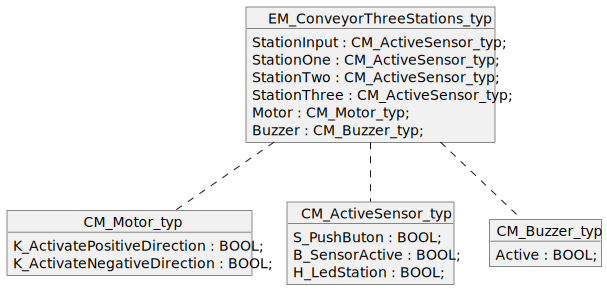

<h1 align="left">
  <br>
  
  <br>
  HEI-Vs Engineering School - Industrial Automation Base
  <br>
</h1>

Cours AutB

Author: [Cédric Lenoir](mailto:cedric.lenoir@hevs.ch)

# MOD 03 Interfaces
## *3ème partie, I/O mapping*

*Keywords:* **TAG HDS SDS**

Die **Zuordnung**, *keine zufriedenstellende französische Übersetzung, aber wir könnten sagen, Verbindungsplan*, der Ein- und Ausgänge ermöglicht es, den Code mit der Hardware zu verknüpfen.

Ein- und Ausgänge werden im Allgemeinen durch eine Eingabeadresse ``I`` oder eine Ausgabe ``Q`` dargestellt.

> Auf der Ebene der Ein- und Ausgänge unterscheiden wir nicht zwischen digital oder analog, da analoge Signale zwangsläufig Wandler durchlaufen. Am häufigsten ein „WORT“ für 12, 14 oder 16 Bit.

Die **Zuordnung** der Ein- und Ausgänge einer SPS hängt oft direkt mit der Art der Hardware zusammen. Das Prinzip kann mehr oder weniger kompliziert sein, ist aber selten trivial, wenn es darum geht, sich mit einer neuen Art von Material vertraut zu machen. Da das Ziel dieses Kurses die Programmierung in **strukturiertem Text** auf SPS-Ebene betrifft, werden wir uns nicht auf einen Begriff konzentrieren, der je nach IDE jedes Herstellers unterschiedlich ist.

Es gibt nie eine **einfache** Karte. Selbst bei einem **Digital In**-Eingangssignal müssen Sie den Spannungspegel überprüfen. am häufigsten ``24 [Vdc]``. Wir können aber auch Spannungen ``48 [Vdc / Vac]`` oder ``230 [Vac]`` finden.

> Für eine **Standard** ``24 [Vdc]``-Karte ist ``Stufe 0`` zwischen ``-3 und 5 [Vdc]`` definiert. Tatsächlich gelingt es einer einfachen digitalen Schaltung mit einer **TTL** *Transistor-Transistor-Logik*-Spannung von 5 [Vdc], siehe 3,3 [Vdc] **nicht, den Logikpegel der Karte umzuschalten!**

## Beispiel für die Zuordnung im SPS-Programm
|Name                 |Type|Logical Address|
|---------------------|----|---------------|
|I1_Pb_Station_1      |BOOL|%I0.0|
|I4_Pb_OutputConveyor |BOOL|%I0.3|
|B1_SensorActive      |BOOL|%I0.4|
|B4_OutputConveyorFree|BOOL|%I0.7|
|I1_MotorCurrent      |WORD|%I4.0|
|H2_LedStation_2      |BOOL|%Q0.1|
|H3_LedStation_3      |BOOL|%Q0.2|
|K1_DirectionOutput	  |BOOL|%Q0.4|
|K2_DirectionH1       |BOOL|%Q0.5|
|C1_SetMotorSpeed     |WORD|%Q6.0|
|HMI_SelectCase       |WORD|%MB0 |

> Die Erwähnung ``%MB`` bezieht sich auf eine interne Registrierung, in diesem Fall zum Erstellen einer Schnittstelle zum **HMI** Human Machine Interface, oder auf einen Begriff, der häufig in französischsprachigen Dokumentationen vorkommt: IHM für Interface Machine Man.

## DS, Designspezifikation
Im Hinblick auf das Projektmanagement vereint der DS im Allgemeinen zwei Arten von Dokumenten, die sich ergänzen und häufig unter derselben Bezeichnung zusammengefasst werden.
**HDS** *Hardware-Design-Spezifikation* und **SDS** *Software-Design-Spezifikation*.
Die Liste der Tags bezieht sich auf Hardware. Im Allgemeinen handelt es sich um die Schnittstelle zwischen der Software und dem **elektrischen Diagramm** des Systems.

> Die meisten professionellen Schaltplanbearbeitungsprogramme sind in der Lage, die für die Verknüpfung zwischen dem Namen des TAGs und der physischen Adresse der Karte erforderlichen Dateien direkt zu generieren. Um es ein wenig zu vereinfachen: Derzeit dominiert ein einzelnes Unternehmen diesen Markt so stark, dass fast alle im Bereich der Elektromontage tätigen Unternehmen die gleiche Software verwenden.

### [Beispiel für Design-Spezifikation](./documentation/DS_TestBenchSpecification.xlsx)

### HDS
Die Hardwarespezifikation fasst beispielsweise in Form einer Tabellenkalkulation *z. B. Excel, ganz zu schweigen von einer Marke* die Liste der Hardware und deren Verbindung zur Software zusammen.
Manchmal finden wir einen Verweis auf den Schaltplan, um die für die Diagnose notwendigen Informationen zu finden.

### Sicherheitsdatenblatt
Die Softwarespezifikation basiert teilweise auf demselben Excel-Dokument und ermöglicht es beispielsweise dem *Programmierer*, die für das Alarmmanagement erforderlichen Informationen zu kennen.
Das **SDS** wird idealerweise ergänzt durch **Objekt- oder Klassendiagramme** „Objekt/Klassendiagramm“, **Aktivitätsdiagramme** „Aktivitätsdiagramm“ und **Zustandsdiagramme* * „Zustandsdiagramm*“

|Tag Name | Type  | Soft Logic Address | Hard Address | Card Type |Device Type |Schematic Ref|
|---------|-------|--------------------|--------------|-----------|-------------|------------|
|I1_Pb_Station_1|BOOL|%I0.0            | C1_S0  |DI 32x24VDC HF_1          |Schneider XB4BA31|Unit01_C23_2|
|I2_Pb_Station_2|BOOL|%I0.1            | C1_S1  |DI 32x24VDC HF_1          |Schneider XB4BA31|Unit01_C27_1|
|K1_DirectionOutput|BOOL|%Q0.1         | C2_S1  |DQ 32x24VDC/0.5A HF_1      |Schneider XB4BVB3|Unit01_D23_7|
|C1_SetMotorSpeed|WORD|%Q6.1           | C3_S4  |AQ 8xU/I HS_1     |Danfoss  131B4268|Unit01_F23_2|
|I1_MotorCurrent|WORD|%I4.0            | C4_S2  |AI 8xU/I/RTD/TC ST_1     |Danfoss  131B4268|Unit01_C23_2|

### Alarme
Ohne ein vollständiges Alarmmanagement und eine vollständige Alarmliste ist ein Automatisierungsprojekt nicht vollständig. In vielen Fällen, **Projekten im medizinischen Bereich**, muss die Liste aller Alarme mit einer eindeutigen Referenz, AlarmID, verfügbar sein. Die obige Tabelle ermöglicht unter anderem die Generierung vollständiger Alarme für den Endbenutzer, die ihm insbesondere Folgendes ermöglichen:
- Um zu wissen, welches Gerät einen Alarm verursacht.
- Wo ist das Gerät angeschlossen, es kann eine Maschine, aber auch eine Fabrik sein.
- Die Referenz jedes mit diesem Alarm verknüpften Geräts, sofern eines davon geändert werden sollte.

|AlaramID|Severity|Label|Level|Tag Name|Schematic Ref|Recovery|
|--------|--------|-----|--------|---------|-------------|--------|
|Un03Em01Id0001|Medium|The motor current is high|> 75[A]|I1_MotorCurrent|Unit01_C23_2|Reduce conveyor speed.|

# Verwendung von „Tags“ auf Programmebene.
In der Vorgeschichte der Automaten wurden Tags manchmal direkt im Programm verwendet```Ladder```.

**In structured Text:**
```iecst
IF I1_Pb_Station_1 THEN
    K1_DirectionOutput := TRUE;
END_IF
```

Oder noch schlimmer, direkt in Form einer Software-Adresse:

```iecst
IF %I0.0 THEN
    %Q0.1 := TRUE;
END_IF
```

oder noch schlimmer, in der Leiter...

Da wir das Mittelalter längst hinter uns haben, werden wir etwas strukturierter vorgehen.

## Regeln
- Die Tags sind so geschrieben, dass sie in zusätzlichen Kommentaren nach Möglichkeit verständlich sind.
- Tags werden nach Möglichkeit nach einer Liste von Regeln geschrieben, die von der Art der Branche abhängen, zum Beispiel [ISA5.1, Instrumentation Symbols and Identification](https://www.isa.org/standards-and-publications/isa -standards/isa-standards-committees/isa5-1). **ISA** für International Society of Automation. Beachten Sie, dass Standardisierungsdokumente selten kostenlos verfügbar sind und meist durch einen Hinweis wie *Copyright © 2009 by ISA* geschützt sind.
- Tags sind in einer Datenstruktur organisiert.
- Die Tags sollten sich leicht vom Kern des Programms entkoppeln lassen, um eine Simulation zu ermöglichen.

## Datenstruktur
Nehmen wir als Beispiel die Ausstattung einer Maschine, einer Förderanlage, bestückt mit verschiedenen Modulen.
|Name                 |Type|Logical Address|
|---------------------|----|---------------|
|S1_Pb_Station_1|BOOL|%I0.0|
|S2_Pb_Station_2|BOOL|%I0.1|
|S3_Pb_Station_3|BOOL|%I0.2|
|S4_Pb_OutputConveyor|BOOL|%I0.3|
|B1_SensorActive|BOOL|%I0.4|
|B2_SensorActive|BOOL|%I0.5|
|B3_SensorActive|BOOL|%I0.6|
|B4_OutputConveyorFree|BOOL|%I0.7|
|H1_LedStation_1|BOOL|%Q0.0|
|H2_LedStation_2|BOOL|%Q0.1|
|H3_LedStation_3|BOOL|%Q0.2|
|H4_LedOutputConveyor|BOOL|%Q0.3|
|K1_DirectionOutput|BOOL|%Q0.4|
|K2_DirectionH1|BOOL|%Q0.5|
|Buzzer|BOOL|%Q0.6|

Der Förderer ist mit verschiedenen Modultypen ausgestattet. Siehe **EM Equipment Module** und **CM Control Module** gemäß **ISA-88**.

### UML-Darstellung des Förderers
Ich bin nicht in der Lage, die Struktur *genau* darzustellen. Auch wenn es ein wenig Verwirrung stiftet, werden zwei Alternativen vorgeschlagen. **Ich bevorzuge das erste**

Die folgende Version sollte als Objekt in der Lage sein, 4 ``CM_ActiveSensor_typ``-Blöcke anzuzeigen, was die Software nicht zulässt.
<figure>
    
    <figcaption>EM_ConveyorThreeStations_typ variante A</figcaption>
</figure>

Die folgende Version als Objekt ``EM_ConveyorThreeStations_typ`` ist korrekt, da die Anzeige der Blöcke ``CM_Motor_typ``, ``CM_ActiveSensor_typ`` und ``CM_Buzzer_typ``, aus denen es besteht, nicht zwingend erforderlich ist. Die gestrichelte Linie bedeutet einfach **Es besteht eine Verbindung**, was richtig ist.
<figure>
    
    <figcaption>EM_ConveyorThreeStations_typ variante A</figcaption>
</figure>

### **C**ontrol **M**odule moteur
```iecst
TYPE CM_Motor_typ
   STRUCT
      K_ActivatePositiveDirection : BOOL;
      K_ActivateNegativeDirection : BOOL;
   END_STRUCT;
END_TYPE
```

### **C**ontrol **M**odule capteur
```iecst
TYPE CM_ActiveSensor_typ
   STRUCT
      S_PushButon    : BOOL;
      B_SensorActive : BOOL;
      H_LedStation   : BOOL;
   END_STRUCT;
END_TYPE
```

### **C**ontrol **M**odule buzzer
```iecst
TYPE CM_Buzzer_typ
   STRUCT
      Active : BOOL;
   END_STRUCT;
END_TYPE
```

### **E**quipement **M**odule convoyeur
Ein Standardförderer ausgestattet mit:
- 1 Motorsteuerung
- 4 Arbeitsplätze
- 1 Signalelement

Die Module sind einfach, in der Praxis werden sie oft deutlich komplexer sein, das Aufbauprinzip bleibt jedoch das gleiche.

```iecst
TYPE EM_ConveyorThreeStations_typ
   STRUCT
      Motor        : CM_Motor_typ;
      StationInput : CM_ActiveSensor_typ;
      StationOne   : CM_ActiveSensor_typ;
      StationTwo   : CM_ActiveSensor_typ;
      StationThree : CM_ActiveSensor_typ;
      Buzzer       : CM_Buzzer_typ;
   END_STRUCT;
END_TYPE
```

### UML-Darstellung des Förderers
Ich bin nicht in der Lage, die Struktur *genau* darzustellen. Auch wenn es ein wenig Verwirrung stiftet, werden zwei Alternativen vorgeschlagen. **Ich bevorzuge das erste**

Die folgende Version sollte als Objekt in der Lage sein, 4 ``CM_ActiveSensor_typ``-Blöcke anzuzeigen, was die Software nicht zulässt.
<figure>
    
    <figcaption>EM_ConveyorThreeStations_typ variante A</figcaption>
</figure>

Die folgende Version als Objekt „EM_ConveyorThreeStations_typ“ ist korrekt, da die Anzeige der Blöcke ``CM_Motor_typ``, ``CM_ActiveSensor_typ`` und ``CM_Buzzer_typ``, aus denen es besteht, nicht zwingend erforderlich ist. Die gestrichelte Linie bedeutet einfach **Es besteht eine Verbindung**, was richtig ist.
<figure>
    
    <figcaption>EM_ConveyorThreeStations_typ variante B</figcaption>
</figure>

### Tags mit dem Förderband verknüpfen
Das Problem mit Tags besteht darin, dass sie nicht strukturiert sind, sondern nur in Listenform vorliegen. Unabhängig davon ist die Verwendung von Tags im Programm nicht erwünscht.

> Prinzip: Wir lesen die Eingabe-Tags, wir führen den Algorithmus aus, wir schreiben die Ausgabe-Tags.
```iecst
VAR GLOBAL
    tagsStructure : EM_ConveyorThreeStations_typ;
    simulateTags  : BOOL;
END_VAR

ReadStationData(simulateTags := simulateTags,
                plcTags := tagsStructure);

PRG_Algorithm();

WriteStationData(simulateTags := simulateTags,
                 plcTags := tagsStructure);
```

> Vorteil: Wenn Sie die Software von der Hardware entkoppeln möchten, aktivieren Sie einfach die Variable ``simulateTags := TRUE``.

#### Bindung von Eingabe-Tags
> Eine ``FUNKTION`` in Structured Text Codesys **MUSS** einen Rückgabetyp haben, auch wenn kein Wert zurückgegeben wird und die Funktion ohne Rückgabetyp verwendet wird, *siehe Verwendung der Funktion unten -unten*.

```iecst
FUNCTION ReadStationData : BOOL
VAR_INPUT 
    Enable : BOOL;   // Set to TRUE to activate function
END_VAR

VAR_IN_OUT 
    plcTags : EM_ConveyorThreeStations_typ;
END_VAR

IF Enable THEN
    plcTags.StationOne.S_PushButon := S1_Pb_Station_1;
    plcTags.StationOne.B_SensorActive := B1_SensorActive;
	    
    plcTags.StationTwo.S_PushButon := S2_Pb_Station_2;
    plcTags.StationTwo.B_SensorActive := B2_SensorActive;
	    
    plcTags.StationThree.S_PushButon := S3_Pb_Station_3;
    plcTags.StationThree.B_SensorActive := B3_SensorActive;
	    
    plcTags.StationInput.S_PushButon := S1_Pb_Station_1;
    plcTags.StationInput.B_SensorActive := B4_OutputConveyorFree;
END_IF;
END_FUNCTION
```

#### Liaison des tags de sortie

```iecst
FUNCTION ReadStationData : BOOL
VAR_INPUT 
    Enable : BOOL;   // Set to TRUE to activate function
END_VAR

VAR_IN_OUT 
    plcTags : EM_ConveyorThreeStations_typ;
END_VAR

IF Enable THEN
    H4_LedOutputConveyor := plcTags.StationInput.H_LedStation;
    H1_LedStation_1 := plcTags.StationOne.H_LedStation;
    H2_LedStation_2 := plcTags.StationTwo.H_LedStation;
    H3_LedStation_3 := plcTags.StationThree.H_LedStation;
    
    K1_DirectionOutput := plcTags.Motor.K_ActivateNegativeDirection;
    K2_DirectionH1 := plcTags.Motor.K_ActivatePositiveDirection;
END_IF;
END_F
```

> Dadurch werden alle Tags an derselben Stelle gruppiert.

> Wenn der Code wiederverwendet werden muss, ist es einfach, die Tags zu ändern, und umgekehrt, wenn nur der Algorithmus geändert werden muss, ändert sich das Lesen und Schreiben der Tags nicht.

Beispiel:

```iecst
VAR
    SelectOtherProgram : BOOL;
END_VAR

ReadStationData(simulateTags := simulateTags,
                plcTags := tagsStructure);

IF NOT SelectOtherProgram THEN
    PRG_Algorithm_One();
ELSE
    PRG_Algorithm_Two();
END_IF

WriteStationData(simulateTags := simulateTags,
                 plcTags := tagsStructure);

```

> Wir können uns vorstellen, dass die Ein- und Ausgänge nicht mehr über die Liste der Tags bereitgestellt werden, sondern beispielsweise über eine ``MODBUS``-Schnittstelle.

```iecst
VAR GLOBAL
    tagsStructure : EM_ConveyorThreeStations_typ;
    simulateTags  : BOOL;
END_VAR

ReadStationDataFromModbus(simulateTags := simulateTags,
                plcTags := tagsStructure);

PRG_Algorithm();

WriteStationDataToModbus(simulateTags := simulateTags,
                 plcTags := tagsStructure);
```

> Alles, was den Code modular und wiederverwendbar macht, wird bevorzugt.

> Der Code wird einfacher zu entwickeln sein, da alle Ein- und Ausgänge einfach in einer Baumstruktur angezeigt werden können, die der der Maschine entspricht.

[Übungen](./MOD_03_Exercices.md)