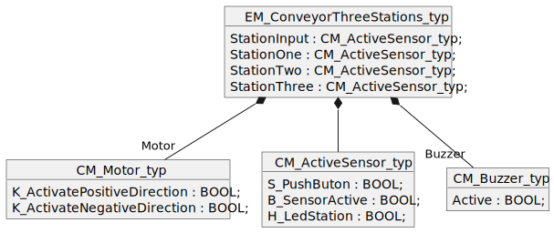

<h1 align="left">
  <br>
  
  <br>
  HEI-Vs Engineering School - Industrial Automation Base
  <br>
</h1>

Cours AutB


Author: [Cédric Lenoir](mailto:cedric.lenoir@hevs.ch)

# MOD 03 Interfaces
## *3ème partie, I/O mapping*

*Keywords:* **TAG HDS SDS**

Le **mapping**, *pas de traduction française satisfaisante, mais on pourrait dire plan de liaison*, des entrées sorties permet de lier le code au hardware.

Les entées et sorties sont en général représentées par une adresse en entrée, ```I``` ou une sortie ```Q```.

> Au niveau des entrées et des sorites, on ne fait pas la différence entre digital ou analogique, puisque les signaux analogiques passent nécessairement par des convertisseurs. Le plus souvent un ```WORD``` pour 12, 14 ou 16 bits.

Le **mapping** des entrées sorties d'un PLC est souvent directement lié au type de matériel. Le principe peut être plus ou moins compliqué, mais rarement trivial quand il s'agit de se familiariser avec un nouveau type de matériel. Dans la mesure où l'objectif de ce cours concerne, au niveau de l'automate, la programmation en **Structured Text**, on ne s'attardera pas à une notion qui varie en fonction de chaque IDE de chaque fabricant.

Il n'y a jamais de **simple** carte. Même pour un signal d'entrée **Digital In**, il faudra vérifier le niveau de tension. le plus souvent ```24 [Vdc]```. Mais on peut aussi trouver des tension ```48 [Vdc / Vac]``` ou ```230 [Vac]```.

> Pour une carte **Standard** ```24 [Vdc]```, le ```niveau 0``` est défini entre ```-3 et 5 [Vdc]```. De fait, un simple circuit digital avec une tension **TTL** *Transistor-Transistor Logic* de 5 [Vdc], voir 3.3 [Vdc] **ne parviendra pas à commuter le niveau logic de la carte !**

## Example de mapping dans le programme PLC
|Name                 |Type|Logical Address|
|---------------------|----|---------------|
|I1_Pb_Station_1      |BOOL|%I0.0|
|I4_Pb_OutputConveyor |BOOL|%I0.3|
|B1_SensorActive      |BOOL|%I0.4|
|B4_OutputConveyorFree|BOOL|%I0.7|
|I1_MotorCurrent      |WORD|%I4.0|
|H2_LedStation_2      |BOOL|%Q0.1|
|H3_LedStation_3      |BOOL|%Q0.2|
|K1_DirectionOutput	  |BOOL|%Q0.4|
|K2_DirectionH1       |BOOL|%Q0.5|
|C1_SetMotorSpeed     |WORD|%Q6.0|
|HMI_SelectCase       |WORD|%MB0 |

> La mention %MB fait référence à un registe interne, dans ce cas de figure, pour créer un interface vers le **HMI** Human Machine Interface, ou un terme que l'on retrouve souvent dans les documentation francophones, IHM pour Interface Homme Machine.

## DS, Design Specification
En termes de gestion de projet, la DS regroupe en général deux types de documents qui sont complémentaires et sont souvent regroupés sous le même label.
**HDS** *Hardware Design Specification* et **SDS** *Software Design Specification*.
La liste des tags fait référence au hardware. De manière générale, elle est l'înterface entre le logiciel et le **schéma électrique** du système.

> La plupart des logiciels professionels d'édition schématique sont capable de générer directement les fichiers nécessaire à la liaison entre le nom du TAG et à l'adresse physique de la carte. Pour simplifier un peu, une seule compagnie domine acutellement à tel point ce marché, que presque toutes les entreprises actives dans le domaine du montage électrique utilisent le même logiciel.

### [Exemple de Design Specification](./documentation/DS_TestBenchSpecification.xlsx) 

### HDS
La spécification du hardware regroupe, par exemple sous forme de feuille de tableur, "*par exemple Excel pour ne pas citer de marque*", la liste du matériel et comment il est raccordé au logiciel.
On retrouvera parfois une référence à la schématique afin de permettre de retrouver les informations nécessaires au diagnostic.

### SDS
La spécification du software se base en partie sur le même document Excel, elle permettra par exemple au *programmeur* de connaître les informations nécessaires à la gestion des alarmes.
La **SDS** est idéalement complétée de **diagrammes d'objet ou de classe** ```Object/Class Diagram```, de **diagrammes d'activité** ```Activity Diagram``` et de **Diagrammes d'état** ```State Diagram*```.

|Tag Name | Type  | Soft Logic Address | Hard Address | Card Type |Device Type |Schematic Ref|
|---------|-------|--------------------|--------------|-----------|-------------|------------|
|I1_Pb_Station_1|BOOL|%I0.0            | C1_S0  |DI 32x24VDC HF_1          |Schneider XB4BA31|Unit01_C23_2|
|I2_Pb_Station_2|BOOL|%I0.1            | C1_S1  |DI 32x24VDC HF_1          |Schneider XB4BA31|Unit01_C27_1|
|K1_DirectionOutput|BOOL|%Q0.1         | C2_S1  |DQ 32x24VDC/0.5A HF_1      |Schneider XB4BVB3|Unit01_D23_7|
|C1_SetMotorSpeed|WORD|%Q6.1           | C3_S4  |AQ 8xU/I HS_1     |Danfoss  131B4268|Unit01_F23_2|
|I1_MotorCurrent|WORD|%I4.0            | C4_S2  |AI 8xU/I/RTD/TC ST_1     |Danfoss  131B4268|Unit01_C23_2|

### Alarmes
Un projet d'automation n'est pas terminé sans une gestion complète des alarmes et une liste complète des alarmes. Dans de nombreux cas, **projets dans le domaine médical**, la liste de toutes les alarmes doit être disponible avec une référence unique, AlarmID. Le tableau ci-dessus permet, entre autre de générer des alarmes complètes pour l'utiliseur final qui lui permettrons notament:
- De savoir quel appareil provoque une alarme.
- Ou est raccordé l'appareil, ce peut être une machine, mais aussi une usine.
- La référence de chaque appareil lié à cette alarmes, dans la mesure où l'un d'eux devrait être changé.

|AlaramID|Severity|Label|Level|Tag Name|Schematic Ref|Recovery|
|--------|--------|-----|--------|---------|-------------|--------|
|Un03Em01Id0001|Medium|The motor current is high|> 75[A]|I1_MotorCurrent|Unit01_C23_2|Reduce conveyor speed.|

# Utilisation des ```tags``` au niveau du programme.
Dans la préhistoire des automates, on utilisait parfois, les tags directement dans le programme en ```Ladder```.
**En structured Text:**
```iecst
IF I1_Pb_Station_1 THEN
    K1_DirectionOutput := TRUE;
END_IF
```

Voir même pire, directement sous forme d'adresse logicielle:

```iecst
IF %I0.0 THEN
    %Q0.1 := TRUE;
END_IF
```

ou encore pire, en ladder...

Comme nous avons largement passé le moyen âge, nous allons travailler de manière un peu plus structurée.

## Règles
- Les tags sont rédigés de telle manière à être, si possible compréhensibles dans commentaires additionnels.
- Les tags sont si possible rédigés selon une liste de règles qui dépendent du type d'industrie, par exemple [ISA5.1, Instrumentation Symbols and Identification](https://www.isa.org/standards-and-publications/isa-standards/isa-standards-committees/isa5-1). **ISA** pour International Socity of Automation. On notera que les documents de standardisation sont rarement en libra accès et le plus souvent protégés par une mention du type *Copyright © 2009 by ISA*.
- Les tags sont organisés dans une structure de donnée.
- Les tags devraient pouvoir être découplés facilement du coeur du programme afin de permettre une simulation.

## Structure de donnée
Si l'on prend l'exemple de l'équipement d'un machine, un convoyeur, équipés de différents modules.
|Name                 |Type|Logical Address|
|---------------------|----|---------------|
|S1_Pb_Station_1|BOOL|%I0.0|
|S2_Pb_Station_2|BOOL|%I0.1|
|S3_Pb_Station_3|BOOL|%I0.2|
|S4_Pb_OutputConveyor|BOOL|%I0.3|
|B1_SensorActive|BOOL|%I0.4|
|B2_SensorActive|BOOL|%I0.5|
|B3_SensorActive|BOOL|%I0.6|
|B4_OutputConveyorFree|BOOL|%I0.7|
|H1_LedStation_1|BOOL|%Q0.0|
|H2_LedStation_2|BOOL|%Q0.1|
|H3_LedStation_3|BOOL|%Q0.2|
|H4_LedOutputConveyor|BOOL|%Q0.3|
|K1_DirectionOutput|BOOL|%Q0.4|
|K2_DirectionH1|BOOL|%Q0.5|
|Buzzer|BOOL|%Q0.6|

Le convoyeur est équipés de différents type de modules. Voir **EM Equipment Module** et **CM Control Module** selon **ISA-88**.

### Représentation UML du convoyeur
Je n'ai pas la possibilité de représenter *exactement* une représentation de la structure. Quitte à porter un peu à confusion, deux alternatives sont proposées. **Je préfère la première**

La version ci-dessous, en tant qu'objet, devrait pouvoir afficher 4 blocs ```CM_ActiveSensor_typ```, ce que le logiciel ne permet pas.
<figure>
    
    <figcaption>EM_ConveyorThreeStations_typ variante A</figcaption>
</figure>

La version ci-dessous, en tant qu'objet ```EM_ConveyorThreeStations_typ``` est correcte, car l'affichage des blocs ``CM_Motor_typ``, ``CM_ActiveSensor_typ`` et ``CM_Buzzer_typ`` qui le composent n'est pas obligatoire. Le traitillé signifie simplement **Un certain lien existe**, ce qui est correct.
<figure>
    
    <figcaption>EM_ConveyorThreeStations_typ variante A</figcaption>
</figure>

### **C**ontrol **M**odule moteur
```iecst
TYPE CM_Motor_typ
   STRUCT
      K_ActivatePositiveDirection : BOOL;
      K_ActivateNegativeDirection : BOOL;
   END_STRUCT;
END_TYPE
```

### **C**ontrol **M**odule capteur
```iecst
TYPE CM_ActiveSensor_typ
   STRUCT
      S_PushButon    : BOOL;
      B_SensorActive : BOOL;
      H_LedStation   : BOOL;
   END_STRUCT;
END_TYPE
```

### **C**ontrol **M**odule buzzer
```iecst
TYPE CM_Buzzer_typ
   STRUCT
      Active : BOOL;
   END_STRUCT;
END_TYPE
```

### **E**quipement **M**odule convoyeur
Un convoyeur standard et équipé de:
- 1 commande de moteur
- 4 stations de travail
- 1 élément de signalisation

Les modules sont simples, dans la pratique, ils seront souvent nettement plus complexes, mais le principe de structure reste le même.

```iecst
TYPE EM_ConveyorThreeStations_typ
   STRUCT
      Motor        : CM_Motor_typ;
      StationInput : CM_ActiveSensor_typ;
      StationOne   : CM_ActiveSensor_typ;
      StationTwo   : CM_ActiveSensor_typ;
      StationThree : CM_ActiveSensor_typ;
      Buzzer       : CM_Buzzer_typ;
   END_STRUCT;
END_TYPE
```

### Représentation UML du convoyeur
Je n'ai pas la possibilité de représenter *exactement* une représentation de la structure. Quitte à porter un peu à confusion, deux alternatives sont proposées. **Je préfère la première**

La version ci-dessous, en tant qu'objet, devrait pouvoir afficher 4 blocs ```CM_ActiveSensor_typ```, ce que le logiciel ne permet pas.
<figure>
    
    <figcaption>EM_ConveyorThreeStations_typ variante A</figcaption>
</figure>

La version ci-dessous, en tant qu'objet ```EM_ConveyorThreeStations_typ``` est correcte, car l'affichage des blocs ``CM_Motor_typ``, ``CM_ActiveSensor_typ`` et ``CM_Buzzer_typ`` qui le composent n'est pas obligatoire. Le traitillé signifie simplement **Un certain lien existe**, ce qui est correct.
<figure>
    
    <figcaption>EM_ConveyorThreeStations_typ variante B</figcaption>
</figure>


### Liaison des tags au convoyeur
Le problème avec les tags, c'est qu'ils ne sont pas structurés, ils existent uniquemet sous forme de liste. Quoi qu'il en soit, l'utilisation des tags dans le programme n'est pas souhaité.

> Principe, on lit les tags d'entrée, on exécute l'algorithme, on écrit les tags de sortie.
```iecst
VAR GLOBAL
    tagsStructure : EM_ConveyorThreeStations_typ;
    simulateTags  : BOOL;
END_VAR

ReadStationData(simulateTags := simulateTags,
                plcTags := tagsStructure);

PRG_Algorithm();

WriteStationData(simulateTags := simulateTags,
                 plcTags := tagsStructure);
```

> Avantage: si on veut découpler le software du hardware, il suffit d'activer la variable ``simulateTags := TRUE``.

#### Liaison des tags d'entrée
> Une ```FUNCTION``` en Structured Text Codesys **DOIT** avoir un type de retour, même si aucune valeur n'est renvoyée et que la fonction est utilisée sans type de retour, *voir utilisation de la fonction ci-dessous*.

```iecst
FUNCTION ReadStationData : BOOL
VAR_INPUT 
    Enable : BOOL;   // Set to TRUE to activate function
END_VAR

VAR_IN_OUT 
    plcTags : EM_ConveyorThreeStations_typ;
END_VAR

IF Enable THEN
    plcTags.StationOne.S_PushButon := S1_Pb_Station_1;
    plcTags.StationOne.B_SensorActive := B1_SensorActive;
	    
    plcTags.StationTwo.S_PushButon := S2_Pb_Station_2;
    plcTags.StationTwo.B_SensorActive := B2_SensorActive;
	    
    plcTags.StationThree.S_PushButon := S3_Pb_Station_3;
    plcTags.StationThree.B_SensorActive := B3_SensorActive;
	    
    plcTags.StationInput.S_PushButon := S1_Pb_Station_1;
    plcTags.StationInput.B_SensorActive := B4_OutputConveyorFree;
END_IF;
END_FUNCTION
```

#### Liaison des tags de sortie

```iecst
FUNCTION ReadStationData : BOOL
VAR_INPUT 
    Enable : BOOL;   // Set to TRUE to activate function
END_VAR

VAR_IN_OUT 
    plcTags : EM_ConveyorThreeStations_typ;
END_VAR

IF Enable THEN
    H4_LedOutputConveyor := plcTags.StationInput.H_LedStation;
    H1_LedStation_1 := plcTags.StationOne.H_LedStation;
    H2_LedStation_2 := plcTags.StationTwo.H_LedStation;
    H3_LedStation_3 := plcTags.StationThree.H_LedStation;
    
    K1_DirectionOutput := plcTags.Motor.K_ActivateNegativeDirection;
    K2_DirectionH1 := plcTags.Motor.K_ActivatePositiveDirection;
END_IF;
END_F
```

> Ainsi, l'ensemble des tags sont regroupés au même endroit.

> Si le code doit être réutilisé, il est simple de modifier les tags, et inversément, si uniquement l'algorithme doit être modifié, la lecture et écriture des tags ne change pas.

Exemple:

```iecst
VAR
    SelectOtherProgram : BOOL;
END_VAR

ReadStationData(simulateTags := simulateTags,
                plcTags := tagsStructure);

IF NOT SelectOtherProgram THEN
    PRG_Algorithm_One();
ELSE
    PRG_Algorithm_Two();
END_IF

WriteStationData(simulateTags := simulateTags,
                 plcTags := tagsStructure);

```

> On peut immaginer que les entrées et sorties ne soient plus fournis par la liste des tags, mais par exemple via un interface ``MODBUS``.

```iecst
VAR GLOBAL
    tagsStructure : EM_ConveyorThreeStations_typ;
    simulateTags  : BOOL;
END_VAR

ReadStationDataFromModbus(simulateTags := simulateTags,
                plcTags := tagsStructure);

PRG_Algorithm();

WriteStationDataToModbus(simulateTags := simulateTags,
                 plcTags := tagsStructure);
```

> Tous ce qui permet de rendre un code modulaire et réutilisable est à privilégier.

> Le code sera plus facile à développer car il sera possible de visuliser simplement l'ensemble des entrées et des sorties sur une structure en arborescence qui correspond à celle de la machine.

[Exercices](./MOD_03_Exercices.md)