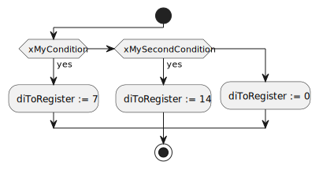
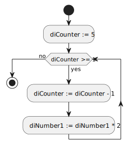
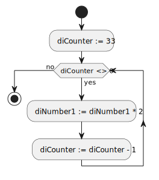
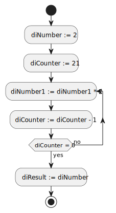
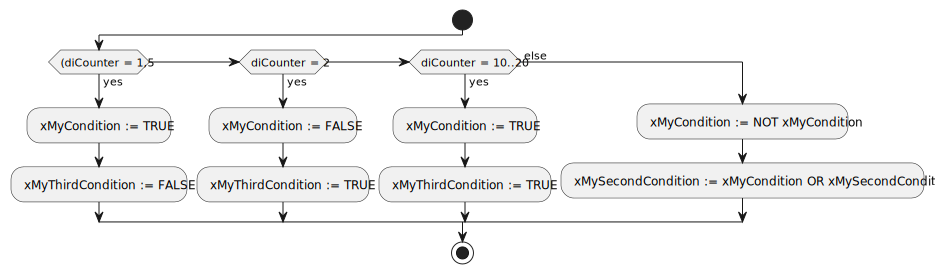
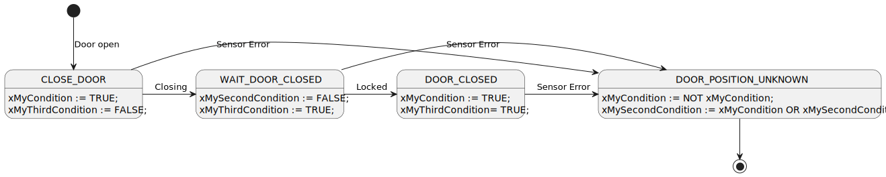

<h1 align="left">
  <br>
  
  <br>
  Industrial Automation Base
  <br>
</h1>

Cours AutB

Author: [Cédric Lenoir](mailto:cedric.lenoir@hevs.ch)

*Keywords:* **IF ELSE FOR WHILE REPEAT CASE**

# Module 03 Operations and Instructions

# Les opérations de base
|Operation        |Symbol              |Niveau de priorité              |
|-----------------|--------------------|--------------------------------|
|Parenthèse       |(*expression*)      |**Maximum**                     |
|Exposant         |EXPT                |                                |
|Négation         |NOT                 |                                |
|Multiplication, Division, Modulo|*, /, MOD|                            |
|Addition, Soustraction|+,-            |                                |
|Comparaison      |<,>,<=,>=           |                                |
|Egal à, non égal à|=,<>               |                                |
|Boolean ET       |AND                 |                                |
|Boolean XOR      |XOR                 |                                |
|Boolean OU       |OR                  |**Minimum**                     |

# Les instructions de base
## Instruction ```IF...ELSIF...ELSE```
L’instruction ```IF```
```iecst
IF <Condition> THEN
   <Instruction>
```
sert à tester une condition.

L’instruction ```ELSIF```
```iecst
ELSIF <Anoter Condition> THEN
   <Instruction>
```
optionnel est exécutée si ``IF`` est faux avec une nouvelle condition.

L’instruction ```ELSE``` *optionnelle et sans condition*
```iecst
ELSE
   <Instruction>
```
est exécutée uniquement si les conditions précédentes sont fausses.

Les instructions ``IF`` et ``ELSIF`` se terminent obligatoirement par
```iecst
END_IF
```

Si cela n'est pas le cas, le compilateur refusera de terminer le travail.

> Le compilateur refuse une instruction ``IF`` ou ``ELSIF`` vide. Mais un simple ```;``` suffira.
```iecst 
IF xMyCondition THEN
    // Erreur de compilation
END_IF

IF xMyCondition THEN
    // Compilation acceptée
    ;
END_IF
```

Plusieurs instructions ``ELSIF`` sont possibles, mais cela est déconseillé au niveau de la qualité de programmation, dans ce cas, mieux vaut utiliser une instruction ``CASE``.

L’instruction ``ELSE`` est exécutée si toutes les conditions précédentes sont fausses. Elle est conseillée, l’absence du `ELSE` est considérée comme un oubli du programmeur, quitte à insérer un commentaire.
Le point-virgule
 
On notera ci-dessous que le code se termine sans ``;``, c’est le style **Codesys**, en **SCL Siemens**, il ne faudra pas l’oublier.
```iecst 
(*
    Example of Instruction IF 
*)
IF xMyCondition THEN
   // The first statement is mandatory
   diToRegister := 7;
ELSIF xMySecondCondition THEN
   // ELSIF is optional
   // A statement after ELSIF is mandatory
   diToRegister := 14;
ELSE
   // The ELSE statement is desirable as a coding rule
   diToRegister := 0;
END_IF
```
### Activity diagram for instruction ```IF...ELSIF...ELSE```
<figure>
    
    <figcaption>If Elsif Else Instruction</figcaption>
</figure>

> Le langage Structured Text admet deux types de commentaires. ``//`` commentaire en début de ligne ou ``(* commentaire *)`` avant et après le commentaire.

```iecst  
//
// Second Example of Instruction IF 
//
IF xMyCondition THEN
   // The first statement is mandatory
   dToRegister := 7;
ELSE
   // Do nothing
   ;
END_IF
``` 
 
> On évitera d’écrire:
```iecst  
IF xMyCondition = TRUE THEN
...
```

> Mais on préférera
```iecst  
IF xMyCondition THEN
```  
 
> Dans le cas où la condition doit être fausse, on écrira
```iecst   
IF NOT xMyCondition THEN
```

## Instruction FOR
La boucle ```FOR``` exécute un nombre défini de répétitions.
L’instruction ```BY``` qui définit l’incrément est facultative. Si ```BY``` n’est pas défini, la valeur de l’incrément est 1.
Si la valeur finale, ici 5 est plus grande que la taille maximale du type, on obtient une boucle infinie !

```iecst  
(*
   Example of Instruction FOR 
*)
FOR diCounter := 5 TO 1 BY -1 DO
   // At least on statement is expected, it can be a comment
   diNumber1 := diNumber1 * 2;
END_FOR
``` 
### Diagramme d'activité de l'instruction ```FOR```
<figure>
    
    <figcaption>For Loop Instruction</figcaption>
</figure>

> **Attention !**
Les programmes cycliques n’aiment pas les boucles. Donc si vous devez initialiser un tableau de 2000 valeurs posez-vous la question de savoir si cela tient dans votre cyclique de position à 400 microsecondes. Au pire, à une valeur par cycle, cela prendra 0.8 secondes.
Une autre alternative sera de déplacer les grosses boucles dans des tâches plus lentes avec une faible priorité.

En Siemens, il est par exemple possible d’utiliser un OB80 qui est appelé automatiquement lorsque le temps de cycle est dépassé pour la première fois, pour, par exemple, casser une boucle.

### Robustesse et ```FOR```
Il existe quelques règles à respecter pour garantir la robustesse d'une boucle ```FOR```.
```iecst
PROGRAM PRG_ForLoop
VAR
    rTrucLoop    : REAL := 10;
    iLoopVar     : INT;
    iLastLoopVar : INT;
END_VAR

VAR CONSTANT 
    I_END_OF_LOOP : INT := 32;
END_VAR

rTrucLoop := 10;
FOR iLoopVar := 0 TO I_END_OF_LOOP BY 5 DO
    iLastLoopVar := iLoopVar;
    rTrucLoop := rTrucLoop / 2;
END_FOR
```
> Si possible la valeur finale, ici ```I_END_OF_LOOP``` est définie sous forme de constante.

> Le compilateur **interdit** l'utilisation d'un réel pour la boucle.

> Le compilateur autorise l'écriture sur les variable de boucle, ici ```iLoopVar```. Les deux autres étant des constantes. **C'est à éviter absolument !**

> Dans le code ci-dessus, le fait que la valeur ```I_END_OF_LOOP``` ne soit pas atteinte exactement, ne pose aucun problème au compilateur. Il utilise un comparateur ```iLoopVar <= I_END_OF_LOOP```, pour continuer la boucle, ce qui rend le système plus robuste qu'une égalité.

## Instruction ```WHILE...DO```
Une instruction WHILE est exécutée **tant que** une condition n’est pas remplie.
- Si la condition de départ est initialement fausse, le bloc interne n’est jamais exécuté.
- Si la condition est toujours vraie, il y a une boucle infinie est l’automate se plante.

```iecst 
PROGRAM PRG_Ex_WHILE
VAR
    diNumber1 : DINT;
    diCounter : DINT;
END_VAR

diCounter := 33;
WHILE diCounter <> 0 DO
    diNumber1 := diNumber1 * 2;
    diCounter := diCounter - 1;
END_WHILE
```

> L'exemple ci-dessus comporte un risque. Si la condition exacte n'est jamais atteinte ```diCounter = 0```, on risque une **boucle infinie**. On préférera une inégalité du type ```<=``` ou ```>=```, voir ```<``` ou ```>```. *L'affirmation précédente est encore plus critique pour les nombre réels*.

### Diagramme d'activité ```WHILE...DO```
<figure>
    
    <figcaption>Activity diagram for WHILE..DO </figcaption>
</figure> 
 
## Instruction ```REPEAT...UNTIL```
L’instruction REPEAT est exécutée à nouveau tant qu’une condition est vraie.
Quelle que soit la condition de répétition, le bloc interne sera exécuté au minimum une fois.

```iecst
PROGRAM PRG_Ex_REPEAT
VAR
    diNumber  : DINT;
    diCounter : DINT;
    diResult  : DINT;
END_VAR

diNumber  := 2;
diCounter := 21;
REPEAT
    diNumber := diNumber * 2;
    diCounter := diCounter - 1;
UNTIL
    diCounter = 0
END_REPEAT

diResult := diNumber;
```
> L'instruction ```REPEAT...UNTIL``` avec une égalité ```=``` est **dangereuse**. Si la condition exacte n'est jamais atteinte, on risque une **boucle infinie**. On préférera une inégalité du type ```<=``` ou ```>=```, voir ```<``` ou ```>```.

### Diagramme d'activité ```REPEAT...UNTIL```
<figure>
    
    <figcaption>Activity diagram for REPEAT</figcaption>
</figure> 

## Instruction RETURN
Permet de sortir immédiatement d’un bloc d’instruction.
**Ne pas utiliser**. *Sauf exception*.
### Exception
L’exception, porte ici bien son nom. Un cas typique pourrait être celui où il faut absolument sortir de la boucle car on détecte une boucle trop longue qui provoque justement une exception. Cette exception générée par le système d’exploitation nécessite une intervention immédiate pour éviter un arrêt du programme.

## Instruction JMP
Permet un saut immédiat et inconditionnel à une ligne de programme identifiée par un label.
> Ne pas utiliser.

# State Machine

## Instruction ```CASE..OF```
Autant le dire d’emblée, l’instruction CASE est l’instruction que je privilégie.
L’instruction est définie ici de manière basique, elle sera reprise un peu plus loin avec une énumération

### ```CASE``` vu comme un diagramme d'activité.

```iecst
//
// Example of Instruction CASE
// 
CASE diCounter OF 
1, 5:   xMyCondition := TRUE; 
        xMyThirdCondition := FALSE; 
2:      xMySecondCondition := FALSE; 
        xMyThirdCondition := TRUE; 
10..20: xMyCondition := TRUE; 
        xMyThirdCondition= TRUE; 
ELSE 
        xMyCondition := NOT xMyCondition; 
        xMySecondCondition := xMyCondition OR xMySecondCondition; 
END_CASE
``` 
 
Le **CASE** propose d’exécuter un bloc d’instruction, et un seul, parmi n à chaque cycle en fonction de la valeur de n.
Dans l’exemple ci-dessus, les bloques respectifs seront exécutés si diCounter vaut :
- 1 ou 5,
- 2
- De 10 à 20
- ou autre.
> L’ordre des chiffres n’a strictement aucune importance.

Comme pour le cas de **IF**, le **ELSE** peut être omis, mais ce sera considéré comme une mauvaise programmation (A moins que tous les cas soient traités à l'aide d'énumérations)

### Diagramme d'activité de type ```CASE..OF```

<figure>
    
    <figcaption>Instructions Case vue comme un diagramme d'activité</figcaption>
</figure>


> Utiliser un ```CASE..OF``` **avec des nombres est une mauvaise pratique** de programmation. On utilisera des ```ENUM```. Dans le cas particulier de Siemens TIA Portal qui ne supporte pas les énumération, on utilisera des constantes.

### ```CASE..OF``` vu comme une machine d'état.
> Dans le cadre de ce cours, c'est principalement ce modèle qui nous intéresse.

Nous reviendrons sur le ```TYPE``` enum plus loin dans le cours. Ce qu'il est important de retenir, c'est que: ```ELSE``` **n'est pas nécessaire, puisque dans le type défini, il ne devrait pas exister formellement d'autres valeurs que celles qui sont définies.**
 
```iecst 
TYPE EN_DOOR :
(
	CLOSE_DOOR := 99,
	WAIT_DOOR_CLOSED := 10,
	DOOR_CLOSED := 20,
	DOOR_POSITION_UNKNOWN := 30
);
END_TYPE
```

```iecst
VAR
    doorState : EN_DOOR;
END_VAR

(*
   Example of Instruction CASE
*) 
CASE doorState OF 
CLOSE_DOOR:    
      xMyCondition := TRUE; 
      xMyThirdCondition := FALSE; 
WAIT_DOOR_CLOSED:
      xMySecondCondition := FALSE; 
      xMyThirdCondition := TRUE; 
DOOR_CLOSED:
      xMyCondition := TRUE; 
      xMyThirdCondition= TRUE; 
DOOR_POSITION_UNKNOWN:
      xMyCondition := NOT xMyCondition; 
      xMySecondCondition := xMyCondition OR xMySecondCondition; 
END_CASE
```
### Notes à propos du ```CASE..OF```
- Dans le cas de la machine d'état avec un ```Enum```, il n'y a pas d'état indéterminé.
- Le ```ELSE``` dans une machine d'état est une mauvaise pratique, cela signifie que l'on ne connait pas l'état de la machine.
- Les transitions dans le graphique ont été ajoutées, elles devraient être programmées dans ```CASE..OF ci-dessus```

### Diagramme d'activité du ```CASE..OF```

<figure>
    
    <figcaption>Il n'y a pas de condition ELSE dans une machine d'état !</figcaption>
</figure>

> Imaginez que votre machine d'état serve à l'autopilote d'un avion, que fait-on en cas d'état indéterminé ? **L'actionneur du siège éjectable est aussi un état !**

# Exercices / technique de codage
## Exercice 1, ```WHILE...DO```
Ecrire un bout de code qui compte combien de fois il faut multiplier la variables ```x := 6``` par ```a``` pour obtenir la première valeur supérieure à ```Y := 788```.
- Utiliser uniquement des ```INT```
- Utiliser une boucle ```WHILE```.
- Afficher le resultat à l'aide de la variable ```Result```

[Solution Exercice 1](#solution-exercice-1-whiledo)

## Exercie 2. ```REPEAT...UNTIL```
Dans le cas du code donné dans l'exemple ci-dessus, que ce passe-t-il si on remplace ```diCounter := diCounter - 1;``` par un décrément de 2, ```diCounter := diCounter - 2;``` ?

> Réfléchir au problème et ne pas tester.

```iecst
PROGRAM PRG_Ex_REPEAT
VAR
    diNumber  : DINT;
    diCounter : DINT;
    diResult  : DINT;
END_VAR

diNumber  := 2;
diCounter := 21;
REPEAT
    diNumber := diNumber * 2;
    diCounter := diCounter - 1;
UNTIL
    diCounter = 0
END_REPEAT;

diResult := diNumber;
```
[Solution Exercice 2](#solution-exercie-2-repeatuntil)

## Exercice 3, ```For``` avec décrément
Donner la valeur après la boucle de la variable: ```diNumber1```
```iecst
(*
   Example of Instruction FOR 
*)
diNumber1 := 1;
FOR diCounter := 5 TO 1 BY -1 DO
   // At least on statement is expected, it can be a comment
   diNumber1 := diNumber1 * 2;
END_FOR;
```
[Solution Exercice 3](#solution-exercice-3-for-avec-décrément)

## Exercice 4, ```FOR``` avec incrément
Quelle sera la valeur de la variable ```iLastLoopVar``` à la fin de l'exécution du code suivant:
```iecst
PROGRAM PRG_ForLoop
VAR
    rTrucLoop    : REAL := 10;
    iLoopVar     : INT;
    iLastLoopVar : INT;
END_VAR

VAR CONSTANT 
    I_END_OF_LOOP : INT := 32;
END_VAR

rTrucLoop := 10;
FOR iLoopVar := 0 TO I_END_OF_LOOP BY 5 DO
    iLastLoopVar := iLoopVar;
    rTrucLoop := rTrucLoop / 2;
END_FOR
```
[Solution Exercice 4](#solution-exercice-4-for-avec-incrément)

## Exercice 5 (MOD)
### rédaction pas terminée, ne pas faire...
In computing, the modulo operation returns the remainder or signed remainder of a division, after one number is divided by another (called the modulus of the operation).
Ecrire une boucle REPEAT pour compter combien de fois on peut diviser la variable N par le nombre D. Retourner la valeur Q et le reste R. Ne pas utiliser de division ni de multiplications.

## Exercice 6 MULT
### rédaction pas terminée, ne pas faire...
Utiliser une boucle ```FOR``` pour exécuter la multiplication de ```Y := A x X``` sans utiliser de multiplication ni de division.

## Exercice 7 SQRT
### rédaction pas terminée, ne pas faire...
Calculer SQRT uniquement avec des opérations de base.

## Exercice 8, Feux de circulation à 4 états

<figure>
    
    <figcaption>State Diagram: 4-state traffic lights.svg</figcaption>
</figure>

En utilisant les variables ci-dessous:
-   Définir le type Enum pour la machine d'état.
-   Coder la machine d'état en utilisant les conditions d'entrée.
-   Coder les sorties.

```iecst
VAR_INPUT
    bConditionEnable    : BOOL;
    bConditionRedOrange : BOOL;
    bConditionGreen     : BOOL;
    bConditionOrange    : BOOL;
    bConditionRed
END_VAR    
VAR_OUTPUT
    bLightRed           : BOOL;
    bLightGreen         : BOOL;
    bLightOrange        : BOOL;
END_VAR
VAR
    eStateMachine       : E_StateMachine_typ;
END_VAR
```
> Pour être strict, la machine d'état ci-dessus n'est pas complète. On devrait anticiper le cas ou le système n'est plus activé, par exemple pour éviter un feu vert à l'enclanchement, voici une version compléte:

<figure>
    
    <figcaption>State Diagram: 4-state traffic lights complete</figcaption>
</figure>

[Solution Exercice 8](#solution-exercice-8-feux-de-circulation-à-4-états)

## Exercice 9, Feu de circulation à 4 états, erreur.
On reprend les données de l'[exercice 8, Feu de circulation à 4 états](#exercice-8-feux-de-circulation-à-4-états).

En cas de disfonctionnement du système signalé par une entrée ``bError``, on veut que le feu orange clignote.
Pour ceci, on dispose d'un ``FB_Blink`` qui fournit une sortie ``Q`` avec fréquence de 90 battements par minute.

> On préféra un état ``Warning`` ou ``Alarm``. Si le disfonctionnement est prévu, ce n'est pas une erreur. Une erreur serait le cas où le système de signalisation ne fonctionne pas, ce qui n'est pas acceptable !

> On suppose qu'en cas d'erreur, le système devra être désactivé avant de pouvoir redémarrer.

Compléter le code.

[Solution Exercice 9](#solution-exercice-9-feux-de-circulation-à-4-états-erreur)

## Notes de rédaction

*Quelque part je veux ce truc*
1.7	C Source Code: Lagrange Interpolation

https://www.codesansar.com/numerical-methods/lagrange-interpolation-method-using-c-programming.htm

# Solutions exercices

## Solution Exercice 1, ```WHILE...DO```
```iecst
PROGRAM PRG_Ex1_Base
VAR
    x      : INT := 6;
    a      : INT;
    Y      : INT := 788;
    Result : INT;
END_VAR

a := 0;
WHILE (a * x) < Y DO
    a := a + 1;
END_WHILE

Result := a;    // Result is 792
```
## Solution Exercie 2. ```REPEAT...UNTIL```
<figure>
    
    <figcaption>Boucle infinie, risque de Crash :(</figcaption>
</figure> 

## Solution Exercice 3, ```For``` avec décrément
> La valeur de ```diNumber``` est de ```3```
La variable ```diCounter``` prend successivement les valeurs ```5```, ```3``` et ```1```

## Solution Exercice 4, ```FOR``` avec incrément
> iLastLoopVar = 30.

## Solution Exercice 5
Pas terminé... ne pas faire.

## Solution Exercice 6
Pas terminé... ne pas faire.

## Solution Exercice 7
Pas terminé... ne pas faire.

## Solution Exercice 8, Feux de circulation à 4 états

Type definition of state machine
```iecst
// The values of states can be modified.
// The values of states can be omitted, but they are recommended
TYPE E_StateMachine_typ :
(
    Idle       := 99,
    Red        := 10,
    Red_Orange := 20,
    Green      := 30,
    Orange     := 40
) := Idle;
END_TYPE
```

Code
```iecst
CASE eStateMachine OF
    Idle       :
        IF bConditionComplete THEN
            eStateMachine := E_StateMachine_typ.Red;
        END_IF
    Red        :
        IF NOT bConditionComplete THEN
            eStateMachine := E_StateMachine_typ.Idle;
        ELSIF bConditionRedOrange THEN
            eStateMachine := E_StateMachine_typ.Red_Orange;
        END_IF    
    Red_Orange :
        IF NOT bConditionComplete THEN
            eStateMachine := E_StateMachine_typ.Idle;
        ELSIF bConditionGreen THEN
            eStateMachine := E_StateMachine_typ.Green;
        END_IF    
    Green      :
        IF NOT bConditionComplete THEN
            eStateMachine := E_StateMachine_typ.Idle;
        ELSIF bConditionOrange THEN
            eStateMachine := E_StateMachine_typ.Orange;
        END_IF    
    Orange     :
        IF NOT bConditionComplete THEN
            eStateMachine := E_StateMachine_typ.Idle;
        ELSIF bConditionRed THEN
            eStateMachine := E_StateMachine_typ.Red;
        END_IF    
END_CASE

bLightRed    :=  (eStateMachine = E_StateMachine_typ.Red) OR
                 (eStateMachine = E_StateMachine_typ.Red_Orange);

bLightGreen  :=  (eStateMachine = E_StateMachine_typ.Green);

bLightOrange := (eStateMachine = E_StateMachine_typ.Orange) OR
                (eStateMachine = E_StateMachine_typ.Red_Orange);

```

## Solution Exercice 9, Feux de circulation à 4 états, erreur

### Complet 

La machine d'état complète peux vite s'avérer complexe, en apparence.

<figure>
    
    <figcaption>State Diagram: 4-state traffic lights complete</figcaption>
</figure>

Cependant, si l'on se réfère au code PUML utilisé pour générer le diagramme, le nombre de transitions parait déjà plus simple:

```

[*] --> Idle
Idle --> Red : bConditionEnable
Red --> Red_Orange : bConditionRedOrange
Red_Orange --> Green : bConditionGreeen
Green --> Orange : bConditionOrange
Orange -->  Red : bConditionRed

Idle --> Warning : bError
Red --> Warning : bError
Red_Orange --> Warning : bError
Green --> Warning : bError
Orange -->  Warning : bError

Red --> Idle: NOT bConditionRedOrange
Red_Orange --> Idle : NOT bConditionGreeen
Green --> Idle : NOT bConditionOrange
Orange -->  Idle : NOT bConditionRed
Warning --> Idle : NOT bConditionRed

```

### Partiel
On pourrait aussi utiliser une version partielle:
<figure>
    
    <figcaption>State Diagram: 4-state traffic lights error partial</figcaption>
</figure>

### Groupé

Ou représenter les états sous forme groupés:
<figure>
    
    <figcaption>State Diagram: 4-state traffic lights error variant</figcaption>
</figure>


### Pour aller un peu plus loin que le cadre de ce cours
Dans la pratique, pour un système complet, une machine sera décomposée en différents états de fonctionnement, dans l'exemple ci-dessous, le système pourrait être décomposé en trois états : **Aborted**, **Suspended** et **Execute**. Les conditions de passage d'un état à l'autre sont très clairement définies et un seul état de la machine est actif à la fois.

<figure>
    
    <figcaption>State Diagram: 4-state traffic lights error a possible solution</figcaption>
</figure>

[Voir par exemple PackML](https://www.omac.org/packml), mais le sujet sort un peu du cadre de ce cours.

Dans le cadre de ce chapitre, c'est le [modèle complet](#complet) qui est utilisé.

> Même si le model complet est un peu plus long à rédiger, il est le plus strict et potentiellement le plus robuste car il permet de valider tous les cas de figure sans exception.

Type definition of state machine with Warning
```iecst
// The values of states can be modified.
// The values of states can be omitted, but they are recommended
TYPE E_StateMachine_typ :
(
    Idle       := 99,
    Red        := 10,
    Red_Orange := 20,
    Green      := 30,
    Orange     := 40,
    Warning    := 50
) := Idle;
END_TYPE
```
Variables with ``bError`` and ``fbBlink``.
```iecst
VAR_INPUT
    bError              : BOOL;
    bConditionEnable    : BOOL;
    bConditionRedOrange : BOOL;
    bConditionGreen     : BOOL;
    bConditionOrange    : BOOL;
    bConditionRed
END_VAR    
VAR_OUTPUT
    bLightRed           : BOOL;
    bLightGreen         : BOOL;
    bLightOrange        : BOOL;
END_VAR
VAR
    eStateMachine       : E_StateMachine_typ;
    fbBlink             : FB_Blink;
END_VAR
```

Code with warning
```iecst
CASE eStateMachine OF
    Idle       :
        IF bConditionComplete THEN
            eStateMachine := E_StateMachine_typ.Red;
        END_IF
    Red        :
        IF NOT bConditionComplete THEN
            eStateMachine := E_StateMachine_typ.Idle;
        ELSIF bError THEN
            eStateMachine := E_StateMachine_typ.Warning;
        ELSIF bConditionRedOrange THEN
            eStateMachine := E_StateMachine_typ.Red_Orange;
        END_IF    
    Red_Orange :
        IF NOT bConditionComplete THEN
            eStateMachine := E_StateMachine_typ.Idle;
        ELSIF bError THEN
            eStateMachine := E_StateMachine_typ.Warning;
        ELSIF bConditionGreen THEN
            eStateMachine := E_StateMachine_typ.Green;
        END_IF    
    Green      :
        IF NOT bConditionComplete THEN
            eStateMachine := E_StateMachine_typ.Idle;
        ELSIF bError THEN
            eStateMachine := E_StateMachine_typ.Warning;
        ELSIF bConditionOrange THEN
            eStateMachine := E_StateMachine_typ.Orange;
        END_IF    
    Orange     :
        IF NOT bConditionComplete THEN
            eStateMachine := E_StateMachine_typ.Idle;
        ELSIF bError THEN
            eStateMachine := E_StateMachine_typ.Warning;
        ELSIF bConditionRed THEN
            eStateMachine := E_StateMachine_typ.Red;
        END_IF  
    Warning    :
        IF NOT bConditionComplete THEN
            eStateMachine := E_StateMachine_typ.Idle;
        END_IF  
END_CASE

fbBlink();

bLightRed    :=  (eStateMachine = E_StateMachine_typ.Red) OR
                 (eStateMachine = E_StateMachine_typ.Red_Orange);

bLightGreen  :=  (eStateMachine = E_StateMachine_typ.Green);

bLightOrange := (eStateMachine = E_StateMachine_typ.Orange) OR
                (eStateMachine = E_StateMachine_typ.Red_Orange) OR
                (eStateMachine = E_StateMachine_typ.Warning) AND bLightRed.Q;

```