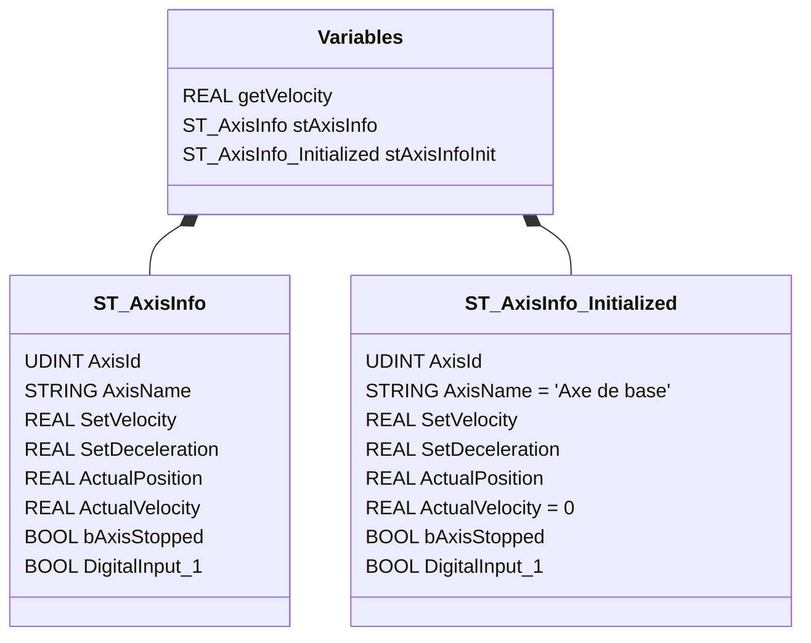

```mermaid
classDiagram
    class ST_AxisInfo {
        UDINT AxisId
        STRING AxisName
        REAL SetVelocity
        REAL SetDeceleration
        REAL ActualPosition
        REAL ActualVelocity
        BOOL bAxisStopped
        BOOL DigitalInput_1
    }

    class ST_AxisInfo_Initialized {
        UDINT AxisId
        STRING AxisName = 'Axe de base'
        REAL SetVelocity
        REAL SetDeceleration
        REAL ActualPosition
        REAL ActualVelocity = 0
        BOOL bAxisStopped
        BOOL DigitalInput_1
    }

    class Variables {
        REAL getVelocity
        ST_AxisInfo stAxisInfo
        ST_AxisInfo_Initialized stAxisInfoInit
    }

    Variables *-- ST_AxisInfo
    Variables *-- ST_AxisInfo_Initialized    

```