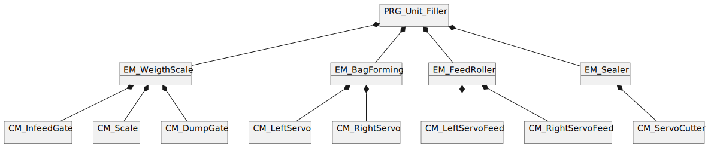
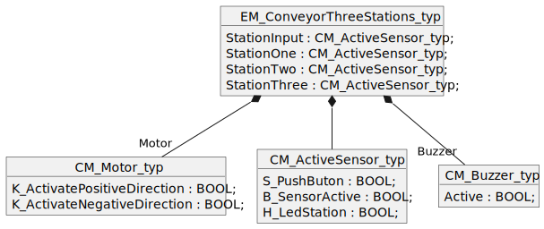

<h1 align="left">
  <br>
  
  <br>
  Industrial Automation Base
  <br>
</h1>

Cours AutB

Author: [Cédric Lenoir](mailto:cedric.lenoir@hevs.ch)

# Module 04 Program Oranization Unit

En langage IEC 61131-3, les unité de programmation ou Program Organisation Units, POU, sont au nombre de trois.

-   Le bloc fonctionnel ou **Function Block FB**
-   La fonction ou **Function, FC**,
-   Le programme, ou **Program PRG**.

# Reference à ISA-88
La référence à ISA-88 n'est pas le sujet de ce cours, mais, comme dans d'autres chapitres, elle est utilisée pour replacer ce cours dans son contexte de système industriel. Ci-dessous, une unité pour le remplissage de sacs. Si dans le module consacré aux interfaces, nous nous étions intéressé à la **structure** des données, le **Function Block** va servir à donner un **comportement** à cette structure.

<figure>
    
    <figcaption>Remplissage de futs, Image Burgener AG</figcaption>
</figure>

> L'image de la machine de Burger AG à Viège est à titre d'illustration, elle n'utilise pas la même technologie que celle décrite ci-dessous. Par contre, sur le plan ISA-88, c'est une unité. **Unit**. 

<figure>
    
    <figcaption>Vertical Filler Automated Machines using the ISA 88 Models</figcaption>
</figure>

<figure>
    
    <figcaption>Unit Vertical Filler</figcaption>
</figure>

> Ce qu'il faut retenir: la machine illustrée ci-dessus doit remplir plusieurs critères pour être mise sur le marché. Pour que l'ingénieur puisse travailler, il va falloir que quelqu'un puisse la vendre à un tarif acceptable pour faire vivre l'ingénieur qui l'a construite.

>   L'organisation du code en Function Block va améliorer sa réutilisabilité et faire baisser les coûts de développement de différentes variantes de la machine.

> La machine doit pouvoir être vendue dans le secteur alimentaire ou médical qui exige le respect de normes strictes, exigées par exemple par la FDA, U.S. Food and Drug Administration. Le respect de ces normes passe par la démonstration de **bonne pratiques de fabrication**. En d'autres termes: **l'ingénieur doit être capable de démontrer qu'il a travaillé selon les règles de l'art !**.

> L'expérience montre que quand un projet ne fonctionne pas, c'est beaucoup plus souvent un problème de spécification que de qualité technique de l'ingénieur. En modélisant votre partie logicielle **avant** de passer au codage, vous pourrez faire valider votre concept sans devoir recommancer trois fois votre travail.

# Function Block
Le Function Block est l’élément de base de la programmation d’automate, il est l’équivalent de la **classe**, ou l’**objet** en C++. C’est lui qui permet une programmation structurée et modulaire.

Le principe est de ne pas réécrire plusieurs fois le même code.

La structure du **Function Block** en IEC 61131-3 correspond aux applications PLC/hardware avec une séparation claire des entrées et des sorties.

- Des variables d'entrée.
- Des variables de sortie.
- Des variables mémorisées en interne.
- Un algorithme.

## Ecriture d'un Function Block

```iecst
FUNCTION_BLOCK FB_CheckFunctionBlock
VAR_INPUT
    diNewValue       : BOOL;    (* Input Clock of a Function Block *)
    bReset           : BOOL;    (* Reset Memory *)
END_VAR
VAR_OUTPUT
    Q                : BOOL;    (* Output of the Function Block *)
END_VAR
VAR
    diInternalMemory : DINT;    (* Value to store value to next call*)
END_VAR

(*
   Algorithm of the Function Block
*)
IF diInternalMemory > diNewValue THEN
    Q := TRUE;
ELSE
    Q := FALSE;
END_IF

IF bReset THEN
    diInternalMemory := 0;
END_IF

diInternalMemory := diNewValue;
```

> Ce sont les ``variables internes`` qui différentient une simple fonction, ``Function`` d'un ``Function Block``.

C'est cette variable interne, ci-dessus ``diInternalMemory``, qui fait la différence. Sans cette variable interne, il ne serait pas possible de savoir si la nouvelle valeur est supérieure à l'ancienne. C'est la raison pour laquelle, pour pouvoir être utilisé, un ``Function Block`` doit être ``instancié``.

> **Instancier** un Function Block consiste à lui attribuer un espace mémoire qui lui permet de stocker ses variables internes. Une **classe** devient un **objet**.

> Un Function Block **n'existe pas tant qu'il n'a pas été instancié**, il ne possède aucune mémoire propre.

> Un Function Block **ne fait rien tant que son instance n'est pas exécutée** dans le corps d'un Program.

> *Un Function Block peut être instancié dans un autre Function Block, dans ce cas, il existera quand le Function Block qui le contient sera instancié*.

Certains compilateur incluent des extensions à IEC 61131-3 qui incluent les notions de ``VAR_TEMP``, ``VAR_STAT`` et d'autres. Nous ne les utiliserons pas dans ce cours.

## Instanciation et déclaration d'un Function Block

```iecst
PROGRAM PRG_CALL_A_FB
VAR
    fbCheckOne  : FB_CheckFunctionBlock;
    fbCheckTwi  : FB_CheckFunctionBlock;
    diTestOne   : DINT;
    diTestTwo   : DINT;
    bReset      : BOOL;
    bAnd        : BOOL;
    bAnyBool    : BOOL;
END_VAR

(*
   Code implementation.
*)
    fbCheckOne.diNewValue := diTestOne;
    fbCheckOne.bReset := bReset;

    fbCheckOne();
    fbCheckTwo(diNewValue := diTestOne,
               bReset := bReset);

    bAnd := AND_OUT(IN1 := fbCheckOne.Q,
                    IN2 := fbCheckTwo.Q);
```

> De l'extrait de code ci-cessus, on obtient que pour qu'un ``Function Block `` soit valablement implémenté, il faut:

-   Une implémentation.
-   Une instance.
-   Un appel au ``Function Block``.

> De l'implémentation ci-dessus, on relèvera que les paramètres d'entrée et de sortie ne sont pas nécessessairement intégrés dans les parenthèses de l'appel.

## Utilisation des entrées et sorties d'un Function Block

Il peuvent être séparés, comme dans :

```iecst
    fbCheckOne.diNewValue := diTestOne;
    fbCheckOne.bReset := bReset;

    fbCheckOne();

    ... fbCheckOne.Q;
```

Ou intégrés dans la parenthèse :

```iecst
    fbCheckTwo(diNewValue := diTestOne,
               bReset := bReset
               Q => bAnyBool);
```

On notera donc que la fonction, **Function** ``ADD`` est utilisée telle qu'elle dans le code, alors que le **Function Block** ``FB_CheckFunctionBlock`` n'apparait jamais sous sa forme générique dans le code, mais uniquement sous sa forme instanciée.

> On utilise souvent les deux premières lettre du Function Block en minuscule pour nommer les instances d'un FB. La **classe** ``FB_CheckFunctionBlock`` devient l'**objet** ``fbCheckOne``.

```iecst
    fbCheckOne  : FB_CheckFunctionBlock;
```
### Coding rules
Faire précéder le nom de la fonction du préfixe ``FB_``
En alternative, comme pour les fonctions de Motion Control, on peut faire précéder un groupe de blocs fonctionnels d’un préfixe commun ``MC_``

## Le Function Block dans la logique ISA-88
Nous reprenons la représentation ISA-88 pour la représentation logicielle du Unit Vertical Filler. A l'aide des Function Block, il devient aisé de représenter la structure du programme de la machine.

<figure>
    
    <figcaption>Structure of Program for Unit Vertical Filler</figcaption>
</figure>

Nous avons un programme PRG_Unit_Filler qui implémente l'unité qui contient quatre Function Block que nous écrivons avec le préfixe ``EM_`` pour **Equipment Module**.

Chaque équipement qui exécute une action est constitué d'un certain nombre de Function Block avec le préfixe ``CM_`` qui pilotent des **Control Module**.
```iecst
PROGRAM PRG_UNIT_FILLER
VAR
    emWeigthScale   : EM_WeigthScale;
    emBagForming    : EM_BagForming;
    emFeedRoller    : EM_FeedRoller;
    emSealer        : EM_Sealer;
    ...
END_VAR
```

# Function

Un exemple de l'implémentation de la fonction ``FC_MY_ADD`` qui additionne deux nombres pourrait être:

## Ecriture d'un fonction, Function.

```iecst
FUNCTION  FC_MY_ADD : DINT
VAR_INPUT
    IN1 :   DINT;
    IN2 :   DINT;
END_VAR

FC_MY_ADD := IN1 + IN2;
```

On le voit dans le code ci-dessus, la **fonction n'a pas de mémoire interne statique**. On peut donc donner la définition suivante:

-   Une ``Function`` est un ``Function Block`` **sans mémoire interne statique**.
-   Il ne faut pas instancier une ``Function``, on l'utilise telle qu'elle.

> Pour des entrées identiques, une fonction devrait **toujours** retourner le même résultat. Cela implique que l'utilisation de variable globales, ``VAR_GLOBAL`` est à proscrire.

### Coding rules
Faire précéder le nom de la fonction du préfixe ``F_`` ou ``FC_``.

## Appel d'une fonction, Function.

```iecst
PROGRAM PRG_SOME_ADD
VAR
    diTestOne   : DINT := 1;
    diTestTwo   : DINT := 2;
    diResult    : DINT;
END_VAR

(*
   Code implementation.
*)
// In this example, diResult := 3
diResult := FC_MY_ADD(diTestOne, diTestTwo);
```

## Fonction avec sorties supplémentaire
Sur le model du Function Block, il est possible d'ajouter des sorties supplémentaires à une fonction.
```iecst
FUNCTION FC_AddSubMult : DINT
VAR_INPUT
    InputOne    :   DINT;
    InputTwo    :   DINT;
END_VAR
VAR_OUTPUT
    Adder       :   DINT;
    Subtractor  :   DINT;
    Multiplier  :   DINT;
END_VAR

// Code
Adder := InputOne + InputTwo;
Subtractor := InputOne - InputTwo;
Multiplier := InputOne * InputTwo;
// In this case, the function does not return anything, that means 0.
```

### Appel avec sorties supplémentaires
```iecst
FC_AddSubMult(InputOne := 11,
              InputTwo := 6,
              Adder => ResultsAdder,
              Subtractor => ResultsSubtractor,
              Multiplier => ResultsMultiplier);  
```

## Subtilité du compilateur
**Selon que les valeurs d'entrée soient initialisée, ou pas**, le compilateur imposera que la ou les entrée(s) soi(en)t codée(s) lors de l'appel.

### Exemple
```iecst
FUNCTION FC_ZeroInputIsOk : DINT
VAR_INPUT
    InputOne    :   DINT := 6;
    InputTwo    :   DINT := 3;
END_VAR

// use of the function
myResult := FC_ZeroInputIsOk();     // Accepted by the compiler
```
### Mais
```iecst
FUNCTION FC_NeedTwoInputs : DINT
VAR_INPUT
    InputOne    :   DINT;
    InputTwo    :   DINT;
END_VAR

// use of the function
myResult := FC_NeedTwoInputs();     // The compiler raise an error !!!
```

# Programme, ou Program
Un programme est un Function Block dont **il n'existe qu'une et une seule instance par défaut**.
-   Il ne faut pas l'instancier, *ou de manière plus générale*:
-   On ne peut pas instancier un programme.

-   Un programme peut fonctionner de manière autonome à l’intérieur d’une tâche.

-   Un programme pourrait être appelé par plusieurs tâches. Je n’ai pas de cas d’utilisation concret.

-   Un programme peut être appelé par un ou plusieurs autres programmes. Il s’agit principalement d’une méthode d’organisation.
-   Il est possible de passer des paramètres en entrée et en sortie d'un programme.
-   Un programme contient un espace mémoire propre.

## Coding rules
Faire précéder le nom du programme du préfixe PRG_
```iecst
PRG_MANAGE_INPUT
PRG_STATE_MACHINE
PRG_WRITE_RESULTS
```
## Ordre d'exécution des programmes
Un environnement basé sur Codesys permet de déplacer les programmes dans la tâche afin de gérer leur ordre d’exécution. **Ce n'est pas une bonne solution !**

<figure>
    
    <figcaption>Solution Explorer Codesys style IDE</figcaption>
</figure>

### Conseil
Utiliser un programme MAIN ou PRG_MAIN qui appelle séquentiellement les programmes dans l’ordre nécessaire. **Un ordre modifié par inadvertance dans l'IDE peut complètement modifier le comportement du système**.
```iecst
PROGRAM PRG_MAIN
VAR
    iLoop : INT;
END_VAR

// Code
iLoop := iLoop + 1;
PRG_A_MAIN();
PRG_Z_MAIN();
```

## Temps de cycle du programme (ou de la tâche)
La première décision est celle liée à la vitesse de traitement, le temps de cycle.

Des processus nécessitant des temps de cycle différents nécessitent obligatoirement des programmes différents.

Idéalement, il est beaucoup plus simple de travailler avec une seule tâche cyclique. Il sera souvent moins coûteux de mettre un peu de ressources pour un automate plus puissant que de passer plusieurs jours de travail pour optimiser le système avec des tâches travaillant sur différents temps de cycle.

Le prix d’un automate performant correspond environ à une journée de travail pour un ingénieur.

## Méthode de travail ou d'implémentation.
Ce paragraphe n'est pas une contrainte technique, mais uniquement une bonne pratique basée sur l'expérience.

-   Il est souvent plus compliqué de gérer l'implémentation d'un ``Function Block`` une fois qu'il est encaspulé dans une instance.

-   Finalement, un ``Function Block ``n'est qu'un programme destiné ensuite à être instancié plusieurs fois.

-   Décomposer son code en plusieurs programmes est déjà une bonne idée en soi.
-   Le principe pourrait être: créer un ``Function Block`` à partir d'un programme qui mérite ou nécessite d'être répété.

# VAR_IN_OUT

Le descripteur de variable ``VAR_IN_OUT ``est un outil puissant et particulièrement utile pour la robustesse d'un Function Block ou d'un Function.

## En Python
En python, en principe, le problème n'existe pas vraiment dans la mesure ou tout est objet et que tout objet est passé en paramètre.

### Cependant, ou néanmoins !!
Ce que ne vérifie pas Python, c'est la validité de l'object passé en paramètre. Ce qui serait compliqué, puisque Python permet de modifier dynamiquement à peu près n'importe quoi, n'importe ou dans le code.

Le descripteur VAR_IN_OUT vérifie plusieurs choses.

> Premièrement, il vérifie qu'**un objet soit passé en paramètre**.

> Deuxièmement, il vérifie que l'objet passé en paramètre soit **du même type** que celui défini au moment de la définition du bloc.

> Cela à l'inconvénient d'un certain manque de souplesse, cela représente l'avantage de la robustesse.

### Utilisation
Reprenons l'exemple vu lors du traitement des interfaces:
<figure>
    
    <figcaption>EM_ConveyorThreeStations_typ variante A</figcaption>
</figure>

Ici, nous avons un total de 15 tags pour le convoyeur, et c'est un système simplifié. Dans la vrai vie, nous aurons parfois des structures de données de plusieurs centaines de tags.

Supposons que nous voulions utiliser cette structure pour simuler la machine afin que le codeur puisse simuler le comportement de la machine alors qu'elle n'est pas construite.

Nous décidons d'utiliser un Function Block pour simuler les valeurs de cette structure.
Un Function Block avec une centaine de valeurs, n'est pas réaliste. Nous allons donc passer l'entier de la structure en paramètre avec le type de variable VAR_IN_OUT.

#### Declaration ``VAR_IN_OUT``

```iecst
FUNCTION_BLOCK FB_ConveyorSimulator
VAR_INPUT
    Enable      : BOOL;   
VAR_END
VAR_IN_OUT
    myConveyor  : EM_ConveyorThreeStations_typ;
END_VAR
VAR_OUTPUT
    InOperation : BOOL;
END_VAR

// Use of myConveyor in the code
myConveyor.StationOne.S_PushButton := TRUE;
timer := myConveyor.Motor.K:ActivatePositiveDirection;
```

#### Pass parameter for ``VAR_IN_OUT``
```iecst
PROGRAM PRG_Simulator
VAR
     SetSimulator           : BOOL;
     SetSimulator           : EM_ConveyorThreeStations_typ;
     fbConveyorSimulatorOne : FB_ConveyorSimulator;
EN_VAR

// Code
fbConveyorSimulatorOne(Enable := SetSimulator,
                       myConveyor := ConveyorOne);
```

#### Notes sur l'utilisation de ```VAR_IN_OUT```
Une variable de type ``VAR_IN_OUT`` **ne possède aucune mémoire propre**. Elle utilise la mémoire réservée par la strucuture passée en paramètre. Ci-dessus : ``SetSimulator``.

Le Function Block travaille directement sur la mémoire réservée pour ``SetSimulator``.

C'est la raison pour laquelle une variable de type ``VAR_IN_OUT`` **doit toujours être passée en paramètre à l'intérieur de la parenthèse** d'appel de la fonction. Cette fonction du compilateur interdit de travailler sur une mémoire vide comme le permettent certains autres langages. **C'est un gage de robustesse**.

Cela permet, comme nous le verrons avec les Function Block de type Motion Control, à plusieurs Function Block de se partager le même espace mémoire. Ce qui n'est pas vraiment un problème, vu que le système cyclique fait que plusieurs blocs ne travaillerons en principe jamais en même temps sur la même structure.

> Il est possible avec la plupart des compilateurs actuels de travailler directement avec des adresse et des pointeurs. Ceci principalement pour des aspects pratiques quand le langage IEC 61131-3 doit communiquer avec des portions de code écrites dans d'autres langages. **Néanmoins VAR_IN_OUT reste la solution la plus simple et la plus robuste pour passer des structures en paramètres**.

# Namespace
En français, Opérateurs d'espace de nommage, on utiliser le terme anglais dans la suite du cours.

Les Namespace sont une extension des opérateurs IEC 61131-3. Ils offrent des options pour rendre unique l'accès aux variables ou aux modules, même si vous utilisez plusieurs fois le même nom de variable ou de module dans le projet.

<figure>
    
    <figcaption>Exemple de listes de variables globales</figcaption>
</figure>

Dans l'exemple ci-dessus, on a déclaré quatre listes de variables globales.
-   Le nom et l'emplacement du répertoire, **GVLs** est libre, c'est une question d'organisation sans impact sur le code.
-   Le préfixe **GVL_** est libre. L'avantage, c'est que grâce à l'intellisense, de l'IDE, il sera facile de retrouver les différentes listes lors du codage.
-   Le **nom de la liste constitue le namespace**.

## Namespace pour les listes de variables globales

L'opérateur est une extension de la norme CEI 61131-3.

Vous pouvez utiliser le nom d'une liste de variables globales (GVL) comme identifiant d'espace de noms pour les variables définies dans la liste. Cela permet d'utiliser des variables portant les mêmes noms dans différentes listes de variables globales tout en accédant de manière unique à une variable particulière. Le nom de la variable doit être précédé du nom de la liste de variables globales, séparé par un point.

Syntaxe : <nom de la liste de variables globales>.<variable>

### Déclaration dans la liste GVL_Config
```iecst
VAR_GLOBAL
	// In seconds the duration between each aquisition (From Modbus source)
	timeSampleModbus_s				                : ULINT := 5;
	// Number of samples (timeSamples_s) used for mean to historian
	numberOfSamplesForAverageToHistorian			: ULINT := 12;
	// In seconds the duration between two write to Historian
	timeSampleHistorian_s				            : ULINT;
	// IP Addresses of Homog Masterpackt
	ipAddressHomogMasterpackt_61	: STRING(15)	:= '169.254.249.61';
END_VAR
```
### Utlisation dans le code
```iecst
    myVar := GVL_Config.timeSampleModbus_s;
    useThisIp := GVL_Config.ipAddressHomogMasterpackt_61;
    myNewVar := GVL_Simul.timeSampleModbus_s;

    myOtherVar := timeSampleModbus_s;
```
Dans l'exemple ci-dessus, on pourra utilser la variable ``timeSampleModbus_s`` qui sera différente selon le contexte ``GVL_Config`` ou ``GVL_Simul``.
-   La dernière ligne proquera une erreur lors de la compilation !

[Exercices](POU_Exercices.md)

[Exemples de structure de Program Organisation Unit, **Layout**](POU_Layout.md)