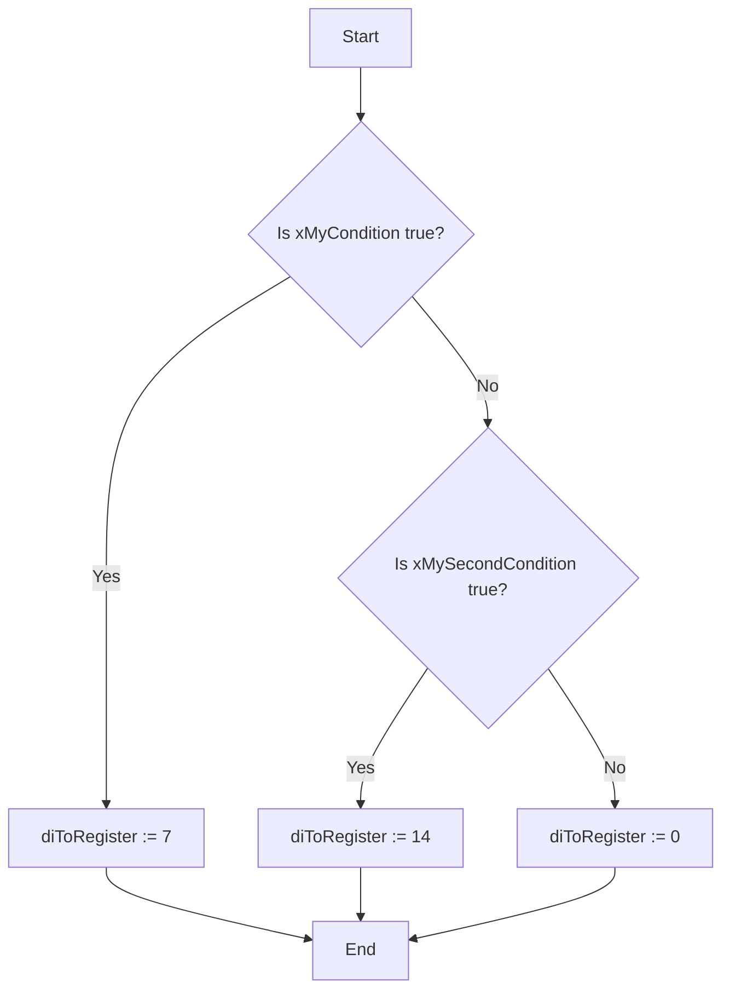
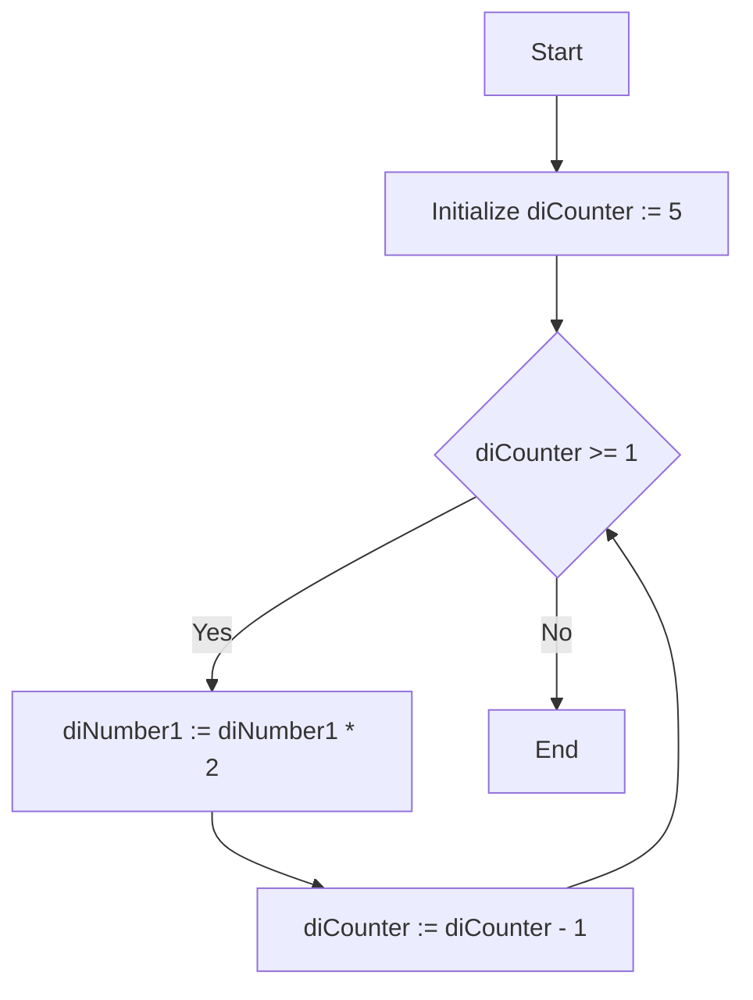
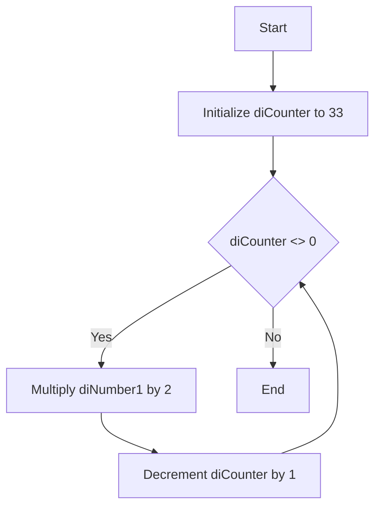
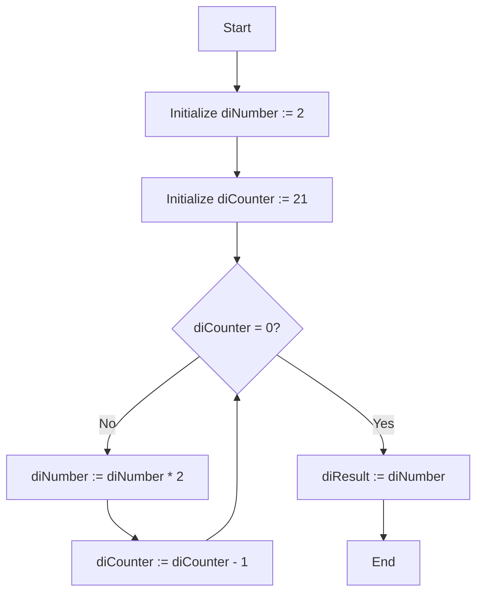
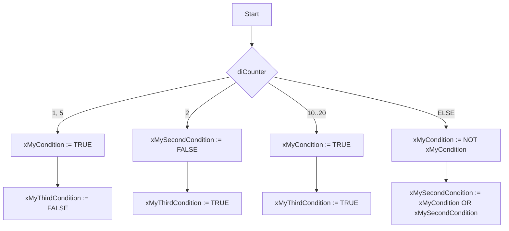
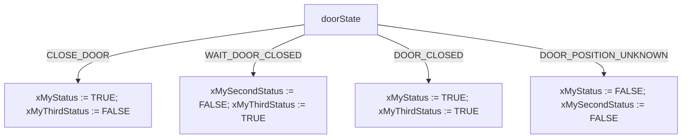
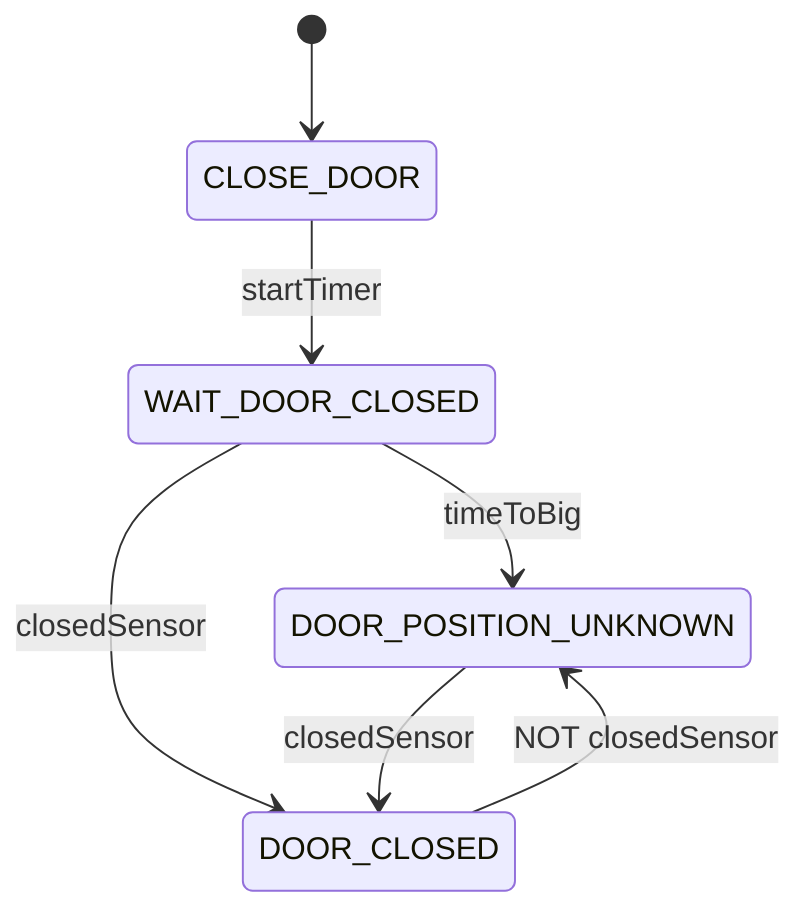

<h1 align="left">
  <br>
  
  <br>
  Industrial Automation Base
  <br>
</h1>

Cours AutB

Author: [Cédric Lenoir](mailto:cedric.lenoir@hevs.ch)

*Keywords:* **IF ELSE FOR WHILE REPEAT CASE**

# Modul 03 Operationen und Anweisungen

# Grundoperationen
|Betrieb          |Symbol              |Prioritätsstufe |
|-----------------|--------------------|--------------------------------|
|Parenthèse       |(*expression*)      |**Maximum**                     |
|Exposant         |EXPT                |                                |
|Négation         |NOT                 |                                |
|Multiplication, Division, Modulo|*, /, MOD|                            |
|Addition, Soustraction|+,-            |                                |
|Comparaison      |<,>,<=,>=           |                                |
|Egal à, non égal à|=,<>               |                                |
|Boolean ET       |AND                 |                                |
|Boolean XOR      |XOR                 |                                |
|Boolean OU       |OR                  |**Minimum**                     |

# Grundlegende Anweisungen
## Anweisung ```IF...ELSIF...ELSE```
Die ``IF`` Anweisung
```iecst
IF <Condition> THEN
   <Instruction>
```
wird verwendet, um eine Bedingung zu testen.

Die ```ELSIF``` v
```iecst
ELSIF <Anoter Condition> THEN
   <Instruction>
```
optional wird ausgeführt, wenn ``IF`` mit einer neuen Bedingung falsch ist.

Die *optionale und bedingungslose* Anweisung ``ELSE``.
```iecst
ELSE
   <Instruction>
```
wird nur ausgeführt, wenn die vorherigen Bedingungen falsch sind.

Die Anweisungen ``IF`` und ``ELSIF`` müssen mit enden
```iecst
END_IF
```

Si cela n'est pas le cas, le compilateur refusera de terminer le travail.

> Le compilateur refuse une instruction ``IF`` ou ``ELSIF`` vide. Mais un simple ```;``` suffira.

```iecst 
IF xMyCondition THEN
    // Erreur de compilation
END_IF

IF xMyCondition THEN
    // Compilation acceptée
    ;
END_IF
```

Mehrere ``ELSIF``-Anweisungen sind möglich, dies ist jedoch im Hinblick auf die Programmierqualität nicht zu empfehlen, in diesem Fall ist es besser, eine ``CASE``-Anweisung zu verwenden.

Die ``ELSE``-Anweisung wird ausgeführt, wenn alle vorherigen Bedingungen falsch sind. Es wird empfohlen, das Fehlen von ``ELSE`` als Versehen des Programmierers zu betrachten, auch wenn dies das Einfügen eines Kommentars bedeutet.
Das Semikolon
 
Beachten Sie unten, dass der Code ohne ``;`` endet., das ist der **Codesys**-Stil, in **SCL Siemens**, das dürfen wir nicht vergessen.
```iecst 
(*
    Example of Instruction IF 
*)
IF xMyCondition THEN
   // The first statement is mandatory
   diToRegister := 7;
ELSIF xMySecondCondition THEN
   // ELSIF is optional
   // A statement after ELSIF is mandatory
   diToRegister := 14;
ELSE
   // The ELSE statement is desirable as a coding rule
   diToRegister := 0;
END_IF
```
### Activity diagram for instruction ```IF...ELSIF...ELSE```


> Die Sprache des strukturierten Texts ermöglicht zwei Arten von Kommentaren. ``//`` *Kommentar* am Zeilenanfang oder ``(* Kommentar *)`` vor und nach dem Kommentar.

```iecst  
//
// Second Example of Instruction IF 
//
IF xMyCondition THEN
   // The first statement is mandatory
   dToRegister := 7;
ELSE
   // Do nothing
   ;
END_IF
``` 
 
> Wir werden das Schreiben vermeiden:
```iecst  
IF xMyCondition = TRUE THEN
...
```

> Aber wir würden es vorziehen
```iecst  
IF xMyCondition THEN
```  
 
> Für den Fall, dass die Bedingung falsch sein muss, schreiben wir
```iecst   
IF NOT xMyCondition THEN
```

## Instruction FOR
Die ``FOR``-Schleife führt eine definierte Anzahl von Wiederholungen aus.
Die ``BY``-Anweisung, die das Inkrement definiert, ist optional. Wenn ``BY`` nicht definiert ist, beträgt der Inkrementwert 1.
Ist der Endwert, hier 5, größer als die maximale Größe des Typs, erhalten wir eine Endlosschleife!

```iecst  
(*
   Example of Instruction FOR 
*)
FOR diCounter := 5 TO 1 BY -1 DO
   // At least on statement is expected, it can be a comment
   diNumber1 := diNumber1 * 2;
END_FOR
``` 
### Aktivitätsdiagramm der Anweisung ```FOR```


> **Achtung!**
Zyklische Programme mögen keine Schleifen. Wenn Sie also ein Array mit 2000 Werten initialisieren müssen, fragen Sie sich, ob dies in Ihren Positionszyklus bei 400 Mikrosekunden passt. Im schlimmsten Fall dauert es bei einem Wert pro Zyklus 0,8 Sekunden.
Eine andere Alternative besteht darin, große Schleifen auf langsamere Aufgaben mit niedriger Priorität zu verschieben.

Bei Siemens ist es beispielsweise möglich, einen OB80 zu verwenden, der beim ersten Überschreiten der Zykluszeit automatisch aufgerufen wird, um beispielsweise eine Schleife zu unterbrechen.

### Robustheit und```FOR```
Um die Robustheit einer ``FOR``-Schleife zu gewährleisten, sind einige Regeln zu beachten.
```iecst
PROGRAM PRG_ForLoop
VAR
    rTrucLoop    : REAL := 10;
    iLoopVar     : INT;
    iLastLoopVar : INT;
END_VAR

VAR CONSTANT 
    I_END_OF_LOOP : INT := 32;
END_VAR

rTrucLoop := 10;
FOR iLoopVar := 0 TO I_END_OF_LOOP BY 5 DO
    iLastLoopVar := iLoopVar;
    rTrucLoop := rTrucLoop / 2;
END_FOR
```
>Wenn möglich, wird der Endwert, hier ``I_END_OF_LOOP`` als Konstante definiert.

> Der Compiler **verbietet** die Verwendung einer reellen Zahl für die Schleife.

> Der Compiler erlaubt das Schreiben auf Schleifenvariablen, hier ``iLoopVar``. Die anderen beiden sind Konstanten. **Dies sollte unbedingt vermieden werden!**

> Im obigen Code stellt die Tatsache, dass der Wert ``I_END_OF_LOOP`` nicht genau erreicht wird, für den Compiler kein Problem dar. Es verwendet einen Komparator ``iLoopVar <= I_END_OF_LOOP``, um die Schleife fortzusetzen, was das System robuster macht als ein Unentschieden.

### ```WHILE...DO```-Anweisung
Eine WHILE-Anweisung wird ausgeführt, **bis** eine Bedingung erfüllt ist.

- Wenn die Startbedingung zunächst falsch ist, wird der interne Block nie ausgeführt.
- Wenn die Bedingung immer wahr ist, kommt es zu einer Endlosschleife und der Automat stürzt ab.

```iecst 
PROGRAM PRG_Ex_WHILE
VAR
    diNumber1 : DINT;
    diCounter : DINT;
END_VAR

diCounter := 33;
WHILE diCounter <> 0 DO
    diNumber1 := diNumber1 * 2;
    diCounter := diCounter - 1;
END_WHILE
```

> Das obige Beispiel birgt ein Risiko. Wenn die exakte Bedingung „diCounter = 0“ nie erreicht wird, riskieren wir eine **Endlosschleife**. Wir bevorzugen eine Ungleichung vom Typ ```<=``` oder ```>=```, siehe ```<``` oder ```>```. *Die vorherige Aussage ist für reelle Zahlen noch kritischer*.

### Aktivitätsdiagramm ``WHILE...DO``

 
## ``REPEAT...UNTIL```-Anweisung
Die ``REPEAT``-Anweisung wird erneut ausgeführt, solange eine Bedingung wahr ist.
Unabhängig von der Wiederholungsbedingung wird der interne Block mindestens einmal ausgeführt.

```iecst
PROGRAM PRG_Ex_REPEAT
VAR
    diNumber  : DINT;
    diCounter : DINT;
    diResult  : DINT;
END_VAR

diNumber  := 2;
diCounter := 21;
REPEAT
    diNumber := diNumber * 2;
    diCounter := diCounter - 1;
UNTIL
    diCounter = 0
END_REPEAT

diResult := diNumber;
```
> Die Anweisung ``REPEAT...UNTIL`` mit einer Gleichheit ``=`` ist **gefährlich**. Wenn die genaue Bedingung nie erreicht wird, riskieren wir eine **Endlosschleife**. Wir bevorzugen eine Ungleichung vom Typ ```<=``` oder ```>=```, siehe ```<``` oder ```>```.

### Aktivitätsdiagramm ```REPEAT...UNTIL```


## ``RETURN``-Anweisung
Ermöglicht das sofortige Verlassen eines Anweisungsblocks.
**Verwende nicht**. *Ohne Ausnahme*.

### Ausnahme
Die Ausnahme hier trägt ihren Namen zu Recht. Ein typischer Fall könnte der Fall sein, dass es unbedingt erforderlich ist, die Schleife zu verlassen, weil wir eine zu lange Schleife erkennen, die eine Ausnahme verursacht. Diese vom Betriebssystem generierte Ausnahme erfordert ein sofortiges Eingreifen, um ein Herunterfahren des Programms zu verhindern.

## ``JMP``-Anweisung
Ermöglicht einen sofortigen und bedingungslosen Sprung zu einer Programmzeile, die durch ein Label gekennzeichnet ist.
> Nicht verwenden.

#Zustandsmaschine

## ``CASE..OF```-Anweisung
Ich könnte es auch gleich sagen: Die CASE-Anweisung ist die Anweisung, die ich bevorzuge.
Die Anweisung ist hier grundsätzlich definiert, sie wird etwas später mit einer Aufzählung wiederholt

### ``CASE`` wird als Aktivitätsdiagramm betrachtet.

```iecst
//
// Example of Instruction CASE
// 
CASE diCounter OF 
1, 5:   xMyCondition := TRUE; 
        xMyThirdCondition := FALSE; 
2:      xMySecondCondition := FALSE; 
        xMyThirdCondition := TRUE; 
10..20: xMyCondition := TRUE; 
        xMyThirdCondition= TRUE; 
ELSE 
        xMyCondition := NOT xMyCondition; 
        xMySecondCondition := xMyCondition OR xMySecondCondition; 
END_CASE
``` 
 
Der ``CASE`` schlägt vor, einen Befehlsblock, und zwar nur einen von n, in jedem Zyklus auszuführen, abhängig vom Wert von n.
Im obigen Beispiel werden die entsprechenden Blöcke ausgeführt, wenn diCounter ist:
- 1 oder 5,
- 2
- Von 10 bis 20
- Oder andere.
> Die Reihenfolge der Zahlen ist absolut egal.

Wie im Fall von ``IF`` kann ``ELSE`` weggelassen werden, dies wird jedoch als schlechte Programmierung angesehen (es sei denn, alle Fälle werden mithilfe von Aufzählungen behandelt).

### Aktivitätsdiagramm vom Typ ``CASE..OF``.




> Die Verwendung eines ``CASE..OF`` **mit Zahlen ist eine schlechte Programmierpraxis**. Wir werden ``ENUM`` verwenden. Im speziellen Fall des Siemens TIA Portals, das keine Aufzählung unterstützt, werden wir Konstanten verwenden.

### ``CASE..OF`` wird als Zustandsmaschine betrachtet.
> Im Rahmen dieses Kurses interessiert uns vor allem dieses Modell.

Wir werden später im Kurs auf die Aufzählung ``TYPE`` zurückkommen. Es ist wichtig, sich daran zu erinnern: ``ELSE`` **ist nicht notwendig, da es im definierten Typ formal keine anderen Werte als die definierten geben sollte.**
 
```iecst 
TYPE EN_DOOR :
(
	CLOSE_DOOR := 99,
	WAIT_DOOR_CLOSED := 10,
	DOOR_CLOSED := 20,
	DOOR_POSITION_UNKNOWN := 30
);
END_TYPE
```

```iecst
VAR
    doorState : EN_DOOR;
END_VAR

(*
   Example of Instruction CASE
*) 
CASE doorState OF 
CLOSE_DOOR:    
      xMyStatus := TRUE; 
      xMyThirdStatus := FALSE; 
WAIT_DOOR_CLOSED:
      xMySecondStatus := FALSE; 
      xMyThirdStatus := TRUE; 
DOOR_CLOSED:
      xMyStatus := TRUE; 
      xMyThirdStatus= TRUE; 
DOOR_POSITION_UNKNOWN:
      xMyStatus := FALSE; 
      xMySecondStatus := FALSE; 
END_CASE
```
### Hinweise zu ``CASE..OF``.
- Bei der Zustandsmaschine mit einem „Enum“ gibt es keinen unbestimmten Zustand.
- Das „ELSE“ in einer Zustandsmaschine ist eine schlechte Praxis, es bedeutet, dass wir den Zustand der Maschine nicht kennen.
- Übergänge im Diagramm wurden hinzugefügt, sie sollten in ``CASE..OF`` oben programmiert werden

### Aktivitätsdiagramm von „CASE..OF“.



> Stellen Sie sich vor, Ihre Zustandsmaschine wird für den Autopiloten eines Flugzeugs verwendet. Was tun wir im Falle eines unbestimmten Zustands? **Der Schleudersitz-Aktuator ist auch ein Zustand!**

### Mit einem Zustandsdiagramm

**<span style="color:red;">Problem</span>**: Im obigen Beispiel sind die Variablen xMyStatus, ``xMySecondStatus`` und ``xMyThirdStatus`` nicht in allen Zuständen eindeutig bestimmt. Beispiel: ``xMyStatus`` in ``WAIT_DOOR_CLOSED``.

In der Praxis werden wir, wie wir später im Kurs sehen werden, **immer** lieber Status außerhalb von ``CASE..OF`` zuweisen. Im folgenden Beispiel werden die Übergangsbedingungen weggelassen. *Das Verhalten ist jedoch nicht genau identisch mit dem vorherigen Code*.

> Eine genaue Definition der Zustände finden Sie in den Karnaugh-Tabellen und im Kurs zur kombinatorischen Logik.

### Code mit Status außerhalb von ``CASE..OF``

```ìecst
CASE doorState OF 
CLOSE_DOOR:
    IF startTimer then    
        doorState = EN_DOOR.WAIT_DOOR_CLOSED;
    END_IF
WAIT_DOOR_CLOSED:
    IF timeToBig then    
        doorState = EN_DOOR.DOOR_POSITION_UNKNOWN;
    ELSIF closedSensor then    
        doorState = EN_DOOR.DOOR_CLOSED
    END_IF
DOOR_CLOSED:
    IF NOT closedSensor then
        doorState = EN_DOOR.DOOR_POSITION_UNKNOWN;
    END_IF
DOOR_POSITION_UNKNOWN:
    IF closedSensor then
        doorState = EN_DOOR.DOOR_CLOSED;
    END_IF
END_CASE

xMyStatus := (doorState = EN_DOOR.CLOSE_DOOR) OR 
             (doorState = EN_DOOR.DOOR_CLOSED);
xMySecondStatus := FALSE;
xMyThirdStatus := (doorState = EN_DOOR.WAIT_DOOR_CLOSED) OR 
                  (doorState = EN_DOOR.DOOR_CLOSED);

```

#### Zustandsmaschine ohne Zustände


---

# Codierungsübungen/-technik
## Übung 1, ```WHILE...DO```
Schreiben Sie einen Code, der zählt, wie oft Sie die Variable ``x := 6`` mit ``a`` multiplizieren müssen, um den ersten Wert zu erhalten, der größer als ```Y := 788``` ist .
- Verwenden Sie nur ```INT```.
- Verwenden Sie eine ``WHILE``-Schleife.
- Zeigen Sie das Ergebnis mit der Variable ``Result`` an

[Lösung Übung 1](#lösung-übung-1-whiledo)

## Übung 2. ```REPEAT...UNTIL```
Was passiert im Fall des im obigen Beispiel angegebenen Codes, wenn wir „diCounter := diCounter - 1;“ durch ein Dekrement von 2, „diCounter := diCounter - 2;“ ersetzen?

> Denken Sie über das Problem nach und testen Sie nicht.

```iecst
PROGRAM PRG_Ex_REPEAT
VAR
    diNumber  : DINT;
    diCounter : DINT;
    diResult  : DINT;
END_VAR

diNumber  := 2;
diCounter := 21;
REPEAT
    diNumber := diNumber * 2;
    diCounter := diCounter - 1;
UNTIL
    diCounter = 0
END_REPEAT;

diResult := diNumber;
```
[Lösung Exercice 2](#lösung-übung-2-repeatuntil)

## Übung 3, ```For``` mit Dekrement
Geben Sie den Wert nach der Variablenschleife an: ``diNumber1``.
```iecst
(*
    Example of Instruction FOR 
*)
IF NOT DoOnce THEN
    doOnce := TRUE;
    diNumber1 := 1;
    FOR diCounter := 5 TO 1 BY -1 DO
       // At least on statement is expected, it can be a comment
       diNumber1 := diNumber1 * 2;
    END_FOR;    
END_IF
```
[Lösung Übung 3](#lösung-übung-3-for-mit-dekrement)

## Übung 4, ```FOR``` mit Inkrement
Welchen Wert wird die Variable ``iLastLoopVar`` am Ende der Ausführung des folgenden Codes haben:
```iecst
PROGRAM PRG_ForLoop
VAR
    rTrucLoop    : REAL := 10;
    iLoopVar     : INT;
    iLastLoopVar : INT;
END_VAR

VAR CONSTANT 
    I_END_OF_LOOP : INT := 32;
END_VAR

rTrucLoop := 10;
FOR iLoopVar := 0 TO I_END_OF_LOOP BY 5 DO
    iLastLoopVar := iLoopVar;
    rTrucLoop := rTrucLoop / 2;
END_FOR
```
[Lösung Exercice 4](#lösung-übung-4-for-mit-inkrement)

## Übung 5 (MOD)
### Schreiben noch nicht beendet, nicht tun...
In der Informatik gibt die Modulo-Operation den Rest oder vorzeichenbehafteten Rest einer Division zurück, nachdem eine Zahl durch eine andere dividiert wurde (sogenannter Modulus der Operation).
Schreiben Sie eine REPEAT-Schleife, um zu zählen, wie oft Sie die Variable N durch die Zahl D dividieren können. Geben Sie den Wert Q und den Rest R zurück. Verwenden Sie keine Division oder Multiplikation.

## Übung 6 MULT
### Schreiben noch nicht beendet, nicht tun...
Verwenden Sie eine „FOR“-Schleife, um die Multiplikation von „Y := A x X“ ohne Multiplikation oder Division durchzuführen.

## Übung 7 SQRT
### Schreiben noch nicht beendet, nicht tun...
Berechnen Sie SQRT nur mit Grundoperationen.

## Übung 8, Ampeln in 4 Staaten

<figure>
    
    <figcaption>State Diagram: 4-state traffic lights.svg</figcaption>
</figure>

Verwendung der folgenden Variablen:
- Legen Sie den Enum-Typ für die Zustandsmaschine fest.
- Codieren Sie die Zustandsmaschine mithilfe von Eingabebedingungen.
- Codieren Sie die Ausgänge.

```iecst
VAR_INPUT
    bConditionEnable    : BOOL;
    bConditionRedOrange : BOOL;
    bConditionGreen     : BOOL;
    bConditionOrange    : BOOL;
    bConditionRed
END_VAR    
VAR_OUTPUT
    bLightRed           : BOOL;
    bLightGreen         : BOOL;
    bLightOrange        : BOOL;
END_VAR
VAR
    eStateMachine       : E_StateMachine_typ;
END_VAR
```
> Um streng zu sein, ist die obige Zustandsmaschine nicht vollständig. Wir sollten mit dem Fall rechnen, dass das System nicht mehr aktiviert ist, um beispielsweise beim Einschalten ein grünes Licht zu vermeiden. Hier ist eine vollständige Version:

<figure>
    
    <figcaption>State Diagram: 4-state traffic lights complete</figcaption>
</figure>

[Lösungsaufgabe 8](#lösung-übung-8-ampeln-in-4-staaten)

## Übung 9, 4-Status-Ampel, Fehler.
Wir nutzen die Daten von [Übung 8, 4-Staaten-Ampel](#exercise-8-4-Staaten-Ampel).

Im Falle einer Systemstörung, die durch einen ``bError``-Eintrag angezeigt wird, möchten wir, dass das orangefarbene Licht blinkt.
Dafür haben wir einen ``FB_Blink``, der einen ``Q``-Ausgang mit einer Frequenz von 90 Schlägen pro Minute liefert.

> Wir bevorzugten den Status ``Warnung`` oder ``Alarm``. Wenn die Fehlfunktion zu erwarten ist, handelt es sich nicht um einen Fehler. Ein Fehler wäre der Fall, wenn das Signalsystem nicht funktioniert, was nicht akzeptabel ist!

> Es wird davon ausgegangen, dass im Fehlerfall das System vor dem Neustart deaktiviert werden muss.

Vervollständigen Sie den Code.

[SLösungsaufgabe 9](#lösung-übung-9-4-status-ampel-fehler)

## Redaktionelle Anmerkungen
Irgendwo will ich dieses Ding
1.7 C Quellcode: Lagrange-Interpolation

https://www.codesansar.com/numerical-methods/lagrange-interpolation-method-using-c-programming.htm

# Lösungen Übungen

## Lösung Übung 1, ```WHILE...DO```
```iecst
PROGRAM PRG_Ex1_Base
VAR
    x      : INT := 6;
    a      : INT;
    Y      : INT := 788;
    Result : INT;
END_VAR

a := 0;
WHILE (a * x) < Y DO
    a := a + 1;
END_WHILE

Result := a;    // Result is 792
```
## Lösung Übung 2. ```REPEAT...UNTIL```
<figure>
    
    <figcaption>Endlosschleife, Absturzgefahr:(</figcaption>
</figure> 

## Lösung Übung 3, ```For``` mit Dekrement
Die Variable ``diNumber1`` am Ende der Schleife ist **32**;

## Lösung Übung 4, ```FOR``` mit Inkrement
> iLastLoopVar = 30.

## Lösung Übung 5
Noch nicht fertig... nicht tun.

## Lösung Übung 6
Noch nicht fertig... nicht tun.

## Lösung Übung 7
Noch nicht fertig... nicht tun.

## Lösung Übung 8, Ampeln in 4 Staaten

Typdefinition einer Zustandsmaschine
```iecst
// The values of states can be modified.
// The values of states can be omitted, but they are recommended
TYPE E_StateMachine_typ :
(
    Idle       := 99,
    Red        := 10,
    Red_Orange := 20,
    Green      := 30,
    Orange     := 40
) := Idle;
END_TYPE
```

Code
```iecst
CASE eStateMachine OF
    Idle       :
        IF bConditionComplete THEN
            eStateMachine := E_StateMachine_typ.Red;
        END_IF
    Red        :
        IF NOT bConditionComplete THEN
            eStateMachine := E_StateMachine_typ.Idle;
        ELSIF bConditionRedOrange THEN
            eStateMachine := E_StateMachine_typ.Red_Orange;
        END_IF    
    Red_Orange :
        IF NOT bConditionComplete THEN
            eStateMachine := E_StateMachine_typ.Idle;
        ELSIF bConditionGreen THEN
            eStateMachine := E_StateMachine_typ.Green;
        END_IF    
    Green      :
        IF NOT bConditionComplete THEN
            eStateMachine := E_StateMachine_typ.Idle;
        ELSIF bConditionOrange THEN
            eStateMachine := E_StateMachine_typ.Orange;
        END_IF    
    Orange     :
        IF NOT bConditionComplete THEN
            eStateMachine := E_StateMachine_typ.Idle;
        ELSIF bConditionRed THEN
            eStateMachine := E_StateMachine_typ.Red;
        END_IF    
END_CASE

bLightRed    :=  (eStateMachine = E_StateMachine_typ.Red) OR
                 (eStateMachine = E_StateMachine_typ.Red_Orange);

bLightGreen  :=  (eStateMachine = E_StateMachine_typ.Green);

bLightOrange := (eStateMachine = E_StateMachine_typ.Orange) OR
                (eStateMachine = E_StateMachine_typ.Red_Orange);

```

## Lösung Übung 9, 4-Status-Ampel, Fehler

### Vollständig

Der komplette Zustandsautomat kann sich schnell als komplex erweisen.

<figure>
    
    <figcaption>State Diagram: 4-state traffic lights complete</figcaption>
</figure>

Wenn wir uns jedoch auf den PUML-Code beziehen, der zur Generierung des Diagramms verwendet wurde, erscheint die Anzahl der Übergänge bereits einfacher:

```

[*] --> Idle
Idle --> Red : bConditionEnable
Red --> Red_Orange : bConditionRedOrange
Red_Orange --> Green : bConditionGreeen
Green --> Orange : bConditionOrange
Orange -->  Red : bConditionRed

Idle --> Warning : bError
Red --> Warning : bError
Red_Orange --> Warning : bError
Green --> Warning : bError
Orange -->  Warning : bError

Red --> Idle: NOT bConditionRedOrange
Red_Orange --> Idle : NOT bConditionGreeen
Green --> Idle : NOT bConditionOrange
Orange -->  Idle : NOT bConditionRed
Warning --> Idle : NOT bConditionRed

```

### Teilweise
Wir könnten auch eine Teilversion verwenden:
<figure>
    
    <figcaption>State Diagram: 4-state traffic lights error partial</figcaption>
</figure>

### Band

Oder stellen Sie die Staaten gruppiert dar:
<figure>
    
    <figcaption>State Diagram: 4-state traffic lights error variant</figcaption>
</figure>


### Um etwas über den Rahmen dieses Kurses hinauszugehen
In der Praxis wird eine Maschine für ein vollständiges System in verschiedene Betriebszustände zerlegt. Im folgenden Beispiel könnte das System in drei Zustände zerlegt werden: **Abortede**, **Suspended** und **Execute**. Die Bedingungen für den Übergang von einem Zustand in einen anderen sind sehr klar definiert und es ist jeweils nur ein Zustand der Maschine aktiv.

<figure>
    
    <figcaption>State Diagram: 4-state traffic lights error a possible solution</figcaption>
</figure>

[Siehe zum Beispiel PackML](https://www.omac.org/packml), aber das Thema liegt etwas außerhalb des Rahmens dieses Kurses.

Für die Zwecke dieses Kapitels wird das [vollständige Modell](#vollständig) verwendet.

> Auch wenn das Schreiben des vollständigen Modells etwas länger dauert, ist es das strengste und potenziell robusteste, da es die Validierung aller Szenarien ausnahmslos ermöglicht.

Typdefinition einer Zustandsmaschine mit Warnung
```iecst
// The values of states can be modified.
// The values of states can be omitted, but they are recommended
TYPE E_StateMachine_typ :
(
    Idle       := 99,
    Red        := 10,
    Red_Orange := 20,
    Green      := 30,
    Orange     := 40,
    Warning    := 50
) := Idle;
END_TYPE
```
Variables with ``bError`` and ``fbBlink``.
```iecst
VAR_INPUT
    bError              : BOOL;
    bConditionEnable    : BOOL;
    bConditionRedOrange : BOOL;
    bConditionGreen     : BOOL;
    bConditionOrange    : BOOL;
    bConditionRed
END_VAR    
VAR_OUTPUT
    bLightRed           : BOOL;
    bLightGreen         : BOOL;
    bLightOrange        : BOOL;
END_VAR
VAR
    eStateMachine       : E_StateMachine_typ;
    fbBlink             : FB_Blink;
END_VAR
```

Code with warning
```iecst
CASE eStateMachine OF
    Idle       :
        IF bConditionComplete THEN
            eStateMachine := E_StateMachine_typ.Red;
        END_IF
    Red        :
        IF NOT bConditionComplete THEN
            eStateMachine := E_StateMachine_typ.Idle;
        ELSIF bError THEN
            eStateMachine := E_StateMachine_typ.Warning;
        ELSIF bConditionRedOrange THEN
            eStateMachine := E_StateMachine_typ.Red_Orange;
        END_IF    
    Red_Orange :
        IF NOT bConditionComplete THEN
            eStateMachine := E_StateMachine_typ.Idle;
        ELSIF bError THEN
            eStateMachine := E_StateMachine_typ.Warning;
        ELSIF bConditionGreen THEN
            eStateMachine := E_StateMachine_typ.Green;
        END_IF    
    Green      :
        IF NOT bConditionComplete THEN
            eStateMachine := E_StateMachine_typ.Idle;
        ELSIF bError THEN
            eStateMachine := E_StateMachine_typ.Warning;
        ELSIF bConditionOrange THEN
            eStateMachine := E_StateMachine_typ.Orange;
        END_IF    
    Orange     :
        IF NOT bConditionComplete THEN
            eStateMachine := E_StateMachine_typ.Idle;
        ELSIF bError THEN
            eStateMachine := E_StateMachine_typ.Warning;
        ELSIF bConditionRed THEN
            eStateMachine := E_StateMachine_typ.Red;
        END_IF  
    Warning    :
        IF NOT bConditionComplete THEN
            eStateMachine := E_StateMachine_typ.Idle;
        END_IF  
END_CASE

fbBlink();

bLightRed    :=  (eStateMachine = E_StateMachine_typ.Red) OR
                 (eStateMachine = E_StateMachine_typ.Red_Orange);

bLightGreen  :=  (eStateMachine = E_StateMachine_typ.Green);

bLightOrange := (eStateMachine = E_StateMachine_typ.Orange) OR
                (eStateMachine = E_StateMachine_typ.Red_Orange) OR
                (eStateMachine = E_StateMachine_typ.Warning) AND fbBlink.Q;

```