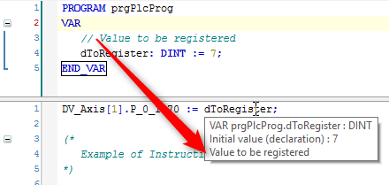

<h1 align="left">
  <br>
  
  <br>
  HEI-Vs Engineering School - Industrial Automation Base
  <br>
</h1>

Cours AutB

Author: [Cédric Lenoir](mailto:cedric.lenoir@hevs.ch)

# Module 05 Programmation robuste *coding rules*

# Coding Rules
La lisibilité du code participe à sa robustesse.

## Les règles de codage ou « coding rules »
Lorsqu’un autre technicien va lire votre code, ce sont les règles de codage qui vont donner une première impression. Vous n’aurez qu’une seule occasion de donner une première bonne impression.
C’est un peu comme lire un rapport plein de fautes d’orthographe, on aura toujours un doute sur la pertinence du contenu.

Je pars du principe, qu’une ligne de code coûte environ 10 balles. Pour 10 balles on peut s’attendre à ce qu’elle soit écrite correctement.

En informatique industrielle, peut-être plus que dans d’autres domaines, les machines évoluent. On ne va se débarrasser d’une machine d’assemblage à 2 millions comme on change de téléphone portable. Ce qui signifie qu'**il est plus que probable qu'une partie du code devra être revue pendand la durée de vie de la machine, que ce soit pour une opération de maintenance ou une modification.**

> La lisibilité du code est primordiale.

Un jour ou l’autre, vous aurez peut-être à écrire du code pour une machine qui doit être validée. L’abréviation GAMP pour Good Automated Manufacturing Practice n’est pas un vain mot et commence par là.

### Les noms de variable
Les noms de variable sont en anglais ET en toute lettre. On n’écrit pas M ou même Mot ou Moteur, on écrit Motor, ou plutôt stMotor ou fbMotor selon que l'on a inclue ou pas un comportement.

### Camel case...
Je privilégie en général le Camel case, sauf parfois pour les noms ou numéros de variables.

```iecst
  fbMotor_01  : FB_Motor;
```

###	ou notation hongroise
C’est le type de notation qui implique de faire précéder la variable par son type.

```iecst
  iMonIndex : INT;
  reMonPi   : REAL;
```
Je ne suis pas un fervent supporter de la notation hongroise. PLCopen le dit :

> si l’IDE permet d’afficher la variable, le préfixe peut être omis.

Si l’on prend par exemple le document **PLCopen for motion control**, on se rend compte qu’aucun des FB n’utilise la notation hongroise.

Enfin, un compilateur comme Codesys vous fera savoir à chaque fois que vous tentez une conversion de type implicite.

> Dans le cadre de ce cours, les préfixes sont souvent utilisés car les variables sont ne sont pas inclues dans un IDE...

### Les préfixes
Les préfixes que je suggère ne suivent pas forcément le document du PLCopen

|POUs	              |Type prefix	| Example	|Instance prefix | Example |
|-------------------|-------------|---------|----------------|---------|
|Structure          |ST_	        |ST_LAMP	|st	             |stLamp01 |
|Enumeration        |EN_	        |EN_Axes	|en	             |enAxisY  |
|Glob. Variable list|             |         |g	             |gNumber  |
|Program            |PRG	        |PRG_Main |--              |__       |
|Function block     |FB_          |FB_Motor	|fb	             |fbMotorOne|
|Function	          |FC_			    |FC_Add   |--              |--|
|Array			        |             |         |ar	             |arMyString|

### Les préfixes personnalisés
On peut définir ses propres préfixes. Par exemple l’organisation PLCopen définit les préfixes ``MC_`` pour tous les FB liés aux moteurs.

``MC_Power``, ``MC_MoveAbsolute``, ``MC_Home``...

On peut ensuite décider de continuer avec ses propres préfixes internes. ``MB_Power``, ``MB_Move``, etc.

### Préfixes pour les variables
|Mot Clé	|Préfixe	|Exemple|
|---------|---------|-------|
|BOOL|	x|	xMyFlag|
|BYTE|	by|	myRegister|
|WORD|	w|	wAudio|
|DWORD|	dw|	dwHighEnd|
|LWORD|	lw|	lwCrypted|
|SINT|	si|	siSmallCounter|
|USINT|	usi|	usiUnsignedShortInt|
|INT|	i|	iOldStandard|
|UINT|	ui|	uiUnsignedInd|
|DINT|	di|	diActualStandard|
|UDINT|	udi|	udiBigCounter|
|LINT|	li|	liFuturStandard|
|ULINT|	uli|	uliVeryBigCounter|
|REAL|	r|	rEnoughForMostApps|
|LREAL|	lr|	lrHighPrecision|
|STRING|	s|	sMostApplication|
|WSTRING|	ws|	wsInternationalApplication|
|TIME|	tim|	timWatch|
|LTIME|	ltim|	ltimSwissWatch|
|TIME_OF_DAY|	tod|	todDayDate|
|DATE_AND_TIME|	dt|	dtDateAndTime|
|DATE|	date|	dateCalendar|
|ENUM|	e|	eRedBlueWhite|
|POINTER|	p|	pInOut|
|ARRAY|	ar|	aListOfNumber|

Notes
- Le x pour le booléen est volontaire afin de le différentier du BYTE dans d’autres langages.
- L’énumération est parfois référencée en ``e`` ou ``en``.
- Le ARRAY est parfois utilisé avec ``a``. Je préfère ``ar``.

###	Suffixes
> C’est une note personnelle.

Il est bon de rappeler que le langage IEC 61131-3 n’est pas un langage prévu pour travailler de manière abstraite, mais qu’il est conçu pour s’approcher, voir modéliser le monde réel. Souvent les variables sont les représentations de variables physique et il peut être bon de savoir lesquelles.

Dans cette optique, j’utilise volontiers l’unité de la grandeur physique comme suffixe.

Exemple
```iecst
  reM2_Diameter_mm        : REAL;
  iM2_DecelRampSpeed_m_s2 : INT;
```

###	Indentation et tabulations
**4 espaces**
Ma préférence va vers le 3. La réalité est que la plupart des codes existants utilise 4 espaces et que je me suis retrouvé souvent à remplacer des dizaines de blocs d’espace. Donc 4.

Quand c’est possible :
…on configurera le logiciel pour remplacer les tabulations automatiquement par des espaces.
Nous ne faisons pas du traitement de texte, nous écrivons du code.

###	Les commentaires
Tout comme les noms de variables, les commentaires sont en anglais.
Un bon commentaire est un commentaire qui exprime l’intention du programmeur.

> Il n’est pas nécessaire de commenter chaque ligne, un commentaire pour un bloc de code peut s’avérer tout autant efficace.

Chaque élément, variable, POU, doit être commenté. Dans plusieurs IDE, le commentaire doit être situé en dessus de la ligne afin d’être affiché lors du survol de l’élément.
 
<figure>
    
    <figcaption>Display_Comment_In_Codeysy</figcaption>
</figure>

> Les trivialités sont à éviter !

```iecst
  iPosition + 10;        // Add 10 to position… do not write this comment…
```

> Les commentaire imbriqués sont à proscrire.

```iecst
(* Multiline comments can be dangerous because matching close comment can be deleted by accident.
b:=a; // commented out code can be activated by accident
// or active code after this block accidentally commented out.
*)
(* (* NESTED COMMENTS *) *)
```	

> On évite de laisser du code en commentaire

```iecst
  // xTautologie := TRUE OR TRUE;
```

> Ou si c'est le cas, on spécifie un mot clé pour retrouver le code en commentaire qui provoque une erreur de compilation si on supprime le commentaire.

```iecst
  // xTautologie := TRUE OR TRUE; CleanCode
```

###	Les petites règles de peu d’importance du PLCopen
Ces règles « peu importante » sont celles qui donneront au code un aspect professionnel.
En d’autres termes, on évite d’écrire comme un cochon…

> Mettre un espace entre les opérateurs infixe, tels que +, *.

```iecst
  iMyResult := iOne + iTwo * iFour;
```

> Ne pas mettre d’espace entre les opérateurs unaires.

```iecst
  iMyResult := iOne + -3; 
```

> Pas d’espace après l’ouverture ou avant la fermeture des parenthèses.

```iecst
  iMyResult := (iOne + iTwo) * iFour;
```

> Un espace avant et après la parenthèse dans les expressions.

```iecst
  iMyResult := (iOne + iTwo) * (iTree + -iFour) + iFive;
```

> Pas d’espace avant et après la parenthèse dans les appels.

```iecst
  iFive := FC_ADD(iOne, iTwo);
```

> Pas d’espace avant les point-virgule.

```iecst
  iFive := FC_ADD(iOne, iTwo) ;
```

> pas d’espace avant les deux points, mais un après.

```iecst
  udiMonTruc: UDINT := 0;
```

L’espace après peut-être remplacé par plusieurs pour une question de lisibilité, mais cela devient parfois ensuite compliqué à gérer sur un projet complet car le nombre d’espaces varie. Les IDE modernes permettent parfois une visualisation en tableau. Le mieux est finalement de respecter la règle qui consiste à **remplacer les tabulations par des espaces**.

```iecst
PROGRAM PlcProg
VAR
   xMonTruc:        BOOL  := FALSE;     // It is complicated to manage multiple tabs
   diMonTruc:       DINT  := 0;         // It is complicated to manage multiple tabs
   diMonTrucDeux:   DINT := 0;      // It is complicated to manage multiple tabs   
   udiMonTruc:    UDINT := 0;      // It is complicated to manage multiple tabs
END_VAR
```


> Pas d’espaces blancs à la fin d’une ligne

> Toujours un espace après une virgule qui ne termine pas une ligne.

```iecst
  iFive := FC_ADD(iOne, iTwo, iThree, iFour);
```

> Dans un tableau il n’y a pas d’espace avant et après les crochets

```iecst
  iFive := arOnes[1];
```

> Quand plusieurs paramètres sont placés sur plusieurs lignes, ils doivent commencer sur la même colonne.

```iecst
    mbMoveAbsAxisOne(Position_mm := 2.3,
                     Velocity_mm_s := 100,
                     Acceleration_mm_s2 := 1000);
```

> Dans la mesure du possible, placer les mots clé ``THEN``/``DO`` etc… sur la même ligne que ``IF``/``WHILE``

```iecst
   IF iBlob < 17 THEN
   …
   
   WHILE iCounter <> 0 DO
   …
   
   FOR iCounter := 1 TO 5 BY 1 DO
   …
   
   CASE iVar OF
   …
```


> Quand une expression doit être écrite sur plusieurs lignes, commencer la nouvelle ligne avec l’opérateur.

```iecst
reTheTotalLengthOfTheSystem :=  FC_ThisSpecificFunction(iParameterOne
                                                      + reTheThirdParameter
                                                      + reTheFourthParamete;
```

> Utiliser AND et pas « & »

```iecst
   xResult := xExpressionOne AND xExpressionTwo;
```

> Utiliser TRUE et FALSE, au lieu de 0 et 1 pour les valeurs booléennes.

```iecst
  xMonTruc: BOOL  := FALSE;
```

> Même si le système maîtrise parfaitement la priorité des opérations, il est préférable de faciliter la lecture en utilisant les parenthèses...

```iecst
   IF (xConditionOne AND xConditonTwo)
   OR (xConditionThree AND xConditonFour) THEN
       xMonTruc := FALSE;
   END_IF;
…
   IF A & B OR C & D THEN xMonTruc := FALSE; END_IF;   //  Works too :)
```

# Document utile
[PLCopen Coding Guidelines](./pdf/plcopen_coding_guidelines_v10.pdf)


