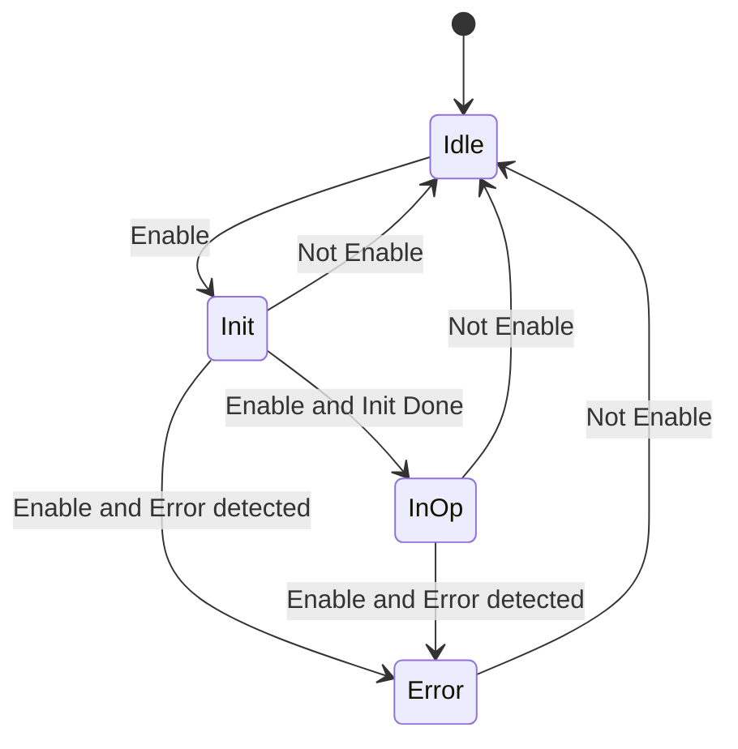
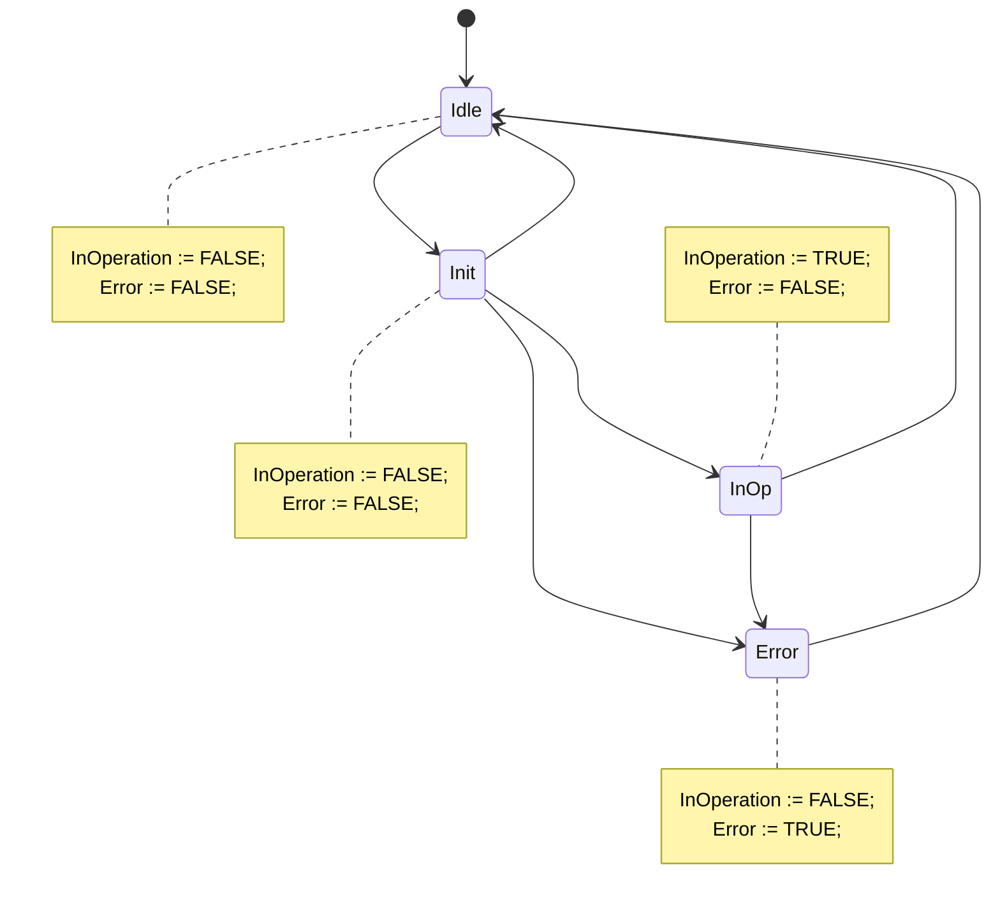
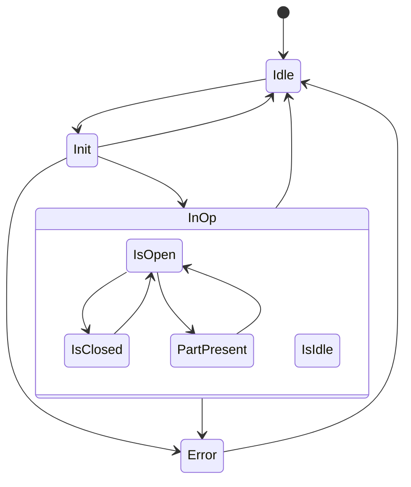

<h1 align="left">
  <br>
  
  <br>
  Industrial Automation Base
  <br>
</h1>

Cours AutB

Author: [Cédric Lenoir](mailto:cedric.lenoir@hevs.ch)

# Model Enable InOperation

## Théorie de base
Le principe est inspiré de la **machine de Moore**.
Dans la théorie du calcul, une machine de Moore est une machine à états finis, **FSM**, **Finite State Machine**, dont les valeurs de sortie actuelles sont déterminées uniquement par son état actuel.

Dans le contexte du codage d'un Function Block, cela revient à:
1.  Traiter les entrées
2.  Exécuter une machine d'état.
3.  Gérer les sorties en fonction des états.

### Traiter les entrées
Dans le traitement des états on inclue la mise en forme et, si nécessaire la vérification de leur cohérence.

### Machine d'état
On considère un codage du type **CASE** ``selector`` **OF** avec l'utlisation d'une énumération, **ENUM** pour le ``selector``. L'utililsation de l'énumération garantit le nombre fini d'état et limite strictement le risque d'un comportement non prévu par un état non non défini.

Cette approche interdit en principe l'utilisation du **ELSE** dans le codage de type **CASE..OF**. C'est à dire: ``CASE condition OF...ELSE...END_CASE``.

### Gérer les sorties en fonction des états
La gestion des sorties inclut l'appel des Function Block instanciés dans l'en-tête du module considéré.
> On appelle les Function Block **après** la machine d'état.

> Toute modification d'une variable dépendant des états à l'intérieur du CASE..OF est considéré comme **une erreur de programmation**.

Les alarmes sont considérées comme des sorties et son traitées à la fin du code.


> Le pseudo code ci-dessus est l'élément le plus important du semestre. **A connaître par cœur**.

#	Modèles de Enable
En utilisant la programmation orientée objet, il existerait plusieurs variantes possible. Dont celle qui consiste à utiliser l'héritage, les interfaces et les méthodes pour définir des blocs fonctionnels de base avec un comportement commun. Voir [ci-dessous, Pour aller un peu plus loin](#pour-aller-un-peu-plus-loin). Les deux références mentionnées dépassent toutefois le cadre de ce cour, *de base*, ils permettent de montrer que le IEC 61131-3 dans sa version actuelle permet de structurer du code avec une architecture complexe et ne sont pas commentés.

La conception par bloc fonctionnels reprend toutefois le premier principe de la programmation orientée objet, **l’encapsulation**. **Pour être précis, Le Function Block est une classe, sont instance est un objet**. Par contre nous ne parlerons ni héritage ni polymorphismes. Ceci est précisé pour signifier que les blocs fonctionnels ne sont pas activés par des méthodes, mais par des signaux boolean, BOOL que l’on peut classer en deux principales catégories, ``Execute`` et ``Enable``.

## Modèle Enable InOperation
Utilisation typique, un régulateur qui fonctionne en continu. Une fois que le bloc est opérationnel, ``InOperation``. La régulateur fonctionne normalement.

Le bloc fonctionnel [MC_Power](#un-bloc-fonctionnel-de-type-enable) mentionné ci-dessous fonctionne sur le même principe, simplement la sortie ``InOperation`` est renommée ```Status```.

Tant que la ``Status`` est ``TRUE``, cela signfie que l'axe est sous couple. Si il s'agissait d'un axe pneumatique, on pourrait dire sous pression.

### Enable In Operation Base / State machine



### The same diagram without transitions but outputs



### Définition des états

|State |Id |Description |
|------|---|-------------|
|STATE_IDLE |999 |Starting state of a function block|
|STATE_INIT |1 |Initialization of the function block State runs after the function block starts. All preparations required for the actual operations are made here. A sub-state machine is possible.|
|STATE_INOP| 2 |Working state of the function block In this state, the actual task of the function block is executed.|
|STATE_ERROR| 3 |Error state| State is active after an error occurs. It is exited by resetting “Enable” or “Execute”.|

> La définition des valeurs de l'énumération est facultative. L'habitude de mettre ce genre de valeur, **999** pour ``STATE_IDLE`` résulte de l'idée de se dire qu'une variable à 0 pourrait être une variable que l'on a oublié d'initialiser.

### Déclaration de l'ENUM et commentaire.
```iecst
{attribute 'qualified_only'}
{attribute 'strict'}
TYPE E_EnableInOperation :
(
    // Starting state of a function block
    STATE_IDLE  := 999,
    // Initialization of the function block State
    STATE_INIT := 1,
    //  Working state of the function block
    STATE_INOP := 2,
    // State is active after an error occurs
    STATE_ERROR := 3
)DINT := STATE_IDLE;
END_TYPE
```

### Example of Module

#### Header of a Function Block ``FB_MyInOpModule``
```iecst
// Declaration
FUNCTION_BLOCK FB_MyInOpModule
VAR_INPUT
    // Processing enabled (cyclic, state-controlled)
    Enable              : BOOL;
END_VAR
VAR_IN_OUT
    hw                  : HW_MyDevice_typ;
END_VAR
VAR_OUTPUT
    // The function blocks is busy with its actual task
    InOperation         : BOOL;
    // Indicates that an error occurred
    Error               : BOOL ;
    // Error cause
    ErrorID             : ERROR_CODE;
    // Optional Detailed error cause
    ErrorIdent          : ERROR_STRUCT;
END_VAR
VAR
    eEnableInOperation  : E_EnableInOperation;
    _InitDone           : BOOL;
    _Error              : BOOL;
    // Depending of your code
    _someCondition_1    : BOOL;
    // Depending of your code
    _someCondition_2    : BOOL;
    // Some action depending of your code
    _someAction_1        : BOOL;
    // Some action depending of your code
    _someAction_2        : BOOL;
END_VAR
```

#### Core of the code
```iecst
_InitDone := _someCondition_1;
_Error := _someCondition_2;

//
// Use: note that order is not important
//
CASE eEnableInOperation OF
    E_EnableInOperation.STATE_IDLE  :
        IF Enable THEN
            eEnableInOperation := E_EnableInOperation.STATE_INIT;
        END_IF;

    E_EnableInOperation.STATE_INIT  :
        IF NOT Enable THEN
            eEnableInOperation := E_EnableInOperation.STATE_IDLE;
        ELSIF _Error THEN
            eEnableInOperation := E_EnableInOperation.STATE_ERROR;
        ELSIF _InitDone THEN
            eEnableInOperation := E_EnableInOperation.STATE_INOP;
        END_IF;    

    E_EnableInOperation.STATE_INOP  :
        IF NOT Enable THEN
            eEnableInOperation := E_EnableInOperation.STATE_IDLE;
        ELSIF _Error THEN
            eEnableInOperation := E_EnableInOperation.STATE_ERROR;
        END_IF;    
        
    E_EnableInOperation.STATE_ERROR :
        IF NOT Enable THEN
            eEnableInOperation := E_EnableInOperation.STATE_IDLE;
        END_IF;   

END_CASE

InOperation := (eEnableInOperation = E_EnableInOperation.STATE_INOP);
Error := (eEnableInOperation = E_EnableInOperation.STATE_ERROR);

//
// Use directly the state with combinatorial logic (This is better than IF ELSE)
//
_someAction_1 := (eEnableInOperation = E_EnableInOperation.STATE_INOP);

//
// Maybe in your application, it is better to use IF ELSE condition
//
IF (eEnableInOperation = E_EnableInOperation.STATE_IDLE) THEN
    _someAction_2 := TRUE;
ELSE
    _someAction_2 := FALSE;
END_IF
```
#### Alarm
```iecst
//
// Process Alarms if any,
// You could manage the alarm outside of FB using outputs of the FB.
// 
fbAlarm(Enable := (eEnableInOperation = E_EnableInOperation.STATE_ERROR));
```

# Sub States
Depending of the case, it could be usefull to have more states. One solution is to use sub-states.



### Example of Enum and Code for Sub States

#### Declaration of ENUM for Sub States
```iecst
{attribute 'qualified_only'}
{attribute 'strict'}
TYPE E_InOpSubStates :
(
    // Idle state within InOperation
    STATE_ISIDLE := 0,
    // State when the system is open
    STATE_ISOPEN := 1,
    // State when the system is closed
    STATE_ISCLOSED := 2,
    // State when a part is present
    STATE_PARTPRESENT := 3
)DINT := STATE_ISIDLE;
END_TYPE
```

#### Core of the AI Code with Sub States
The code below is generated with Copilot. The nice side of Copilot is that it uses what it can find in your PC. It is easy to see that the code below is directly inspired from the code of FB_MyInOpModule written from scratch without AI. 

*Note that my PC have a whole solution of this code too, I cannot give waranties that the solution will be so good in another PC*

```iecst
VAR
    eInOpSubState           : E_InOpSubStates := E_InOpSubStates.STATE_ISIDLE;
    _IsOpenCondition        : BOOL;
    _IsClosedCondition      : BOOL;
    _PartPresentCondition   : BOOL;
END_VAR

CASE eEnableInOperation OF
    E_EnableInOperation.STATE_IDLE  :
        IF Enable THEN
            eEnableInOperation := E_EnableInOperation.STATE_INIT;
        END_IF;

    E_EnableInOperation.STATE_INIT  :
        IF NOT Enable THEN
            eEnableInOperation := E_EnableInOperation.STATE_IDLE;
        ELSIF _Error THEN
            eEnableInOperation := E_EnableInOperation.STATE_ERROR;
        ELSIF _InitDone THEN
            eEnableInOperation := E_EnableInOperation.STATE_INOP;
        END_IF;    

    E_EnableInOperation.STATE_INOP  :
        IF NOT Enable THEN
            eEnableInOperation := E_EnableInOperation.STATE_IDLE;
        ELSIF _Error THEN
            eEnableInOperation := E_EnableInOperation.STATE_ERROR;
        ELSE
            CASE eInOpSubState OF
                E_InOpSubStates.STATE_ISIDLE :
                    IF _IsOpenCondition THEN
                        eInOpSubState := E_InOpSubStates.STATE_ISOPEN;
                    END_IF;

                E_InOpSubStates.STATE_ISOPEN :
                    IF _IsClosedCondition THEN
                        eInOpSubState := E_InOpSubStates.STATE_ISCLOSED;
                    ELSIF _PartPresentCondition THEN
                        eInOpSubState := E_InOpSubStates.STATE_PARTPRESENT;
                    END_IF;

                E_InOpSubStates.STATE_ISCLOSED :
                    IF _IsOpenCondition THEN
                        eInOpSubState := E_InOpSubStates.STATE_ISOPEN;
                    END_IF;

                E_InOpSubStates.STATE_PARTPRESENT :
                    IF _IsOpenCondition THEN
                        eInOpSubState := E_InOpSubStates.STATE_ISOPEN;
                    END_IF;
            END_CASE
        END_IF;    

    E_EnableInOperation.STATE_ERROR :
        IF NOT Enable THEN
            eEnableInOperation := E_EnableInOperation.STATE_IDLE;
        END_IF;   

END_CASE

InOperation := (eEnableInOperation = E_EnableInOperation.STATE_INOP);
Error := (eEnableInOperation = E_EnableInOperation.STATE_ERROR);
```

#### Human Code
The code below have almost the same action than the **AI code**. But the sub state machine is written outside the main state machine.

```iecst
VAR_OUTPUT
    gripperIsOpen           : BOOL;
    gripperIsClosed         : BOOL;
    gripperWithPart         : BOOL;
END_VAR
VAR
    eInOpSubState           : E_InOpSubStates := E_InOpSubStates.STATE_ISIDLE;
    _IsOpenCondition        : BOOL;
    _IsClosedCondition      : BOOL;
    _PartPresentCondition   : BOOL;
END_VAR

CASE eEnableInOperation OF
    E_EnableInOperation.STATE_IDLE  :
        IF Enable THEN
            eEnableInOperation := E_EnableInOperation.STATE_INIT;
        END_IF;

    E_EnableInOperation.STATE_INIT  :
        IF NOT Enable THEN
            eEnableInOperation := E_EnableInOperation.STATE_IDLE;
        ELSIF _Error THEN
            eEnableInOperation := E_EnableInOperation.STATE_ERROR;
        ELSIF _InitDone THEN
            eEnableInOperation := E_EnableInOperation.STATE_INOP;
        END_IF;    

    E_EnableInOperation.STATE_INOP  :
        IF NOT Enable THEN
            eEnableInOperation := E_EnableInOperation.STATE_IDLE;
        ELSIF _Error THEN
            eEnableInOperation := E_EnableInOperation.STATE_ERROR;
        END_IF;    

    E_EnableInOperation.STATE_ERROR :
        IF NOT Enable THEN
            eEnableInOperation := E_EnableInOperation.STATE_IDLE;
        END_IF;   
END_CASE

CASE eInOpSubState OF
    E_InOpSubStates.STATE_ISIDLE :
        IF (eEnableInOperation = E_EnableInOperation.STATE_INOP) AND
           _IsOpenCondition                                      THEN
            eInOpSubState := E_InOpSubStates.STATE_ISOPEN;
        END_IF;

    E_InOpSubStates.STATE_ISOPEN :
        IF NOT (eEnableInOperation = E_EnableInOperation.STATE_INOP) THEN
            eInOpSubState := E_InOpSubStates.STATE_ISIDLE;
        ELSIF _IsClosedCondition THEN
            eInOpSubState := E_InOpSubStates.STATE_ISCLOSED;
        ELSIF _PartPresentCondition THEN
            eInOpSubState := E_InOpSubStates.STATE_PARTPRESENT;
        END_IF;

    E_InOpSubStates.STATE_ISCLOSED :
        IF NOT (eEnableInOperation = E_EnableInOperation.STATE_INOP) THEN
            eInOpSubState := E_InOpSubStates.STATE_ISIDLE;
        ELSIF _IsOpenCondition THEN
            eInOpSubState := E_InOpSubStates.STATE_ISOPEN;
        END_IF;

    E_InOpSubStates.STATE_PARTPRESENT :
        IF NOT (eEnableInOperation = E_EnableInOperation.STATE_INOP) THEN
            eInOpSubState := E_InOpSubStates.STATE_ISIDLE;
        ELSIF _IsOpenCondition THEN
            eInOpSubState := E_InOpSubStates.STATE_ISOPEN;
        END_IF;

END_CASE

gripperIsOpen := (eInOpSubState = E_InOpSubStates.STATE_ISOPEN);
gripperIsClosed := (eInOpSubState = E_InOpSubStates.STATE_ISCLOSED);
gripperWithPart := (eInOpSubState = E_InOpSubStates.STATE_PARTPRESENT);

InOperation := (eEnableInOperation = E_EnableInOperation.STATE_INOP);
Error := (eEnableInOperation = E_EnableInOperation.STATE_ERROR);
```

# Résumé
Les exemples ci-dessus montrent que selon les cas, une AI peut générer un code très propre.
Ce qui n'est pas toujour le cas.

> Vous avez le droit, et vous êtes même encouragé à le faire, d'utiliser une AI pour générer votre code, mais il est de votre responsabilité de vérifier que le code de l'AI soit propre.