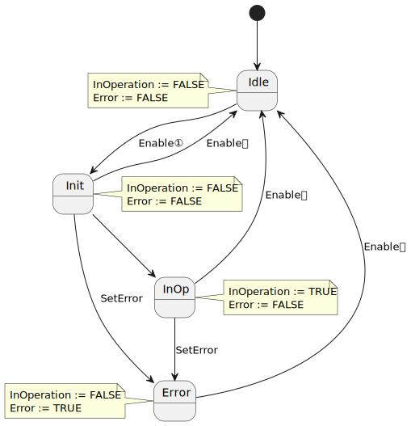

<h1 align="left">
  <br>
  
  <br>
  Industrial Automation Base
  <br>
</h1>

Cours AutB

Author: [Cédric Lenoir](mailto:cedric.lenoir@hevs.ch)

# Module 05 Programmation robuste

*Keywords : CASE..OF / ENUM / State Machine / Enable / Execute*

# Contenu
- La structure du code avec Finite State Machine et appel aux blocs fonctionnels
- Gestion des alarmes
- Les Coding Rules

# Généralités
Il existe quelques principes qui permettent d'écrire **un code robuste**.
Par robuste, nous entendons la **capacité à réaliser la fonction souhaitée**, mais aussi la capacité à **éviter les comportements non désirés**, puis à la notion de temps, pour utiliser un terme à la mode, nous pourrions parler de **durabilité**.

La source initiale n'est pas connue, mais il est dit: **le code est lu beaucoup plus souvent qu'il n'est écrit**. Un code sera aussi modifié. La qualité d'écriture contribue grandement à la capacité d'un code à être modifié sans conduire à des effets secondaires non désirés.

Dans ce module, nous présentons une méthode principalement basée sur l'expérience de l'auteur.
Cette expérience est consdirée comme valable dans une unité de temps limitée. La technique de codage évoluera en fonction de la disponibilité de nouvelles technologies.

Un objet de type Function Block est constitué d'une structure et d'un comportement. La structure a été vue dans les modules précédents, nous allons nous concentrer ici sur le comportement.

## Théorie de base
Le principe est inspiré de la **machine de Moore**.
Dans la théorie du calcul, une machine de Moore est une machine à états finis, **FSM**, **Finite State Machine**, dont les valeurs de sortie actuelles sont déterminées uniquement par son état actuel.

Dans le contexte du codage d'un Function Block, cela revient à:
1.  Traiter les entrées
2.  Exécuter une machine d'état.
3.  Gérer les sorties en fonction des états.

### Traiter les entrées
Dans le traitement des états on inclue la mise en forme et, si nécessaire la vérification de leur cohérence.

### Machine d'état
On considère un codage du type **CASE** ``selector`` **OF** avec l'utlisation d'une énumération, **ENUM** pour le ``selector``. L'utililsation de l'énumération garantit le nombre fini d'état et limite strictement le risque d'un comportement non prévu par un état non non défini.

Cette approche interdit en principe l'utilisation du **ELSE** dans le codage de type **CASE..OF**.

### Gérer les sorties en fonction des états
La gestion des sorties inclut l'appel des Function Block instanciés dans l'en-tête du module considéré.
> On appelle les Function Block **après** la machine d'état.

> Toute modification d'une variable dépendant des états à l'intérieur du CASE..OF est considéré comme **une erreur de programmation**.

Les alarmes sont considérées comme des sorties et son traitées à la fin du code.

## Pseudo code.
```iecst
(*
    Header
*)

FUNCTION_BLOCK FB_PseudCode
VAR_INPUT
    One         : REAL;
END_VAR
VAR_OUTPUT
    ActionOne   : BOOL;
END_VAR
VAR
    needDint    : DINT;
    selector    : E_Color;
    fbActionOne : FB_SetAction;
    fbActionTwo : FB_SetAction;
    fbAlarm     : FB_SetAlarm;          
END_VAR
```
```iecst
//
//  Some input processing
//
needDint := REAL_TO_DINT(One);

//
//  Process State Machine
//
CASE selector OF
    E_Color.green :
        IF needDint > 33 THEN
            selector := E_Color.orange;
        END_IF
    E_Color.orange :
        // Some condition here
        ;
    E_Color.red :
        // Some condition here
        ;
END_CASE

//
//  Process Outputs and FB depending of state
//
fbActionOne(Execute := (selector = E_Color.green)); 
fbActionTwo(Execute := (selector = E_Color.orange));
ActionOne := (selector = E_Color.green) OR (selector = E_Color.orange);

//
//  Process Alarms
// 
fbAlarm(Enable := (selector = E_Color.red));
```
> Le pseudo code ci-dessus est l'élément le plus important du semestre. **A connaître par cœur**.

#	Modèles de Enable et Execute
En utilisant la programmation orientée objet, il existerait plusieurs variantes possible. Dont celle qui consiste à utiliser l'héritage, les interfaces et les méthodes pour définir des blocs fonctionnels de base avec un comportement commun. Voir [ci-dessous, Pour aller un peu plus loin](#pour-aller-un-peu-plus-loin). Les deux références mentionnées dépassent toutefois le cadre de ce cour, *de base*, ils permettent de montrer que le IEC 61131-3 dans sa version actuelle permet de structurer du code avec une architecture complexe et ne sont pas commentés.

La conception par bloc fonctionnels reprend toutefois le premier principe de la programmation orientée objet, **l’encapsulation**. **Pour être précis, Le Function Block est une classe, sont instance est un objet**. Par contre nous ne parlerons ni héritage ni polymorphismes. Ceci est précisé pour signifier que les blocs fonctionnels ne sont pas activés par des méthodes, mais par des signaux boolean, BOOL que l’on peut classer en deux principales catégories, ``Execute`` et ``Enable``.

## Modèle Enable InOperation
Utilisation typique, un régulateur qui fonctionne en continu. Une fois que le bloc est opérationnel, ``InOperation``. La régulateur fonctionne normalement.

Le bloc fonctionnel [MC_Power](#un-bloc-fonctionnel-de-type-enable) mentionné ci-dessous fonctionne sur le même principe, simplement la sortie ``InOperation`` est renommée ```Status```.

Tant que la ``Status`` est ``TRUE``, cela signfie que l'axe est sous couple. Si il s'agissait d'un axe pneumatique, on pourrait dire sous pression.

### Enable In Operation Base / State machine
<figure>
    
    <figcaption>Function Block Enable InOperation Base</figcaption>
</figure>

### Définition des états

|State |Id |Description |
|------|---|-------------|
|STATE_IDLE |999 |Starting state of a function block|
|STATE_INIT |1 |Initialization of the function block State runs after the function block starts. All preparations required for the actual operations are made here. A sub-state machine is possible.|
|STATE_INOP| 2 |Working state of the function block In this state, the actual task of the function block is executed.|
|STATE_ERROR| 3 |Error state| State is active after an error occurs. It is exited by resetting “Enable” or “Execute”.|

> La définition des valeurs de l'énumération est facultative. L'habitude de mettre ce genre de valeur, **999** pour ``STATE_IDLE`` résulte de l'idée de se dire qu'une variable à 0 pourrait être une variable que l'on a oublié d'initialiser.

### Déclaration de l'ENUM et commentaire.
```iecst
{attribute 'qualified_only'}
{attribute 'strict'}
TYPE E_EnableInOperation :
(
    // Starting state of a function block
    STATE_IDLE  := 999,
    // Initialization of the function block State
    STATE_INIT := 1,
    //  Working state of the function block
    STATE_INOP := 2,
    // State is active after an error occurs
    STATE_ERROR := 3
)DINT := STATE_IDLE;
END_TYPE

// Declaration
    eEnableInOperation  :   E_EnableInOperation;

// Use: note that order is not important
CASE eEnableInOperation OF
    E_EnableInOperation.STATE_ERROR :
        ;
    E_EnableInOperation.STATE_IDLE  :
        ;
    E_EnableInOperation.STATE_INIT  :
        ;
    E_EnableInOperation.STATE_INOP  :
        ;    
END_CASE
```

### Pragma
Les pragma sont des directives de compilation qui ne font pas partie de la norme de programmation mais imposent des conditions particulières, des options, de la part du compilateur.

*La définition du compilateur Codesys traduite:*

> *Un pragma est une instruction spéciale dans le code source d'une application qui influence les propriétés des variables lors de la précompilation ou de la compilation (génération de code).*

> Il existe différents pragmas pour différents usages (exemple : initialisation d'une variable, surveillance d'une variable, ajout d'une variable à la configuration des symboles, forcer l'affichage des messages lors du processus de compilation, et comportement d'une variable sous certaines conditions)

Dans l'exemple mentionné ci-dessus, ajoutés par défaut lorsque l'on ajoute un ENUM à l'aide du menu contextuel.
``{attribute 'qualified_only'}``
``{attribute 'strict'}``.

#### Attribute qualified_only
Dans le cas d'un ENUM, impose l'écriture du nom de l'ENUM pour l'utilisation de ces composantes.
```iecst
    // This statement cause an error @ compilation if {attribute 'qualified_only'} is used.
    eEnableInOperation := STATE_INIT;
    // This statement is allowed in all cases.
    eEnableInOperation := E_EnableInOperation.STATE_INIT;
```

> Privilégier l'écriture du style ``E_EnableInOperation.STATE_INIT`` qui est toujours acceptée.

#### Attribute strict
Interdit l'écriture sur la variable d'état avec un type différent.
On peut lire le type, puisque l'on a forcé le type DINT.

```iecst
// Declaration
VAR
    testUnTruc          : DINT;
END_VAR

// Utilisation
    testUnTruc := eEnableInOperation;   // Is allowed
    eEnableInOperation := testUnTruc;   // Compilation error
```

### Traitement des entrées/sorties.
Un bloc fonctionnel de type Enable / InOperation est constitué au minimum d'une entrée et deux sorties.

```iecst
(*
    Header
*)

VAR_INPUT
    Enable       : BOOL := FALSE;
END_VAR

VAR_OUTPUT
    InOperation  : BOOL;
    Error        : BOOL;
END_VAR

// Definition of Outputs / combinatorial logic
InOperation := (eEnableInOperation = E_EnableInOperation.STATE_INOP); 
Error := (eEnableInOperation = E_EnableInOperation.STATE_ERROR); 
```

Noter que les sorties sont ici construites à partir des états.

> Les cours de logiques combinatoire, machines d'état et tables de Karnaugh vus dans les semestres précédents sont directement applicables pour la gestion des sorties. Si le nombre d'états sont trop nombreux pour être gérés simplement via les tables de Karnaugh, il sera nécessaire de penser à décomposer le problème en plusieurs sous-ensembles.

## Modèle Execute Done
Les blocs fonctionnels de ce type sont utilisés pour des tâches non récurrentes nécessitant un traitement temps de plusieurs cycles. par exemple, l'initialisation d'un matériel.

Dans l'exemple ci-dessous, MC_RESET un utilisé dans les application de Motion Control pour sortir d'un état ERROR_STOP qui a stoppé l'axe, par exemple en raison d'un écart de poursuite trop important.

### Execute Done Base / State machine
<figure>
    
    <figcaption>Function Block Execute Done Base</figcaption>
</figure>

### Définition des états

|State |Id |Description |
|------|---|-------------|
|STATE_IDLE |999 |Starting state of a function block|
|STATE_INIT |1 |Initialization of the function block State runs after the function block starts. All preparations required for the actual operations are made here. A sub-state machine is possible.|
|STATE_INOP| 2 |Working state of the function block In this state, the actual task of the function block is executed.|
|STATE_DONE| 3 |Processing completed| State indicates that task processing was successfully completed.|
|STATE_ERROR| 4 |Error state| State is active after an error occurs. It is exited by resetting “Enable” or “Execute”.|

### Un bloc fonctionnel de type Enable

Un bloc fonctionnel de type enable sera appelé en continu tant que le signal d’entrée Enable est vrai.
Il est en général considéré comme actif tant que le signal de sortie ``InOperation`` ou ``Status`` est vrai, ``TRUE``.
Si la sortie ``InOperation`` ou ``Status``  est vraie, TRUE alors que le bloc fonctionnel n’est pas appelé en continu, il n’y strictement aucune garantie que le signal soit valide. Ceci est à considérer comme une erreur de programmation qui ne sera pas signalée par le compilateur.

Un exemple d’un bloc fonctionnel de type Enable est un régulateur ou un bloc fonctionnel de type MC_Power utililsé pour la commande d’axes.

<figure>
    
    <figcaption>MC_Power, Source: <a href="https://www.se.com/ww/en/">Schneider Electric</a></figcaption>
</figure>

C’est une bonne pratique d’équiper un bloc fonctionnel avec ce type de comportement au minimum de l’entrée Enable et de la sortie Active / Status.

> Noter l'entrée/sortie ``VAR_IN_OUT`` de type ``AXIS_REF``. C'est la référence à la structure d'un axe qui fournir toutes les informations dont MC_POWER à besoin.  

|Name   |Type       |Description|
|-------|-----------|-----------|
|Axis   |AXIS_REF   |Axis data structure that unambiguously addresses an axis in the system.|
|Enable	|BOOL	    |Value range: FALSE, TRUE. Default value: FALSE. The input Enable starts or terminates execution of a function block. --> FALSE: Execution of the function block is terminated. The outputs Valid, Busy, and Error are set to FALSE. --> TRUE: The function block is being executed. The function block continues executing as long as the input Enable is set to TRUE.|

|Name   |Type         |Description|
|-------|:------------|-----------|
|Status	|BOOL	      |Value range: FALSE, TRUE. Default value: FALSE. --> FALSE: Power stage is disabled. --> TRUE: Power stage is enabled.|
|Error	|BOOL	      |Value range: FALSE, TRUE. Default value: FALSE. --> FALSE: Function block is being executed, no error has been detected during execution. -->TRUE: An error has been detected in the execution of the function block.|
|ErrorID	|ET_Result	      |This enumeration provides diagnostics information.|

### Un bloc fonctionnel de type Execute
Un bloc fonctionnel de type Execute sera en principe activé sur le flanc montant de l’entrée Execute.

<figure>
    
    <figcaption>Function Block MC_Reset, Source: <a href="https://www.beckhoff.com/fr-ch/">Beckhoff</a></figcaption>
</figure>

|Name   |Type       |Description|
|-------|-----------|-----------|
|Execute|BOOL	    |The command is executed with a rising edge.|
|Axis   |AXIS_REF   |Axis data structure that unambiguously addresses an axis in the system.|

|Name   |Type         |Description|
|-------|:-----------:|-----------|
|Done	|BOOL	      |TRUE, if the reset was executed successfully.|
|Busy	|BOOL	      |TRUE, as long as the function block is called with Enable = TRUE.|
|Error	|BOOL	      |TRUE, if an error occurs.|
|ErrorID|UDINT	      |If the error output is set, this parameter supplies the error number.|

# On insiste sur l'appel en continu
Les paragraphes ci-dessus servent d'une part à construire un bloc fonctionnel robuste, mais aussi à comprendre le fonctionnement de blocs fonctionnels existants.

> On comprend que les entrées Execute ou Enable ne sont pas à proprement parler des activations du bloc, mais des commandes de la machine d'état interne.

> Si le bloc n'est pas appelé, la machine d'état ne peut pas fonctionner et les sorties ne sont plus valides.

## Un premier exemple qui peut poser problème
Soit l'exemple de code ci-dessous, **BAD Practice**.

```iecst
// BAD practice for call of mcReset()
// Abstract of code
CASE eEnableInOperation OF
    E_EnableInOperation.STATE_ERROR  :
        ;
    E_EnableInOperation.STATE_IDLE  :
        mcReset.Execute := FALSE;
        mcReset(Axis := GVL_OneAxis.X_Axis);
    E_EnableInOperation.STATE_INIT  :
        mcReset.Execute := TRUE;
        mcReset(Axis := GVL_OneAxis.X_Axis);
        IF mcReset.Done THEN
            eEnableInOperation := E_EnableInOperation.STATE_IDLE;
        END_IF
    E_EnableInOperation.STATE_INOP  :
        ;    
END_CASE
```
Si tout ce passe comme prévu dans l'idée du programmeur, le ``MC_Reset`` sera exécuté dans l'état ``STATE_INIT``, puis sera à nouveau exécuté dans l'état ``STATE_IDLE``. Mais, en cas d'autre type d'erreur, par exemple une perte de l'alimentation électrique de ``X_Axis``, on passerait directement dans l'état STATE_ERROR. **Problème**: la machine d'état interne de ``mcReset`` ne serait plus mise à jour. Cela impliquerait un risque de comportement indéterminé si les sorties du Function Block ``MC_Reset`` sont utilisée dans une autre portion du programme.

C'est pourquoi, afin d'éviter cette incertitude, on préféra appeler mcReset **à un seul endroit**, après la machine d'état, la commande ``mcReset.Execute`` est codée avec de la logique combinatoire.

```iecst
// GOOD practice for call of mcReset()
// Abstract of code
CASE eEnableInOperation OF
    E_EnableInOperation.STATE_ERROR  :
        ;
    E_EnableInOperation.STATE_IDLE  :
        ;
    E_EnableInOperation.STATE_INIT  :
        IF mcReset.Done THEN
            eEnableInOperation := E_EnableInOperation.STATE_IDLE;
        END_IF
    E_EnableInOperation.STATE_INOP  :
        ;    
END_CASE
mcReset.Execute := (eEnableInOperation = E_EnableInOperation.STATE_INIT);
mcReset(Axis := GVL_OneAxis.X_Axis)
```
Avec cette pratique, **GOOD practice**, on a la certitude que:
1.  ``mcReset.Execute`` sera ``TRUE`` uniquement dans l'état ``E_EnableInOperation.STATE_INIT`` et ``FALSE`` dans tous les autes états de ``eEnableInOperation``.
2.  La machine interne de ``mcReset`` sera toujours exécutée.
3.  *Cet exemple est théorique, car en motion control, MC_Reset est en général utilisé pour réinitialiser le sytème après une erreur*.

## Un deuxième exemple qui peut poser, ou posera obligatoirement un problème
Reprenons le cas d'une machine d'état utilisée pour piloter des feux de signailisation vu dans une module précédent [Feux de circulation à 4 états](https://github.com/hei-synd-autb/autb-docs/tree/main/AutB_MOD_03_Operation_And_Instruction#exercice-8-feux-de-circulation-%C3%A0-4-%C3%A9tats).

<figure>
    
    <figcaption>State Diagram: 4-state traffic lights</figcaption>
</figure>

Avec le code suivant: *une partie des transitions ont été enlevées pour obtenir un exemple plus clair*. Par rapport à l'exemple de l'exercice cité, un nouveau programmeur a voulu ajouter un nouvel état ``SpecialCase``.

L'exemple de codage montre qu'il est possible d'avoir soit un feu vert soit un feu rouge pour l'état ``E_StateMachine_typ.SpecialCase``.

> **C'est exactement ce que l'on veut éviter**. Un état de la machine correspond à **une et une seule** configuration des sorties.

> On acceptera des paramètres dans un état, comme pour définir la position d'un bloc fonctionnel, mais **on n'utilisera jamais les entrées Execute ou Enable d'un Function Block directement dans une machine d'état**.

```iecst
CASE eStateMachine OF
    E_StateMachine_typ.Idle       :
        ;
        // Some transition
        bLightRed := FALSE;
        bLightGreen := FALSE;
    E_StateMachine_typ.Red        :
        bLightRed := TRUE;
        bLightGreen := FALSE;
        IF mySpecialCondition THEN
           eStateMachine := E_StateMachine_typ.SpecialCase
        END_IF
    E_StateMachine_typ.Red_Orange :
        ;
        // Some transition
    E_StateMachine_typ.Green      :
        bLightRed := FALSE;
        bLightGreen := TRUE;
        IF mySpecialCondition THEN
           eStateMachine := E_StateMachine_typ.SpecialCase
        END_IF
    E_StateMachine_typ.Orange     :
        ;
        // Some transition

    E_StateMachine_typ.SpecialCase     :
        ;
        // Some transition
END_CASE
```

# Autres pratiques utiles
## State nm1, état précédent
Il peut être pratique de connaître l'état précédent de la machine d'état. Par exemple:

1.  Lors de l'analyse du code pour savoir, par exemple, quel était l'état **avant** l'état **Error**.
2.  Lors de la programmation pour activer une valeur, non plus sur un état, mais lors de la **transition**.

Dans l'exemple ci-dessous: 
```iecst
(*
    Header
*)
VAR
    eEnableInOperation      : E_EnableInOperation;
    eEnableInOperationNm1   : E_EnableInOperation;
    eEnableInOperationMem   : E_EnableInOperation;
    nextStep                : BOOL;
    trigIdleToInit          : R_TRIG;
    countIdleToInit         : DINT := 0;
END_VAR

//**********************************************
// Implementation exemple
//**********************************************
CASE eEnableInOperation OF
    E_EnableInOperation.STATE_ERROR  :
        IF nextStep THEN
            eEnableInOperation := E_EnableInOperation.STATE_IDLE;
            nextStep := FALSE;
        END_IF
    E_EnableInOperation.STATE_IDLE  :
        IF nextStep THEN
            eEnableInOperation := E_EnableInOperation.STATE_INIT;
            nextStep := FALSE;
        END_IF
    E_EnableInOperation.STATE_INIT  :
        IF nextStep THEN
            eEnableInOperation := E_EnableInOperation.STATE_INOP;
            nextStep := FALSE;
        END_IF
    E_EnableInOperation.STATE_INOP  :
        IF nextStep THEN
            eEnableInOperation := E_EnableInOperation.STATE_ERROR;
            nextStep := FALSE;
        END_IF
END_CASE

//**********************************************
// Routine to get value of eEnableInOperationNm1
//**********************************************
IF eEnableInOperation <> eEnableInOperationMem THEN
    eEnableInOperationNm1 := eEnableInOperationMem;
END_IF
eEnableInOperationMem := eEnableInOperation;

trigIdleToInit(CLK := (eEnableInOperation = E_EnableInOperation.STATE_INIT)    AND
                      (eEnableInOperationNm1 = E_EnableInOperation.STATE_IDLE));

//**********************************************
// Routine to get transition
//**********************************************
IF trigIdleToInit.Q THEN
   countIdleToInit := countIdleToInit + 1;
END_IF
```
1.  La variable ``eEnableInOperationNm1`` mémorise l'état précédent.
2.  La valeur trigIdleToInit.Q indique une transition de ``STATE_IDLE`` vers ``STATE_INIT``.

## Texte des états
Même si les énumérations utilisées dans la machine d'état sont autant explicites que possible, elle sont souvent difficilement lisibles par un système externe, y compris OPC-UA, et probablement peut compréhensibles pour un opérateur ou un technicien de maintenance qui doit pouvoir comprendre facilement l'état du programme afin d'intervenir rapidement.

Il existe une pratique relativement simple pour aider au diagnostique de la machine, c'est fournir une information légèrement détaillée, par légèrement détaillée, nous entendons, une seule phrase.

```iecst
(*
    Header
*)

VAR
    // If a size is not defined, then CODESYS allocates 80 characters by default
    strStateInfo    : STRING := '';
END_VAR

//**********************************************
// Implementation exemple
//**********************************************
CASE eEnableInOperation OF
    E_EnableInOperation.STATE_ERROR  :
        strStateInfo := 'Error while enabling InOperation';
    E_EnableInOperation.STATE_IDLE  :
        strStateInfo := 'State idle, wait for next step condition';
    E_EnableInOperation.STATE_INIT  :
        strStateInfo := 'State idle, waiting for init condition';
    E_EnableInOperation.STATE_INOP  :
        strStateInfo := 'In operation';
END_CASE
```

> Nous faisons ici abstraction d'un IDE complet qui permettra dans certains cas de mettre à disposition le diagnostic dans plusieurs langue.


## Ne jamais sous-estimer les aides à la lecture du programme
Ce module fournit une série de recommandations pour la programmation qui n'apparaissent en général pas dans les guides de programmation PLC.

Dans de nombreux cas, les premiers cas d'un ingénieur en automation se feront dans une strucutre existantes. Dans ce cas, les règles énumérées ci-dessus pourrons être différentes.

Si aucune structure n'existe, l'ingénieur en automation aura intérêt à s'inspirer des règles ci-dessus, puis à les améliorer pour les adapter à ses besoins.

> Le code supplémentaire nécessaire à la robustesse du programme est un **gain de productivité**.

# Les alarmes, events.
Les alarmes sont une composante essentielle d'une programmation robuste, mais ne sont mentionnées ici qu'a titre d'information, car elle agissent au niveau de la machine, Unit, qui n'est pas traitée dans ce cours.

> Premièrement, le terme alarme n'est pas aproprié, une alarme devrait être vue comme une des trois composantes d'un événement. Le terme d'**Event** serait plus approprié.

## Exemple d'event

Prenons une machine, **Unit**, définie à l'aide d'un modèle S88 comme ci-dessous.

<figure>
    
    <figcaption>Machine with S88 architecture</figcaption>
</figure>

Si une commande d'axe utilisée au niveau CM, Control Module. Supposons que Left Servo se retrouve bloqué, le Function Block utilisé pour CM_LeftServo va générer un événement. Cet événement pourrait être déclenché par une variable ``CM_LeftServo.Overheated`` de type ``BOOL``.

Finalement, l'événement sera envoyé à un système de supervision, qui sous sa forme classique sera un écran tactile à disposition de l'opérateur.

<figure>
    
    <figcaption>Exemple de système d'affichage des alarmes.</figcaption>
</figure>

Le traitement des alarmes ne dépend que peu de la partie PLC. L'écriture complète d'un système de gestion des alarmes est une tâche complexe et dans la plupart des cas, l'ingénieur en automation utilisera une librairie d'alarmes qui lui met à disposition une série de blocs fonctionnels qui sont adaptés à l'environnement dans lequel il travaille.
Ci-dessous, le code est inspiré d'une librairie d'origine Siemens conçue pour un environnement matériel dédié.

> Les librairies sont des paquets de blocs fonctionnels que l'on peut comparer à ce que l'on obtiendrait en Python via une commande ``import``.

### Code
Nous avons un minimum de compréhension de ce qu'est un Function Block, nous pouvons illustrer le propos avec un exemple de code de ce que pourrait être un **Event**.

```iecst
(*
    Header / Declaration of Function Block Event
*)
VAR
    instEventServoLeft   : FB_Event;
END_VAR

//
//  Use of instance instEventStop of type FB_Event
//
instEventServoLeft(Enable        := CM_LeftServo.Overheated,
                   Event_Type    := enumEvent.Stop,
                   MessagePrefix := emBagForming.cmLeftServo,
                   MessageCode   := 'Motor overheating',
                   stsActive     => emBagForming.cmLeftServo.SetEventStop.stsEventActive,
                   stsLatched    => emBagForming.cmLeftServo.SetEventStop.stsEventLatched,
                   inEventStatus := emBagForming.Alarm);
```
### Commentaire
|Name          |Type       |Description|
|--------------|-----------|-----------|
|Enable        |BOOL       |Activation of FB instEventServoLeft|
|Event_Type    |ENUM       |Can be an alarm, a warning or a status, depending of severity, see below|
|MessagePrefix |IN_OUT     |Reference to the structure, Equipment Module, where the event is. Can be used to return more information about the hardware generating the event.|
|MessageCode   |STRING     | Text for details about this event.|
|stsActive     |BOOL       | Bool of a STRUCT, if TRUE, means event still active, *motor still hot...*|
|stsLatched    |BOOL       |Bool of a STRUCT, if TRUE, means event not acknoledged
|inEventStatus |IN_OUT     |Reference to the structure with all alarms.|

Dans l'appel de ce bloc fonctionnel, nous allons:

1.  Activer l'événement avec ``CM_LeftServo.Overheated``.
2.  Définir la réaction du système à l'événement, ici un **Stop** avec ``enumEvent.Stop``.
3.  Définir le message de l'événement avec ``emBagForming.cmLeftServo`` et ``'Motor. overheating'``.
4.  stsEventActive renvoie le statut de l'alarme. Le bit disparaît si le moteur refroidit.
5.  stsEventLatched reste actif tant que l'opérateur n'a pas quittancé l'alarme. Cela lui permettra de savoir pourquoi sa machine s'est arrêtée, même si entre temps le moteur a refroidit. On peut aussi utiliser cette information pour garantir que l'opérateur aura eu l'information à disposition. *Malheureusement on ne peut en général pas garantir qu'il ait lu l'alarme avant de la quittancer*.
6.  Fournit un accès à la structure qui regroupe toutes les alarmes.

> Les environnement de gestion des événements sont souvent conçus pour gérer plusieur langues. Les messages font ainsi référence à des fichiers textes séparés.

## Event Manager
**Error**... une alarme n’est pas une erreur ! Une alarme est liée à un évènement précis et référencé au niveau de la machine. Un division par zéro pourrait être une erreur, mais dans ce cas il risquerait d’y avoir un « crash » de l’automate.
Une erreur peut être déclenchée par un élément de la machine, par exemple une interruption du bus de communication. Dans ce cas, l’erreur est signalée par une alarme.

### Alarm
Les alarmes impliquent un problème grave avec la machine, généralement un problème qui empêche la production ou présente un risque pour la sécurité. Les alarmes sont affectées à une "catégorie", ce qui permet à la machine d'état de répondre immédiatement à une alarme en passant dans l'état approprié.

> Exemple : **CM_LeftServo.Overheated**. Dans ce cas, la commande d'axe arrête le moteur et transmet une information au système. C'est au programmeur d'ajouter une instance de ``FB_Event`` et de paramétrer un événement de niveau Alarm, puis de décider ce qu'il fait. Faut-il arrêtre juste un équipement, uniquement la machine ou l'ensemble de la ligne de production ?

### Warning
Les Warning indiquent à l'opérateur que quelque chose ne va pas. Les avertissements n'ont généralement pas d'impact immédiat sur la production, mais ils nécessiteront l'intervention de l'opérateur maintenant ou dans un proche avenir.

Exemple : **CM_LeftServo.WarningTemperature**, cela signifie que la température s'approche de la limite. L'information transmise à l'opérateur peut être du type: *vérifier si le mécanisme de formage du sac*. **Une alarme qui ne demande pas une action de l'opérateur ne sert strictement à rien**.

### Statuts
Les statuts n'indiquent pas que quelque chose ne va pas avec la machine, mais ils fournissent des informations supplémentaires à l'opérateur. En règle générale, ils indiquent à l'opérateur ce qui doit être fait pour mettre la machine en état d'exécution.

Exemple : **CM_LeftServo.MotorDisconnected**, il est parfaitement possible pour une commande d'axe de détecter si un moteur est connecté. Si la machine est à l'arrêt, cet évenement ne demande aucune action immédiate, il n'y a aucun danger. Par contre, elle servira à avertir que tant que ce problème n'est pas résolu, la machine ne rédémarrera pas.

## Pour résumer les alarmes
-   Les alarmes sont une composantes essientielle d'une programmation robuste.
-   Les alarmes dépendent de l'environnement logiciel de la machine, c'est pourquoi elles ne sont pas détaillées dans ce cours qui reste au niveau du **Control Module** ou **Equipment Module**.
-   Chaque alarme est unique est peut être reliée à une documentation. Cela signifie que l'on doit pouvoir tracer l'ensemble des instances d'alarme d'un programme, mais aussi que le niveau, ``Event_Type``, le composant concernée, ``MessagePrefix``, et le type de défaut, ``MessageCode``, sont des constantes et non des variables, *type de langue excepté*.
-   Trop d'alarmes ou des alarmes inutiles sont des défauts de programmation.

La norme ISA 18.2 fournit une recommandation quant au nombre d’événements supportables par l'opérateur.

|Very likely to be acceptable	   |Maximum manageable|
|----------------------------------|------------------|
|~150 alarms per day	           |~300 alarms per day|
|~6 alarms per hour (average)	   |~12 alarms per hour (average)|
|~1 alarm per 10 minutes (average) |~2 alarms per 10 minutes (average)|

Si il y a des alarmes inutiles, l'opérateur prendra l'habitude de les ignorer et les quittancera sans les lire.

Si il y en a trop...

### *A decision support system for identifying abnormal operating procedures in a nuclear power plant, by MH Hsieh · 2012*

*For instance, the Chernobyl disaster in 1986 in the Soviet Union was caused by human errors that dealt with decision making, receiving information, and action selection.*

*Although digital systems are more precise, too much information and too many alarms may make it difficult for the operator to comprehend what is actually happening in the plant. For this reason, some latent problems associated with the digital main control systems must be solved.*

# [Coding Rules](./Coding_rules.md)

# [Exercices](./Mod05_Exercices.md)

# Pour aller un peu plus loin

-   [Stefan Henneken, IEC 61131-3: The State Pattern](https://stefanhenneken.net/2018/11/17/iec-61131-3-the-state-pattern/#more-1285)

-   Design Patterns: Elements of Reusable Object-Oriented Software