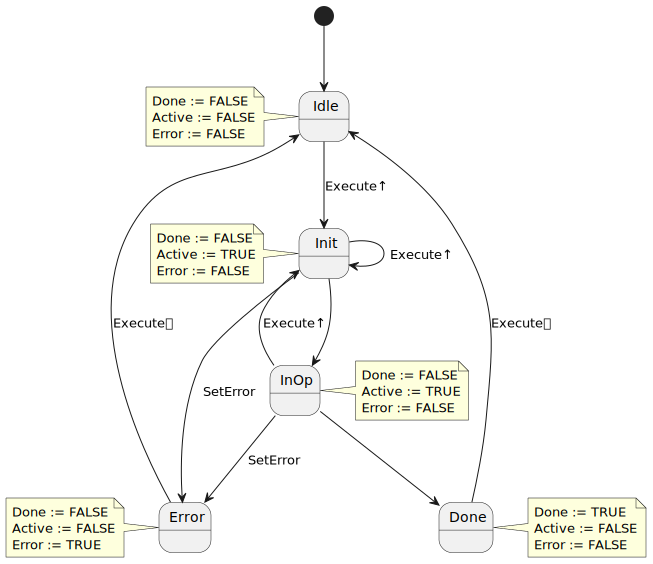
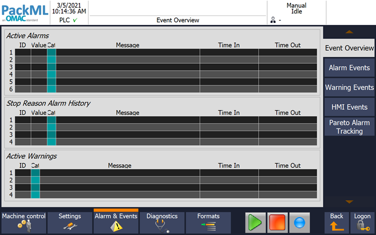

<h1 align="left">
  <br>
  
  <br>
  Industrial Automation Base
  <br>
</h1>

Cours AutB

Author: [Cédric Lenoir](mailto:cedric.lenoir@hevs.ch)

# Modul 05 Robuste Programmierung

*Schlüsselwörter: CASE..OF / ENUM / State Machine / Enable / Execute*

# Inhalt
- Codestruktur mit Finite State Machine und Aufruf von Funktionsblöcken
- Alarmmanagement
- Codierungsregeln

# Allgemein
Es gibt einige Prinzipien, die es Ihnen ermöglichen, **robusten Code** zu schreiben.
Mit ``robust`` meinen wir die **Fähigkeit, die gewünschte Funktion auszuführen**, aber auch die Fähigkeit, **unerwünschtes Verhalten zu vermeiden**, bis hin zum Begriff der Zeit, um einen modischen Begriff zu verwenden, könnten wir von ** sprechen. Nachhaltigkeit**.

Die Originalquelle ist nicht bekannt, es heißt aber: **Code wird viel häufiger gelesen als geschrieben**. Ein Code wird ebenfalls geändert. Die Qualität des Schreibens trägt wesentlich dazu bei, dass ein Code geändert werden kann, ohne dass es zu unerwünschten Nebenwirkungen kommt.

In diesem Modul stellen wir eine Methode vor, die hauptsächlich auf den Erfahrungen des Autors basiert.
Diese Erfahrung gilt als in einer begrenzten Zeiteinheit gültig. Die Codierungstechnik wird sich weiterentwickeln, sobald neue Technologien verfügbar werden.

Ein Funktionsblockobjekt besteht aus einer Struktur und einem Verhalten. Die Struktur wurde in früheren Modulen gesehen, hier konzentrieren wir uns auf das Verhalten.

## Grundlegende Theorie
Das Prinzip ist von der **Moore-Maschine** inspiriert.
In der Computertheorie ist eine Moore-Maschine eine endliche Zustandsmaschine, **FSM**, **Finite-State-Maschine**, deren aktuelle Ausgabewerte ausschließlich durch ihren aktuellen Zustand bestimmt werden.

Im Kontext der Codierung eines **Funktionsblocks** bedeutet dies:
1. Eingaben bearbeiten
2. Führen Sie eine Zustandsmaschine aus.
3. Verwalten Sie Ausgaben basierend auf Zuständen.

### Einträge verarbeiten
In die Bearbeitung der Berichte beziehen wir die Formatierung und ggf. die Überprüfung ihrer Konsistenz mit ein.

### Zustandsmaschine
Wir betrachten eine Kodierung vom Typ ``CASE`` ``selector`` ``OF`` mit der Verwendung einer Aufzählung, ``ENUM`` für den ``selector``. Die Verwendung der Aufzählung garantiert die endliche Anzahl von Zuständen und schränkt das Risiko unbeabsichtigten Verhaltens eines nicht undefinierten Zustands streng ein.

Dieser Ansatz verbietet grundsätzlich die Verwendung von ``ELSE`` in der Typcodierung ``CASE..OF``.

### Verwalten Sie Ausgaben basierend auf Zuständen
Die Ausgabeverwaltung umfasst den Aufruf von Funktionsblöcken, die im Header des betrachteten Moduls instanziiert sind.

> Wir rufen den Funktionsblock **nach** der Zustandsmaschine auf.

> Jede Änderung einer zustandsabhängigen Variablen in CASE..OF gilt als **Programmierfehler**.

> Alarme gelten als Ausgaben und werden am Ende des Codes verarbeitet.

## Pseudo code.
```iecst
FUNCTION_BLOCK FB_PseudCode
VAR_INPUT
    One         : REAL;
END_VAR
VAR_OUTPUT
    ActionOne   : BOOL;
END_VAR
VAR
    needDint    : DINT;
    selector    : E_Color;
    fbActionOne : FB_SetAction;
    fbActionTwo : FB_SetAction;
    fbAlarm     : FB_SetAlarm;          
END_VAR
```
```iecst
//
//  Some input processing
//
needDint := REAL_TO_DINT(One);

//
//  Process State Machine
//
CASE selector OF
    E_Color.green :
        IF needDint > 33 THEN
            selector := E_Color.orange;
        END_IF
    E_Color.orange :
        // Some condition here
        ;
    E_Color.red :
        // Some condition here
        ;
END_CASE

//
//  Process Outputs and FB depending of state
//
fbActionOne(Execute := (selector = E_Color.green)); 
fbActionTwo(Execute := (selector = E_Color.orange));
ActionOne := (selector = E_Color.green) OR (selector = E_Color.orange);

//
//  Process Alarms
// 
fbAlarm(Enable := (selector = E_Color.red));
```
> Der obige Pseudocode ist das wichtigste Element des Semesters. **Auswendig wissen**.

# Modelle aktivieren und ausführen
Bei der objektorientierten Programmierung gibt es mehrere Variationsmöglichkeiten. Einschließlich dessen, was darin besteht, Vererbung, Schnittstellen und Methoden zu verwenden, um grundlegende Funktionsblöcke mit gemeinsamem Verhalten zu definieren. Siehe [unten, Um ein wenig weiter zu gehen](#to-go-a-little-forther). Die beiden genannten Referenzen gehen jedoch über den Rahmen dieses Kurses *basic* hinaus, sie ermöglichen den Nachweis, dass IEC 61131-3 in seiner aktuellen Fassung die Strukturierung von Code mit komplexer Architektur ermöglicht und werden nicht kommentiert.

Das Design durch Funktionsblöcke greift jedoch das erste Prinzip der objektorientierten Programmierung auf, die **Kapselung**. **Um genau zu sein, ist der Funktionsblock eine Klasse, seine Instanz ist ein Objekt**. Andererseits werden wir nicht über Vererbung oder Polymorphismen sprechen. Dies bedeutet, dass die Funktionsblöcke nicht durch Methoden, sondern durch boolesche BOOL-Signale aktiviert werden, die in zwei Hauptkategorien eingeteilt werden können: ``Ausführen`` und ``Aktivieren``.

## InOperation-Modell aktivieren
Typische Verwendung: ein Regler, der kontinuierlich arbeitet. Sobald der Block betriebsbereit ist, erscheint ``InOperation``. Der Regler funktioniert normal.

Der unten erwähnte Funktionsblock [MC_Power](#an-Functional-Block-of-Type-Enable) funktioniert nach dem gleichen Prinzip, lediglich der Ausgang ``InOperation`` wird in ``Status`` umbenannt.

Solange ``Status`` ``TRUE`` ist, bedeutet dies, dass die Achse unter Drehmoment steht. Wenn es eine pneumatische Achse wäre, könnten wir sagen, unter Druck.

### Enable In Operation Base / State machine
<figure>
    
    <figcaption>Function Block Enable InOperation Base</figcaption>
</figure>

### Definition von Zuständen

|State |Id |Description |
|------|---|-------------|
|STATE_IDLE |999 |Starting state of a function block|
|STATE_INIT |1 |Initialization of the function block State runs after the function block starts. All preparations required for the actual operations are made here. A sub-state machine is possible.|
|STATE_INOP| 2 |Working state of the function block In this state, the actual task of the function block is executed.|
|STATE_ERROR| 3 |Error state| State is active after an error occurs. It is exited by resetting ``Enable`` or ``Execute``.|

> Das Festlegen der Enumerationswerte ist optional. Die Angewohnheit, diesen Wert **999** für ``STATE_IDLE`` zu setzen, resultiert aus der Idee, dass eine Variable bei **0** eine Variable sein könnte, die wir vergessen haben zu initialisieren.

### ENUM-Anweisung und Kommentar.
```iecst
{attribute 'qualified_only'}
{attribute 'strict'}
TYPE E_EnableInOperation :
(
    // Starting state of a function block
	STATE_IDLE  := 999,
    // Initialization of the function block State
    STATE_INIT := 1,
    //  Working state of the function block
    STATE_INOP := 2,
    // State is active after an error occurs
    STATE_ERROR := 3
)DINT := STATE_IDLE;
END_TYPE

// Declaration
    eEnableInOperation  :   E_EnableInOperation;

// Use, not that ordre is not important
CASE eEnableInOperation OF
    E_EnableInOperation.STATE_ERROR  :
        ;
    E_EnableInOperation.STATE_IDLE  :
        ;
    E_EnableInOperation.STATE_INIT  :
        ;
    E_EnableInOperation.STATE_INOP  :
        ;    
END_CASE
```

### Pragma
Pragmas sind Kompilierungsanweisungen, die nicht Teil des Programmierstandards sind, aber dem Compiler besondere Bedingungen und Optionen auferlegen.

*Die Codesys-Compiler-Definition übersetzt:*

> *Ein Pragma ist eine spezielle Anweisung im Quellcode einer Anwendung, die die Eigenschaften von Variablen während der Vorkompilierung oder Kompilierung (Codegenerierung) beeinflusst.*

> Es gibt verschiedene Pragmas für unterschiedliche Verwendungszwecke (Beispiel: Initialisieren einer Variablen, Überwachen einer Variablen, Hinzufügen einer Variablen zur Symbolkonfiguration, Erzwingen der Anzeige von Meldungen während des Kompilierungsprozesses und Verhalten einer Variablen unter bestimmten Bedingungen).

Im oben genannten Beispiel standardmäßig hinzugefügt, wenn eine ``ENUM`` über das Kontextmenü hinzugefügt wird.
``{attribute 'qualified_only'}``
``{attribute 'strict'}``.

#### Attribute qualified_only
Im Falle einer ``ENUM`` ist für die Nutzung dieser Komponenten die Angabe des Namens der ``ENUM`` erforderlich.
```iecst
    // This statement cause an error @ compilation if {attribute 'qualified_only'} is used.
    eEnableInOperation := STATE_INIT;
    // This statement is allowed in all cases.
    eEnableInOperation := E_EnableInOperation.STATE_INIT;
```

> Bevorzugen Sie das Schreiben im Stil ``E_EnableInOperation.STATE_INIT``, der immer akzeptiert wird.

#### Attribute strict
Verbietet das Schreiben auf die Zustandsvariable mit einem anderen Typ.
Wir können den Typ lesen, da wir den ``DINT``-Typ erzwungen haben.

```iecst
// Declaration
VAR
    testUnTruc          : DINT;
END_VAR

// Utilisation
    testUnTruc := eEnableInOperation;   // Is allowed
    eEnableInOperation := testUnTruc;   // Compilation error
```

### Eingabe-/Ausgabeverarbeitung.
Ein Funktionsblock vom Typ Enable / InOperation besteht aus mindestens einem Eingang und zwei Ausgängen.

```iecst
// Declaration
VAR_INPUT
    Enable       : BOOL := FALSE;
END_VAR

VAR_OUTPUT
    InOperation  : BOOL;
    Error        : BOOL;
END_VAR

// Definition of Outputs / combinatorial logic
InOperation := (eEnableInOperation = E_EnableInOperation.STATE_INOP); 
Error := (eEnableInOperation = E_EnableInOperation.STATE_ERROR); 
```

Beachten Sie, dass die Ausgaben hier aus den Zuständen erstellt werden.

> Die in den vergangenen Semestern besuchten Kurse zu kombinatorischer Logik, Zustandsmaschinen und Karnaugh-Tabellen sind direkt auf das Output Management anwendbar. Wenn die Anzahl der Zustände zu groß ist, um einfach über die Karnaugh-Tabellen verwaltet zu werden, muss über eine Zerlegung des Problems in mehrere Teilmengen nachgedacht werden.

## Vorlage ``Execute Done``
Funktionsbausteine ​​dieser Art werden für einmalige Aufgaben eingesetzt, die eine Bearbeitungszeit von mehreren Zyklen erfordern. zum Beispiel das Initialisieren der Hardware.

Im folgenden Beispiel wird **MC_RESET** in Motion Control-Anwendungen verwendet, um einen ``ERROR_STOP``-Zustand zu verlassen, der die Achse beispielsweise aufgrund eines übermäßigen Folgefehlers gestoppt hat.

### Execute Done Base/State Machine
<figure>
    
    <figcaption>Function Block Execute Done Base</figcaption>
</figure>

### Definition von Zuständen

|State |Id |Description |
|------|---|-------------|
|STATE_IDLE |999 |Starting state of a function block|
|STATE_INIT |1 |Initialization of the function block State runs after the function block starts. All preparations required for the actual operations are made here. A sub-state machine is possible.|
|STATE_INOP| 2 |Working state of the function block In this state, the actual task of the function block is executed.|
|STATE_DONE| 3 |Processing completed| State indicates that task processing was successfully completed.|
|STATE_ERROR| 4 |Error state| State is active after an error occurs. It is exited by resetting ``Enable`` or ``Execute``.|

### Ein Funktionsblock vom Typ ``Enable``.

Ein Funktionsbaustein vom Typ ``Enable`` wird kontinuierlich aufgerufen, solange das ``Enable``-Eingangssignal wahr ist.
Es gilt im Allgemeinen als aktiv, solange das Ausgangssignal ``InOperation`` oder ``Status`` TRUE ist.
Wenn der Ausgang ``InOperation`` oder ``Status`` wahr ist, ``TRUE``, während der Funktionsblock nicht kontinuierlich aufgerufen wird, gibt es absolut keine Garantie dafür, dass das Signal gültig ist. Dies sollte als Programmierfehler betrachtet werden, der vom Compiler nicht gemeldet wird.

Ein Beispiel für einen Funktionsblock vom Typ ``Enable`` ist ein Regler oder ein Funktionsblock vom Typ ``MC_Power``, der zur Achsensteuerung verwendet wird.

<figure>
    
    <figcaption>MC_Power, Source: <a href="https://www.se.com/ww/en/">Schneider Electric</a></figcaption>
</figure>

C’est une bonne pratique d’équiper un bloc fonctionnel avec ce type de comportement au minimum de l’entrée Enable et de la sortie Active / Status.

> Noter l'entrée/sortie ``VAR_IN_OUT`` de type ``AXIS_REF``. C'est la référence à la structure d'un axe qui fournir toutes les informations dont MC_POWER à besoin.  

|Name   |Type       |Description|
|-------|-----------|-----------|
|Axis   |AXIS_REF   |Axis data structure that unambiguously addresses an axis in the system.|
|Enable	|BOOL	    |Value range: FALSE, TRUE. Default value: FALSE. The input Enable starts or terminates execution of a function block. --> FALSE: Execution of the function block is terminated. The outputs Valid, Busy, and Error are set to FALSE. --> TRUE: The function block is being executed. The function block continues executing as long as the input Enable is set to TRUE.|

|Name   |Type         |Description|
|-------|:------------|-----------|
|Status	|BOOL	      |Value range: FALSE, TRUE. Default value: FALSE. --> FALSE: Power stage is disabled. --> TRUE: Power stage is enabled.|
|Error	|BOOL	      |Value range: FALSE, TRUE. Default value: FALSE. --> FALSE: Function block is being executed, no error has been detected during execution. -->TRUE: An error has been detected in the execution of the function block.|
|ErrorID	|ET_Result	      |This enumeration provides diagnostics information.|

### Ein Funktionsblock vom Typ Execute
Ein Funktionsblock vom Typ ``Execute`` wird grundsätzlich mit der steigenden Flanke des ``Execute``-Eingangs aktiviert.

<figure>
    
    <figcaption>Function Block MC_Reset, Source: <a href="https://www.beckhoff.com/fr-ch/">Beckhoff</a></figcaption>
</figure>

|Name   |Type       |Description|
|-------|-----------|-----------|
|Execute|BOOL	    |The command is executed with a rising edge.|
|Axis   |AXIS_REF   |Axis data structure that unambiguously addresses an axis in the system.|

|Name   |Type         |Description|
|-------|:-----------:|-----------|
|Done	|BOOL	      |TRUE, if the reset was executed successfully.|
|Busy	|BOOL	      |TRUE, as long as the function block is called with Enable = TRUE.|
|Error	|BOOL	      |TRUE, if an error occurs.|
|ErrorID|UDINT	      |If the error output is set, this parameter supplies the error number.|

# Wir bestehen auf dem Dauerruf
Die obigen Absätze dienen einerseits dem Aufbau eines robusten Funktionsblocks, aber auch dem Verständnis der Funktionsweise bestehender Funktionsblöcke.

> Wir verstehen, dass die Execute- oder Enable-Einträge streng genommen keine Aktivierungen des Blocks sind, sondern Befehle der internen Zustandsmaschine.

> Wird der Baustein nicht aufgerufen, kann die Zustandsmaschine nicht arbeiten und die Ausgänge sind nicht mehr gültig.

## Ein Beispiel, das möglicherweise ein Problem darstellt
Betrachten Sie das folgende Codebeispiel: **BAD Practice**.

```iecst
// BAD practice for call of mcReset()
// Abstract of code
CASE eEnableInOperation OF
    E_EnableInOperation.STATE_ERROR  :
        ;
    E_EnableInOperation.STATE_IDLE  :
        mcReset.Execute := FALSE;
        mcReset(Axis := GVL_OneAxis.X_Axis);
    E_EnableInOperation.STATE_INIT  :
        mcReset.Execute := TRUE;
        mcReset(Axis := GVL_OneAxis.X_Axis);
        IF mcReset.Done THEN
            eEnableInOperation := E_EnableInOperation.STATE_IDLE;
        END_IF
    E_EnableInOperation.STATE_INOP  :
        ;    
END_CASE
```
Wenn nach den Vorstellungen des Programmierers alles wie geplant verläuft, wird ``MC_Reset`` im Status ``STATE_INIT`` und dann erneut im Status ``STATE_IDLE`` ausgeführt. Aber im Falle eines anderen Fehlertyps, beispielsweise eines Ausfalls der Stromversorgung der ``X_Achse``, würden wir direkt in den Zustand STATE_ERROR wechseln. **Problem**: Die interne Zustandsmaschine von ``mcReset`` würde nicht mehr aktualisiert. Dies birgt die Gefahr eines unbestimmten Verhaltens, wenn die Ausgänge des Funktionsbausteins ``MC_Reset`` in einem anderen Teil des Programms verwendet werden.

Um diese Unsicherheit zu vermeiden, haben wir es daher vorgezogen, mcReset **an einer Stelle** nach der Zustandsmaschine aufzurufen. Der Befehl ``mcReset.Execute`` ist mit kombinatorischer Logik codiert.

```iecst
// GOOD practice for call of mcReset()
// Abstract of code
CASE eEnableInOperation OF
    E_EnableInOperation.STATE_ERROR  :
        ;
    E_EnableInOperation.STATE_IDLE  :
        ;
    E_EnableInOperation.STATE_INIT  :
        IF mcReset.Done THEN
            eEnableInOperation := E_EnableInOperation.STATE_IDLE;
        END_IF
    E_EnableInOperation.STATE_INOP  :
        ;    
END_CASE
mcReset.Execute := (eEnableInOperation = E_EnableInOperation.STATE_INIT);
mcReset(Axis := GVL_OneAxis.X_Axis)
```
Mit dieser Praxis, der **GUTEN Praxis**, sind wir sicher, dass:
1. ``mcReset.Execute`` ist nur im Status ``E_EnableInOperation.STATE_INIT`` ``TRUE`` und in allen anderen Status von ``eEnableInOperation`` ``FALSE``.
2. Die interne ``mcReset``-Maschine wird immer ausgeführt.
3. *Dieses Beispiel ist theoretisch, da ``MC_Reset`` in der Bewegungssteuerung im Allgemeinen verwendet wird, um das System nach einem Fehler zurückzusetzen*.

## Ein zweites Beispiel, das zwangsläufig ein Problem darstellen kann oder wird
Kehren wir zum Fall einer Zustandsmaschine zurück, die zur Steuerung von Ampeln verwendet wird und in einem vorherigen Modul [Ampeln mit 4 Zuständen](https://github.com/hei-synd-autb/autb-docs/tree /main/AutB_MOD_03_Operation_And_Instruction) gezeigt wurde #exercise-8-ampeln-%C3%A0-4-%C3%A9states).

<Abbildung>
     
     <figcaption>Zustandsdiagramm: 4-Zustands-Ampeln</figcaption>
</figure>

Mit dem folgenden Code: *Einige der Übergänge wurden entfernt, um ein klareres Beispiel zu erhalten*. Im Vergleich zum Beispiel in der zitierten Übung wollte ein neuer Programmierer einen neuen Zustand ``SpecialCase`` hinzufügen.

Das Codierungsbeispiel zeigt, dass es möglich ist, entweder ein grünes Licht oder ein rotes Licht für den Status ``E_StateMachine_typ.SpecialCase`` zu haben.

> **Genau das wollen wir vermeiden**. Ein Maschinenzustand entspricht **einer und nur einer** Ausgangskonfiguration.

> Wir akzeptieren Parameter in einem Zustand, um beispielsweise die Position eines Funktionsblocks zu definieren, aber **wir werden niemals die Execute- oder Enable-Eingänge eines Funktionsblocks direkt in einer Zustandsmaschine verwenden**.

```iecst
CASE eStateMachine OF
     E_StateMachine_typ.Idle:
         ;
         // Irgendein Übergang
         bLightRed := FALSE;
         bLightGreen := FALSE;
     E_StateMachine_typ.Red:
         bLightRed := TRUE;
         bLightGreen := FALSE;
         WENN mySpecialCondition DANN
            eStateMachine := E_StateMachine_typ.SpecialCase
         END_IF
     E_StateMachine_typ.Red_Orange:
         ;
         // Irgendein Übergang
     E_StateMachine_typ.Green:
         bLightRed := FALSE;
         bLightGreen := TRUE;
         WENN mySpecialCondition DANN
            eStateMachine := E_StateMachine_typ.SpecialCase
         END_IF
     E_StateMachine_typ.Orange:
         ;
         // Irgendein Übergang

     E_StateMachine_typ.SpecialCase:
         ;
         // Irgendein Übergang
END_CASE
```

# Andere nützliche Praktiken
## Zustand nm1, vorheriger Zustand
Es kann hilfreich sein, den vorherigen Zustand der Zustandsmaschine zu kennen. Zum Beispiel:

1. Bei der Analyse des Codes, um beispielsweise herauszufinden, welcher Zustand **vor** dem **Fehlerstatus** war.
2. Beim Programmieren zur Aktivierung eines Werts, nicht mehr in einem Zustand, sondern während des **Übergangs**.

Im Beispiel unten:

```iecst
//**********************************************
// Some variables
//**********************************************
VAR
    eEnableInOperation      : E_EnableInOperation;
    eEnableInOperationNm1   : E_EnableInOperation;
    eEnableInOperationMem   : E_EnableInOperation;
    nextStep                : BOOL;
    trigIdleToInit          : R_TRIG;
    countIdleToInit         : DINT := 0;
END_VAR

//**********************************************
// Implementation exemple
//**********************************************
CASE eEnableInOperation OF
    E_EnableInOperation.STATE_ERROR  :
        IF nextStep THEN
            eEnableInOperation := E_EnableInOperation.STATE_IDLE;
            nextStep := FALSE;
        END_IF
    E_EnableInOperation.STATE_IDLE  :
        IF nextStep THEN
            eEnableInOperation := E_EnableInOperation.STATE_INIT;
            nextStep := FALSE;
        END_IF
    E_EnableInOperation.STATE_INIT  :
        IF nextStep THEN
            eEnableInOperation := E_EnableInOperation.STATE_INOP;
            nextStep := FALSE;
        END_IF
    E_EnableInOperation.STATE_INOP  :
        IF nextStep THEN
            eEnableInOperation := E_EnableInOperation.STATE_ERROR;
            nextStep := FALSE;
        END_IF
END_CASE

//**********************************************
// Routine to get value of eEnableInOperationNm1
//**********************************************
IF eEnableInOperation <> eEnableInOperationMem THEN
    eEnableInOperationNm1 := eEnableInOperationMem;
END_IF
eEnableInOperationMem := eEnableInOperation;

trigIdleToInit(CLK := (eEnableInOperation = E_EnableInOperation.STATE_INIT)    AND
                      (eEnableInOperationNm1 = E_EnableInOperation.STATE_IDLE));

//**********************************************
// Routine to get transition
//**********************************************
IF trigIdleToInit.Q THEN
   countIdleToInit := countIdleToInit + 1;
END_IF
```
1. Die Variable ``eEnableInOperationNm1`` speichert den vorherigen Zustand.
2. Der Wert ``trigIdleToInit.Q`` zeigt einen Übergang von ``STATE_IDLE`` zu ``STATE_INIT`` an.

## Statustext
Selbst wenn die in der Zustandsmaschine verwendeten Aufzählungen so explizit wie möglich sind, sind sie für ein externes System, einschließlich **OPC-UA**, oft schwer zu lesen und für einen Bediener oder Wartungstechniker, der den Status leicht verstehen muss, wahrscheinlich nicht verständlich des Programms, um schnell eingreifen zu können.

Es gibt eine relativ einfache Methode zur Diagnose der Maschine, die darin besteht, leicht detaillierte Informationen bereitzustellen, wobei wir mit leicht detailliert einen einzelnen Satz meinen.

```iecst
//**********************************************
// Some variables
//**********************************************
VAR
    // If a size is not defined, then CODESYS allocates 80 characters by default
    strStateInfo    : STRING := '';
END_VAR

//**********************************************
// Implementation exemple
//**********************************************
CASE eEnableInOperation OF
    E_EnableInOperation.STATE_ERROR  :
        strStateInfo := 'Error while enabling InOperation';
    E_EnableInOperation.STATE_IDLE  :
        strStateInfo := 'State idle, wait for next step condition';
    E_EnableInOperation.STATE_INIT  :
        strStateInfo := 'State idle, waiting for init condition';
    E_EnableInOperation.STATE_INOP  :
        strStateInfo := 'In operation';
END_CASE
```

> Wir ignorieren hier eine vollständige IDE, die es in bestimmten Fällen ermöglichen wird, die Diagnose in mehreren Sprachen verfügbar zu machen.


## Unterschätzen Sie niemals die Lesehilfen des Programms
Dieses Modul bietet eine Reihe von Programmierempfehlungen, die normalerweise nicht in SPS-Programmierhandbüchern enthalten sind.

In vielen Fällen werden die ersten Fälle eines Automatisierungsingenieurs in einer bestehenden Struktur stattfinden. In diesem Fall können die oben aufgeführten Regeln abweichen.

Wenn keine Struktur vorhanden ist, kann der Automatisierungsingenieur davon profitieren, sich von den oben genannten Regeln inspirieren zu lassen und sie dann zu verbessern, um sie an seine Bedürfnisse anzupassen.

> Der für die Robustheit des Programms notwendige zusätzliche Code ist ein **Produktivitätsgewinn**.

# Alarme, Ereignisse.
Alarme sind ein wesentlicher Bestandteil robuster Programmierung, werden hier jedoch nur zu Informationszwecken erwähnt, da sie auf Maschinenebene (Einheit) wirken, die in diesem Kurs nicht behandelt wird.

> Erstens ist der Begriff Alarm nicht angemessen, ein Alarm sollte als eine der drei Komponenten eines Ereignisses betrachtet werden. Der Begriff **Ereignis** wäre passender.

## Beispiel für ein Ereignis

Betrachten Sie eine Maschine, **Einheit**, die mithilfe eines S88-Modells wie unten definiert ist.

<figure>
    
    <figcaption>Machine with S88 architecture</figcaption>
</figure>

Wenn ein Achsenbefehl auf CM-Ebene verwendet wird, Steuermodul. Angenommen, dass der linke Servo blockiert wird, generiert der für ``CM_LeftServo`` verwendete Funktionsblock ein Ereignis. Dieses Ereignis könnte durch eine ``CM_LeftServo.Overheated``-Variable vom Typ ``BOOL`` ausgelöst werden.

Schließlich wird das Ereignis an ein Überwachungssystem gesendet, das in seiner klassischen Form ein Touchscreen ist, der dem Bediener zur Verfügung steht.

<figure>
    
    <figcaption>Exemple de système d'affichage des alarmes.</figcaption>
</figure>

Die Verarbeitung von Alarmen hängt wenig vom SPS-Teil ab. Das vollständige Schreiben eines Alarmmanagementsystems ist eine komplexe Aufgabe und in den meisten Fällen verwendet der Automatisierungsingenieur eine Alarmbibliothek, die ihm eine Reihe von Funktionsblöcken zur Verfügung stellt, die an die Umgebung, in der er arbeitet, angepasst sind.
Der folgende Code ist von einer Original-Siemens-Bibliothek inspiriert, die für eine dedizierte Hardwareumgebung entwickelt wurde.

> Bibliotheken sind Pakete von Funktionsblöcken, die mit dem verglichen werden können, was wir in Python über einen ``import``-Befehl erhalten würden.

### codiert
Wir haben ein Mindestmaß an Verständnis dafür, was ein Funktionsblock ist. Wir können den Punkt anhand eines Codebeispiels veranschaulichen, was ein **Ereignis** sein könnte.

```iecst
//
// Declaration of a Function Block event
//
VAR
    instEventServoLeft   : FB_Event;
END_VAR

//
//  Use of instance ïnstEventStop of type FB_Event
//
instEventServoLeft(Enable        := CM_LeftServo.Overheated,
                   Event_Type    := enumEvent.Stop,
                   MessagePrefix := emBagForming.cmLeftServo,
                   MessageCode   := 'Motor overheating',
                   stsActive     => emBagForming.cmLeftServo.SetEventStop.stsEventActive,
                   stsLatched    => emBagForming.cmLeftServo.SetEventStop.stsEventLatched,
                   inEventStatus := emBagForming.Alarm);
```
### Kommentar
|Name          |Type       |Description|
|--------------|-----------|-----------|
|Enable        |BOOL       |Activation of FB instEventServoLeft|
|Event_Type    |ENUM       |Can be an alarm, a warning or a status, depending of severity, see below|
|MessagePrefix |IN_OUT     |Reference to the structure, Equipment Module, where the event is. Can be used to return more information about the hardware generating the event.|
|MessageCode   |STRING     | Text for details about this event.|
|stsActive     |BOOL       | Bool of a STRUCT, if TRUE, means event still active, *motor still hot...*|
|stsLatched    |BOOL       |Bool of a STRUCT, if TRUE, means event not acknoledged
|inEventStatus |IN_OUT     |Reference to the structure with all alarms.|

Beim Aufruf dieses Funktionsblocks werden wir:

1. Aktivieren Sie das Ereignis mit ``CM_LeftServo.Overheated``.
2. Definieren Sie die Reaktion des Systems auf das Ereignis, hier einen **Stop** mit ``enumEvent.Stop``.
3. Definieren Sie die Ereignismeldung mit ``emBagForming.cmLeftServo`` und ``Motor. ``Überhitzung``.
4. stsEventActive gibt den Alarmstatus zurück. Das Bit verschwindet, wenn der Motor abkühlt.
5. stsEventLatched bleibt aktiv, bis der Bediener den Alarm bestätigt. Dadurch weiß er, warum seine Maschine stehen geblieben ist, auch wenn der Motor inzwischen abgekühlt ist. Diese Informationen können auch verwendet werden, um sicherzustellen, dass dem Betreiber die Informationen zur Verfügung standen. *Leider können wir grundsätzlich nicht garantieren, dass der Alarm gelesen wurde, bevor er abgewiesen wird*.
6. Bietet Zugriff auf die Struktur, die alle Alarme gruppiert.

> Event-Management-Umgebungen sind oft für den Umgang mit mehreren Sprachen konzipiert. Die Nachrichten beziehen sich somit auf separate Textdateien.

## Event Manager
**Fehler**... ein Alarm ist kein Fehler! Ein Alarm ist mit einem bestimmten Ereignis verknüpft, das auf Maschinenebene referenziert wird. Eine Division durch Null könnte ein Fehler sein, allerdings bestünde in diesem Fall die Gefahr eines ``Absturzes`` des Automaten.
Ein Fehler kann durch ein Element der Maschine ausgelöst werden, beispielsweise eine Unterbrechung des Kommunikationsbusses. In diesem Fall wird der Fehler durch einen Alarm signalisiert.

### Alarm
Alarme deuten auf ein ernstes Problem mit der Maschine hin, das in der Regel die Produktion verhindert oder ein Sicherheitsrisiko darstellt. Alarme werden einer ``Kategorie`` zugeordnet, die es der Zustandsmaschine ermöglicht, sofort auf einen Alarm zu reagieren, indem sie in den entsprechenden Zustand wechselt.

> Beispiel: **CM_LeftServo.Overheated**. In diesem Fall stoppt der Achsbefehl den Motor und übermittelt Informationen an das System. Es liegt am Programmierer, eine Instanz von ``FB_Event`` hinzuzufügen, ein Alarmstufenereignis einzurichten und dann zu entscheiden, was es bewirkt. Sollten wir nur ein einzelnes Gerät, nur die Maschine oder die gesamte Produktionslinie stoppen?

### Warnung
Warnungen informieren den Bediener darüber, dass etwas nicht stimmt. Warnungen haben im Allgemeinen keine unmittelbaren Auswirkungen auf die Produktion, erfordern jedoch jetzt oder in naher Zukunft ein Eingreifen des Bedieners.

Beispiel: **CM_LeftServo.WarningTemperature**, das bedeutet, dass sich die Temperatur dem Grenzwert nähert. Die an den Bediener übermittelten Informationen können folgender Art sein: *Überprüfen Sie, ob der Beutelformmechanismus funktioniert*. **Ein Alarm, der kein Eingreifen des Bedieners erfordert, ist absolut nutzlos**.

### Status
Die Status weisen nicht darauf hin, dass mit der Maschine etwas nicht in Ordnung ist, sie liefern dem Bediener jedoch zusätzliche Informationen. Typischerweise teilen sie dem Bediener mit, was zu tun ist, um die Maschine in den Betriebszustand zu versetzen.

Beispiel: **CM_LeftServo.MotorDisconnected**, es ist durchaus möglich, dass ein Achsenbefehl erkennt, ob ein Motor angeschlossen ist. Bei Stillstand der Maschine bedarf dieses Ereignis keiner sofortigen Maßnahme, es besteht keine Gefahr. Andererseits dient es als Warnung, dass die Maschine nicht neu gestartet werden kann, bis das Problem behoben ist.

## Um die Alarme zusammenzufassen
- Alarme sind ein wesentlicher Bestandteil einer robusten Programmierung.
- Die Alarme hängen von der Softwareumgebung der Maschine ab, weshalb sie in diesem Kurs nicht detailliert beschrieben werden, sondern auf der Ebene des **Control Module** oder **Equipement Module**bleiben.
- Jeder Alarm ist einzigartig und kann mit einer Dokumentation verknüpft werden. Das bedeutet, dass wir alle Alarminstanzen eines Programms verfolgen können müssen, aber auch die Ebene ``Event_Type``, die betroffene Komponente ``MessagePrefix`` und die Art des Fehlers ``MessageCode``. , sind Konstanten und keine Variablen, *Sprachtyp ausgenommen*.
- Zu viele Alarme oder unnötige Alarme sind Programmierfehler.

Der **ISA 18.2**-Standard gibt eine Empfehlung zur Anzahl der vom Betreiber tolerierbaren Ereignisse.

|Very likely to be acceptable	   |Maximum manageable|
|----------------------------------|------------------|
|~150 alarms per day	           |~300 alarms per day|
|~6 alarms per hour (average)	   |~12 alarms per hour (average)|
|~1 alarm per 10 minutes (average) |~2 alarms per 10 minutes (average)|

Liegen unnötige Alarme vor, gewöhnt sich der Bediener daran, diese zu ignorieren und zu löschen, ohne sie zu lesen.

Wenn es zu viele sind...

### *A decision support system for identifying abnormal operating procedures in a nuclear power plant, by MH Hsieh · 2012*

*For instance, the Chernobyl disaster in 1986 in the Soviet Union was caused by human errors that dealt with decision making, receiving information, and action selection.*

*Although digital systems are more precise, too much information and too many alarms may make it difficult for the operator to comprehend what is actually happening in the plant. For this reason, some latent problems associated with the digital main control systems must be solved.*

# [Coding Rules](./Coding_rules.md)

# [Exercices](./Mod05_Exercices.md)

# Pour aller un peu plus loin

-   [Stefan Henneken, IEC 61131-3: The State Pattern](https://stefanhenneken.net/2018/11/17/iec-61131-3-the-state-pattern/#more-1285)

-   Design Patterns: Elements of Reusable Object-Oriented Software