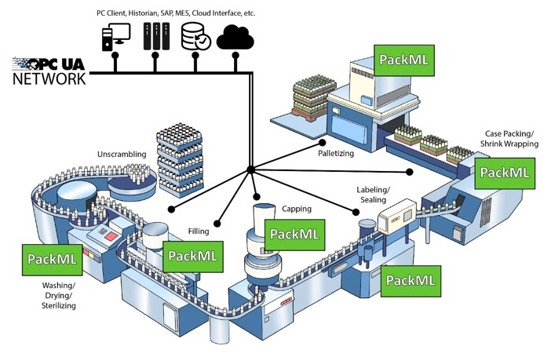

<h1 align="left">
  <br>
  
  <br>
  Industrial Automation Base
  <br>
</h1>

Cours AutB

Author: [Cédric Lenoir](mailto:cedric.lenoir@hevs.ch)

# Module 06 Introduction to PackML

*Keywords:* **PackML PackTag**

# Préambule
Dans la suite des modules, nous allons aborder en pratique et en théorie, le pilotage d'axes électriques.

L'une des particularités du pilotage d'axes, est que le niveau de complexité augmente légérement et demande rapidement une certaine méthodologie afin de garantir la robustesse du système piloté, mais aussi afin de gagner en efficacité lors du codage. C'est la raison pour laquelle nous présentons **PackML** dans ce cours. Nous n'aborderons qu'une partie de l'ensemble de PackML, celle dédiée à la gestion des états de la machine. Les autres aspects, modes de fonctionnement, PackTAG ne seront présentés qu'à titre de culture générale de l'automation.

#	PackML
Le document de référence qui décrit cette section [ISA-TR88.00.02-2022, Machine and Unit States: An implementation example of ISA-88.00.01](https://www.isa.org/products/isa-tr88-00-02-2022-machine-and-unit-states-an-imp) est soumis à un copyrigth et ne peut être distribué librement.

Dans la pratique, on trouve des implémentation de la norme PackML chez plusieurs fournisseurs de produits IEC61131-3, dont par exemple Siemens avec un exemple utilisable directement sur S7-1500.

[CPG Template for S7-1500](https://support.industry.siemens.com/cs/attachments/109475572/CPG_Template_SIMATIC_V1_0_en.pdf)

[LPMLV30 for SIMATIC](https://support.industry.siemens.com/cs/document/49970441/simatic-simotion-omac-packml-v3-machine-and-unit-states?dti=0&lc=en-US)

On pourra aussi se référer à l'[OMAC, The Organisation for Machine Automation and Control](https://www.omac.org/). 

# PackML State Machine
##	Identifying a Unit/Machine (rappel et extension)
Une Unit / machine est définie comme un ensemble d'équipements physiques et de fonctions de commande qui exécutent une ou plusieurs fonctions de traitement majeures.

Une **unité** / **machine** peut être une seule machine ou un sous-ensemble d'une ligne d'emballage entière.

Une Unit / machine est définie fonctionnellement ou physiquement via une **interface** unité / machine commune.

Le gestionnaire d'état de l'interface PackML fournit une interface de communication unique entre les HMI ou autre système de commande externe et l'unité / la machine, comme illustré à la Figure « One Unit ».

<figure align="center">
    
    <figcaption>One Unit</figcaption>
</figure>

Une erreur sur une Unit / machine peut arrêter tous les sous-systèmes de la « Unit » / machine et générer une alarme ou un avertissement. Souvent, le circuit de sécurité définit la frontière d'une Unit / machine dans une ligne d'emballage.

Si une erreur sur une Unit / machine arrête seulement une partie des sous-systèmes et génère une alarme ou un avertissement, le sous-système individuel peut être défini comme une unité individuelle, mais cela n'est pas obligatoire.

Tips : Une interface PackML est définie pour chaque partie d'une unité qui gère un produit spécifique. Une Unit / machine ne peut traiter qu'un seul ordre de fabrication à la fois.

> Une unité / machine peut avoir 3 contrôleurs d'entraînement internes mais est perçue comme une Unit / machine à partir d'une situation d'utilisateur et d'un accès opérateur.

> Un dépalettiseur peut être constitué de convoyeurs d'alimentation, d'un robot, de convoyeurs de sortie et est considéré comme une unité / machine, comme le montre la figure PackML Machine.

<figure align="center">
    
    <figcaption>A Pack ML machine made of different Equipment Modules</figcaption>
</figure>

Visuellement, cela pourrait ressembler à ceci:

<figure align="center">
    
    <figcaption>Image d'origine www.mikron.com Tray Handler</figcaption>
</figure>

Pour une Unit / machine qui exécute plus d'un processus indépendant, une interface PackML est requise pour chacun des processus indépendants. Par exemple, un palettiseur avec deux cellules d'emballage indépendantes dans la même ligne, doit avoir deux interfaces PackML.

## Pouquoi des états standard ?
<figure align="center">
    
    <figcaption>PackML, Why Standard States, Source: opcconnect.opcfoundation.org
    </figcaption>
</figure>

## The PackML interface State Model
La syntaxe du PackML State Model
Le modèle d'état de l'interface PackML repose sur deux éléments principaux :
### Commands
- Un déclencheur qui fait passer la « Unit » / machine d'un état à un autre (par exemple un bouton poussoir sur la « Unit » / machine ou une commande externe envoyée via le réseau, ou encore une alarme interne)

###	States
- **Acting States** (un état dans lequel l'unité / la machine effectue une action)
- **Waiting States** (situation stable pour l'unité / la machine). Un état d'attente nécessite une commande pour entrer dans l'état suivant.
- **Execute** est un état particulier qui combine un **Wait state** avec un **Acting State**, on parle aussi de **Dual State**.
 
<figure align="center">
    
    <figcaption>Syntax of PackML State Machine</figcaption>
</figure>

De manière générale, pendant un **Wait state**, rien ne se passe, ou du moins, il n’y a pas d’action de la machine au niveau *Procedural*. Cependant, rien n’empêche qu’une bande d’alimentation continue à avancer, et même qu’elle s’arrête, si la commande d’arrêt est interne au module qui la contrôle.

Il suffit qu’un seul module lance une commande, par exemple **Stop**, pour que tous les modules passent dans l’état suivant en même temps.

Lorsque les modules sont en **Acting State**, on a une action concrète des modules, ils exécutent la séquence programmée pour cet état. Par exemple, les différents actionneurs se positionnent dans leur état initial, pour être prêt pour le ``Execute``.

Lorsque tous les modules ont terminé leur séquence et activé leur statut **State Complete**, et **seulement à cet instant**, tous les modules passent à l’état suivant.

## Le PackML Interface State Model
 
<figure align="center">
    
    <figcaption>PackML State Model</figcaption>
</figure>

Il est recommandé d’implémenter l’ensemble des **17 états** du State Model.

En principe, on peut supprimer certains états, mais il est **interdit d'en ajouter**, *à l'exception bien entendu des états internes de chacun des 17 états*.

> Dans l'image ci-dessus, **SC** signifie **State Complete**, cela signfie que le module concerné a terminé la tâche qui lui était assignée dans l'état actif.

###	Suppression d’états
**Les 17 états sont implémentés!!!**
Selon les implémentation, il est possible de désactiver certains états, parmi lesquels Complete, Completing, Suspending, Suspended, Unsupending, Holding, Held et Unhoding, notamment en mode manuel.

Certaines implémentations, comme Siemens, permettent de configurer les états actifs.

> Dans un cas extrême, on pourra se contenter d'un minimum d'états, dont **Stopped et Execute**. Une fois maîtrisé, le concept pourra aussi être utilisé dans des installations très simples.

<figure align="center">
    
    <figcaption>PackML The Minimum State Machine</figcaption>
</figure>

De manière générale, tous les états **Acting** peuvent être supprimés. Avec les conditions suivantes :

|Precondition	    |Requierment       |
|-----------------|------------------|
|If Completing state available...	|Complete state mandatory.|
|If Suspending state available...	|Suspended state mandatory.|
|If Un-Suspending state available...	|Suspended state mandatory.|
|If Aborting state available...	|Aborted state mandatory.|
|If Clearing state available...	|Aborted state mandatory.|
|If Resetting state available...	|Idle state mandatory.|
|If Idle state available...	|Resetting state mandatory.|


###	Etats supplémentaires
Je conseille de les encapsuler dans des états intermédiaires. Mais e**n aucun cas de modifier la configuration générale**.

### Implémentation Custom
Il est bien entendu possible de partir d’une feuille blanche pour écrire une implémentation particulière.

Le but du PackML est de gagner en efficacité. Je conseille donc de partir d’une implémentation existante, y compris au niveau de sa documentation.


##	En résumé

|State    |Description                |
|---------|---------------------------|
|EXECUTE	|**Acting State** - L'unité / la machine est dans un état de fonctionnement stable - l'unité / la machine est en train de produire.|
|STOPPED / IDLE / COMPLETE	|**Wait State** - Un état stable utilisé pour identifier qu'une unité / machine a atteint un ensemble défini de conditions. Dans un tel état, l'unité / la machine maintient un état jusqu'à ce qu'une commande provoque une transition vers un Acting State. L'unité / la machine est alimentée et stationnaire.|
RESETTING / STARTING / SUSPENDING / UNSUSPENDING / COMPLETING / HOLDING / UNHOLDING / ABORTING / CLEARING / STOPPING	|**Acting State** - Un état qui représente une activité de traitement, par exemple l'accélération de la vitesse. Cela implique l'exécution unique ou répétée d'étapes de traitement dans un ordre logique, pendant un temps fini ou jusqu'à ce qu'une condition spécifique soit atteinte, par exemple dans l'état Starting, la qualité et la validité des données reçues sont vérifiées, avant de monter en vitesse pour exécution.|
|HELD |**Wait State** - Un état qui représente un état d'erreur sur l'unité qui générera une alarme ou un avertissement. Dans cet état, l'unité / la machine ne produit pas, jusqu'à ce que l'opérateur effectue une transition vers l'état EXECUTE. L'état maintient les opérations de l'unité / de la machine pendant que le blocage du matériau est éliminé, ou une correction sûre d'un défaut d'équipement avant la reprise de la production.|
|SUSPENDED	|**Wait State** - Dans cet état, l'unité / la machine ne produit rien. Elle s'arrêtera de fonctionner ou continuera à fonctionner sans produire jusqu'à ce que les conditions de processus externes reviennent à la normale, moment auquel l'état SUSPENDED passera à l'état UNSUSPENDING, généralement sans aucune intervention de l'opérateur.|
|ABORTED|**Wait State**, La machine est à l'arrêt, toutes les énergies sont coupées sur les actuateurs. C'est l'état de la machine après la mise sous tension ou après un arrêt d'urgence.|

> La différence entre **Held** et **Suspended** est surtout à comprendre du point de vue de l’analyse de la performance de la machine (Unit).
Dans le cas du **Suspended**, la machine est en attente de conditions **externes**. Par exemple, alimentation en produit, machine en amont ou en aval pas prête. Cela signifie que quand on analyse la performance de la machine, même si la machine passe 50% de son temps en **Suspended**, la machine, l’unité elle-même n’est pas en cause.

<figure align="center">
    
    <figcaption>PackML Held vs Suspended</figcaption>
</figure>

> Dans le cas du **Held**, cela signifie en général qu’**un des élément de la machine** a produit un évènement qui a emmené la machine dans cet état. Si la machine passe 50% de son temps en **Held**, il sera sans doute nécessaire d’analyser la cause de cet état.

<figure align="center">
    
    <figcaption>PackML states Internal & External conditions</figcaption>
</figure>

## En détail
Le guide Part 1: PackML Interface State Manager cité ci-dessus est très complet et sera utile pour un travail de détail.
Le résumé ci-dessous est inspiré directement du document ISA–TR88.00.02.
ISA Technical Report TR88.00.02 Machine and Unit States. Comme la majorité des documents ISA ou IEC, ceux-ci ne sont pas libre de droit. Les droits de reproductions sont restreints. Les tarifs sont limités par rapport à leur utilité, (180 USD pour ce document) ce qui représente environ 1 heure de travail pour un ingénieur.  

###	Stopped
**State Type** *Wait*

La machine est alimentée et stationnaire après avoir terminé l'état STOPPING. Toutes les communications avec les autres systèmes fonctionnent (le cas échéant). Une commande RESET provoquera une sortie de STOPPED à l'état RESETTING.

###	Starting
**State Type** *Acting*

Cet état fournit les étapes nécessaires pour démarrer la machine et est le résultat d'une commande de type de démarrage (locale ou distante). Suite à cette commande, la machine commencera à s'exécuter.

###	Idle
**State Type** *Wait*

C'est un état qui indique que la RESETTING est terminée. Cet état maintient les conditions de la machine qui ont été atteintes pendant l'état de RESETTING et effectue les opérations requises lorsque la machine est au repos.

###	Suspending
**State Type** *Acting*

Cet état est le résultat d'un changement des conditions surveillées en raison des conditions ou des facteurs du processus. L'événement déclencheur entraînera une suspension temporaire de l'état EXECUTE. SUSPENDING est généralement le résultat de la privation de matières en amont (c.-à-d. Alimentation du conteneur, alimentation en boisson, alimentation en couronne, alimentation en lubrifiant, etc.) qui se trouve en dehors de la plage de contrôle dynamique de la vitesse ou d'un blocage de la sortie en aval qui empêche la machine de passer EXECUTE, soit en production régulière continue. Pendant la séquence contrôlée de SUSPENDING, la machine passera à un état SUSPENDED.
L'état SUSPENDING peut être forcé par l'opérateur.

###	Suspended
**State Type** *Wait*

La machine peut fonctionner à une vitesse de consigne appropriée, mais aucun produit n'est produit pendant que la machine attend que les conditions de processus externes reviennent à la normale. Lorsque les conditions de processus incriminées reviennent à la normale, l'état SUSPENDED passera à UNSUSPENDING et continuera donc vers l'état EXECUTE normal.

>L'état SUSPENDED peut être atteint suite à des conditions de processus **externes** anormales et diffère de HELD. HELD est généralement le résultat d'une demande de l'opérateur ou d'une condition de défaut de machine détectée automatiquement qui doit être corrigée avant qu'une demande d'opérateur de transition vers l'état UNHOLDING ne soit traitée.

###	Unsuspending
**State Type** *Acting*

Cet état est le résultat d'une demande de type machine depuis l'état SUSPENDED pour revenir à l'état EXECUTE. Les actions de cet état peuvent inclure l'accélération des vitesses, la mise en marche des aspirateurs et le réengagement des embrayages. Cet état est effectué avant l'état EXECUTE et prépare la machine à l'état EXECUTE.

> A la différence de l’action UNHOLD, UNSUSPENDING peut être initié automatiquement. Par exemple lorsque des pièces sont à nouveau disponibles à l’entrée de la machine.

###	Execute

**State Type** *Dual*

Une fois que la machine traite des matériaux, elle est considérée comme étant en cours d'exécution ou dans l'état EXECUTE. Différents modes de la machine entraîneront des types spécifiques d'activités EXECUTE. Par exemple, si la machine est en mode Production, EXECUTE entraînera la production de produits, tandis qu'en mode Clean Out, l'état EXECUTE se réfère à l'action de nettoyage de la machine.

###	Stopping
**State Type** *Acting*

Cet état exécute la logique qui amène la machine à un arrêt contrôlé tel que reflété par l'état STOPPED. Le STARTING normal de la machine ne peut être lancé que si la RESETTING a eu lieu.
Remarque : dans le domaine de la sécurité des entraînements, on retrouve la notion de SOS, Safe Operating Stop. SOS est à différentier du STO, Safe Operating Stop de l’arrêt d’urgence ou commande Abort qui implique en général une mise « hors couple » des entraînements.

###	Aborting
**State Type** *Acting*

L'état ABORTED peut être entré à tout moment en réponse à la commande Abort ou à l'apparition d'un défaut machine. La logique d'abandon amènera la machine à un arrêt sûr et rapide. Le fonctionnement de l'arrêt d'urgence entraînera le déclenchement de la machine par son système de sécurité. Il fournira également un signal pour déclencher l'état ABORTING.

> Dans le domaine des entrainements électriques, la commande **Abort** amène en général les entraînement dans l’état **STO**, *Safe Operating Stop*, c'est à dire que l'absence de mouvement est garanti sans obligatoirement supprimer le courant actif sur les moteurs.

Au niveau de la logique interne du système, l’état ABORTING devrait avoir passé par la même logique que l’état STOPPING, ceci afin d’arrêter les axes de manière contrôlée.
Le délai accordé par le système pour exécuter l’état ABORTING dépend de critères de sécurité.

###	Aborted
**State Type** *Wait*

Cet état conserve les informations sur l'état de la machine relatives à la condition d'abandon. La machine ne peut sortir de l'état ABORTED qu'après une commande Clear explicite, puis une intervention manuelle pour corriger et réinitialiser les défauts machine détectés.

###	Holding
**State Type** *Acting*

Lorsque la machine est dans l'état EXECUTE, la commande Hold peut être utilisée pour démarrer la logique HOLDING qui amène la machine à un arrêt contrôlé ou à un état qui représente HELD pour le mode de contrôle de l'unité particulier. 

Une machine peut passer dans cet état soit lorsqu'un défaut interne de l'équipement est détecté automatiquement, soit par une commande opérateur. La commande Hold offre à l'opérateur un moyen sûr d'intervenir manuellement dans le processus (comme le retrait d'une bouteille cassée de l'alimentation) et de redémarrer l'exécution lorsque les conditions sont sûres.

Pour pouvoir redémarrer correctement la production après l'état HOLD, tous les points de consigne de processus pertinents et l'état de retour des procédures au moment de la réception de la commande Hold doivent être enregistrés dans le contrôleur de la machine lors de l'exécution de la procédure HOLDING.

> Une des difficulté de l’état HOLDING est d’amener la machine dans un état suffisamment stable pour permettre un retour à l’état EXECUTE sans devoir repasser par une phase d’initialisation, RESETTING.

###	Held
**State Type** *Wait*

L'état HOLD maintient le fonctionnement de la machine pendant que les blocages de matériau sont éliminés, ou pour arrêter le débit pendant qu'un problème en aval est résolu, ou pour permettre la correction sûre d'un défaut d'équipement avant que la production puisse reprendre.

###	Unholding
**State Type** *Acting*

L'état UNHOLDING est une réponse à une commande d'opérateur pour reprendre l'état EXECUTE. L'émission de la commande Unhold récupérera les points de consigne enregistrés et renverra les conditions d'état pour préparer la machine à revenir à l'état EXECUTE normal.
> Une commande d'opérateur Unhold est toujours requise et UNHOLDING ne peut jamais être lancé automatiquement.

###	Completing
**State Type** *Acting*

Cet état est une réponse automatique de l'état EXECUTE. Le fonctionnement normal est terminé (c.-à-d. Le traitement à l'entrée s'arrêtera).
>Exemple : une machine doit produire 2000 assemblages, une fois que ce nombre atteint, une procédure est mise en route pour évacuer les pièces qui se trouvent encore dans la machine et ne sont plus nécessaires pour produire ses assemblages.

###	Complete
**State Type** *Wait*

La machine a terminé l'état COMPLETING et attend maintenant une commande Reset avant de passer à l'état RESETTING.

###	Resetting
**State Type** *Acting*

Cet état est le résultat d'une commande RESET à partir de l'état STOPPED ou COMPLETE. RESETTING amènera généralement une machine générer un signal visuel ou sonore et à placer la machine dans un état où les composants sont sous tension en attendant une commande START.

**Exemple** : dans l’état STOPPED ou COMPLETE la machine peut être mise dans un état de basse consommation (et de bas volume sonore). Dans l’exemple d’un vibreur rotatif et/ou linéaire on pourra mettre sous tension les différents éléments avec l’activité RESETTING. L’activité STARTING servira à emmener les pièces jusqu’en sortie du vibreur linéaire.
 
<figure align="center">
    
    <figcaption>PackML Resetting, source www.icm-automation.com</figcaption>
</figure>

###	Clearing
**State Type** *Acting*

Initié par une commande d'état pour effacer les défauts qui ont pu se produire lors de l'ABORTING, et qui sont présents dans l'état ABORTED avant de passer à l'état STOPPED.

>Dans le cas de commandes d’entrainement électriques, l’état ABORTED signifie souvent que les moteurs sont mis hors couple, **STO**, **Safe Torque Off**, par le circuit de sécurité. Une des activité de la commande CLERARING peut être de remettre les moteurs sous tension. **STO** Signifie que le couple du moteur, à savoir le courant, est déconnecté de manière sûre.

## Les commandes

- Les commandes sont au nombre de 9. Il suffit de se référer à la figure du PackML State Model. Toute description supplémentaire semble superflue. Dans la formalisation du PackTag, leur valeur va de 0, pas de commande, à 9.

- Le tableau ci-dessous est donné à titre indicatif.

- Certaines commandes peuvent être des combinaisons logiques, par exemple les commandes **Clear** et **Reset** peuvent utiliser le même bouton.

- Beaucoup de commandes, par exemple Hold, Stop, Abort sont générées par des niveaux d’alarmes.

>Pour rappel, dans une machine, chaque alarme doit posséder un numéro d’identification unique. De même, chaque alarme liée à une commande générera une commande unique.

|Command	|N° PackML	|External interface	|Soft push Button	|Hard Push Button	|Name of button|
|---------|-----------|-------------------|-----------------|-----------------|--------------|
|No Command|0|	Optional	|YES||	 	n/a|
|Reset|	1|	Optional	|YES	 	||Reset|
|Start|	2|	Optional	|YES	 	||Start|
|Stop|	3|	Optional	|YES	 	||Stop|
|Hold|	4|	Optional	|YES	 	||n/a|
|Unhold|	5|	Optional|	YES	 	||Restart|
|Suspend|	6|	YES	|YES	 	||n/a||
|Unsuspend|	7|	YES	|YES	 |	|n|/a|
|Abort|	8|	Optional|	 	|YES	|E-Stop|
|Clear|	9|	Optional	|YES	| 	|Reset (E-Stop)|

## Remote

<figure align="center">
    
    <figcaption>PackML remote commands</figcaption>
</figure>

###	PACKML STATE MODEL, EXEMPLE DE BOUTONS DE COMMANDE

Les boutons sont un exemple d’extension, ils sont par exemple présents dans l’implémentation Siemens. Ces boutons sont simplement l’équivalent de commandes PackML
- Vert	Start
- Noir	Stop
- Bleu	Reset ou Clear
- Rouge	Abort (E-Stop)

>**Remarque générale**
Un diagnostic rapide de la bonne qualité de la gestion de la machine d’état d’une installation peut être souvent fait rapidement avec une commande. **Abort**.
L’arrêt d’une installation via un arrêt d’urgence est une procédure normale qui doit être maitrisée. Si un ou plusieurs éléments se trouvent dans un état signalant une erreur après une procédure d’arrêt d’urgence, c’est que cette procédure est mal maîtrisée.
Dans le cas d’entrainements avec des masses ou des inerties importantes, un mise hors couple mal maîtrisée peut s’avérer plus dangereuse que l’évènement ayant généré la commande **Abort**.
Un opérateur usant et abusant régulièrement de la commande **Abort** pour arrêter ou réinitialiser sa machine en cas d’erreur est aussi un symptôme malheureusement trop fréquent d’une machine d’état mal maîtrisée.

## Unit Control Mode, modes et transitions

Une unité / machine peut être dans différents modes, par exemple **Production**, **Maintenance**, **Manuel**, **Nettoyage**, **Mode Jog**, etc.

Un mode de contrôle d'unité est un sous-ensemble ordonné d'états et de commandes qui détermine la stratégie à exécuter par le processus unité / machine.

Cela signifie que le modèle d'état de l'interface PackML ci-dessus peut être représenté différemment dans différents modes.

Le modèle d'état de l'interface PackML doit être entièrement implémenté pour le mode Production, et peut être partiellement implémenté pour les modes manuel et maintenance.

 En **mode manuel**, toutes les communications avec les systèmes externes qui peuvent manipuler l'unité / la machine sont désactivées. 
 
 En **mode manuel**, l'opérateur peut prendre le contrôle de l'unité via le HMI de l'unité sans connexion à un système externe.

Le fournisseur de la machine doit spécifier les modes disponibles en plus de la **production**, du **manuel** et de la **maintenance**.

Il appartient au fournisseur de la machine et à l'utilisateur final de définir le mode de démarrage après la mise sous tension, par exemple STOPPED ou IDLE.

###	Principes
-   Le tableau des modes est donné à titre indicatif. Seul le mode PRODUCTION est obligatoire.

-   Le passage d’un mode à l’autre ne peut se faire **que dans des états bien définis**, en général l’état STOPPED.

-   Le passage d’un mode à l’autre ne peut se faire que quand les états d’arrivée et de départ sont présents.

-   Dans certaines implémentations, les autorisations d’accès d’un mode à l’autre peuvent être paramétrés.

|PackML tag value|Mode	|PackML State Model	|Restricted access |Use|
|------|------|-------|------------------|-------------------------|
|1|	PRODUCTION|	Mandatory|	No|	Mode principal utilisé pour toutes les activités de production, tous les états du modèle PackML seront utilisés. Les PackTags sont actifs. L'unité / la machine exécute la logique appropriée en réponse à des commandes provenant principalement de systèmes externes ou entrées directement par l'opérateur.|
|2	|MAINTENANCE	|Optional	|Yes	|Utilisé pour la maintenance préventive de routine ou la maintenance planifiée. Doit être utilisé pour documenter l'occurrence et la durée de la maintenance planifiée.Ce mode permet au personnel autorisé de faire fonctionner l'unité / la machine indépendamment des autres systèmes. Ce mode est généralement utilisé pour la recherche de pannes, les essais de machines ou les tests d'améliorations opérationnelles. Par exemple : Le nettoyage d'une tête d'impression est de la maintenance.|
|3	|MANUAL	|Optional	|Yes	|Utilisé pour le diagnostic des pannes d'une intervention technique imprévue. Remarque : en mode de commande manuelle, il n'est pas nécessaire d’implémenter tous les états PackML.|
|4	|CHANGE OVER	|Optional	|No	|Peut être utilisé spécifiquement pour le changement de format ou de recette, comprend les opérations de *nettoyage*.|
|5	|CLEAN	|Optional	|No	|Peut être utilisé pour les exigences de nettoyage de routine, par exemple : comme spécifié par les procédures de maintenance d'usine.|
|6	|SET UP	|Optional	|Optional restriction	|Peut être utilisé pour un exemple de configuration ou de réglage : réglages et tests mécaniques|
|…	|OEM specific	|Optional	|Yes	|Serait utilisé pour l'OEM UNIQUEMENT, tous les paramètres requis pour la machine et ne seront probablement JAMAIS nécessaires à un client.|

> **OEM** signifie ici: Original Equipment Manufacturer, soit une entreprise dont les biens sont utilisés comme composants dans les produits par une auter entreprise. En d'autres termes, souvent utilisé pour désigner un fabricant de machine.

###	Mode maintenance, *exemple*
Ici, les boucles Suspend et Complete sont désactivées.
Dans la pratique, cela signifie principalement que la machine est isolée des éléments externes.

<figure align="center">
    
    <figcaption>PackML State Model Maintenance</figcaption>
</figure>

###	Mode manuel, *exemple*
Le mode manuel n’est pas un mode *Debug*, il permet d’exécuter des procédures, phases selon ISA-88, pour piloter individuellement les équipements.
 
<figure align="center">
    
    <figcaption>PackML State Model Manual</figcaption>
</figure>

##	Timing
Dans certaines implémentations, on trouve des limites de temps qui déclenchent des évènements lors du passage d’un état à un autre, ou d’un mode à un autre.

La surveillance du temps d’un module pour activer le **SC**, *State Complete* peut permettre de détecter rapidement un défaut lors d’une phase de démarrage, surtout dans les cas imprévus qui ne seraient pas liés à une alarmes particulière.

##	PackTag, Automated Machine Functional Tag Description

###	Introduction

Les PackTags fournissent un ensemble uniforme de conventions de dénomination pour les éléments de données utilisés dans les éléments procéduraux du modèle d'état de base.

Comme vu précédemment dans le document, le modèle d'état de base fournit un ensemble uniforme d'états de la machine, de sorte que toutes les machines automatisées puissent être vues de manière commune.

Les **PackTags** sont des éléments de données nommés utilisés pour une architecture ouverte, l'échange de données interopérable dans des machines automatisées.

Ce document comprend les noms fondamentaux des éléments de données ainsi que le type de données, les valeurs, les plages et, le cas échéant, les structures de données.

Les **PackTags** sont utiles pour les communications de machine à machine, inter machine, ou PLC to PLC; par exemple entre une remplisseuse de bouteille et un visseuse de bouchon.

Les **PackTags** peuvent également être utilisés pour l'échange de données entre les machines et les systèmes d'information de niveau supérieur comme la gestion des opérations de fabrication et les systèmes d'information d'entreprise (Voir ISA-95).

La norme définit tous les **PackTags** nécessaires pour naviguer dans un modèle, ainsi que ceux qui sont nécessaires pour définir et manipuler le mode de contrôle de l'unité.

La norme définit également une liste de **PackTags** qui fourniront les informations nécessaires qui peuvent être disponibles à partir d'une machine.

L'utilisation de tous les **PackTags** est nécessaire pour être cohérente avec les principes de connectivité intégrée avec les systèmes utilisant cette même méthode de mise en œuvre.

###	Types
Les PackTags sont répartis en trois groupes ; Command, Statut et Admin.
Les tags de commande et d'état contiennent les données nécessaires à l'interfaçage entre les machines et la commande de ligne pour la coordination, ou pour le téléchargement de recette / paramètre. Les tags de commande sont écrits et utilisés par le programme machine, en tant que « récepteur d'informations », tandis que les tags d'état sont produits et lus à partir du programme machine.
Les tags d'administration contiennent des données collectées par des systèmes de niveau supérieur pour l'analyse des performances de la machine ou des informations pour l'opérateur.

- Les tags de commande sont précédés de « Command ».
- Les tags d'état sont préfixés par « State ».
- Les tags d'administration sont précédés de « Admin ».

#### PackTag, aperçu
<figure align="center">
    
    <figcaption>PackTag overview</figcaption>
</figure> 

#### Command, aperçu

<figure align="center">
    
    <figcaption>PackTag Command Overview</figcaption>
</figure> 


#### Admin, aperçu

<figure align="center">
    
    <figcaption>PackTag Admin Overview</figcaption>
</figure> 


#### Product, aperçu

<figure align="center">
    
    <figcaption>PackTag Product Overview</figcaption>
</figure> 


# OPC-UA et PackML
> Dans le cadre de ce cours, nous avons déjà utilisé **OPC-UA**. Un module complet de ce cours est consacré à **OPC-UA**. Il existe sur le site de la fondation qui gère **OPC-UA** une description standard qui intègre PackML et **OPC-UA**.

Concrètement: cela signifie qu'il existe des spécifications qui permettent à différentes machines de différents fournisseurs de communiquer entre elles en utilisant des protocols et des structures de données normalisées

[Voir PackML - Packaging Control](https://opcfoundation.org/developer-tools/documents/view/209) qui définit notamment:

- des StateMachines pour représenter les états PackML standard;
- des Méthode pour les commandes;
- Toutes les informations sur l’état de PackML;
- Toutes les fonctionnalités et informations administratives;
- des Interactions machine à machine;
- des informations de mappage entre le système PackML et les systèmes OPC UA.

# En pratique,

Nous n'abordons pas l'implémentation de la machine d'état PackML, gérée ici par un Function Block ``FB_PackStates``. Par contre, nous l'utilisons car elle permet de beaucoup simplifier la gestion d'équipements complexes tels la commande d'axes électriques.

Voici quelques exemples d'implémentation pour une commande d'axe électrique.

Nous supposons une machine d'état partielle du PackML.

<figure align="center">
    
    <figcaption>Partial state machine of PackML</figcaption>
</figure>

## Emergency Stop
Dans ce cas particulier, nous supposons qu'une erreur critique est détectée sur un axe, par exemple une surchauffe du moteur et que cela demande un arrêt d'urgence de la machine, commande ``Abort``.

La commande ``Abort`` amène la machine d'état gérée par un FB ``fbPackStates`` dans l'état ``Aborting``. Nous allons traiter le signal de l'axe X ``mcReadStatus_X.ErrorStop`` uniqument dans cet état. Une fois que nous aurons quittancé cette erreur, nous informerons le FB ``fbPackStates`` que le problème est résolu par un **State Complete**: ``fbPackStates.Aborting_SC := TRUE;``.

```iecst
IF fbPackStates.state.Aborting THEN
	IF mcReadStatus_X.ErrorStop THEN
		fbPackStates.Aborting_SC := FALSE;
	ELSE
		fbPackStates.Aborting_SC := TRUE;
	END_IF
ELSE
	;
END_IF
```

Nous notons ci-dessous, que l'état ``fbPackStates.state.Aborting`` est aussi utilisé pour une commande de quittance de l'erreur via un Function Block de type ``MC_Reset``. Le code ci-dessous est simplifié.

```iecst
mcReset_X(Axis := GVL_AxisDefines.X_Axis,
          Execute := (fbPackStates.state.Aborting);
```

## Mise sous tension du système
Dans ce cas, nous attendons que l'axe X soit sous tension, état ``mcReadStatus_X.Standstill``, mais nous voulons aussi vérifier qu'un préhenseur, Gripper, soit en position ouverte avant de passer dans l'état PackML **Stopped**.

```ìecst
IF fbPackStates.state.Clearing THEN	
	IF mcReadStatus_X.Standstill AND
       fbGripper.isOpen          THEN
		fbPackStates.Clearing_SC := TRUE;
	ELSE
		fbPackStates.Clearing_SC := FALSE;
	END_IF
ELSE
	;
END_IF
```

## Préparer la machine au démarrage dans un état stable inactif
Dans ce cas, nous amenons l'axe X dans une position prête au démarrage à l'aide d'une machine d'état interne, **sub-state**. C'est une commande **reset** qui fera passer l'unité de production de l'état inactif, **Wait State** ``Stopped`` à l'état inactif ``Idle`` en passant par l'état actif, **Acting State** ``Resetting``.

```iecst
IF fbPackStates.state.Resetting THEN
	fbPackStates.Resetting_SC := FALSE;
	CASE eResetting OF
		E_Resetting.Idle :
            stSetParam_X.rPosition_mm := 50;
			stSetParam_X.rVeloctiy_mm_s := 2000;  
			eResetting := E_Resetting.eMotionInit;

		E_Resetting.eMotionInit :
			IF mcMoveAbs_X.Done THEN
				eResetting := E_Resetting.eMotionInitDone; 
			END_IF

		E_Resetting.eMotionInitDone :
			;;
	END_CASE
	 
	IF eResetting = E_Resetting.eMotionInitDone THEN
		fbPackStates.Resetting_SC := TRUE;
	END_IF
ELSE
	eResetting := E_Resetting.Idle;
END_IF
```

> Noter dans l'exemple ci-dessus, l'utilisation du ``Else`` pour remettre la machine d'état interne dans son état initial chaque fois que nous ne somme pas en **Resetting**. ```eResetting := E_Resetting.Idle;```.

> L'initialisation de ``eResetting`` permet aussi d'éviter de perturber d'autres commandes par des états parasites de ``eResetting`` lorsque nous ne sommes pas en **Resetting**. Voir le code **partiel**  d'appel de la fonction ``MC_MoveAbsolute``.


```iecst
mcMoveAbs_X(Axis := GVL_AxisDefines.X_Axis,
               Execute := (eResetting = E_Resetting.eMotionInit)   OR
						  (eStarting = E_Starting.eMotionStarting) OR
                          (eExecute = E_Execute.eMotionBack)       OR              
                          (eExecute = E_Execute.eMotionFwd));  
						  
```

> Avec cette écriture, nous avons la certitude qu'à la sortie de chaque état actif du PackML, les différentes machines internes ``eResetting``, ``eStarting``, ``eExecute`` seront toujours en Idle est qu'il sera possible d'utiliser le ``mcMoveAbs_X.Execute ``lors d'un prochain **flanc montant**.

## Execute
L'activité principale de la machine sera programmée uniquement dans la partie ``Execute``. On pourra ainsi se concentrer sur cette portion de code sans devoir se soucier de la gestions de tous les autres états de la machines telle que la phase d'initialisation ou la gestion des différents cas de figure qui pourraient interrompre l'activité de la machine.

```ìecst
IF fbPackStates.state.Execute THEN
	fbPackStates.Execute_SC := FALSE;
	(*
		Execute State Machine.
	*)
	CASE eExecute OF
		E_Execute.eIdle :
			strState := 'Idle';
			stSetParam_X.rPosition_mm := stRemote.lrPositionFwd_X;
			eExecute := E_Execute.eMotionFwd;

		E_Execute.eMotionFwd :
			strState := 'Motion Fwd';
			IF mcMoveAbs_X.Done THEN
				eExecute := E_Execute.eMotionFwdDone; 
			END_IF

		E_Execute.eMotionFwdDone :
			strState := 'Motion Fwd Done, Close Gripper';
			IF fbCloseGripper.Done THEN
				stSetParam_X.rPosition_mm := stRemote.lrPositionBck_X;
				eExecute := E_Execute.eMotionBack;
			END_IF

		E_Execute.eMotionBack :
			strState := 'Motion Back';
			IF mcMoveAbs_X.Done THEN
				eExecute := E_Execute.eMotionBackDone; 
			END_IF

		E_Execute.eMotionBackDone :
			strState := 'Motion Back Done, Open Gripper'; 
			IF fbOpenGripper.Done THEN
				stSetParam_X.rPosition_mm := stRemote.lrPositionFwd_X;
				eExecute := E_Execute.eMotionFwd;
			END_IF

	END_CASE
	;
ELSE
	strState := 'Idle';
	eExecute := E_Execute.eIdle;
END_IF
```

> Noter enfin, la gestion d'un préhenseur, Gripper, à l'aide de deux Function Blocks, ``FB_OpenGripper`` et ``FB_CloseGripper``.

```iecst
fbOpenGripper.Execute := (eExecute = E_Execute.eMotionBackDone);
fbCloseGripper.Execute := (eExecute = E_Execute.eMotionFwdDone);

fbOpenGripper(hwEV := GVL_Abox.uaAboxInterface.uaSchunkGripper,
	          hwSensor := GVL_Abox.uaAboxInterface.uaSchunk);
			  
fbCloseGripper(hwEV := GVL_Abox.uaAboxInterface.uaSchunkGripper,
	           hwSensor := GVL_Abox.uaAboxInterface.uaSchunk);
```

# QCM

Voir Moodle...