<h1 align="left">
   
  
   
  Industrial Automation Base
   
</h1>

Cours AutB

Author: [Cédric Lenoir](mailto:cedric.lenoir@hevs.ch)

# Module 06 Eléments mechatronics, Hardware

*Keywords:* **MOTOR ENCODER AXIS**

# Préambule
Les principaux éléments des systèmes mécatroniques sont les suivants:

## Mécaniques
Les éléments mécaniques font référence à la structure mécanique, au mécanisme, aux aspects thermo fluidiques et hydrauliques d'un système mécatronique. L'élément mécanique peut inclure des caractéristiques statiques/dynamiques et interagit de manière ciblée avec son environnement. Les éléments mécaniques des systèmes mécatroniques nécessitent de la puissance physique pour produire du mouvement, de la force, de la chaleur, etc.

Quand on parle élément mécantronique dans le contexte de l'automation, les applications sont variées:

| Pneumatic valve                        |  Crémaillère             |  PAC             |
:---------------------------------------:|:-------------------------:|:-------------------------:|
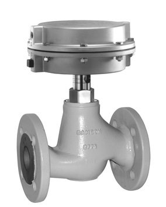  |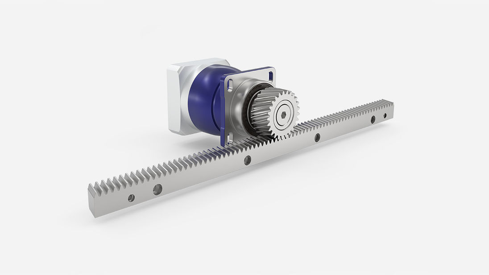|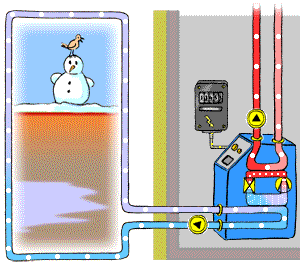  |
| Source Samson AG | Source Wittenstein | Source energie_environnement_ch |

> Note: dans le cas de la vanne Samson, le corps de la vanne est à considérer en mécanique, le chapeau, est à considérer comme un actuateur.

## Électromécanique
Les éléments électromécaniques font référence aux capteurs et aux actionneurs. 
### Capteurs
Une variété de variables physiques peut être mesurées à l'aide de capteurs.
| Accelerometer for Condition Monitoring |  Vision             |  Coriolis Flowmeter           |
:---------------------------------------:|:-------------------------:|:-------------------------:|
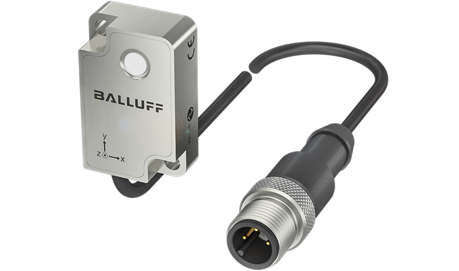  |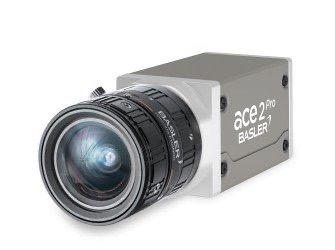  |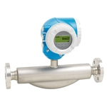  |
| Source Balluff| Basler | Endress+Hauser | 
### Actionneurs
Les actionneurs tels que la diode électroluminescente (DEL), le servomoteur CC, le moteur pas à pas, le relais, le solénoïde, le haut-parleur, l'alliage à mémoire de forme, l'électro-aimant et la pompe appliquent une action commandée sur le processus physique.
| Interrupteur bouton-poussoir |  Multi Tools Spindle             |  5/2 Distributor          |
:---------------------------------------:|:-------------------------:|:-------------------------:|
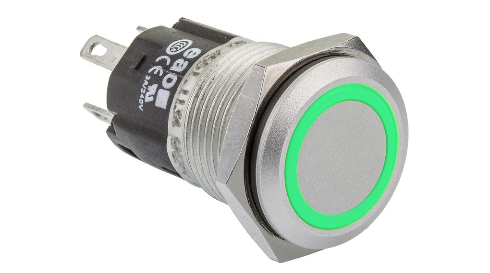  |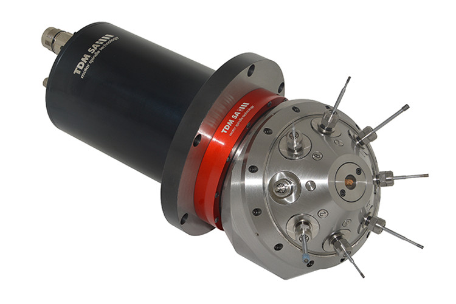  |  |
| Source Distrelec| Source TDM | Source Festo | 

> Dans le cas du Spindle, on fait référence au moteur à haute vitesse. Celui-ci permet ensuite via une conversion mécanique de sélectionner différents types d'outils.

## Électrique/Électronique (A revoir)
Les éléments électriques font référence aux composants électriques (par exemple, résistance (R), condensateur (C), inductance (L), transformateur, etc.), aux circuits et aux signaux analogiques.

Les éléments électroniques font référence à l'électronique analogique/numérique, aux transistors, aux thyristors, aux optocoupleurs, aux amplificateurs opérationnels, à l'électronique de puissance et au conditionnement de signaux. Les éléments électriques/électroniques sont utilisés pour interfacer des capteurs et des actionneurs électromécaniques aux éléments matériels de l'interface de commande.

Les actionneurs tels que la diode électroluminescente (DEL), le servomoteur CC, le moteur pas à pas, le relais, le solénoïde, le haut-parleur, l'alliage à mémoire de forme, l'électro-aimant et la pompe appliquent une action commandée sur le processus physique.
| IEPE/accelerometer|  IO-Link Gateway          |  Wind turbine converter          |
:---------------------------------------:|:-------------------------:|:-------------------------:|
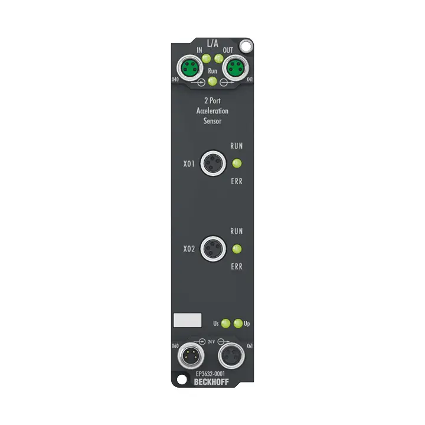  |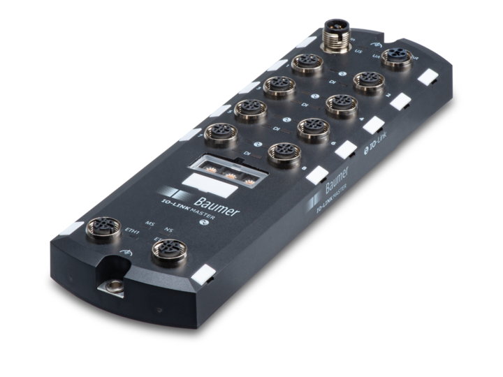  |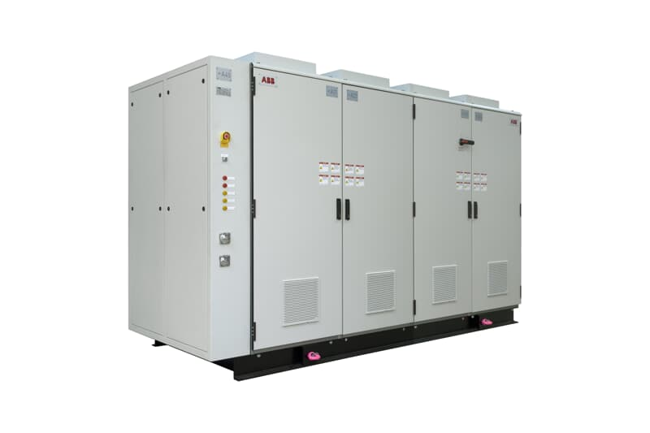  |
| Source Beckhoff| Source TDM | Source ABB | 

Ce module se compose de deux partie, la première, 
Le harware comprend les éléments qui ne sont pas directement programmables ou configurables depuis le PLC
Le software comprend les éléments qui sont programmables, le code du PLC ou paramétrables. 
Interface de contrôle/processeurs

Les éléments d'interface de contrôle/matériel informatique font référence au convertisseur analogique-numérique (A2D), au convertisseur numérique-analogique (D2A), aux entrées/sorties numériques (E/S), aux compteurs, aux minuteries, au microprocesseur, au microcontrôleur, à l'acquisition et au contrôle des données. (DAC) et carte de traitement du signal numérique (DSP).
Le matériel d'interface de commande permet une interface analogique/numérique, c'est-à-dire la communication du signal du capteur à l'ordinateur de commande et la communication du signal de commande du processeur de commande à l'actionneur. Le matériel informatique de commande met en œuvre un algorithme de commande, qui utilise des mesures de capteur, pour calculer les actions de commande à appliquer par l'actionneur.

## L’ordinateur
Les éléments informatiques font référence au matériel/logiciel utilisé pour effectuer l'analyse, l'optimisation, la conception et la simulation de systèmes dynamiques assistés par ordinateur ; instruments virtuels ; prototypage de contrôle rapide ; simulation matérielle dans la boucle ; et acquisition et contrôle de données sur PC.

| CtrlX OS|  S7 1500         |  Arduino       |
:---------------------------------------:|:-------------------------:|:-------------------------:|
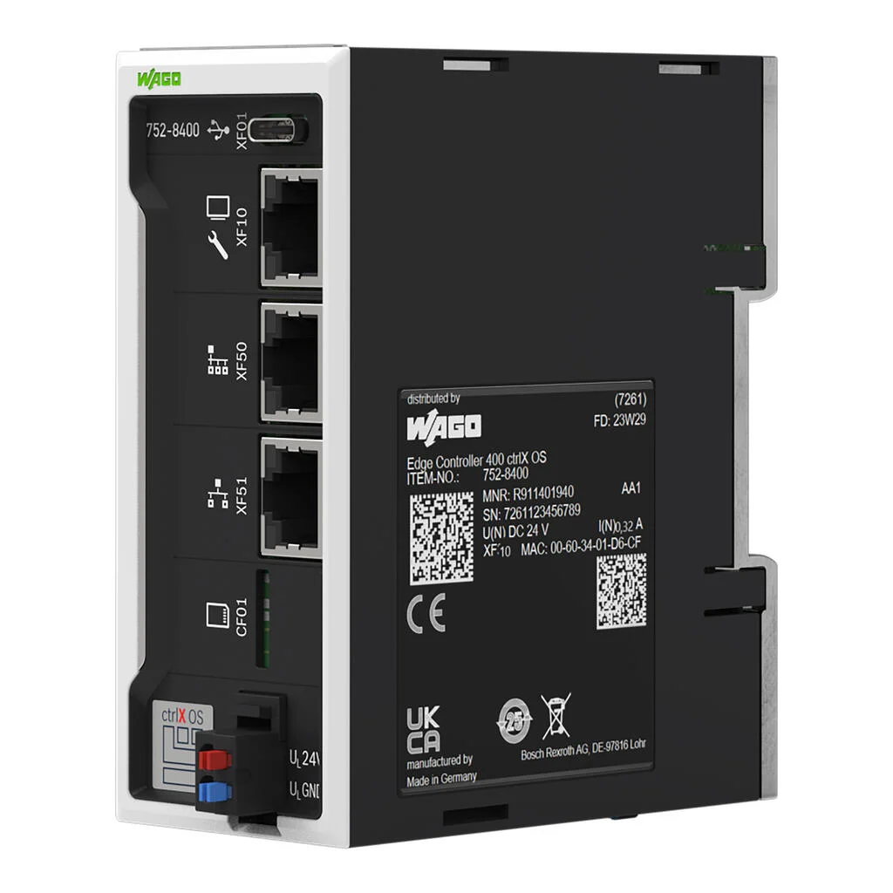  |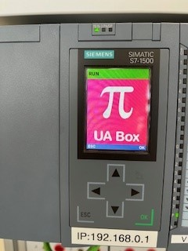  |  |
| Source Wago| Source Siemens | Source Arduino | 

## Communication
La différence entre l’automation moderne et celle d’il y a encore une dizaine d’année, c’est que si précédemment la communication était relativement linéaire entre les différents éléments, les technologies actuelles, OPC-UA et émergentes, PubSub, Ethernet APL (A two-wire Ethernet for process automation and hazardous locations, based on IEEE and IEC standards.) et futures permettent une communication croisée entre les différentes.
Ces nouvelles technologies associées aux balbutiements de l’AI dans l’automation industrielle ouvrent des champs d’applications considérables à explorer aux futurs ingénieurs.

| OPC UA                                 |  TSN                      |  Ethernet-apl          |
:---------------------------------------:|:-------------------------:|:-------------------------:|
  |  |  |
| Source https://opcfoundation.org| Source https://1.ieee802.org/ | Source https://www.ethernet-apl.org | 

En quelques mot:
-    **OPC Foundation** est une organisation qui gère le standard OPC UA, un protocole de communication entre les machines, mais aussi les machines et les éléments de supervision ainsi que la communication entre les machines et les différentes appareils, **OPC UA PubSub**, qui pourraient autant être au niveau capteur, actionneur ou électronique.

- **TSN**, pour Time Sensitive Network est un standard qui cherche à uniformiser les réseaux Ethernet Realtime.

- **Ethernet APL**, *Advanced Physical Layer*, est un standard physique destiné à remplacer à terme les différents réeaux au niveau process. 

> Ces différents organismes collaborent entre eux. On peut rêver à l'horizon d'une dizaine d'années d'avoir un système de communication indusriel uniformisé. Mais en attendant, **les différents protocoles de communication industriels forment une véritable jungle**.

# Ici un schéma général avec

## Ancienne mode en ligne depuis le capteur vers l'actionneur.

## Nouvelle mode: Tout connecté.

Suite: [Trois exemples de systèmes d'automation S88, Chimie, Machine, Energie](README_GEN.md).