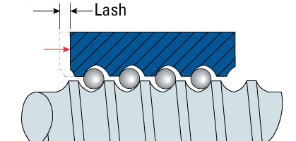
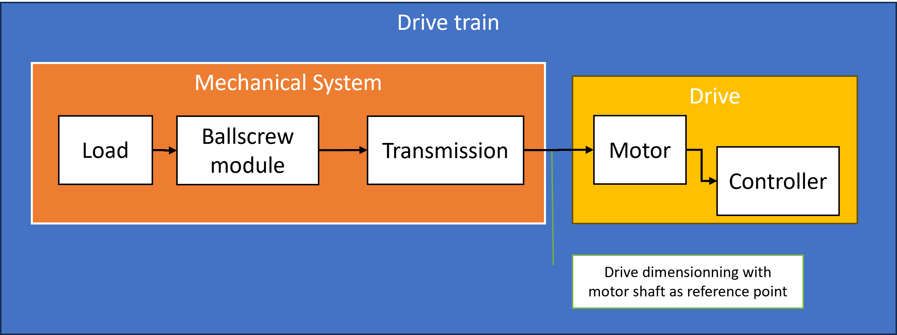

<h1 align="left">
   
  
   
  Industrial Automation Base
   
</h1>

Cours AutB

Author: [Cédric Lenoir](mailto:cedric.lenoir@hevs.ch)

# Module 06 Eléments mechatronics, Use case: bsall screws

*Keywords:* **MOTOR ENCODER AXIS**

# Système d'entrainement par vis à bille

# Note d'écriture, à lire puis enlever

> Diagramme d'activité ?
-    Axe numérique vis à bille.
-    Limite mécanique module Mecatronic
-    Limite puissance moteur.
-    Limite de dimension machine.
-    Limite du processus 

-    Contraintes de sécurité.

-    Contraintes de temps, argent.
-    Contraintes de vitesse.
-    Contraintes approvisionnement, SAP.

-    Type de moteur, type de codeur.

-    Maintenance.
-    Calcul énergie moyenne moteur, drive, couple, vitesse, Precision.

-    Dans 10 ans? 20 ans ?

-    Calcul vis à bille.
-    Type de bus, synchronisé?
-    Frein?

-    Activité: du point À au point B.

-    Rapport d’inertie.

Le système d'entrainement par vis à bille, sous différentes formes, reste un des types d'entrainement les plus répendus dans l'industrie pour le déplacement de charges.

Nous nous référont à un guide technique d'orginie Bosch Rexroth pour identifier les principaux composants et paramètres qui sont importants du point de vue de l'automatisation du système, par exemple, les valeurs qui sont importantes pour le paramétrage de l'entrainement électrique.

## Exemple: le couple maximal admisible
Le couple maximal admissible se réfère à l'axe du moteur.

La qualité de régulation de l'entrainement dépend en partie du ratio entre le moment d'inertie du moteur et la charge. Le respect de ce ratio implique parfois le choix d'un moteur surdimensionné par rapport au couple maximal admissible par la mécanique. Dans ce cas, il sera très important de limiter le couple maximal du moteur. C'est un paramètre qui existe dans le drive et doit être correctement défini lors de la mise en service.

## Les câbles
Dans beaucoup d'équipements mobiles, un partie des câbles se déplacent avec les éléments mobile. Il existe des câbles spécialement confectionnés pour les équipements mobiles.
<figure>
    
    <figcaption>Câbles et  les chaînes porte-câbles</figcaption>
</figure>

> **Les câbles sont la principale source de défaut dans les équipements mobiles**. Même si les câbles sont correctement sélectionnés et confectionnés, c'est une bonne pratique de prévoir des connecteurs pour que les câbles mobiles puissent être facilement remplacés.

## Reference switch
> Le **Reference swich** ou interrupteur de référence sert à définir la position de référence de l'axe. Deux cas de figure se présentent.

### Codeur relatif ou absolu *singleturn*
Dans ce cas, la position mécanique de l'axe est inconnue au momment de l'enclenchement de la machine, *sauf si la plage de travail linéaire est inférieure à un tour du moteur*. Il sera nécessaire de programmer une séquence de référence. Dans la plupart des entrainements modernes, la séquence de référence est automatique au démarrage. Elle nécessite à être paramétrée lors de la mise en service.

### Codeur absolu *multiturn*
Dans ce cas, la position absolue de l'axe est connue au démarrage, *sauf si la plage de travail linéaire excède le nombre de tours disponibles, dans ce cas, un codeur absolu est inutile*. La position absolue doit toutefois être paramétrée lors de la mise en service.

### Coût relative vs *singleturn* vs *multiturn*.
Les codeurs absolus *multiturn* sont généralement plus honéreux et plus encombrants que les codeurs relatifs ou *singleturn*. **Dans la pratique, la différence de prix sera souvent largement compensée par la quantité de travail, le prix de l'interrupteur de référence et la facilité d'utilisation**.

> Dans de nombreux cas, une économie initiale sur le codeur produira l'effet inverse.

### Codeur linéaire
Excepté pour quelques cas de figures oû le moteur est utilisé en entrainement direct, il y a une différence entre la mesure sur le moteur et la position finale.

La différence peut venir de la vis à bille.

<figure>
    
    <figcaption>Backlash Animation, ball gaps exaggerated for visibility, Source: https://www.thomsonlinear.com/en/training/ball_screws/backlash</figcaption>
</figure>

Ou d'autres rapports de transmission intemédiaires.

<figure>
    
    <figcaption>Backlash in mating gear transmissions, Source: Research Gate</figcaption>
</figure>

Certains entrainements électriques permettent de raccorer un deuxième codeur.

1- Le premier est utilisé pour la régulation du moteur.

2- Le deuxième permet de compenser la différence de position sur un régulateur de position.

### Alternative au codeur linéaire
Une alternative au codeur linéaire sera de calibrer le système de base à l'aide d'une mesure externe de haute précision. *Certains entrainements électriques une fonctionnalité qui compense automatiquement la position finale en fonction du signal du codeur*.

<figure>
    
    <figcaption>Lead deviation of Ball Screw Assembly for CKK Compact Module</figcaption>
</figure>

## Limit switch ou interrupteurs de fin de course
Le **limit switch**, en général positif et négatif, sert à limiter la course de l'axe grace à un contact qui interrompt le mouvement de l'axe via une entrées sur l'entrainement éléctrique.

> Le gain en sécurité apporté par un **hard switch** est faible pour un codeur absolu *multiturn*. Les signaux des capteurs sont en général paramétrables et n'offrent guère plus de garantie que les **soft switch** qui se basent sur la position du capteur, aussi disponibles et paramétrables sur l'entrainement électrique.

### Contrainte technique
Les interrupteurs de référence mentionnés dans la documentation Bosch Rexroth sont donnés pour une fréquence d'échantillonage de ``2.5 [kHz]`` à une vitesse de ``2 [m/s]`` pour les interrupteurs magnétiques, voir ``3.3 [Hz]`` pour ``1 [m/s]`` pour les interrupteurs mécaniques.

> Si le temps de cycle de l'automate est lent, il y a un réel risque de ne pas détecter les interrupteurs de fin de cours, surtout dans les cas les plus critiques à vitesse maximale.

## Paramètres pour l'entrainement électrique
Dans ce chapitre, nous n'allons pas nous pencher sur le dimensionnement mécanique, premièrement il sort du sujet, deuxièmement des outils de dimensionnement existent et les calculs sont rarement exécutés à la main, finalement, les calculs de dimensionnement qui concernent la durée de vie de la mécanique ne sont pas mesurables.

### Pourquoi ?
Dans la plupart des cas, le système sera correctement dimensioné et fonctionnera en quelques minutes.

## Cependant
> Parfois le système ne répondra pas au cahier des charges et il sera nécessaire de détecter les anomalies ou les points faibles.

> Parfois on cherchera à optimiser le système en fonction du temps de cycle.

> Parfois on cherchera à optimiser le système pour obtenir une précision optimale.

Nous allons exécuter des calculs pour les comparer à ce qui est mesurable avec les outils fournis par l'environnement de l'entrainement électrique quand les données disponibles disponible avec un degré suffisant de certitude.

## Exemple
L'axe X du laboratoire d'automation est équipé avec un moteur ``Bosch Rexroth MS2N04-D0BQN`` est donné pour un couple nominal de ``2.65 [A]``. Pour un moteur synchrone à aimants permanents, le ratio ``Torque constant [Nm/A]`` est relativement constant dans la plage de fonctionnement normale du moteur, ce qui nous permet d'en déduire le couple nominal, calculé directement par l'entrainement électrique.
Ces valeurs sont directement mesurables:
<figure>
    
    <figcaption>Measurement of frictional torque of complete system</figcaption>
</figure>

Si lors d'essai l'entrainement électrique génère une alarme du type thermal motor protection, il sera utile de comprendre le fonctionnement du système pour déterminer si:
- La courbe de couple est normale et la mesure de température est en défaut.
- La courbe de couple diminue sensiblement si le temps de cycle diminue.
- Le moteur chauffe anormalement par rapport à la mesure du couple.

# Principes de base
Pour le dimensionnement de l'entraînement, **Drive Train**, la chaîne cinématique peut être divisée en système mécanique, **Mechanical System** et système d'entraînement, **Drive**.

Le système mécanique comprend les composants physiques
-  système de mouvement linéaire, *la vis à bille* **Ballscrew Module**, et éléments de transmission, **Transmission** (entraînement côté courroie, accouplement)
- et la charge, **Load** à transporter.

L'entraînement électrique est une combinaison moteur-contrôleur, **Motor-Controller** avec des données de puissance correspondantes.

Le dimensionnement de l'**entraînement électrique** se fait en prenant l'arbre du moteur comme point de référence.

Pour le dimensionnement de l'entraînement, il faut tenir compte des limites ainsi que des valeurs de base. Les limites ne doivent pas être dépassées afin d'éviter d'endommager les composants mécaniques.

<figure>
    
    <figcaption>Entrainement avec vis à bille, schéma de principe</figcaption>
</figure>

## Données techniques et symboles de formule pour le système mécanique
Pour chaque composant (système de mouvement linéaire, accouplement, entraînement latéral par courroie, réducteur), les limites maximales autorisées correspondantes pour le **couple d'entraînement** et la **vitesse** ainsi que les valeurs de base pour le **moment de friction** et le **moment d'inertie** de **masse** doivent être utilisées.

Les données techniques suivantes avec les symboles de formule associés sont utilisées lors de la prise en compte des exigences de base du système mécanique dans les calculs de conception pour le dimensionnement de l'entraînement. Les données répertoriées dans le tableau ci-dessous se trouvent dans la section intitulée « Données techniques » ou sont déterminées à l'aide de formules basées sur les descriptions des pages suivantes.

## Vitesse maximale admissible

## Couple moteur admissible

## Limites, calculer la vitesse et la décélération
Tenir compte des limites réeles
Tenir compte du couple pour l'accélération et la décélération

## Pas de la vis à bille et de l'entrainement (Gear ratio).

## Sens de déplacement

## Quelle est la position de référence ?

## Ecart sur l'engrenage, Basklash, règle linéaire

# Ratio masse *avant* et *après* axe moteur
la Il n'y a pas de calcul théorique précis, en raison, par exemple, de la difficulté de calculer ou mesurer la rigidité de l'ensemble de l'entrainement.

**Bosch Rexroth** donne l'information suivante, *Project planning/calculation R999000499* :
## Prise en compte du rapport des moments d'inertie de masse du système mécanique et du moteur.

Le rapport des moments d'inertie de masse sert d'indicateur pour les performances de contrôle d'une combinaison moteur-contrôleur.
Le moment d’inertie du moteur est directement lié à la taille du moteur.

## Rapport des moments d'inertie de masse
Pour la présélection, l'expérience a montré que les rapports suivants permettent d'obtenir des performances de contrôle élevées.
Il ne s’agit pas de limites rigides, mais les valeurs qui les dépassent nécessiteront un examen plus approfondi de l’application spécifique.

Ratio = moment d'inertie masse pilotée / mass côté moteur

|Domaine d'application  | Ratio |
|-----------------------|-------|
|Handling               | <= 6.0|
|Processing             | <= 1.5|

Par **Handling**, on entend système de manipulation, déplacement d'un objet.
Par **Processing**, on entend suivi précis de trajectoire, comme un machine outil type CNC.

## Pour citer une autre source de référence
**ABB** mentionne la remarque suivante dans un document de dimensionnement des moteurs: *Le rapport idéal entre l'inertie réfléchie et l'inertie du moteur est de **1:1**, un rapport qui permet d'obtenir le meilleur positionnement et la meilleure précision. L'inertie réfléchie ne doit pas dépasser l'inertie du moteur plus de **dix fois**, s'il est important de maintenir les performances de contrôle*.

L'expérience personnelle montre que des rapports d'inertie trop élevés, de l'ordre de 100, peuvent rendre un système même relativement rigide, totalement instable et impossible à piloter voir dangereux. La plupart des outils de configuration de système d'entrainement et de sélection de moteur des différents fabricants incluent en général un rapport type en fonction du type d'application. **Si le ratio est trop important, un réducteur sera proposé**.

# Maintenance mécanique
Les éléments mécanique nécessitent des interventions de maintenance comme la lubrification qui permettent de prolonger leur cycle de vie.
**Si vous pensez à intégrer cet aspect là dans votre système, vous aurez pris une longueur d'avance sur l'immense majorité de vos concurents !**

# Exercices
En utilisant les différentes paramètres d'un moteur et d'une vis à bille, quelques exercices qui consistent pour un ensemble donné, à

Calculer en travaillant sur les paramètres de vitesse et d'accélération, des mouvements avec:
Le minimum d'énergie.
Le minimum de puissance.
Le temps minimum.
(on est dans le domaines de simples équations d'ordre 2, très éventuellement des intégrales basiques).