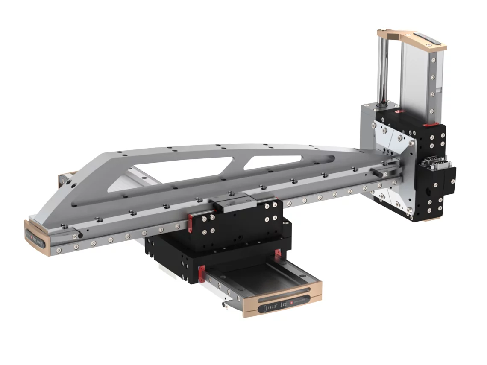

<h1 align="left">
   
  
   
  Industrial Automation Base
   
</h1>

Cours AutB

Author: [Cédric Lenoir](mailto:cedric.lenoir@hevs.ch)

# Module 06 Eléments mechatronics, Hardware Desgin Specification

*Keywords:* **S88 Unit**

# Module en cours d'écriture

# Objectif
Nous passons ici en revue une série d'éléments mécatroniques en spécifiant quels sont les éléments que l'on peut attendre de la part d'un système d'automation de base.

## Que peut-on attendre en automatisation de base ?
- Sélectionner un type de matériel capable de fonctionner en milieu industriel.
- Déterminer si le matériel sélectionné pour les capteurs et actuateurs est compatible avec un automate de type PLC.
- Modéliser le système en utilisant un diagramme d'objets basé sur ISA 88.
- Programmer le système de commande et coder un algorithme de régulation.
- Fournir à un électricien la liste de entrées et sorties afin de réaliser la schématique et le câblage pour l'interface avec l'automate.

## Quels sont les éléments complémentaires qui sortent du domaine de ce cours ?
- Les notion de spécification mathématiques de l'algorithme de régulation.
- Le dimensionnement mécanique de l'ensemble.
- Les modèles phsiques ou chimiques.

# Premier exemple, un réacteur à double enveloppe.
Source d'information et image: Mettler-Toledo.

<figure>
    
    <figcaption>Réacteur à double enveloppe, source: Mettler-Toledo </figcaption>
</figure>

## Qu’est-ce qu’un réacteur à double enveloppe ?

Un réacteur à double enveloppe, également connu sous le nom de réacteur à double paroi, se compose d'une cuve intérieure (noyau) qui contient les réactifs chimiques et d'une enveloppe extérieure environnante (enveloppe) qui fait circuler un fluide de chauffage ou de refroidissement. Le but de la chemise est de réguler la température de la réaction à l’intérieur du récipient central. Le réacteur lui-même est généralement en verre, en acier inoxydable ou en métal (selon que l'expérience se déroule dans un laboratoire, une usine pilote, etc.) avec un récipient intérieur qui contient les réactifs et une enveloppe extérieure qui fait circuler un transfert de chaleur. liquide, tel que l'eau ou l'huile. Cette configuration permet de contrôler la température des réactifs en régulant la température du fluide caloporteur.

## Comment fonctionne un réacteur à double enveloppe ?
Un réacteur à double enveloppe fonctionne en utilisant l'enveloppe pour contrôler la température de la réaction se déroulant à l'intérieur de la cuve du réacteur. L'enveloppe est généralement remplie d'un fluide chauffant ou refroidissant, tel que de l'eau ou de l'huile, qui circule à travers l'enveloppe à l'aide d'une pompe. En contrôlant la température du milieu dans l'enveloppe, la température de la réaction à l'intérieur du réacteur peut être contrôlée avec précision.

L'enveloppe fournit également une couche secondaire d'isolation autour de la cuve du réacteur, ce qui contribue à maintenir la réaction à une température constante et évite les pertes ou les gains de chaleur. Ceci est important car de nombreuses réactions chimiques nécessitent des plages de températures spécifiques pour se dérouler efficacement avec un rendement élevé. L'agitation, le dosage et l'échantillonnage sont également des éléments essentiels au fonctionnement des réacteurs de laboratoire à double enveloppe, car ils contribuent à garantir que les réactions dans le réacteur sont efficaces, efficientes et sûres.

La réaction à l’intérieur de la cuve du réacteur peut être un processus discontinu ou un processus continu, dans lequel les réactifs sont alimentés en continu et le produit est continuellement retiré. Le réacteur à double enveloppe est utilisé dans diverses applications industrielles telles que la fabrication de produits pharmaceutiques, alimentaires, chimiques et bien d'autres encore.

# Deuxième exemple: un "Pick & Place"
<figure>
    
    <figcaption>x-y-z Pick and place, source: Jenny Science </figcaption>
</figure>

# Troisième exemple: automatisation d'une petite turbine hydraulique

Ici, les trois exemples de système d'automation

Machine
Chimie
Energie

Ensuite, [passer au cas particulier de la vis à bille du capteur jusqu'à l'actionneur](README_BallScrew.md).