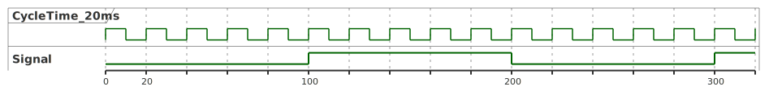

<h1 align="center">
  <br>
  
  <br>
  HEI-Vs Engineering School - Industrial Automation Base
  <br>
</h1>

Cours AutB

Author: [Cédric Lenoir](mailto:cedric.lenoir@hevs.ch)

# Module 04 / Exercices

## Exercice *Understand Variables in Function Block*
Vous avez le Function Block dont le code est donné ci-dessous
### FB_VarValue
```iecst
FUNCTION_BLOCK FB_VarValue
VAR_INPUT
    ValueIn    :   DINT     := 10;
END_VAR
VAR_OUTPUT
    ResultOne   :   DINT    := 4;  
    ResultTwo   :   DINT;  
END_VAR
VAR
    Temp        :   DINT    := 5;
END_VAR

// Implementation
ResultOne := Temp + ValueIn;
ResultTwo := 5 + ValueIn;
Temp := Temp + 1;
```
Ce Function Block est utilisé dans un programme de la manière suivante:
```iecst
PROGRAM PLC_PRG
VAR
    fbVarValue_One     :    FB_VarValue; 
    fbVarValue_Two     :    FB_VarValue; 
    fbVarValue_Three   :    FB_VarValue; 
    fbVarValue_Four    :    FB_VarValue; 
END_VAR

// Implementation
fbVarValue_One.ValueIn := 1;
fbVarValue_One();
    
fbVarValue_Two(ValueIn := 1);
    
fbVarValue_Three();
fbVarValue_Three.ValueIn := 1;
    
fbVarValue_Four.ValueIn := 1;
```

### Question
Quels sont les valeurs de variables suivante, avant le premier cycle, après le 1er et 2ème cycle ?

|Variable                  |T0   |T1   |T2   |
|--------------------------|-----|-----|-----|
|fbVarValue_One.ResultOne  |     |     |     |
|fbVarValue_One.ResultTwo  |     |     |     |
|fbVarValue_Two.ResultOne  |     |     |     |
|fbVarValue_Two.ResultTwo  |     |     |     |
|fbVarValue_Three.ResultOne|     |     |     |
|fbVarValue_Three.ResultTwo|     |     |     |
|fbVarValue_Four.ResultOne |     |     |     |
|fbVarValue_Four.ResultTwo |     |     |     |

[Solution Understand Variables in Function Block](#solution-understand-variables-in-function-block)

## Exercice *Understand Variables in Function*
Soit la fonction avec l'implémentation suivante:
```iecst
FUNCTION FC_Operation : DINT
VAR_INPUT
    InputOne    :   DINT    := 6;
    InputTwo    :   DINT;
END_VAR
VAR
    Temp        :   DINT;
END_VAR

// Code
FC_Operation := Temp + InputOne + InputTwo;
Temp := Temp + 5;
```
Et l'utilisation suivante:
```iecst
PROGRAM PLC_PRG
VAR
    resultOne          :    DINT; 
    resultTwo          :    DINT; 
    resultThree        :    DINT;    
END_VAR

resultOne := FC_Operation(3,6);
resultTwo := FC_Operation(InputOne := 7, InputTwo := 2);
resultThree := FC_Operation(InputOne := 6, InputTwo := 2);
```
Donner le résultat des variables après un cycle, puis trois cycles.
|Variable   |T1   |T3   |
|-----------|-----|-----|
|resultOne  |     |     |
|resultTwo  |     |     |
|resultThree|     |     |
|resultFour |     |     |

[Solution Understand Variables in Function](#solution-understand-variables-in-function)

## Exercice *Function with more than one output*
En reprenant le code donné dans [Fonction avec sorties supplémentaire](./README.md#fonction-avec-sorties-supplémentaire), remplir le vecteur arResults du code suivant:

```iecst
PROGRAM PLC_PRG
VAR
    arResults : ARRAY[1..7] OF DINT;   
END_VAR

// Code
FC_AddSubMult(InputOne := 7,
              InputTwo := 5,
              Adder => arResults[1],
              Subtractor => arResults[2],
              Multiplier => arResults[3]);
              
FC_AddSubMult(InputOne := 11,
              InputTwo := 6,
              Adder => arResults[4],
              Subtractor => arResults[5],
              Multiplier => arResults[6]);              

arResults[7] := FC_AddSubMult();
```
|             |x:=1 |x:=2 |x:=3 |x:=4 |x:=5 |x:=6 |x:=7 |
|-------------|-----|-----|-----|-----|-----|-----|-----|
|arResults[x] |     |     |     |     |     |     |     |

[Result Function with more than one output](#solution-function-with-more-than-one-output)

## Exercice *Work on data structure with VAR_IN_OUT*
Nous avons une structure de données selon le format suivant:
```iecst
(*
	www.hevs.ch
	Institut Systemes Industriels
	Project: 	Exercice Module 04
	Author:		Cedric Lenoir
	Date:		2023 December 20
	
	Summary:	Some values to process with VAR_IN_OUT
*)
TYPE ioDataStructure_typ :
STRUCT
    listOfValues    : ARRAY[1..10]OF REAL;
    maxValue        : REAL;
    minValue        : REAL;
    meanRmsValue    : REAL;
END_STRUCT
END_TYPE
```
### Part 1, get max value
-   Ecrire un Function Block qui calcule la valeur maximum de ``listOfValues``.
-   Les entrées du Function Block sont données.
-   Sur le flanc montant de ``Execute`` uniquement, le calcul est effectué sur un cycle.
-   ``Done`` passe à ``TRUE`` à la fin du calcul et revient à ``FALSE`` si Execute est ``FALSE``.
-   Noter la taille fixe de ``listOfValues``, *10 valeurs*.
-   Ajouter les variables internes nécessaires.
```iecst
FUNCTION_BLOCK FB_GetMaxValue
VAR_INPUT
    Execute : BOOL;
END_VAR
VAR_IN_OUT
    data    : ioDataStructure_typ;
END_VAR
VAR_OUTPUT
    Done    : BOOL;
END_VAR
VAR
END_VAR
```
### Part 2, get min value
Sur le même model que [Part 1](#part-1-get-max-value), calculer la valeur minimum de ``listOfValues``.

Function Block ``FB_GetMinValue``.

### Part 3, get rms value
Sur le même model que [Part 1](#part-1-get-max-value), calculer la valeur RMS de ``listOfValues``.

$x_{rms} = \sqrt{\dfrac{1}{n}({x_1}^2+{x_2}^2+...+{x_n}^2)}$

Function Block ``FB_GetRMSValue``.

### Part 4, call FB with VAR_IN_OUT
Ecrire un programme qui calcul les valeur max, min et rms de la structure ioDataStructure_typ en utilisant les Function Block des parties 1 à 3.
```iecst
PROGRAM PRG_IN_OUT
VAR
    // Your variables en FB here.
END_VAR
```

[Solution Work on data structure with VAR_IN_OUT](#solution-work-on-data-structure-with-var_in_out)

## Exercice *Square generator*
Ecrire le code d'un générateur de signal carré basic.
<figure>
    
    <figcaption>Square Signal 200[ms]</figcaption>
</figure>

### Principe
-   Le générateur travaille dans une tâche dont le temps de cycle est fixe: $20 [ms]$
-   Vous définissez si nécessaire la ou les variables internes utiles.
-   Si ``Enable`` est ``FALSE``, alors le ``Signal`` est toujours ``FALSE``.

### Base de travail / header
```iecst
FUNCTION_BLOCK FB_Square_200_ms
VAR_INPUT
    Enable :   BOOL;
END_VAR
VAR_OUTPUT
    Signal :   BOOL;
END_VAR
VAR
    // Your own variable
END_VAR
```
[Solution Square generator](#solution-square-generator)

# Solution des exercices
## Solution *Understand Variables in Function Block*
|Variable                  |T0   |T1   |T2   |
|--------------------------|-----|-----|-----|
|fbVarValue_One.ResultOne  |4    |6    |7    |
|fbVarValue_One.ResultTwo  |0    |6    |6    |
|fbVarValue_Two.ResultOne  |4    |6    |7    |
|fbVarValue_Two.ResultTwo  |0    |6    |6    |
|fbVarValue_Three.ResultOne|4    |15   |7    |
|fbVarValue_Three.ResultTwo|0    |15   |6    |
|fbVarValue_Four.ResultOne |4    |4    |4    |
|fbVarValue_Four.ResultTwo |0    |0    |0    |

## Solution *Understand Variables in Function*
|Variable   |T1   |T3   |
|-----------|-----|-----|
|resultOne  |9    |9    |
|resultTwo  |9    |9    |
|resultThree|8    |8    |
|resultFour |8    |8    |

> Note: l'écriture ``FC_Operation(3,6)`` fonctionne, mais est n'est pas conseillée pour une question de lisibilité du code.

> Noter dans resultFour := ``FC_Operation(InputTwo := 6, InputOne := 2);`` que l'ordre de déclaration des variables n'est pas importante, dans la mesure où elles sont nommées, ce qui n'est pas le cas de ``FC_Operation(3,6)``. 

## Solution *Function with more than one output*
|             |x:=1 |x:=2 |x:=3 |x:=4 |x:=5 |x:=6 |x:=7 |
|-------------|-----|-----|-----|-----|-----|-----|-----|
|arResults[x] |12   |2    |35   |17   |5    |66   |0    |

## *Solution Work on data structure with VAR_IN_OUT*
### Code for FB_GetMaxValue
```iecst
FUNCTION_BLOCK FB_GetMaxValue
VAR_INPUT
    Execute : BOOL;
END_VAR
VAR_IN_OUT
    data    : ioDataStructure_typ;
END_VAR
VAR_OUTPUT
    Done    : BOOL;
END_VAR
VAR
    rTrig   : R_TRIG;
    iLoop   : DINT;
END_VAR

//------------------------------------------------------- 
//  Code
//------------------------------------------------------- 
rTrig(CLK := Execute);

IF rTrig.Q THEN
    data.maxValue := data.listOfValues[1];
    FOR iLoop := 2 TO 10 DO
        IF data.listOfValues[iLoop] > data.maxValue THEN
            data.maxValue := data.listOfValues[iLoop];
        END_IF
    END_FOR
    Done := TRUE;
END_IF;

IF NOT Execute THEN 
    Done := FALSE;
END_IF
```
### Code for FB_GetMinValue
```iecst
FUNCTION_BLOCK FB_GetMinValue
VAR_INPUT
    Execute : BOOL;
END_VAR
VAR_IN_OUT
    data    : ioDataStructure_typ;
END_VAR
VAR_OUTPUT
    Done    : BOOL;
END_VAR
VAR
    rTrig   : R_TRIG;
    iLoop   : DINT;
END_VAR

//------------------------------------------------------- 
//  Code
//------------------------------------------------------- 
rTrig(CLK := Execute);

IF rTrig.Q THEN
    data.minValue := data.listOfValues[1];
    FOR iLoop := 2 TO 10 DO
        IF data.listOfValues[iLoop] < data.minValue THEN
            data.minValue := data.listOfValues[iLoop];
        END_IF
    END_FOR
    Done := TRUE;
END_IF;

IF NOT Execute THEN 
    Done := FALSE;
END_IF
```
### Code for FB_GetRMSValue
```iecst
FUNCTION_BLOCK FB_GetRMSValue
VAR_INPUT
    Execute     : BOOL;
END_VAR
VAR_IN_OUT
    data        : ioDataStructure_typ;
END_VAR
VAR_OUTPUT
    Done        : BOOL;
END_VAR
VAR
    rTrig       : R_TRIG;
    iLoop       : DINT;
    iSquareSum  : REAL;
END_VAR

//------------------------------------------------------- 
//  Code
//------------------------------------------------------- 
rTrig(CLK := Execute);

IF rTrig.Q THEN
    iSquareSum := 0;
    FOR iLoop := 1 TO 10 DO
        iSquareSum := iSquareSum + (data.listOfValues[iLoop] * data.listOfValues[iLoop]);
    END_FOR
    data.meanRmsValue := SQRT(iSquareSum / 10);
    Done := TRUE;
END_IF;

IF NOT Execute THEN 
    Done := FALSE;
END_IF
```
### Code for PRG_IN_OUT
*Notez les valeurs de test*
```iecst
PROGRAM PRG_IN_OUT
VAR
    ExecuteAll      : BOOL;
    ioData          : ioDataStructure_typ := (listOfValues := [-3, 4, 7, 9, -5, -2, -15, 6, -3, 21]);
    fbGetMaxValue   : FB_GetMaxValue;
    fbGetMinValue   : FB_GetMinValue;
    fbGetRMSValue   : FB_GetRMSValue;
END_VAR
//------------------------------------------------------- 
//  Code
//------------------------------------------------------- 
fbGetMaxValue(Execute := ExecuteAll,
              data := ioData);
              
fbGetMinValue(Execute := ExecuteAll,
              data := ioData);

fbGetRMSValue(Execute := ExecuteAll,
              data := ioData); 
```
#### Pour info
Le code suivant généré avec Matlab Script permet de vérifier les calculs.
```
listOfValues = [-3, 4, 7, 9, -5, -2, -15, 6, -3, 21]
max(listOfValues)   % = 21
min(listOfValues)   % = -15
rms(listOfValues)   % = 9.4604
```

## Solution *Square generator*
```iecst
// Solution exercice Square generator
IF NOT Enable THEN
    Signal := FALSE;
    diCount := 0;
ELSE
    IF diCount > 9 THEN
        diCount := 0;
    END_IF
    diCount := diCount + 1;
    IF (diCount > 5) THEN
        Signal := TRUE; 
    ELSE
        Signal := FALSE;
    END_IF
END_IF
```
> Une Variante parmi d'autres
```iecst
IF NOT Enable THEN
    diCount := 0;
ELSE
    IF diCount > 9 THEN
        diCount := 0;
    END_IF
    diCount := diCount + 1;
END_IF

Signal := (diCount > 5) AND Enable;
```

## Pour information, obtenir le temps de cycle de la tâche.

> Nécessite l'installation de la librairie SysTask

> La tâche dans laquelle s'exécute le programme est retournée en $ [\mu s] $ 

```iecst
PROGRAM PLC_PRG
VAR
     // task handle
	hTask           :   SysTask.RTS_IEC_HANDLE;
    // intervall in micro seconds
	udiInterval_us  :   UDINT;
END_VAR

// **** Implementation ***
// get handle of current task
SysTaskGetCurrent(ADR(hTask));
// get task interval
SysTaskGetInterval(hTask, udiInterval_us);
```
