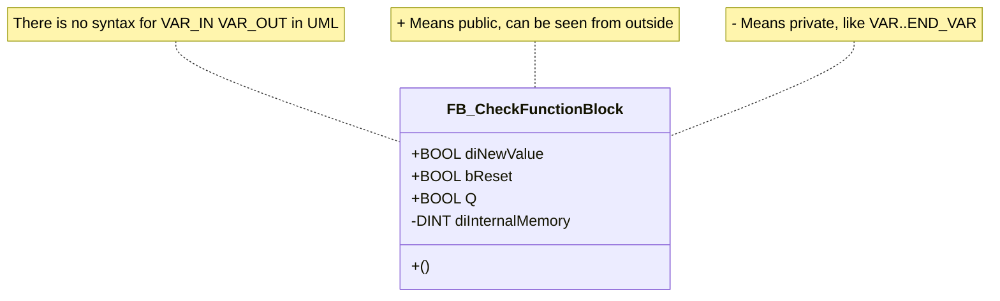
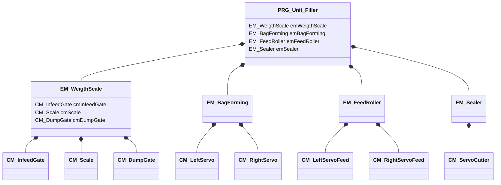
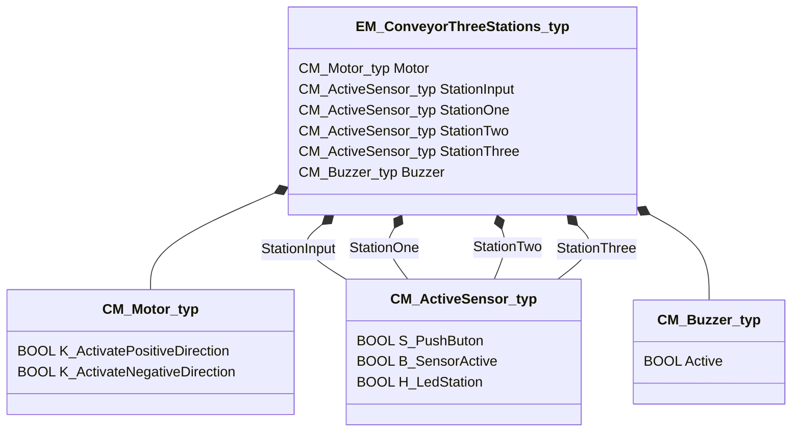
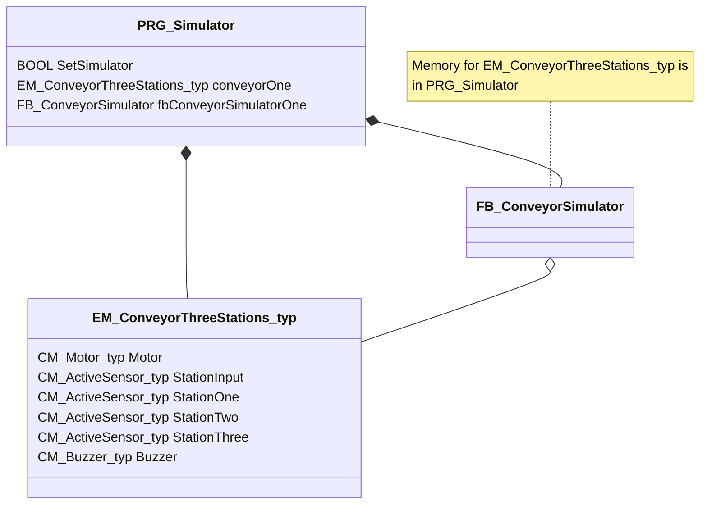
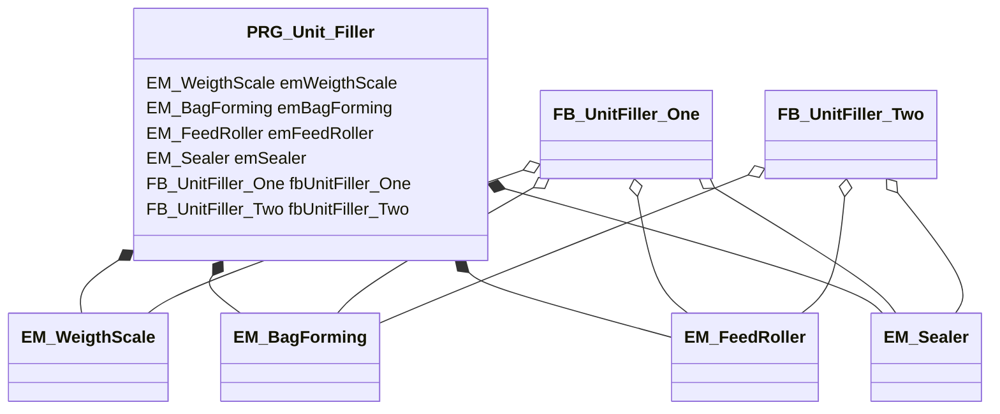
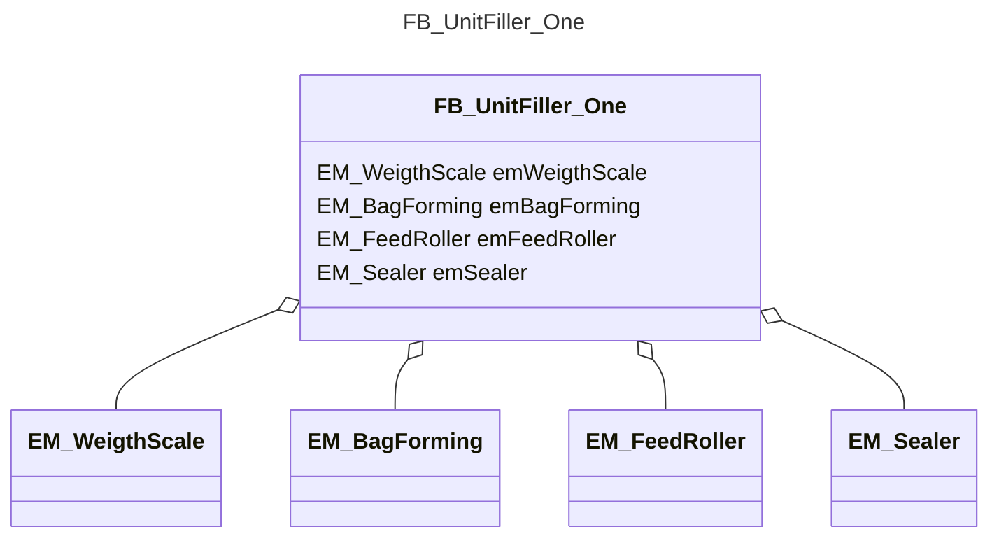
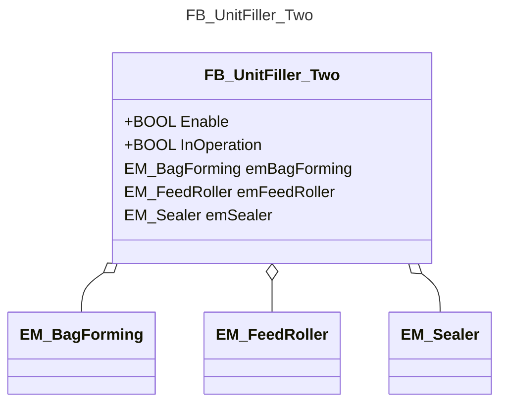

<h1 align="left">
  <br>
  
  <br>
  Industrial Automation Base
  <br>
</h1>

Cours AutB

Author: [Cédric Lenoir](mailto:cedric.lenoir@hevs.ch)

# Module 06 Program Oranization Unit
In der Sprache IEC 61131-3 gibt es drei Programmiereinheiten oder Programmorganisationseinheiten (POUs).

- Der Funktionsblock oder **Funktionsblock FB**
- Die Funktion oder **Funktion, FC**,
- Das Programm oder **Programm PRG**.

## Zusammenfassung

- [Module 06 Program Oranization Unit](#module-06-program-oranization-unit)
  - [Zusammenfassung](#zusammenfassung)
- [Verweis auf ISA-88](#verweis-auf-isa-88)
    - [Eingangsvariablen](#eingangsvariablen)
    - [Ausgangsvariablen](#ausgangsvariablen)
    - [IN\_OUT-Variablen](#in_out-variablen)
    - [Intern gespeicherte Variablen](#intern-gespeicherte-variablen)
    - [Ein Algorithmus](#ein-algorithmus)
  - [Einen Funktionsblock schreiben](#einen-funktionsblock-schreiben)
  - [Instanziierung und Deklaration eines Funktionsblocks](#instanziierung-und-deklaration-eines-funktionsblocks)
  - [Verwendung der Ein- und Ausgänge eines Funktionsblocks](#verwendung-der-ein--und-ausgänge-eines-funktionsblocks)
    - [Codierungsregeln](#codierungsregeln)
  - [Der Funktionsblock in der ISA-88-Logik](#der-funktionsblock-in-der-isa-88-logik)
- [Function](#function)
  - [Eine Funktion schreiben, Funktion.](#eine-funktion-schreiben-funktion)
    - [Codierungsregeln](#codierungsregeln-1)
  - [Aufrufen einer Funktion, Funktion.](#aufrufen-einer-funktion-funktion)
  - [Funktion mit zusätzlichen Ausgängen](#funktion-mit-zusätzlichen-ausgängen)
    - [Aufruf mit zusätzlichen Ausgängen](#aufruf-mit-zusätzlichen-ausgängen)
  - [Compiler-Feinheit](#compiler-feinheit)
    - [Beispiel](#beispiel)
    - [Aber](#aber)
- [Programm](#programm)
  - [Codierungsregeln](#codierungsregeln-2)
  - [Reihenfolge der Programmausführung](#reihenfolge-der-programmausführung)
    - [Beratung](#beratung)
  - [Zykluszeit des Programms (oder der Task)](#zykluszeit-des-programms-oder-der-task)
  - [Arbeits- oder Implementierungsmethode.](#arbeits--oder-implementierungsmethode)
- [VAR\_IN\_OUT](#var_in_out)
    - [Allerdings, oder trotzdem!!](#allerdings-oder-trotzdem)
    - [Verwenden](#verwenden)
      - [Deklaration ``VAR_IN_OUT``](#deklaration-var_in_out)
      - [Pass parameter for ``VAR_IN_OUT``](#pass-parameter-for-var_in_out)
      - [Hinweise zur Verwendung von ``VAR_IN_OUT``.](#hinweise-zur-verwendung-von-var_in_out)
  - [``VAR_IN_OUT`` mit Function Block](#var_in_out-mit-function-block)
- [Namespace](#namespace)
  - [Namespace für globale Variablenlisten](#namespace-für-globale-variablenlisten)
    - [Deklaration in der GVL\_Config-Liste](#deklaration-in-der-gvl_config-liste)
    - [Im Code verwenden](#im-code-verwenden)

# Verweis auf ISA-88
Der Verweis auf ISA-88 ist nicht Gegenstand dieses Kurses, wird aber wie in anderen Kapiteln verwendet, um diesen Kurs in seinen industriellen Systemkontext einzuordnen. Unten ist eine Einheit zum Befüllen von Beuteln. Wenn wir in dem den Schnittstellen gewidmeten Modul an der **Struktur** der Daten interessiert waren, wird der **Funktionsblock** verwendet, um dieser Struktur ein **Verhalten** zu verleihen.

<figure>
    
    <figcaption>Fassabfüllung, Image Burgener AG</figcaption>
</figure>

> Das Bild der Maschine der Burger AG in Visp dient der Veranschaulichung, sie verwendet nicht die gleiche Technologie wie unten beschrieben. Beim ISA-88-Plan hingegen handelt es sich um eine Einheit. **Einheit**.

<figure>
    
    <figcaption>Vertical Filler Automated Machines using the ISA 88 Models</figcaption>
</figure>

<figure>
    
    <figcaption>Unit Vertical Filler</figcaption>
</figure>

> Was Sie beachten müssen: Die oben abgebildete Maschine muss mehrere Kriterien erfüllen, um auf den Markt gebracht zu werden. Damit der Ingenieur arbeiten kann, muss jemand es zu einem akzeptablen Preis verkaufen können, um den Ingenieur zu unterstützen, der es gebaut hat.

> Durch die Organisation des Codes in Funktionsblöcke wird seine Wiederverwendbarkeit verbessert und die Entwicklungskosten verschiedener Varianten der Maschine gesenkt.

> Die Maschine muss im Lebensmittel- oder Medizinbereich verkauft werden können, was die Einhaltung strenger Standards erfordert, die beispielsweise von der FDA, der US-amerikanischen Food and Drug Administration, gefordert werden. Die Einhaltung dieser Standards erfordert den Nachweis **guter Herstellungspraktiken**. Mit anderen Worten: **Der Ingenieur muss nachweisen können, dass er nach den Regeln der Technik gearbeitet hat!**.

> Die Erfahrung zeigt: Wenn ein Projekt nicht funktioniert, liegt es viel häufiger an den Spezifikationen als an der technischen Qualität des Ingenieurs. Indem Sie Ihren Softwareteil modellieren, **bevor** Sie mit der Codierung fortfahren, können Sie Ihr Konzept validieren, ohne Ihre Arbeit dreimal wiederholen zu müssen.

#Funktionsblock
Der Funktionsblock ist das Grundelement der Automatenprogrammierung, er entspricht der **Klasse** oder dem **Objekt** in C++. Er ist es, der eine strukturierte und modulare Programmierung ermöglicht.

Das Prinzip besteht darin, denselben Code nicht mehrmals neu zu schreiben.

Der Aufbau des **Funktionsblocks** in IEC 61131-3 entspricht SPS-/Hardware-Anwendungen mit einer klaren Trennung von Ein- und Ausgängen.

### Eingangsvariablen
Genannt ``VAR_INPUT``, die Eingänge sind von außen sichtbar und für den Schreibzugriff vorgesehen.

### Ausgangsvariablen
Genannt ``VAR_OUTPUT``, die Ausgänge sind von außen sichtbar und für den Lesezugriff vorgesehen.

### IN_OUT-Variablen
Die ``VAR_IN_OUT`` werden in einem [eigenen Abschnitt: VAR_IN_OUT](#var_in_out) behandelt.

### Intern gespeicherte Variablen
Genannt ``VAR``, sie sind von außen nicht zugänglich, können jedoch vom Entwicklungswerkzeug, IDE, visualisiert und geändert werden.

> Es gibt andere Arten von internen Variablen mit spezifischen Funktionen, z.B.: RETAIN, CONSTANT. Die detaillierte Behandlung dieser Variablen liegt außerhalb des Rahmens dieses Grundkurses. Siehe die Dokumentation des IDE-Anbieters.

### Ein Algorithmus
In einem Funktionsblock kann der Algorithmus vom IDE visualisiert werden, und zwar getrennt für jede Instanz des Funktionsblocks.

## Einen Funktionsblock schreiben

```iecst
FUNCTION_BLOCK FB_CheckFunctionBlock
VAR_INPUT
    diNewValue       : BOOL;    (* Input Clock of a Function Block *)
    bReset           : BOOL;    (* Reset Memory *)
END_VAR
VAR_OUTPUT
    Q                : BOOL;    (* Output of the Function Block *)
END_VAR
VAR
    diInternalMemory : DINT;    (* Value to store value to next call*)
END_VAR

(*
   Algorithm of the Function Block
*)
IF diInternalMemory > diNewValue THEN
    Q := TRUE;
ELSE
    Q := FALSE;
END_IF

IF bReset THEN
    diInternalMemory := 0;
END_IF

diInternalMemory := diNewValue;
```



> A function block has a method by default, this is the method to call it.

```
PRG_Test
VAR
    fbCheckFunctionBlock    : FB_CheckFunctionBlock;
END_VAR

// Call FB
fbCheckFunctionBlock();
```

> Dies sind die „internen Variablen“, die eine einfache Funktion, „Funktion“ von einem „Funktionsblock“ unterscheiden.

Es ist diese interne Variable über „diInternalMemory“, die den Unterschied macht. Ohne diese interne Variable wäre es nicht möglich zu wissen, ob der neue Wert größer als der alte ist. Aus diesem Grund muss ein „Funktionsblock“, um verwendet werden zu können, „instanziiert“ werden.

> Die **Instanziierung** eines Funktionsblocks besteht darin, ihm Speicherplatz zuzuweisen, der es ihm ermöglicht, seine internen Variablen zu speichern. Eine **Klasse** wird zu einem **Objekt**.

> Ein Funktionsblock **existiert erst, wenn er instanziiert wurde**, er hat keinen eigenen Speicher.

> Ein Funktionsblock **führt nichts aus, bis seine Instanz im Hauptteil eines Programms ausgeführt wird**.

> *Ein Funktionsblock kann in einem anderen Funktionsblock instanziiert werden. In diesem Fall ist er vorhanden, wenn der Funktionsblock, der ihn enthält, instanziiert wird*.

Einige Compiler enthalten Erweiterungen zu IEC 61131-3, die die Begriffe „VAR_TEMP“, „VAR_STAT“ und andere umfassen. Wir werden sie in diesem Kurs nicht verwenden.

## Instanziierung und Deklaration eines Funktionsblocks

```iecst
PROGRAM PRG_CALL_A_FB
VAR
    fbCheckOne  : FB_CheckFunctionBlock;
    fbCheckTwi  : FB_CheckFunctionBlock;
    diTestOne   : DINT;
    diTestTwo   : DINT;
    bReset      : BOOL;
    bAnd        : BOOL;
    bAnyBool    : BOOL;
END_VAR

(*
   Code implementation.
*)
    fbCheckOne.diNewValue := diTestOne;
    fbCheckOne.bReset := bReset;

    fbCheckOne();
    fbCheckTwo(diNewValue := diTestOne,
               bReset := bReset,
               diOut => diTestOne);

    diTestTwo := fbCheckTwo.diOut;

    bAnd := AND_OUT(IN1 := fbCheckOne.Q,
                    IN2 := fbCheckTwo.Q);
```

> Aus dem obigen Codeausschnitt erfahren wir, dass für die gültige Implementierung eines „Funktionsblocks“ Folgendes erforderlich ist:

- Eine Implementierung.
-   Eine Instanz.
- Ein Aufruf des „Funktionsblocks“.

> Aus der obigen Implementierung werden wir erkennen, dass die Eingabe- und Ausgabeparameter nicht unbedingt in die Klammern des Aufrufs integriert sind.

## Verwendung der Ein- und Ausgänge eines Funktionsblocks

Sie können wie folgt getrennt werden:

```iecst
    fbCheckOne.diNewValue := diTestOne;
    fbCheckOne.bReset := bReset;

    fbCheckOne();

    ... fbCheckOne.Q;
```

Oder in Klammern integriert:

```iecst
    fbCheckTwo(diNewValue := diTestOne,
               bReset := bReset
               Q => bAnyBool);
```

Beachten Sie daher, dass die Funktion **Funktion** „ADD“ so verwendet wird, wie sie im Code ist, während der **Funktionsblock** „FB_CheckFunctionBlock“ nie in seiner generischen Form im Code erscheint, sondern nur in seiner instanziierten Form.

> Wir verwenden häufig die ersten beiden Buchstaben des Funktionsbausteins in Kleinbuchstaben, um die Instanzen eines FB zu benennen. Die **Klasse** „FB_CheckFunctionBlock“ wird zum **Objekt** „fbCheckOne“.

„iecst
     fbCheckOne: FB_CheckFunctionBlock;
„
### Codierungsregeln
Stellen Sie dem Funktionsnamen das Präfix „FB_“ voran
Alternativ kann wie bei Motion Control-Funktionen einer Gruppe von Funktionsblöcken ein gemeinsames Präfix „MC_“ vorangestellt werden

## Der Funktionsblock in der ISA-88-Logik
Wir verwenden die ISA-88-Darstellung für die Softwaredarstellung des Unit Vertical Filler. Mit Hilfe von Funktionsblöcken lässt sich die Struktur des Maschinenprogramms einfach darstellen.



> note for **EM_WeigthScale** "Writing the name of the instance in the class is optional. It does not provide very important information about the structure of the system."

Wir haben ein Programm PRG_Unit_Filler, das die Einheit implementiert, die vier Funktionsblöcke enthält, die wir mit dem Präfix ``EM_`` für **Equipment Module** schreiben.

Jedes Gerät, das eine Aktion ausführt, besteht aus einer bestimmten Anzahl von Funktionsblöcken mit dem Präfix ``CM_``, die **Steuermodule** steuern.

```iecst
PROGRAM PRG_UNIT_FILLER
VAR
    emWeigthScale   : EM_WeigthScale;
    emBagForming    : EM_BagForming;
    emFeedRoller    : EM_FeedRoller;
    emSealer        : EM_Sealer;
    ...
END_VAR
```

# Function

Ein Beispiel für die Implementierung der Funktion ``FC_MY_ADD``, die zwei Zahlen addiert, könnte sein:

## Eine Funktion schreiben, Funktion.

```iecst
FUNCTION  FC_MY_ADD : DINT
VAR_INPUT
    IN1 :   DINT;
    IN2 :   DINT;
END_VAR

FC_MY_ADD := IN1 + IN2;
```

Wir sehen im obigen Code, dass die **Funktion keinen statischen internen Speicher hat**. Wir können daher folgende Definition geben:

- Eine ``Function`` ist ein ``Function_Block`` **ohne statischen internen Speicher**.
- Sie müssen eine ``Function`` nicht instanziieren, Sie verwenden sie so, wie sie ist.

> Bei identischen Eingaben sollte eine Funktion **immer** das gleiche Ergebnis zurückgeben. Dies bedeutet, dass die Verwendung globaler Variablen ``VAR_GLOBAL`` vermieden werden sollte.

### Codierungsregeln
Stellen Sie dem Funktionsnamen das Präfix ``F_`` oder ``FC_`` voran.

## Aufrufen einer Funktion, Funktion.

```iecst
PROGRAM PRG_SOME_ADD
VAR
    diTestOne   : DINT := 1;
    diTestTwo   : DINT := 2;
    diResult    : DINT;
END_VAR

(*
   Code implementation.
*)
// In this example, diResult := 3
diResult := FC_MY_ADD(diTestOne, diTestTwo);
```

## Funktion mit zusätzlichen Ausgängen
Beim Funktionsblockmodell ist es möglich, einer Funktion zusätzliche Ausgänge hinzuzufügen.

```iecst
FUNCTION FC_AddSubMult : DINT
VAR_INPUT
    InputOne    :   DINT;
    InputTwo    :   DINT;
END_VAR
VAR_OUTPUT
    Adder       :   DINT;
    Subtractor  :   DINT;
    Multiplier  :   DINT;
END_VAR

// Code
Adder := InputOne + InputTwo;
Subtractor := InputOne - InputTwo;
Multiplier := InputOne * InputTwo;
// In this case, the function does not return anything, that means 0.
```

### Aufruf mit zusätzlichen Ausgängen
```iecst
FC_AddSubMult(InputOne := 11,
              InputTwo := 6,
              Adder => ResultsAdder,
              Subtractor => ResultsSubtractor,
              Multiplier => ResultsMultiplier);  
```

## Compiler-Feinheit
**Abhängig davon, ob die Eingabewerte initialisiert sind oder nicht**, erfordert der Compiler, dass die Eingabe(n) während des Aufrufs codiert werden.

### Beispiel
```iecst
FUNCTION FC_ZeroInputIsOk : DINT
VAR_INPUT
    InputOne    :   DINT := 6;
    InputTwo    :   DINT := 3;
END_VAR

// use of the function
myResult := FC_ZeroInputIsOk();     // Accepted by the compiler
```
### Aber
```iecst
FUNCTION FC_NeedTwoInputs : DINT
VAR_INPUT
    InputOne    :   DINT;
    InputTwo    :   DINT;
END_VAR

// use of the function
myResult := FC_NeedTwoInputs();     // The compiler raise an error !!!
```

# Programm
Ein Programm ist ein Funktionsblock, von dem es **standardmäßig nur eine Instanz gibt**.
- Es sollte nicht instanziiert werden, *oder allgemeiner*:
- Sie können kein Programm instanziieren.

- Ein Programm kann innerhalb einer Aufgabe autonom arbeiten.

- Ein Programm kann von mehreren Tasks aufgerufen werden. Ich habe keinen konkreten Anwendungsfall.

- Ein Programm kann von einem oder mehreren anderen Programmen aufgerufen werden. Es handelt sich hauptsächlich um eine Organisationsmethode.
- Es ist möglich, Parameter am Ein- und Ausgang eines Programms zu übergeben.
- Ein Programm enthält seinen eigenen Speicherplatz.

## Codierungsregeln
Stellen Sie dem Programmnamen das Präfix PRG_ voran

```iecst
PRG_MANAGE_INPUT
PRG_STATE_MACHINE
PRG_WRITE_RESULTS
```
## Reihenfolge der Programmausführung
Eine auf Codesys basierende Umgebung ermöglicht es Ihnen, Programme innerhalb der Aufgabe zu verschieben, um ihre Ausführungsreihenfolge zu verwalten. **Das ist keine gute Lösung!**

<figure>
    
    <figcaption>Solution Explorer Codesys style IDE</figcaption>
</figure>

### Beratung
Verwenden Sie ein MAIN- oder PRG_MAIN-Programm, das die Programme nacheinander in der erforderlichen Reihenfolge aufruft. **Eine versehentlich geänderte Reihenfolge in der IDE kann das Systemverhalten vollständig verändern**.
```iecst
PROGRAM PRG_MAIN
VAR
    iLoop : INT;
END_VAR

// Code
iLoop := iLoop + 1;
PRG_A_MAIN();
PRG_Z_MAIN();
```

## Zykluszeit des Programms (oder der Task)
Die erste Entscheidung betrifft die Verarbeitungsgeschwindigkeit und die Zykluszeit.

Prozesse, die unterschiedliche Zykluszeiten erfordern, erfordern zwangsläufig unterschiedliche Programme.

Im Idealfall ist es viel einfacher, mit einer einzelnen zyklischen Aufgabe zu arbeiten. Es ist oft günstiger, ein paar Ressourcen in eine leistungsstärkere Steuerung zu stecken, als mehrere Tage damit zu verbringen, das System mit Aufgaben zu optimieren, die in unterschiedlichen Zykluszeiten arbeiten.

Der Preis eines Hochleistungsautomaten entspricht etwa einem Arbeitstag eines Ingenieurs.

## Arbeits- oder Implementierungsmethode.
Bei diesem Absatz handelt es sich nicht um eine technische Einschränkung, sondern lediglich um eine bewährte Praxis, die auf Erfahrungen basiert.

- Es ist oft komplizierter, die Implementierung eines „Funktionsblocks“ zu verwalten, sobald er in einer Instanz gekapselt ist.

- Schließlich ist ein „Funktionsblock“ nur ein Programm, das mehrmals instanziiert werden soll.

- Den Code in mehrere Programme aufzuteilen, ist an sich schon eine gute Idee.
- Das Prinzip könnte sein: Erstellen Sie einen „Funktionsblock“ aus einem Programm, das wiederholt werden sollte oder muss.
  
---

# VAR_IN_OUT

Der Variablendeskriptor „VAR_IN_OUT“ ist ein leistungsstarkes und besonders nützliches Werkzeug für die Robustheit eines Funktionsblocks oder einer Funktion.

> **In Python** besteht das Problem im Prinzip nicht wirklich, da alles ein Objekt ist und jedes Objekt als Parameter übergeben wird.

### Allerdings, oder trotzdem!!
Was Python nicht prüft, ist die Gültigkeit des als Parameter übergebenen Objekts. Das wäre kompliziert, da Sie mit Python nahezu alles an jeder beliebigen Stelle im Code dynamisch ändern können.

Der VAR_IN_OUT-Deskriptor prüft mehrere Dinge.

> Zunächst wird geprüft, ob **ein Objekt als Parameter übergeben wird**.

> Zweitens wird überprüft, ob das als Parameter übergebene Objekt **vom gleichen Typ** ist wie das, das bei der Definition des Blocks definiert wurde.

> Dies hat den Nachteil einer gewissen mangelnden Flexibilität, es stellt den Vorteil der Robustheit dar.

### Verwenden
Kehren wir zum Beispiel bei der Verarbeitung von Schnittstellen zurück:


Hier haben wir insgesamt 15 Tags für das Förderband und es handelt sich um ein vereinfachtes System. Im wirklichen Leben haben wir manchmal Datenstrukturen mit mehreren hundert Tags.

Angenommen, wir möchten diese Struktur verwenden, um die Maschine zu simulieren, sodass der Programmierer das Verhalten der Maschine simulieren kann, während sie nicht gebaut ist.

Wir entscheiden uns, einen Funktionsblock zu verwenden, um die Werte dieser Struktur zu simulieren.
Ein Funktionsblock mit hundert Werten ist nicht realistisch. Wir übergeben daher die gesamte Struktur als Parameter mit dem Variablentyp ``VAR_IN_OUT``.

#### Deklaration ``VAR_IN_OUT``

```iecst
FUNCTION_BLOCK FB_ConveyorSimulator
VAR_INPUT
    Enable      : BOOL;   
VAR_END
VAR_IN_OUT
    myConveyor  : EM_ConveyorThreeStations_typ;
END_VAR
VAR_OUTPUT
    InOperation : BOOL;
END_VAR

// Use of myConveyor in the code
myConveyor.StationOne.S_PushButton := TRUE;
timer := myConveyor.Motor.K:ActivatePositiveDirection;
```

#### Pass parameter for ``VAR_IN_OUT``
```iecst
PROGRAM PRG_Simulator
VAR
     SetSimulator           : BOOL;
     conveyorOne           : EM_ConveyorThreeStations_typ;
     fbConveyorSimulatorOne : FB_ConveyorSimulator;
EN_VAR

// Code
fbConveyorSimulatorOne(Enable := SetSimulator,
                       myConveyor := conveyorOne);
```



#### Hinweise zur Verwendung von ``VAR_IN_OUT``.
Eine Variable vom Typ ``VAR_IN_OUT`` **verfügt über keinen eigenen Speicher**. Es verwendet den von der als Parameter übergebenen Struktur reservierten Speicher. Oben: ``SetSimulator``.

Der Funktionsblock arbeitet direkt auf dem für ``SetSimulator`` reservierten Speicher.

Aus diesem Grund muss beim Aufruf der Funktion eine Variable vom Typ „VAR_IN_OUT“ **immer als Parameter in der Klammer übergeben werden**. Diese Compilerfunktion verhindert das Arbeiten mit leerem Speicher, wie es einige andere Sprachen erlauben. **Es ist eine Garantie für Robustheit**.

Dies ermöglicht, wie wir bei Funktionsblöcken vom Typ Motion Control sehen werden, dass sich mehrere Funktionsblöcke denselben Speicherplatz teilen. Was eigentlich kein Problem darstellt, da aufgrund des zyklischen Systems grundsätzlich nie mehrere Blöcke gleichzeitig an derselben Struktur arbeiten.

> Mit den meisten aktuellen Compilern ist es möglich, direkt mit Adressen und Zeigern zu arbeiten. Dies geschieht hauptsächlich aus praktischen Gründen, wenn die IEC 61131-3-Sprache mit Teilen des in anderen Sprachen geschriebenen Codes kommunizieren muss. **Trotzdem bleibt VAR_IN_OUT die einfachste und robusteste Lösung zur Übergabe von Strukturen an Parameter**.

## ``VAR_IN_OUT`` mit Function Block

Funktionsblock und ``VAR_IN_OUT`` können ebenfalls übergeben werden.
Anwendungsfälle. Wir kommen zum oben gezeigten Unit Filler zurück und nehmen an, dass wir wollen.
1. Sie können die Geräte selbstständig bedienen, zum Beispiel im manuellen Modus.
2. Verwenden Sie das Gerät mit einem Algorithmus, um nicht zu sagen Programm: **UnitFiller_One**.
3. Verwenden Sie das System ohne ``EM_WeigthScale`` mit einem **UnitFiller_Two**.
4. UnitFiller_One und UnitFiller_Two funktionieren unterschiedlich.

Hier ist die Struktur des Programms



> Zur Vereinfachung ist es durchaus zulässig, auch nur Teile von UML-Diagrammen zu verwenden.

<div style="text-align: center;">





</div>

```iecst
FUNCTION_BLOCK FB_UnitFiller_Two
VAR_INPUT
    Enable           : BOOL;
END_VAR
VAR_IN_OUT
    emBagForming     : EM_BagForming;
    emFeedRoller     : EM_FeedRoller;
    emSealer         : EM_Sealer;
END_VAR
VAR_OUTPUT
    InOperation      : BOOL;
END_VAR
```

---


# Namespace
Im Französischen, Namespace-Operatoren, verwenden wir im Rest des Kurses den englischen Begriff.

Namespaces sind eine Erweiterung der IEC 61131-3-Operatoren. Sie bieten Optionen, um den Zugriff auf Variablen oder Module eindeutig zu machen, selbst wenn Sie denselben Variablen- oder Modulnamen mehr als einmal im Projekt verwenden.

<Abbildung>
     
     <figcaption>Beispiel für globale Variablenlisten</figcaption>
</figure>

Im obigen Beispiel wurden vier Listen globaler Variablen deklariert.
- Der Name und Speicherort des Verzeichnisses, ``GVLs``, ist frei, es ist eine Frage der Organisation ohne Auswirkungen auf den Code.
- Das Präfix ``GVL_`` ist kostenlos. Der Vorteil besteht darin, dass Sie dank der Intellisense-IDE die verschiedenen Listen beim Codieren leicht finden können.
- Der **Listenname bildet den Namensraum**.

## Namespace für globale Variablenlisten

Der Operator ist eine Erweiterung der Norm IEC 61131-3.

Sie können den Namen einer globalen Variablenliste (GVL) als Namensraumkennung für in der Liste definierte Variablen verwenden. Dadurch können Variablen mit demselben Namen in verschiedenen globalen Variablenlisten verwendet werden und dennoch eindeutig auf eine bestimmte Variable zugegriffen werden. Dem Variablennamen muss der Name der globalen Variablenliste vorangestellt werden, getrennt durch einen Punkt.

Syntax: < Name der globalen Variablenliste >.< Variable >

### Deklaration in der GVL_Config-Liste
```iecst
VAR_GLOBAL
	// In seconds the duration between each aquisition (From Modbus source)
	timeSampleModbus_s				                : ULINT := 5;
	// Number of samples (timeSamples_s) used for mean to historian
	numberOfSamplesForAverageToHistorian			: ULINT := 12;
	// In seconds the duration between two write to Historian
	timeSampleHistorian_s				            : ULINT;
	// IP Addresses of Homog Masterpackt
	ipAddressHomogMasterpackt_61	: STRING(15)	:= '169.254.249.61';
END_VAR
```
### Im Code verwenden
```iecst
     myVar := GVL_Config.timeSampleModbus_s;
     useThisIp := GVL_Config.ipAddressHomogMasterpackt_61;
     myNewVar := GVL_Simul.timeSampleModbus_s;

     myOtherVar := timeSampleModbus_s;
```
Im obigen Beispiel können wir die Variable ``timeSampleModbus_s`` verwenden, die je nach ``GVL_Config``- oder ``GVL_Simul``-Kontext unterschiedlich ist.
- Die letzte Zeile führt beim Kompilieren zu einem Fehler!

[Übungen](POU_Exercices.md)

[Beispiele für die Struktur einer Programmorganisationseinheit, **Layout**](POU_Layout.md)