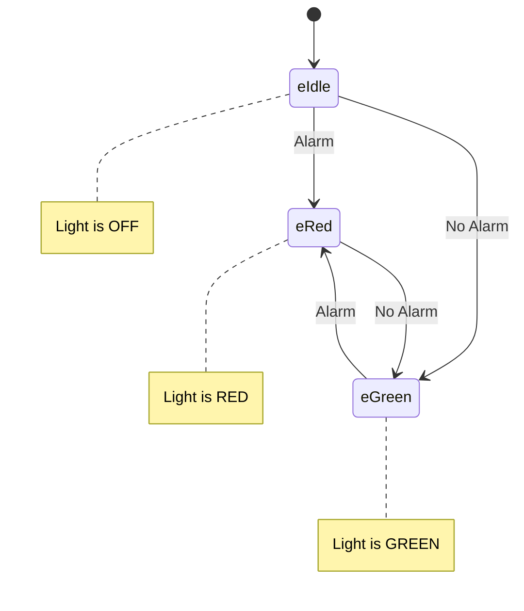
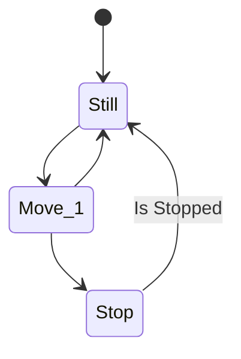

# Your own code and tests here:

There is nothing important here, the goal is to use this page to test some features for mermaid, copilot, markdown and so on.

**Suppose we want to add a special case**

---

### Other example

