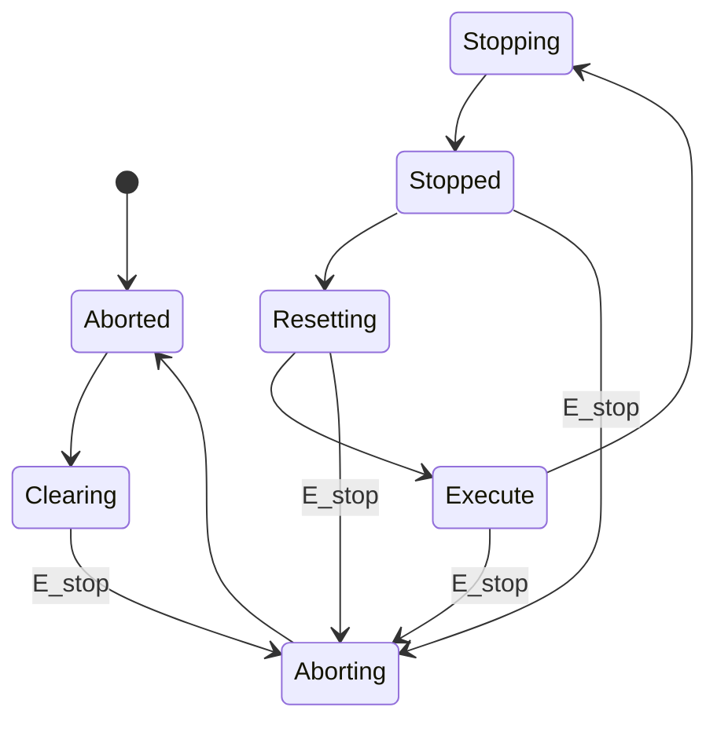
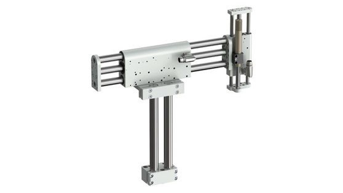
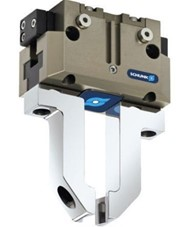
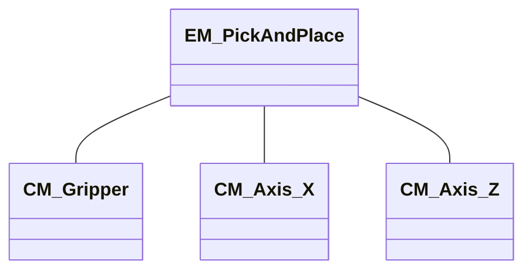
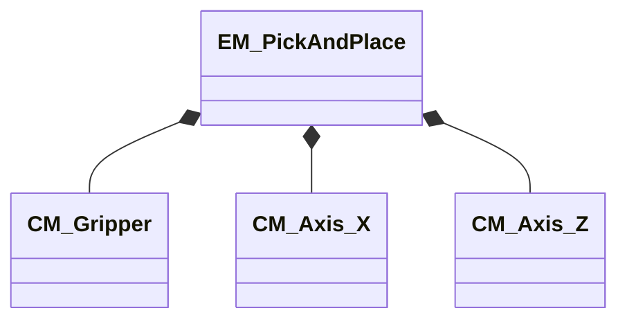

<h1 align="left">
  <br>
  
  <br>
  HEI-Vs Engineering School - Base Automation
  <br>
</h1>

-   Author: [Cédric Lenoir](mailto:cedric.lenoir@hevs.ch)


# Examen S4 du 28 mars 2024

## Exercice 1

### Enum type Pack
Décrire l’Enum ``E_State`` qui permette de réaliser la machine d’état suivante, sans oublier l’état initial. L'Enum est de type de base ``DINT``. La valeur initiale est ``Aborted``.

Beschreiben Sie die Enum ``E_State``, mit der Sie den folgenden Zustandsautomaten erstellen können, ohne den Anfangszustand zu vergessen. Die Enumeration hat den Basistyp ``DINT``. Der Anfangswert ist ``Aborted``.



#### Réponse
```iecst
TYPE E_State :
(
    Aborted   := 10,
    Clearing  := 20,
    Stopping  := 30,
    Stopped   := 40,
    Resetting := 50,
    Execute   := 60,
    Aborting  := 70
) DINT := Aborted; 
END_TYPE
```

##### Note: type de base
En IEC 61131-3, le type de base pour un ``ENUM`` peut être spécifié explicitement, comme dans l'exemple précédent avec ``DINT``. Si aucun type de base n'est spécifié, le type par défaut est généralement ``INT``. Cela dépend toutefois de l'implémentation spécifique de l'environnement de programmation, comme Codesys.

Le type de base peut être utilisé ensuite dans le code sous certaines conditions.
```iecst
VAR
    eState : E_State;
    myDint : DINT;
//
eState := myDint;
```
Sauf si l'ENUM est déclaré ''{attribute 'strict'}''.
```iecst
{attribute 'strict'}
TYPE E_State :
(
    Aborted := 10,
    Clearing := 20,
    Stopping := 30,
    Stopped := 40,
    Resetting := 50,
    Execute := 60,
    Aborting := 70
) DINT := Aborted; 
END_TYPE
```
Dans ce cas, le complilateur interdira l'affectation: eState := myDint;

## Exercice 2, data structure
### Information
-   Nous avons un système d’axes Y, horizontal et Z, vertical, soit un Pick & Place auquel on ajoutera une pince sur l’axe vertical.

-   Wir haben ein System von Y-Achsen (horizontal) und Z-Achsen (vertikal), also einem Pick & Place, zu dem wir eine Klemme auf der vertikalen Achse hinzufügen werden.

<div style="text-align: center;">
    
    <p><strong>Gripper Schunk:</strong> Source: <a href="https://linmot.com">https://linmot.com</a></p>
</div>

-   Chaque axe Y, horizontal et Z, vertical reçoit les entrées sorties hardware suivantes

-   Jede Y-Achse (horizontal) und Z-Achse (vertikal) erhält die folgenden hardware Ein- und Ausgänge:

```iecst
VAR
    xPowerOn	     : BOOL ;
    xMovePosOne      : BOOL ;
    xMovePosTwo      : BOOL ;
    xResetError      : BOOL ;
    // Et fournit les signaux suivants
    // Und liefert folgende Signale:
    xIsPowerOn	     : BOOL ;
    // The position is equal to the selected position
    xIsInSetPosition : BOOL ;	
    xIsError         : BOOL
END_VAR
```

-   La pince, Gripper, est équipée de **deux** capteurs, signaux digitaux **hardware**, TRUE/FALSE.
-   Die Klemme, Gripper ist mit **zwei** Sensoren ausgestattet, digitale Signale, **hardware** TRUE/FALSE.

<div style="text-align: center;">
    
    <p><strong>Gripper Schunk:</strong> Source: <a href="https://schunk.com">https://schunk.com</a></p>
</div>

-   La pince est pilotée par **une sortie** pour une électrovanne 3/2 qui permet deux positions du gripper, Open/Close.

-   Der Greifer wird durch **einen Ausgang** für ein 3/2-Magnetventil gesteuert, das zwei Greiferpositionen ermöglicht: Öffnen/Schließen.

### Tâche Une / Task Eins
-   Le système est un équipement, **Equipment Module**. Représenter son schéma ISA-88.

-   Das System ist ein Gerät **Equipment Module**. Stellen Sie das ISA-88-Diagramm dar.

<div style="text-align: center;">


</div>

### Tâche Deux / Task Zwei
-   Représenter une structure de donnée complète, **DUT** pour relier le hardware aux différentes éléments, TAGS.

-   Stellen Sie eine vollständige Datenstruktur, **DUT** dar, um die Hardware mit den verschiedenen Elementen zu verbinden TAGS


```iecst
TYPE ST_Axis
STRUCT
    xPowerOn         : BOOL;
    xMovePosOne      : BOOL;
    xMovePosTwo      : BOOL;
    xResetError      : BOOL;
    xIsPowerOn       : BOOL;
    xIsInSetPosition : BOOL;
    xIsError         : BOOL;
END_STRUCT
END_TYPE
```

```iecst
TYPE ST_Gripper
STRUCT
    xSensorOpen      : BOOL;
    xSensorClose     : BOOL;
    xValveControl    : BOOL;
END_STRUCT
END_TYPE
```

```iecst
TYPE ST_PandP
STRUCT
    stGripper  : ST_Gripper;
    stAxis_Y   : ST_Axis;
    stAxis_Z   : ST_Axis;
END_STRUCT
END_TYPE
```
> Copilot donnerait une réponse partiellement exacte. Environ 80% du travail est réutilisé.

### Tâche Trois / Task Drei
-   On utiliser le schéma ISA 88 pour représenter la structure UML des différents Function Block qui seront intégrés dans un PRG_Machine. **Dessiner le schéma UML des FBs**.

-   Wir verwenden das ISA 88-Diagramm, um die UML-Struktur der verschiedenen Funktionsblöcke darzustellen, die in eine PRG_Machine integriert werden. **Zeichnen Sie das UML-Diagramm des FBs**.

<div style="text-align: center;">


</div>

### Tâche quatre / Aufgabe Vier 9 pts

Proposer l’en tête d’un Function Block pour un axe qui intègre :
-   Une commande **Enable**
-   Une connexion avec le **hardware**.
-   Une information **Status**.
-   Un paramètre **SetPositionOne**	: ``LREAL``;
-   Un paramètre **SetPositionTwo**	: ``LREAL``;

Schlagen Sie den Header eines Funktionsblocks für eine Achse vor, der Folgendes integriert:
-   Ein **Enable** befehl
-   Eine Verbindung mit der **Hardware**.
-   **Status** informationen.
-   Ein **SetPositionOne**-Parameter: ``LREAL``;
-   Ein **SetPositionTwo**-Parameter: ``LREAL``;

```iecst
FUNCTION_BLOCK FB_Axis
VAR_INPUT
    xEnable          : BOOL;
    rSetPositionOne  : LREAL;
    rSetPositionTwo  : LREAL;
END_VAR
VAR_IN_OUT
    stHardware       : ST_Axis;
END_VAR
VAR_OUTPUT
    xStatus          : BOOL;
END_VAR
END_FUNCTION_BLOCK
```

> Copilot donne une réponse rigoureusement exacte.

### Tâche Cinq / Task Fünf 9 pts
Proposer un en-tête et un portion de code pour un FB_Gripper qui permette de générer une erreur si la pince n’est pas dans la bonne position après un délai ActivationDelay paramétrable en entrée. Mettre un délai par défaut de 200 [ms].
-   Une commande Close (Close if TRUE, Open if FALSE) 
-   Une connexion avec le hardware.
-   Une information Error.
-   Un paramètre d’entrée ActivationDelay	: TIME;

Schlagen Sie einen Header und einen Teil des Codes für einen FB_Gripper vor, der die Generierung eines Fehlers ermöglicht, wenn sich der Greifer nach einer als Eingabe konfigurierbaren Aktivierungsverzögerung nicht in der richtigen Position befindet. Stellen Sie eine Standardverzögerung von 200 [ms] ein.
-   Ein Close befehl (Close if TRUE, Open if FALSE)
-   Eine Verbindung mit der Hardware.
-   Error informationen.
-   Ein Eingabeparameter ActivationDelay-Parameter: TIME;

```iecst
FUNCTION_BLOCK FB_Gripper
VAR_INPUT
    xClose           : BOOL;
    tActivationDelay : TIME := T#200ms;
END_VAR
VAR_IN_OUT
    stHardware       : ST_Gripper;
END_VAR
VAR_OUTPUT
    xError           : BOOL;
END_VAR
VAR
    tTimer           : TON;
    xPositionValid   : BOOL;
END_VAR

// Implementation
tTimer(IN := xClose XOR stHardware.xSensorClose,
       PT := tActivationDelay);

xPositionValid := (xClose AND stHardware.xSensorClose) OR 
                  (NOT xClose AND stHardware.xSensorOpen);

xError := NOT xPositionValid AND
          tTimer.Q;

END_FUNCTION_BLOCK
```

> Copilot a généré une solution rigoureusement exacte. Seule la mise en forme du code a été légèrement revue, mise en colonne des paramètres de la fonction, des OR et AND, afin de rendre le code plus lisible.

<!-- This document contains markdown for an engineering exam, including exercises, diagrams, and code examples related to automation and control systems. -->