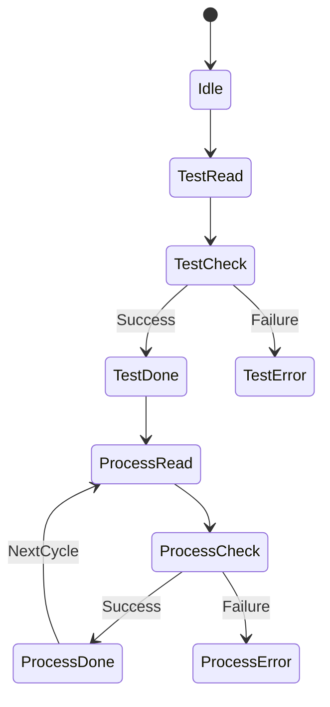
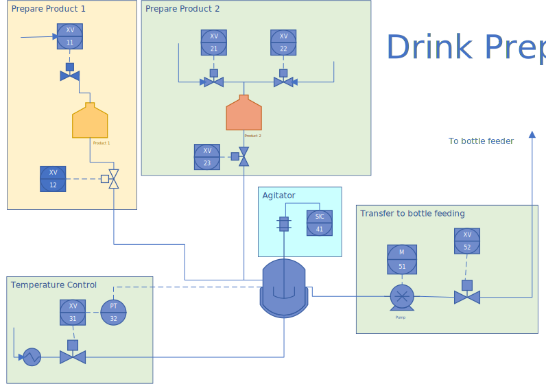
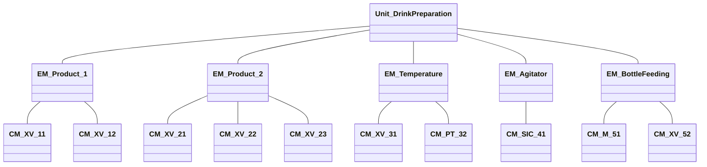
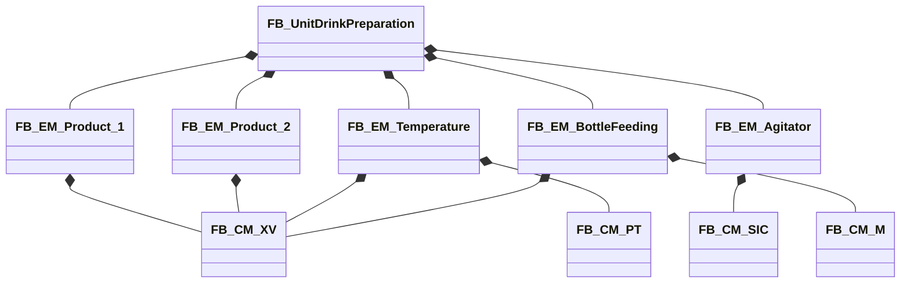
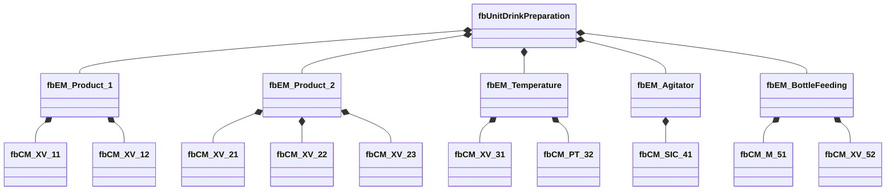

<h1 align="left">
  <br>
  
  <br>
  HEI-Vs Engineering School - Base Automation
  <br>
</h1>

-   Author: [Cédric Lenoir](mailto:cedric.lenoir@hevs.ch)


# Examen S4 du 31 mars 2025

## Exercice 1

-   Décrire l’Enum **EN_ModbusSensor** qui permette de réaliser la machine d’état suivante, sans oublier de définir l’état initial. Cet Enum est un DINT.

-   Beschreiben Sie die Enum **EN_ModbusSensor**, mit der Sie den folgenden Zustandsautomaten erstellen können, ohne zu vergessen, den Anfangszustand zu definieren. Diese Enum. ist ein DINT.



#### Solution / Lösung

Voici l’Enum **EN_ModbusSensor** en langage ST (Structured Text) pour réaliser la machine d’état décrite :

```iecst
TYPE EN_ModbusSensor :
(
    Idle         := 10,
    TestRead     := 20,
    TestCheck    := 30,
    TestDone     := 40,
    TestError    := 50,
    ProcessRead  := 60,
    ProcessCheck := 70,
    ProcessDone  := 80,
    ProcessError := 90 
) DINT := Idle;
END_TYPE
```

> Testé avec Copilot, non satisfait de la réponse pour les raisons suivantes:
> > Copilot a initialisé Idle à 0, ce que je ne veux pas, cas je ne veux pas que l'état initial soit initilisé par défaut en cas d'oubli de la situation initiale qui pourrait devoir être modifiée.
>
> > Copilot n'a pas utilisé DINT correctement.
> 
> > Copilot a utilisé des chiffres dans l'ordre, 0, 1, 2... je veux pouvoir insérer un chiffre intermédiaire, même si pour être honnête, la valeur des chiffre n'est pas vraiment importante, sinon que je ne veux pas de zero.

> Ne pas laisser une ENUM à 0, car à l'initialisation, l'état sera peut-être dans cet état sans que cela ne soit explicitement décrit / *Lassen Sie eine ENUM nicht auf 0, da sich der Zustand bei der Initialisierung in diesem Zustand befinden kann, ohne dass dies explizit beschrieben wird*.

## Exercice 2

<div style="text-align: center;">
    
    <p><strong>Drink preparation P&ID</strong> </p>
</div>

### Information
Le système ci-dessus est constitué de différents Equipment Module représentés par les rectangles Product / Control / Agitator / Feeding, ainsi que des Control Modules qui les composent. 
*Note : XV 31 et PT 32 sont deux CM différents.*

Das obige System besteht aus verschiedenen Equipment Module, die durch die Rechtecke Product / Control / Agitator / Feeding dargestellt werden, sowie den Control Modules, aus denen sie bestehen. 
*Bemerkung: XV 31 und PT 32 sind zwei verschiedene CMs.*

### Tâche Une / Task Eins
-   Geben Sie das ISA-88-Diagramm des P&ID-Diagramms an « Unit = Drink Preparation ».

-   Donner le schéma ISA-88 du diagramme P&ID « Unit = Drink Preparation ».

#### Solution / Lösung

<div style="text-align: center;">



</div>

### Tâche Deux / Task Zwei 5 pts
Les Control Modules du P&ID sont composés des entrées sorties suivantes :
-   XV	: Commande analogique output **xxxFlow**: ``REAL``.
-   SIC : Commande analogique output **xxxTurnMinute**: ``REAL``.
-   PT  : Mesure analogique input **xxxTemperature**: ``REAL``
-   M   : Commande analogique output **xxxTurnMinute**: ``REAL``.

Die P&ID-Control Module bestehen aus folgenden Ein- und Ausgängen:
-   XV	: Analoge Ausgangssteuerung **xxxFlow**: ``REAL``.
-   SIC	: Analoge Ausgangssteuerung **xxxTurnMinute**: ``REAL``.
-   PT	: Analoge Eingangsmessungen **xxxTemperature**: ``REAL``
-   M	: Analoge Ausgangssteuerung **xxxTurnMinute**: ``REAL``.
-   
Représenter **une** structure **<span style="color: red;">ST_HwInOut</span>** de donnée complète, **DUT** pour relier le hardware aux différents éléments, **TAGS**. Ici : une seule entrée ou sortie pour chaque Control Module. 
**xxx** pour identifier les appareils.

Stellen Sie eine vollständige Datenstruktur **<span style="color: red;">ST_HwInOut</span>**, **DUT** dar, um die Hardware mit den verschiedenen Elementen zu verbinden **TAGS**. Hier: ein einzelner Eingang oder Ausgang für jedes Control.
**xxx** zur Identifizierung von Geräten Modul.

#### Solution / Lösung

```iecst
TYPE ST_HwInOut :
STRUCT
    XV_11_Flow        : REAL;
    XV_12_Flow        : REAL;
    XV_21_Flow        : REAL;
    XV_22_Flow        : REAL;
    XV_23_Flow        : REAL;
    XV_31_Flow        : REAL;
    PT_32_Temperature : REAL;
    SIC_41_TurnMinute : REAL;
    M_51_TurnMinute   : REAL;
    XV_52_Flow        : REAL;
END_STRUCT
END_TYPE
```

### Tâche Trois / Aufgabe Drei 5 pts
-   Définissez une liste de Function Blocks et représentez le schéma UML de l’installation **<span style="color: red;">FB_UnitDrinkPreparation</span>**. Les XV sont tous identiques. Utiliser les symboles de Composition. Ne pas donner les détails internes des FBs.

-   Definieren Sie eine Liste von Function Blocks und stellen Sie das UML-Diagramm der Installation **<span style="color: red;">FB_UnitDrinkPreparation</span>** dar. Die XV sind alle identisch. Verwenden von Composition symbolen. Geben Sie keine internen Details von FBs weiter.

#### Solution / Lösung



> Copilot fait presque le travail correctement, en recherchant ce qui existe dans ce document, mais il inverse le sens des compositions.

> Il s'agit ici du diagramme de classe., il peut être plus clair de représenter le diagramme des objets. Les deux formulations sont acceptables selon que l'on veut l'ensembles des objets ou uniquement les classe à coder.



#### Solution / Lösung

### Tâche quatre / Task Vier 5 pts
Proposer **l’en tête** d’un Function Block **CM_Valve** pour **une** vanne XV qui intègre :
-   Une commande d’entrée **Enable**
-   Une commande d’entrée de débit **SetFlow**.
-   Une connexion avec le hardware **ST_HwInOut** de la tâche deux.
-   Deux BOOL de statut **InOp** et **Error**
-  
Schlagen Sie den **Header** eines Function Block **CM_Valve** für **ein** XV-Ventil vor, das Folgende integriert:
-   Ein **Enable**-Eingabebefehl
-   Ein **SetFlow**-Flow-Eingabebefehl.
-   Eine Verbindung mit der Hardware **ST_HwInOut** von Task zwei.
-   Zwei BOOLs für den **InOp**- und **Error** status

```iecst
FUNCTION_BLOCK CM_Valve
VAR_INPUT
    Enable   : BOOL;
    SetFlow  : REAL;
END_VAR
VAR_IN_OUT
    hw       : ST_HwInOut;
END_VAR
VAR_OUTPUT
    InOp     : BOOL;
    Error    : BOOL;
END_VAR
END_FUNCTION_BLOCK
```

> La réponse générée par Copilot est rigoureusement correcte.
> > Contrairement à ce que fait Copilot, je n'ajoute pas de commentaires quand les valeurs des variables sont suffisament explicite. Cela allourdi inutilement le code.

### Tâche cinq / Task Fünf 10 pts
On suppose une fonction FC_TempToFlow existante qui convertit la température de PT, un transmetteur de température, en débit pour piloter une vanne XV en fonction de la température. 
Flow := **FC_TempToFlow**(Temperature : REAL).

Proposer une implémentation de l'Equipment Module **EM_TemperatureControl**.
Avec
-   Input **Enable** pour activer le module.
-   Output **InOp** si le module est actif.
-   InOut : **hw** pour le hardware *ST_HwInOut de la tâche deux*.
-   Les Control Modules doivent être intégrés.

Wir gehen von einer vorhandenen FC_TempToFlow-Funktion aus, die die Temperatur von PT, einem Temperaturtransmitter, in Durchfluss umwandelt, um ein XV-Ventil basierend auf der Temperatur anzutreiben.
Flow := **FC_TempToFlow**(Temperature : REAL)

Schlagen Sie eine Implementierung des Gerätemoduls **EM_TemperatureControl** vor.
Mit:
-   Input **Enable** , um das EM Modul zu aktivieren.
-   Output **InOp**, wenn das EM Modul aktiv ist.
-   InOut : **hw** für hardware ST_HwInOut von Task zwei.
-   Steuermodule müssen integriert werden.

#### Solution / Lösung

```iecst
FUNCTION_BLOCK EM_TemperatureControl
VAR_INPUT
    Enable : BOOL;
END_VAR
VAR_IN_OUT
    hw      : ST_HwInOut;
END_VAR
VAR_OUTPUT
    InOp    : BOOL;
END_VAR
VAR
    cmPT_32  : CM_PT;
    cmXV_31  : CM_Valve;
END_VAR

// Main logic
IF Enable THEN
    // Activate FB
    cmPT_32.Enable := TRUE;
    cmXV_31.Enable := TRUE;

    cmXV_31.SetFlow := FC_TempToFlow(Temperature := cmPT_32.Temperature);

    InOp := FALSE;
ELSE
    // Disable FB
    cmPT_32.Enable := FALSE;
    cmXV_31.Enable := FALSE;

    // Reset module status
    InOp := FALSE;
END_IF;

cmPT_32(hw := hw);
cmXV_31(hw := hw);

END_FUNCTION_BLOCK
```

> Copilot utilise VAR_INST pour les Function Block, ce qui est faux. VAR_INST est utilisé pour des méthodes, en IEC 61131-3 OO qui sort du contexte de ce cours. De même que Copilot inverse les nom de variable et de classe dans la déclaration des Function Blocks. 
