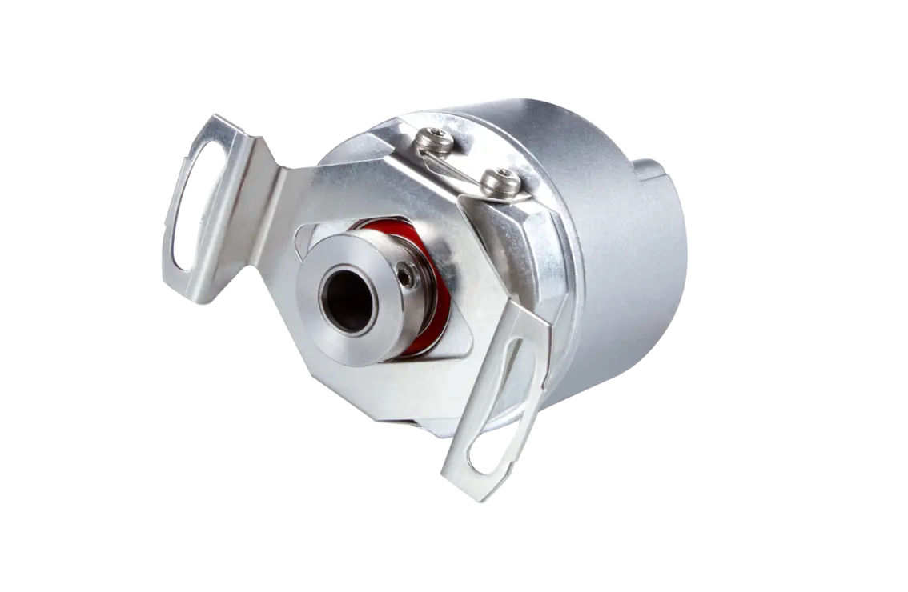
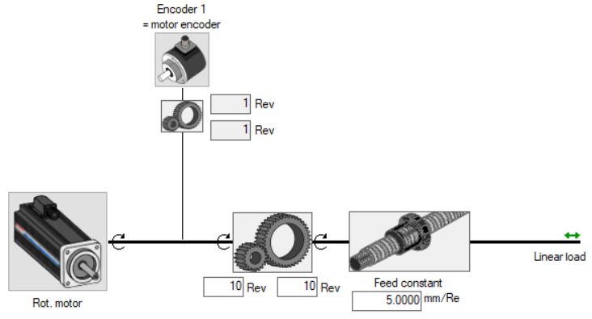
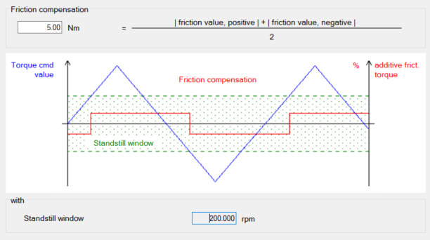
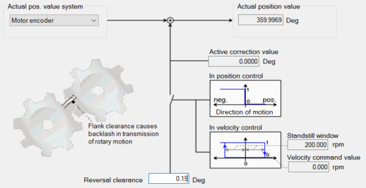

<h1 align="left">
   
  
   
  Industrial Automation Base
   
</h1>

Cours AutB

Author: [Cédric Lenoir](mailto:cedric.lenoir@hevs.ch)

# Module 07 Elements mechatronics software

*Keywords:* **PARAMETER ENCODER PARA**

# Objectif de ce module
Comprendre, paramétrer et découvrir une commande d'axe moderne.
Ce module sert principalement à présenter une mise en application du module *Elements mechatronics Hardware*.

Il est composé d'un introduction succincte à la mécanique vibratoire pour la comparer à son homoloque électrique, le circuit **RLC** resistor **R**, an inductor **L**, and a capacitor **C**.

En deuxième partie, nous découvrirons comment nous pouvons analyser ce problème à l'aide d'une commande d'axe.

> L'important n'est pas nécessairement de connaître tous les composants d'une commande complète. **Il est important par contre de prendre conscience de la complexité qui peuvent se cacher derrière une simple commande de position**. *A contrario*, **il est important de comprendre qu'une commande de haut de gamme permettra de résoudre de nombreux problèmes complexes**.

> **La majorité des commandes d'axes destinées à être connectées à des PLC sont conçues avec le même type d'architecture**. Le niveau de détail et le nombre d'options sont très variables.

> A la fin de ce module, vous devriez être capable de gérér les principaux paramètres de ce genre de système:

 <figure>
    
    <figcaption>Schematic Example 5 Axis Handling Solution, source: Bosch Rexroth</figcaption>
</figure>

# Aspect théorique
Dans le module précédent, mechatronics hardware, nous avons abordé un type d'entrainement équipé d'une vis à bille. Nous avons vu que les principaux paramètres du système étaient outre ses dimensions:
- La masse en mouvement.
- Le frottement.

Ces paramètres sont souvent suffisants pour définir un système simple à faible vitesse et pas très précis. Dès que nous allons chercher à augenter la vitesse et la précision nous allons être rapidement emmené à prendre en compte la troisième composante d'un système dynamique.

son élasticité.

# ICI la formule

En révisant 

 Equations of Motion for Forced Spring Mass Systems
 Voir ceci : [Forced vibration of damped, single degree of freedom, linear spring mass systems.](https://www.brown.edu/Departments/Engineering/Courses/En4/Notes/vibrations_forced/vibrations_forced.htm)

 # Equivalent RLC
 sdfasdf

## Base de travail
Une commande d'axe d'origine Bosch Rexroth basée sur le protocol Sercos III. Le protocol Sercos III est utilisé par Bosch Rexroth, Beckhoff. Si Le protocol Sercos est en passe d'être abandonné en tant que bus ethernet real-time au niveau de la transmission des données, il reste une référence au niveau de l'organisation des paramètres.

Cela signifie simplement que les identifiants des paramètres de l'axe et leur organisation est normalisée.

Par exemple:
|ID                      |Name                  |Data length     |Function|
|------------------------|----------------------|----------------|--------|
|``S-0-0040``            |Actual velocity value of encoder 1 |4Byte|The velocity feedback value of encoder 1 can be transferred from the drive controller to the control system cyclically or through the service channel.|
|``S-0-0036``            |Velocity command value |4Byte|In the "Velocity control" mode, "S-0-0036" takes effect as velocity command value.|

Dans un système de contrôle moteur basé sur un PLC, une commande d'axe **NC**, **Numerical Control** tiens une place particulière, en partie en raison de sa complexité.
Sans remonter trop loin dans l'histoire, les systèmes de commande moteur ont évolué très rapidement depuis le début des années 2000 avec l'arrivée des bus **Ethernet realtime**.

Avant l'arrivée des bus Ethernet Real-Time, la synchronisation des axes passait soit par un réseau fibre optique, **Sercos II**, soit par des éléments de synchronisation spécifiques, se qui rendait l'architecture complexe. Actuellement, la majorité des fournisseurs de systèmes PLC pour l'industrie fournissent leur solution. Le principe de fonctionnement reste globalement le même, si il n'existe pas de standard. Il existe actuellement des initiatives de normalisation qui tournent autour de **TSN**, **Time Sensitive Network** et **Sercos III**, mais **il ne faut pas s'attendre à une normalisation disponible sur le marché avant quelques années**.

> Il faut retenir que les commandes d'axes et les PLC ne sont souvent pas compatibles entre eux si ils proviennent de différents fournisseurs.

# First setup and execute initial movements with ctrlX DRIVE

Regarder ce truc: [First setup and execute initial movements with ctrlX DRIVE](https://developer.community.boschrexroth.com/t5/Store-and-How-to/First-setup-and-execute-initial-movements-with-ctrlX-DRIVE/ba-p/14227)

## Sélection du moteur
Cette étape peut être résumée en deux cas.

> Les moteurs seront vus en détail en semestre 5 & 6. Nous nous contentons ici d'une approche intuitive.

> En S6, Permanent magnet synchronous motors (PMSM)

### Le moteur est du même fournisseur que la commande d'axe.
Dans ce cas, il suffira en général de sélectionner le type du moteur dans un menu déroulant, voir, même plus simplement, si il s'agit d'un codeur numérique, le type de moteur sera reconnu automatiquement par la commande d'axe en lisant les parmètres du moteur dans le codeur.

### Le moteur et la commande d'axe viennent de deux fournisseurs différents.
**Peut s'avérer très complexe à paramétrer**.
 1. Il faut obtenir les paramètres du codeur et les introduire dans le système d'axe.
 2. Il faut obtenir les paramètres du moteur et les introduduire dans le système d'axe.
 
 > Il est strictement inutile de chercher à mettre en service un moteur et son codeur sans **une liste précise de leurs paramètres**.

 > La liste des paramètres ne suit pas une norme. Il sera important de vérifier **avant la commande du matériel**, si le moteur et la commande d'axe sont compatibles.

 ## Paramétrage du codeur

 <figure>
    
    <figcaption>Incremental rotary encoders with integral bearing</figcaption>
</figure>

Ce codeur d'origine Heienhain est disponible en différentes configurations, Sine ou TTL et des nombres de lignes par tour de 100, 200, 250, 360, 400, 500, 720, 900, 1000, 1024, 1250, 1500, 2000, 2048, 2500 ou 3600 incréments.

 ## Parmétrage de la mécanique
Le paramétrage de la mécanique permet en particulier à la commande de retourner à l'utilisateur des valeurs réelle avec une résolution et des unités qui sont définies ici.
 <figure>
    
    <figcaption>Axis Mechanics And Scaling</figcaption>
</figure>

Par exemple:
|ID                      |Name                  |Data length     |
|------------------------|----------------------|----------------|
|``S-0-0123``            |Feed constant|4Byte|
|``S-0-0121``            |Input revolutions of load gear|4Byte|
|``S-0-0122``            |Output revolutions of load gear|4Byte|
|``S-0-0044``            |Velocity data scaling type|2Byte|

# Limit values
Les valeurs limites servent à protéger 

# Drive control
La partie contrôle se découpe en général en deux partie distinctes, **Axis Control** et **Motor Control**.

## Axis Control

## Motor Control

## Exemples de fonctions de correction
### Friction torque (force) compensation

Cette fonction va simplifier le travail du régulateur. Il est à noter que en dessous d'une certaine vitesse, le système est considéré comme à l'arrêt, la compensation ne sera activée dans la direction donnée que si la commande dépasse ce seuil.

La compensation du frottement est principalement destinée à être utilisée dans les machines-outils de précision et à réduire les erreurs de trajectoire causées par le frottement statique. Cela s'applique particulièrement aux erreurs circulaires au niveau des transitions de quadrants. Par exemple, si l'on fraise une forme circulaire avec deux axes x, et y, il y a forcément un moment ou l'un des axes passe par une vitesse nulle. 

 <figure>
    
    <figcaption>Friction torque (force) compensation</figcaption>
</figure>

### Backlash on reversal correction

La correction suivante est utile pour des entrainements munis de roues dentées. Si l'on considère le cas d'un codeur uniquement sur le moteur, il y aura une différence, même minime entre la position finale selon la direction de l'entrainement. Cette différences, appelée backlash, peut être compensée automatiquement dans certains entraînements.

 <figure>
    
    <figcaption>Backlash on reversal correction</figcaption>
</figure>

## Operation mode
Il est uniquement important de savoir que les commande d'axe permettent en général de piloter un axe selon les modes suivants:
1. en couple (force)
2. en vitesse
3. en position

## Error reaction

## Safe motion
La notion de sécurité ne fait pas partie de ce cours. la seule chose importante **à savoir** est la suivante:
> Les fonctions de sécurité sont rarement des options qui peuvent être ajoutées ultérieurement, **les options de sécurité doivent être définies avant le choix du matériel !!!**.

# Bibiographie
**Mécanique vibratoire**. Auteurs: Michel Del Pedro, Pierre Pahud. 
