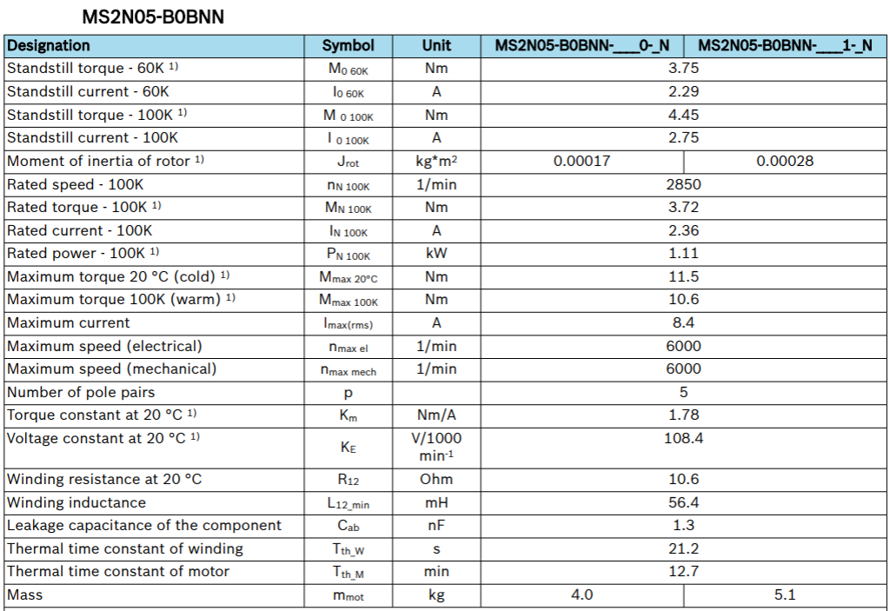

<h1 align="left">
   
  
   
  Industrial Automation Base
   
</h1>

Cours AutB

Author: [Cédric Lenoir](mailto:cedric.lenoir@hevs.ch)

# Module 07 Elements mechatronics software

*Keywords:* **PARAMETER ENCODER PARA**

# Ce module est en cours d'écriture

# Objectif de ce module
Comprendre, paramétrer et découvrir une commande d'axe moderne.
Ce module sert principalement à présenter une mise en application du module *Elements mechatronics Hardware*.

> L'important n'est pas nécessairement de connaître tous les composants d'une commande complète. **Il est important par contre de prendre conscience de la complexité qui peuvent se cacher derrière une simple commande de position**. *A contrario*, **il est important de comprendre qu'une commande de haut de gamme permettra de résoudre de nombreux problèmes complexes**.

> **La majorité des commandes d'axes destinées à être connectées à des PLC sont conçues avec le même type d'architecture**. Le niveau de détail et le nombre d'options sont très variables.

> A la fin de ce module, vous devriez être capable de comprendre les principaux paramètres de ce genre de système.

# Le drive du point de vue de la connection vers l'extérieur.
Ci dessous les différentes vue d'un système de commande d'axe particulier. La plupart des commandes d'axes électriques industrielles possèdent les même caractéristiques. Le système reste fondamentallement le même:

-    Piloter un moteur à partir d'une alimentation triphasée.
-    Utiliser un codeur pour asservir l'axe en position.
-    Prosposer un système de sécurité, STO, Safe Torque Off, présent en standard sur la plupart des commandes d'axe du marché.
-    Permettre une connexion avec un Ethernet Realtime.

# Top View

<figure align="center">
    
    <figcaption>Electrical Drive Front View</figcaption>
</figure>

## Alimentation électrique

<figure align="center">
    
    <figcaption>Aperçu de l’alimentation du moteur</figcaption>
</figure>

L'alimentation en puissance suite souvent le principe suivant:

## Supply
Alimentation 3 x AC avec convertisseur DC.

Certains systèmes travaillent avec des tensions différentes.
Certains systèmes sont conçus sans alimentation pour être connectés directement sur une alimentation de puissance en courant continu, DC.

> La qualité de l'alimentation peut avoir une influence sur la plage de travail du moteur. 

## Axis
Modulation du signal pour les trois phases du moteur.

### DC bus connexion (ici XD02). 
Le drive représenté ici, celui où se trouve le processeur du PLC, axe X, est alimenté en 3x400 [Vac]. Son convertisseur AC/DC est suffisamment puissant pour alimenter d’autres drives en tension continue. Le deuxième drive dans le laboratoire, pour les axes Y et Z ne contient pas de convertisseur AC/DC, il est alimenté via le bus DC de l’axe X.

### Régénération
Certaines alimentations haut de gamme permettent de réinjecter du courant dans le réseau, par exemple lors de la phase de décélération des moteurs. Le surcoût d’une telle alimentation n’est en général pas justifié pour de petites installations.

## Sécurité (ici XG41)
### Sécurité, STO, Safe Torque Off
La plupart des drives de cette catégories présents sur le marché son livrés avec une fonction de sécurité de base qui garanti l’absence du courant dans le moteur via un connexion dédiée, dans le cas du laboratoire, lié via un bouton d’arrêt d’urgence.
 
> Couple = courant x Nm/A.

La caractéristique des moteurs synchrone à aimanant permanent inclut le plus souvent un paramètre appxoximé comme constant: Torque constant: [Nm/A]..

<figure>
    
    <figcaption>Motor Technical Data Example</figcaption>
</figure>

<figure>
    
    <figcaption>Plage de travail d'un moteur synchrone</figcaption>
</figure>

Il existe d’autres types de fonctions de sécurité, SLS Safe Limited Speed, SOS Safe Operating Stop, qui sont souvent des options qui doivent être précisées à la commande et ne peuvent être ajoutées par la suite.
La sécurité peut être câblée ou passer via le bus Ethernet Real-Time.

 <figure>
    
    <figcaption>Logique câblée vs FSoE = FailSafe over EtherCAT</figcaption>
</figure>

## Analog, auxiliary inputs/outputs, ici XG31
Il est encore possible dans certains cas d'utiliser une commande d'axe électrique en passant par une série d'entrées/sorties analogiques/numériques. Avec la généralisation des bus Ethernet Realtime sur les PLC, ce genre de pilotage fait figure d'histoire ancienne.

Dans certains cas, il reste nécessaire de disposer de signaux plus rapides que ce que ne permet un Ethernet Realtime, par exemple une fin de course rapide pour un palpeur, ci-dessous un exemple d’origine Renishaw, 

 <figure>
    
    <figcaption>Accuracy Machine Tool Touch Probes, Source Renishaw</figcaption>
</figure>

## Bus de terrain, ici XF50, XF51, XF24 et XF24
Les connecteurs XF50, XF51, XF24 et XF24 servent à la connexion avec un Ethernet Realtime. En général, les fabricants ne fournissent qu’un seul type de bus de terrain.
Parfois, il existe la possibilité de choisir une option à la commande, mais non modifiable, par exemple linmot. Parfois, ce bus peut être configuré, mais c’est rare, Rexroth est le seul cas que je connaisse.

Dans le cadre du laboratoire, le drive X est équipé d’un Ethercat Master et d’un Profinet Slave.
Le Profinet Slave est en présérie, prerelease et n’est pas encore en service.

## Motor, ici XD03
Connection du moteur, le plus souvent sur trois phases, mais il existe quelques rares moteurs qui travaillent avec deux phases, Linmot. Les drives pour deux phases sont spécifiques à ce constructeur.

## Frein XG03
Dans certains cas, il est nécessaire de prévoir un frein, intégré ou auxiliaire.
Il est important de noter que le frein, en particulier celui intégré dans un moteur n’est pas destiné à décélérer le moteur, mais à le maintenir en position lorsque l’asservissement électrique n’est pas actif.

## Sonde de température XG03
> En finalité, ce qui va en général limiter la plage d'utilisation d'un moteur, c'est sa température.

Sans risque de destruction des conducteurs électrique par fusion, perte des caractéristiques magnétiques temporaires ou perte des aimants et d'autres risques liés à la température, la plage d'utilisation d'un moteur pourrait être considérablement élargies.

Certains moteur sont livrables en version **Forced Ventilation**, ou **Water Cooling** pour obtenir des performance supérieures pour un encombrement donné.

> Les sondes de températures ne sont en général pas dirctement utilisées comme indication de la température. En fonctionnement dynamiques, les différentes parties du moteur peuvent se trouver dans des plages de température très différentes, en particulier si le moteur exécute des mouvement de très faible amplitude. La sonde de température est en général utilisée comme base de référence à un model de température du moteur. C'est ce model qui surveillera la température du moteur.

## Codeur, ici XG20
La spécification du codeur est souvent l’interface la plus complexe à gérer.

Il existe de multiples technologies de transmission du signal du codeur, dont une partie sont propriétaires.

Quelques drives sont équipés d’interfaces dites multi codeurs. Les drives du laboratoire sont équipés uniquement d’une entrée pour un codeur numérique ACURO link.

Quelques exemples
1.	En-Dat 2.2, numérique, propriétaire Heidenhain.
2.	Sin-cos, générique
3.	TTL, générique
4.	Resolver, générique
5.	IO-Link, générique
6.	DRIVE-CLiQ, propriétaire Siemens
7.	Profinet
8.	Hyperface, 
9.	Hyperface DSL
10.	SSI
11.	…

## Codeur auxiliaire
Pour certaines applications, il peut être nécessaire d’ajouter un deuxième codeur. Pour prendre un exemple, dans le cas d’un entrainement avec une vis à bille, comme dans le cas du laboratoire 23N.411, le codeur rotatif sur le moteur servira au régulateur de vitesse, mais afin de compenser les déformations mécaniques il pourrait être nécessaire d’ajouter un codeur linéaire sur la vis à bille afin de garantir la précision finale en position.

Deuxième exemple d’application d’un deuxième codeur, pour les broches d’usinage à haute vitesse sur une machine d’usinage. Un codeur précis pour le positionnement angulaire de la broche à basse vitesse fournira un signal avec une fréquence trop élevée à haute vitesse. On équipera la broche avec une résolution plus faible pour la régulation de la vitesse lorsque la vitesse de rotation dépasse un certain seuil.

# Top View
 <figure>
    
    <figcaption>Vue de dessus, le plus souvent pour l'alimentation en puissance</figcaption>
</figure>

## Alimentation DC, XD10
La plupart des drives sont conçus avec une alimentation en puissance, bus DC et électronique interne séparée. Dans le milieu industriel, 24 Vdc.

## Contact auxiliaire pour l’alimentation, XG02
Ce contact reste ouvert tant que l’électronique interne n’est pas prête pour gérer la puissance électrique d’alimentation. Il sert en général à piloter un contacteur auxiliaire qui permet de couper l’alimentation AC.

# Bottom View

 <figure>
    
    <figcaption>Vue de dessous, le plus souvent connexion du moteur</figcaption>
</figure>

## Sonde de température, XG03
La température de moteur dépend principalement de trois facteurs :
•	Le taux d’utilisation, c’est-à-dire la puissance moyenne pendant une période donnée.
•	Le couplage mécanique du moteur et la résistance thermique ce de couplage.
•	La température ambiante autour du moteur.
Il est important de noter que la sonde de température sert de référence à un modèle de température interne. La sonde de température ne donne en effet qu’une mesure locale à un endroit particulier du moteur, il est important de protéger l’ensemble du moteur dont certaines parties pourraient changer de température plus rapidement que l’emplacement de la sonde.
Certains moteurs sont équipés de plusieurs sondes de température, par exemple une par bobine.

## Résistance de freinage externe XD04
Sauf exception avec des alimentations haut de gamme permettant de réinjecter du courant dans le réseau, l’énergie produite par le moteur en décélération sera en partie dissipée sous forme de chaleur par une résistance électrique interne au drive.
Dans certain cas, si l’énergie générée par le moteur est plus importante que celle que peut dissiper la résistance interne, il sera nécessaire d’ajouter une résistance externe supplémentaire.

# Aspect théorique
Dans le module précédent, mechatronics hardware, nous avons abordé un type d'entrainement équipé d'une vis à bille. Nous avons vu que les principaux paramètres du système étaient outre ses dimensions:
- La masse en mouvement.
- Le frottement.

Ces paramètres sont souvent suffisants pour définir un système simple à faible vitesse et pas très précis. Dès que nous allons chercher à augenter la vitesse et la précision nous allons être rapidement emmené à prendre en compte la troisième composante d'un système dynamique.

son élasticité.

# ICI la formule

En révisant 

 Equations of Motion for Forced Spring Mass Systems
 Voir ceci : [Forced vibration of damped, single degree of freedom, linear spring mass systems.](https://www.brown.edu/Departments/Engineering/Courses/En4/Notes/vibrations_forced/vibrations_forced.htm)

 # Equivalent RLC
 sdfasdf

## Base de travail
Une commande d'axe d'origine Bosch Rexroth basée sur le protocol Sercos III. Le protocol Sercos III est utilisé par Bosch Rexroth, Beckhoff. Si Le protocol Sercos est en passe d'être abandonné en tant que bus ethernet real-time au niveau de la transmission des données, il reste une référence au niveau de l'organisation des paramètres.

Cela signifie simplement que les identifiants des paramètres de l'axe et leur organisation est normalisée.

Par exemple:
|ID                      |Name                  |Data length     |Function|
|------------------------|----------------------|----------------|--------|
|``S-0-0040``            |Actual velocity value of encoder 1 |4Byte|The velocity feedback value of encoder 1 can be transferred from the drive controller to the control system cyclically or through the service channel.|
|``S-0-0036``            |Velocity command value |4Byte|In the "Velocity control" mode, "S-0-0036" takes effect as velocity command value.|

Dans un système de contrôle moteur basé sur un PLC, une commande d'axe **NC**, **Numerical Control** tiens une place particulière, en partie en raison de sa complexité.
Sans remonter trop loin dans l'histoire, les systèmes de commande moteur ont évolué très rapidement depuis le début des années 2000 avec l'arrivée des bus **Ethernet realtime**.

Avant l'arrivée des bus Ethernet Real-Time, la synchronisation des axes passait soit par un réseau fibre optique, **Sercos II**, soit par des éléments de synchronisation spécifiques, se qui rendait l'architecture complexe. Actuellement, la majorité des fournisseurs de systèmes PLC pour l'industrie fournissent leur solution. Le principe de fonctionnement reste globalement le même, si il n'existe pas de standard. Il existe actuellement des initiatives de normalisation qui tournent autour de **TSN**, **Time Sensitive Network** et **Sercos III**, mais **il ne faut pas s'attendre à une normalisation disponible sur le marché avant quelques années**.

> Il faut retenir que les commandes d'axes et les PLC ne sont souvent pas compatibles entre eux si ils proviennent de différents fournisseurs.

# First setup and execute initial movements with ctrlX DRIVE

Regarder ce truc: [First setup and execute initial movements with ctrlX DRIVE](https://developer.community.boschrexroth.com/t5/Store-and-How-to/First-setup-and-execute-initial-movements-with-ctrlX-DRIVE/ba-p/14227)

## Sélection du moteur
Cette étape peut être résumée en deux cas.

> Les moteurs seront vus en détail en semestre 5 & 6. Nous nous contentons ici d'une approche intuitive.

> En S6, Permanent magnet synchronous motors (PMSM)

### Le moteur est du même fournisseur que la commande d'axe.
Dans ce cas, il suffira en général de sélectionner le type du moteur dans un menu déroulant, voir, même plus simplement, si il s'agit d'un codeur numérique, le type de moteur sera reconnu automatiquement par la commande d'axe en lisant les parmètres du moteur dans le codeur.

### Le moteur et la commande d'axe viennent de deux fournisseurs différents.
**Peut s'avérer très complexe à paramétrer**.
 1. Il faut obtenir les paramètres du codeur et les introduire dans le système d'axe.
 2. Il faut obtenir les paramètres du moteur et les introduduire dans le système d'axe.
 
 > Il est strictement inutile de chercher à mettre en service un moteur et son codeur sans **une liste précise de leurs paramètres**.

 > La liste des paramètres ne suit pas une norme. Il sera important de vérifier **avant la commande du matériel**, si le moteur et la commande d'axe sont compatibles.

 ## Paramétrage du codeur

 <figure>
    
    <figcaption>Incremental rotary encoders with integral bearing</figcaption>
</figure>

Ce codeur d'origine Heienhain est disponible en différentes configurations, Sine ou TTL et des nombres de lignes par tour de 100, 200, 250, 360, 400, 500, 720, 900, 1000, 1024, 1250, 1500, 2000, 2048, 2500 ou 3600 incréments.

 ## Parmétrage de la mécanique
Le paramétrage de la mécanique permet en particulier à la commande de retourner à l'utilisateur des valeurs réelle avec une résolution et des unités qui sont définies ici.
 <figure>
    
    <figcaption>Axis Mechanics And Scaling</figcaption>
</figure>

Par exemple:
|ID                      |Name                  |Data length     |
|------------------------|----------------------|----------------|
|``S-0-0123``            |Feed constant|4Byte|
|``S-0-0121``            |Input revolutions of load gear|4Byte|
|``S-0-0122``            |Output revolutions of load gear|4Byte|
|``S-0-0044``            |Velocity data scaling type|2Byte|

# Limit values
Les valeurs limites servent à protéger 

# Drive control
La partie contrôle se découpe en général en deux partie distinctes, **Axis Control** et **Motor Control**.

## Axis Control

## Motor Control

## Exemples de fonctions de correction
### Friction torque (force) compensation

Cette fonction va simplifier le travail du régulateur. Il est à noter que en dessous d'une certaine vitesse, le système est considéré comme à l'arrêt, la compensation ne sera activée dans la direction donnée que si la commande dépasse ce seuil.

La compensation du frottement est principalement destinée à être utilisée dans les machines-outils de précision et à réduire les erreurs de trajectoire causées par le frottement statique. Cela s'applique particulièrement aux erreurs circulaires au niveau des transitions de quadrants. Par exemple, si l'on fraise une forme circulaire avec deux axes x, et y, il y a forcément un moment ou l'un des axes passe par une vitesse nulle. 

 <figure>
    
    <figcaption>Friction torque (force) compensation</figcaption>
</figure>

### Backlash on reversal correction

La correction suivante est utile pour des entrainements munis de roues dentées. Si l'on considère le cas d'un codeur uniquement sur le moteur, il y aura une différence, même minime entre la position finale selon la direction de l'entrainement. Cette différences, appelée backlash, peut être compensée automatiquement dans certains entraînements.

 <figure>
    
    <figcaption>Backlash on reversal correction</figcaption>
</figure>

## Operation mode
Il est uniquement important de savoir que les commande d'axe permettent en général de piloter un axe selon les modes suivants:
1. en couple (force)
2. en vitesse
3. en position

## Error reaction

## Safe motion
La notion de sécurité ne fait pas partie de ce cours. la seule chose importante **à savoir** est la suivante:
> Les fonctions de sécurité sont rarement des options qui peuvent être ajoutées ultérieurement, **les options de sécurité doivent être définies avant le choix du matériel !!!**.

# Bibiographie
**Mécanique vibratoire**. Auteurs: Michel Del Pedro, Pierre Pahud. 
