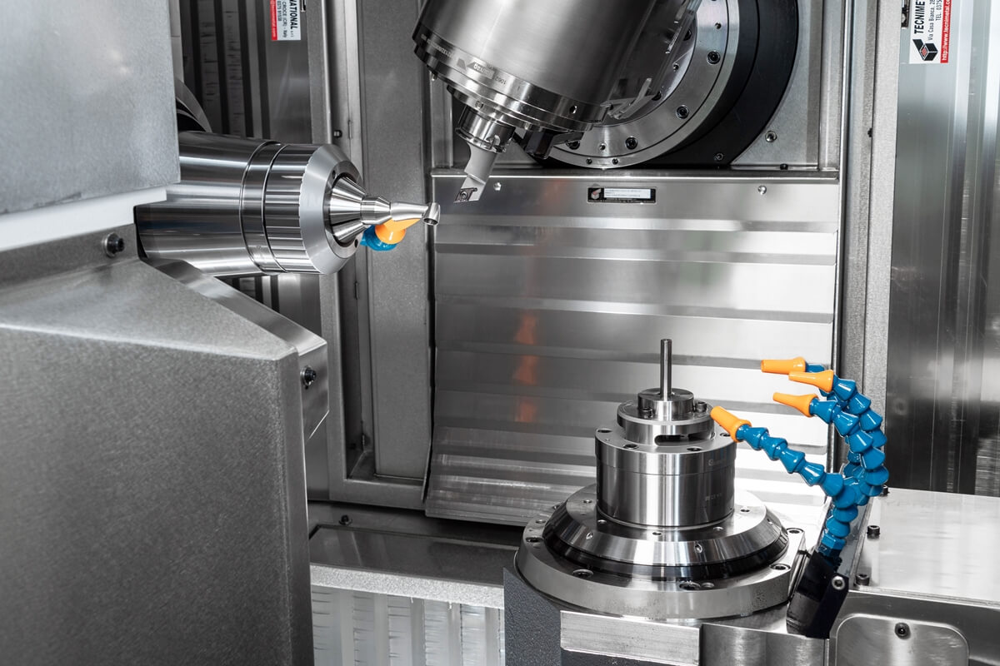
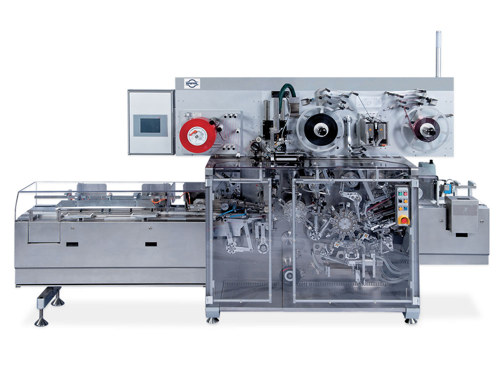
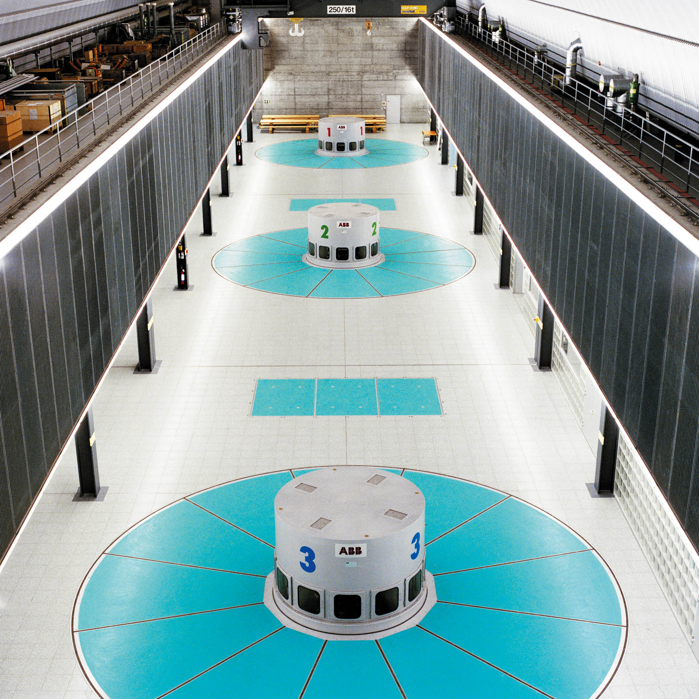
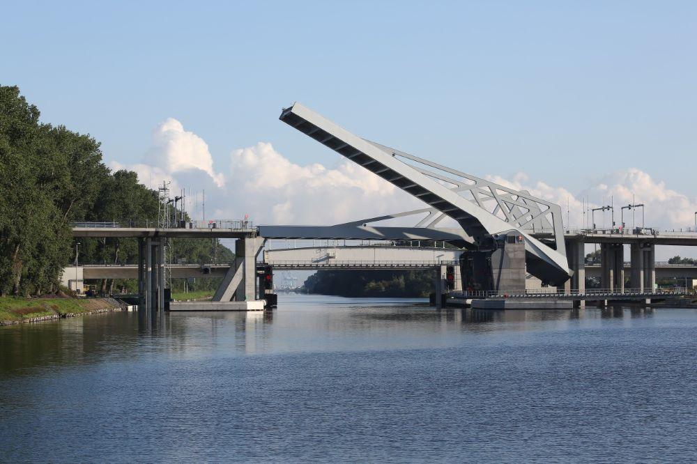
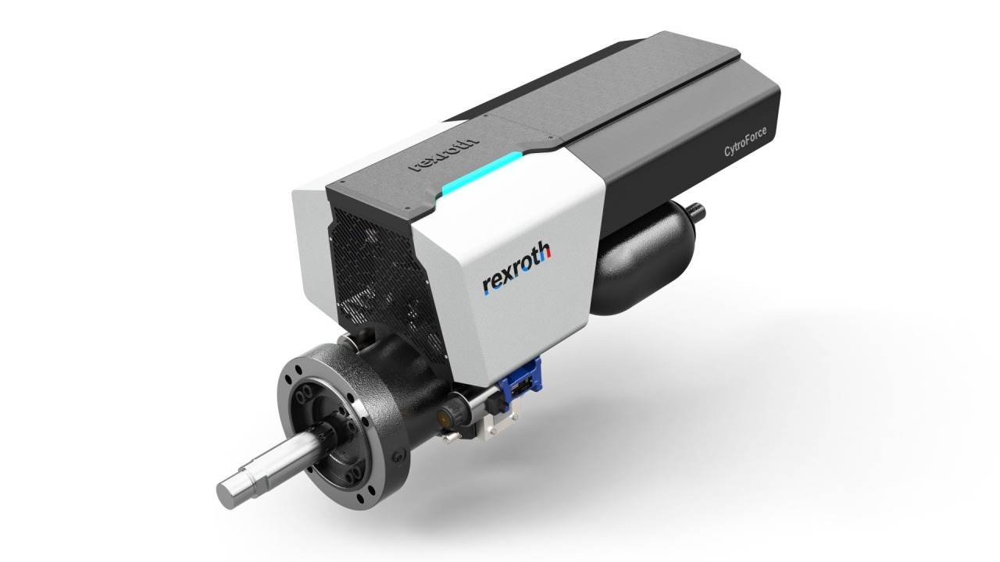
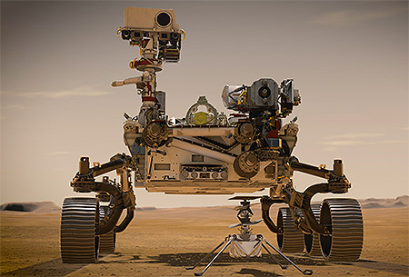

<h1 align="left">
   
  
   
  Industrial Automation Base
   
</h1>

Cours AutB

Author: [Cédric Lenoir](mailto:cedric.lenoir@hevs.ch)

# Module 07 Elements mechatronics

*Keywords:* **PARAMETER ENCODER PARA**

# Präambel
Ziel dieses Moduls ist es, eine Technologie vorzustellen, die eine Vielzahl sehr unterschiedlicher Anwendungen umfasst, und gleichzeitig zu versuchen, einen gemeinsamen Nenner zwischen ihnen zu finden.

## Kartesischer Roboter

> Eine Anwendung, die dem, was wir in unserem Labor haben, sehr nahe kommt.

<figure align="center">
    
    <figcaption>Cartesian robot with 4 axes</figcaption>
</figure>

## Elektrische Achsen in der Welt der Werkzeugmaschinen

<figure align="center">
    
    <figcaption>Bildquelle Starrag-Bumotec, 191 néo</figcaption>
</figure>

Das folgende Achsensystem weicht ein wenig vom tatsächlichen Bild ab. Das Teil wird auf der C-Achse bearbeitet und dann von den A/W-Achsen übernommen, um den Teil des Teils fertigzustellen, der nicht auf der C-Achse bearbeitet werden konnte.

<figure align="center">
    
    <figcaption>Multi axes system with direct drive, Bildquelle Bumotec</figcaption>
</figure>

## Eine dritte Form synchronisierter elektrischer Achsen

Vor dem Aufkommen von mit Ethernet Realtime synchronisierten Achssystemen wurde dieser Maschinentyp durch ein mechanisches System synchronisiert. Die Synchronisation über Ethernet Realtime vereinfacht die Verkabelung und erhöht die Flexibilität der Maschine für verschiedene Produktvarianten.

<figure align="center">
    
    <figcaption>Bildquelle Sapal SA à Ecublens</figcaption>
</figure>

## Hydraulik, wie wir sie im Wallis sehen

<figure align="center">
    
    <figcaption>Source: www.grande-dixence.ch</figcaption>
</figure>

> In gewisser Weise ist eine Turbine ein Motor, der umgekehrt arbeitet. Dies gilt für die Steuerung elektrischer Achsen insofern, als eine elektrische Achse während ihrer Verzögerungsphase Energie erzeugt, die meist über einen thermischen Widerstand abgeführt werden muss.

Einige elektrische Achsantriebe sind darauf ausgelegt, diese Energie wieder ins Netz einzuspeisen.

## Eine andere Sichtweise auf hydraulische Energie

> Wenn sich dieses Modul auf elektrische Achssteuerungen konzentriert, könnte ein großer Teil auch auf hydraulische Achsen angewendet werden.

Das Bild unten zeigt eine Brücke über den Baudouin-Kanal in Belgien. 340 [mm] Zylinderstangen, Gesamtleistung der Elektropumpen, die den Öldruck liefern, ca. 1000 [kW].

<figure align="center">
    
    <figcaption>Brücke in Belgien mit hydraulischer Steuerung</figcaption>
</figure>

- Vorteile der Hydraulik: starke bis sehr hohe Leistung.
- Nachteile: Komplexität und Wartungskosten.

> In der Praxis wird man eher von elektrohydraulischen Antrieben sprechen. Die elektrischen Steuerungen, die den Öldruck bereitstellen, ähneln häufig den Achsensteuerungen, die wir bei Laborarbeiten verwenden.

<figure align="center">
    
    <figcaption>Steuerung der Hydroachse</figcaption>
</figure>

## Eine pneumatische Achse
Nach elektrischer und hydraulischer Energie ist pneumatische Energie eine dritte Lösung, die in industriellen Systemen häufig zur Steuerung einer Achse eingesetzt wird.

<figure align="center">
    
    <figcaption>Original Schunk-Luftachse</figcaption>
</figure>

> Die pneumatische Energie wird im Allgemeinen von einem Kompressor bereitgestellt, der einen Elektromotor verwendet. Obwohl die pneumatische Technologie relativ einfach zu implementieren ist, ist sie im Hinblick auf die Energiekosten relativ teuer.

## Elektrische Achse mit Maßstabsänderung

EPOS4 Compact 50/5 EtherCAT, digital positioning controller
<figure align="center">
    
    <figcaption>Bildquelle Maxon Group</figcaption>
</figure>

<figure align="center">
    
    <figcaption>Bildquelle The modified EC 32 flat drive</figcaption>
</figure>

> The modified EC 32 flat drive. Nine of these drives are used in the Perseverance rover. The EC 20 flat with GP 22 UP gearhead. DCX 10 motors move the swashplate, which in turn controls the tilt of the rotor blades of the Mars helicopter.

<figure align="center">
    
    <figcaption>The Perseverance rover and the Mars helicopter Ingenuity. Image credit: NASA/JPL-Caltech</figcaption>
</figure>

> Unabhängig davon, ob es um die Steuerung einer tonnenschweren Brücke in Belgien oder um die Steuerung eines nur wenige Gramm schweren Motors geht, ähnlich dem, der zum Mars geflogen ist, bleiben bestimmte Prinzipien relativ ähnlich.

# Ziel dieses Moduls
Moderne elektrische Achssteuerung verstehen, konfigurieren und entdecken.

Auch wenn die Maßstäbe sehr unterschiedlich sind, sind einige der Konzepte, die wir in den folgenden Kursen behandeln, auf diese unterschiedlichen Tätigkeitsbereiche anwendbar.

> Es kommt nicht unbedingt darauf an, alle Bestandteile einer kompletten Bestellung zu kennen. **Es ist jedoch wichtig, sich der Komplexität bewusst zu sein, die sich hinter einem einfachen Positionsbefehl verbergen kann**. *Andererseits* **ist es wichtig zu verstehen, dass eine High-End-Steuerung viele verschiedene Probleme mit einem zugänglichen Ansatz lösen kann**.

> **Die meisten Achssteuerungen, die für den Anschluss an SPS vorgesehen sind, sind mit der gleichen Architektur konzipiert**. Der Detaillierungsgrad und die Anzahl der Optionen variieren stark.

> Am Ende dieses Moduls sollten Sie in der Lage sein, die Hauptparameter dieses Systemtyps zu verstehen.

[Der Antrieb unter dem Gesichtspunkt seiner Verbindung zur Außenwelt](README_DE.md)
