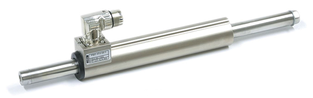
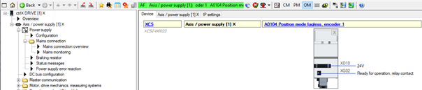

<h1 align="left">
   
  
   
  Industrial Automation Base
   
</h1>

Cours AutB

Author: [Cédric Lenoir](mailto:cedric.lenoir@hevs.ch)

# Module 07 le drive, connection vers l'extérieur.
Ci dessous les différentes vue d'un système de commande d'axe particulier. La plupart des commandes d'axes électriques industrielles possèdent les même caractéristiques. Le système reste fondamentallement le même:

-    Piloter un moteur à partir d'une alimentation triphasée.
-    Utiliser un codeur pour asservir l'axe en position.
-    Prosposer un système de sécurité, STO, Safe Torque Off, présent en standard sur la plupart des commandes d'axe du marché.
-    Permettre une connexion avec un Ethernet Realtime.

## Un drive Ethercat pour piloter des moteurs de quelque watt

<figure align="center">
    
    <figcaption>EPOS4 d'origine Maxon</figcaption>
</figure>

Dans la suite de ce cours, nous allons en général parler de moteurs alimentés via 3 phases AC 400[V].

# Alimentation AC/DC

|Entrée secteur avec un simple redresseur|Entrée secteur avec alimentation régulée|
|-----------|--------------|
|||

Dans la pratique, la différence entre les deux vient principalement du fait que l'alimentation régulée permet d'exploiter le moteur à des vitesses supérieure. Une grande partie de la différence tient au fait que les alimentations régulées fournissent une tension DC supérieure, de l'ordre de 750 VDC contre environ 600 VDC pour une alimentation non régulée. Il convient parfois d'être prudent, car tous les moteurs ne sont pas conçus pour supporter cette différence de tension.

> Dans certaines rares cas, par exemple pour des broches sur moteur à haute vitesse avec un moteur asynchrone, des alimentation régulées et plus stables en tension, permettent aussi de mieux exploiter le moteur aux limites de ces capacités.

Pour prendre l'exemple du moteur MS2N04-D0BQN de l'axe X du laboratoire d'automation.

|Alimentation non régulée|Alimentation régulée|
|-----------|--------------|
|||

Mais aussi, les alimentation régulées parettent parfois de réinjecter l'énergie de freinage dans le réseau.

> Certains systèmes travaillent avec des tensions différentes.
<figure align="center">
    
    <figcaption>Pick and Plance d'origine Jenny Science avec de moteurs 48 [Vdc]</figcaption>
</figure>

> Certains rares systèmes travaillent sur une ou deux phases.
<figure align="center">
    
    <figcaption>Cylindre électrique d'origine Linmot sur deux phases</figcaption>
</figure>

Les systèmes les plus courants travaillent selon le principe suivant:

<figure align="center">
    
    <figcaption>Aperçu de l’alimentation du moteur de l'axe X</figcaption>
</figure>

# Les drives du laboratoire d'automation de la HEVS.
|Single Axis X|Double Axis Y-Z|
|-----------|--------------|
|||

Le convertisseur XCS alimente le convertisseur XMD en tension continue de l'ordre de 600 [Vdc].

## Front View

<figure align="center">
    
    <figcaption>Electrical Drive Front View</figcaption>
</figure>

### DC bus connexion (ici XD02). 
Le drive représenté ici, celui où se trouve le processeur du PLC, axe X, est alimenté en 3x400 [Vac]. Son convertisseur AC/DC est suffisamment puissant pour alimenter d’autres drives en tension continue. Le deuxième drive dans le laboratoire, pour les axes Y et Z ne contient pas de convertisseur AC/DC, il est alimenté via le bus DC de l’axe X.

## Sécurité (ici XG41)
### Sécurité, STO, Safe Torque Off
La plupart des drives de cette catégories présents sur le marché son livrés avec une fonction de sécurité de base qui garanti l’absence du courant dans le moteur via un connexion dédiée, dans le cas du laboratoire, lié via un bouton d’arrêt d’urgence.

> Attention, dans de nombreux cas, les fonctions de sécurité sont des options qui ne sont disponibles qu'à la commande. **Si on devait ajouter par exemple une fonction SLS, Safe Limited Speed, aux axes du laboratoire, il faudrait commande de nouveaux systèmes !**. Il est important de connaître les contraintes de sécurité avant de commande le matériel.
 
> Couple = courant x Nm/A.

La caractéristique des moteurs synchrone à aimants permanents inclut le plus souvent un paramètre appxoximé comme constant: Torque constant: [Nm/A]..

<figure>
    
    <figcaption>Motor Technical Data Example</figcaption>
</figure>

<figure>
    
    <figcaption>Plage de travail d'un moteur synchrone</figcaption>
</figure>

Il existe d’autres types de fonctions de sécurité, SLS Safe Limited Speed, SOS Safe Operating Stop, qui sont souvent des options qui doivent être précisées à la commande et ne peuvent être ajoutées par la suite.
La sécurité peut être câblée ou passer via le bus Ethernet Real-Time.

 <figure>
    
    <figcaption>Logique câblée vs FSoE = FailSafe over EtherCAT</figcaption>
</figure>

## Analog, auxiliary inputs/outputs, ici XG31
Il est encore possible dans certains cas d'utiliser une commande d'axe électrique en passant par une série d'entrées/sorties analogiques/numériques. Avec la généralisation des bus Ethernet Realtime sur les PLC, ce genre de pilotage fait figure d'histoire ancienne.

Dans certains cas, il reste nécessaire de disposer de signaux plus rapides que ce que ne permet un Ethernet Realtime, par exemple une fin de course rapide pour un palpeur, ci-dessous un exemple d’origine Renishaw, 

 <figure>
    
    <figcaption>Accuracy Machine Tool Touch Probes, Source Renishaw</figcaption>
</figure>

## Bus de terrain, ici XF50, XF51, XF24 et XF24
Les connecteurs XF50, XF51, XF24 et XF24 servent à la connexion avec un Ethernet Realtime. En général, les fabricants ne fournissent qu’un seul type de bus de terrain.
Parfois, il existe la possibilité de choisir une option à la commande, mais non modifiable, par exemple linmot. Parfois, ce bus peut être configuré, mais c’est rare, Rexroth est le seul cas que je connaisse.

Dans le cadre du laboratoire, le drive X est équipé d’un Ethercat Master et d’un Profinet Slave.
Le Profinet Slave est en présérie, prerelease et n’est pas encore en service.

## Motor, ici XD03
Connection du moteur, le plus souvent sur trois phases, mais il existe quelques rares moteurs qui travaillent avec deux phases, Linmot. Les drives pour deux phases sont spécifiques à ce constructeur.

## Frein XG03
Dans certains cas, il est nécessaire de prévoir un frein, intégré ou auxiliaire.
Il est important de noter que le frein, en particulier celui intégré dans un moteur n’est pas destiné à décélérer le moteur, mais à le maintenir en position lorsque l’asservissement électrique n’est pas actif.

## Sonde de température XG03
> En finalité, ce qui va en général limiter la plage d'utilisation d'un moteur, c'est sa température.

Sans risque de destruction des conducteurs électrique par fusion, perte des caractéristiques magnétiques temporaires ou perte des aimants et d'autres risques liés à la température, la plage d'utilisation d'un moteur pourrait être considérablement élargies.

Certains moteur sont livrables en version **Forced Ventilation**, ou **Water Cooling** pour obtenir des performance supérieures pour un encombrement donné.

> Les sondes de températures ne sont en général pas dirctement utilisées comme indication de la température. En fonctionnement dynamiques, les différentes parties du moteur peuvent se trouver dans des plages de température très différentes, en particulier si le moteur exécute des mouvement de très faible amplitude. La sonde de température est en général utilisée comme base de référence à un model de température du moteur. C'est ce model qui surveillera la température du moteur.

## Codeur, ici XG20
La spécification du codeur est souvent l’interface la plus complexe à gérer.

Il existe de multiples technologies de transmission du signal du codeur, dont une partie sont propriétaires.

Quelques drives sont équipés d’interfaces dites multi codeurs. Les drives du laboratoire sont équipés uniquement d’une entrée pour un codeur numérique ACURO link.

Quelques exemples
1.	En-Dat 2.2, numérique, propriétaire Heidenhain.
2.	Sin-cos, générique
3.	TTL, générique
4.	Resolver, générique
5.	IO-Link, générique
6.	DRIVE-CLiQ, propriétaire Siemens
7.	Profinet
8.	Hyperface, 
9.	Hyperface DSL
10.	SSI
11.	…

## Codeur auxiliaire
Pour certaines applications, il peut être nécessaire d’ajouter un deuxième codeur. Pour prendre un exemple, dans le cas d’un entrainement avec une vis à bille, comme dans le cas du laboratoire 23N.411, le codeur rotatif sur le moteur servira au régulateur de vitesse, mais afin de compenser les déformations mécaniques il pourrait être nécessaire d’ajouter un codeur linéaire sur la vis à bille afin de garantir la précision finale en position.

Deuxième exemple d’application d’un deuxième codeur, pour les broches d’usinage à haute vitesse sur une machine d’usinage. Un codeur précis pour le positionnement angulaire de la broche à basse vitesse fournira un signal avec une fréquence trop élevée à haute vitesse. On équipera la broche avec une résolution plus faible pour la régulation de la vitesse lorsque la vitesse de rotation dépasse un certain seuil.

# Top View
 <figure>
    
    <figcaption>Vue de dessus, le plus souvent pour l'alimentation en puissance</figcaption>
</figure>

## Alimentation DC, XD10
La plupart des drives sont conçus avec une alimentation en puissance, bus DC et électronique interne séparée. Dans le milieu industriel, 24 Vdc.

## Contact auxiliaire pour l’alimentation, XG02
Ce contact reste ouvert tant que l’électronique interne n’est pas prête pour gérer la puissance électrique d’alimentation. Il sert en général à piloter un contacteur auxiliaire qui permet de couper l’alimentation AC.

# Bottom View

 <figure>
    
    <figcaption>Vue de dessous, le plus souvent connexion du moteur</figcaption>
</figure>

## Sonde de température, XG03
La température de moteur dépend principalement de trois facteurs :
•	Le taux d’utilisation, c’est-à-dire la puissance moyenne pendant une période donnée.
•	Le couplage mécanique du moteur et la résistance thermique ce de couplage.
•	La température ambiante autour du moteur.
Il est important de noter que la sonde de température sert de référence à un modèle de température interne. La sonde de température ne donne en effet qu’une mesure locale à un endroit particulier du moteur, il est important de protéger l’ensemble du moteur dont certaines parties pourraient changer de température plus rapidement que l’emplacement de la sonde.
Certains moteurs sont équipés de plusieurs sondes de température, par exemple une par bobine.

## Résistance de freinage externe XD04
Sauf exception avec des alimentations haut de gamme permettant de réinjecter du courant dans le réseau, l’énergie produite par le moteur en décélération sera en partie dissipée sous forme de chaleur par une résistance électrique interne au drive.
Dans certain cas, si l’énergie générée par le moteur est plus importante que celle que peut dissiper la résistance interne, il sera nécessaire d’ajouter une résistance externe supplémentaire.

# Quelque exemples de moteurs
Les drives tels que ceux qui sont disponibles au laboratoire permettent de piloter le plupart des moteurs dits AC synchrones, dits aussi à aimants permanents, du marché, ainsi que des moteurs asynchrones ou à induction.

> Pour les moteurs asynchrones, pour les applications simples sans contrainte de position, par exemple un convoyeur ou une pompe, de simples convertisseurs de fréquence sont souvent une solution meilleur marché.

Pour une broche à haute vitesse, moteur asynchrone, de l'ordre de 50'000 [rpm], il faudra sans doute une commande d'axe haut de gamme.
<figure align="center">
    
    <figcaption>Broche d'origine TDM</figcaption>
</figure>

Moteur linéaire sans fer, permet des vitesse et des accélérations très importantes pour de faibles masses embarquées.
<figure align="center">
    
    <figcaption>Etel ILF+ avec refroidissement à air forcé</figcaption>
</figure>

# Quelque exemples de codeurs
Si les moteurs rotatifs sont le plus souvent équipés de codeurs rotatifs intégrés:

<figure align="center">
    
    <figcaption>Heindenhain Internal Rotary Encoder</figcaption>
</figure>

Les moteurs linéaires sont souvent livrés sans encapsultation mécanique et doivent faire l'objet d'une conception mécanique complète.

> Pour qu'un moteur à aimants permanents puisse fonctionner correctement, la position des aimants relative au codeur doit être connue. Sur certaines commande d'axe, il existe une procédure qui permet de mesurer cet alignement, on parle de méthode de commutation. Cette procédure n'est pas nécessaire pour les moteurs rotatifs avec codeur intégré, car le codeur et les aimants ont une position calibrée au montage. Ce qui n'est souvent pas le cas pour un moteur linéaire avec un codeur qui est indépendant mécaniquement des aimants.

<figure align="center">
    
    <figcaption>Renishaw Absolute Linear Encoder</figcaption>
</figure>

Quitte à insister sur le problème que représentent la variété des interfaces en automation, voici la liste des variantes disponibles pour le codeur ci-dessus en fonction des différents fabricants de commandes d'axe.

|Serial interface | Description |
|-----------------|-------------|
|BiSS C|Renishaw supports BiSS C (unidirectional) open protocol for absolute encoders|
|FANUC|EVOLUTE with FANUC (α and αi) serial interface is available for linear applications.|
|Mitsubishi|EVOLUTE with Mitsubishi serial interface is available in linear form.|
|Panasonic|EVOLUTE with Panasonic serial interface is available in linear form.|
|Siemens DRIVE-CLiQ|EVOLUTE with Siemens DRIVE-CLiQ serial interface is available (using external interface|
|Yaskawa|EVOLUTE with Yaskawa serial interface is available in linear form and is compatible with Sigma-5 and Sigma-7|

> On notera de la liste ci-dessus, qu'il ne serait pas possible d'intégrer ce codeur avec une commande de d'origine Bosch Rexroth. qui lui acceptera des codeurs avec les origines suivantes:

|Encoder type     |Comment|
|-----------------|-------------|
|Encoder with sine signals and HIPERFACE | Analog and Digital|
|Resolver encoder                        | Analog|
|Encoder with ACURO®link interface       | Digital, labo HEVS|
|Encoder with EnDat 2.2 interface (Heidenhain) | Digital|
|Encoder with SSI interface |Digtal, generic with configuration|
|Encoders with ctrlX SENSEmotor|Digital|

Historiquement, les codeur absolus, qui maintiennent une position connue après déclanchement de la machine étaient beaucoup plus honéreux que les codeurs relatifs, pour lesquels une procédure de référencement était nécessaire lors de chaque enclenchement de la machine. Cette affirmation est de moins en moins vraie et l'avantage de s'affranchir d'une procédure de référencement qui peux s'avérer compliquée, surtout quand de nombreux axes doivent être référencés, fait acutellement plutôt pencher la balance en faveur des codeurs absolus.

[Module 07 le drive, software](README_DriveSoft.md)