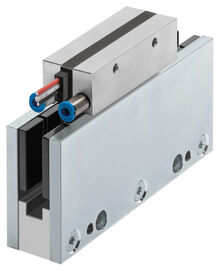

<h1 align="left">
   
  
   
  Industrial Automation Base
   
</h1>

Cours AutB

Author: [Cédric Lenoir](mailto:cedric.lenoir@hevs.ch)

# Module 07 le drive, hardware.
Ci dessous les différentes vue d'un système de commande d'axe particulier. La plupart des commandes d'axes électriques industrielles possèdent les même caractéristiques. Le système reste fondamentallement le même:

-    Piloter un moteur à partir d'une alimentation triphasée.
-    Utiliser un codeur pour asservir l'axe en position.
-    Prosposer un système de sécurité, STO, Safe Torque Off, présent en standard sur la plupart des commandes d'axe du marché.
-    Permettre une connexion avec un Ethernet Realtime.

## Un variateur équipé d'Ethercat pour piloter des moteurs de quelques watts

<figure align="center">
    
    <figcaption>EPOS4 d'origine Maxon</figcaption>
</figure>

- Dans la suite de ce cours, nous allons en général parler de moteurs alimentés via 3 phases AC 400[V], alors que dans le cas du drive Maxon il s'agit d'un petit moteur à courant continu.
- Ce cours ne se préoccupe pas de la partie analogique des moteurs, mais de la manière de piloter l'axe électrique avec quelques notions de configuration. De la même manière, les contraintes mécaniques du réducteur ci-dessous sont hors du champ de compétence.

<figure align="center">
    
    <figcaption>Maxon drive systems brushless dc motors stage</figcaption>
</figure>

# Alimentation AC/DC

|Entrée secteur avec un simple redresseur|Entrée secteur avec alimentation régulée|
|-----------|--------------|
|||

Dans la pratique, la différence entre les deux vient principalement du fait que l'alimentation régulée permet d'exploiter le moteur à des vitesses supérieure. Une grande partie de la différence tient au fait que les alimentations régulées fournissent une tension DC supérieure, de l'ordre de 750 VDC contre environ 600 VDC pour une alimentation non régulée. Il convient parfois d'être prudent, car tous les moteurs ne sont pas conçus pour supporter cette différence de tension.

> Dans certaines rares cas, par exemple pour des broches sur moteur à haute vitesse avec un moteur asynchrone, des alimentation régulées et plus stables en tension, permettent aussi de mieux exploiter le moteur aux limites de ces capacités.

Pour prendre l'exemple du moteur MS2N04-D0BQN de l'axe X du laboratoire d'automation.

|Alimentation non régulée|Alimentation régulée|
|-----------|--------------|
|||

Mais aussi, les alimentation régulées parettent parfois de réinjecter l'énergie de freinage dans le réseau.

> Certains systèmes travaillent avec des tensions différentes.
<figure align="center">
    
    <figcaption>Pick and Plance d'origine Jenny Science avec de moteurs 48 [Vdc]</figcaption>
</figure>

> Certains rares systèmes travaillent sur une ou deux phases.
<figure align="center">
    
    <figcaption>Cylindre électrique d'origine Linmot sur deux phases</figcaption>
</figure>

Les systèmes les plus courants travaillent selon le principe suivant:

<figure align="center">
    
    <figcaption>Aperçu de l’alimentation du moteur de l'axe X</figcaption>
</figure>

# Les drives du laboratoire d'automation de la HEVS.
|Single Axis X|Double Axis Y-Z|
|-----------|--------------|
|||

Le convertisseur XCS alimente le convertisseur XMD en tension continue de l'ordre de 600 [Vdc].

## Front View

<figure align="center">
    
    <figcaption>Electrical Drive Front View</figcaption>
</figure>

### DC bus connexion (ici XD02). 
Le drive représenté ici, celui où se trouve le processeur du PLC, axe X, est alimenté en 3x400 [Vac]. Son convertisseur AC/DC est suffisamment puissant pour alimenter d’autres drives en tension continue. Le deuxième drive dans le laboratoire, pour les axes Y et Z ne contient pas de convertisseur AC/DC, il est alimenté via le bus DC de l’axe X.

## Sécurité (ici XG41)
### Sécurité, STO, Safe Torque Off
La plupart des drives de cette catégories présents sur le marché son livrés avec une fonction de sécurité de base qui garanti l’absence du courant dans le moteur via un connexion dédiée, dans le cas du laboratoire, lié via un bouton d’arrêt d’urgence.

> Attention, dans de nombreux cas, les fonctions de sécurité sont des options qui ne sont disponibles qu'à la commande. **Si on devait ajouter par exemple une fonction SLS, Safe Limited Speed, aux axes du laboratoire, il faudrait commande de nouveaux systèmes !**. Il est important de connaître les contraintes de sécurité avant de commande le matériel.
 
> Couple = courant x Nm/A.

La caractéristique des moteurs synchrone à aimants permanents inclut le plus souvent un paramètre appxoximé comme constant: Torque constant: [Nm/A]..

<figure align="center">
    
    <figcaption>Motor Technical Data Example</figcaption>
</figure>

<figure align="center">
    
    <figcaption>Plage de travail d'un moteur synchrone</figcaption>
</figure>

Il existe d’autres types de fonctions de sécurité, SLS Safe Limited Speed, SOS Safe Operating Stop, qui sont souvent des options qui doivent être précisées à la commande et ne peuvent être ajoutées par la suite.
La sécurité peut être câblée ou passer via le bus Ethernet Real-Time.

 <figure align="center">
    
    <figcaption>Logique câblée vs FSoE = FailSafe over EtherCAT</figcaption>
</figure>

## Analog, auxiliary inputs/outputs, ici XG31
Il est encore possible dans certains cas d'utiliser une commande d'axe électrique en passant par une série d'entrées/sorties analogiques/numériques. Avec la généralisation des bus Ethernet Realtime sur les PLC, ce genre de pilotage fait figure d'histoire ancienne.

Dans certains cas, il reste nécessaire de disposer de signaux plus rapides que ce que ne permet un Ethernet Realtime, par exemple une fin de course rapide pour un palpeur, ci-dessous un exemple d’origine Renishaw, 

 <figure align="center">
    
    <figcaption>Accuracy Machine Tool Touch Probes, Source Renishaw</figcaption>
</figure>

## Bus de terrain, ici XF50, XF51, XF24 et XF24
Les connecteurs XF50, XF51, XF24 et XF24 servent à la connexion avec un Ethernet Realtime. En général, les fabricants ne fournissent qu’un seul type de bus de terrain.
Parfois, il existe la possibilité de choisir une option à la commande, mais non modifiable, par exemple linmot. Parfois, ce bus peut être configuré, mais c’est rare, Rexroth est le seul cas que je connaisse.

Dans le cadre du laboratoire, le drive X est équipé d’un Ethercat Master et d’un Profinet Slave.
Le Profinet Slave est en présérie, prerelease et n’est pas encore en service.

## Motor, ici XD03
Connection du moteur, le plus souvent sur trois phases, mais il existe quelques rares moteurs qui travaillent avec deux phases, Linmot. Les drives pour deux phases sont spécifiques à ce constructeur.

## Frein XG03
Dans certains cas, il est nécessaire de prévoir un frein, intégré ou auxiliaire.
Il est important de noter que le frein, en particulier celui intégré dans un moteur n’est pas destiné à décélérer le moteur, mais à le maintenir en position lorsque l’asservissement électrique n’est pas actif.

## Sonde de température XG03
> En finalité, ce qui va en général limiter la plage d'utilisation d'un moteur, c'est sa température.

Sans risque de destruction des conducteurs électrique par fusion, perte des caractéristiques magnétiques temporaires ou perte des aimants et d'autres risques liés à la température, la plage d'utilisation d'un moteur pourrait être considérablement élargies.

Certains moteur sont livrables en version **Forced Ventilation**, ou **Water Cooling** pour obtenir des performance supérieures pour un encombrement donné.

> Les sondes de températures ne sont en général pas dirctement utilisées comme indication de la température. En fonctionnement dynamiques, les différentes parties du moteur peuvent se trouver dans des plages de température très différentes, en particulier si le moteur exécute des mouvement de très faible amplitude. La sonde de température est en général utilisée comme base de référence à un model de température du moteur. C'est ce model qui surveillera la température du moteur.

## Codeur, ici XG20
La spécification du codeur est souvent l’interface la plus complexe à gérer.

Il existe de multiples technologies de transmission du signal du codeur, dont une partie sont propriétaires.

Quelques drives sont équipés d’interfaces dites multi codeurs. Les drives du laboratoire sont équipés uniquement d’une entrée pour un codeur numérique ACURO link.

Quelques exemples
1.	En-Dat 2.2, numérique, propriétaire Heidenhain.
2.	Sin-cos, générique
3.	TTL, générique
4.	Resolver, générique
5.	IO-Link, générique
6.	DRIVE-CLiQ, propriétaire Siemens
7.	Profinet
8.	Hyperface, 
9.	Hyperface DSL
10.	SSI
11.	…

## Codeur auxiliaire
Pour certaines applications, il peut être nécessaire d’ajouter un deuxième codeur. Pour prendre un exemple, dans le cas d’un entrainement avec une vis à bille, comme dans le cas du laboratoire 23N.411, le codeur rotatif sur le moteur servira au régulateur de vitesse, mais afin de compenser les déformations mécaniques il pourrait être nécessaire d’ajouter un codeur linéaire sur la vis à bille afin de garantir la précision finale en position.

Deuxième exemple d’application d’un deuxième codeur, pour les broches d’usinage à haute vitesse sur une machine d’usinage. Un codeur précis pour le positionnement angulaire de la broche à basse vitesse fournira un signal avec une fréquence trop élevée à haute vitesse. On équipera la broche avec une résolution plus faible pour la régulation de la vitesse lorsque la vitesse de rotation dépasse un certain seuil.

# Top View
 <figure align="center">
    
    <figcaption>Vue de dessus, le plus souvent pour l'alimentation en puissance</figcaption>
</figure>

## Alimentation DC, XD10
La plupart des drives sont conçus avec une alimentation en puissance, pour le bus DC, Direct Current, courant continue et électronique interne séparées. Dans le milieu industriel, 24 [Vdc].

## Contact auxiliaire pour l’alimentation, XG02
Ce contact reste ouvert tant que l’électronique interne n’est pas prête pour gérer la puissance électrique d’alimentation. Il sert en général à piloter un contacteur auxiliaire qui permet de couper l’alimentation AC.

# Bottom View

 <figure align="center">
    
    <figcaption>Vue de dessous, le plus souvent connexion du moteur</figcaption>
</figure>

## Sonde de température, XG03
La température de moteur dépend principalement de trois facteurs :
•	Le taux d’utilisation, c’est-à-dire la puissance moyenne pendant une période donnée.
•	Le couplage mécanique du moteur et la résistance thermique ce de couplage.
•	La température ambiante autour du moteur.
Il est important de noter que la sonde de température sert de référence à un modèle de température interne. La sonde de température ne donne en effet qu’une mesure locale à un endroit particulier du moteur, il est important de protéger l’ensemble du moteur dont certaines parties pourraient changer de température plus rapidement que l’emplacement de la sonde.
Certains moteurs sont équipés de plusieurs sondes de température, par exemple une par bobine.

## Résistance de freinage externe XD04
Sauf exception avec des alimentations haut de gamme permettant de réinjecter du courant dans le réseau, l’énergie produite par le moteur en décélération sera en partie dissipée sous forme de chaleur par une résistance électrique interne au drive.
Dans certain cas, si l’énergie générée par le moteur est plus importante que celle que peut dissiper la résistance interne, il sera nécessaire d’ajouter une résistance externe supplémentaire.

# Quelque exemples de moteurs
Les drives tels que ceux qui sont disponibles au laboratoire permettent de piloter le plupart des moteurs dits AC synchrones, dits aussi à aimants permanents, du marché, ainsi que des moteurs asynchrones ou à induction.

> Pour les moteurs asynchrones, pour les applications simples sans contrainte de position, par exemple un convoyeur ou une pompe, de simples convertisseurs de fréquence sont souvent une solution meilleur marché. Parfois un convertisseur de fréquence ne se justifiera pas et un simple contacteur triphasé suffira.

<figure align="center">
    
    <figcaption>Frequency Converter Altivar ATV71H075N4Z</figcaption>
</figure>

<figure align="center">
    
    <figcaption>Montech_Conveyor</figcaption>
</figure>

Pour une broche à haute vitesse, moteur asynchrone, de l'ordre de 50'000 [rpm], il faudra sans doute une commande d'axe haut de gamme.
<figure align="center">
    
    <figcaption>Broche d'origine TDM</figcaption>
</figure>

Moteur linéaire sans fer, permet des vitesse et des accélérations très importantes pour de faibles masses embarquées.
<figure align="center">
    
    <figcaption>Etel ILF+ avec refroidissement à air forcé</figcaption>
</figure>

# Quelque exemples de codeurs
Si les moteurs rotatifs sont le plus souvent équipés de codeurs rotatifs intégrés:

<figure align="center">
    
    <figcaption>Heindenhain Internal Rotary Encoder</figcaption>
</figure>

Les moteurs linéaires sont souvent livrés sans encapsultation mécanique et doivent faire l'objet d'une conception mécanique complète.

> Pour qu'un moteur à aimants permanents puisse fonctionner correctement, la position des aimants relative au codeur doit être connue. Sur certaines commande d'axe, il existe une procédure qui permet de mesurer cet alignement, on parle de méthode de commutation. Cette procédure n'est pas nécessaire pour les moteurs rotatifs avec codeur intégré, car le codeur et les aimants ont une position calibrée au montage. Ce qui n'est souvent pas le cas pour un moteur linéaire avec un codeur qui est indépendant mécaniquement des aimants.

<figure align="center">
    
    <figcaption>Renishaw Absolute Linear Encoder</figcaption>
</figure>

Quitte à insister sur le problème que représentent la variété des interfaces en automation, voici la liste des variantes disponibles pour le codeur ci-dessus en fonction des différents fabricants de commandes d'axe.

|Serial interface | Description |
|-----------------|-------------|
|BiSS C|Renishaw supports BiSS C (unidirectional) open protocol for absolute encoders|
|FANUC|EVOLUTE with FANUC (α and αi) serial interface is available for linear applications.|
|Mitsubishi|EVOLUTE with Mitsubishi serial interface is available in linear form.|
|Panasonic|EVOLUTE with Panasonic serial interface is available in linear form.|
|Siemens DRIVE-CLiQ|EVOLUTE with Siemens DRIVE-CLiQ serial interface is available (using external interface|
|Yaskawa|EVOLUTE with Yaskawa serial interface is available in linear form and is compatible with Sigma-5 and Sigma-7|

> On notera de la liste ci-dessus, qu'il ne serait pas possible d'intégrer ce codeur avec une commande de d'origine Bosch Rexroth. qui lui acceptera des codeurs avec les origines suivantes:

|Encoder type     |Comment|
|-----------------|-------------|
|Encoder with sine signals and HIPERFACE | Analog and Digital|
|Resolver encoder                        | Analog|
|Encoder with ACURO®link interface       | Digital, labo HEVS|
|Encoder with EnDat 2.2 interface (Heidenhain) | Digital|
|Encoder with SSI interface |Digtal, generic with configuration|
|Encoders with ctrlX SENSEmotor|Digital|

Historiquement, les codeur absolus, qui maintiennent une position connue après déclanchement de la machine étaient beaucoup plus honéreux que les codeurs relatifs, pour lesquels une procédure de référencement était nécessaire lors de chaque enclenchement de la machine. Cette affirmation est de moins en moins vraie et l'avantage de s'affranchir d'une procédure de référencement qui peux s'avérer compliquée, surtout quand de nombreux axes doivent être référencés, fait acutellement plutôt pencher la balance en faveur des codeurs absolus.

# Quelques rappels de contraintes mécaniques sur un axe électrique

# Principes de base
Pour le dimensionnement de l'entraînement, **Drive Train**, la chaîne cinématique peut être divisée en système mécanique, **Mechanical System** et système d'entraînement, **Drive**.

Pour l'exemple du laboratoire d'automation, le système mécanique comprend les composants physiques
-  système de mouvement linéaire, *la vis à bille* **Ballscrew Module**, et éléments de transmission, **Transmission** (entraînement côté courroie, accouplement)
- et la charge, **Load** à transporter.

L'entraînement électrique est une combinaison moteur-contrôleur, **Motor-Controller** avec des données de puissance correspondantes.

Le dimensionnement de l'**entraînement électrique** se fait en prenant l'arbre du moteur comme point de référence.

Pour le dimensionnement de l'entraînement, il faut tenir compte des limites ainsi que des valeurs de base. Les limites ne doivent pas être dépassées afin d'éviter d'endommager les composants mécaniques.

<figure align="center">
    
    <figcaption>Entrainement avec vis à bille, schéma de principe</figcaption>
</figure>

## Données techniques et symboles de formule pour le système mécanique
Pour chaque composant (système de mouvement linéaire, accouplement, entraînement latéral par courroie, réducteur), les limites maximales autorisées correspondantes pour le **couple d'entraînement** et la **vitesse** ainsi que les valeurs de base pour le **moment de friction** et le **moment d'inertie** de **masse** doivent être utilisées.

Les données techniques suivantes avec les symboles de formule associés sont utilisées lors de la prise en compte des exigences de base du système mécanique dans les calculs de conception pour le dimensionnement de l'entraînement. Les données répertoriées dans le tableau ci-dessous se trouvent dans la section intitulée « Données techniques » ou sont déterminées à l'aide de formules basées sur les descriptions des pages suivantes.

### Contraintes mécaniques
-    Vitesse maximale admissible
-    Couple moteur admissible
-    Limites, calculer la vitesse et la décélération
-    Tenir compte des limites réeles
-    Tenir compte du couple pour l'accélération et la décélération
-    Pas de la vis à bille et de l'entrainement (Gear ratio).
-    Sens de déplacement
-    Quelle est la position de référence ?

> La documentation des axes du laboratoire donne les informations suivantes:

|Axe |Smax [mm]|u[mm/U]    |Vmax[m/s]   |amax [m/s2]   |Mmax[Nm] | d  |i   |
|----|---------|-----------|------------|--------------|---------|----|----|
|x   |565      |5.0        |0.3         |15            |8.22     |ccw |1   |
|y   |350      |5.0        |0.38        |15            |6.76     |ccw |1   |
|z   |320      |5.0        |0.57        |15            |2.39     |cw  |1   |

-    Nous sommes chez un fabricant allemand, U pour Umdrehung.
-    i = 1, Dans notre cas, le moteur est en prise directe avec le moteur ou via un engrenage 1/1.

## Ecart sur l'engrenage, Basklash, règle linéaire
Un des défaut des vis à bille est ce que l'on appelle le Backlash

La différence peut venir de la vis à bille.

<figure align="center">
    
    <figcaption>Backlash Animation, ball gaps exaggerated for visibility, Source: https://www.thomsonlinear.com/en/training/ball_screws/backlash</figcaption>
</figure>

Ou d'autres rapports de transmission intemédiaires.

<figure align="center">
    
    <figcaption>Backlash in mating gear transmissions, Source: Research Gate</figcaption>
</figure>

Certains entrainements électriques permettent de raccorer un deuxième codeur.

1- Le premier est utilisé pour la régulation du moteur.

2- Le deuxième permet de compenser la différence de position sur un régulateur de position.

# Ratio masse *avant* et *après* axe moteur
la Il n'y a pas de calcul théorique précis, en raison, par exemple, de la difficulté de calculer ou mesurer la rigidité de l'ensemble de l'entrainement.

Adaptation de la masse en mouvement
Idéalement la masse en mouvement du rotor doit être adapté dans un certain ratio à celui de la masse pilotée, si nécessaire on utilisera un réducteur
 

<figure align="center">
    
    <figcaption>Mitsubishi Inertia Ratio</figcaption>
</figure>

<figure align="center">
    
    <figcaption>Mitsubishi Inertia Ratio Frequency</figcaption>
</figure>
 

> Il existe passablement de techniques au niveau des régulateur pour permettre d’utiliser les moteurs les plus petits possible. Cela peut même s’avérer très efficace. Il faut cependant garder en tête que plus le niveau technique augmente, plus le réglage sera pointu. Un système peut aussi évoluer avec le temps, principalement au niveau du frottement.

Dans le monde de la machine-outil, la charge sur un moteur peut aussi changer continuellement selon le type d’usinage que l’on effectue. 

On trouve passablement de littérature sur le sujet, mais on peut garder en tête.
-    Plus le ration est proche de 1, plus le système sera facile à régler, on cherche à s’approcher de 1 dans le monde de la machine-outil.
-    Pour des applications peu critiques, on pourra se contenter de ratio de l’ordre de la dizaine.
-    Si l’on s’approche de la centaine ou plus, le système sera très difficile à gérer au niveau de la régulation, voire impossible. 

### La solution : un réducteur.
<figure align="center">
    
    <figcaption>Rexroth Gear reduction</figcaption>
</figure>
 

**Bosch Rexroth** donne l'information suivante, *Project planning/calculation R999000499* :
## Prise en compte du rapport des moments d'inertie de masse du système mécanique et du moteur.

Le rapport des moments d'inertie de masse sert d'indicateur pour les performances de contrôle d'une combinaison moteur-contrôleur.
Le moment d’inertie du moteur est directement lié à la taille du moteur.

## Rapport des moments d'inertie de masse
Pour la présélection, l'expérience a montré que les rapports suivants permettent d'obtenir des performances de contrôle élevées.
Il ne s’agit pas de limites rigides, mais les valeurs qui les dépassent nécessiteront un examen plus approfondi de l’application spécifique.

Ratio = moment d'inertie masse pilotée / mass côté moteur

|Domaine d'application  | Ratio |
|-----------------------|-------|
|Handling               | <= 6.0|
|Processing             | <= 1.5|

Par **Handling**, on entend système de manipulation, déplacement d'un objet.
Par **Processing**, on entend suivi précis de trajectoire, comme un machine outil type CNC.

## Pour citer une autre source de référence
**ABB** mentionne la remarque suivante dans un document de dimensionnement des moteurs: *Le rapport idéal entre l'inertie réfléchie et l'inertie du moteur est de **1:1**, un rapport qui permet d'obtenir le meilleur positionnement et la meilleure précision. L'inertie réfléchie ne doit pas dépasser l'inertie du moteur plus de **dix fois**, s'il est important de maintenir les performances de contrôle*.

L'expérience personnelle montre que des rapports d'inertie trop élevés, de l'ordre de 100, peuvent rendre un système même relativement rigide, totalement instable et impossible à piloter voir dangereux. La plupart des outils de configuration de système d'entrainement et de sélection de moteur des différents fabricants incluent en général un rapport type en fonction du type d'application. **Si le ratio est trop important, un réducteur sera proposé**.

# Température de fonctionnement
Il existe des moteur avec refroidissement libre, forcé ou par liquide.
-    Self-cooling
-    Forced ventilation
     Water cooling
Le refroidissement dépend de la résistance thermique du moteur dans son environnement. Par conduction et par convection.

L'aspect résistance thermique est particulièrement important pour un assemblage avec un moteur linéaire et complexe pour un moteur linéaire sans fer.

# Motion profile
Motion Profile
Il est nécessaire, si possible de connaitre non seulement la mécanique, mais aussi le profil d’utilisation. 
Le profil va principalement permettre de dimensionner le couple nominal du moteur, qui dépend en particulier de la température
 
<figure align="center">
    
    <figcaption>Motion Profile</figcaption>
</figure>

> Pour faire simple, l'intégration de la puissance électrique du moteur pendant un temps donné doit correspondre à une puissance thermique dissipée en tenant compte du rendement du moteur pendant cette période.
 
 # Les câbles
 Dans beaucoup d'équipements mobiles, un partie des câbles se déplacent avec les éléments mobile. Il existe des câbles spécialement confectionnés pour les équipements mobiles.
<figure align="center">
    
    <figcaption>Câbles et  les chaînes porte-câbles</figcaption>
</figure>

> **Les câbles sont la principale source de défaut dans les équipements mobiles**. Même si les câbles sont correctement sélectionnés et confectionnés, c'est une bonne pratique de prévoir des connecteurs pour que les câbles mobiles puissent être facilement remplacés.

# Maintenance mécanique
Les éléments mécanique nécessitent des interventions de maintenance comme la lubrification qui permettent de prolonger leur cycle de vie.

[Module 07 le drive, software](README_DriveSoft.md)