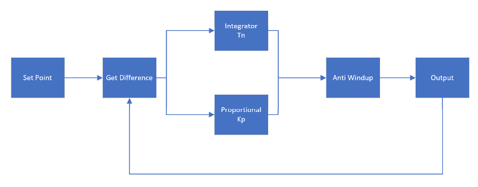

<h1 align="left">
  <br>
  
  <br>
  Industrial Automation Base
  <br>
</h1>

Cours AutB

Author: [Cédric Lenoir](mailto:cedric.lenoir@hevs.ch)

# Module 07 le drive, software.

# Cette partie est actuellement traitée directement dans le cadre du laboratoire: Voir: [LAB 05 Mise en service d'un axe électrique avec une vis à bille](https://github.com/hei-synd-autb/autb-lab-05)

# Régulateur PI
La théorie sur les régulateurs PI repose sur certains principes de linéarité des signaux. Dans la réalité, comme nous pouvons le voir dans le cadre du laboratoire, de nombreuses composantes ne sont absolument pas linéaires.

Ci-dessous, un aperçu des roulements de la vis à bille dans un axe CKK tel que dans le laboratoire d'automation.

<figure align="center">
    
    <figcaption>CKK Internal View</figcaption>
</figure>

Selon un figure d'origine SFK, fournisseur de roulement à bille, on peut observer un exemple de variation du frottement des roulements à bille en fonction de la vitesse.

<figure align="center">
    
    <figcaption>Source SFK, friction as a function of speed</figcaption>
</figure>

Une vue externe d'un module SFK montre que nous avons en sus, des lamelles en caoutchouc protègent la mécanique interne de la poussière.

<figure align="center">
    
    <figcaption>CKK External View</figcaption>
</figure>

Nous obtenons, selon documentation Bosch Rexroth, un exemple de la variation du frottement en fonction du temps sur un mouvement aller et retour sur l'ensemble de la course d'un système.

<figure align="center">
    
    <figcaption>Measurement of frictional torque of complete system</figcaption>
</figure>

Finalement, il conviendra de tenir compte de l'ensemble de la structure en mouvement, qui inclu des câbles dont le comportement est compliqué à estimer ainsi que de la rigidité de l'ensemble qui en plus des contraintes de masses, moments d'inertie et frottement ajoutera une composante élastique.

<figure align="center">
    
    <figcaption>HEVS Lab, system overview</figcaption>
</figure>

# Un pas plus loin
La régulation en position des moteurs synchrones utilise souvent le même schéma avec dans l'ordre:
- La commande de position,
- un régulateur de position,
- un régulateur de vitesse,
- un régulateur de courant qui via une constante de force ou couple convertit le courant en grandeur mécanique.

## Régulateur de courant
Le régulateur de courant dépend des caractéristiques électriques du moteur qui sont en principe bien connues et entrées comme paramètres dans le drive. Sauf exception, il n'est pas nécessaire de modifier les paramètres du regulateur de courant qui sont calculés par de drive.

## Régulateur de vitesse
Il dépend des paramètres mécaniques du système et est donc particulièrement compliqué à mettre au point quand les paramètres mécaniques sont non linéaires. C'est pourquoi on utilise souvent une base de travail empirique ou un algorithme d'**autotuning** interne au drive.

## Régulateur de position
Il dépend du type de processus. Par défaut un régulateur proportionnel avec un facteur ``1`` est souvent suffisant. 

Dans l'exemple ci-dessous, on ajoute un feedforward.
Le principe est de convertir directement une variation de position en courant à condition de connaître la masse ou le moment d'inertie du système à piloter. Le feedforward convient bien au suivi de position et permet de limiter l'erreur de poursuite à savoir l'écard entre la position de commande et le position mesurée.

On peut garder en tête qu'un régulateur sert avant tout à réagir aux perturbations non mesurables mais que tout ce qui permettra d'anticiper, à mettre en relation avec **forward**, améliorera le système.

<figure align="center">
    
    <figcaption>Feedforward or application of a model</figcaption>
</figure>

Le principe est d'apprendre à comprendre un sytème en visualisant les différentes composantes du mouvement. L'avantage de comprendre le système et de maîtriser la programmation est qu'il sera ensuite possible de compléter soit même le model général de pilotage d'un système.

### Exemple **sans** feedforward
<figure align="center">
    
    <figcaption>Motion without feedforward</figcaption>
</figure>

En analysant ce mouvement à faible vitesse, +/- 2 [mm] et 10 mm/s, dans le graphe, 600 mm/min, on peut visualiser par exemple la force de frottement dynamique.

### Exemple **avec** feedforward
<figure align="center">
    
    <figcaption>Motion with feedforward</figcaption>
</figure>

Ici, on peut visualiser le feedforward en noir et constater qu'il diminue efficacement l'écart de poursuite en violed pendant la phase d'accélération, augmentation de la vitesse en bleu.

On peut aussi constater que le feedforward permet de stabilier plus rapidement la vitesse en bleu et évite un dépassement de la vitesse, la petite bosse en augementation de vitesse sur le premier schéma.

# Exemple, écrire un régulateur PI.

<figure align="center">
    
    <figcaption>Simple PI regler</figcaption>
</figure>


## Pseudo code:
```iecst
Proportional Gain : Kp
Integration Time  := Tn
Integration Gain  := Ki

// Pseudo code PI Regler

Read(Setpoint)
Read(MeasureProcess)

error := Setpoint - MeasureProcess

// Integrator
// If Tn = 0, no integration
IF Tn > 0 THEN
	Ki := 1/Tn;
ELSE
	Ki := 0;
END_IF;
sumError := sumError + error;

// Before Limit
sumPI := Kp * error + Ki * sumError;

// Set Limit called sometimes 
IF sumPI > LimitHigh then
	Output := LimitHigh;
ELSIF sumPI < LimitLow then
	Output := LimitLow;	
ELSE
	Output := sumPI;
END_IF


Write(Output)
```

## Your job
-   Utiliser le modèle d'un FB **Enable In Operation Base** pour réaliser un régulateur PI dans un FB_PI.
-   Utiliser l'état Init pour réinitialiser le sommateur de l'intégrateur: ``sumError``.

# Conclusion
Si on sait écrire un régulateur PI, on pourrait aussi théoriquement écrire son propre système d'optimisation pour compenser un problème particulier.