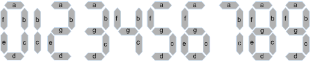
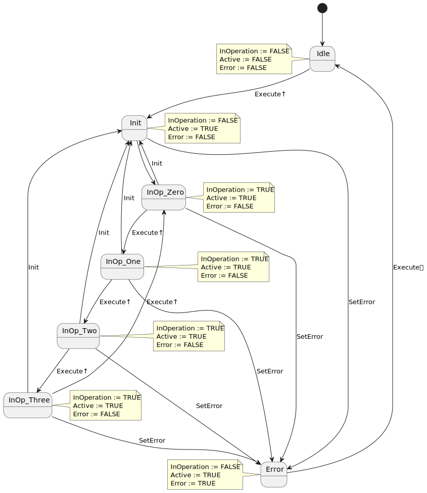
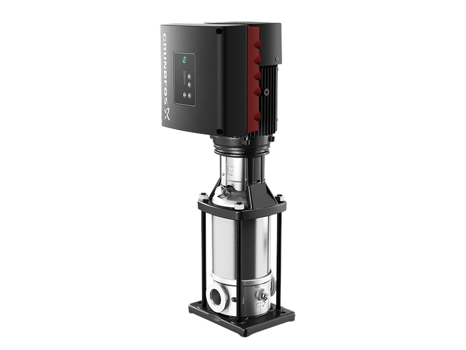

<h1 align="center">
  <br>
  
  <br>
  HEI-Vs Engineering School - Industrial Automation Base
  <br>
</h1>

Cours AutB

Author: [Cédric Lenoir](mailto:cedric.lenoir@hevs.ch)

# Module 05 Programmation robuste *Exercices*

# Exercices

Reprendre ## Exercice Work on data structure with VAR_IN_OUT, mais avec le calcul en continu avec un FB doté de InOp.

## Exercice 1, ``StateMachine_typ``
*Exercice court.*
> J'utilise souvent le préfixe **_typ**, pour identifier un **DUT**.

Déclarer une structure, ``STRUCT`` qui contienne:
- une variables ``selector`` de type ``E_Color`` pour une machine d'état. *Voir dans le script*.
- les variables nécessaire à la détermination de l'état précédent.
- les éléments nécessaires au comptage du nombre de transition vers le feu rouge depuis l'orange.
- une information en format STRING sur l'état actuel.

[Solution exercice 1](#solution-exercice-1-statemachine_typ)

## Exercice 2, 7 segments display, Enable.
*Exercice relativement long, ~1h.*

> Cet exercice pourra paraître un peu répétitif au niveau du codage. Cependant il permet de bien illustrer le principe de codage robuste.

> Si les conditions pour le passage d'un état à l'autre devenaient plus complexe, il s'avérera finalement beaucoup plus rapide à coder qu'un système conditionnel de type IF..ELSE..ELSIF.

> Il est très facile à lire et a analyser en cas de blocage dans un état.

Nous souhaitons piloter un affichage 7 segments à l'aide d'une machine d'état.
- Nous voulons utiliser un bloc fonctionnel ``FB_SevenDigitDriverEnable``
- Nous n'utilisons que les 4 premiers digits.
- La machine d'état utilise en toutes lettres, ``STATE_INOP_ZERO``, ``STATE_INOP_ONE``, ``STATE_INOP_TWO``, ``STATE_INOP_THREE``.
- Deux entrées codent les chiffres en binaire avec A et B, A = ``Msb``, B = Lsb``.
- Sept sorties servent à coder les sorties a à g, ``Sa``, ``Sb``, ``...``. 
- Nous utilisons **un block fonctionnel de type Enable**. Soit 7 états en tout.
- Un bit d'entrée, ``Vcc`` est connecté sur la tension d'alimentation de l'afficheur 7 segments,si cette valeur est FALSE, le FB signal une erreur.
- On attend une seconde, 1 [s] entre l'état Init et les états InOp** pour permettre à l'afficheur de se mettre en service.

<figure>
    
    <figcaption>7 segment Displays Number, image from www.electronics-tutorials.ws</figcaption>
</figure>

[Solution exercice 2](#solution-exercice-2-7-segments-display-enable)

## Exercice 3, 7 segments display, Execute.
*Exercice relativement court si exercice 2 déjà rédigé*

En prenant comme base l'exercice 2, [7 segments display, Enable](#exercice-2-7-segments-display-enable). On veut maintenant faire un compteur qui affiche successivement les digits 0-1-2-3-0... basé sur **un block fonctionnel de type Execute**, variante sans Done, **voir FSM ci-dessous**.

Notez l'état des sorties ``InOperation``, ``Active`` et ``Error`` dans la FSM.

<figure>
    
    <figcaption>State diagrame pour exercice 3</figcaption>
</figure>

> La FSM peut paraître comme très complexe. Dans la réalité, elle a été réalisée de manière à utiliser les mêmes états que l'exercice 2 et simplifier le codage. C'est la raison pour laquelle l'état Done n'apparaît pas comme dans le script du module 5.

> Robustesse signfie aussi capacacité à **tester tous les cas de figure**. Ici, tous les cas de figure sont clairement identifiés. Cela peut paraître extrêmement éxagéré pour un affichage à 7 segments, cela l'est peut-être nettement moins si il s'agit de piloter l'ouverture de la vanne d'une turbine de $423 [MW]$.

Les deux entrées de codage MSB et LSB sont abandonnées, mais par contre, on ajoute une entrée ``Init``, qui si elle est activée force le passage dans l'état Init.

A chaque **flanc montant** de l'entrée Execute, le compteur s'incrémente de 1.
1.  Quels sont les éléments du code qui doivent être modifié ?
2.  Modifier le code de l'exercice 2 pour réaliser ce compteur.

[Solution Exercice 3](#solution-exercice-3-7-segments-display-execute)

## Exercice 4, Move Absolute (Pas terminé, ne pas faire / Noch nicht fertig, tu es nicht)
Construire un bloc fonctionnel qui permette de mettre sous tension un axe et d'effectuer un mouvement absolu.
Les blocs fonctionnels suivants sont disponibles selon la [spécification de PLCopen](./documentation/plcopen_motion_control_part_1_version_2.0.pdf).

- MC_Power
- MC_Reset
- MC_MoveAbsolute.

> Dans ce cas de figure, on constate(ra) que la gestion d'un système, même relativement simple en apparence, peut rapidement s'avérer complexe si l'on veut que le système soit robuste. Les données sont présentées sous la forme des exigences de l'utilisateur, URS, User Requierments Specifications.

## Exercice 5, Move Velocity (Pas terminé, ne pas faire / Noch nicht fertig, tu es nicht)
Il s'agit d'une variante de [l'exercice 4](#exercice-4-move-absolute). Dans ce nouveau cas, il ne s'agit plus de travailler avec un axe en mode **position**, mais en mode **vitesse**. Un cas typique pourrait être le pilotage d'une pompe, débit proportionnel à la vitesse.

Reprendre les données de l'exercice précédent avec les modifications suivantes:
- Remplacer ``MC_MoveAbsolute`` par ``MC_MoveVelocity``.
- Remplacer la consigne de position par une consigne de vitesse.

<figure>
    
    <figcaption>Grundfos: Pompe centrifuge verticale multicellulaire avec convertisseur de fréquence intégré.</figcaption>
</figure>

# Solution Exercices

## Solution Exercice 1, ``StateMachine_typ``
```iecst
(*
	www.hevs.ch
	Institut Systemes Industriels
	Project: 	Module Robust Programming
	Author:		Cedric Lenoir
	Date:		2024 January 10
	
	Summary:	Answer Exercice 1 with optional comments.
*)
TYPE StateMachine_typ :
STRUCT
    // Variable selector
    selector            : E_Color;
    // Auxiliary variable to determine state N-1
    selectorMem         : E_Color;
    // Selector at N-1
    selectorNm1         : E_Color;
    // Trigger for transition
    trigOrangeRed       : R_TRIG;
    // Transitions number
    diCountOrangeRed    : DINT;
    // State information
    strColorText        : STRING;
END_STRUCT
END_TYPE
```

## Solution Exercice 2, 7 segments display, Enable.
Enum pour machine d'état.
```iecst
(*
	www.hevs.ch
	Institut Systemes Industriels
	Project: 	Module Robust Programming
	Author:		Cedric Lenoir
	Date:		2024 January 10
	
	Summary:	Enum for exercices 2 & 3.
*)
{attribute 'qualified_only'}
{attribute 'strict'}
TYPE E_SevenDigitDriver :
(
    STATE_IDLE  := 999,
    STATE_INIT := 1,
    STATE_INOP_ZERO := 2,
    STATE_INOP_ONE := 3,
    STATE_INOP_TWO := 4,
    STATE_INOP_THREE := 5,
    STATE_ERROR := 6    
) := STATE_IDLE;
END_TYPE
```
Header Function Block ``FB_SevenDigitDriverEnable``
```iecst
(*
	www.hevs.ch
	Institut Systemes Industriels
	Project: 	Module Robust Programming
	Author:		Cedric Lenoir
	Date:		2024 January 10
	
	Summary:	Function Block for exercice 2.
*)
FUNCTION_BLOCK FB_SevenDigitDriverEnable
VAR_INPUT
    Enable      : BOOL;
    Vcc         : BOOL;
    Msb         : BOOL;
    Lsb         : BOOL;
END_VAR
VAR_OUTPUT
    InOperation : BOOL;
    Error       : BOOL;
    Sa          : BOOL;
    Sb          : BOOL;
    Sc          : BOOL;
    Sd          : BOOL;
    Se          : BOOL;
    Sf          : BOOL;
    Sg          : BOOL;
END_VAR
VAR
    stateDigit  : E_SevenDigitDriver;
    tonToInOp   : TON;
END_VAR
```
Code Function Block ``FB_SevenDigitDriverEnable``
```iecst
CASE stateDigit OF
	E_SevenDigitDriver.STATE_IDLE:
        IF Enable THEN
            stateDigit := E_SevenDigitDriver.STATE_INIT;
        END_IF
    E_SevenDigitDriver.STATE_INIT:
        IF NOT Enable THEN
            stateDigit := E_SevenDigitDriver.STATE_IDLE;
        END_IF
        IF NOT Vcc THEN
            stateDigit := E_SevenDigitDriver.STATE_ERROR;
        END_IF
        IF NOT Msb AND
           NOT Lsb AND
           tonToInOp.Q THEN
            stateDigit := E_SevenDigitDriver.STATE_INOP_ZERO;
        END_IF
        IF NOT Msb AND
           Lsb     AND
           tonToInOp.Q THEN
            stateDigit := E_SevenDigitDriver.STATE_INOP_ONE;
        END_IF
        IF Msb     AND
           NOT Lsb AND
           tonToInOp.Q THEN
            stateDigit := E_SevenDigitDriver.STATE_INOP_TWO;
        END_IF
        IF Msb AND
           Lsb AND
           tonToInOp.Q THEN
            stateDigit := E_SevenDigitDriver.STATE_INOP_THREE;
        END_IF
    E_SevenDigitDriver.STATE_INOP_ZERO:
        IF NOT Enable THEN
            stateDigit := E_SevenDigitDriver.STATE_IDLE;
        END_IF
        IF NOT Vcc THEN
            stateDigit := E_SevenDigitDriver.STATE_ERROR;
        END_IF
        IF NOT Msb AND
           Lsb     THEN
            stateDigit := E_SevenDigitDriver.STATE_INOP_ONE;
        END_IF
        IF Msb     AND
           NOT Lsb THEN
            stateDigit := E_SevenDigitDriver.STATE_INOP_TWO;
        END_IF
        IF Msb AND
           Lsb THEN
            stateDigit := E_SevenDigitDriver.STATE_INOP_THREE;
        END_IF
    E_SevenDigitDriver.STATE_INOP_ONE:
        IF NOT Enable THEN
            stateDigit := E_SevenDigitDriver.STATE_IDLE;
        END_IF
        IF NOT Vcc THEN
            stateDigit := E_SevenDigitDriver.STATE_ERROR;
        END_IF
        IF NOT Msb AND
           NOT Lsb THEN
            stateDigit := E_SevenDigitDriver.STATE_INOP_ZERO;
        END_IF
        IF Msb     AND
           NOT Lsb THEN
            stateDigit := E_SevenDigitDriver.STATE_INOP_TWO;
        END_IF
        IF Msb AND
           Lsb THEN
            stateDigit := E_SevenDigitDriver.STATE_INOP_THREE;
        END_IF        
    E_SevenDigitDriver.STATE_INOP_TWO:
        IF NOT Enable THEN
            stateDigit := E_SevenDigitDriver.STATE_IDLE;
        END_IF
        IF NOT Vcc THEN
            stateDigit := E_SevenDigitDriver.STATE_ERROR;
        END_IF
        IF NOT Msb AND
           NOT Lsb THEN
            stateDigit := E_SevenDigitDriver.STATE_INOP_ZERO;
        END_IF
        IF NOT Msb AND
           Lsb     THEN
            stateDigit := E_SevenDigitDriver.STATE_INOP_ONE;
        END_IF
        IF Msb AND
           Lsb THEN
            stateDigit := E_SevenDigitDriver.STATE_INOP_THREE;
        END_IF
    E_SevenDigitDriver.STATE_INOP_THREE:
        IF NOT Enable THEN
            stateDigit := E_SevenDigitDriver.STATE_IDLE;
        END_IF
        IF NOT Vcc THEN
            stateDigit := E_SevenDigitDriver.STATE_ERROR;
        END_IF
        IF NOT Msb AND
           NOT Lsb THEN
            stateDigit := E_SevenDigitDriver.STATE_INOP_ZERO;
        END_IF
        IF NOT Msb AND
           Lsb     THEN
            stateDigit := E_SevenDigitDriver.STATE_INOP_ONE;
        END_IF
        IF Msb     AND
           NOT Lsb THEN
            stateDigit := E_SevenDigitDriver.STATE_INOP_TWO;
        END_IF
    E_SevenDigitDriver.STATE_ERROR:
        IF NOT Enable THEN
            stateDigit := E_SevenDigitDriver.STATE_IDLE;
        END_IF
END_CASE

// Timer Init to InOp
tonToInOp(IN := (stateDigit = E_SevenDigitDriver.STATE_INIT), PT := T#1S);

// Set outputs, there are many possibilities.
Sa := (stateDigit = E_SevenDigitDriver.STATE_INOP_ZERO) OR
      (stateDigit = E_SevenDigitDriver.STATE_INOP_TWO)  OR
      (stateDigit = E_SevenDigitDriver.STATE_INOP_THREE);
Sb := (stateDigit = E_SevenDigitDriver.STATE_INOP_ZERO) OR
      (stateDigit = E_SevenDigitDriver.STATE_INOP_ONE)  OR
      (stateDigit = E_SevenDigitDriver.STATE_INOP_TWO)  OR
      (stateDigit = E_SevenDigitDriver.STATE_INOP_THREE);
Sc := (stateDigit = E_SevenDigitDriver.STATE_INOP_ZERO) OR
      (stateDigit = E_SevenDigitDriver.STATE_INOP_ONE)  OR
      (stateDigit = E_SevenDigitDriver.STATE_INOP_THREE);
Sd := (stateDigit = E_SevenDigitDriver.STATE_INOP_ZERO) OR
      (stateDigit = E_SevenDigitDriver.STATE_INOP_TWO)  OR
      (stateDigit = E_SevenDigitDriver.STATE_INOP_THREE);
Se := (stateDigit = E_SevenDigitDriver.STATE_INOP_ZERO) OR
      (stateDigit = E_SevenDigitDriver.STATE_INOP_TWO);
Sf := (stateDigit = E_SevenDigitDriver.STATE_INOP_ZERO);
Sg := (stateDigit = E_SevenDigitDriver.STATE_INOP_TWO)  OR
      (stateDigit = E_SevenDigitDriver.STATE_INOP_THREE);

InOperation := (stateDigit = E_SevenDigitDriver.STATE_INOP_ZERO) OR
               (stateDigit = E_SevenDigitDriver.STATE_INOP_ONE)  OR
               (stateDigit = E_SevenDigitDriver.STATE_INOP_TWO)  OR
               (stateDigit = E_SevenDigitDriver.STATE_INOP_THREE);
               
Error := stateDigit = E_SevenDigitDriver.STATE_ERROR;              
```
Code has been tested in simulation with ctrlX Works
```
VAR
    fbSevenDigitDriverEnable : FB_SevenDigitDriverEnable;
END_VAR

// Call FB
fbSevenDigitDriverEnable();
```

## Solution Exercice 3, 7 segments display, Execute.
Header
```iecst
(*
	www.hevs.ch
	Institut Systemes Industriels
	Project: 	Module Robust Programming
	Author:		Cedric Lenoir
	Date:		2024 January 10
	
	Summary:	Function Block for exercice 3.
*)
FUNCTION_BLOCK FB_SevenDigitDriverExecute
VAR_INPUT
    Execute     : BOOL;
    Vcc         : BOOL;
    Init        : BOOL;
END_VAR
VAR_OUTPUT
    InOperation : BOOL;
    Active      : BOOL;
    Error       : BOOL;
    Sa          : BOOL;
    Sb          : BOOL;
    Sc          : BOOL;
    Sd          : BOOL;
    Se          : BOOL;
    Sf          : BOOL;
    Sg          : BOOL;
END_VAR
VAR
    stateDigit  : E_SevenDigitDriver;
    trigEx      : R_TRIG;
    tonToInOp   : TON;
    diDigitcnt  : DINT;
END_VAR
```
Code of Function Block
```iecst
//
// Used to get rising edge of Execute for counter
// Note that as an exception, FB Trigger called before FSM
//
trigEx(CLK := Execute); 

CASE stateDigit OF
	E_SevenDigitDriver.STATE_IDLE:
        IF Execute THEN
            stateDigit := E_SevenDigitDriver.STATE_INIT;
        END_IF
    E_SevenDigitDriver.STATE_INIT:
        IF NOT Vcc THEN
            stateDigit := E_SevenDigitDriver.STATE_ERROR;
        END_IF
        IF Execute     AND
           tonToInOp.Q THEN
            stateDigit := E_SevenDigitDriver.STATE_INOP_ZERO;
        END_IF
    E_SevenDigitDriver.STATE_INOP_ZERO:
        IF NOT Vcc THEN
            stateDigit := E_SevenDigitDriver.STATE_ERROR;
        END_IF
        IF Init THEN
            stateDigit := E_SevenDigitDriver.STATE_INIT;
        END_IF
        IF trigEx.Q THEN
            stateDigit := E_SevenDigitDriver.STATE_INOP_ONE;
        END_IF
    E_SevenDigitDriver.STATE_INOP_ONE:
        IF NOT Vcc THEN
            stateDigit := E_SevenDigitDriver.STATE_ERROR;
        END_IF
        IF Init THEN
            stateDigit := E_SevenDigitDriver.STATE_INIT;
        END_IF
        IF trigEx.Q THEN
            stateDigit := E_SevenDigitDriver.STATE_INOP_TWO;
        END_IF
    E_SevenDigitDriver.STATE_INOP_TWO:
        IF NOT Vcc THEN
            stateDigit := E_SevenDigitDriver.STATE_ERROR;
        END_IF
        IF Init THEN
            stateDigit := E_SevenDigitDriver.STATE_INIT;
        END_IF
        IF trigEx.Q THEN
            stateDigit := E_SevenDigitDriver.STATE_INOP_THREE;
        END_IF       
    E_SevenDigitDriver.STATE_INOP_THREE:
        IF NOT Vcc THEN
            stateDigit := E_SevenDigitDriver.STATE_ERROR;
        END_IF
        IF Init THEN
            stateDigit := E_SevenDigitDriver.STATE_INIT;
        END_IF
        IF trigEx.Q THEN
            stateDigit := E_SevenDigitDriver.STATE_INOP_ZERO;
        END_IF       
    E_SevenDigitDriver.STATE_ERROR:
        IF NOT Execute THEN
            stateDigit := E_SevenDigitDriver.STATE_IDLE;
        END_IF
END_CASE

// Timer Init to InOp
tonToInOp(IN := (stateDigit = E_SevenDigitDriver.STATE_INIT), PT := T#1S);

// Set outputs, there are many possibilities.
Sa := (stateDigit = E_SevenDigitDriver.STATE_INOP_ZERO) OR
      (stateDigit = E_SevenDigitDriver.STATE_INOP_TWO)  OR
      (stateDigit = E_SevenDigitDriver.STATE_INOP_THREE);
Sb := (stateDigit = E_SevenDigitDriver.STATE_INOP_ZERO) OR
      (stateDigit = E_SevenDigitDriver.STATE_INOP_ONE)  OR
      (stateDigit = E_SevenDigitDriver.STATE_INOP_TWO)  OR
      (stateDigit = E_SevenDigitDriver.STATE_INOP_THREE);
Sc := (stateDigit = E_SevenDigitDriver.STATE_INOP_ZERO) OR
      (stateDigit = E_SevenDigitDriver.STATE_INOP_ONE)  OR
      (stateDigit = E_SevenDigitDriver.STATE_INOP_THREE);
Sd := (stateDigit = E_SevenDigitDriver.STATE_INOP_ZERO) OR
      (stateDigit = E_SevenDigitDriver.STATE_INOP_TWO)  OR
      (stateDigit = E_SevenDigitDriver.STATE_INOP_THREE);
Se := (stateDigit = E_SevenDigitDriver.STATE_INOP_ZERO) OR
      (stateDigit = E_SevenDigitDriver.STATE_INOP_TWO);
Sf := (stateDigit = E_SevenDigitDriver.STATE_INOP_ZERO);
Sg := (stateDigit = E_SevenDigitDriver.STATE_INOP_TWO)  OR
      (stateDigit = E_SevenDigitDriver.STATE_INOP_THREE);

InOperation := (stateDigit = E_SevenDigitDriver.STATE_INOP_ZERO) OR
               (stateDigit = E_SevenDigitDriver.STATE_INOP_ONE)  OR
               (stateDigit = E_SevenDigitDriver.STATE_INOP_TWO)  OR
               (stateDigit = E_SevenDigitDriver.STATE_INOP_THREE);
          
Active := (stateDigit = E_SevenDigitDriver.STATE_INIT)      OR
          (stateDigit = E_SevenDigitDriver.STATE_INOP_ZERO) OR
          (stateDigit = E_SevenDigitDriver.STATE_INOP_ONE)  OR
          (stateDigit = E_SevenDigitDriver.STATE_INOP_TWO)  OR
          (stateDigit = E_SevenDigitDriver.STATE_INOP_THREE);
               
Error := stateDigit = E_SevenDigitDriver.STATE_ERROR;              
```
## Solution Exercice 4, Move Absolute

## Solution Exercice 5, Move Velocity