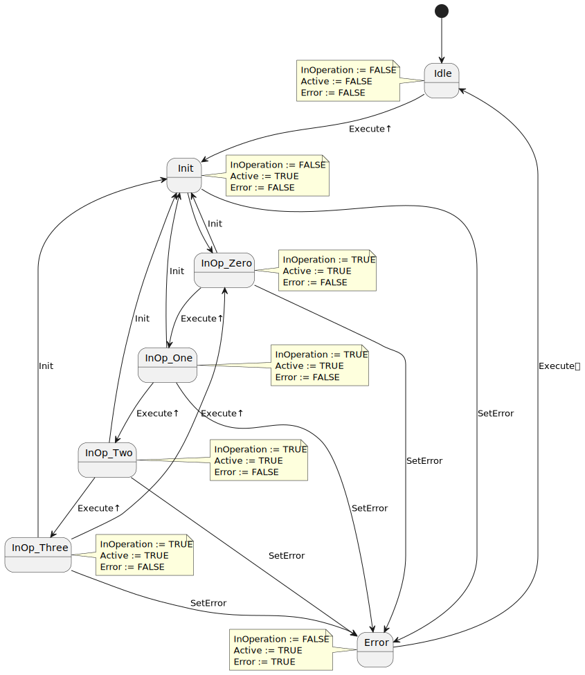

<h1 align="center">
  <br>
  
  <br>
  HEI-Vs Engineering School - Industrial Automation Base
  <br>
</h1>

Cours AutB

Author: [Cédric Lenoir](mailto:cedric.lenoir@hevs.ch)

# Modul 05 Robuste Programmierung *Übungen*

# Übungen

Resume ## Übung Arbeiten Sie an der Datenstruktur mit VAR_IN_OUT, aber mit kontinuierlicher Berechnung mit einem FB, der mit InOp ausgestattet ist.

## Übung 1, ``StateMachine_typ``.
*Kurze Übung.*
> Ich verwende oft das Präfix **_typ**, um ein **DUT** zu identifizieren.

Deklarieren Sie eine Struktur ``STRUCT``, die Folgendes enthält:
- eine ``Selektor``-Variable vom Typ ``E_Color`` für eine Zustandsmaschine. *Siehe im Skript*.
- die Variablen, die zur Bestimmung des vorherigen Zustands erforderlich sind.
- die Elemente, die zum Zählen der Anzahl der Übergänge vom orangefarbenen zum roten Licht erforderlich sind.
- Informationen im STRING-Format zum aktuellen Zustand.

[Übungslösung 1](#lösungsübung-1-statemachine_typ)

## Übung 2, 7-Segment-Anzeige, Aktivieren.
*Relativ lange Übung, ca. 1 Stunde.*

> Diese Übung scheint im Hinblick auf die Codierung ein wenig eintönig zu sein. Es ermöglicht uns jedoch, das Prinzip der robusten Codierung anschaulich zu veranschaulichen.

> Wenn die Bedingungen für den Übergang von einem Zustand in einen anderen komplexer werden, wird sich die Codierung letztendlich als viel schneller erweisen als ein bedingtes System vom Typ IF..ELSE..ELSIF.

> Im Falle einer Blockade in einem Zustand ist es sehr einfach abzulesen und zu analysieren.

Wir wollen eine 7-Segment-Anzeige über eine Zustandsmaschine steuern.
- Wir möchten einen Funktionsbaustein ``FB_SevenDigitDriverEnable`` verwenden
- Wir verwenden nur die ersten 4 Ziffern.
- Die Zustandsmaschine verwendet vollständig ``STATE_INOP_ZERO``, ``STATE_INOP_ONE``, ``STATE_INOP_TWO``, ``STATE_INOP_THREE``.
- Zwei Eingänge kodieren Zahlen binär mit A und B, A = ``Msb``, B = Lsb.
- Sieben Ausgänge werden verwendet, um die Ausgänge a bis g, ``Sa``, ``Sb``, ``...`` zu kodieren.
- Wir verwenden **einen Funktionsblock vom Typ ``Enable``**. Das sind insgesamt 7 Bundesstaaten.
- Ein Eingangsbit ``Vcc`` ist mit der Versorgungsspannung der 7-Segment-Anzeige verbunden. Ist dieser Wert FALSE, meldet der FB einen Fehler.
- Wir warten eine Sekunde, 1 [s] zwischen dem Init-Status und dem InOp**-Status, damit das Display in Betrieb genommen werden kann.

<figure>
    
    <figcaption>7 segment Displays Number, image from www.electronics-tutorials.ws</figcaption>
</figure>

[Übungslösung 2](#lösung-übung-2-7-segment-anzeige-aktivieren)

## Übung 3, 7-Segment-Anzeige, Ausführen.
*Relativ kurze Übung, wenn Übung 2 bereits geschrieben ist*

Ausgehend von Übung 2: [7 Segmente anzeigen, aktivieren](#exercise-2-7-segments-display-enable). Wir wollen nun einen Zähler erstellen, der nacheinander die Ziffern 0-1-2-3-0... anzeigt, basierend auf **einem Funktionsblock vom Typ Execute**, Variante ohne Done, **siehe FSM unten**.

Beachten Sie den Status der Ausgänge ``InOperation``, ``Active`` und ``Error`` im FSM.

<figure>
    
    <figcaption>State diagrame pour exercice 3</figcaption>
</figure>

> FSM kann sehr komplex erscheinen. In Wirklichkeit wurde es so durchgeführt, dass die gleichen Zustände wie in Übung 2 verwendet und die Codierung vereinfacht wurden. Aus diesem Grund wird der Status ``Fertig`` nicht wie im Modul 5-Skript angezeigt.

> Robustheit bedeutet auch die Fähigkeit, **alle Szenarien zu testen**. Hier sind alle Szenarien eindeutig gekennzeichnet. Dies mag für eine 7-Segment-Anzeige extrem übertrieben erscheinen, ist es aber vielleicht noch viel weniger, wenn es darum geht, die Öffnung des Ventils einer 423 [MW]$-Turbine zu steuern.

Auf die beiden Kodiereingänge MSB und LSB wird verzichtet, dafür aber ein ``Init``-Eingang hinzugefügt, der bei Aktivierung einen Übergang in den Init-Zustand erzwingt.

Bei jeder **steigenden Flanke** des Execute-Eingangs erhöht sich der Zähler um 1.
1. Welche Elemente des Codes müssen geändert werden?
2. Ändern Sie den Code aus Übung 2, um diesen Zähler zu erstellen.

[Lösungsübung 3](#lösung-übung-3-7-segment-anzeige-execute)

## Übung 4, Absolut bewegen (Not done, don't do / Noch nicht fertig, you are nicht)
Erstellen Sie einen Funktionsblock, mit dem Sie eine Achse einschalten und eine absolute Bewegung ausführen können.
Die folgenden Funktionsbausteine ​​sind gemäß der [PLCopen-Spezifikation](./documentation/plcopen_motion_control_part_1_version_2.0.pdf) verfügbar.

-   MC_Power
-   MC_Reset
-   MC_MoveAbsolute.

> In diesem Szenario sehen wir, dass sich die Verwaltung eines Systems, selbst wenn es relativ einfach aussieht, schnell als komplex erweisen kann, wenn wir wollen, dass das System robust ist. Die Daten werden in Form von Benutzeranforderungen, URS und Benutzeranforderungsspezifikationen dargestellt.

## Übung 5, Bewegungsgeschwindigkeit (Noch nicht fertig, du bist nicht)
Dies ist eine Variation von [Übung 4](#exercise-4-move-absolute). In diesem neuen Fall geht es nicht mehr darum, mit einer Achse im **Position**-Modus zu arbeiten, sondern im **Geschwindigkeitsmodus**. Ein typischer Fall könnte die Steuerung einer Pumpe sein, deren Durchfluss proportional zur Geschwindigkeit ist.

Setzen Sie die Daten des Vorjahres mit folgenden Änderungen fort:
- Ersetzen Sie ``MC_MoveAbsolute`` durch ``MC_MoveVelocity``.
- Ersetzen Sie den Positionssollwert durch einen Geschwindigkeitssollwert.

<figure>
    
    <figcaption>Grundfos: Mehrstufige vertikale Kreiselpumpe mit integriertem Frequenzumrichter.</figcaption>
</figure>

# Übungslösung

## Lösungsübung 1, ``StateMachine_typ``.
```iecst
(*
	www.hevs.ch
	Institut Systemes Industriels
	Project: 	Module Robust Programming
	Author:		Cedric Lenoir
	Date:		2024 January 10
	
	Summary:	Answer Exercice 1 with optional comments.
*)
TYPE StateMachine_typ :
STRUCT
    // Variable selector
    selector            : E_Color;
    // Auxiliary variable to determine state N-1
    selectorMem         : E_Color;
    // Selector at N-1
    selectorNm1         : E_Color;
    // Trigger for transition
    trigOrangeRed       : R_TRIG;
    // Transitions number
    diCountOrangeRed    : DINT;
    // State information
    strColorText        : STRING;
END_STRUCT
END_TYPE
```

## Lösung Übung 2, 7-Segment-Anzeige, Aktivieren.
``Enum`` für Zustandsmaschine.
```iecst
(*
	www.hevs.ch
	Institut Systemes Industriels
	Project: 	Module Robust Programming
	Author:		Cedric Lenoir
	Date:		2024 January 10
	
	Summary:	Enum for exercices 2 & 3.
*)
{attribute 'qualified_only'}
{attribute 'strict'}
TYPE E_SevenDigitDriver :
(
	STATE_IDLE  := 999,
    STATE_INIT := 1,
    STATE_INOP_ZERO := 2,
    STATE_INOP_ONE := 3,
    STATE_INOP_TWO := 4,
    STATE_INOP_THREE := 5,
    STATE_ERROR := 6    
) := STATE_IDLE;
END_TYPE
```
Header Function Block ``FB_SevenDigitDriverEnable``
```iecst
(*
	www.hevs.ch
	Institut Systemes Industriels
	Project: 	Module Robust Programming
	Author:		Cedric Lenoir
	Date:		2024 January 10
	
	Summary:	Function Block for exercice 2.
*)
FUNCTION_BLOCK FB_SevenDigitDriverEnable
VAR_INPUT
    Enable      : BOOL;
    Vcc         : BOOL;
    Msb         : BOOL;
    Lsb         : BOOL;
END_VAR
VAR_OUTPUT
    InOperation : BOOL;
    Error       : BOOL;
    Sa          : BOOL;
    Sb          : BOOL;
    Sc          : BOOL;
    Sd          : BOOL;
    Se          : BOOL;
    Sf          : BOOL;
    Sg          : BOOL;
END_VAR
VAR
    stateDigit  : E_SevenDigitDriver;
    tonToInOp   : TON;
END_VAR
```
Code Function Block ``FB_SevenDigitDriverEnable``
```iecst
CASE stateDigit OF
	E_SevenDigitDriver.STATE_IDLE:
        IF Enable THEN
            stateDigit := E_SevenDigitDriver.STATE_INIT;
        END_IF
    E_SevenDigitDriver.STATE_INIT:
        IF NOT Enable THEN
            stateDigit := E_SevenDigitDriver.STATE_IDLE;
        END_IF
        IF NOT Vcc THEN
            stateDigit := E_SevenDigitDriver.STATE_ERROR;
        END_IF
        IF NOT Msb AND
           NOT Lsb AND
           tonToInOp.Q THEN
            stateDigit := E_SevenDigitDriver.STATE_INOP_ZERO;
        END_IF
        IF NOT Msb AND
           Lsb     AND
           tonToInOp.Q THEN
            stateDigit := E_SevenDigitDriver.STATE_INOP_ONE;
        END_IF
        IF Msb     AND
           NOT Lsb AND
           tonToInOp.Q THEN
            stateDigit := E_SevenDigitDriver.STATE_INOP_TWO;
        END_IF
        IF Msb AND
           Lsb AND
           tonToInOp.Q THEN
            stateDigit := E_SevenDigitDriver.STATE_INOP_THREE;
        END_IF
    E_SevenDigitDriver.STATE_INOP_ZERO:
        IF NOT Enable THEN
            stateDigit := E_SevenDigitDriver.STATE_IDLE;
        END_IF
        IF NOT Vcc THEN
            stateDigit := E_SevenDigitDriver.STATE_ERROR;
        END_IF
        IF NOT Msb AND
           Lsb     THEN
            stateDigit := E_SevenDigitDriver.STATE_INOP_ONE;
        END_IF
        IF Msb     AND
           NOT Lsb THEN
            stateDigit := E_SevenDigitDriver.STATE_INOP_TWO;
        END_IF
        IF Msb AND
           Lsb THEN
            stateDigit := E_SevenDigitDriver.STATE_INOP_THREE;
        END_IF
    E_SevenDigitDriver.STATE_INOP_ONE:
        IF NOT Enable THEN
            stateDigit := E_SevenDigitDriver.STATE_IDLE;
        END_IF
        IF NOT Vcc THEN
            stateDigit := E_SevenDigitDriver.STATE_ERROR;
        END_IF
        IF NOT Msb AND
           NOT Lsb THEN
            stateDigit := E_SevenDigitDriver.STATE_INOP_ZERO;
        END_IF
        IF Msb     AND
           NOT Lsb THEN
            stateDigit := E_SevenDigitDriver.STATE_INOP_TWO;
        END_IF
        IF Msb AND
           Lsb THEN
            stateDigit := E_SevenDigitDriver.STATE_INOP_THREE;
        END_IF        
    E_SevenDigitDriver.STATE_INOP_TWO:
        IF NOT Enable THEN
            stateDigit := E_SevenDigitDriver.STATE_IDLE;
        END_IF
        IF NOT Vcc THEN
            stateDigit := E_SevenDigitDriver.STATE_ERROR;
        END_IF
        IF NOT Msb AND
           NOT Lsb THEN
            stateDigit := E_SevenDigitDriver.STATE_INOP_ZERO;
        END_IF
        IF NOT Msb AND
           Lsb     THEN
            stateDigit := E_SevenDigitDriver.STATE_INOP_ONE;
        END_IF
        IF Msb AND
           Lsb THEN
            stateDigit := E_SevenDigitDriver.STATE_INOP_THREE;
        END_IF
    E_SevenDigitDriver.STATE_INOP_THREE:
        IF NOT Enable THEN
            stateDigit := E_SevenDigitDriver.STATE_IDLE;
        END_IF
        IF NOT Vcc THEN
            stateDigit := E_SevenDigitDriver.STATE_ERROR;
        END_IF
        IF NOT Msb AND
           NOT Lsb THEN
            stateDigit := E_SevenDigitDriver.STATE_INOP_ZERO;
        END_IF
        IF NOT Msb AND
           Lsb     THEN
            stateDigit := E_SevenDigitDriver.STATE_INOP_ONE;
        END_IF
        IF Msb     AND
           NOT Lsb THEN
            stateDigit := E_SevenDigitDriver.STATE_INOP_TWO;
        END_IF
    E_SevenDigitDriver.STATE_ERROR:
        IF NOT Enable THEN
            stateDigit := E_SevenDigitDriver.STATE_IDLE;
        END_IF
END_CASE

// Timer Init to InOp
tonToInOp(IN := (stateDigit = E_SevenDigitDriver.STATE_INIT), PT := T#1S);

// Set outputs, there are many possibilities.
Sa := (stateDigit = E_SevenDigitDriver.STATE_INOP_ZERO) OR
      (stateDigit = E_SevenDigitDriver.STATE_INOP_TWO)  OR
      (stateDigit = E_SevenDigitDriver.STATE_INOP_THREE);
Sb := (stateDigit = E_SevenDigitDriver.STATE_INOP_ZERO) OR
      (stateDigit = E_SevenDigitDriver.STATE_INOP_ONE)  OR
      (stateDigit = E_SevenDigitDriver.STATE_INOP_TWO)  OR
      (stateDigit = E_SevenDigitDriver.STATE_INOP_THREE);
Sc := (stateDigit = E_SevenDigitDriver.STATE_INOP_ZERO) OR
      (stateDigit = E_SevenDigitDriver.STATE_INOP_ONE)  OR
      (stateDigit = E_SevenDigitDriver.STATE_INOP_THREE);
Sd := (stateDigit = E_SevenDigitDriver.STATE_INOP_ZERO) OR
      (stateDigit = E_SevenDigitDriver.STATE_INOP_TWO)  OR
      (stateDigit = E_SevenDigitDriver.STATE_INOP_THREE);
Se := (stateDigit = E_SevenDigitDriver.STATE_INOP_ZERO) OR
      (stateDigit = E_SevenDigitDriver.STATE_INOP_TWO);
Sf := (stateDigit = E_SevenDigitDriver.STATE_INOP_ZERO);
Sg := (stateDigit = E_SevenDigitDriver.STATE_INOP_TWO)  OR
      (stateDigit = E_SevenDigitDriver.STATE_INOP_THREE);

InOperation := (stateDigit = E_SevenDigitDriver.STATE_INOP_ZERO) OR
               (stateDigit = E_SevenDigitDriver.STATE_INOP_ONE)  OR
               (stateDigit = E_SevenDigitDriver.STATE_INOP_TWO)  OR
               (stateDigit = E_SevenDigitDriver.STATE_INOP_THREE);
               
Error := stateDigit = E_SevenDigitDriver.STATE_ERROR;              
```
Code has been tested in simulation with ctrlX Works
```
VAR
    fbSevenDigitDriverEnable : FB_SevenDigitDriverEnable;
END_VAR

// Call FB
fbSevenDigitDriverEnable();
```

## Lösung Übung 3, 7-Segment-Anzeige, ``Execute``.
Header
```iecst
(*
	www.hevs.ch
	Institut Systemes Industriels
	Project: 	Module Robust Programming
	Author:		Cedric Lenoir
	Date:		2024 January 10
	
	Summary:	Function Block for exercice 3.
*)
FUNCTION_BLOCK FB_SevenDigitDriverExecute
VAR_INPUT
    Execute     : BOOL;
    Vcc         : BOOL;
    Init        : BOOL;
END_VAR
VAR_OUTPUT
    InOperation : BOOL;
    Active      : BOOL;
    Error       : BOOL;
    Sa          : BOOL;
    Sb          : BOOL;
    Sc          : BOOL;
    Sd          : BOOL;
    Se          : BOOL;
    Sf          : BOOL;
    Sg          : BOOL;
END_VAR
VAR
    stateDigit  : E_SevenDigitDriver;
    trigEx      : R_TRIG;
    tonToInOp   : TON;
    diDigitcnt  : DINT;
END_VAR
```
Code of Function Block
```iecst
//
// Used to get rising edge of Execute for counter
// Note that as an exception, FB Trigger called before FSM
//
trigEx(CLK := Execute); 

CASE stateDigit OF
	E_SevenDigitDriver.STATE_IDLE:
        IF Execute THEN
            stateDigit := E_SevenDigitDriver.STATE_INIT;
        END_IF
    E_SevenDigitDriver.STATE_INIT:
        IF NOT Vcc THEN
            stateDigit := E_SevenDigitDriver.STATE_ERROR;
        END_IF
        IF Execute     AND
           tonToInOp.Q THEN
            stateDigit := E_SevenDigitDriver.STATE_INOP_ZERO;
        END_IF
    E_SevenDigitDriver.STATE_INOP_ZERO:
        IF NOT Vcc THEN
            stateDigit := E_SevenDigitDriver.STATE_ERROR;
        END_IF
        IF Init THEN
            stateDigit := E_SevenDigitDriver.STATE_INIT;
        END_IF
        IF trigEx.Q THEN
            stateDigit := E_SevenDigitDriver.STATE_INOP_ONE;
        END_IF
    E_SevenDigitDriver.STATE_INOP_ONE:
        IF NOT Vcc THEN
            stateDigit := E_SevenDigitDriver.STATE_ERROR;
        END_IF
        IF Init THEN
            stateDigit := E_SevenDigitDriver.STATE_INIT;
        END_IF
        IF trigEx.Q THEN
            stateDigit := E_SevenDigitDriver.STATE_INOP_TWO;
        END_IF
    E_SevenDigitDriver.STATE_INOP_TWO:
        IF NOT Vcc THEN
            stateDigit := E_SevenDigitDriver.STATE_ERROR;
        END_IF
        IF Init THEN
            stateDigit := E_SevenDigitDriver.STATE_INIT;
        END_IF
        IF trigEx.Q THEN
            stateDigit := E_SevenDigitDriver.STATE_INOP_THREE;
        END_IF       
    E_SevenDigitDriver.STATE_INOP_THREE:
        IF NOT Vcc THEN
            stateDigit := E_SevenDigitDriver.STATE_ERROR;
        END_IF
        IF Init THEN
            stateDigit := E_SevenDigitDriver.STATE_INIT;
        END_IF
        IF trigEx.Q THEN
            stateDigit := E_SevenDigitDriver.STATE_INOP_ZERO;
        END_IF       
    E_SevenDigitDriver.STATE_ERROR:
        IF NOT Execute THEN
            stateDigit := E_SevenDigitDriver.STATE_IDLE;
        END_IF
END_CASE

// Timer Init to InOp
tonToInOp(IN := (stateDigit = E_SevenDigitDriver.STATE_INIT), PT := T#1S);

// Set outputs, there are many possibilities.
Sa := (stateDigit = E_SevenDigitDriver.STATE_INOP_ZERO) OR
      (stateDigit = E_SevenDigitDriver.STATE_INOP_TWO)  OR
      (stateDigit = E_SevenDigitDriver.STATE_INOP_THREE);
Sb := (stateDigit = E_SevenDigitDriver.STATE_INOP_ZERO) OR
      (stateDigit = E_SevenDigitDriver.STATE_INOP_ONE)  OR
      (stateDigit = E_SevenDigitDriver.STATE_INOP_TWO)  OR
      (stateDigit = E_SevenDigitDriver.STATE_INOP_THREE);
Sc := (stateDigit = E_SevenDigitDriver.STATE_INOP_ZERO) OR
      (stateDigit = E_SevenDigitDriver.STATE_INOP_ONE)  OR
      (stateDigit = E_SevenDigitDriver.STATE_INOP_THREE);
Sd := (stateDigit = E_SevenDigitDriver.STATE_INOP_ZERO) OR
      (stateDigit = E_SevenDigitDriver.STATE_INOP_TWO)  OR
      (stateDigit = E_SevenDigitDriver.STATE_INOP_THREE);
Se := (stateDigit = E_SevenDigitDriver.STATE_INOP_ZERO) OR
      (stateDigit = E_SevenDigitDriver.STATE_INOP_TWO);
Sf := (stateDigit = E_SevenDigitDriver.STATE_INOP_ZERO);
Sg := (stateDigit = E_SevenDigitDriver.STATE_INOP_TWO)  OR
      (stateDigit = E_SevenDigitDriver.STATE_INOP_THREE);

InOperation := (stateDigit = E_SevenDigitDriver.STATE_INOP_ZERO) OR
               (stateDigit = E_SevenDigitDriver.STATE_INOP_ONE)  OR
               (stateDigit = E_SevenDigitDriver.STATE_INOP_TWO)  OR
               (stateDigit = E_SevenDigitDriver.STATE_INOP_THREE);
          
Active := (stateDigit = E_SevenDigitDriver.STATE_INIT)      OR
          (stateDigit = E_SevenDigitDriver.STATE_INOP_ZERO) OR
          (stateDigit = E_SevenDigitDriver.STATE_INOP_ONE)  OR
          (stateDigit = E_SevenDigitDriver.STATE_INOP_TWO)  OR
          (stateDigit = E_SevenDigitDriver.STATE_INOP_THREE);
               
Error := stateDigit = E_SevenDigitDriver.STATE_ERROR;              
```

## Lösungsübung 4, Move Absolute

## Lösungsübung 5, Move Velocity