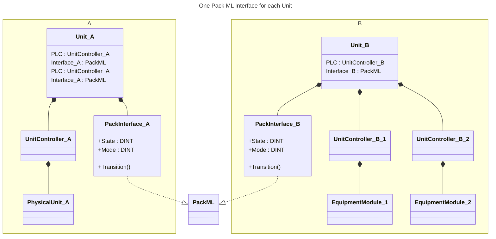
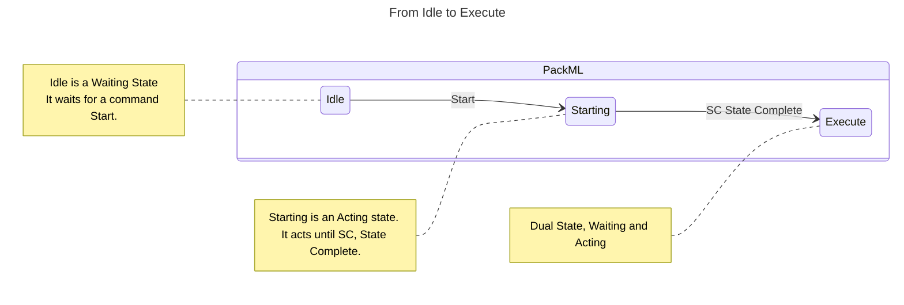
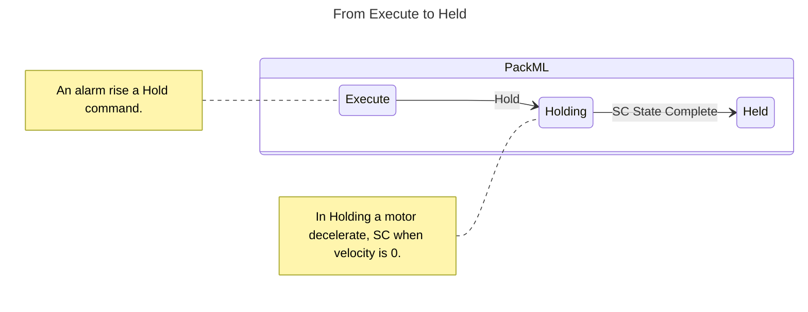
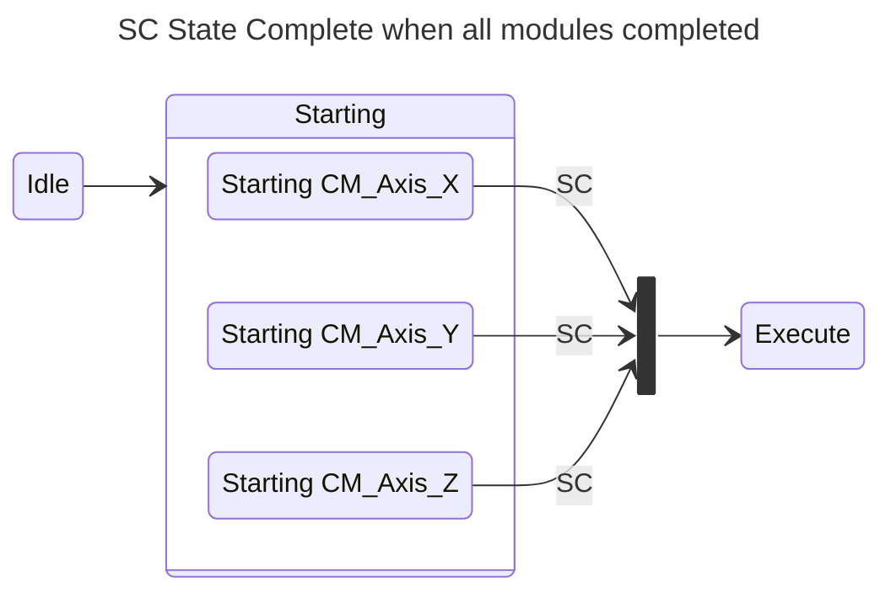
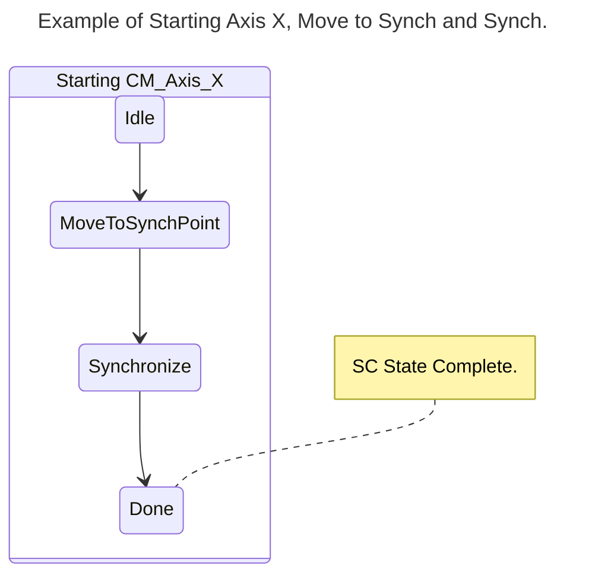

<h1 align="left">
  <br>
  
  <br>
  Industrial Automation Base
  <br>
</h1>

Cours AutB

Author: [Cédric Lenoir](mailto:cedric.lenoir@hevs.ch)

# Module 08 Introduction to PackML

*Keywords:* **PackML**

# Präambel
In den folgenden Modulen behandeln wir die praktischen und theoretischen Aspekte der Steuerung elektrischer Achsen.

Eine der Besonderheiten der Achsensteuerung besteht darin, dass der Komplexitätsgrad leicht zunimmt und schnell eine rigorose Methodik erfordert, um die Robustheit des gesteuerten Systems zu gewährleisten, aber auch um bei der Codierung an Effizienz zu gewinnen. Aus diesem Grund stellen wir in diesem Kurs **PackML** vor. Wir werden nur einen Teil von PackML abdecken, der der Verwaltung von Maschinenzuständen gewidmet ist.

## Schon gesehen
PackML wird bereits in den Laboren Nr. 3 und Nr. 4 verwendet. Diese Umgebung verwaltet die Betriebszustände der Achsen im manuellen oder automatischen Modus. In Labor 4 werden wir Alarme verwenden. Diese Alarme werden verwendet, um im Falle eines Problems Befehle vom Typ PackML zu generieren, beispielsweise um einen **Stop**-Befehl zu generieren und gleichzeitig den Benutzer zu informieren.

## Vorschau
Der Entwurf einer Einheit im Sinne von ISA-88 oder einer Maschine aus Softwaresicht ist ein komplexer Prozess. Selbst für einen erfahrenen Ingenieur ist es ein riskantes Unterfangen, bei Null anzufangen. Die Idee besteht daher darin, von einem Modell auszugehen.

- Es ist natürlich möglich, sich von einer vorhandenen Maschine inspirieren zu lassen oder die Frage an eine künstliche Intelligenz zu stellen. Im besten Fall pickt sich eine künstliche Intelligenz Informationen heraus, die mit ihr in Zusammenhang zu stehen scheinen.
– Es besteht eine gute Chance, dass einige dieser Informationen teilweise mit dem PackML-Standard zusammenhängen. Dies ist der Standard, den wir vorstellen werden.

## Was Sie sich merken sollten
- Es ist sehr unwahrscheinlich, dass wir in der Lage sein werden, innerhalb eines angemessenen Zeitraums eine komplette Maschine zu entwerfen, die in der Industrie eingesetzt werden kann, ohne von einem Modell auszugehen.
- Das im Folgenden entwickelte PackML-Konzept ist, auch wenn es zunächst für Maschinen des Typs **Discrete parts manufacturing processes** entwickelt wurde, durchaus als Grundlage für Prozesse des Typs **Batch** oder **Continuous Manufacturing** verwendbar.

## Was Sie wissen müssen
- In der Lage sein, mit PackML Modelle der Architektur einer Maschine zu erstellen.
- Die verschiedenen Zustände und Betriebsarten einer Maschine gemäß dem PackML-Standard bestimmen können.
- Einige einfache Elemente basierend auf dem PackML-Standard in einer SPS-Entwicklungsumgebung verstehen und implementieren.

## Schlüsselwörter
- **PackML**: PackML ist ein von OMAC entwickelter und von [ISA als TR88.00.02](https://www.isa.org/products/isa-tr88-00-02-2022-machine-and-unit-states-an-imp) übernommener Automatisierungsstandard, der die Übertragung und den Abruf konsistenter Maschinendaten erleichtert. Die Hauptziele von PackML bestehen darin, ein einheitliches Erscheinungsbild in der gesamten Fabrikhalle zu fördern und Innovationen in der Branche zu ermöglichen und zu unterstützen. / *PackML ist ein von OMAC entwickelter und von der ISA unter der Referenz TR88.00.02 übernommener Automatisierungsstandard. Es erleichtert die Übertragung und den Abruf konsistenter Maschinendaten. Die Hauptziele von PackML bestehen darin, ein einheitliches „Look and Feel“ in der gesamten Fabrik zu fördern und industrielle Innovationen zu ermöglichen und zu unterstützen.*

- **OMAC**, die PackML-Gruppe der Organization for Machine Automation and Control, ist weltweit anerkannt und besteht aus Steuerungsanbietern, OEMs, Systemintegratoren, Universitäten und Endbenutzern, die gemeinsam an Definitionen arbeiten, um mit den ISA88-Standards und der Technologie und den sich ändernden Anforderungen der meisten automatisierten Maschinen im Einklang zu stehen. / *Die PackML-Gruppe der Organization for Automation and Control of Machinery ist eine weltweit anerkannte Gruppe von Steuerungslieferanten, OEMs, Systemintegratoren, Universitäten und Endbenutzern, die gemeinsam an Definitionen arbeiten, die mit den ISA88-Standards und der sich ändernden Technologie und den Anforderungen der meisten automatisierten Maschinen übereinstimmen.*

- **OEM**, ein Original Equipment Manufacturer oder OEM ist ein Unternehmen, das Produkte oder Teile eines Produkts herstellt und verkauft, die sein Käufer, ein anderes Unternehmen, an seine eigenen Kunden verkauft und dabei die Produkte unter seinem eigenen Markennamen vertreibt. / Ein Originalgerätehersteller oder OEM ist ein Unternehmen, das Produkte oder Teile eines Produkts herstellt und verkauft, die sein Käufer, ein anderes Unternehmen, an seine eigenen Kunden verkauft und dabei die Produkte unter seinem eigenen Markennamen vertreibt.

# Einführung
> Der PackML-Standard ist unter dem Namen [ISA-TR88.00.02-2022, Machine and Unit States: An implementation example of ISA-88.00.01](https://www.isa.org/products/isa-tr88-00-02-2022-machine-and-unit-states-an-imp) standardisiert. Wie die meisten Standarddokumente sind diese Dokumente nicht lizenzfrei. 180 USD ab 28. Januar 2025. Es ist daher nicht möglich, dieses Dokument im Rahmen dieses Kurses kostenlos zur Verfügung zu stellen. **In diesem Dokument verwenden wir hauptsächlich den Begriff Maschine, aber die Begriffe Maschine und Einheit sind innerhalb von PackML austauschbar**.

Es gibt jedoch viele Implementierungen, die auf diesem Standard basieren.

> In der Siemens-Welt: [SIMATIC OMAC PackML V2022 Mode&State Management und Machine Data Interface](https://support.industry.siemens.com/cs/document/109821198/simatic-omac-packml-v2022-mode-state-management-and-machine-data-interface?dti=0&lc=en-CH).

> In der Welt von Schneider Electric, wo derselbe Codesys-Compilertyp verwendet wird wie in den HEVS-Automatisierungskursen. [EcoStruxure Machine Expert – PackML, Bibliothekshandbuch](https://www.se.com/sg/en/download/document/EIO0000002809/)

> Es gibt eine Basis [bei Codesys, aber etwas rudimentär](https://store.codesys.com/de/omac-packml-state-machine.html).

> Oder endlich noch bei Beckhoff. [TwinCAT 3 | SPS-Bibliothek: Tc3_PackML_V2](https://infosys.beckhoff.com/english.php?content=../content/1033/tcplclib_tc3_packml_v2/index.html&id=)

# PackML
Im Automatisierungslabor verwenden wir eine von HEVS entwickelte PackML-Datenbank, die vollständig offen und lizenzfrei ist.

## Und abschließend: Was ist PackML?
Im Grunde ist PackML, für Packaging Machine Language, keine Sprache, sondern ein Ansatz, der den Entwurf des Automatisierungssystems einer Maschine vereinfachen und beschleunigen soll.

> Diese Vereinfachung erfolgt in zwei Richtungen:

### Auf Maschinenebene

Dadurch kann sich der Ingenieur auf den Prozess im Herzen der Maschine konzentrieren und nicht auf ihre Umgebung. Im folgenden Beispiel ist der Kern des Prozesses der Zustand **Execute**.

<div style="text-align: center;">
  <figure>
    
    <figcaption>PackML production Line, <a href="https://opcconnect.opcfoundation.org/2018/06/companion-specs-drive-iiot-adoption-from-beeond-sponsored/" target="_blank">Source OPC UA</a></figcaption>
  </figure>
</div>


#### So identifizieren Sie eine Maschine
Eine Maschine ist eine Einheit. Pro Maschine wird nur ein PackML-Managementsystem verwendet

<div style="text-align: center;">




</div>


### Zwischen den Maschinen
Es erleichtert die Kommunikation zwischen Maschinen und vereinfacht so deren Integration. 

<div style="text-align: center;">
  <figure>
    
    <figcaption>PackML production Line, source OPC-UA</figcaption>
  </figure>
</div>

<br>

##    PackML State Machine

### Identifizieren einer Einheit/Maschine
- Eine **Unit** /Maschine wird als eine Reihe physischer Geräte und Steuerfunktionen definiert, die eine oder mehrere wichtige Verarbeitungsfunktionen ausführen.
  

- Eine **Unit** /Maschine kann eine einzelne Maschine oder eine Teilmenge einer ganzen Verpackungslinie sein.

- Eine **Unit** /Maschine wird funktional oder physikalisch über eine gemeinsame Unit/Maschinen-Schnittstelle definiert. Der PackML Interface Status Manager bietet eine einzelne Kommunikationsschnittstelle zwischen HMI, Human Machine Interface oder anderen externen Steuerungssystemen und der Einheit/Maschine, wie in Abbildung *Bumotec S1000C* dargestellt.

<div style="text-align: center;">
  <figure>
    
    <figcaption>Bumotec S1000C, eine Maschine/Einheit wird oft durch ihr HMI identifiziert, Quelle Bumotec</figcaption>
  </figure>
</div>
<br>

Am einfachsten ist es wahrscheinlich, wenn man versucht, die verschiedenen Ausstattungen einer Maschine anhand einiger Beispiele aus der Industrie zu verstehen.

Bei der Maschine [Mikron G05](https://www.mikron.com/en/automation/systems/platforms-technologies/high-volume/g05) handelt es sich um eine Montagemaschine. Folgende Ausrüstung ist im Lieferumfang enthalten:
- Ein Einlassförderer.
- Ein Ausgangsförderband.
- Eine Reihe von Arbeitsstationen, die genau eine Arbeitsphase ausführen, die als Ausrüstung gilt.
- Ein Transfersystem, das Arbeitspaletten von einer Einheit zur anderen bewegt.

> Das Gerät kann mehrere Phasentypen ausführen, wie z. B. **Schrauben**, **Schweißen**, **Crimpen**, **Steuern**.

> Die Ausrüstung kann aus mehreren **Control Module**, einem [Pick and Place](#pick-and-place)-Modul, einem Greifer, einem Schraubendreher, einem Schweißgerät, einem Messmodul usw. bestehen....

<div style="text-align: center;">
  <figure>
    
    <figcaption>Machine Mikron G05, Source: Mikron</figcaption>
  </figure>
</div>

### Pick and Place

Ein **Pick and Place** ist eine Art Steuermodul, das in automatisierten Montagemaschinen verwendet wird. Es ist dafür ausgelegt, ein Objekt an einer bestimmten Stelle zu greifen und es an eine andere Stelle zu bewegen. Dieses Modul wird häufig für sich wiederholende und präzise Aufgaben verwendet, beispielsweise das Platzieren von Komponenten auf einer Leiterplatte oder das Übertragen von Teilen von einer Arbeitsstation zu einer anderen.

Pick-and-Place-Module sind mit Roboterarmen oder ähnlichen Mechanismen ausgestattet, die für die Ausführung bestimmter Bewegungen programmiert werden können. Sie sind für die Verbesserung der Effizienz und Genauigkeit automatisierter Fertigungsprozesse von entscheidender Bedeutung.

<div style="text-align: center;">
  <figure>
      
      <figcaption>Beispiel eines Pick-and-Place-Roboters, Quelle: Linmot</figcaption>
  </figure>
</div>

<br>

Ein weiteres Beispiel für eine Maschine, hier ein Palettierer/Depalettierer. Mit dieser Maschine werden Komponenten von der rechten Seite an ein Fließband gesendet. Wenn diese Komponenten dann zusammengebaut sind, werden sie aus der linken Maschine entnommen. Ein Roboter in der Mitte ermöglicht das Be- und Entladen der Bauteile, die über ein Förderband an die Maschine weitergeleitet werden.

Wir weisen hier auf die Vorteile einer modularen Bauweise hin. Das Zentralmodul kann autark als einfaches Pick and Place eingesetzt werden. Es kann entweder vom rechten Modul, vom linken Modul oder von beiden begleitet werden.

<div style="text-align: center;">
  <figure>
      
      <figcaption>Palettierer / Depalettierer, Quelle Mikron</figcaption>
  </figure>
</div>
<br>

##	The PackML interface State Model
Die PackML-State-Model-Syntax
Das Zustandsmodell der PackML-Schnittstelle basiert auf zwei Hauptelementen, Befehlen, [Commands](#befehle--commands) und Zuständen, [States](#States).

###	States
- **Action State**, unten in **weiß** ein Zustand, in dem die Maschine eine Aktion ausführt)
- **Wait State**, unten in **Blau** stabiler Zustand für die Maschine. Ein Wartezustand erfordert einen **Command**, um in den nächsten Zustand zu wechseln.
- **Execute** ist ein Sonderzustand, denn auch wenn er als **Action State** betrachtet wird, hat er nicht das Konzept von **SC**, **State Complete**. Es läuft weiter, bis es einen Befehl empfängt,

> Bitte beachten Sie, dass sich der Standard im **2022** geändert hat. Ein Großteil der PackML-Zustandsmaschinenbeispiele, die Sie im Internet finden, stammen aus einer älteren Version, 2008 oder 2015.
 
<div style="text-align: center;"> 
  <figure>
      
      <figcaption>PackML Full State Machine 2022, Source: Beckhoff USA.</figcaption>
  </figure>
</div>

### Befehle / Commands
• Ein Auslöser, der den Übergang der Maschine von einem Zustand in einen anderen bewirkt, beispielsweise ein **Start**-Druckknopf an der Maschine oder ein interner Befehl oder Alarm.





### State Complete

Ein **SC State Complete**-Befehl wird ausgegeben, wenn alle definierten Module der Maschine ihre eigene Phase des aktiven Zustands, in dem sich die Maschine befindet, abgeschlossen haben.

Im folgenden Beispiel müssen drei Achsen, X, Y und Z, synchronisiert werden, bevor der Befehl „Ausführen“ ausgeführt wird.

> Dabei stellen wir uns die Synchronisierung von 3 unabhängigen elektromechanischen Achsen vor, die dann gemeinsam im dreidimensionalen Raum bewegt werden können müssen.



Im folgenden Sonderfall bewegen wir die X-Achse zum Startpunkt einer Trajektorie und synchronisieren sie dann mit der Trajektorie.



### Minimum state machine
Der ISA-88-Standard beschreibt auch eine Zustandsmaschine. Die Zustände sind ungefähr gleich und wenn Sie das Prinzip der PackML-Zustandsmaschine verstanden haben, haben Sie auch die ISA 88-Zustandsmaschine verstanden.

In diesem Sinne ist es sehr wahrscheinlich, dass Ihre Maschine nicht die Verwendung so vieler Zustände erfordert. Dies ist kein Problem, der Standard erlaubt das Entfernen einer bestimmten Anzahl von Zuständen, **aber nicht das Hinzufügen**.

Nachfolgend sind die Mindestzustände gemäß PackML aufgeführt:

<div style="text-align: center;">
  <figure>
      
      <figcaption>PackML Minimum State Machine, source: Beckhoff USA.</figcaption>
  </figure>
</div>
<br>

Im Allgemeinen passiert während eines **Wartezustands** nichts, oder zumindest gibt es keine Maschinenaktion auf der **prozeduralen** Ebene. Es gibt jedoch nichts, was ein Zufuhrband daran hindern würde, weiterzulaufen oder sogar anzuhalten, wenn der Stoppbefehl intern im Modul erfolgt, das es steuert.

- Es reicht aus, wenn ein einzelnes Modul einen Befehl startet, zum Beispiel **Start**, damit alle Module gleichzeitig in den nächsten Zustand wechseln.
- Wenn sich die Module im **Aktionszustand** befinden, haben wir eine konkrete Aktion der Module, sie führen die für diesen Zustand programmierte Sequenz aus. Beispielsweise positionieren sich die verschiedenen Aktuatoren während des **Startens** aus dem **Leerlauf** heraus, um für die **Ausführung** bereit zu sein.
- Wenn alle Module ihre Sequenz abgeschlossen und ihren **SC**-Status, **Status abgeschlossen**, aktiviert haben, und nur in diesem Moment, wechseln alle Module in den nächsten Status.

## Das PackML-Schnittstellenzustandsmodell
Es wird empfohlen, alle **17 Zustände des Zustandsmodells** zu implementieren. Im OMAC-Leitfaden heißt es, dass der Endbenutzer eine Abweichung von den 17 Zuständen akzeptieren kann. In den meisten Implementierungen, und dies ist auch bei der **HEVS**-Version der Fall, ist die Zustandsmaschine konfigurierbar. Das heißt, dass **es möglich ist, bestimmte Zustände zu deaktivieren**.

### Zustände löschen
- Alle 17 Staaten sind umgesetzt.
- Je nach Implementierung ist es möglich, bestimmte Zustände zu deaktivieren, darunter Complete, Completing, Suspending, Suspended, Unsupending, Holding, Held et Unholding, insbesondere im manuellen Modus.

Einige Implementierungen, wie beispielsweise Siemens, ermöglichen die Konfiguration aktiver Zustände.
Im einfachsten Fall werden nur die Zustände „Stopped“ und „Execute“ implementiert.
Grundsätzlich können alle aktiven Zustände außer **Execute** gelöscht werden. Unter folgenden Voraussetzungen:

### PackML states Precondition & Requierment

|Precondition	|Requierment|
|---------------|-----------|
|If **Completing** state available...	|**Complete** state mandatory.|
|If **Suspending** state available...	|**Suspended** state mandatory.|
|If **Unsuspending** state available...	|**Suspended** state mandatory.|
|If **Aborting** state available...	|**Aborted** state mandatory.|
|If **Clearing** state available...	|**Aborted** state mandatory.|
|If **Resetting** state available...	|**Idle** state mandatory.|
|If **Idle** state available...	|**Resetting** state mandatory.|

### Zusätzliche Staaten
Ich empfehle, sie in Zwischenzuständen zu kapseln. Aber **auf keinen Fall** die allgemeine Konfiguration zu ändern.

### Benutzerdefinierte Implementierung
Es ist natürlich möglich, bei Null anzufangen und eine spezifische Implementierung zu schreiben.
Das Ziel von PackML ist die Steigerung der Effizienz. Ich empfehle daher, mit einer vorhandenen Implementierung einschließlich der zugehörigen Dokumentation zu beginnen.


##	Résumé

##	Zusammenfassung

|Bundesland |Beschreibung|
|-------|--------------|
|EXECUTE |**Acting State** - Die Maschine befindet sich in einem stabilen Betriebszustand - die Maschine produziert.|
|GESTOPPT, LEERLAUF ABGESCHLOSSEN |**Wait State** – Ein stabiler Zustand, der anzeigt, dass eine Einheit/Maschine einen definierten Satz von Bedingungen erreicht hat. In einem solchen Zustand behält die Maschine einen Zustand bei, bis ein Befehl einen Übergang in einen **Aktionszustand** bewirkt. Die Maschine ist angetrieben und stationär.|
|ZURÜCKSETZEN, STARTEN, UNTERBRECHEN, UNTERBRECHEN ENTFERNEN, ABSCHLIESSEN, ANHALTEN, UNTERBRECHEN ENTFERNEN, ABBRECHEN, LÖSCHEN, STOPPEN |**Acting State** – Ein Zustand, der eine Verarbeitungsaktivität darstellt, z. B. eine Beschleunigung. Dabei handelt es sich um die einmalige oder wiederholte Ausführung von Verarbeitungsschritten in einer logischen Reihenfolge, für eine begrenzte Zeit oder bis zum Erreichen einer bestimmten Bedingung, z. B. Im Startzustand werden die Qualität und Gültigkeit der empfangenen Daten geprüft, bevor die Ausführung hochgefahren wird.
|GEHALTEN ABGEBROCHEN |**Wait State** – Ein Zustand, der einen Fehler an der Einheit darstellt, der einen Alarm oder eine Warnung generiert. In diesem Zustand produziert die Einheit/Maschine nicht, bis der Bediener in den Zustand **EXECUTE** wechselt. Der Zustand gewährleistet den Betrieb der Einheit/Maschine, während die Materialblockade beseitigt wird, oder eine sichere Korrektur eines Gerätefehlers, bevor die Produktion wieder aufgenommen wird.
|AUSGESETZT |**Wait State** – In diesem Zustand produziert die Einheit/Maschine nichts. Der Betrieb wird angehalten oder ohne Produktion weitergeführt, bis sich die externen Prozessbedingungen wieder normalisiert haben. An diesem Punkt wechselt der Zustand **SUSPENDED** in den Zustand **UNSUSPENDING**, normalerweise ohne Eingriff eines Bedieners.


Der Unterschied zwischen **Held** und **Suspended** ist hauptsächlich aus der Sicht der Analyse der Leistung der Maschine zu verstehen.

<div style="text-align: center;">
  <figure>
      
      <figcaption>Held vs Suspended</figcaption>
  </figure>
</div>
<br>

Im Fall von **Suspended** wartet die Maschine auf externe Bedingungen. Beispielsweise Produktversorgung, vor- oder nachgelagerte Maschine nicht bereit. Dies bedeutet, dass bei der Analyse der Leistung der Maschine, selbst wenn die Maschine 50 % ihrer Zeit im Schwebezustand verbringt, nicht die Maschine, sondern die Einheit selbst schuld ist.

Im Fall von **Held** bedeutet dies im Allgemeinen, dass eines der Elemente der Maschine ein Ereignis erzeugt hat, das die Maschine in diesen Zustand versetzt hat. Wenn die Maschine 50 % ihrer Zeit im **Held**-Zustand verbringt, ist es wahrscheinlich notwendig, die Ursache für diesen Zustand zu analysieren.


## Im Detail
Der Leitfaden [PackML_Unit_Machine_Implementation_Guide](./documentation/PackML_Unit_Machine_Implementation_Guide%20V2-03.pdf) befindet sich im Anhang. Es steht nach Identifizierung auf der [OMAC](https://www.omac.org/packml)-Website zum kostenlosen Download zur Verfügung. Ein Großteil des restlichen Dokuments ist davon inspiriert.

###	Aborted
State Type: <span style="color:red; font-weight:bold">Wait</span>

<div style="text-align: center;"> 
  <figure>
      
      <figcaption>PackML State Aborted, Source of base image: Beckhoff USA.</figcaption>
  </figure>
</div>
<br>

In diesem Status werden Informationen zum Maschinenstatus gespeichert, die sich auf die Abbruchbedingung beziehen. Die Maschine kann den Zustand **Aborted** nur nach einem expliziten **Clear**-Befehl verlassen, gefolgt von einem manuellen Eingriff zum Korrigieren und Zurücksetzen erkannter Maschinenfehler.

### Clearing
Statustyp: <span style="color:green; font-weight:bold">Acting</span>
Wird durch einen Statusbefehl initiiert, um Fehler zu beheben, die möglicherweise während des **Aborting** aufgetreten sind und die im Status **Aborted** vorhanden sind, bevor in den Status **Stopped** gewechselt wird.

<div style="text-align: center;"> 
  <figure>
      
      <figcaption>PackML State Clearing, Source of base image: Beckhoff USA.</figcaption>
  </figure>
</div>
<br>

> Hinweis: Bei elektrischen Antriebssteuerungen bedeutet der Zustand **Abgebrochen** häufig, dass die Motoren kein Drehmoment haben, **STO**, **Sicheres Drehmoment abgeschaltet**, was bedeutet, dass die Sicherheitsschaltung kein Drehmoment und somit keinen Strom liefert. Eine der Aktivitäten des Befehls **Clearing** kann darin bestehen, die Motoren wieder mit Strom zu versorgen.


### Stopped
> Statustyp: <span style="color:red; font-weight:bold">Wait</span>
> > Die Maschine befindet sich in einem kontrollierten, sicheren Zustand. Die Energien sind vorhanden, es kann jedoch garantiert keine Bewegung ausgeführt werden.

<div style="text-align: center;"> 
  <figure>
      
      <figcaption>PackML State Stopped, Source of base image: Beckhoff USA.</figcaption>
  </figure>
</div>
<br>

Die Maschine ist eingeschaltet und steht still, nachdem der Zustand **STOPPING** abgeschlossen ist. Die gesamte Kommunikation mit anderen Systemen funktioniert, sofern zutreffend. Ein **RESET**-Befehl bewirkt einen Wechsel vom Zustand **STOPPED** in den Zustand **RESETTING**.

###	Resetting
State Type: <span style="color:green; font-weight:bold">Acting</span>

<div style="text-align: center;"> 
  <figure>
      
      <figcaption>PackML State Resetting, Source of base image: Beckhoff USA.</figcaption>
  </figure>
</div>
<br>

Dieser Zustand ist das Ergebnis eines **Reset**-Befehls aus dem Zustand **Stopped** oder **Complete**. Beim **Resetting** erzeugt eine Maschine normalerweise ein visuelles oder akustisches Signal und versetzt die Maschine in einen Zustand, in dem die Komponenten eingeschaltet sind, während auf einen **Start**-Befehl gewartet wird.

> Beispiel: Im Zustand **Stopped** oder **Complete** kann die Maschine in einen Zustand mit geringem Verbrauch *und geringer Lautstärke* versetzt werden.
> Am Beispiel eines Rotations- und/oder Linearvibrators können die verschiedenen Elemente durch **Resetting** aktiviert werden.
> **Starting** wird verwendet, um die Teile zum Ausgang des Linearvibrators zu bringen, um die Produktion in **Execute** zu starten.
 
 <div style="text-align: center;"> 
  <figure>
      
      <figcaption>PackML Resetting, source www.icm-automation.com</figcaption>
  </figure>
</div>
<br>

###	Idle
State Type: <span style="color:red; font-weight:bold">Wait</span>

<div style="text-align: center;"> 
  <figure>
      
      <figcaption>PackML State Idle, Source of base image: Beckhoff USA.</figcaption>
  </figure>
</div>
<br>

Dies ist ein Status, der anzeigt, dass das **Resetting** abgeschlossen ist. Dieser Zustand behält die Maschinenbedingungen bei, die während des Zustands **Resetting** erreicht wurden, und führt die erforderlichen Vorgänge aus, wenn die Maschine im Leerlauf ist.

###	Starting
> State Type: <span style="color:green; font-weight:bold">Acting</span>

<div style="text-align: center;"> 
  <figure>
      
      <figcaption>PackML State Starting, Source of base image: Beckhoff USA.</figcaption>
  </figure>
</div>
<br>

Dieser Zustand stellt die notwendigen Schritte bereit, um in den endgültigen Zustand **EXECUTE** zu gelangen und ist das Ergebnis eines Befehls vom Typ **STARTING**, lokal oder remote. Nach diesem Befehl wird die Maschine gestartet.

###	Execute
State Type: <span style="color:green; font-weight:bold">Acting</span>

<div style="text-align: center;"> 
  <figure>
      
      <figcaption>PackML State Execute, Source of base image: Beckhoff USA.</figcaption>
  </figure>
</div>
<br>

Sobald die Maschine Komponenten verarbeitet, wird davon ausgegangen, dass sie ausgeführt wird oder sich im Status **EXECUTE** befindet. Verschiedene Maschinenmodi führen dazu, dass bestimmte Arten von **EXECUTE**-Aktivitäten auftreten. Befindet sich die Maschine beispielsweise im Produktionsmodus, führt **EXECUTE** dazu, dass Produkte hergestellt werden, während sich im Reinigungsmodus der Zustand **EXECUTE** auf die Reinigungsaktion der Maschine bezieht.

###	Holding
State Type: <span style="color:green; font-weight:bold">Acting</span>

<div style="text-align: center;"> 
  <figure>
      
      <figcaption>PackML State Holding, Source of base image: Beckhoff USA.</figcaption>
  </figure>
</div>
<br>

Dabei handelt es sich hauptsächlich um eine interne Ursache der Maschine, die zur Behebung des Problems nicht angehalten werden muss.

Hinweis: Eine der Schwierigkeiten des Zustands **Holding** besteht darin, die Maschine in einen ausreichend stabilen Zustand zu bringen, um eine Rückkehr in den Zustand **Execute** zu ermöglichen, ohne eine Initialisierungsphase, ein **Resetting**, durchlaufen zu müssen.

Der Haltebefehl **muss** vom Bediener aktiviert werden, er **kann nicht automatisch erfolgen**.

###	Held
State Type: <span style="color:red; font-weight:bold">Wait</span>

<div style="text-align: center;"> 
  <figure>
      
      <figcaption>PackML State Held, Source of base image: Beckhoff USA.</figcaption>
  </figure>
</div>
<br>

Der Zustand **Hold** hält die Maschine in Betrieb, während Materialblockaden beseitigt werden, oder stoppt den Durchfluss, während ein nachgelagertes Problem gelöst wird, oder ermöglicht die sichere Korrektur eines Gerätefehlers, bevor die Produktion wieder aufgenommen werden kann.

###	Unholding
State Type: <span style="color:green; font-weight:bold">Acting</span>

<div style="text-align: center;"> 
  <figure>
      
      <figcaption>PackML State Unholding, Source of base image: Beckhoff USA.</figcaption>
  </figure>
</div>
<br>

Der Zustand **Unholding** ist eine Antwort auf einen Bedienerbefehl, den Zustand **Execute** fortzusetzen. Durch Ausführen des Befehls **Unhold** werden die gespeicherten Sollwerte abgerufen und die Zustandsbedingungen wiederhergestellt, um die Maschine auf die Rückkehr in den normalen **Execute**-Zustand vorzubereiten.

> Hinweis: Ein Operatorbefehl **Unhold** ist immer erforderlich und <span style="color:red">Das Aufheben der Sperre kann nie automatisch gestartet werden</span>.

###	Suspending
State Type: <span style="color:green; font-weight:bold">Acting</span>

<div style="text-align: center;"> 
  <figure>
      
      <figcaption>PackML State Suspending, Source of base image: Beckhoff USA.</figcaption>
  </figure>
</div>
<br>

Dieser Zustand ist das Ergebnis einer Änderung der überwachten Bedingungen aufgrund von Bedingungen oder Faktoren **extern** der Maschine. Das auslösende Ereignis führt dazu, dass der Zustand **EXECUTE** vorübergehend ausgesetzt wird.
**SUSPENDING** ist normalerweise das Ergebnis von Materialmangel im Vorfeld, bei der Behälterzufuhr, Getränkezufuhr, Kronenkorkenzufuhr oder Schmiermittelzufuhr.

###	Suspended
State Type: <span style="color:red; font-weight:bold">Wait</span>

<div style="text-align: center;"> 
  <figure>
      
      <figcaption>PackML State Suspended, Source of base image: Beckhoff USA.</figcaption>
  </figure>
</div>
<br>

In einigen Fällen läuft die Maschine möglicherweise weiter, *fast* wie bei **EXECUTE**, produziert aber nichts.

###	Unsuspending
State Type: <span style="color:green; font-weight:bold">Acting</span>

<div style="text-align: center;"> 
  <figure>
      
      <figcaption>PackML State Unsuspending, Source of base image: Beckhoff USA.</figcaption>
  </figure>
</div>
<br>

Dieser Zustand ist das Ergebnis einer Maschinentypanforderung, vom Zustand SUSPENDED in den Zustand EXECUTE zurückzukehren. Zu den Aktionen in diesem Zustand können das Beschleunigen von Gängen, das Einschalten von Vakuums und das erneute Einrücken von Kupplungen gehören. Dieser Zustand wird vor dem Zustand EXECUTE ausgeführt und bereitet die Maschine auf den Zustand EXECUTE vor.

Hinweis: **Im Gegensatz zur UNHOLD-Aktion kann UNSUSPENDING automatisch eingeleitet werden**. Beispielsweise, wenn am Automateneingang wieder Münzen zur Verfügung stehen.

###	Completing
State Type: <span style="color:green; font-weight:bold">Acting</span>

<div style="text-align: center;"> 
  <figure>
      
      <figcaption>PackML State Completing, Source of base image: Beckhoff USA.</figcaption>
  </figure>
</div>

Dieser Zustand ist eine automatische Antwort auf den Zustand **Execute**. Der Normalbetrieb wird beendet, d. h. die Eingabeverarbeitung wird gestoppt.

> Beispiel: *Eine Maschine muss 2000 Baugruppen produzieren. Sobald diese Zahl erreicht ist, wird ein Verfahren gestartet, um die Teile zu evakuieren, die sich noch in der Maschine befinden und zur Produktion dieser Baugruppen nicht mehr benötigt werden.*

###	Complete
State Type: <span style="color:red; font-weight:bold">Wait</span>

<div style="text-align: center;"> 
  <figure>
      
      <figcaption>PackML State Completed, Source of base image: Beckhoff USA.</figcaption>
  </figure>
</div>

Die Maschine hat den Zustand **Completing** abgeschlossen und wartet nun auf einen **Reset**-Befehl, bevor sie in den Zustand **Resetting** wechselt.

###	Stopping
State Type: <span style="color:green; font-weight:bold">Acting</span>

<div style="text-align: center;"> 
  <figure>
      
      <figcaption>PackML State Stopping, Source of base image: Beckhoff USA.</figcaption>
  </figure>
</div>


Dieser Zustand führt die Logik aus, die die Maschine kontrolliert anhält, wie es der Zustand **STOPPED** zeigt.
Hinweis: Im Bereich der Antriebssicherheit finden wir das Konzept **SOS**, Safe Operating Stop. **SOS** ist zu unterscheiden von **STO**, Safe Operating Stop, Not-Halt oder Abbruch-Befehl, bei dem es im Allgemeinen um ein „momentfreies“ Fahren der Antriebe geht.

###	Aborting
State Type: <span style="color:green; font-weight:bold">Acting</span>

<div style="text-align: center;"> 
  <figure>
      
      <figcaption>PackML State Aborting, Source of base image: Beckhoff USA.</figcaption>
  </figure>
</div>

Der Zustand **ABORTED** kann jederzeit als Reaktion auf den Abbruchbefehl oder das Auftreten eines Maschinenfehlers eingenommen werden. Die **ABORTING**-Logik bringt die Maschine sicher und schnell zum Stillstand. Die Betätigung des Not-Aus führt zum Auslösen des Sicherheitssystems der Maschine. Es wird auch ein Signal zum Auslösen des Zustands **ABORTING** bereitgestellt.

> **Hinweis**: Im Bereich elektrischer Antriebe bringt der Abort-Befehl die Antriebe grundsätzlich in den Zustand STO (Safe Operating Stop). Siehe auch den Hinweis zum Anhalten.
Auf der internen Logikebene des Systems sollte der Zustand **ABORTING** dieselbe Logik durchlaufen haben wie der Zustand **STOPPING**, um die Achsen kontrolliert anzuhalten.
Die vom System zur Ausführung des Zustands **ABORTING** gewährte Zeit hängt von Sicherheitskriterien ab.

## Die Befehle
**Es gibt 9 Befehle / Commands**. Sehen Sie sich einfach die Abbildung des PackML-Zustandsmodells an.
Jede weitere Beschreibung erscheint überflüssig. In der PackTag-Formalisierung reicht ihr Wert von 0 (kein Befehl) bis 9.

Die folgende Tabelle dient nur zu Informationszwecken.

Einige Befehle können logische Kombinationen sein, beispielsweise können die Befehle „Löschen“ und „Zurücksetzen“ dieselbe Schaltfläche verwenden.

Viele Befehle, beispielsweise „Halten“, „Stopp“ und „Abbrechen“, werden durch Alarmstufen generiert.

Zur Erinnerung: In einer Maschine muss jeder Alarm eine eindeutige Identifikationsnummer haben. Ebenso generiert jeder mit einem Befehl verknüpfte Alarm einen eindeutigen Befehl.

|Command	|N° |
|---------|---|
|No Command|0|
|Reset	|1	|
|Start	|2	|
|Stop	|3	|
|Hold	|4	|
|Unhold	|5	|
|Suspend	|6|
|Unsuspend	|7|
|Abort	|8|
|Clear	|9|


###	PACKML STATE MODEL

### Beispiel für Befehlsschaltflächen

Ein Beispiel für eine Erweiterung sind Schaltflächen, die beispielsweise in der Siemens-Implementierung vorhanden sind. Diese Schaltflächen entsprechen einfach den PackML-Befehlen.

- Vert	Start
- Noir	Stop
- Bleu	Reset ou Clear
- Rouge	Abort (E-Stop)

#### Allgemeiner Hinweis
Eine schnelle Diagnose der guten Qualität des State-Machine-Managements einer Anlage lässt sich oft schnell mit einem Befehl durchführen. Abbrechen.

Das Stoppen einer Anlage mittels Not-Aus ist ein normaler Vorgang, der beherrscht werden muss. Befinden sich nach einem Not-Aus-Vorgang ein oder mehrere Elemente in einem Zustand, der einen Fehler anzeigt, bedeutet dies, dass dieser Vorgang schlecht kontrolliert wird.

Bei Antrieben mit erheblichen Massen oder Trägheiten kann eine schlecht kontrollierte Drehmomentabschaltung gefährlicher sein als das Ereignis, das den Abbruchbefehl ausgelöst hat.

Ein leider allzu häufiges Symptom einer schlecht kontrollierten Zustandsmaschine ist auch die regelmäßige Verwendung und der Missbrauch des Abort-Befehls durch den Bediener, um seine Maschine im Fehlerfall anzuhalten oder zurückzusetzen.

## Einheitensteuerungsmodus, Modi und Übergänge
Eine Einheit/Maschine kann sich in verschiedenen Modi befinden, z. B.: Produktion, Wartung, Manuell, Reinigung, Tippbetrieb usw.

Ein Einheitensteuerungsmodus ist eine geordnete Teilmenge von Zuständen und Befehlen, die die vom Einheiten-/Maschinenprozess auszuführende Strategie bestimmt.

Dies bedeutet, dass das obige PackML-Schnittstellenzustandsmodell in verschiedenen Modi unterschiedlich dargestellt werden kann. Das PackML-Schnittstellenzustandsmodell muss für den Produktionsmodus vollständig implementiert werden und kann für den manuellen Modus und den Wartungsmodus teilweise implementiert werden. Im manuellen Modus ist die gesamte Kommunikation mit externen Systemen, die die Einheit/Maschine manipulieren könnten, deaktiviert. Im manuellen Modus kann der Bediener die Steuerung der Einheit über die HMI der Einheit übernehmen, ohne eine Verbindung zu einem externen System herzustellen.

Der Maschinenlieferant sollte die zusätzlich zu Produktion, Manuell und Wartung verfügbaren Modi angeben.

Es liegt in der Verantwortung des Maschinenlieferanten und Endbenutzers, den Startmodus nach dem Einschalten zu definieren, z. B. ANGEHALTEN oder IM LEERLAUF.

### Grundsätze
- Die Modustabelle dient nur zu Informationszwecken. Nur der PRODUKTIONSMODUS ist obligatorisch.
- Der Übergang von einem Modus in einen anderen kann nur in genau definierten Zuständen erfolgen, im Allgemeinen im Zustand STOPPED.
- Das Umschalten von einem Modus in einen anderen kann nur erfolgen, wenn die Ankunfts- und Abfahrtszustände vorliegen.
- In einigen Implementierungen können Zugriffsberechtigungen von einem Modus zum anderen konfiguriert werden.
 


|PackML-Tag-Wert |PackML-Statusmodellmodus|	Eingeschränkter Zugriff ||Verwendung|
|-----------------|--------|----|-|---|
|1 |PRODUCTION |Obligatorisch |Nein |Primärer Modus, der für alle Produktionsaktivitäten verwendet wird, alle Zustände des PackML-Modells werden verwendet. PackTags sind aktiv. Die Einheit/Maschine führt als Reaktion auf Befehle, die hauptsächlich von externen Systemen stammen oder direkt vom Bediener eingegeben werden, eine entsprechende Logik aus.
|2 |WARTUNG |Optional |Ja |Wird für routinemäßige vorbeugende Wartung oder geplante Wartung verwendet. Sollte verwendet werden, um das Auftreten und die Dauer geplanter Wartungsarbeiten zu dokumentieren. Dieser Modus ermöglicht autorisiertem Personal die Bedienung der Anlage/Maschine unabhängig von anderen Systemen. Dieser Modus wird normalerweise zur Fehlerbehebung, zum Testen von Maschinen oder zum Testen betrieblicher Verbesserungen verwendet. Beispiel: Das Reinigen eines Druckkopfes ist eine Wartung.|
|3 |MANUAL |Optional |Ja |Wird zur Fehlerdiagnose bei ungeplanten technischen Eingriffen verwendet. **Hinweis**: Im manuellen Steuerungsmodus ist es nicht erforderlich, alle PackML-Zustände zu implementieren.|
|4 |UMSTELLUNG |Optional |Nein |Kann speziell für Format- oder Rezepturänderungen verwendet werden, umfasst „Bereinigungs“-Vorgänge.
|5 |REINIGEN |Optional |Nein |Kann für routinemäßige Reinigungsanforderungen verwendet werden, z. B.: wie in den werkseitigen Wartungsverfahren angegeben.|
|6 |EINRICHTEN |Optional |Optionale Einschränkung |Kann für ein Beispiel einer Konfiguration oder Einstellung verwendet werden: mechanische Einstellungen und Tests
|7 |LEEREN |Optional |Nein |Würde verwendet, um z. B. die Maschine zu leeren. Am Ende eines Schichtblocks, bevor die Fabrik für das Wochenende geschlossen wird, befinden sich in der Maschine leere Produkte, die an das fertige Produkt gesendet werden könnten, und minimieren so die „Nacharbeit“ des fertigen Teils.
|… |OEM-spezifisch |Optional |Ja |Würde NUR für OEM verwendet, alle Einstellungen sind für die Maschine erforderlich und werden wahrscheinlich NIE von einem Kunden benötigt.
|… |?|	?	|?	|?|

### Wartungsmodus
Hier sind die Suspend- und Complete-Schleifen deaktiviert.
In der Praxis bedeutet dies hauptsächlich, dass die Maschine von externen Elementen isoliert ist.

<div style="text-align: center;"> 
  <figure>
      
      <figcaption>PackML Mode Maintenance, Source of base image: Beckhoff USA.</figcaption>
  </figure>
</div>

### Manueller Modus
Der manuelle Modus ist kein „Debug“-Modus, sondern ermöglicht Ihnen die Ausführung von Prozeduren (Phasen), um die Geräte einzeln zu steuern.
 
<div style="text-align: center;"> 
  <figure>
      
      <figcaption>PackML Mode Manual, Source of base image: Beckhoff USA.</figcaption>
  </figure>
</div>


### Zeitpunkt
In einigen Implementierungen gibt es Zeitlimits, die beim Übergang von einem Zustand in einen anderen oder von einem Modus in einen anderen Ereignisse auslösen.

Durch die Überwachung der Zeit, die ein Modul zum Aktivieren des SC benötigt, kann ein Fehler während einer Startphase schnell erkannt werden, insbesondere in unvorhergesehenen Fällen, die nicht mit einem bestimmten Alarm verknüpft sind.

## PackTag, Beschreibung des Funktionstags für automatisierte Maschinen
###	Einführung
PackTags bieten einen einheitlichen Satz von Namenskonventionen für Datenelemente, die in prozeduralen Elementen des Basiszustandsmodells verwendet werden.

### Typen
PackTags sind in drei Gruppen unterteilt; **Befehl**, **Status** und **Admin**.

Die **Befehls-Tags** und Status-Tags enthalten die Daten, die für die Schnittstelle zwischen Maschinen und Liniensteuerung zur Koordination oder zum Herunterladen von Rezepten/Parametern erforderlich sind. Befehls-Tags werden vom Maschinenprogramm als „Empfänger von Informationen“ geschrieben und verwendet, während **Status-Tags** vom Maschinenprogramm erstellt und **gelesen** werden.

**Administrative Tags** enthalten Daten, die von übergeordneten Systemen zur Analyse der Maschinenleistung oder als Bedienerinformationen erfasst werden. Normalerweise werden Informationsdaten mithilfe von OPC/OPC UA über ein Standard-Ethernet-Kommunikationsnetzwerk übertragen.

- Vor Befehls-Tags steht „Befehl“.
- Status-Tags haben das Präfix „State“.
- Vor Administrations-Tags steht „Admin“.

# In der Praxis

Wir behandeln nicht die Implementierung der PackML-Zustandsmaschine, die hier von einem Funktionsblock „FB_PackStates“ verwaltet wird. Andererseits nutzen wir es, weil es die Verwaltung komplexer Geräte wie der elektrischen Achsensteuerung erheblich vereinfacht.

Hier einige Implementierungsbeispiele für eine elektrische Achsensteuerung.

Wir gehen von einer partiellen Zustandsmaschine von PackML aus.

<figure align="center">
    
    <figcaption>Partial state machine of PackML</figcaption>
</figure>

## Not-Aus / E-Stop
In diesem speziellen Fall gehen wir davon aus, dass an einer Achse ein kritischer Fehler erkannt wird, beispielsweise eine Überhitzung des Motors, und dass dies einen Notstopp der Maschine erfordert, Befehl „Abbrechen“.

> Der folgende Code ist absichtlich einem relativ komplexen Beispiel entnommen.
> > Es zeigt sich, dass die Handhabung eines einfachen Not-Aus relativ komplexer Codierung bedarf, damit die Maschine ordnungsgemäß anhalten kann. Es geht nicht darum, einen einfachen Kontakt zu aktivieren.
> > Um die Achse herunterzufahren, muss sie zunächst mit einem Stoppbefehl auf Nulldrehzahl gebracht werden.
> > Es muss berücksichtigt werden, dass die Achse, wenn sie nicht innerhalb der durch ein zeitverzögertes Sicherheitsrelais vorgegebenen Zeit anhalten kann, in eine Fehlersituation gerät und ein *Reset* erforderlich ist, um sie schließlich in einen stabilen Zustand zu bringen.

Der Befehl „Abort“ versetzt die von einem FB „FB_PackMasterState“ verwaltete Zustandsmaschine in den Zustand „Aborting“.

```iecst
(*
	Manage Aborting
*)
IF actualState = E_PackState.eAborting THEN
    CASE axisAborting OF
        E_AxisAborting.eIdle :
            IF mcReadStatus.Disabled THEN
                axisAborting := E_AxisAborting.eDisabled;
            ELSIF mcReadStatus.ErrorStop THEN
                axisAborting := E_AxisAborting.eErrorStop;
            ELSIF mcReadStatus.Standstill THEN
                axisAborting := E_AxisAborting.eStandstill;
            ELSE 
                axisAborting := E_AxisAborting.eStopping;
            END_IF
        E_AxisAborting.eStopping :
            IF mcReadStatus.Disabled THEN
                axisAborting := E_AxisAborting.eDisabled;
            ELSIF mcReadStatus.ErrorStop THEN
                axisAborting := E_AxisAborting.eErrorStop;
            ELSIF mcReadStatus.Standstill THEN
                axisAborting := E_AxisAborting.eStandstill;
            END_IF;
    
        E_AxisAborting.eStandstill :
            IF mcReadStatus.Disabled THEN
                axisAborting := E_AxisAborting.eDisabled;
            ELSIF mcReadStatus.ErrorStop THEN
                axisAborting := E_AxisAborting.eErrorStop;
            END_IF;;
    
        E_AxisAborting.eErrorStop :
            IF mcReadStatus.Disabled THEN
                axisAborting := E_AxisAborting.eDisabled;
            ELSIF mcReadStatus.Standstill THEN
                axisAborting := E_AxisAborting.eStandstill;
            END_IF;;
    
        E_AxisAborting.eDisabled :        
            ;
    END_CASE
    stActing.Aborting_SC := (axisAborting = E_AxisAborting.eDisabled);
ELSE
    stActing.Aborting_SC := FALSE;
    axisAborting := E_AxisAborting.eIdle;
END_IF
```

Notons ci-dessous, que la machine d'état de Aborting utilise quatre bloques fonctionnels différents.

```iecst
mcReadStatus(Axis := axisRef,
		     Enable := TRUE);


mcPower(Axis := axisRef,
		Enable := NOT (actualState = E_PackState.eAborted) 		  AND
 				  // In aborting, do not disable while stopping
				  NOT ((actualState = E_PackState.eAborting) AND
                       NOT (axisAborting = E_AxisAborting.eStopping)) AND
				  // E_AxisClearing.eErrorStop should be possible
				  // if actualState = E_PackState.eClearing
				  NOT (axisClearing = E_AxisClearing.eErrorStop));

mcStop(Axis := axisRef,
	   // Stop in case of Stopping
	   // Stop in case of Aborting (before to Disable
	   Deceleration := stSetParam.rDeceleration_m_s2,	   		
       Execute := (axisStopping = E_AxisStopping.eStopping) OR
                  (axisAborting = E_AxisAborting.eStopping));

mcReset(Axis := axisRef,
        Execute := (axisClearing = E_AxisClearing.eErrorStop) OR
                    axisAborting = E_AxisAborting.eErrorStop);
```

## Einschalten des Systems
In diesem Fall warten wir, bis die X-Achse eingeschaltet ist, Zustand ``mcReadStatus_X.Standstill``, möchten aber auch überprüfen, ob sich ein Greifer (Gripper) in der offenen Position befindet, bevor wir in den PackML-Zustand **Stopped** wechseln.

```ìecst
(*
    Manage Clearing
*)

// actualState is actual state of Unit from:
//    PackTag.Status.StateCurrent
//
// Wait for : stActing.Clearing_SC : TRUE
// While not all units SC, actualState remains in eClearing.
//
// From PLCopen Motion, the axis at start could be
// Standstill    --> Enabled
// Disabled        --> Need an enable for SC
// ErrorStop    --> Need a reset befoire to be enabled
IF actualState = E_PackState.eClearing THEN
    CASE axisClearing OF
        E_AxisClearing.eIdle :
            IF mcReadStatus.Standstill THEN
                axisClearing := E_AxisClearing.eEnabled;
            ELSIF mcReadStatus.ErrorStop THEN
                axisClearing := E_AxisClearing.eErrorStop;
            ELSE
                axisClearing := E_AxisClearing.eDisabled;
            END_IF
        
        E_AxisClearing.eErrorStop :
            IF mcReadStatus.Standstill THEN
                axisClearing := E_AxisClearing.eEnabled;
            ELSE
                axisClearing := E_AxisClearing.eDisabled;
            END_IF
        
        E_AxisClearing.eDisabled  :
            IF mcReadStatus.Standstill THEN
                axisClearing := E_AxisClearing.eEnabled;
            ELSIF mcReadStatus.ErrorStop THEN
                axisClearing := E_AxisClearing.eErrorStop;
            END_IF
        
        E_AxisClearing.eEnabled   :
            IF mcReadStatus.ErrorStop THEN
                axisClearing := E_AxisClearing.eErrorStop;
            END_IF
    END_CASE
    stActing.Clearing_SC := (axisClearing = E_AxisClearing.eEnabled);
ELSE
    stActing.Clearing_SC := FALSE;
    axisClearing := E_AxisClearing.eIdle; 
END_IF
```

## Bereiten Sie die Maschine für den Start in einem stabilen Leerlaufzustand vor
Wenn, wie in diesem Fall, nichts zu tun ist, wird der **State Complete** sofort wahr.

```iecst
(*
    Manage Resetting
*)
IF actualState = E_PackState.eResetting THEN
    // Set to TRUE if no action requested
    stActing.Resetting_SC := TRUE;
ELSE
    stActing.Resetting_SC := FALSE;
END_IF
```

## Execute
Die Hauptaktivität der Maschine wird nur im „Ausführen“-Teil programmiert. Wir können uns somit auf diesen Teil des Codes konzentrieren, ohne uns um die Verwaltung aller anderen Zustände der Maschine kümmern zu müssen, wie etwa die Initialisierungsphase oder die Verwaltung verschiedener Szenarien, die die Aktivität der Maschine unterbrechen könnten.

> Im folgenden Beispiel funktioniert die Zustandsmaschine nur im **manuellen Modus**, „PackTag.Status.UnitModeCurrent = E_PackModes.Manual“. Dabei handelt es sich um eine Art Achs-Jog, also eine zyklische Steuerung von drei Achsen mit absoluten Bewegungen.


```ìecst
(*
    Execute Manual Sequence
*)
IF PackTag.Status.StateCurrent = E_PackState.eExecute THEN
    CASE eManualJog OF
    E_ManualJog.eIdle :
        IF PackTag.Status.UnitModeCurrent = E_PackModes.Manual THEN
            eManualJog := E_ManualJog.eNextMove;
        END_IF
        
    E_ManualJog.eNextMove :
        fbModuleAxis_Z.absolutePosition := lrMoveAbs_Z;
        eManualJog := E_ManualJog.eMove_Z;
        
    E_ManualJog.eMove_Z :
        IF fbModuleAxis_Z.absPositionDone THEN
            bStartAbsolutePosition := FALSE;
            eManualJog := E_ManualJog.eMove_Z_Done;
        END_IF
        
    E_ManualJog.eMove_Z_Done :;
        fbModuleAxis_X.absolutePosition := lrMoveAbs_X;
        eManualJog := E_ManualJog.eMove_X;
        
    E_ManualJog.eMove_X :;
        IF fbModuleAxis_X.absPositionDone THEN
            eManualJog := E_ManualJog.eMove_X_Done;
        END_IF
        
    E_ManualJog.eMove_X_Done :;
        fbModuleAxis_Y.absolutePosition := lrMoveAbs_Y;
        eManualJog := E_ManualJog.eMove_Y;
        
    E_ManualJog.eMove_Y :;
        IF fbModuleAxis_Y.absPositionDone THEN
            eManualJog := E_ManualJog.eMove_Y_Done;
        END_IF
        
    E_ManualJog.eMove_Y_Done    :;
        eManualJog := E_ManualJog.eIdle;
    END_CASE
ELSE
    eManualJog := E_ManualJog.eIdle;
END_IF
```

# Abschluss
Es gibt mehrere gute Gründe, PackML zu verwenden. Wenn Sie nur eines behalten müssen, liegt das daran, dass Sie, wenn Sie einmal mit der Verwendung mehrerer Achsenbefehle mit und ohne PackML experimentieren konnten, nie wieder darauf verzichten möchten.

Übrigens ist es auch möglich, PackML für sehr einfache Maschinen mit nur zwei oder drei Zuständen zu verwenden.

Auch die Modusverwaltung ist komfortabel. Es ist möglich, wie im Laborfall, einen Teil der Zustände in allen Modi zur Initialisierung der Maschine zu verwenden, um dann je nach ausgewähltem Modus mehrere Arten von Operationen in „Execute“ bereitzustellen.

<!-- End of document -->