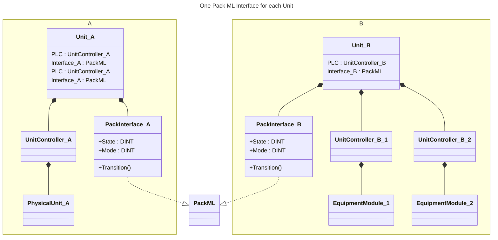
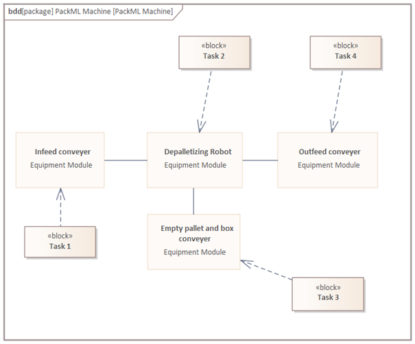
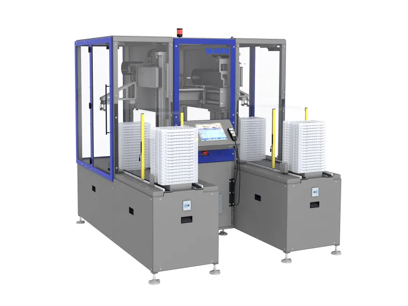
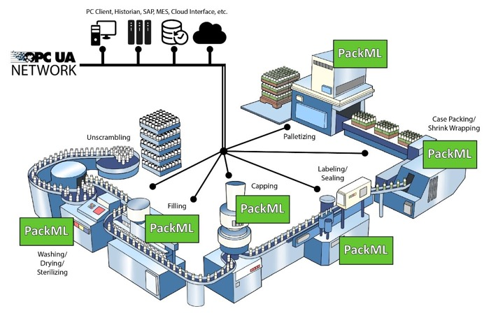
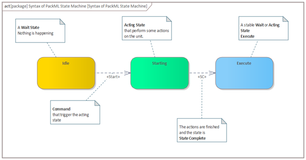
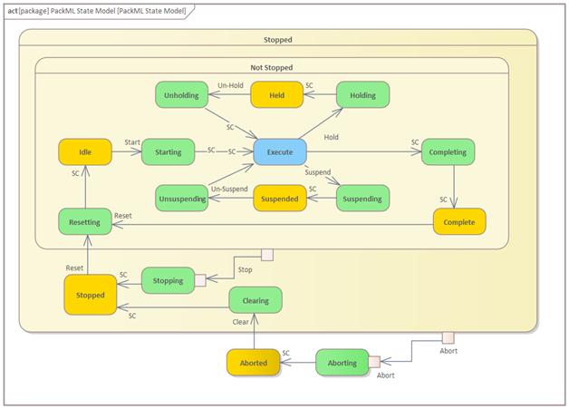
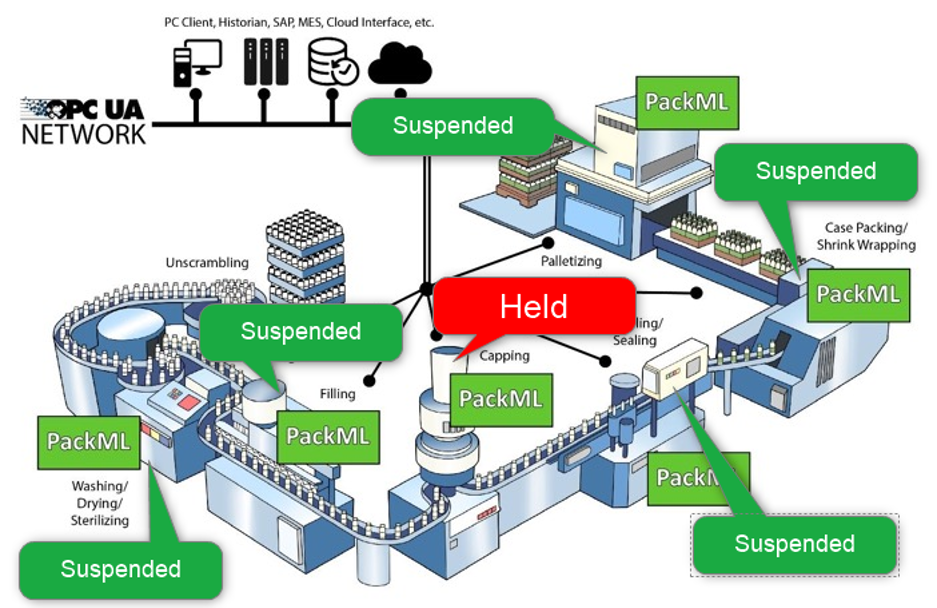
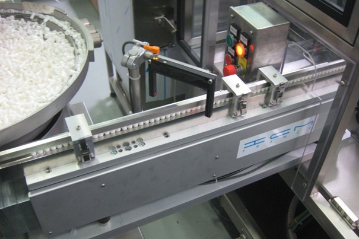
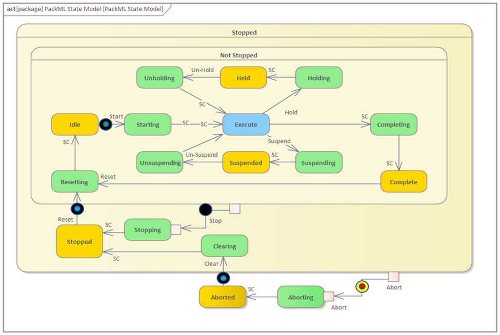

<h1 align="left">
  <br>
  
  <br>
  Industrial Automation Base
  <br>
</h1>

Cours AutB

Author: [Cédric Lenoir](mailto:cedric.lenoir@hevs.ch)

# Modul 08 Einführung in PackML-Zustände

*Schlüsselwörter:* **PackML PackTag**

# Präambel
In den weiteren Modulen nähern wir uns der Ansteuerung elektrischer Achsen in Praxis und Theorie.

Eine der Besonderheiten der Achssteuerung besteht darin, dass die Komplexität leicht ansteigt und schnell eine bestimmte Methodik erforderlich ist, um die Robustheit der Regelstrecke zu gewährleisten, aber auch um Effizienz bei der Codierung zu gewinnen. Aus diesem Grund stellen wir in diesem Kurs **PackML** vor. Wir werden nur einen Teil von PackML als Ganzes ansprechen, nämlich den Teil, der sich mit der MaschinenStatessverwaltung befasst. Die anderen Aspekte, Betriebsarten, PackTAG werden nur als allgemeines Wissen zur Automatisierung vorgestellt.

#PackML
Das Referenzdokument, das diesen Abschnitt beschreibt [ISA-TR88.00.02-2022, Maschinen- und Unitenzustände: Ein Implementierungsbeispiel für ISA-88.00.01](https://www.isa.org/products/isa-tr88-00 - 02-2022-machine-and-unit-states-an-imp) unterliegt dem Urheberrecht und darf nicht frei verbreitet werden.

In der Praxis finden wir Implementierungen des PackML-Standards bei mehreren Anbietern von IEC61131-3-Produkten, darunter beispielsweise Siemens mit einem Beispiel, das direkt auf S7-1500 verwendet werden kann.

[CPG-Vorlage für S7-1500](https://support.industry.siemens.com/cs/attachments/109475572/CPG_Template_SIMATIC_V1_0_de.pdf)

[LPMLV30 für SIMATIC](https://support.industry.siemens.com/cs/document/49970441/simatic-simotion-omac-packml-v3-machine-and-unit-states?dti=0&lc=en-US)

Wir können auch auf [OMAC, The Organization for Machine Automation and Control](https://www.omac.org/) verweisen.

# PackML-Statessmaschine
## Identifizieren einer Unit/Maschine (Erinnerung und Erweiterung)
Eine Unit/Maschine ist als eine Reihe physischer Geräte und Steuerfunktionen definiert, die eine oder mehrere wichtige Verarbeitungsfunktionen ausführen.

Eine **Unit** / **Maschine** kann eine einzelne Maschine oder eine Teilmenge einer gesamten Verpackungslinie sein.

Eine Unit/Maschine wird funktionell oder physikalisch über eine gemeinsame **Schnittstelle**-Unit/Maschine definiert.

Der PackML Interface Status Manager stellt eine einzige Kommunikationsschnittstelle zwischen der HMI oder einem anderen externen Steuerungssystem und der Unit/Maschine bereit, wie in Abbildung ``Eine Unit`` dargestellt.



Ein Fehler an einer Unit/Maschine kann alle Subsysteme der ``Unit``/Maschine stoppen und einen Alarm oder eine Warnung auslösen. Oftmals definiert der Sicherheitskreis die Grenze einer Unit/Maschine in einer Verpackungslinie.

Wenn ein Fehler an einer Unit/Maschine nur einen Teil der Subsysteme stoppt und einen Alarm oder eine Warnung generiert, kann das einzelne Subsystem als einzelne Unit definiert werden, dies ist jedoch nicht obligatorisch.

Tipps: Für jeden Teil einer Unit, die ein bestimmtes Produkt verwaltet, wird eine PackML-Schnittstelle definiert. Eine Unit/Maschine kann jeweils nur einen Produktionsauftrag bearbeiten.

> Eine Unit/Maschine kann über 3 interne Antriebsregler verfügen, wird jedoch aufgrund der Benutzersituation und des Bedienerzugriffs als Unit/Maschine wahrgenommen.

> Ein Depalettierer kann aus Zufuhrförderern, einem Roboter und Ausgangsförderern bestehen und wird als Unit/Maschine betrachtet, wie in der Abbildung der PackML-Maschine dargestellt.

<figure align="center">
    
    <figcaption>A Pack ML machine made of different Equipment Modules</figcaption>
</figure>

Optisch könnte es so aussehen:

<figure align="center">
    
    <figcaption>Image d'origine www.mikron.com Tray Handler</figcaption>
</figure>

Für eine Unit/Maschine, die mehr als einen unabhängigen Prozess ausführt, ist eine PackML-Schnittstelle für jeden der unabhängigen Prozesse erforderlich. Beispielsweise muss ein Palettierer mit zwei unabhängigen Verpackungszellen in derselben Linie über zwei PackML-Schnittstellen verfügen.

## Warum Standardzustände?
<figure align="center">
    
    <figcaption>PackML, Why Standard States, Source: opcconnect.opcfoundation.org
    </figcaption>
</figure>

## The PackML interface State Model
Syntax des PackML-Statessmodells
Das PackML-SchnittstellenStatessmodell basiert auf zwei Hauptelementen:
### Commands
- Ein Auslöser, der die ``Einheit``/Maschine von einem States in einen anderen versetzt (z. B. ein Druckknopf an der ``Einheit``/Maschine oder ein externer Befehl, der über das Netzwerk gesendet wird, oder sogar ein interner Alarm)

### States
- **Acting State** (ein States, in dem die Einheit/Maschine eine Aktion ausführt)
- **Wait States** (stabile Situation für die Einheit/Maschine). Ein WarteStates erfordert einen Befehl zum Eintritt in den nächsten States.
- **Execute** ist ein besonderer States, der einen **Wait-States** mit einem **Acting State** kombiniert, wir sprechen auch von **Dual State**.
 
<figure align="center">
    
    <figcaption>Syntax of PackML State Machine</figcaption>
</figure>

Im Allgemeinen passiert während eines **Wait State** nichts, oder zumindest gibt es keine Maschinenaktion auf der *prozeduralen* Ebene. Allerdings hindert nichts eine Steckdosenleiste daran, weiter vorzufahren oder sogar anzuhalten, wenn der Stoppbefehl intern im Modul erfolgt, das sie steuert.

Es genügt, dass ein einzelnes Modul einen Befehl ausgibt, zum Beispiel **Stop**, damit alle Module gleichzeitig in den nächsten Zustand wechseln.

Wenn sich die Module im **Acting State** befinden, haben wir eine konkrete Aktion der Module, sie führen die für diesen Zustand programmierte Sequenz aus. Beispielsweise werden die verschiedenen Aktoren in ihrem Ausgangszustand positioniert, um für ``Execute`` bereit zu sein.

Wenn alle Module ihre Sequenz abgeschlossen und ihren Status **SC**, **States Complete** aktiviert haben, und **nur dann**, wechseln alle Module in den nächsten Status.

## Le PackML Interface State Model
 
<figure align="center">
    
    <figcaption>PackML State Model</figcaption>
</figure>

Es wird empfohlen, alle **17 Zustände** des Zustandsmodells zu implementieren.

Im Prinzip können wir bestimmte Zustände löschen, aber es ist **verboten, irgendwelche hinzuzufügen**, *außer natürlich die internen Zustände jedes der 17 Staaten*.

> Im Bild oben bedeutet **SC** **State Complete**, das bedeutet, dass das betreffende Modul die ihm zugewiesene Aufgabe im aktiven Zustand abgeschlossen hat.

### Zustände löschen
**Alle 17 Staaten sind implementiert!!!**
Abhängig von der Implementierung ist es möglich, bestimmte Status zu deaktivieren, darunter Complete, **Completing**, **Suspending**, **Suspended**, **Unsupending**, **Holding**, **Held** et **Unhoding**, insbesondere im manuellen Modus.

Einige Implementierungen, wie z. B. Siemens, ermöglichen die Konfiguration aktiver Zustände.

> Im Extremfall können wir uns mit einem Minimum an Zuständen zufrieden geben, einschließlich **Stopped** und **Execute**. Einmal beherrscht, kann das Konzept auch in sehr einfachen Installationen eingesetzt werden.

<figure align="center">
    
    <figcaption>PackML The Minimum State Machine</figcaption>
</figure>

Im Allgemeinen können alle **Acting** Zustände gelöscht werden. Mit folgenden Bedingungen:

|Precondition	    |Requierment       |
|-----------------|------------------|
|If Completing state available...	|Complete state mandatory.|
|If Suspending state available...	|Suspended state mandatory.|
|If Un-Suspending state available...	|Suspended state mandatory.|
|If Aborting state available...	|Aborted state mandatory.|
|If Clearing state available...	|Aborted state mandatory.|
|If Resetting state available...	|Idle state mandatory.|
|If Idle state available...	|Resetting state mandatory.|


### Zusätzliche Staaten
Ich empfehle, sie in Zwischenzuständen einzukapseln. Unter keinen Umständen sollten Sie jedoch die allgemeine Konfiguration ändern**.

### Benutzerdefinierte Implementierung
Es ist natürlich möglich, von einem leeren Blatt Papier aus zu beginnen, um eine bestimmte Implementierung zu schreiben.

Das Ziel von PackML ist die Effizienzsteigerung. Ich empfehle daher, von einer bestehenden Implementierung inklusive deren Dokumentation auszugehen.


##	En résumé

|State    |Description                |
|---------|---------------------------|
|EXECUTE	|**Acting State** - Das Gerät/die Maschine befindet sich in einem stabilen Betriebszustand – das Gerät/die Maschine produziert.|
|STOPPED / IDLE / COMPLETE	|**Wait State** - Ein stabiler Zustand, der verwendet wird, um zu erkennen, dass eine Einheit/Maschine einen definierten Satz von Bedingungen erreicht hat. In einem solchen Zustand behält die Einheit/Maschine einen Zustand bei, bis ein Befehl einen Übergang in einen aktiven Zustand verursacht. Das Gerät/die Maschine ist angetrieben und stationär.|
RESETTING / STARTING / SUSPENDING / UNSUSPENDING / COMPLETING / HOLDING / UNHOLDING / ABORTING / CLEARING / STOPPING	|**Acting State** - Un Zustand, der die Verarbeitungsaktivität darstellt, zum Beispiel Geschwindigkeitsbeschleunigung. Dabei handelt es sich um die einzelne oder wiederholte Ausführung von Verarbeitungsschritten in einer logischen Reihenfolge, für eine endliche Zeit oder bis eine bestimmte Bedingung erreicht ist, z. B. im Startzustand, wobei die Qualität und Gültigkeit der empfangenen Daten überprüft werden, bevor sie zur Ausführung hochgefahren werden.|
|HELD |**Wait State** - Ein Zustand, der einen Fehlerzustand des Geräts darstellt, der einen Alarm oder eine Warnung generiert. In diesem Zustand produziert die Einheit/Maschine nicht, bis der Bediener in den EXECUTE-Zustand übergeht. Die Bedingung hält den Betrieb der Einheit/Maschine aufrecht, während Materialblockaden beseitigt werden, oder ermöglicht die sichere Behebung eines Gerätefehlers, bevor die Produktion wieder aufgenommen wird.|
|SUSPENDED	|**Wait State** - In diesem Zustand produziert die Einheit/Maschine nichts. Der Betrieb stoppt oder läuft ohne Produktion weiter, bis sich die externen Prozessbedingungen wieder normalisieren. Zu diesem Zeitpunkt geht der Zustand SUSPENDED in den Zustand UNSUSPENDING über, normalerweise ohne Bedienereingriff.|
|ABORTED|**Wait State**, Die Maschine wird gestoppt, die Energiezufuhr zu den Aktoren wird unterbrochen. Dies ist der Zustand der Maschine nach dem Einschalten oder nach einem Notstopp.|

> Der Unterschied zwischen **Held** und **Suspended** ist hauptsächlich aus der Sicht der Analyse der Leistung der Maschine (Einheit) zu verstehen.
Im Falle von **Suspended** wartet die Maschine auf **externe** Bedingungen. Zum Beispiel Produktversorgung, vor- oder nachgelagerte Maschine nicht bereit. Das heißt, wenn wir die Leistung der Maschine analysieren, selbst wenn die Maschine 50 % ihrer Zeit im **Suspended** verbringt, ist die Maschine, die Einheit selbst nicht schuld.

<figure align="center">
    
    <figcaption>PackML Held vs Suspended</figcaption>
</figure>

> Im Fall von **Held** bedeutet dies im Allgemeinen, dass **eines der Elemente der Maschine** ein Ereignis erzeugt hat, das die Maschine in diesen Zustand gebracht hat. Wenn die Maschine 50 % ihrer Zeit im Zustand **Held** verbringt, ist es zweifellos notwendig, die Ursache für diesen Zustand zu analysieren.

<figure align="center">
    
    <figcaption>PackML states Internal & External conditions</figcaption>
</figure>

## Im Detail
Der oben zitierte Leitfaden Teil 1: PackML Interface State Manager ist sehr umfassend und wird für detaillierte Arbeiten nützlich sein.
Die folgende Zusammenfassung ist direkt vom Dokument ISA–TR88.00.02 inspiriert.
ISA Technical Report TR88.00.02 Maschinen- und Einheitenzustände. Wie die meisten ISA- oder IEC-Dokumente unterliegen auch diese nicht dem Urheberrecht. Die Vervielfältigungsrechte sind eingeschränkt. Die Preise sind im Verhältnis zu ihrem Nutzen begrenzt (180 USD für dieses Dokument), was ungefähr 1 Arbeitsstunde für einen Ingenieur entspricht. 

###	Stopped
**State Type** *Wait*

Nach Abschluss des STOPP-Zustands ist die Maschine mit Strom versorgt und steht still. Die gesamte Kommunikation mit anderen Systemen funktioniert (sofern zutreffend). Ein RESET-Befehl führt zum Verlassen von STOPPED in den RESETTING-Zustand.

###	Starting
**State Type** *Acting*

Dieser Status stellt die zum Starten der Maschine erforderlichen Schritte bereit und ist das Ergebnis eines Boot-Typ-Befehls (lokal oder remote). Nach diesem Befehl wird die Maschine gestartet.

###	Idle
**State Type** *Wait*

Dies ist ein Zustand, der anzeigt, dass das RESETTING abgeschlossen ist. Dieser Zustand behält die Maschinenbedingungen bei, die während des RESETTING-Zustands erreicht wurden, und führt die erforderlichen Vorgänge aus, wenn die Maschine im Ruhezustand ist.

###	Suspending
**State Type** *Acting*

Dieser Zustand ist das Ergebnis einer Änderung der überwachten Bedingungen aufgrund von Prozessbedingungen oder -faktoren. Das auslösende Ereignis führt zu einer vorübergehenden Unterbrechung des EXECUTE-Status. SUSPENDED ist in der Regel das Ergebnis eines Mangels an vorgelagerten Materialien (z. B. Behälterzuführung, Getränkezuführung, Kronenzuführung, Schmiermittelzuführung usw.), die außerhalb der Geschwindigkeit des dynamischen Regelbereichs liegen, oder einer Blockierung des nachgeschalteten Ausgangs, die verhindert, dass die Maschine AUSFÜHRT. oder in die kontinuierliche reguläre Produktion. Während der kontrollierten SUSPENDING-Sequenz geht die Maschine in den SUSPENDED-Zustand über.
Der SUSPENDING-Zustand kann vom Bediener erzwungen werden.

###	Suspended
**State Type** *Wait*

Die Maschine kann mit einer angemessen eingestellten Geschwindigkeit betrieben werden, es wird jedoch kein Produkt produziert, während die Maschine darauf wartet, dass sich die externen Prozessbedingungen wieder normalisieren. Wenn sich die fehlerhaften Prozessbedingungen wieder normalisieren, ändert sich der SUSPENDED-Status in UNSUSPENDING und geht daher in den normalen EXECUTE-Status über.

>Der Zustand SUSPENDED kann aufgrund abnormaler **externer** Prozessbedingungen erreicht werden und unterscheidet sich von HELD. HELD ist in der Regel das Ergebnis einer Bedieneranforderung oder eines automatisch erkannten Maschinenfehlerzustands, der behoben werden muss, bevor eine Bedieneranforderung zum Übergang in den UNHOLDING-Zustand verarbeitet wird.

###	Unsuspending
**State Type** *Acting*

Dieser Status ist das Ergebnis einer Maschinentypanforderung vom SUSPENDED-Status zur Rückkehr in den EXECUTE-Status. Zu den Aktionen in diesem Zustand können das Beschleunigen von Gängen, das Einschalten von Vakuum und das erneute Einrücken von Kupplungen gehören. Dieser Zustand wird vor dem EXECUTE-Zustand ausgeführt und bereitet die Maschine auf den EXECUTE-Zustand vor.

> Im Gegensatz zur UNHOLD-Aktion kann UNSUSPENDING automatisch eingeleitet werden. Zum Beispiel, wenn am Eingang der Maschine wieder Teile verfügbar sind.

###	Execute

**State Type** *Dual*

Une fois que la machine traite des matériaux, elle est considérée comme étant en cours d'exécution ou dans l'état EXECUTE. Différents modes de la machine entraîneront des types spécifiques d'activités EXECUTE. Par exemple, si la machine est en mode Production, EXECUTE entraînera la production de produits, tandis qu'en mode Clean Out, l'état EXECUTE se réfère à l'action de nettoyage de la machine.

###	Stopping
**State Type** *Acting*

Sobald die Maschine Materialien verarbeitet, wird davon ausgegangen, dass sie läuft oder sich im EXECUTE-Zustand befindet. Verschiedene Maschinenmodi führen zu bestimmten Arten von EXECUTE-Aktivitäten. Befindet sich die Maschine beispielsweise im Produktionsmodus, bewirkt EXECUTE die Produktion von Produkten, während sich im Clean Out-Modus der EXECUTE-Status auf die Reinigungsaktion der Maschine bezieht.

###	Aborting
**State Type** *Acting*

Der ABORTED-Zustand kann jederzeit als Reaktion auf den Abort-Befehl oder das Auftreten eines Maschinenfehlers eingenommen werden. Die Abbruchlogik sorgt für ein sicheres und schnelles Herunterfahren der Maschine. Die Betätigung des Not-Aus-Schalters führt dazu, dass die Maschine durch ihr Sicherheitssystem ausgelöst wird. Es wird auch ein Signal bereitgestellt, um den ABORTING-Zustand auszulösen.

> Im Bereich elektrischer Antriebe bringt der Befehl **Abort** die Antriebe im Allgemeinen in den Zustand **STO**, *Safe Operating Stop*, d. h. die Bewegungsfreiheit ist gewährleistet, ohne dass unbedingt der Wirkstrom an den Motoren unterbrochen werden muss. **STO** bedeutet, dass das Motordrehmoment, also der Strom, sicher abgeschaltet wird.

Aus Sicht der internen Logik des Systems hätte der Zustand ABORTING die gleiche Logik wie der Zustand STOPPING durchlaufen müssen, um die Achsen kontrolliert anzuhalten.
Die Zeit, die das System zur Ausführung des Zustands ABORTING zur Verfügung stellt, hängt von Sicherheitskriterien ab.

###	Aborted
**State Type** *Wait*

Dieser Zustand verwaltet Maschinenzustandsinformationen im Zusammenhang mit der Abbruchbedingung. Die Maschine kann den ABORTED-Zustand nur nach einem expliziten Clear-Befehl verlassen, gefolgt von einem manuellen Eingriff, um die erkannten Maschinenfehler zu beheben und zurückzusetzen.

###	Holding
**State Type** *Acting*

Wenn sich die Maschine im EXECUTE-Zustand befindet, kann der Hold-Befehl verwendet werden, um die HOLDING-Logik zu starten, die die Maschine in einen kontrollierten Stopp oder Zustand bringt, der HELD für den jeweiligen Einheitensteuerungsmodus darstellt. In diesen Zustand kann eine Maschine entweder durch die automatische Erkennung eines internen Gerätefehlers oder durch einen Bedienerbefehl gelangen. Der Befehl ``Halten`` bietet dem Bediener eine sichere Möglichkeit, manuell in den Prozess einzugreifen (z. B. eine zerbrochene Flasche aus der Zufuhr zu entfernen) und die Ausführung neu zu starten, wenn die Bedingungen sicher sind. Um die Produktion nach dem HOLD-Zustand korrekt wieder aufnehmen zu können, müssen während der Ausführung des HOLDING-Vorgangs alle relevanten Prozesssollwerte und der Rückkehrstatus der Abläufe zum Zeitpunkt des Erhalts des Hold-Befehls in der Maschinensteuerung gespeichert werden.

> Eine der Schwierigkeiten des HOLDING-Zustands besteht darin, die Maschine in einen ausreichend stabilen Zustand zu bringen, um eine Rückkehr in den EXECUTE-Zustand zu ermöglichen, ohne eine Initialisierungsphase, RESETTING, durchlaufen zu müssen.

###	Held
**State Type** *Wait*

Der HALTE-Zustand hält den Maschinenbetrieb aufrecht, während Materialblockaden beseitigt werden, oder um den Fluss zu stoppen, während ein nachgelagertes Problem gelöst wird, oder um eine sichere Korrektur eines Gerätefehlers zu ermöglichen, bevor die Produktion wieder aufgenommen werden kann.

###	Unholding
**State Type** *Acting*

Der UNHOLDING-Zustand ist eine Antwort auf einen Bedienerbefehl, den EXECUTE-Zustand wieder aufzunehmen. Durch Ausgabe des Unhold-Befehls werden die gespeicherten Sollwerte abgerufen und die Zustandsbedingungen zurückgegeben, um die Maschine auf die Rückkehr in den normalen EXECUTE-Zustand vorzubereiten.
Hinweis: Ein Unhold-Operatorbefehl ist immer erforderlich und UNHOLDING kann niemals automatisch gestartet werden.

###	Completing
**State Type** *Acting*

Dieser Zustand ist eine automatische Reaktion auf den EXECUTE-Zustand. Der normale Betrieb ist abgeschlossen (d. h. die Eingabeverarbeitung wird gestoppt).
Beispiel: Eine Maschine muss 2000 Baugruppen produzieren. Sobald diese Zahl erreicht ist, wird ein Vorgang zur Evakuierung der Teile gestartet, die sich noch in der Maschine befinden und für die Herstellung ihrer Baugruppen nicht mehr benötigt werden.

###	Complete
**State Type** *Wait*

Die Maschine hat den Status COMPLETING abgeschlossen und wartet nun auf einen Reset-Befehl, bevor sie in den Status RESETTING übergeht.

###	Resetting
**State Type** *Acting*

Dieser Zustand ist das Ergebnis eines RESET-Befehls aus dem Zustand STOPPED oder COMPLETE. Das RESETTING führt normalerweise dazu, dass eine Maschine ein visuelles oder akustisches Signal erzeugt und die Maschine in einen Zustand versetzt, in dem Komponenten unter Spannung stehen, während sie auf einen START-Befehl warten.

**Beispiel**: Im Zustand STOPPED oder COMPLETE kann die Maschine in einen Zustand mit geringem Verbrauch (und geringer Lautstärke) versetzt werden. Im Beispiel eines rotierenden und/oder linearen Vibrators können wir die verschiedenen Elemente mit der RESETTING-Aktivität einschalten. Mit der Aktivität STARTEN werden die Teile zum Ausgang des Linearrüttlers transportiert.
 
<figure align="center">
    
    <figcaption>PackML Resetting, source www.icm-automation.com</figcaption>
</figure>

###	Clearing
**State Type** *Acting*

Wird durch einen Statusbefehl initiiert, um Fehler zu löschen, die möglicherweise während des ABORTING-Vorgangs aufgetreten sind und im ABORTED-Zustand vorhanden sind, bevor in den STOPPED-Zustand übergegangen wird.

>Bei elektrischen Antriebssteuerungen bedeutet der ABORTED-Zustand oft, dass die Motoren durch die Sicherheitsschaltung außer Drehmoment gesetzt werden, STO, Safe Torque Off. Eine der Aktivitäten des CLERARING-Befehls kann darin bestehen, die Motoren wieder mit Strom zu versorgen.

## Les commandes

- Es gibt 9 Befehle. Sehen Sie sich einfach die Abbildung im PackML-Zustandsmodell an. Jede weitere Beschreibung erscheint überflüssig. In der PackTag-Formalisierung reicht ihr Wert von 0 (kein Befehl) bis 9.

- Die folgende Tabelle dient nur zu Informationszwecken.

- Einige Befehle können logische Kombinationen sein, beispielsweise verwenden die Befehle **Clear** und **Reset** möglicherweise dieselbe Schaltfläche.

- Viele Befehle, zum Beispiel Hold, Stop, Abort, werden durch Alarmstufen generiert.

>Zur Erinnerung: In einer Maschine muss jeder Alarm eine eindeutige Identifikationsnummer haben. Ebenso generiert jeder mit einem Befehl verknüpfte Alarm einen eindeutigen Befehl.

|Command	|N° PackML	|External interface	|Soft push Button	|Hard Push Button	|Name of button|
|---------|-----------|-------------------|-----------------|-----------------|--------------|
|No Command|0|	Optional	|YES||	 	n/a|
|Reset|	1|	Optional	|YES	 	||Reset|
|Start|	2|	Optional	|YES	 	||Start|
|Stop|	3|	Optional	|YES	 	||Stop|
|Hold|	4|	Optional	|YES	 	||n/a|
|Unhold|	5|	Optional|	YES	 	||Restart|
|Suspend|	6|	YES	|YES	 	||n/a||
|Unsuspend|	7|	YES	|YES	 |	|n|/a|
|Abort|	8|	Optional|	 	|YES	|E-Stop|
|Clear|	9|	Optional	|YES	| 	|Reset (E-Stop)|

## Remote

<figure align="center">
    
    <figcaption>PackML remote commands</figcaption>
</figure>

###	PACKML STATE MODEL, EXEMPLE DE BOUTONS DE COMMANDE

Ein Beispiel für eine Erweiterung sind Schaltflächen, die beispielsweise in der Siemens-Implementierung vorhanden sind. Diese Schaltflächen entsprechen einfach den PackML-Befehlen
- Grüner Start
- Schwarzer Stop
- Blau Reset oder Clear
- Roter Abort (E-Stop)


>**Allgemeiner Hinweis**
Eine schnelle Diagnose der guten Qualität der Zustandsmaschinenverwaltung einer Anlage lässt sich oft schnell mit einem Befehl durchführen. **Abort**. Das Abschalten einer Anlage durch einen Not-Aus ist ein normaler Vorgang, der beherrscht werden muss. Befinden sich nach einem Not-Aus-Vorgang ein oder mehrere Elemente in einem Zustand, der einen Fehler signalisiert, ist dieser Vorgang schlecht kontrollierbar.
Bei Antrieben mit erheblichen Massen oder Trägheiten kann sich eine schlecht kontrollierte Abschaltung als gefährlicher erweisen als das Ereignis, das den **Abort** ausgelöst hat.
Ein Bediener, der den **Abort**-Befehl regelmäßig nutzt und missbraucht, um seine Maschine im Fehlerfall anzuhalten oder zurückzusetzen, ist leider auch ein allzu häufiges Symptom einer schlecht gesteuerten Zustandsmaschine.

## Unit Control Mode, Modi und Übergänge

Eine Einheit/Maschine kann sich in verschiedenen Modi befinden, z. B. **Produktion**, **Wartung**, **Manuell**, **Reinigung**, **Jog-Modus** usw.

Ein Einheitensteuerungsmodus ist eine geordnete Teilmenge von Zuständen und Befehlen, die die vom Einheits-/Maschinenprozess auszuführende Strategie bestimmt.

Dies bedeutet, dass das obige PackML-Schnittstellenzustandsmodell in verschiedenen Modi unterschiedlich dargestellt werden kann.

Das PackML-Schnittstellenzustandsmodell muss für den Produktionsmodus vollständig implementiert werden und kann für den manuellen Modus und den Wartungsmodus teilweise implementiert werden.

  Im **manuellen Modus** ist die gesamte Kommunikation mit externen Systemen, die die Einheit/Maschine manipulieren können, deaktiviert.
 
  Im **manuellen Modus** kann der Bediener die Steuerung des Geräts über die HMI des Geräts übernehmen, ohne eine Verbindung zu einem externen System herzustellen.

Der Maschinenlieferant muss die zusätzlich zu **Produktion**, **Manuell** und **Wartung** verfügbaren Modi angeben.

Es ist Sache des Maschinenlieferanten und Endbenutzers, den Startmodus nach dem Einschalten festzulegen, zum Beispiel STOPPED oder IDLE.


### Prinzipien
- Die Modustabelle dient nur zu Informationszwecken. Nur der PRODUCTION-Modus ist obligatorisch.

- Das Umschalten von einem Modus in einen anderen kann nur **in genau definierten Zuständen** erfolgen, im Allgemeinen im STOPPED-Zustand.

- Der Wechsel von einem Modus in einen anderen ist nur möglich, wenn der Ankunfts- und Abflugstatus vorhanden ist.

- In einigen Implementierungen können Zugriffsberechtigungen von einem Modus zum anderen konfiguriert werden.

|PackML-Tagwert|Modus |PackML-Statusmodell |Eingeschränkter Zugriff |Verwendung|
|------|------|-------|---------|-------------------------|
|1| PRODUKTION| Obligatorisch| Nein| Hauptmodus für alle Produktionsaktivitäten, alle Zustände des PackML-Modells werden verwendet. PackTags sind aktiv. Die Einheit/Maschine führt die entsprechende Logik als Reaktion auf Befehle aus, die hauptsächlich von externen Systemen stammen oder direkt vom Bediener eingegeben werden.|
|2 |WARTUNG |Optional |Ja |Wird für routinemäßige vorbeugende Wartung oder geplante Wartung verwendet. Sollte verwendet werden, um das Auftreten und die Dauer geplanter Wartungsarbeiten zu dokumentieren. Dieser Modus ermöglicht es autorisiertem Personal, das Gerät/die Maschine unabhängig von anderen Systemen zu bedienen. Dieser Modus wird typischerweise zur Fehlerbehebung, zum Testen von Maschinen oder zum Testen betrieblicher Verbesserungen verwendet. Beispiel: Das Reinigen eines Druckkopfes ist eine Wartung.|
|3 |MANUELL |Optional |Ja |Wird zur Fehlerdiagnose bei unvorhergesehenen technischen Eingriffen verwendet. Hinweis: Im manuellen Steuerungsmodus ist es nicht erforderlich, alle PackML-Zustände zu implementieren.|
|4 |ÄNDERUNG ÜBER |Optional |Nein |Kann speziell für Format- oder Rezeptänderungen verwendet werden, einschließlich *Bereinigungsvorgänge*.|
|5 |CLEAN |Optional |Nein |Kann für routinemäßige Reinigungsanforderungen verwendet werden, zum Beispiel: gemäß den werkseitigen Wartungsverfahren.|
|6 |SET UP |Optional |Optionale Einschränkung |Kann als Beispiel für Konfiguration oder Einstellung verwendet werden: mechanische Einstellungen und Tests|
|… |OEM-spezifisch |Optional |Ja |Würde NUR für OEM verwendet, alle für die Maschine erforderlichen Einstellungen und werden wahrscheinlich NIEMALS von einem Kunden benötigt.|

> **OEM** bedeutet hier: **Original Equipment Manufacturer**, also ein Unternehmen, dessen Waren als Komponenten in Produkten eines anderen Unternehmens verwendet werden. Mit anderen Worten: Wird häufig zur Bezeichnung eines Maschinenherstellers verwendet.

### Wartungsmodus, *Beispiel*
Hier sind die Suspend- und Complete-Schleifen deaktiviert.
In der Praxis bedeutet dies vor allem, dass die Maschine von äußeren Elementen isoliert ist.

<figure align="center">
    
    <figcaption>PackML State Model Maintenance</figcaption>
</figure>

### Manueller Modus, *Beispiel*
Der manuelle Modus ist kein *Debug*-Modus, er ermöglicht Ihnen die Ausführung von Prozeduren, Phasen gemäß ISA-88, um die Ausrüstung individuell zu steuern.
 
<figure align="center">
    
    <figcaption>PackML State Model Manual</figcaption>
</figure>

## Zeitliche Koordinierung
In einigen Implementierungen gibt es Zeitlimits, die beim Wechsel von einem Zustand in einen anderen oder von einem Modus in einen anderen Ereignisse auslösen.

Durch die Überwachung der Zeit, die ein Modul benötigt, um den **SC**, *State Complete* zu aktivieren, kann ein Fehler während einer Startphase schnell erkannt werden, insbesondere in unvorhergesehenen Fällen, die nicht mit einem bestimmten Alarm verbunden sind.

##	PackTag, Automated Machine Functional Tag Description

###	Introduction

Les PackTags fournissent un ensemble uniforme de conventions de dénomination pour les éléments de données utilisés dans les éléments procéduraux du modèle d'état de base.

Comme vu précédemment dans le document, le modèle d'état de base fournit un ensemble uniforme d'états de la machine, de sorte que toutes les machines automatisées puissent être vues de manière commune.

Les **PackTags** sont des éléments de données nommés utilisés pour une architecture ouverte, l'échange de données interopérable dans des machines automatisées.

Ce document comprend les noms fondamentaux des éléments de données ainsi que le type de données, les valeurs, les plages et, le cas échéant, les structures de données.

Les **PackTags** sont utiles pour les communications de machine à machine, inter machine, ou PLC to PLC; par exemple entre une remplisseuse de bouteille et un visseuse de bouchon.

Les **PackTags** peuvent également être utilisés pour l'échange de données entre les machines et les systèmes d'information de niveau supérieur comme la gestion des opérations de fabrication et les systèmes d'information d'entreprise (Voir ISA-95).

La norme définit tous les **PackTags** nécessaires pour naviguer dans un modèle, ainsi que ceux qui sont nécessaires pour définir et manipuler le mode de contrôle de l'unité.

La norme définit également une liste de **PackTags** qui fourniront les informations nécessaires qui peuvent être disponibles à partir d'une machine.

L'utilisation de tous les **PackTags** est nécessaire pour être cohérente avec les principes de connectivité intégrée avec les systèmes utilisant cette même méthode de mise en œuvre.

### Typen
PackTags sind in drei Gruppen unterteilt; Befehl, Status und Admin.
Befehls- und Status-Tags enthalten Daten, die für die Schnittstelle zwischen Maschinen und Liniensteuerung zur Koordination oder zum Hochladen von Rezepten/Parametern erforderlich sind. Befehls-Tags werden vom Maschinenprogramm geschrieben und als ``Informationsempfänger`` verwendet, während Status-Tags vom Maschinenprogramm erzeugt und gelesen werden.
Administrations-Tags enthalten Daten, die von übergeordneten Systemen zur Maschinenleistungsanalyse oder zur Bedienerinformation erfasst werden.

- Befehls-Tags werden durch ``Command`` vorangestellt.
- Status-Tags werden mit dem Präfix ``State`` versehen.
- Den Administrations-Tags wird ``Admin`` vorangestellt.

#### PackTag, Vorschau
<figure align="center">
    
    <figcaption>PackTag overview</figcaption>
</figure> 

#### Command, Vorschau

<figure align="center">
    
    <figcaption>PackTag Command Overview</figcaption>
</figure> 


#### Admin, Vorschau

<figure align="center">
    
    <figcaption>PackTag Admin Overview</figcaption>
</figure> 


#### Product, Vorschau

<figure align="center">
    
    <figcaption>PackTag Product Overview</figcaption>
</figure> 


#OPC-UA und PackML
> Im Rahmen dieses Kurses haben wir bereits **OPC-UA** eingesetzt. Ein komplettes Modul dieses Kurses ist **OPC-UA** gewidmet. Auf der Website der Stiftung, die **OPC-UA** verwaltet und PackML und **OPC-UA** integriert, gibt es eine Standardbeschreibung.

Konkret bedeutet das, dass es Spezifikationen gibt, die es verschiedenen Maschinen unterschiedlicher Hersteller ermöglichen, über standardisierte Protokolle und Datenstrukturen miteinander zu kommunizieren

[Siehe PackML – Verpackungskontrolle](https://opcfoundation.org/developer-tools/documents/view/209), das insbesondere Folgendes definiert:

- StateMachines zur Darstellung von Standard-PackML-Zuständen;
- Methoden für Bestellungen;
- Alle Informationen zum Status von PackML;
- Alle Funktionalitäten und Verwaltungsinformationen;
- Maschine-zu-Maschine-Interaktionen;
- Zuordnungsinformationen zwischen dem PackML-System und OPC UA-Systemen.

# In der Praxis,

Wir gehen nicht auf die Implementierung der PackML-Zustandsmaschine ein, die hier durch einen Funktionsblock ``FB_PackStates`` verwaltet wird. Andererseits nutzen wir es, weil es die Verwaltung komplexer Geräte wie der Steuerung elektrischer Achsen erheblich vereinfacht.

Hier finden Sie einige Umsetzungsbeispiele für eine elektrische Achssteuerung.

Wir gehen von einer Teilzustandsmaschine der PackML aus.

<figure align="center">
    
    <figcaption>Partial state machine of PackML</figcaption>
</figure>

## Emergency Stop
Im konkreten Fall gehen wir davon aus, dass an einer Achse ein kritischer Fehler erkannt wird, beispielsweise eine Motorüberhitzung, und dass dies einen Notstopp der Maschine, Befehl ``Abbruch``, erfordert.

Der Befehl ``Abort`` bringt die von einem ``fbPackStates``-FB verwaltete Zustandsmaschine in den Zustand ``Aborting``. Wir werden das X-Achsen-Signal ``mcReadStatus_X.ErrorStop`` nur in diesem Zustand verarbeiten. Sobald wir diesen Fehler behoben haben, informieren wir den FB ``fbPackStates`` mit einem **State Complete**: ``fbPackStates.Aborting_SC := TRUE;``, dass das Problem behoben ist.

```iecst
IF fbPackStates.state.Aborting THEN
	IF mcReadStatus_X.ErrorStop THEN
		fbPackStates.Aborting_SC := FALSE;
	ELSE
		fbPackStates.Aborting_SC := TRUE;
	END_IF
ELSE
	;
END_IF
```

Nachfolgend stellen wir fest, dass der Status ``fbPackStates.state.Aborting`` auch für einen Fehlerbestätigungsbefehl über einen Funktionsblock vom Typ ``MC_Reset`` verwendet wird. Der folgende Code ist vereinfacht.

```iecst
mcReset_X(Axis := GVL_AxisDefines.X_Axis,
          Execute := (fbPackStates.state.Aborting);
```

## Einschalten des Systems

In diesem Fall warten wir darauf, dass die X-Achse eingeschaltet wird``mcReadStatus_X.Standstill``, Wir möchten aber auch überprüfen, ob sich ein Greifer, Gripper, in der offenen Position befindet, bevor er in den PackML-Zustand **Stopped** wechselt.

```ìecst
IF fbPackStates.state.Clearing THEN	
	IF mcReadStatus_X.Standstill AND
       fbGripper.isOpen          THEN
		fbPackStates.Clearing_SC := TRUE;
	ELSE
		fbPackStates.Clearing_SC := FALSE;
	END_IF
ELSE
	;
END_IF
```

## Bereiten Sie die Maschine in einem stabilen Ruhezustand für den Start vor
In diesem Fall bringen wir die X-Achse mithilfe einer internen Zustandsmaschine, **Sub-State**, in eine startbereite Position. Es handelt sich um einen **Reset**-Befehl, der die Produktionseinheit vom inaktiven Zustand, **Wait State** ``Gestoppt``, in den inaktiven Zustand ``Leerlauf`` über den aktiven Zustand, **Acting State**, versetzt.``Zurücksetzen``.

```iecst
IF fbPackStates.state.Resetting THEN
	fbPackStates.Resetting_SC := FALSE;
	CASE eResetting OF
		E_Resetting.Idle :
            stSetParam_X.rPosition_mm := 50;
			stSetParam_X.rVeloctiy_mm_s := 2000;  
			eResetting := E_Resetting.eMotionInit;

		E_Resetting.eMotionInit :
			IF mcMoveAbs_X.Done THEN
				eResetting := E_Resetting.eMotionInitDone; 
			END_IF

		E_Resetting.eMotionInitDone :
			;;
	END_CASE
	 
	IF eResetting = E_Resetting.eMotionInitDone THEN
		fbPackStates.Resetting_SC := TRUE;
	END_IF
ELSE
	eResetting := E_Resetting.Idle;
END_IF
```

> Beachten Sie im obigen Beispiel die Verwendung von ``Else``, um die interne Zustandsmaschine jedes Mal in ihren Ausgangszustand zurückzusetzen, wenn wir uns nicht in **Resetting** befinden. ```eResetting := E_Resetting.Idle;```.

> Durch die Initialisierung von ``eResetting`` können wir auch vermeiden, andere Befehle durch falsche ``eResetting``-Zustände zu stören, wenn wir uns nicht in **Resetting** befinden. Sehen Sie sich den **Teilcode** zum Aufrufen der Funktion ``MC_MoveAbsolute`` an.


```iecst
mcMoveAbs_X(Axis := GVL_AxisDefines.X_Axis,
               Execute := (eResetting = E_Resetting.eMotionInit)   OR
						  (eStarting = E_Starting.eMotionStarting) OR
                          (eExecute = E_Execute.eMotionBack)       OR              
                          (eExecute = E_Execute.eMotionFwd));  
						  
```

> Mit diesem Schreiben sind wir sicher, dass beim Verlassen jedes aktiven Status von PackML die verschiedenen internen Maschinen ``eResetting``, ``eStarting`` und ``eExecute`` immer im Leerlauf sein werden und dass dies möglich sein wird um ``mcMoveAbs_X.Execute`` während einer nächsten **steigenden Flanke** zu verwenden.

## Ausführen
Die Hauptaktivität der Maschine wird nur im Teil ``Execute`` programmiert. Dadurch können wir uns auf diesen Teil des Codes konzentrieren, ohne uns um die Verwaltung aller anderen Zustände der Maschine kümmern zu müssen, wie etwa die Initialisierungsphase oder die Verwaltung verschiedener Szenarien, die die Aktivität der Maschine unterbrechen könnten.

```ìecst
IF fbPackStates.state.Execute THEN
    fbPackStates.Execute_SC := FALSE;
    (*
        Execute State Machine.
    *)
    CASE eExecute OF
        E_Execute.eIdle :
            strState := 'Idle';
            stSetParam_X.rPosition_mm := stRemote.lrPositionFwd_X;
            eExecute := E_Execute.eMotionFwd;

        E_Execute.eMotionFwd :
            strState := 'Motion Fwd';
            IF mcMoveAbs_X.Done THEN
                eExecute := E_Execute.eMotionFwdDone; 
            END_IF

        E_Execute.eMotionFwdDone :
            strState := 'Motion Fwd Done, Close Gripper';
            IF fbCloseGripper.Done THEN
                stSetParam_X.rPosition_mm := stRemote.lrPositionBck_X;
                eExecute := E_Execute.eMotionBack;
            END_IF

        E_Execute.eMotionBack :
            strState := 'Motion Back';
            IF mcMoveAbs_X.Done THEN
                eExecute := E_Execute.eMotionBackDone; 
            END_IF

        E_Execute.eMotionBackDone :
            strState := 'Motion Back Done, Open Gripper'; 
            IF fbOpenGripper.Done THEN
                stSetParam_X.rPosition_mm := stRemote.lrPositionFwd_X;
                eExecute := E_Execute.eMotionFwd;
            END_IF

    END_CASE
    ;
ELSE
    strState := 'Idle';
    eExecute := E_Execute.eIdle;
END_IF
```

# Fazit
Es gibt mehrere gute Gründe, PackML zu verwenden. Wenn man nur einen hervorheben müsste, dann wäre es der, dass Sie, nachdem Sie einmal die Verwendung mehrerer Achsbefehle mit und ohne PackML erlebt haben, nie wieder darauf verzichten möchten.

Nebenbei bemerkt ist es auch möglich, PackML für sehr einfache Maschinen mit nur zwei oder drei Zuständen zu verwenden.

Die Verwaltung der Modi ist ebenfalls komfortabel. Es ist möglich, wie im Fall des Labors, einige der Zustände in allen Modi für die Initialisierung der Maschine zu verwenden, um anschließend mehrere Betriebsarten im Ausführungsmodus (Execute) je nach ausgewähltem Modus vorzusehen.

<!-- End of document -->

