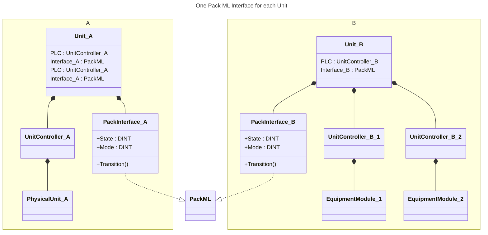

# This section is intended to be modified for various tests with mermaid and/or copilot.

## PackML Base

```mermaid

---
title: One Pack ML Interface for each Unit
---

classDiagram
namespace A{
    class Unit_A{
        PLC : UnitController_A
        Interface_A : PackML
    }
    class Unit_A{
        PLC : UnitController_A
        Interface_A : PackML
    }

    class UnitController_A{
    }

    class PackInterface_A {
        +State : DINT
        +Mode : DINT
        +Transition()
    }
    
    class PhysicalUnit_A{

    }
}

namespace B{
     class Unit_B{
        PLC : UnitController_B
        Interface_B : PackML
    }

    class PackInterface_B {
        +State : DINT
        +Mode : DINT
        +Transition()
    } 

    class UnitController_B_1{
    }

    class UnitController_B_2{
    }
    
    class EquipmentModule_1{

    }

    class EquipmentModule_2{
        
    }
}
  
    Unit_B *-- PackInterface_B  
    Unit_B *-- UnitController_B_1  
    Unit_B *-- UnitController_B_2
   

    UnitController_B_1 *-- EquipmentModule_1 
    UnitController_B_2 *-- EquipmentModule_2        


    Unit_A *-- PackInterface_A  
    Unit_A *-- UnitController_A  
    UnitController_A *-- PhysicalUnit_A 

    PackInterface_B ..|> PackML 
    PackInterface_A ..|> PackML

```
