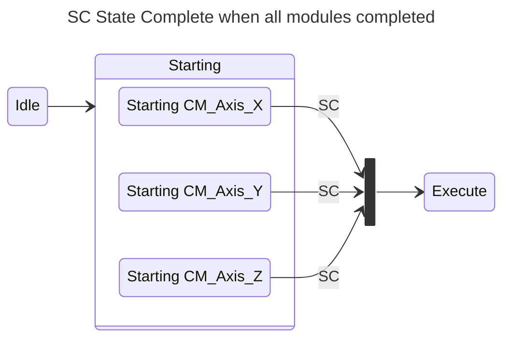
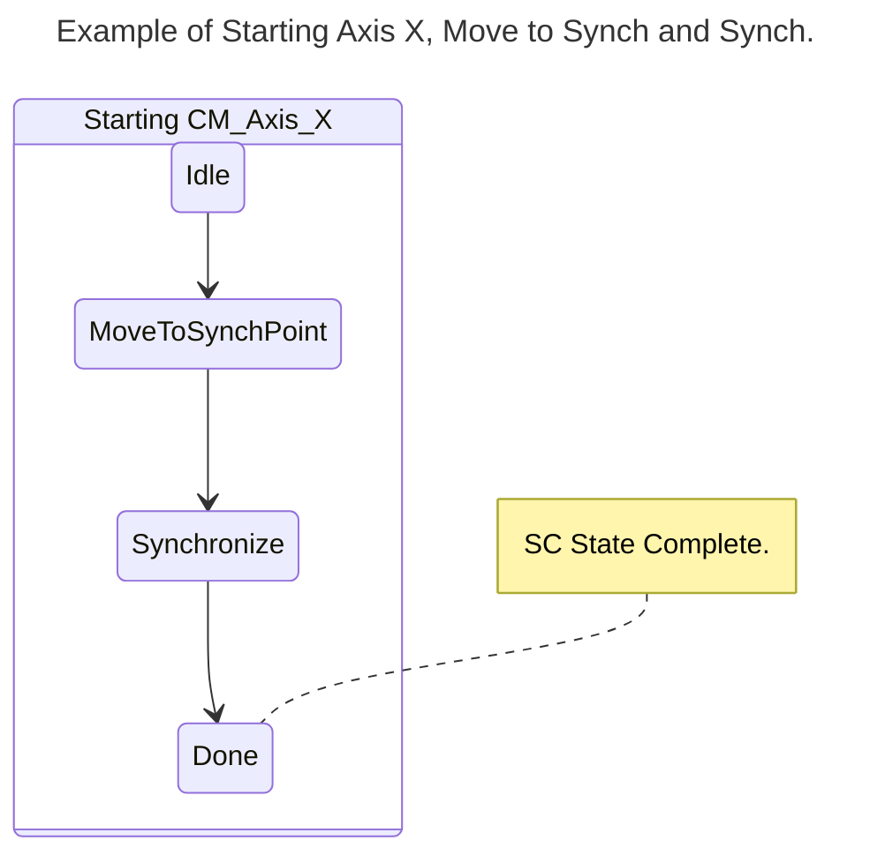

### State Complete

Ein **SC State Complete**-Befehl wird ausgegeben, wenn alle definierten Module der Maschine ihre eigene Phase des aktiven Zustands, in dem sich die Maschine befindet, abgeschlossen haben.

Im folgenden Beispiel müssen drei Achsen, X, Y und Z, synchronisiert werden, bevor der Befehl „Ausführen“ ausgeführt wird.

> Dabei stellen wir uns die Synchronisierung von 3 unabhängigen elektromechanischen Achsen vor, die dann gemeinsam im dreidimensionalen Raum bewegt werden können müssen.

Im folgenden Sonderfall bewegen wir die X-Achse zum Startpunkt einer Trajektorie und synchronisieren sie dann mit der Trajektorie.

