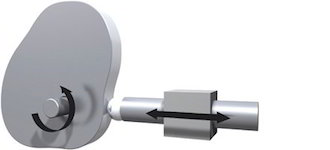

<h1 align="left">
  <br>
  
  <br>
  Industrial Automation Base
  <br>
</h1>

Cours AutB

Author: [Cédric Lenoir](mailto:cedric.lenoir@hevs.ch)

# Module 08 Synchronized Motion with Ethernet Real-Time 


*Keywords: SYNCHRONIZATION POLYNOMIAL*

[Accès rapide]()

# Objectif
On utilise un robot pour montrer comment tirer profit des performances d'un bus Ethernet Real-Time pour piloter directement un axe en position.

Par la suite, il est possible d'appliquer ce principe pour n'importe que actuateur qui devrait être asservi directement au programme cyclique d'un automate, que ce soit sur un ou plusieurs axes.

# Trajectoire
En consultant la bibliographie citée en fin de module, il sera possible de développer un sytème de trajectoire complexe applicable à la robotique. Dans le cadre de ce module nous allons présenter un exemple unique basé sur un polynôme d'ordre cinq afin de pouvoir l'expérimenter dans le cadre d'un travail pratique.

Nous attirons le lecteur sur le fait que le suivi de trajectoires sur plusieurs axes ne se limite pas nécessairement à la robotique. Le robot est uniquement l'outil qui nous permet de mettre en pratique les notions de trajectoires.

## Expression élémentaire d'une trajectoire
Pour bien comprendre la notion de trajectoire, il faut se rappeler que avant l'émergence de l'Ethernet Real-Time, la synchronisation de différents éléments mécaniquese était une tâche ardue.

Soit la synchronisation se faisait mécaniquement à l'aide, par exemple d'un arbre à cames.
<figure>
    
    <figcaption>Mechanical Cam System, Image from www.motioncontroltips.com </figcaption>
</figure>

Soit les profils de mouvements était chargés à l'avance sur des commandes d'axes qui étaient ensuite sychronisées avec une sorte de codeur virtuel qui représentait l'échelle de temps.
<figure>
    
    <figcaption>Eletronic Cam System, Image from www.researchgate.net </figcaption>
</figure>

Soit finalement, l'ensemble des commandes d'axe étaient regroupées sur un seul modules, ce qui le rendait peu modulaire.

Une trajectoire, pour une commande d'axe, doit finalement être vue comme une simple liste de points.


- $P_1 , P_2, P_3 ... P_N$

```iecst
  reMyTrajectory  : ARRAY[1..N] OF REAL;
```

> Dans la pratique, nous pourrions soit choisir de définir les points à l'avance, soit décider de calculer chaque point lors de chaque cycle d'automate.

## Résolution de la trajectoire
La résolution en temps de la trajectoire est limitée par les performances du bus Ethernet Real-Time. Sauf exception rare, comme Profinet IO qui n'est pas conçu pour le Motion Control, les bus temps réels sont développés dans ce but et la précision de chaque cycle, **jitter**, gigue et inférieure à:

$ jitter < 1[\mu s]$

$ \delta t  \approx 1 [ms]$

> Si la plupart des commandes d'axe peuvent descendre en dessous de la ms. cette valeur est souvent suffisante. Les axes des cellules d'automation sont limitées à 2[ms]. Cette limitation n'est pas toujours technique, elle peut être une volonté du fournisseur de réserver les cadences les plus rapides pour les systèmes haut de gamme.

> Cette cadence est à mettre en rapport avec la réponse en fréquence de la mécanique qui limite physiquement le système. Une fréquence plus rapide, comme la limite vers 20 [kHz] dans le domaine audio.

## Contraintes
La liste de points liée à la résolution impose plusieurs contraintes-

### Erreur de poursuite
Quand l'axe est utilisé, par exemple pour une machine outil, la commande d'axe fournit souvent un paramètre d'erreur de poursuite sous forme de limite critique. On trouve en anglais la notion de **lag error** ou **Following distance**.
L'erreur de poursuite est la différence entre la **position commandée** et la **position mesurée**. Si cette différence est trop importante, la commande d'axe génère une erreur et stop l'axe dans les meilleurs délais.

> Problème pour l'ingénieur: **la différence de position entre deux points de la trajectoires est limitée**.

### Limite de vitesse
$v = dp/dt$ La vitesse de l'axe est limitée. Il existe plusieurs types de limites, cela est décrit dans un chapitre précédent. Ici, il faut ajouter la restriction due à la précision souhaitée. Si l'on veut améliore la résolution, on utilisera la formule précédente sous sa forme $dp = v * dt$ et on limitera la vitesse.

### Limite de couple/force
$ F = dv/dt$ ou $dp / {dt}^2 $ le profil sera contraint par le couple ou la force maximal admissible par la machine, l'axe ou le moteur.

## Type de trajectoire
Il existe plusieurs type de trajectoires. Dans le cadre de ce module, nous nous limitons aux trajectoires polynomial car leur forme s'adapte bien à ce que nous pouvons calculer facilement et rapidement dans un automtate.

$q = q(t)$, $t \in [t_0, t_1]$

$q(t) = a_0 + a_1t + a_2t^2+...+a_nt^n$

Il existe ensuite passablement de littérure qui concerne les trajectoires et en particulier les trajectoires polynômiales. Cela dépasse le cadre de ce module dont l'objet est l'utilisation de ces trajectoires. Mais il nous semble important de montrer une fois, comment il est possible de déterminer une trajectoire utilisable à partir d'une feuille blanche.

## Trajectoire selon polynôme d'ordre 5

-   $ P = a_5 t^5 + a_4 t^4 + a_3 t^3 + a_2 t^2 + a_1 t + a_0 $

La raison principale pour l'utilisation d'une trajectoire d'ordre 5 est la suivante:

> Même en dérivant 2 fois un trajectoire en position d'ordre 5, il nous reste la possibilité de passer par zéro au départ et à la fin du mouvement avec la trajectoire de l'accélération.

-   $ P’‘(t) = 20 a_5 t^3 + 12 a_4 t^2 + 6 a_3 t + 2 a_2 $

> On pourra montrer que si l'on cherche le mouvememnt qui demande le minimum d'énergie, le polynôme n'est pas la meilleure solution, mais l'expérience montre que le poylnôme d'ordre 5 est un bon compromis entre faible excitation mécanique et efficicience énergétique.

## Opérations sur les trajectoires
Il est possible d'effectuer plusieurs types d'opérations sur les trajectoires. Celles qui nous intéressent sont de deux ordre.

### Transformation géométrique de mise à l'échelle sur l'axe y.
Concrètement, si l'on reprend l'exemple du polynôme d'ordre 5, cela signifie que pour modifier la longueur du déplacement d'un facteur, coefficient **c** , il suffit de modifier chaque paramètre a_n par le même coefficient **c**.

$ P *c = (c*a_5) t^5 + (c*a_4) t^4 + (c*a_3) t^3 + (c*a_2) t^2 + (c*a_1) t + (c*a_0) $

> Cette particularité simplifie encore le calcul d'une trajectoire polynômiale. Un type de trajectoire comme celui d'ordre 5 ne doit être calclulé qu'une seule fois, il suffit ensuite de le mettre à l'échelle.

### Mise à l'échelle du temps.
en d'autres termes, si on considère:

$q = q(t)$ on peut être amené à considérer $t = \sigma(t')  $

> Exemple: si $\sigma(t') = 2t'$ alors cela  correspondra à effectuer le mouvement deux fois plus vite. A l'inverse, si $\sigma(t') = 0.5t'$ alors le mouvement sera effectuer deux fois plus lentement.

La mise à l'échelle du temps n'est pas qu'un paramètre statique qui détermine la durée du mouvement. Cela peux aussi être un paramètre qui permet d'adapter la vitesse, et/ou l'accélération de l'axe.

## Modèle linéaire à un degré de liberté

## Modification fréquentielle des trajectoires

# Bibiographie
**Trajectory Planning for Automatic Machines and Robots**. Aueurs: Luigi Biagiotti , Claudio Melchiorri.

# Exercice 1
Calculer théoriquement, c'est à dire avec un frottement constant, l'énergie nécessaire à un moteur pour effectuer les mouvements suivants:

Triangulaire, (A vérifier) avec accélération maximale.
Trapézoidal, avec le minimum d'énergie.
Un polynôme d'ordre 5.

Données à définir