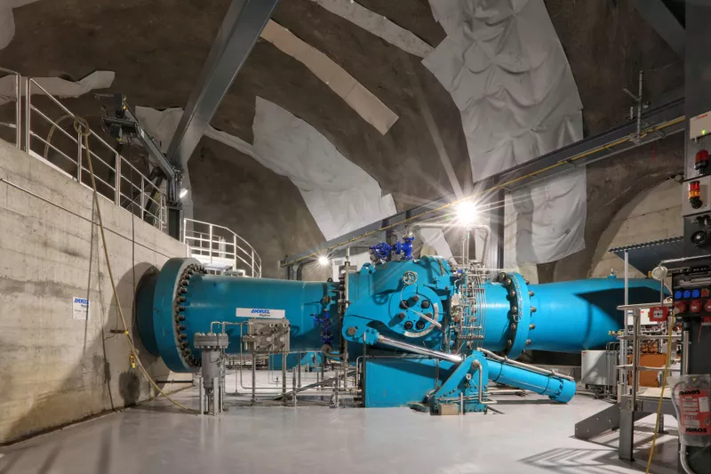

<h1 align="left">
  <br>
  
  <br>
  Industrial Automation Base
  <br>
</h1>

Cours AutB

Author: [Cédric Lenoir](mailto:cedric.lenoir@hevs.ch)

# Module 09-1 Elements mechatronics

Ce modules est constitué de trois partie.
-   Une introduction aux principaux types d'actuateurs par type de vecteur d'énergie.
-   [Une introduction au système de pilotage des moteurs](README_DriveHw.md), avec un accent particulier sur ceux du laboratoire d'automation de la HEVS.
-   [Une introduction aux différents paramètres des commandes de moteur](README_DriveSoft.md) du laboratoire d'automation de la HEVS.

## Introduction
Dans la suite du cours, nous allons aborder l'utilisation d'un actuateur pneumatique, puis plus en détail des actuateurs électriques.
L'actuateur électrique, en particulier les axes électriques est un élément qui peut rapidement s'avérer compliqués à mettre en oeuvre. Le choix de ce type d'actuateur permettra en particulier de renforcer la compétence en programmation robuste et d'utiliser dans la pratique quelques éléments du PackML.

## Les principaux vecteurs d'énergie en automation.
-   Electricité, on parle d'énergie électrique.
-   Air, on parle d'énergie pneumatique.
-   Huile, on parle d'énergie hydraulique.

### Parts de marché des actuateurs électriques vs pneumatiques

**Selon Copilot**, source inconnue.

Les actuateurs électriques et pneumatiques occupent des parts de marché différentes en fonction des industries et des applications. Voici une vue d'ensemble :

- **Actuateurs électriques** :  
    - Représentent environ 30-40% du marché global des actuateurs.  
    - Utilisés principalement dans des applications nécessitant une grande précision, un contrôle complexe, ou une efficacité énergétique élevée.  
    - En croissance rapide grâce à l'essor de l'automatisation avancée et des technologies IoT.

- **Actuateurs pneumatiques** :  
    - Représentent environ 50-60% du marché global des actuateurs.  
    - Prisés pour leur simplicité, leur coût initial faible, et leur robustesse dans des environnements industriels exigeants.  
    - Dominent encore dans les applications nécessitant des mouvements rapides et répétitifs.

**Ces chiffres peuvent varier selon les régions et les secteurs industriels**, mais la tendance générale montre une adoption croissante des actuateurs électriques en raison de leur flexibilité et de leur efficacité.

---

## Actuateurs pneumatiques
L'actuateur pneumatique est sans doute la raison d'être principale de ce module. Il n'est pas exclu que cette technologie soit totalement inconnue pour une partie des lecteurs alors qu'elle représente encore au moment de l'écriture de ce document, soit en 2025, la majorité est actuateurs utilisés dans l'industrie.

### Les principaux types d'actuateurs pneumatiques

Les actuateurs pneumatiques se déclinent en plusieurs types, chacun adapté à des applications spécifiques. Voici les principaux :

- **Vérins pneumatiques linéaires** :  
    - Produisent un mouvement linéaire.  
    - Utilisés pour des tâches telles que le levage, le déplacement ou le positionnement.  

<div align="center">
    <a href="https://www.schunk.com">
        
    </a>
    <p><em>Pince pneumatique Schunk MPG-plus 40</em></p>
</div>

- **Vérins pneumatiques rotatifs** :  
    - Produisent un mouvement rotatif.  
    - Idéaux pour des applications nécessitant une rotation limitée, comme le serrage ou le pivotement.  

- **Vérins sans tige** :  
    - Fournissent un mouvement linéaire sans tige externe.  
    - Prisés pour les applications où l'espace est limité.  

- **Pinces pneumatiques** :  
    - Conçues pour saisir et relâcher des objets.  
    - Utilisées dans des systèmes de manipulation ou d'assemblage.  

- **Amortisseurs pneumatiques** :  
    - Absorbent les chocs et vibrations.  
    - Souvent utilisés pour protéger les équipements sensibles. 

- **Préhenseurs de type vacuum** :  
    - Utilisent une aspiration pour saisir des objets.  
    - Idéaux pour manipuler des objets plats ou fragiles, comme des feuilles de verre ou des plaques métalliques.  
    - Couramment utilisés dans les systèmes de manutention automatisés.  
  
-   **Préhenseurs de type Bernoulli**
    -   Les préhenseurs de type Bernoulli utilisent le principe de Bernoulli pour générer une force de levage grâce à un flux d'air. Ce type de préhenseur est particulièrement adapté pour manipuler des objets légers et fragiles.
    -   Fonctionnement
        -   **Principe** : Un flux d'air est dirigé à travers une surface spécialement conçue, créant une zone de basse pression qui soulève l'objet.
    - Avantages  
        - **Aucun contact direct avec l'objet**, réduisant les risques de dommages.  
        - Idéal pour manipuler des objets plats ou poreux, comme des feuilles de papier ou des composants électroniques.  
    - Limites :  
      - Moins efficace pour des objets lourds ou non plats.

    -   Applications
        - **Industrie électronique** : Manipulation de circuits imprimés.  
        - **Industrie alimentaire** : Déplacement d'emballages légers.  
        - **Imprimerie** : Manipulation de feuilles de papier ou de carton.

<div align="center">
    <a href="https://www.festo.com/media/video/en/products/Bernoulli_en_HD_Copyright_fox.mp4">
        
    </a>
    <p><em>Bernoulli Gripper</em></p>
</div>

<div align="center">
        
    <p><em>Bernoulli Gripper Principle Source: ResearchGate</em></p>
</div>

#### Les vannes pneumatiques

> Les vannes proportionnelles sont beaucoup utilisées dans l'industrie chimique, en particulier dans les environnements où les risques d'explosion sont importants. On parle de zone Ex ou ATEX. 

Les vannes pneumatiques jouent un rôle essentiel dans le contrôle des actuateurs pneumatiques. Elles permettent de réguler le débit, la direction et la pression de l'air comprimé. Voici les principaux types de vannes pneumatiques :

- **Vannes 2/2** :  
        - Possèdent deux orifices et deux positions.  
        - Utilisées pour ouvrir ou fermer un passage d'air.  

- **Vannes 3/2** :  
        - Possèdent trois orifices et deux positions.  
        - Souvent utilisées pour contrôler des vérins à simple effet.  

- **Vannes 5/2** :  
        - Possèdent cinq orifices et deux positions.  
        - Conçues pour piloter des vérins à double effet.  

- **Vannes 5/3** :  
        - Possèdent cinq orifices et trois positions.  
        - Permettent des fonctions avancées comme le maintien en position ou l'échappement de l'air.  

- **Vannes proportionnelles** :  
        - Permettent un contrôle précis et continu du débit ou de la pression.  
        - Utilisées dans des applications nécessitant une régulation fine.  

#### Cas d'utilisation avec pince pneumatique.
Les cellues du laboratoire d'automation de la HEVS sont équipées d'une pince d'origine Schunk pilotée par un distributeur Festo.


<div align="center">
    <a href="https://www.schunk.com">
        
    </a>
    <p><em>Pince pneumatique Schunk MPG-plus 40</em></p>
</div>

<div align="center">
    <a href="https://www.schunk.com">
        
    </a>
    <p><em>Capteur de position programmable IO-Link</em></p>
</div>

<br>

<div align="center">
    <a href="https://www.festo.com">
        
    </a>
    <p><em>Distributeur Festo 5/2</em></p>
</div>

Avec le croquis suivant.

Pour comprendre le fonctionnement, se reporter aux démos disponibles via la [documentation Festo en annexe](./documentation/Festo_Distributeurs%20a%20voies%20multiples_FR.pdf), ou directement dans le répertoire **pneumatic_demos** de ce module.

Le préhenseur Schunk correspond à un vérin de ce type: ``./pneumatic_demos/5-2 DSBC.exe``.

<div align="center">
    <a href="https://www.festo.com">
        
    </a>
    <p><em>Distributeur Festo 5/2</em></p>
</div>

On aurait pu y ajouter une restriction en sortie pour limiter la vitesse de fermeture de la pince.

<div align="center">
    <a href="https://www.festo.com">
        
    </a>
    <p><em>Restriction Festo 5/2</em></p>
</div>

Avec le croquis suivant:

<div align="center">
    <a href="https://www.festo.com">
        
    </a>
    <p><em>Restriction Festo 5/2</em></p>
</div>

> Pour ceux qui ne connaitraient pas l'entreprise [Festo](https://www.festo.com), ne pas hésiter à s'y référer pour toute référence d'éléments didactiques. C'est probablement la meilleure source d'information possible dans ce domaine.

> Une [introduction se trouve en annexe](./documentation/Festo_Distributeurs%20a%20voies%20multiples_FR.pdf). Je n'ai malheuresement pas trouvé l'équivalent de ce document en allemand, même si [Festo](https://www.festo.com) est une entreprise d'origine allemande.

### Éléments d'un Circuit Pneumatique

Un circuit pneumatique est composé de plusieurs éléments essentiels pour assurer son bon fonctionnement. Voici les principaux composants :

##### 1. Traitement de l'Air
- **Compresseur** : Génère l'air comprimé nécessaire au fonctionnement du système.
- **Filtre** : Élimine les impuretés et l'humidité de l'air comprimé.
- **Régulateur de pression** : Maintient une pression constante dans le circuit.
- **Lubrificateur** : Ajoute une fine couche d'huile à l'air comprimé pour lubrifier les composants.

##### 2. Actionneurs
- **Vérin simple effet** : Utilise l'air comprimé pour effectuer un mouvement dans une seule direction, avec un ressort pour le retour.
- **Vérin double effet** : Utilise l'air comprimé pour effectuer des mouvements dans les deux directions.
- **Moteur pneumatique** : Convertit l'énergie de l'air comprimé en mouvement rotatif.

##### 3. Distributeurs
- **Régulateurs 3/2** : Contrôlent les vérins simple effet.
- **Régulateurs 5/2** : Contrôlent les vérins double effet.
- **Régulateurs 5/3** : Permettent un contrôle plus complexe avec trois positions.

##### 4. Conduites et Raccords
- **Tuyaux** : Acheminent l'air comprimé entre les différents composants.
- **Raccords** : Connectent les tuyaux aux composants du circuit.

##### 5. Accessoires
- **Silencieux** : Réduisent le bruit des échappements d'air.
- **Capteurs** : Détectent les positions ou pressions pour le contrôle automatisé.
- **Vannes de coupure** : Permettent d'isoler une partie du circuit pour maintenance.

Ces éléments, combinés de manière appropriée, permettent de concevoir des circuits pneumatiques adaptés à une grande variété d'applications industrielles.

> Attention! **Contrairement à ce qui pourrait être pensé de prime abord, l'énergie pneumatique n'est pas forcément une énergie écologique.** Elle est relativement honéreuse. Il faut actionner en permanence un compresseur, de plus, l'air sera en général lubrifiée, ce qui laissera en fin de cycle passablement d'huile dans l'environnement.

#### Schéma d'un Circuit Pneumatique

Voici une illustration typique d'un circuit pneumatique, depuis le compresseur jusqu'au vérin :

<div align="center">


</div>

#### Les vannes de régulation
Il suffit de consulter un diagramme P&ID pour constater que souvent, les vannes de régulation pneumatiques sont les éléments les plus courants pour un processus.

<div align="center">
    
    <p><em>Vannes et diagramme P&ID</em></p>
</div>

<div align="center">
    <a href="https://www.samsongroup.com">
        
    </a>
    <p><em>Vanne de régulation d'origine Samson</em></p>
</div>

##### Principe d'une Vanne de Régulation

###### Fonctionnement
- **Positionnement** : La vanne est équipée d'un actionneur (pneumatique, électrique ou hydraulique) qui ajuste la position de l'obturateur pour contrôler le passage du fluide.
- **Signal de commande** : Un signal (souvent 4-20 mA ou pneumatique) est envoyé à l'actionneur pour déterminer la position de la vanne.
- **Rétroaction** : Des capteurs intégrés ou externes mesurent les paramètres du fluide et ajustent la vanne en temps réel pour maintenir les conditions souhaitées.

###### Types d'Obturateurs
- **Globe** : Offre une régulation précise, souvent utilisé pour les applications nécessitant un contrôle fin.
- **Papillon** : Adapté aux grands débits avec une perte de charge réduite.
- **Vanne à bille** : Idéale pour des applications nécessitant une ouverture/fermeture rapide.
- **Diaphragme** : Utilisée pour les fluides corrosifs ou les environnements stériles.

###### Applications
- **Industrie chimique** : Contrôle des réactions chimiques en ajustant les flux de réactifs.
- **Traitement de l'eau** : Régulation des débits dans les systèmes de filtration ou de distribution.
- **Énergie** : Gestion des fluides dans les centrales thermiques ou hydrauliques.

###### Schéma Simplifié

<div align="center">


</div>

<br>

<div align="center">
    <a href="https://www.sart-von-rohr.fr">
        
    </a>
    <p><em>Vannes de régulation d'origine Source: Sart von Rohr</em></p>
</div>

---

## Actuateur hydraulique
Les actuateurs hydrauliques ne représentent qu'une petite partie des actionneurs sur le marché. Il existe toutefois au moins deux secteurs d'actvité dans notre région oû l'on peut retrouver ce type de vérins hydrauliques.

Dans une centrale de turbinage, ici l'usine de Veytaux:

<div align="center">
        
    <p><em>Vérin hydraulique Source: Sika</em></p>
</div>

Dans une installation de remontée mécanique, pour tendre le câble.

<div align="center">
        
    <p><em>Vérin hydraulique Source: www.aixhydro.fr</em></p>
</div>

### Éléments d'un Circuit de Commande Hydraulique

Un circuit de commande hydraulique utilise un fluide, généralement de l'huile, pour transmettre de l'énergie et actionner des composants tels que des vérins ou des moteurs hydrauliques. Voici les principaux éléments d'un tel circuit :

#### 1. Source d'Énergie
- **Pompe hydraulique** : Génère le débit d'huile nécessaire au fonctionnement du système.
- **Réservoir** : Contient l'huile hydraulique et permet son refroidissement et sa décantation.

#### 2. Traitement du Fluide
- **Filtre hydraulique** : Élimine les impuretés pour protéger les composants.
- **Refroidisseur** : Maintient la température de l'huile dans une plage acceptable.
- **Indicateur de niveau et de température** : Permet de surveiller l'état de l'huile.

#### 3. Actionneurs
- **Vérin hydraulique** : Convertit l'énergie hydraulique en mouvement linéaire.
- **Moteur hydraulique** : Convertit l'énergie hydraulique en mouvement rotatif.

#### 4. Distributeurs
- **Distributeurs 4/3** : Permettent de contrôler les vérins double effet avec trois positions (avance, arrêt, retour).
- **Distributeurs proportionnels** : Offrent un contrôle précis du débit et de la pression.

#### 5. Conduites et Raccords
- **Tuyaux hydrauliques** : Acheminent l'huile entre les composants.
- **Raccords** : Assurent l'étanchéité et la connexion des conduites.

#### 6. Régulation et Sécurité
- **Soupape de décharge** : Protège le circuit contre les surpressions.
- **Régulateur de débit** : Contrôle la vitesse des actionneurs.
- **Accumulateur hydraulique** : Stocke de l'énergie pour des besoins ponctuels ou en cas de coupure.

#### 7. Accessoires
- **Manomètres** : Mesurent la pression dans le circuit.
- **Vannes d'isolement** : Permettent de couper une partie du circuit pour maintenance.
- **Capteurs** : Détectent les positions ou pressions pour le contrôle automatisé.

Ces éléments, correctement dimensionnés et assemblés, permettent de concevoir des circuits hydrauliques adaptés à des applications variées, notamment dans l'hydraulique mobile comme les engins de chantier ou les équipements agricoles.

### Pilotage
Il existe des drives capables de piloter une pression via une pompe hydraulique et un déplacement, qui au niveau de l'interface permettent de piloter un vérin hydraulique plus ou moins de la même manière que des drives pour les axes électriques que nous verrons un peu plus en détail ci-dessous. Il existe d'ailleurs une série de bloques fonctionnels normalisés pour ce genre d'application: [Function Blocks for Motion Control Part 6 – Fluid Power Extensions](./documentation/plcopen_motion_control_part_6_version_2.0.pdf)

<div align="center">
    <a href="https://www.boschrexroth.com/en/ch/connected-hydraulics/products/cytroforce/">
        
    </a>
    <p><em>Rexroth Cytroforce, vérin hydraulique</em></p>
</div>

## Schéma d'un Circuit Hydraulique

Voici une illustration typique d'un circuit hydraulique, depuis la pompe hydraulique jusqu'au vérin :


Ce schéma montre les principaux composants d'un circuit hydraulique et leur interconnexion. La pompe hydraulique génère le débit d'huile, qui est filtré avant d'être dirigé vers le distributeur. Le distributeur contrôle le mouvement du vérin hydraulique, tandis que l'huile retourne au réservoir pour être refroidie et réutilisée.

---

## Actuateurs, axes électrique
Lors des laboratoires N°5, 6 et 7 nous allons utiliser des axes électriques. Outre le pilotage d'un ensemble mécatronique, cela poursuit plusieurs objectfis.

-   Introdution intuitive à un système de régulation complexe.
-   Gestion d'un système complexe grâce à une programmation robuste.
-   Introduction simple aux systèmes multi-axes.

### Préambule
Nous présentons ici le cas d'axes composés de moteur synchrones, dits aussi à aimants permanents ou PMSM : Permanent Magnet Synchronous Motor, pilotés en position.

Du point de vue de contrôle depuis un PLC, le pilotage d'un moteur en vitesse, en fréquence, voir simplement via un contacteur pose en général nettement moins de problèmes.

### Pilotage d'un Moteur à Aimants Permanents avec PLCopen et EtherCAT

#### Introduction
Le pilotage d'un moteur à aimants permanents repose sur une chaîne de contrôle intégrant des technologies avancées comme PLCopen pour la programmation et EtherCAT pour la communication en temps réel. Cette combinaison permet un contrôle précis et efficace des moteurs dans des applications industrielles.

---

#### Principe de Fonctionnement

1. **Moteur à Aimants Permanents** :
    - Le PMSM utilise des aimants permanents pour générer un champ magnétique dans le rotor, éliminant ainsi le besoin d'excitation externe.
    - Il est piloté par un onduleur qui génère des signaux de tension triphasés pour contrôler le couple et la vitesse.

2. **PLCopen** :
    - PLCopen est une norme pour la programmation des automates industriels, basée sur la norme IEC 61131-3.
    - Elle fournit des blocs fonctionnels standardisés pour le contrôle des mouvements, comme le positionnement, la vitesse et le couple.
    - Ces blocs fonctionnels simplifient l'intégration et le pilotage des moteurs à aimants permanents.
  
PLCopen permet de piloter selon le même principe un vaste gamme de moteur, de quelques watts, à plusieurs dizaines de kilowatts, le principe reste le même. Y compris, comme on l'a vu ci-dessus, pour certaines gammes d'axes hydrauliques.

<div align="center">
    <a href="https://www.maxongroup.com">
        
    </a>
    <p><em>Drive EPOS4 Compact EtherCAT d'origine Maxon</em></p>
</div>

<div align="center">
    <a href="https://www.maxongroup.com">
        
    </a>
    <p><em>Moteur et réducteur d'origine Maxon</em></p>
</div>

3. **EtherCAT** :
    - EtherCAT est un protocole de communication en temps réel, idéal pour les applications nécessitant une synchronisation précise.
    - Il permet une communication rapide et fiable entre le contrôleur (PLC) et les variateurs de moteur.
    - Les données de commande (vitesse, couple, position) et de retour (courant, position réelle) sont échangées en temps réel.
  
EtherCAT est probablement le bus de terrain le plus utilisé en Suisse Romande pour piloter des moteurs. Ce bus est conçu au départ pour ce genre d'application. Dans le cas des cellules d'automation de la HEVS, la communication entre 2 drives se fait via EtherCAT qui envoie une position depuis la commande principale de l'axe X aux deux axes Y et Z toutes les 2 [ms]

<div align="center">
    
    <p><em>EtherCAT dans le laboratoire d'automation de la HEVS</em></p>
</div>

#### Étapes de Pilotage

1. **Configuration du Système** :
    - Définir les paramètres du moteur (puissance, couple nominal, vitesse maximale).
    - Configurer l'onduleur et le variateur pour le moteur à aimants permanents.
    - Paramétrer le réseau EtherCAT pour inclure tous les nœuds (PLC, variateur, capteurs).

2. **Ajuster les paramètres des axes** 
    - Implémenter des boucles de contrôle PID pour ajuster la vitesse ou le couple en fonction des besoins.

3. **Programmation avec PLCopen** :
    - Utiliser des blocs fonctionnels comme `MC_Power`, `MC_MoveVelocity`, ou `MC_MoveAbsolute` pour contrôler le moteur.

4. **Communication via EtherCAT** :
    - Synchroniser les signaux de commande et de retour entre le PLC et le variateur.
    - Assurer une faible latence pour un contrôle précis du moteur.

5. **Exécution et Surveillance** :
    - Lancer le programme PLCopen pour piloter le moteur.
    - Surveiller les performances en temps réel via EtherCAT (vitesse, couple, température).

> **Attention**, la mise en service de moteurs, codeurs et variateurs de différents constructeurs peut s'avérer une tâche complexe.
---

#### Avantages de cette Approche
- **Précision** : Contrôle précis de la vitesse et du couple grâce à PLCopen et EtherCAT.
- **Réactivité** : Communication en temps réel pour des ajustements rapides.
- **Interopérabilité** : Utilisation de normes ouvertes pour une intégration facile avec différents équipements.

---

#### Exemple de Code PLCopen

Voici un exemple de code pour piloter un moteur à aimants permanents avec PLCopen :

```iecst
// Get access to the axis
VAR_GLOBAL
	X_Axis: MB_AXISIF_REF := (AxisName := 'Axis_x', AxisNo := 1);
END_VAR
```

```iecst
PROGRAM Main
VAR
	mcReadActualPos  : MC_ReadActualPosition;
	mcReadStatus     : MC_ReadStatus;
	mcPower          : MC_Power;
	mcMoveAbs        : MC_MoveAbsolute;
END_VAR

//
//	Axis code abstract, call to FB only
//
mcReadStatus(Axis := X_Axis,
             Enable := TRUE);

mcReadActualPos(Axis := X_Axis,
                Enable := TRUE,
                Position => absIsPosition);

mcPower(Axis := X_Axis,
		Enable := NOT (actualState = E_PackState.eAborted));

mcMoveAbs(Axis := X_Axis,
          Velocity := stSetParam.rVelocity_m_s,
          Acceleration := stSetParam.rAcceleration_m_s2,
          Deceleration := stSetParam.rDeceleration_m_s2,
          Jerk := stSetParam.rJerk_m_s3); 

mcMoveAbs.Execute := (axisExecute = E_AxisExecute.eSetAbsolutePosition) OR
                     (axisResetting = E_AxisResetting.eMotionInit)      OR
                     (axisStarting = E_AxisStarting.eMotionStarting);
```

---


[Le drive du point de vue de sa connection vers le monde extérieur](README_DriveHw.md)
